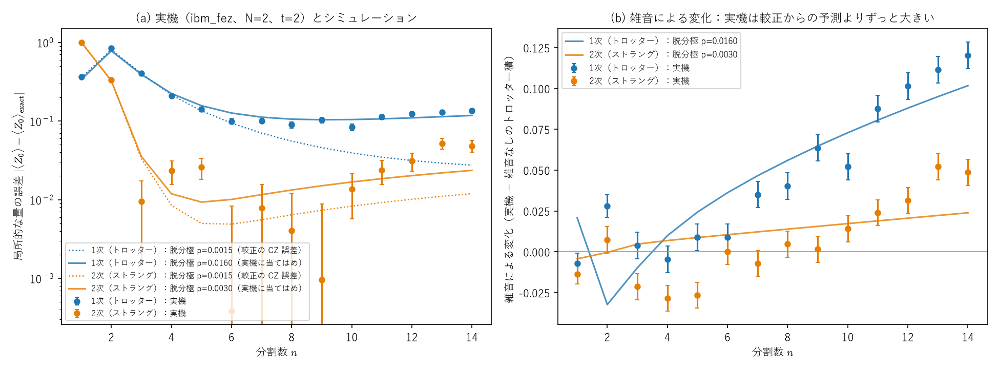
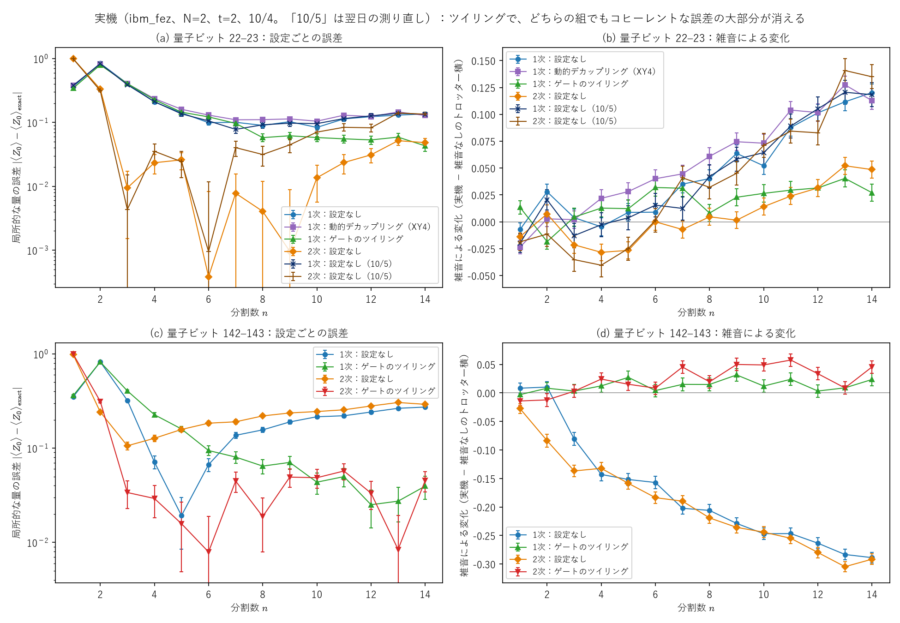
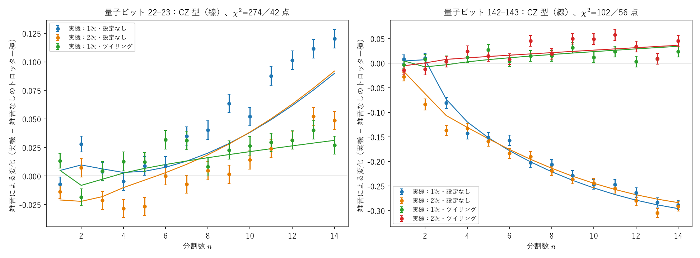
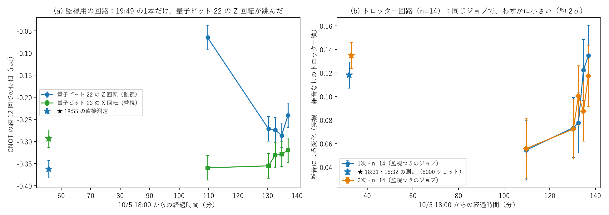
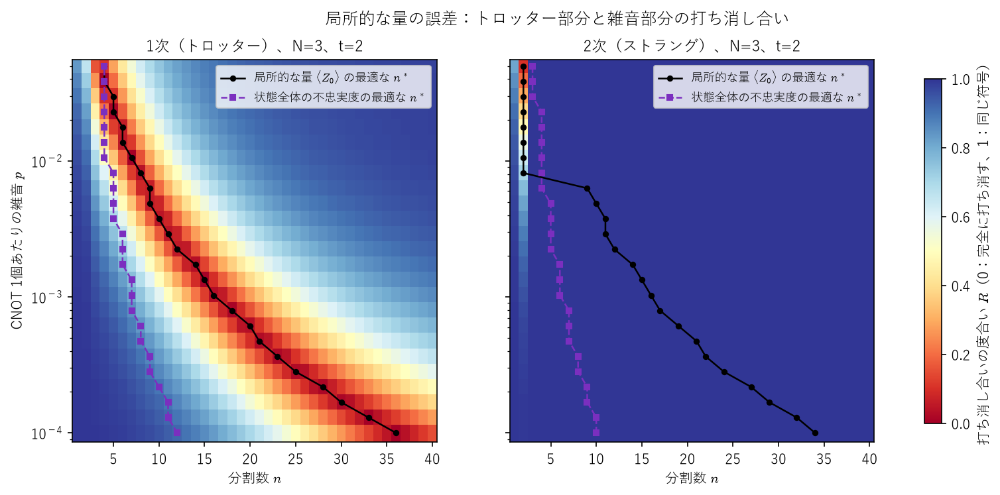

# A-5 トロッター誤差と雑音の綱引き ―最適な分割数を予測して測る

`docs/research_ideas.md` のテーマ A-5 の計算一式です。ノートブックは作らず、**ライブラリ＋テスト（反例探し）＋CSV** で進めています。理論は[行列の指数関数と交換子のノート](../../研究ノート/04_群論・代数/matrix_exponential_commutator_bch_trotter.md)の Part VI。用語（イジング模型、CNOT による ZZ、確率的な誤差とコヒーレントな誤差、ツイリング）の解説は[トロッター実験を読むための翻訳](../../研究ノート/05_量子力学/trotter_experiment_translation.md)。

## 問い

トロッター分解は分割数 $n$ を増やすほど誤差が減る（1次で $\propto1/n$、ストラング分解で $\propto1/n^2$）。しかし実機では $n$ に比例してゲートが増え、雑音が積み重なる。**最適な $n$ はどこにあり、何で決まるか。** 誤差を $\frac a{n^q}+b\,p\,n$（$p$ は CNOT 1個あたりの雑音）とモデル化すると、$n^*=\big(\frac{qa}{bp}\big)^{1/(q+1)}$ と予測できる。

## 模型

$N$ スピンの横磁場イジング模型（開いた鎖）$H=\sum_iZ_iZ_{i+1}+\sum_iX_i$、初期状態 $|00\cdots0\rangle$、時刻 $t=2$。1ステップに ZZ の項ごとに CNOT 2個、各 CNOT の後に2量子ビットの脱分極雑音（強さ $p$）。密度行列で正確に計算（雑音のサンプリングなし）。誤差は2通りで測る：

- `infidelity`：状態全体の不忠実度 $1-\langle\psi_{\text{exact}}|\rho|\psi_{\text{exact}}\rangle$
- `local_err`：局所的な量の誤差 $|\langle Z_0\rangle_\rho-\langle Z_0\rangle_{\text{exact}}|$（実機で測りやすい）

## ファイル

| ファイル | 中身 |
|---|---|
| `trotter_noise.py` | 模型、トロッター積、脱分極雑音、誤差の上限、1点の計算 `run_point` |
| `sweep.py` | 条件を変えて計算し、`results/*.csv` と `*.meta.json`（実行の記録）に出力 |
| `analyze.py` | CSV から実際の $n^*$ とモデルの予測を求め、`*_optimum.csv` に出力（指標：`infidelity`・`trace_dist`・`local_err`） |
| `large_n.py` | 大きな $N$ 用の状態ベクトル計算（ZZ は位相、横磁場は1量子ビットの回転、正確な時間発展は `expm_multiply`、雑音は軌跡法）。$N=20$ で雑音なし1点が約40秒 |
| `aer_check.py` | Qiskit Aer の密度行列シミュレータで、実際の回路（CNOT・RZ・CNOT、雑音は CNOT ごと）から最適な $n^*$ を求める（独立した検証） |
| `summary_figures.py` | まとめの記事用の図（誤差の曲線、$n^*$ と $p$）を既存の CSV から作る |
| `article_draft.md` | まとめの記事の下書き（技術ブログ・研究会の発表向け） |
| `hardware.py` | IBM の実機に回路を送り、読み出しの補正つきで $\langle Z_0\rangle$ を測る（投げる前に CZ の数を確認、`--dry-run` あり）。結果は `results/hardware_*.csv` と実行記録 `*.json` |
| `hardware_analyze.py` | 実機の結果とシミュレーションを比べる図と、実効的な脱分極の強さの当てはめ |
| `backend_noise_sim.py` | 実機の較正データから作った雑音モデル（`AerSimulator.from_backend`）で、同じ変換済みの回路を計算 |
| `noise_model_fits.py` | 1組のパラメータで実機の1次・2次を同時に説明する雑音モデルを探す（脱分極・回転角のずれ・余分な $Z$ 回転） |
| `hardware_zprobe.py` | 実機で、CNOT の組（理想では恒等）のくり返しで各量子ビットにたまる余分な $Z$ 回転を、$X$・$Y$ 基底の測定から直接測る（`--x-axis` で標的の $X$ 軸まわりの回転も、`--qubits` で量子ビットの組も指定できる） |
| `hardware_compare.py` | 実機の結果を、量子ビットの組・実行時の設定（なし・動的デカップリング・ゲートのツイリング）・次数ごとに比べる図と表 |
| `hardware_monitor.py` | 監視用の回路（チェック標準）の試運転：1本のジョブに監視用の回路・トロッター回路・読み出しの較正を混ぜ、時間をおいて何本か投げる。利用時間の上限つき |
| `hardware_monitor_plot.py` | 監視用の回路の結果を、実際の実行時刻に沿って描く |
| `coherent_fits.py` | CNOT ごとのコヒーレントな誤差のモデルを、ツイリングなし・ありの実機のデータに同時に当てはめる（ツイリングありでは、同じ誤差をパウリ通路に置き換える）。Z の直接測定は当てはめに使わず、予測と比べる |
| `cancellation_map.py` | 局所的な量の打ち消し合いの度合いを $(n,p)$ の平面で計算し、CSV と図（`figures/`）に出力 |
| `exponents.py` | `analyze` の結果から、$n^*\propto p^s$ の指数 $s$ を指標・次数ごとに当てはめ、`*_exponents.csv` に出力 |
| `tests/test_trotter_noise.py` | 反例探し（下の表） |
| `results/` | 計算結果の CSV |

```bash
uv run pytest experiments/a5_trotter_noise -q
uv run python experiments/a5_trotter_noise/sweep.py --qubits 2 3 4 5 6 --ps 0 0.001 0.002 0.005 0.01 0.02 --nmax 40 --out experiments/a5_trotter_noise/results/sweep_N2-6.csv
uv run python experiments/a5_trotter_noise/analyze.py experiments/a5_trotter_noise/results/sweep_N2-6.csv
```

## テスト（反例探し）

| テスト | 主張 | 結果 |
|---|---|---|
| `test_trotter_bound_random_hermitian` | ランダムなエルミート行列400組で、誤差 ≤ 上限（1次：$\frac{t^2}{2n}\lVert[A,B]\rVert$、2次：$\frac{t^3}{n^2}(\frac{\lVert[M,[M,O]]\rVert}{12}+\frac{\lVert[O,[O,M]]\rVert}{24})$） | 反例なし。誤差/上限の最大は 1次 0.997、2次 0.948（上限はほぼぎりぎりまで達する） |
| `test_trotter_bound_single_step_is_tight_order` | 1ステップの誤差の次数が 2（1次）・3（2次） | 成立 |
| `test_telescoping_inequality` | $\lVert U^n-V^n\rVert\le n\lVert U-V\rVert$（$\lVert U\rVert,\lVert V\rVert\le1$） | 反例なし |
| `test_depolarizing_is_cptp_like` | 雑音の通路がトレース・エルミート性・正定値性を保つ | 成立 |
| `test_matches_qiskit_synthesis` | 自前のトロッター積が Qiskit の `LieTrotter`・`SuzukiTrotter` と一致（N=2,3） | 成立 |
| `test_optimal_n_decreases_with_noise` | 雑音を強くすると $n^*$ は増えない（N=2） | 成立 |
| `test_strang_needs_fewer_steps` | ストラング分解の $n^*$ と最小誤差はトロッター分解以下（N=2） | 成立 |
| `test_global_infidelity_follows_model` | 不忠実度では、予測 $n^*$ が実際と2以内で合い、$q\approx2\times$次数（N=2〜5） | 成立（N=3 の1次だけ $q\approx2.4$〜$2.5$） |
| `test_local_observable_order_symmetry` | $\langle Z_0\rangle$ は A と B の順を入れ替えても同じ | 反例なし |
| `test_known_counterexamples_local_observable` | **見つかった反例を固定**（下の結果 3・4） | 反例が存在することを確認 |
| `test_local_error_decomposition_identity` | 局所的な量の誤差 = \|トロッター部分 + 雑音部分\|（符号つき） | 成立 |
| `test_noise_does_not_always_shrink_toward_zero` | **反例の固定**：「雑音は ⟨Z_0⟩ を必ず 0 に近づける」は成り立たない | 反例あり（N=5、2次、p=0.02、n=3） |
| `test_lie_local_optimum_is_a_cancellation_point` | 1次・局所的な量の最適点は、2つの部分が逆符号で3割未満まで打ち消し合う点 | 成立（N=3、p=0.001〜0.02） |
| `test_first_order_coefficient_formula` | 導出した1次の係数 $c_1$ の式が、数値（誤差 × $n/t$）と一致 | 成立（ランダムな積状態・観測量） |
| `test_layden_condition_gives_zero_first_order` | $O$ が ZZ の項と交換し、初期状態が計算基底なら $c_1=0$ | 反例なし |
| `test_time_reversal_hypothesis_is_false` | **反例の固定**：「すべて実数なら $c_1=0$」は成り立たない | 反例あり（実数の積状態で $c_1\approx0.014$） |
| `test_small_c1_of_real_states_is_specific_to_N3_t2` | 実数の状態で $c_1$ が小さかったのは $N=3$・$t=2$ の偶然（共通の零点が $t=1.9$〜$2.2$ にある、他の時刻では5倍以上） | 成立 |
| `test_exponent_depends_on_metric` | モデルの $n^*\propto p^s$ の指数が、指標・次数で予想どおり（0.04 以内） | 成立 |
| `test_lie_has_cancellation_valley_strang_does_not` | 1次には打ち消し合いの谷がある、2次は $n\ge3$ で打ち消し合わない | 成立 |
| `test_large_n_statevector_matches_dense` | 大きな $N$ 用のゲートの形の計算が、密度行列側の行列と一致 | 成立 |
| `test_trajectories_match_density_matrix` | 軌跡法の平均が、密度行列の値と 4σ 以内で一致（N=3） | 成立 |
| `test_aer_circuit_gives_same_optimum` | Qiskit Aer（実際の回路、雑音は CNOT ごと）でも最適な $n^*$ が同じ（N=4） | 成立 |

## ここまでの結果（2026年10月4日、`results/sweep_N2-6_optimum.csv`）

1. **状態全体の不忠実度は、モデルどおり**：$q\approx2$（1次）・$4$（2次）で、予測 $n^*$ は実際とほぼ一致。不忠実度は誤差の2乗なので、$n^*\propto p^{-1/3}$（1次）・$p^{-1/5}$（2次）になる。
2. **$n^*$ は系の大きさ $N$ にほとんどよらず、最小誤差だけが $N$ とともに悪くなる**（不忠実度、$N\ge4$）。例：$p=0.001$ の1次で $n^*=11$〜$12$（N=4〜8）、最小誤差は 0.074（N=4）→ 0.172（N=8）。2次では $n^*=7$（N=4〜8）。N=3 だけは例外的（1次で $n^*=7$）。N=7・8 は `results/sweep_N7-8.csv`（密度行列で約4分）。
3. **局所的な量 $\langle Z_0\rangle$ では、1次でも誤差が $1/n^2$ で減る**。A と B の順を入れ替えても $\langle Z_0\rangle$ が変わらない対称性があり（テストで確認）、1次の誤差が打ち消し合うため。
4. **局所的な量では、素朴なモデルに反例がある**：
   - ストラング分解で、$p\ge0.01$ のとき $n^*=2$（予測は約 7.5、N=3〜6）。小さい $n$ ではトロッター誤差そのものが $n$ について単調でなく、$n=2$ でたまたま小さくなる（N=3 で $n=2$ のとき −0.017、$n=3$ のとき −0.051）。
   - 「ストラング分解の $n^*$ はトロッター分解以下」も、N=3・$p=0.005$ で破れる（9 対 10）。
   - 1次の最小誤差がとても小さく出る（0.0002 など）のは、トロッター誤差と雑音の効果が符号つきで打ち消し合うため。CSV の `z_trotter_part`（雑音なしのトロッター積の誤差）と `z_noise_part`（雑音による変化）に分けて記録したところ、1次の最適点（N=3 で $n=17,9,5$ など）は、2つが逆符号で互いの大きさの3割未満まで打ち消し合う点だった。つまり、この量の「最適な $n$」は綱引きの釣り合いではなく、偶然の打ち消し合いで決まっている。実機でこの量だけを見ると、最適な $n$ を誤って選ぶおそれがある。
   - 「雑音は $\langle Z_0\rangle$ を必ず 0 に近づける」も成り立たない（720 条件中 18 件の反例。雑音なしの値が 0 に近いとき）。

## 実機（IBM Quantum、2026年10月4日）

`hardware.py` で `ibm_fez`（Heron、量子ビット 22–23、較正の CZ 誤差 0.15%、読み出し誤差 約 0.5%）に、$N=2$・$t=2$ の回路を送り、$\langle Z_0\rangle$ を測った。読み出しの誤差は、全 0・全 1 の較正の回路で補正した。回路の変換は最適化レベル1までにし、CZ の数が $2(N-1)n$ のまま（回路がまとめられていない）ことを投げる前に確かめた。利用時間はパイロット 7 秒＋本番 65 秒×2＝137 秒。続く追加の測定（下の「雑音の正体を絞り込む」「別の量子ビットの組での再現」「翌日の測り直し」）を含めて、合計 **586 秒**（Open Plan の 10 分のうち）。

> **翌日の測り直しによる訂正（10月5日）**：下の表と 2・5 の「2次は雑音に強い」「1つの $p$ で1次と2次を説明できない」は、10月4日の2次の実行1本だけに見られた揺らぎによるもので、翌日に1次と2次を続けて測ると、雑音の効き方は同じだった（下の 15）。2次の最小の誤差が小さい（$n=6$ で 0.001 前後）ことは翌日も再現した。

| | 1次（トロッター） | 2次（ストラング） |
|---|---|---|
| 実機の最適な $n^*$（局所的な量） | 10 | 6（$n=6$〜$9$ で統計誤差 ±0.008 以内） |
| 最小の誤差 | 0.084 ± 0.008 | 0.0004 ± 0.008 |
| 較正の CZ 誤差（$p=0.0015$）の脱分極からの予測 $n^*$ | 14（外れ） | 6（当たり） |
| 実機に合う脱分極の強さ $p_{\text{eff}}$（次数ごとに当てはめ） | 0.016（較正の約 11 倍） | 0.003（約 2 倍） |



**分かったこと**

1. 実機では2次の分解が1次より約 10 倍正確だった（シミュレーションと同じ向き、差は実機のほうが大きい）。
2. **1つの「脱分極の強さ」では、1次と2次を同時に説明できない**（同じ量子ビット、1ステップの CZ の数も同じなのに、必要な $p$ が 5 倍違う）。2次の $n=3$〜$5$ では、雑音による変化が**負**（約 −0.027、3σ）で、脱分極なら必ず正になるはずなので、これも脱分極では説明できない。
3. **較正データから作った雑音モデル**（`backend_noise_sim.py`：`AerSimulator.from_backend`。ゲートの脱分極、ゲート中の T1・T2 の緩和、読み出し）でも説明できない。雑音による変化を、1次で実機の約 1/5.5、2次で約 1/2 にしか見積もらず、1次と2次の差も、負の変化も出ない。
4. 1組のパラメータで両方を説明するモデルを探した（`noise_model_fits.py`、28点、統計誤差の範囲で合えば $\chi^2\approx28$）：脱分極だけ $\chi^2=461$、回転角のずれ（ZZ・横磁場）486（改善なし）、量子ビットごとの余分な $Z$ 回転 335（量子ビット 23 に 0.055 rad/ステップ、$p$ は較正どおり 0.0015）。$Z$ 回転（周波数のずれや、周りの量子ビットとの ZZ クロストークの近似）で一部は説明できるが、まだ十分ではない。
5. 実機への示唆：**較正データの CZ 誤差だけで最適な $n$ を見積もると、1次の分解では大きく外れる**。実機の雑音は、回路の構造（1次か2次か）によって効き方が変わる。2次の対称な形は、何らかの誤差をエコーのように打ち消していると考えられるが、その誤差の正体は未確定。

### 雑音の正体を絞り込む（同じ日、同じ量子ビット 22–23）

| 測定 | 内容 | 利用時間 |
|---|---|---|
| $Z$ の直接測定（`hardware_zprobe.py`） | 一方を $\lvert+\rangle$ にし、CX の組を $k=0,2,4,8,12$ 回くり返して、位相 $\arg(\langle X\rangle+i\langle Y\rangle)$ の傾きを測る | 23 秒 |
| 動的デカップリング（`hardware.py --dd XY4`） | 1次の本番と同じ回路。待ち時間に XY4 のパルスを入れる | 65 秒 |
| ゲートのツイリング（`hardware.py --twirl`） | 1次の本番と同じ回路。2量子ビットゲートの前後にランダムなパウリを挟み（32 通り）、コヒーレントな誤差をパウリ雑音（確率的な誤差）に変える | 66 秒 |

| 1次の設定 | 実機の $n^*$ | 最小の誤差 | $n=14$ の雑音による変化 | $p_{\text{eff}}$ |
|---|---|---|---|---|
| なし | 10 | 0.084 ± 0.008 | +0.120 | 0.016 |
| 動的デカップリング（XY4） | 10 | 0.105 ± 0.008 | +0.113 | 0.019 |
| **ゲートのツイリング** | **14** | **0.043 ± 0.008** | **+0.027** | **0.0052** |
| （参考）2次・設定なし | 6 | 0.0004 ± 0.008 | +0.049 | 0.003 |



6. **ゲートのツイリングで、1次の余分な雑音の大部分（約 8 割）が消えた**。$p_{\text{eff}}$ は 0.016 から 0.0052 に下がり、2次の 0.003 に近づいた。最適な $n^*$ も 14 になり、較正の CZ 誤差からの予測（14）と一致した。ツイリングはコヒーレントな誤差だけを確率的な誤差に変える（確率的な誤差の量は変えない）ので、**1次で効いていた余分な雑音の主因は、2量子ビットゲート（CNOT の組）のコヒーレントな誤差**だと考えられる。コヒーレントな誤差はステップごとに同じ向きに積み重なる（振幅で $n$ に比例）。この組では2次の対称な形がそれを打ち消しているように見えたが、別の組では成り立たず（下の 10）、この組でも翌日には成り立たなかった（下の 15）。
7. **動的デカップリングは効かなかった**（むしろわずかに悪化）。待ち時間中の位相のずれ（アイドル中の $Z$ の誤差）は主因ではない。2量子ビットの回路では待ち時間がほとんどないことと合う。
8. **余分な $Z$ 回転は実在する**が、`noise_model_fits.py` の当てはめとは合わない：CX の組1回あたり、量子ビット 22 に −0.027 rad、23 に +0.010 rad（当てはめでは 0.005・0.055）。CX の組だけでもコヒーレンスは $k=12$ で 0.94（22）・0.97（23）まで落ちる。$Z$ 回転だけのモデルは、ゲートのコヒーレントな誤差の一部を近似していたにすぎないと考えられる。

### 別の量子ビットの組での再現（同じ日、量子ビット 142–143）

同じ `ibm_fez` の量子ビット 142–143（較正の CZ 誤差 0.15% は 22–23 と同じ、読み出し誤差 約 0.7%、T2 は 153〜219 μs で 22–23 の約 3 倍）で、1次・2次それぞれ設定なしとツイリングを測った（`hardware.py --qubits 142 143`、各 8000 ショット、統計誤差 約 ±0.011、利用時間 36＋37＋36＋37＝146 秒）。

| 量子ビット 142–143 | 実機の $n^*$ | 最小の誤差 | $n=14$ の雑音による変化 | $p_{\text{eff}}$ |
|---|---|---|---|---|
| 1次・設定なし | 5（打ち消し合い） | 0.019 ± 0.011 | **−0.289** | 当てはまらない（負の変化） |
| 1次・ツイリング | 12 | 0.025 ± 0.011 | +0.024 | 0.003 |
| 2次・設定なし | 3 | 0.106 ± 0.010 | **−0.292** | 当てはまらない（負の変化） |
| 2次・ツイリング | 6 | 0.008 ± 0.011 | +0.046 | 0.006 |

9. **ツイリングの効果は再現した**：どちらの組でも、ツイリングを入れると $n=14$ の雑音による変化は +0.02〜+0.05 になり、較正の約 2〜4 倍の脱分極（$p_{\text{eff}}=0.003$〜$0.006$）で説明できる大きさにそろった。最適な $n^*$ も予測（1次 14、2次 6）に近い（12・6）。
10. **ツイリングなしのコヒーレントな誤差は、組によって大きさも符号も違う**：22–23 では1次だけに正の変化（+0.12）、142–143 では1次・2次の両方に大きな負の変化（−0.29、$\langle Z_0\rangle$ が 0 から遠ざかる。脱分極では起こらない）。したがって「2次の対称な形はコヒーレントな誤差を打ち消す」は一般には成り立たない（22–23 の次数による差も、翌日の測り直しで消えた。下の 15）。較正の CZ 誤差は表示上同じ 0.15% でも、コヒーレントな誤差は組ごとに大きく違う。
11. **実機で、局所的な量の「打ち消し合いによる偽の最適点」が出た**：142–143 の1次・設定なしの最小（$n=5$、誤差 0.019）は、トロッター部分 +0.132 と雑音部分 −0.152 の打ち消し合いで、$n=6$ では誤差が 0.07 に戻る。シミュレーションで見つけた反例（上の「ここまでの結果」4）が、実機のコヒーレントな誤差で実際に起きた例。

### コヒーレントな誤差のモデル（`coherent_fits.py`、実機の時間は使わない）

各 CNOT の直後にコヒーレントな誤差 $E=e^{-i\sum_k\theta_kP_k}$ と脱分極 $p$ を入れたモデルを、組ごとに、ツイリングなし・ありのデータへ**同時に**当てはめた。ツイリングありのデータでは、同じ $E$ をパウリ・ツイリングしたもの（$E=\sum_Pc_PP$ のとき確率 $|c_P|^2$ のパウリ通路）に置き換える。ツイリングは誤差の種類を変えるだけなので、正しいモデルなら同じパラメータで両方に合うはず。

| モデル（CX の直後の誤差） | パラメータ数 | 22–23（42 点） | 142–143（56 点） |
|---|---|---|---|
| $Z$ 位相（$Z_c,Z_t$） | 3 | $\chi^2=430$ | 305 |
| **CZ 型**（$Z_c,X_t,Z_cX_t$：CZ の位相と角度の誤差を CX の枠に移したもの） | 4 | 274 | **102** |
| 一般（$Z_c,Z_t,X_t,Z_cX_t,Z_cZ_t$） | 6 | 245（$p\to0$） | 96 |
| CZ 型＋RX の層ごとの誤差 | 8 | 147（$p\to0$） | 94 |



12. **142–143 は、単純なモデルでほぼ説明できる**：CZ 型で $\chi^2=102$／56 点（統計誤差の約 1.35 倍のずれ）。主な項は $X_t$（CZ の枠では標的側の $Z$ 位相）で、CNOT 1個あたり 0.033 rad、脱分極は $p=0.0035$（較正の約 2.3 倍）。この1つの回転が、ツイリングなしの1次・2次の −0.29 と、ツイリングありの小さな正の変化を、同じパラメータで同時に再現する。
13. **22–23（10/4 の2次を含めた場合）は、どのモデルでも説明できない**（→ 外れた1本を除くと説明できた。下の 17）：パラメータを増やしても $\chi^2$ は点の数の 3.5 倍以上で、脱分極が 0 に張りつく（過剰な当てはめの兆候）。当てはめに使っていない $Z$ の直接測定とも合わない（量子ビット 22 の傾き：実測 −0.027 rad、CZ 型の予測 −0.054、RX の誤差ありの予測 +0.31）。
14. **1次と2次の変換後の回路は、ほとんど同じ**（深さ 172 と 174）。2次は、1次の最後の $X(d)$ を最初に移しただけで、間の回路は同じ。したがって、時間によらない（マルコフ的な）ゲートごとの誤差なら、1次と2次の雑音の効き方は似る（142–143 はそうなっている、モデルの線もほぼ重なる）。22–23 の「1次は +0.12、2次は +0.05」は、この種のモデルの外にある。候補は（翌日の測り直しで前者と分かった。下の 15）、2本のジョブ（1分半の間隔）の間での雑音の揺らぎ（量子ビット 22 の T2 は 50 μs と短く、二準位系の欠陥の揺らぎがありうる）か、文脈に依存する誤差。なお1次は 18 分後の動的デカップリングつきの実行（ほぼ同じ回路）でも同じ値だったので、1次の値は再現している。

### 翌日の測り直し（10月5日、量子ビット 22–23）

14 を確かめるため、22–23 で1次と2次を続けて測った（各 8000 ショット、ジョブの間隔 約 1 分、利用時間 36＋36＝72 秒）。較正の値は前日から変わっていた（CZ 誤差 0.15% → 0.19%、量子ビット 22 の T2 50 → 127 μs）。**測る前の予測**：時間によらないゲートごとの誤差なら、1次と2次の雑音による変化は $n$ の大きいところでほぼ同じ。

| $n=6$〜$14$ の雑音による変化の比較 | $\chi^2$（9 点、統計誤差の範囲で合えば 9 前後） |
|---|---|
| 10/5 の1次 対 10/5 の2次 | **10.4**（同じ） |
| 10/5 の1次 対 10/4 の1次 | **4.4**（日をまたいで再現） |
| 10/5 の2次 対 10/4 の2次 | 160（10/4 の2次だけが外れ） |
| 10/4 の1次 対 10/4 の2次 | 202 |

| 量子ビット 22–23（10/5） | 実機の $n^*$ | 最小の誤差 | $n=14$ の雑音による変化 | $p_{\text{eff}}$ |
|---|---|---|---|---|
| 1次・設定なし | 7 | 0.078 ± 0.011 | +0.118 | 0.016 |
| 2次・設定なし | 6 | 0.001 ± 0.011 | +0.135 | 0.012 |

15. **予測どおり、1次と2次の雑音の効き方は同じだった**。10/4 の2次の実行（1本）だけが、$n\ge8$ で雑音による変化が小さく外れていた。1次の値は、10/4 の2本（設定なし、18 分後の動的デカップリングつき）と 10/5 の計3本で一致したので、外れていたのは 10/4 の2次のほうである。**「2次の対称な形がコヒーレントな誤差を打ち消す」という 5・6 の解釈は誤り**で、1回のジョブの中での雑音の揺らぎ（原因は不明。量子ビット 22 の T2 が日によって 2.5 倍変わるような揺らぎがある）を、回路の構造の効果と取り違えていた。1回の実行で結論を出さない、という教訓。
16. **2次の最小の誤差が小さいことは再現した**（$n=6$ で 0.001）。これは雑音への強さではなく、トロッター誤差そのものが小さい（$n=6$ で 0.0005）ためで、$n$ が小さいので雑音もまだ小さい。
17. **外れた1本を 10/5 の2本に置き換えると、22–23 も 142–143 と同じ CZ 型のモデルで説明できる**（`coherent_fits.py` の「22–23（2日目）」、ツイリングありは 10/4 の1次）：CZ 型で $\chi^2=68$／42 点（1点あたり 1.6、142–143 は 1.8）。パラメータを増やしても 67（一般）・63（RX の誤差つき）とほとんど改善しない。主な項は $Z_c=-0.017$、$X_t=+0.018$、$Z_cX_t=-0.011$ rad、$p=0.0046$（較正の約 2.4 倍）。2組とも「CNOT ごとの小さなコヒーレントな回転＋較正の 2〜3 倍の脱分極」という同じ形で説明でき、違うのは回転の向きと大きさだけ。
18. ただし、**$Z$ の直接測定とは、まだ合わない**（量子ビット 22 の傾き：CZ 型の予測 −0.068 rad、実測 −0.027 rad（10/4））。直接測定の回路には RZ も RX もないので、誤差が周りのゲートによって変わる（文脈に依存する）可能性や、10/4 の測定時の揺らぎが残る。

### モデルの予測を、当てはめに使っていない回路で確かめる（10月5日、`hardware_zprobe.py --x-axis`）

18 のずれを調べるため、CNOT の組だけをくり返す回路で、各量子ビットの回転を2組とも測った。前回の測り方（標的を $\lvert+\rangle$ にする）では、モデルの主な項である標的の **X 軸まわりの回転**（$X_t$）が見えない（$\lvert+\rangle$ は $X$ の固有状態）ので、標的を $\lvert0\rangle$ のまま置いて $Z$・$Y$ で測る回路を加えた。モデルの予測の計算は、実際の回路に誤差を挿入した Qiskit の計算と一致することを確かめてある。各 3000 ショット、利用時間 26＋26＝52 秒。**予測は測る前に書いた**（CZ 型、22–23 は2日目の当てはめ）。

| CX の組1回あたりの回転（rad） | 22–23：予測 | 22–23：実測 | 142–143：予測 | 142–143：実測 |
|---|---|---|---|---|
| **標的の X 軸まわり**（新しい測定） | −0.027 | **−0.024** | −0.118 | **−0.096** |
| 制御の Z 軸まわり | −0.068 | −0.028（10/4 は −0.027） | −0.039 | −0.011 |
| 標的の Z 軸まわり | 0.000 | +0.010（10/4 も +0.010） | 0.000 | −0.005 |

19. **モデルの主な項は、当てはめに使っていない回路で確かめられた**：標的の X 軸まわりの回転は、2組とも予測の向き・大きさで出た（−0.024 対 −0.027、−0.096 対 −0.118）。特に 142–143 の −0.1 rad／組は大きく（12 組で約 1.2 rad 回る）、トロッター回路の当てはめだけから、測る前に予測できた。142–143 のツイリングなしの −0.29 は、主にこの回転による。
20. **制御の Z 回転は、2組ともモデルが 2.5〜3.5 倍大きく見積もる**（22–23 の実測は2日間で同じ −0.027・−0.028 なので、揺らぎではない）。標的の小さな Z 回転（+0.010・−0.005）はモデルにない。トロッター回路の当てはめでは、制御の $Z$ 位相が、モデルにない別の誤差（標的の $Z$ 位相や、RX・RZ と組み合わさって効く誤差など）の効果も肩代わりしていると考えられる。3つの直接測定の値をそのまま入れたモデルで、トロッター回路のデータがどこまで説明できるかを調べるのが次の一歩。

### 監視用の回路の試運転（10月5日 19:49〜20:17、`hardware_monitor.py`）

ジョブごとの揺らぎ（20 のずれや、初日の2次の外れ値）を捉えるため、**1本のジョブに監視用の回路とトロッター回路を混ぜて**入れ、同じジョブを5本投げた（各回路 1500 ショット、1本 5 秒、計 25 秒）。監視用の回路は、CNOT の組を 12 回くり返して、量子ビット 22（制御）の Z 回転と 23（標的）の X 回転を測る回路。トロッター回路は1次・2次の $n=14$。待ち行列のため、実際の実行時刻は 19:49、20:10、20:12、20:14、20:17 になった（`results/hardware_monitor_runtimes.csv`）。考え方は[解説ノートの Part VI](../../研究ノート/05_量子力学/trotter_experiment_translation.md)。



| 実行時刻 | 22 の Z 回転（監視、±0.028） | 23 の X 回転（監視、±0.028） | 1次 $n=14$ の雑音による変化（±0.026） | 2次 |
|---|---|---|---|---|
| （18:55 の直接測定） | −0.363 | −0.294 | | |
| （18:31・18:32、8000 ショット） | | | +0.118 | +0.135 |
| **19:49** | **−0.065** | −0.359 | +0.054 | +0.056 |
| 20:10 | −0.271 | −0.355 | +0.074 | +0.072 |
| 20:12 | −0.274 | −0.331 | +0.078 | +0.101 |
| 20:14 | −0.286 | −0.328 | +0.123 | +0.088 |
| 20:17 | −0.241 | −0.320 | +0.135 | +0.117 |

21. **監視用の回路が、揺らぎを1本のジョブの中で捉えた**：19:49 のジョブだけ、量子ビット 22 の Z 回転が −0.065 で、20:10〜20:17 の4本の平均 −0.268 から **6.5σ** 跳んでいた（4本どうしは $\chi^2=1.4$／3 で安定）。18:55 の値（−0.363）とも違う。量子ビット 23 の X 回転は5本とも安定（$\chi^2=1.6$／4）。揺らいでいたのは量子ビット 22 の位相（周波数のずれに当たる）だけで、標的側の回転は動かなかった。
22. **同じジョブのトロッター回路も、わずかに小さかった**：19:49 の雑音による変化は、1次・2次とも、その後の4本の平均より 0.04〜0.05 小さい（それぞれ約 1.5σ、合わせて約 2σ）。その後 20:17 にかけて、18:31 の値（+0.12〜+0.14）に戻っていく。5本だけなので「一緒に動いた」とまでは言えないが、監視用の回路のほうがずっと敏感（6.5σ 対 約 2σ）だった。トロッター回路に効き始める前の小さな揺らぎでも、監視用の回路なら見つけられる、という性質は監視に向いている。
23. **量子ビット 22 の Z 回転は、時間によって変わる量だった**（10/4 −0.300、10/5 18:55 −0.363、19:49 −0.065、20:10〜20:17 約 −0.27）。13 で、当てはめた制御の Z 位相が直接測定と合わなかったのは、異なる時刻のジョブのデータをまとめて当てはめたことが一因かもしれない（未確認の仮説）。

**未解決と次の一歩**：来月（実機の枠が戻ってから）、1本のジョブに1次・2次・監視用の回路を混ぜた形で、本番の測定をくり返す。直接測定の値を固定したモデルでトロッター回路を説明できるか（実機の時間は使わない）。$N=3,4$ での再現。実機の枠の残りは約 14 秒（28 日ごとに 10 分）。

## 大きな $N$：$n^*$ は $N=12$ まで変わらない（`aer_check.py`、`results/aer_check_N4.csv`・`N10-12.csv`）

Qiskit Aer の密度行列シミュレータで、実際の回路（ZZ は CNOT・RZ・CNOT、雑音は各 CNOT の後）から、状態全体の不忠実度の最適な $n^*$ を直接求めた（$t=2$、$n=2$〜$16$）。$N=2$〜$8$ はこちらの密度行列の計算、$N=4$ は両方。

| $p$ | 次数 | $N=2$ | $N=4$（こちら／Aer） | $N=6$ | $N=8$ | $N=10$（Aer） | $N=12$（Aer） |
|---|---|---|---|---|---|---|---|
| 0.001 | 1次 | 12 | 11 ／ 11 | 11 | 11 | 11 | 11 |
| 0.001 | 2次 | 7 | 7 ／ 7 | 7 | 7 | 7 | 7 |
| 0.005 | 1次 | 7 | 7 ／ 7 | 7 | 7 | 7 | 7 |
| 0.005 | 2次 | 5 | 5 ／ 5 | 5 | 5 | 5 | 5 |
| 0.02 | 1次 | 5 | 5 ／ 5 | 5 | 5 | 5 | 5 |
| 0.02 | 2次 | 4 | 4 ／ 4 | 4 | 4 | 4 | 4 |

- **最適な $n^*$ は $N=4$〜$12$ でまったく変わらない**（$N=2,3$ だけ少しずれる）。最小の不忠実度は $N$ とともに悪くなる（1次・$p=0.001$ で、$N=4$ の 0.074 → $N=12$ の 0.255）。
- Aer とこちらの計算は、雑音を入れる位置（CNOT ごと／ステップの最後）が違うが、$N=4$ で $n^*$ が全条件で一致し、最小誤差の差も 1% 以内だった（`test_aer_circuit_gives_same_optimum`）。
- $N=12$ の Aer の密度行列は1回路あたり約 25 秒。$N=14$ は約 16 倍（メモリ 4 GB 強）なので、必要なら時間をかけて回す。$N\ge14$ には、検証済みの状態ベクトル・軌跡法（`large_n.py`）も使える。
- **失敗した方法（教訓）**：最初は、雑音の効果を軌跡法で測って「$bpn$」の傾き $b$ を当てはめ、モデルの式で $n^*$ を予測しようとしたが、大きな $N$ では CNOT の数が多く、雑音の効果が線形の範囲を外れて飽和するため、$b$ が不安定になった（スクリプトは削除）。また「どれか1つでも誤差が入れば正確な状態とほぼ直交する」という半解析的な見積もりも、$N=8$ で不忠実度が最大 0.05 ずれ、$n^*$ が 62 条件中 9 条件で1つずれたので採用しなかった。大きな $N$ では、モデルの外挿より、曲線を直接計算して最小点を探すほうが確実。

## 打ち消し合いの領域（`cancellation_map.py`、`figures/cancellation_map_N3.png`・`N4.png`）

局所的な量の誤差の、トロッター部分と雑音部分の打ち消し合いの度合い $R=\frac{|\text{トロッター部分}+\text{雑音部分}|}{|\text{トロッター部分}|+|\text{雑音部分}|}$（$0$：完全に打ち消す、$1$：同じ符号）を、$(n,p)$ の平面に描いた。データは `results/cancellation_map_N3.csv`・`N4.csv`。



- **1次（左）**：平面を斜めに横切る「打ち消し合いの谷」（赤）があり、局所的な量の最適な $n^*$（黒）は、谷に沿っている。谷は「トロッター部分 ≈ −雑音部分」、つまり $\frac a{n^2}\approx bpn$ の位置なので $n\propto p^{-1/3}$ で、**綱引きの釣り合いと同じ指数になる**。指数だけを見ても、釣り合いと打ち消し合いは区別できない。
- **2次（右）**：$n\ge3$ では打ち消し合いが起きない（同じ符号）。局所的な量の $n^*$ は本物の綱引きで決まる。ただし $p\gtrsim0.01$ では $n=2$ がたまたま小さく、$n^*$ が 2 に跳ぶ。
- $N=4$ の1次では、打ち消し合いの谷と不忠実度の最適点がたまたま重なるが、$N=3$ では離れている。
- テスト：`test_lie_has_cancellation_valley_strang_does_not`（1次はどの $p$ でも $R<0.1$ の谷がある、2次は $n\ge3$ で $R>0.9$）。

## 指標ごとの指数 $n^*\propto p^s$（`exponents.py`、`results/sweep_exponents_exponents.csv`）

誤差を $\frac a{n^q}+bpn$ とすると $n^*\propto p^{-1/(q+1)}$。$q$ は「何で測るか」で変わる。$N=2,4,5$、$p=0.0002$〜$0.05$、$n\le80$ で当てはめた結果：

| 指標 | 予想（1次） | モデルの $s$（1次） | 予想（2次） | モデルの $s$（2次） |
|---|---|---|---|---|
| トレース距離（距離） | $-1/2$ | −0.48〜−0.49 | $-1/3$ | −0.33 |
| 不忠実度（距離の2乗） | $-1/3$ | −0.32 | $-1/5$ | −0.20 |
| 局所的な量 $\langle Z_0\rangle$ | $-1/3$（Layden の条件で $q=2$） | −0.33 | $-1/3$ | −0.33（実際の $n^*$ は −0.14〜−0.56 とばらつく） |

- **Knee–Munro (2015) の「距離で測れば1次で $p^{-1/2}$」と、ここでの「不忠実度で $p^{-1/3}$」は、同じ模型の中で指標の違いとしてつながる。**
- 局所的な量の1次は、トロッター分解なのに $-1/2$ ではなく $-1/3$（$c_1=0$ のため誤差が $1/n^2$）。
- 局所的な量の2次は、モデルでは $-1/3$ だが、実際の $n^*$ は打ち消し合いと $n^*=2$ の反例で指数が定まらない。
- 整数の $n^*$ から直接当てはめた指数（`s_actual`）は、予想より絶対値がやや小さい（$n^*$ が小さいと整数に丸める影響が大きい）。モデルの指数（`s_model`）は `test_exponent_depends_on_metric` で予想と 0.04 以内であることを確認。

## 先行研究との関係（2026年10月4日の調査、`literature-scout`）

| ここの結果 | 先行研究 |
|---|---|
| 誤差 $\frac a{n^q}+bpn$ から $n^*$ を求める枠組み | 既知。Knee–Munro (PRA 91, 052327, 2015; arXiv:1502.04536) は1次で距離（トレースノルムなど）を使い $n^*\propto p^{-1/2}$。Endo ら (arXiv:1808.03623)、Xu ら (arXiv:2504.10247) も同じ形 |
| 結果1：不忠実度では $q\approx2\times$次数、$n^*\propto p^{-1/3}$（1次）・$p^{-1/5}$（2次） | 距離で測る Knee–Munro の $p^{-1/2}$ と、指標（不忠実度＝距離の2乗）の違いで説明がつく。同じ模型で指標ごとの指数を並べた文献は見つからなかった |
| 1次と2次の雑音込みの比較 | Avtandilyan–Pogosov (Quantum Inf. Process. 24, 8, 2025; arXiv:2405.01131)：横磁場イジング模型などで次数1・2・4を比較。2次が有利になるゲート誤差のしきい値を議論 |
| 結果2：$n^*$ は $N$ によらない | 局所的な量では Trivedi–Cirac (arXiv:2509.17579) が厳密に示している（$n^*\propto\gamma^{-1/(k+d+1)}$、$k$ は次数、$d$ は格子の次元）。局所的なトロッター誤差が $N$ によらないことは Heyl–Hauke–Zoller (Sci. Adv. 5, eaau8342, 2019)、Granet–Dreyer (PRX Quantum 6, 010333, 2025) |
| 結果3：$\langle Z_0\rangle$ では1次でも $1/n^2$ | Layden (arXiv:2107.08032)：項が2つのとき、1次と2次の積は**回路の両端だけ**が違い（$U_1=e^{-iAδ/2}U_2e^{iAδ/2}$ の形）、初期状態が $A$ の固有状態で $A$ と交換する量を測るなら、両端の違いが効かず1次の項が消える。ここでは $\lvert00\cdots0\rangle$ が ZZ の項の固有状態で、$Z_0$ も ZZ の項と交換するので、この命題で説明できる（テストで見つけた「A と B の順を入れ替えても同じ」も、同じ構造の表れ） |
| 結果4：局所的な量での符号つきの打ち消し合い、小さい $n$ で単調でないための予測外れ | **見つからなかった**（新しさの中心になり得る）。小さい $n$ の振る舞いは、Heyl らの「ステップ幅のしきい値（それを越えるとカオス的になる）」と関係する可能性があるが未確認 |
| 誤差の上限の式 | Childs–Su–Tran–Wiebe–Zhu (PRX 11, 011020, 2021; arXiv:1912.08854)。2次の上限 $δ^3(\frac{\lVert[M,[M,O]]\rVert}{12}+\frac{\lVert[O,[O,M]]\rVert}{24})$（$M$ が真ん中）の形は、引用元の記述で確認。反エルミート（各因子がユニタリ）の条件で指数関数の因子が消える。命題番号（PRX 版で Proposition 10 か）は要確認 |

## 結果3の追加調査：Layden の説明だけでは足りない（2026年10月4日、数値のみ）

1次の分解の、局所的な量の誤差の傾き（$N=3$、$t=2$、$n=10$〜$160$ の両対数）：

| 初期状態 | 測る量 | 傾き | 解釈 |
|---|---|---|---|
| $\lvert000\rangle$（ZZ の項の固有状態） | $Z_0$ | −1.97 | Layden の条件どおり $1/n^2$ |
| $\lvert000\rangle$ | $X_0$ | −1.02 | $X_0$ は ZZ の項と交換しないので $1/n$（Layden どおり） |
| $\lvert+++\rangle$（横磁場の項の固有状態） | $X_0$ | −1.92 | 役割を入れ替えた Layden の条件どおり $1/n^2$ |
| $\lvert+++\rangle$ | $Z_0$ | ― | 全スピン反転 $\prod_iX_i$ の対称性で $\langle Z_0\rangle$ が常に 0（誤差は丸め誤差のみ） |
| ランダムな積状態（成分が**実数**） | $Z_0$ | −1.4〜−3.0 | **ZZ の固有状態でないのに $1/n$ より速い**。Layden の条件では説明できない |
| 同じ角度で、**複素数の位相**をつけた積状態 | $Z_0$ | −0.86〜−1.06 | $1/n$ に戻る |

いったん「ハミルトニアン・初期状態・測る量がすべて実数（時間反転の対称性）なら、1次の誤差の1次の部分が消える」という仮説を立てたが、**これは誤りだった**（次の節）。

## 1次の誤差の係数を導出する（仮説の否定）

1次の積はストラング分解の両端に因子を付けた形 $U_1^n=e^{-iBδ/2}\,U_2^n\,e^{iBδ/2}$ に書ける（$U_2$ の誤差は $O(δ^2)$）。両端の因子を $δ$ の1次まで展開し、$H=A+B$ が保存されることから $B(t)-B=-(A(t)-A)$ を使うと、

$$
\langle O\rangle_{U_1^n}-\langle O\rangle_{\text{exact}}=c_1\,δ+O(δ^2),\qquad c_1=-\frac i2\Big(\langle\psi(t)|[A,O]|\psi(t)\rangle-\langle\psi_0|[A,O(t)]|\psi_0\rangle\Big)
$$

（$O(t)=e^{iHt}Oe^{-iHt}$。第1項は終わりの端、第2項は始まりの端から来る）。`trotter_noise.first_order_coefficient` に実装し、`test_first_order_coefficient_formula` で数値（$n=2000$ の誤差 × $n/t$）と一致することを確かめた。

- **$c_1=0$ になる条件**：$O$ が $A$ と交換すれば第1項が、初期状態が $A$ の固有状態なら第2項が消える。両方を満たせば $c_1=0$（Layden の条件。`test_layden_condition_gives_zero_first_order`）。
- **時間反転の仮説は誤り**：実数の積状態から $\langle Z_0\rangle$ を測ると、$c_1$ は 0 ではない（例：0.0136、−0.0083、0.0103）。ただし、複素数の位相をつけた状態の $c_1$（0.10〜0.19）より 10〜20 倍小さい。前の表で実数の状態が「$1/n$ より速い」ように見えたのは、$c_1$ が小さいため、$n\le160$ では $δ^2$ の項がまだ勝っていた（漸近的な範囲に達していなかった）から。反例を `test_time_reversal_hypothesis_is_false` に固定した。
- **教訓**：傾きの当てはめだけで次数を判定すると、係数が小さい項を見落とす。導いた係数を直接計算して確かめる。
- **実数の状態で $c_1$ が小さかった理由も、偶然だった**：同じ実数の状態でも、時刻を変えると $|c_1|$ の最大は $t=2$ での値の5倍を超え（調べた状態で 0.14〜0.77）、複素数の状態と同じくらいの大きさになる。$N=3$ の実数の積状態では、$c_1(t)=0$ となる時刻が状態によらず $t\approx2.02$〜$2.09$ にあり、調べに使った $t=2$ がたまたまその近くだった（$N=2,4$ には $t\approx2$ の共通の零点はない）。`test_small_c1_of_real_states_is_specific_to_N3_t2` に固定。
- **教訓（2つ目）**：1つの条件（$N=3$・$t=2$）のデータだけから一般化しない。時刻や大きさを変えて確かめる。

## 次の一歩

- （任意）$N=3$ の実数の積状態に共通する $c_1$ の零点 $t\approx2.05$ の由来（スペクトルの特別な関係か）。
- ~~指標ごとの指数の表~~ → 完了（上の「指標ごとの指数」）。
- ~~打ち消し合いの領域の図~~ → 完了（上の「打ち消し合いの領域」）。
- ~~$N$ を増やす~~ → $N=12$ まで完了（上の「大きな $N$」）。さらに大きな $N$ は、Aer の密度行列（$N=14$、時間がかかる）か、`large_n.py` の軌跡法で。
- 実機（IBM、$N=2$〜4）で測る前に、実機の較正データ（CNOT の誤差）から $n^*$ を予測しておく（`quantum-experiment` Skill の手順）。
- ~~Lean：望遠鏡和の不等式~~ → 証明済み（下の「形式証明」）。

## 形式証明

望遠鏡和の不等式 $\lVert U^n-V^n\rVert\le n\lVert U-V\rVert$（$\lVert U\rVert,\lVert V\rVert\le1$）を、一般のノルム環で Lean 4 + Mathlib により証明した（[lean4/QuantumStudy/Telescoping.lean](../../lean4/QuantumStudy/Telescoping.lean)、定理 `norm_pow_sub_pow_le_mul`。行列の ℓ∞ 作用素ノルム版・スペクトルノルム版の系も。`sorry` なし、標準の公理のみ）。トロッター分解の $n$ ステップの誤差を、1ステップの誤差の $n$ 倍で抑える部分（`test_telescoping_inequality` で数値的に確かめた主張）の形式証明にあたる。Mathlib v4.28.0 には、ノルム環でのこの補題はなかった（順序環の `abs_pow_sub_pow_le` のみ）。
