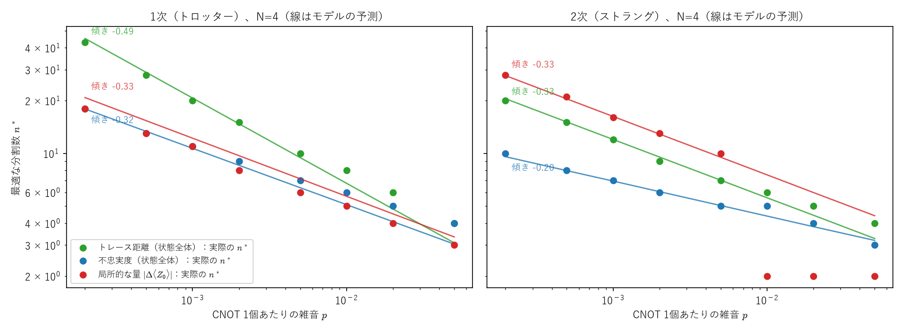

# トロッター分解は何段に分ければよいか ―「何で測るか」で答えが変わる、という話

> 下書き（2026年10月4日）。Qiita・Zenn などの技術ブログ、または研究会の発表の原稿を想定。数値はすべてこのフォルダのスクリプトで再現でき、主張にはテスト（`tests/`）を付けてある。実機での確認はまだ。

## 要旨

量子コンピュータで時間発展 $e^{-iHt}$ を作るトロッター分解は、分割数 $n$ を増やすほど近似が良くなる。しかし実機では、$n$ に比例してゲートが増え、雑音が積み重なる。したがって**最適な分割数 $n^*$** がある。横磁場イジング模型のシミュレーション（雑音つき）で調べたところ、次のことが分かった。

1. $n^*$ が雑音の強さ $p$ に対してどう変わるか（$n^*\propto p^s$ の指数 $s$）は、**誤差を何で測るかで変わる**。トレース距離なら1次で $s=-1/2$、不忠実度なら $-1/3$、局所的な観測量なら（この模型では）$-1/3$。
2. 状態全体の不忠実度で測った $n^*$ は、**系の大きさ $N$ によらない**（$N=4$〜$12$ で同じ）。精度だけが $N$ とともに悪くなる。
3. **局所的な観測量で $n^*$ を選ぶと、トロッター誤差と雑音の偶然の打ち消し合いを拾ってしまう**ことがある。1次の分解では、最適点が「打ち消し合いの谷」に沿っていて、しかも谷の傾きが綱引きの釣り合いと同じ $p^{-1/3}$ なので、指数を見ても区別できない。

1・2 は既知の結果（後述）を1つの模型の中でつないだもので、3 は調べた範囲の先行研究では見当たらなかった点。

## 1. 背景：トロッター分解と雑音の綱引き

ハミルトニアンが $H=A+B$ と交換しない2つの項の和のとき、$e^{-iHt}$ を

$$
\Big(e^{-iBt/n}e^{-iAt/n}\Big)^n\quad(\text{1次、誤差}\propto1/n),\qquad\Big(e^{-iBt/2n}e^{-iAt/n}e^{-iBt/2n}\Big)^n\quad(\text{2次・ストラング、誤差}\propto1/n^2)
$$

で近似する。$n$ を増やすとトロッター誤差は減るが、実機ではゲートの数が $n$ に比例して増え、1ゲートごとの雑音が積み重なる。誤差を

$$
\text{誤差}\approx\frac a{n^q}+b\,p\,n
$$

とモデル化すると、最小になる分割数は $n^*=\big(\frac{qa}{bp}\big)^{1/(q+1)}$。この枠組み自体は古くから知られている（Knee–Munro 2015 など）。

## 2. 模型と方法

- **模型**：$N$ スピンの横磁場イジング模型（開いた鎖）$H=\sum_iZ_iZ_{i+1}+\sum_iX_i$、初期状態 $|00\cdots0\rangle$、時刻 $t=2$。
- **回路と雑音**：ZZ の項は CNOT・RZ・CNOT で作るので、1ステップに $2(N-1)$ 個の CNOT。各 CNOT に2量子ビットの脱分極雑音（強さ $p$）。
- **計算**：$N\le8$ は密度行列で正確に（自前の numpy）、$N=10,12$ は Qiskit Aer の密度行列シミュレータで実際の回路から。両者は $N=4$ で最適な $n^*$ が全条件で一致した。
- **誤差の測り方（3通り）**：状態全体の不忠実度 $1-\langle\psi_{\text{exact}}|\rho|\psi_{\text{exact}}\rangle$、状態全体のトレース距離、局所的な観測量 $|\langle Z_0\rangle_\rho-\langle Z_0\rangle_{\text{exact}}|$（実機で測りやすい）。
- **検証の仕方**：主張ごとに pytest のテストを書き、乱数で多数の場合を試して反例を探した（現在29本）。見つかった反例もテストとして固定した。

## 3. 結果1：誤差の曲線と最適点


$N=4$、$p=0.005$ での誤差と分割数の関係。どの指標でも、$n$ が小さいとトロッター誤差、大きいと雑音で誤差が増え、間に最小点（丸印）がある。ただし**最小点の位置は指標ごとに違う**。1次の局所的な量（左の赤）は、$n=6$ で誤差が $0.0013$ まで鋭く落ち込んでいる。これが結果3で扱う打ち消し合い。

## 4. 結果2：$n^*$ の指数は「何で測るか」で決まる



| 指標 | 1次：予想 → 当てはめ | 2次：予想 → 当てはめ |
|---|---|---|
| トレース距離（距離） | $-1/2$ → $-0.49$ | $-1/3$ → $-0.33$ |
| 不忠実度（距離の2乗） | $-1/3$ → $-0.32$ | $-1/5$ → $-0.20$ |
| 局所的な量 $\langle Z_0\rangle$ | $-1/3$ → $-0.33$ | $-1/3$ → $-0.33$（実際の $n^*$ はばらつく） |

- トレース距離はトロッター誤差の大きさそのもの（$q=$ 次数）、不忠実度はその2乗（$q=2\times$次数）なので、指数が変わる。Knee–Munro が距離で示した「1次で $p^{-1/2}$」と、不忠実度での $p^{-1/3}$ は、同じ現象の別の測り方。
- 局所的な量の1次が $-1/2$ でなく $-1/3$ なのは、この模型では1次の分解でも $\langle Z_0\rangle$ の誤差が $1/n^2$ で減るため。初期状態 $|00\cdots0\rangle$ が ZZ の項の固有状態で、$Z_0$ も ZZ の項と交換すると、1次と2次の積の違い（回路の両端だけ）が効かなくなる（Layden 2021）。1次の誤差の係数を式で導いて確かめた。

## 5. 結果3：$n^*$ は系の大きさによらない

不忠実度で測った最適な $n^*$：

| $p$ | 1次（$N=4,6,8,10,12$） | 2次（$N=4,6,8,10,12$） |
|---|---|---|
| 0.001 | 11, 11, 11, 11, 11 | 7, 7, 7, 7, 7 |
| 0.005 | 7, 7, 7, 7, 7 | 5, 5, 5, 5, 5 |
| 0.02 | 5, 5, 5, 5, 5 | 4, 4, 4, 4, 4 |

最小の不忠実度は $N$ とともに悪くなる（1次・$p=0.001$ で $N=4$ の 0.074 → $N=12$ の 0.255）が、最適な分割数は変わらない。トロッター誤差も雑音の総量も $N$ に比例して増えるので、比が変わらないと考えると理解できる。局所的な量については、Trivedi–Cirac (2025) が $N$ によらないことを厳密に示している。

## 6. 結果4：局所的な量では、打ち消し合いが最適点を偽る

局所的な量の誤差を、符号つきで「トロッター部分（雑音なしの積の誤差）」と「雑音部分（雑音による変化）」に分け、打ち消し合いの度合い $R=\frac{|\text{トロッター部分}+\text{雑音部分}|}{|\text{トロッター部分}|+|\text{雑音部分}|}$（0 で完全に打ち消す）を $(n,p)$ の平面に描いた。


- **1次（左）**：平面を斜めに横切る打ち消し合いの谷（赤）があり、局所的な量の最適な $n^*$（黒）は谷に沿っている。谷の位置は「トロッター部分 ≈ −雑音部分」、つまり $\frac a{n^2}\approx bpn$ なので $n\propto p^{-1/3}$ で、**綱引きの釣り合いと同じ指数**。だから「最適点の指数がモデルどおりだから、綱引きで決まっている」とは言えない。
- **2次（右）**：$n\ge3$ では2つの部分が同じ符号で、打ち消し合いは起きない。ただし雑音が強い（$p\gtrsim0.01$）と、$n=2$ でトロッター誤差がたまたま小さくなり、最適点が $n=2$ に跳ぶ（モデルの予測は約 7.5）。小さい $n$ では、トロッター誤差が $n$ について単調でない。

**実機への示唆**：実機では、局所的な観測量（$\langle Z\rangle$ など）の正解との差を見て $n$ を選びたくなる。しかし、その最小点は偶然の打ち消し合いかもしれず、少し条件（雑音の強さ、時刻、観測量）が変わると崩れる。状態全体の指標（不忠実度・距離）で選ぶか、局所的な量なら打ち消し合いが起きていないかを確かめる必要がある。

## 7. うまくいかなかったこと

- **「すべて実数なら1次の誤差が消える」という仮説**：実数の初期状態で $\langle Z_0\rangle$ の誤差が速く減って見えたので立てたが、導いた係数を直接計算すると誤りだった（$N=3$・$t=2$ がたまたま係数の零点の近くだった）。傾きの当てはめや、1つの条件のデータだけで一般化しない、という教訓。
- **大きな $N$ でのモデルの外挿**：雑音の効果を線形に当てはめる方法は、CNOT の数が多いと雑音が飽和して不安定だった。大きな $N$ では曲線を直接計算した。

## 8. 先行研究との関係

| この記事の結果 | 先行研究 |
|---|---|
| $n^*$ を誤差のモデルから求める枠組み | Knee & Munro, PRA 91, 052327 (2015)；Endo et al., arXiv:1808.03623；Xu et al., arXiv:2504.10247 |
| 1次と2次の雑音込みの比較 | Avtandilyan & Pogosov, Quantum Inf. Process. 24, 8 (2025) |
| 局所的な量の誤差・最適な段数が $N$ によらない | Heyl, Hauke & Zoller, Sci. Adv. 5, eaau8342 (2019)；Trivedi & Cirac, arXiv:2509.17579；Granet & Dreyer, PRX Quantum 6, 010333 (2025) |
| 局所的な量で1次でも $1/n^2$ | Layden, arXiv:2107.08032 |
| 誤差の上限（交換子） | Childs, Su, Tran, Wiebe & Zhu, PRX 11, 011020 (2021) |
| 指標ごとの指数を同じ模型で並べること | 見当たらなかった |
| 局所的な量での打ち消し合い、小さい $n$ での予測外れ | 見当たらなかった |

（文献の命題番号・掲載誌の一部は未確認。公開前に確かめる。）

## 9. 限界と今後

- 雑音は一様な脱分極だけ。実機の雑音（コヒーレントな誤差、読み出しの誤差、量子ビットごとのばらつき）では、打ち消し合いの起き方が変わりうる。
- 模型は1次元の横磁場イジング模型、時刻 $t=2$、初期状態 $|00\cdots0\rangle$ に限る。
- 実機（IBM、$N=2$〜4）で、較正データから $n^*$ を予測してから測る予定。

## 付録：再現方法

```bash
uv run pytest experiments/a5_trotter_noise -q                      # 29本のテスト（約8秒）
uv run python experiments/a5_trotter_noise/sweep.py --qubits 2 4 5 --ps 0 0.0002 0.0005 0.001 0.002 0.005 0.01 0.02 0.05 --nmax 80 --out experiments/a5_trotter_noise/results/sweep_exponents.csv
uv run python experiments/a5_trotter_noise/analyze.py experiments/a5_trotter_noise/results/sweep_exponents.csv
uv run python experiments/a5_trotter_noise/exponents.py experiments/a5_trotter_noise/results/sweep_exponents.csv
uv run python experiments/a5_trotter_noise/cancellation_map.py --qubits 3
uv run python experiments/a5_trotter_noise/aer_check.py --qubits 10 12 --ps 0.001 0.005 0.02 --nmax 16
uv run python experiments/a5_trotter_noise/summary_figures.py
```

望遠鏡和の不等式 $\lVert U^n-V^n\rVert\le n\lVert U-V\rVert$（トロッター誤差を1ステップの誤差の $n$ 倍で抑える部分）は、Lean 4 + Mathlib で形式証明した（`lean4/QuantumStudy/Telescoping.lean`）。
