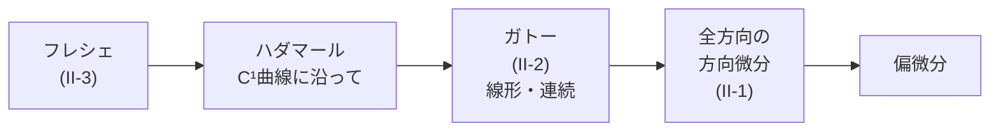

# 微分の地図 ―定義の強さ・対象と構造・計算法で整理する―

> **作成** 2026-10-10　**更新** 2026-10-10
> 「微分」という一語の下にある、定義上区別すべき微分（ガトー・フレシェ・汎関数微分・弱微分・外微分・リー微分・共変微分・複素微分・確率微分・導分・差分・自動微分など）を、3つの層で整理した地図。
> 各項目の定義、前提にする構造、リポジトリ内の該当ノート、反例の検算（experiments/derivative_map）。

微分には、共変微分・外微分・リー微分のように、定義も、微分する対象も、結果の型も違うものが、同じ「微分」という名前で並んでいます。このノートは、それらを一枚の地図に並べ、**何が同じで何が違うのか**を見えるようにします。各微分の詳しい導出は、リポジトリの既存のノートに任せ、ここでは定義と、区別の仕方と、反例を扱います。

- **Part I**：地図の見方。3つの層と、区別するための4つの問い
- **Part II**：層1「定義の強さ」。方向微分・ガトー微分・ハダマール微分・フレシェ微分と、3つの反例
- **Part III**：層2「対象と構造」。汎関数微分、弱微分とラドン・ニコディム微分、外微分・リー微分・共変微分、複素微分、確率微分、導分、分数階微分
- **Part IV**：層3「計算法」。差分、スペクトル法、自動微分、パラメータシフト則
- **Part V**：どの微分を使うかの確認表と、リポジトリでまだ書いていないもの

**関連ファイル**：反例と数値の検算は [experiments/derivative_map/](../../experiments/derivative_map/README.md)（12件のテスト）。有限次元の微分（全微分・方向微分・連鎖律）は [関数・線形写像・微分・積分のノート](functions_linear_maps_derivatives_integrals.md) の Part III、自動微分と座標は [autodiff_and_coordinates.md](autodiff_and_coordinates.md)、共変微分は [christoffel_riemann_intro.md](../02_微分幾何/christoffel_riemann_intro.md)、リー微分は [lie_derivative.md](../02_微分幾何/lie_derivative.md)、外微分は [differential_forms_hodge_star.md](../03_多様体・微分形式・トポロジー/differential_forms_hodge_star.md)、超関数は [integration_algebraic_structure_stokes.md](../03_多様体・微分形式・トポロジー/integration_algebraic_structure_stokes.md) の Part VII、第一変分は [nonlinear_laplacian_p_laplacian.md](nonlinear_laplacian_p_laplacian.md)、差分とスペクトル法は [vandermonde_finite_difference_spectral.md](../07_数値計算/vandermonde_finite_difference_spectral.md) にあります。

**このノートの確かさ**：定義と定理の述べ方は、Web で調べた出典（末尾）の要約で確認しました。本文を精読したのは、Wikipedia のガトー微分のページだけです。反例と数値は、すべて手元で実行して確かめています。出典を確認していない記述は、本文に「記憶による」と書きました。

**記号の約束**

- $X,Y$：ノルム空間（有限次元なら $\mathbb R^n,\mathbb R^m$）。$f:U\subset X\to Y$、$x\in U$ は微分する点、$v,h\in X$ は方向。
- 式番号は `Part 番号-通し番号`（例：II-3）です。

## 目次

<!-- toc:start -->

- [Part I：地図の見方](#p1)
  - [1. 3つの層](#p1-1)
  - [2. 区別するための4つの問い](#p1-2)
- [Part II：層1「定義の強さ」](#p2)
  - [1. 4つの定義](#p2-1)
  - [2. 含意の鎖](#p2-2)
  - [3. 反例1：全方向の方向微分があるが、加法的でない](#p2-3)
  - [4. 反例2：偏微分は存在するが、ほかの方向の方向微分がない](#p2-4)
  - [5. 反例3：ガトー微分は線形・連続だが、微分可能ではない](#p2-5)
  - [6. 連続微分可能と、有限次元での判定](#p2-6)
- [Part III：層2「対象と構造」](#p3)
  - [1. 汎関数微分](#p3-1)
  - [2. 測度：弱微分・超関数微分、ラドン・ニコディム微分](#p3-2)
  - [3. 多様体：外微分、リー微分、押し出し](#p3-3)
  - [4. 接続：共変微分](#p3-4)
  - [5. 複素微分とウィルティンガー微分](#p3-5)
  - [6. 確率微分](#p3-6)
  - [7. 導分](#p3-7)
  - [8. 分数階微分](#p3-8)
- [Part IV：層3「計算法」](#p4)
  - [1. 差分](#p4-1)
  - [2. スペクトル法](#p4-2)
  - [3. 自動微分](#p4-3)
  - [4. パラメータシフト則](#p4-4)
  - [5. 記号微分](#p4-5)
- [Part V：どの微分を使うか](#p5)
  - [1. 確認表](#p5-1)
  - [2. リポジトリでの整備状況](#p5-2)
- [まとめ](#summary)

<!-- toc:end -->

---

# Part I：地図の見方

<!-- part-toc:start -->

**この Part の内容**

- [1. 3つの層](#p1-1)
- [2. 区別するための4つの問い](#p1-2)

<!-- part-toc:end -->

## 1. 3つの層

微分の名前は、次の3つの別々の問いに答えています。同じ層の中で比べるのが、地図の読み方の基本です。

| 層 | 問い | 例 |
|---|---|---|
| 1 定義の強さ | **同じ関数** $f:X\to Y$ の微分を、どれだけ強い条件で定義するか | 方向微分、ガトー微分、ハダマール微分、フレシェ微分、$C^k$ |
| 2 対象と構造 | **何を、何と比べて**微分するか。そのために、どんな構造が要るか | 汎関数微分、弱微分、ラドン・ニコディム微分、外微分、リー微分、共変微分、複素微分、確率微分、導分、分数階微分 |
| 3 計算法 | 微分を**どう評価・近似するか** | 差分、スペクトル法、自動微分、パラメータシフト則、記号微分 |

層3は、層1・2で定義された微分の値を計算する方法です。たとえば自動微分は、フレシェ微分（線形写像）に連鎖律を当てはめて、その値を正確に計算します。定義を変える方法ではありません。

## 2. 区別するための4つの問い

ある「微分」を見たとき、次の4つを確かめると、ほかの微分との違いが見えます。

1. **前提にする構造は何か**（ベクトル空間だけか、ノルムか、積分か、滑らかな多様体か、接続か、複素構造か、確率か）。
2. **結果の型は何か**（数、線形写像、関数、テンソル、微分形式、測度、確率過程）。
3. **方向の与え方**：方向（ベクトル場 $X$）について、1点での値だけで決まるか、場の近傍の値まで要るか。
4. **座標を変えても同じ対象か**：成分がテンソルとして変わるか。

| 微分 | 1 前提にする構造 | 2 結果の型 | 3 方向の与え方 | 4 座標不変か |
|---|---|---|---|---|
| 偏微分・方向微分（$\mathbb R^n$） | 座標（ベクトル空間） | 数 | $v$ の1点の値（$v$ について線形） | $\partial_if$ は $df$ の成分（共変に変わる） |
| ガトー・フレシェ | ノルム空間 | 線形写像 $Df(x)$ | $h$ について線形 | 座標なしで定義 |
| 汎関数微分 $\delta F/\delta u$ | 関数空間と内積 | 関数 | — | 内積（計量）の選び方で変わる |
| 弱微分・超関数微分 | 積分と試験関数 | 関数・超関数 | — | 変数変換でヤコビアンが入る |
| ラドン・ニコディム微分 | 2つの測度 | 関数（密度） | — | 変数変換でヤコビアンが入る |
| 外微分 $d$ | 滑らかな多様体のみ | $k$-形式 → $(k+1)$-形式 | 方向なし | 座標不変 |
| リー微分 $L_XT$ | 多様体とベクトル場 $X$ | 同じ型のテンソル | $X$ の**近傍の値**が要る | 座標不変 |
| 共変微分 $\nabla_XT$ | 接続 | 同じ型のテンソル（$\nabla T$ は共変の階数が1つ上がる） | $X$ の**1点の値**だけ | 座標不変（成分 $\partial+\Gamma$ は個別にはテンソルでない） |
| 複素微分・$\partial,\bar\partial$ | 複素構造 | 関数 | — | 正則座標の変換で閉じる |
| 伊藤の確率微分 | 確率空間とフィルトレーション | 確率過程 | — | 連鎖律の形が変わる |
| 導分（一般） | 代数 | 代数の元 | — | ライプニッツ則だけを要請 |
| 分数階微分 | 積分作用素 | 関数 | — | 定義が複数（リーマン・リウヴィル、カプート） |

この表の「微分」のうち、層3（差分・スペクトル・自動微分）は含めていません。

---

# Part II：層1「定義の強さ」

<!-- part-toc:start -->

**この Part の内容**

- [1. 4つの定義](#p2-1)
- [2. 含意の鎖](#p2-2)
- [3. 反例1：全方向の方向微分があるが、加法的でない](#p2-3)
- [4. 反例2：偏微分は存在するが、ほかの方向の方向微分がない](#p2-4)
- [5. 反例3：ガトー微分は線形・連続だが、微分可能ではない](#p2-5)
- [6. 連続微分可能と、有限次元での判定](#p2-6)

<!-- part-toc:end -->

## 1. 4つの定義

$f:U\subset X\to Y$、点 $x$、方向 $v$ とします。

**方向微分**（存在すれば）：

$$
D_vf(x)=\lim_{t\to0}\frac{f(x+tv)-f(x)}{t}\tag{II-1}
$$

偏微分は、$X=\mathbb R^n$ で $v$ が座標軸の方向のときです。

**ガトー微分可能**：すべての方向 $v$ で $D_vf(x)$ が存在し、$v\mapsto D_vf(x)$ が線形かつ連続（有界）になること：

$$
Df(x)[v]=D_vf(x)\qquad(v\text{ について線形・連続})\tag{II-2}
$$

**ハダマール微分可能**：線形で連続な $A$ があり、$\gamma(0)=x$、$\gamma'(0)=v$ を満たす**任意の $C^1$ 曲線 $\gamma$** について、$\dfrac{d}{dt}f(\gamma(t))\Big|_{t=0}=Av$ となること。

**フレシェ微分可能**：線形で連続な $A$ があり、

$$
\lim_{h\to0}\frac{\lVert f(x+h)-f(x)-Ah\rVert}{\lVert h\rVert}=0\tag{II-3}
$$

となること（線形近似の誤差が $o(\lVert h\rVert)$）。

> **流儀の違い（要注意）**：ガトー微分の定義は、著者によって違います。Wikipedia の基本の定義は (II-1) だけで、線形性を**要求しません**。Tikhomirov のように、線形でないものを「ガトー微分（differential）」、線形と仮定したものを「ガトー微分係数（derivative）」と呼び分ける著者もいます。このノートでは、(II-2) のように、線形・連続を要求する意味で「ガトー微分可能」と書きます。本を読むときは、どちらの流儀かを最初に確かめてください。

## 2. 含意の鎖

$$
\text{フレシェ}\ \Rightarrow\ \text{ハダマール}\ \Rightarrow\ \text{ガトー}\ \Rightarrow\ \text{全方向の方向微分が存在}\ \Rightarrow\ \text{偏微分が存在}
$$

どの矢印も、逆は成り立ちません。逆が成り立たない例を、次の §3〜§5 で具体的に作ります。また、出典（末尾）によれば、次のことが知られています（記憶ではなく、検索結果の要約による）。

- 定義域が**有限次元**なら、ハダマール微分とフレシェ微分は一致します。
- 関数が**リプシッツ連続**なら、ハダマール微分とガトー微分は一致します。
- 無限次元では、フレシェ微分は、ハダマール微分よりずっと強い条件です。

## 3. 反例1：全方向の方向微分があるが、加法的でない

$$
f(x,y)=\frac{x^3}{x^2+y^2}\quad((x,y)\ne(0,0)),\qquad f(0,0)=0
$$

原点で、方向 $v=(v_1,v_2)$ の差商は $f(tv)/t=\dfrac{v_1^3}{v_1^2+v_2^2}$（$t$ によらない）なので、方向微分は

$$
D_vf(0)=\frac{v_1^3}{v_1^2+v_2^2}
$$

です。$v=(1,0)$ で $1$、$v=(0,1)$ で $0$、$v=(1,1)$ で $\tfrac12$ です。加法的なら $(1,1)=(1,0)+(0,1)$ で $1+0=1$ のはずですが、実際は $\tfrac12$ なので、$v\mapsto D_vf(0)$ は**線形ではありません**（斉次性 $D_{\lambda v}f=\lambda D_vf$ は成り立ちます）。したがって、(II-2) の意味ではガトー微分可能ではありません。Wikipedia のガトー微分のページに載っている例です。

## 4. 反例2：偏微分は存在するが、ほかの方向の方向微分がない

$$
f(x,y)=\frac{xy}{x^2+y^2}\quad((x,y)\ne(0,0)),\qquad f(0,0)=0
$$

軸上では $f=0$ なので、原点で $\partial_xf=\partial_yf=0$ です。ところが、方向 $v=(1,1)$ では $f(t,t)=\tfrac12$（$t\ne0$）で、差商は $f(t,t)/t=\dfrac1{2t}$ となり、$t\to0$ で**発散**します（数値：$t=10^{-2}$ で $50$、$t=10^{-4}$ で $5000$）。方向微分すら存在しません。

関数ノートの「偏微分は存在するのに全微分が存在しない関数」（[functions_linear_maps_derivatives_integrals.md](functions_linear_maps_derivatives_integrals.md)）は、偏微分（軸方向だけ）と全微分の差を見る例で、このノートの鎖では「偏微分」と「フレシェ」の間にあたります。ガトー微分（全方向）との差は、この例と §3 のような例で別に見る必要があります。

## 5. 反例3：ガトー微分は線形・連続だが、微分可能ではない

$$
f(x,y)=\frac{x^3y}{x^6+y^2}\quad((x,y)\ne(0,0)),\qquad f(0,0)=0
$$

原点で、方向 $v=(a,b)$ の差商は $\dfrac{f(ta,tb)}{t}=\dfrac{t\,a^3b}{t^4a^6+b^2}$（$b\ne0$）で、$t\to0$ で $0$ です（$b=0$ なら $f=0$）。したがって、**すべての方向の方向微分が $0$** で、$v\mapsto D_vf(0)=0$ は線形かつ連続です。(II-2) の意味で、原点でガトー微分可能です。

ところが、$C^1$ 曲線 $\gamma(t)=(t,t^3)$（$\gamma(0)=0$、$\gamma'(0)=(1,0)$）に沿うと、

$$
f(\gamma(t))=\frac{t^3\cdot t^3}{t^6+t^6}=\frac12\quad(t\ne0)
$$

で、$f(0)=0$ ですから、$f$ は原点で**連続ですらありません**。この曲線に沿った微分は存在せず、ハダマール微分可能ではありません。フレシェ微分可能でもありません。

**まとめ**：「すべての方向の方向微分が存在して、しかも $v$ について線形」という条件（ガトー微分可能）でも、微分可能（フレシェ）には届きません。方向ごとに別々に見ていても、曲線に沿って近づく経路までは見えないためです。有限次元では、ハダマールとフレシェが一致するので、この反例は、有限次元でも ガトーとフレシェが違うことを示しています。

## 6. 連続微分可能と、有限次元での判定

有限次元（$X=\mathbb R^n$）では、「偏微分がすべて存在して、しかも連続」なら、フレシェ微分可能（さらに $C^1$）です（[関数・線形写像のノート](functions_linear_maps_derivatives_integrals.md)の付録A「偏微分が連続なら微分可能」）。上の3つの反例は、偏微分が連続でない（原点で関数自体が不連続、あるいは方向微分が方向について線形でない）ため、この条件に当てはまりません。

無限次元（関数空間）では、ノルムの選び方によって、フレシェ微分可能かどうかが変わります。有限次元では、すべてのノルムが同値だったので、この問題は起きませんでした。

---

# Part III：層2「対象と構造」

<!-- part-toc:start -->

**この Part の内容**

- [1. 汎関数微分](#p3-1)
- [2. 測度：弱微分・超関数微分、ラドン・ニコディム微分](#p3-2)
- [3. 多様体：外微分、リー微分、押し出し](#p3-3)
- [4. 接続：共変微分](#p3-4)
- [5. 複素微分とウィルティンガー微分](#p3-5)
- [6. 確率微分](#p3-6)
- [7. 導分](#p3-7)
- [8. 分数階微分](#p3-8)

<!-- part-toc:end -->

## 1. 汎関数微分

関数を入力とし、数を返す対応 $F[u]$（汎関数）の微分です。ガトー微分（方向微分）

$$
dF[u;h]=\frac{d}{d\varepsilon}F[u+\varepsilon h]\Big|_{\varepsilon=0}\tag{III-1}
$$

が、ある関数 $\dfrac{\delta F}{\delta u}$ との $L^2$ 内積で書けるとき、

$$
dF[u;h]=\int\frac{\delta F}{\delta u}(x)\,h(x)\,dx\tag{III-2}
$$

の $\delta F/\delta u$ を**汎関数微分**と呼びます。「何と内積を取るか」で結果が決まるので、**内積（計量）の選び方に依存する**量です。

**例**：$J[u]=\displaystyle\int_0^1\tfrac12(u')^2\,dx$（端で $u=0$）。(III-1) を計算すると $\dfrac{d}{d\varepsilon}J[u+\varepsilon h]\Big|_0=\displaystyle\int_0^1u'h'\,dx=-\int_0^1u''h\,dx$（$h(0)=h(1)=0$ の部分積分）なので、$\dfrac{\delta J}{\delta u}=-u''$ です（第一変分とオイラー・ラグランジュ方程式。[nonlinear_laplacian_p_laplacian.md](nonlinear_laplacian_p_laplacian.md) の Part II）。

**離散化して自動微分すると、計量が見える**：$[0,1]$ を間隔 $\Delta x$ で分けて $J=\sum_i\tfrac12\big(\tfrac{u_{i+1}-u_i}{\Delta x}\big)^2\Delta x$ とし、各格子点の値 $u_i$ について自動微分すると、$\dfrac{\partial J}{\partial u_i}=-\dfrac{u_{i+1}-2u_i+u_{i-1}}{\Delta x}=\Delta x\cdot(-u''_i)+O(\Delta x^3)$ です。つまり、自動微分が返す成分は、汎関数微分の $\Delta x$ 倍です。内積 $\langle f,g\rangle=\sum_if_ig_i\,\Delta x$ の計量が $g_{ij}=\Delta x\,\delta_{ij}$ なので、汎関数微分は、成分に逆計量を掛けたもの $g^{ij}\partial J/\partial u_j$ です。[autodiff_and_coordinates.md](autodiff_and_coordinates.md) の Part I の (I-2) の、関数空間版です。

数値で確かめました（$\sin\pi x$、400 点）：自動微分の成分を $\Delta x$ で割ると $-u''=\pi^2\sin\pi x$ に最大誤差 $5\times10^{-5}$ で一致し、点を2倍にすると誤差は $1/3$ 以下になります（$O(\Delta x^2)$）。

## 2. 測度：弱微分・超関数微分、ラドン・ニコディム微分

**弱微分**：$u,v\in L^1_{\mathrm{loc}}$ で、すべての滑らかなコンパクト台の試験関数 $\varphi$ について

$$
\int u\,\varphi'\,dx=-\int v\,\varphi\,dx\tag{III-3}
$$

となるとき、$v$ を $u$ の**弱微分**と呼びます（部分積分の形を、定義に採用したもの）。超関数の微分も同じ定義で、違いは、結果が関数（$L^1_{\mathrm{loc}}$）であることを要求するかどうかです。弱微分が $L^p$ に入る関数の空間がソボレフ空間 $W^{k,p}$ です。

**例**（数値で確認）：試験関数 $\varphi(x)=\exp\!\big(-1/(1-(x-0.3)^2)\big)$（台 $(-0.7,\,1.3)$）で、$\int|x|\varphi'\,dx=-0.2139$ と $-\int\mathrm{sign}(x)\varphi\,dx=-0.2139$ が一致し、$|x|$ の弱微分は $\mathrm{sign}(x)$ です。$\mathrm{sign}$ には弱微分がなく、超関数として $\int\mathrm{sign}\,\varphi'\,dx=-2\varphi(0)=-0.6665$ となり、微分は $2\delta$ です。

**ラドン・ニコディム微分**：測度 $\mu$ が $\nu$ に絶対連続（$\nu(A)=0\Rightarrow\mu(A)=0$）なら、$\mu(A)=\int_Af\,d\nu$ となる関数 $f$ が存在し、$f=d\mu/d\nu$ と書きます。定義は積分で与えられ、フレシェ微分のような線形近似の極限ではありません。

微分同相写像 $\varphi$ について、ヤコビアン $\lvert\det D\varphi\rvert$ は、ルベーグ測度を引き戻した測度のラドン・ニコディム微分です（変数変換の公式の言い直し。[Fremlin, Measure Theory 第26章](https://www1.essex.ac.uk/maths/people/Fremlin/chap26.pdf)）。極座標で $\iint e^{-(x^2+y^2)}dx\,dy=\int_0^{2\pi}\!\!\int_0^\infty e^{-r^2}\,r\,dr\,d\theta=\pi$（ヤコビアン $r$ が密度）と確かめました。

はめ込み（正方でないヤコビ行列）では、$\lvert\det J\rvert$ の代わりに、グラム行列式の平方根が出ます。$m\le n$ のリプシッツ写像 $f:\mathbb R^m\to\mathbb R^n$ では面積公式の係数が $\sqrt{\det(Df^TDf)}$、$m\ge n$ では余面積公式の係数が $\sqrt{\det(Df\,Df^T)}$ です（Federer。[面積公式](https://encyclopediaofmath.org/wiki/Area_formula)・[余面積公式](https://encyclopediaofmath.org/wiki/Coarea_formula)）。放物面 $(u,v,u^2+v^2)$ で、自動微分したヤコビ行列から $\sqrt{\det(J^TJ)}=\sqrt{1+4u^2+4v^2}$ と一致することを確かめました（$(u,v)=(0.3,-0.7)$ で $1.8221$）。

## 3. 多様体：外微分、リー微分、押し出し

**外微分 $d$** は、滑らかな多様体の構造だけで定義でき、接続も計量も要りません。$k$-形式を $(k+1)$-形式に写し、$d^2=0$ です（[differential_forms_hodge_star.md](../03_多様体・微分形式・トポロジー/differential_forms_hodge_star.md)、[poincare_lemma_d_squared_zero.md](../03_多様体・微分形式・トポロジー/poincare_lemma_d_squared_zero.md)）。

**リー微分 $L_XT$** は、ベクトル場 $X$ が生成する流れに沿って、テンソル $T$ を元の位置に引き戻して比べた変化率です。接続は要らず、結果は $T$ と同じ型のテンソルです（[lie_derivative.md](../02_微分幾何/lie_derivative.md)）。関数には $L_Xf=Xf$、ベクトル場には $L_XY=[X,Y]$（リー括弧）です。

## 4. 接続：共変微分

異なる点の接ベクトルは、別々の接空間にあり、そのままでは引き算できません。比べ方を与える構造が**接続**で、それを使う微分が**共変微分** $\nabla_XT$ です。成分では $\nabla_iV^j=\partial_iV^j+\Gamma^j{}_{ik}V^k$ です（[christoffel_riemann_intro.md](../02_微分幾何/christoffel_riemann_intro.md)）。接続は、計量がなくても定義できます。計量があれば、「ねじれなし・計量と両立」で、レヴィ・チヴィタ接続が一意に決まります。

**リー微分と共変微分の決定的な違い**は、方向 $X$ の与え方です。共変微分は、$X$ について**関数線形**です。

$$
\nabla_{fX}Y=f\,\nabla_XY\tag{III-4}
$$

ところが、リー微分は関数線形ではありません。

$$
L_{fX}Y=[fX,Y]=f\,[X,Y]-(Yf)\,X\tag{III-5}
$$

右辺の第2項 $(Yf)X$ は、$f$ の**微分**を含みます。$\nabla_XY$ の値は、$X$ の1点での値 $X_p$ だけで決まりますが、$L_XY$ は、$X$ の近傍の値（$X$ の微分）まで必要です。(III-5) を、一般の関数 $f,X,Y$ で記号的に確かめました（SymPy。差が $0$）。

| | リー微分 $L_X$ | 共変微分 $\nabla_X$ |
|---|---|---|
| 必要な構造 | 滑らかな多様体 | 接続 |
| $X$ について | 場の近傍まで要る（(III-5)） | 1点の値だけ（(III-4)） |
| 型 | $T$ と同じ型 | $\nabla T$ は共変の階数が1つ上がる |
| ベクトル場に作用 | $[X,Y]$ | $\nabla_XY$ |

2つは、ねじれなしの接続では、たとえば $(1,1)$ テンソルについて $L_VT^a{}_b=V^c\nabla_cT^a{}_b-T^c{}_b\nabla_cV^a+T^a{}_c\nabla_bV^c$ という式でつながります（デカルト座標で $\nabla=\partial$ としたリー微分の定義の共変化。出典の抜粋は添字が崩れていたので、添字は自分で確認しました）。

**成分は個別にはテンソルでない**：$\partial_iV^j$ も $\Gamma^j{}_{ik}V^k$ も、単独ではテンソルとして変わりませんが、足し合わせると変わります。極座標では $\Gamma\ne0$ でも、リーマン曲率は $0$（平坦）です（[autodiff_and_coordinates.md](autodiff_and_coordinates.md) の Part VII で、diffjeom と geomstats で確認）。

**共変外微分** $D=d+A$（ゲージ共変微分）は、値を持つ微分形式に作用し、一般に $D^2\ne0$ で、曲率になります（[matrix_valued_forms_gauge_theory.md](../03_多様体・微分形式・トポロジー/matrix_valued_forms_gauge_theory.md)）。

## 5. 複素微分とウィルティンガー微分

複素関数の微分は、$z=x+iy$ として、**複素数の方向によらず極限が同じ**ことを要求するので、実の意味の微分可能性よりずっと強い条件になります（コーシー・リーマン方程式）。実部・虚部の座標 $(x,y)$ で見た微分は、ウィルティンガー微分で書けます。

$$
\frac{\partial}{\partial z}=\frac12(\partial_x-i\partial_y),\qquad\frac{\partial}{\partial\bar z}=\frac12(\partial_x+i\partial_y)\tag{III-6}
$$

正則であることは $\partial f/\partial\bar z=0$ と同値です。SymPy で確かめた例：$f=\bar z$ は $\partial_zf=0$、$\partial_{\bar z}f=1$。$f=z^2$ は $\partial_{\bar z}f=0$（正則）、$\partial_zf=2z$。$f=\lvert z\rvert^2$ は $\partial_zf=\bar z$、$\partial_{\bar z}f=z$。自動微分ライブラリの複素勾配の規約（共役の向き）は、この $\partial/\partial z$ と $\partial/\partial\bar z$ のどちらを返すかの違いです（[autodiff_and_coordinates.md](autodiff_and_coordinates.md) の Part V）。

## 6. 確率微分

ブラウン運動 $W$ は、至るところ微分できないので、$dW$ の積分には定義の選び方が要ります。$\int_0^TW\,dW$ を、区間の左端点で評価する（伊藤）か、中点で評価する（ストラトノビッチ）かで、値が変わります。

$$
\text{伊藤：}\ \int_0^TW\,dW=\frac{W_T^2-T}2,\qquad\text{ストラトノビッチ：}\ \int_0^T W\circ dW=\frac{W_T^2}2\tag{III-7}
$$

ストラトノビッチ積分は通常の連鎖律に従い、伊藤積分は伊藤の補題が必要です。差は2次変動 $\sum(\Delta W)^2\to T$ のぶん（ドリフト項）です。数値（$T=1$、4096 ステップ、4000 本）：中点の和は、すべての経路で $W_T^2/2$ に**ちょうど**等しく（望遠鏡和）、左端点の和は $(W_T^2-\sum(\Delta W)^2)/2$ に**ちょうど**等しく、平均は伊藤で $0.003$、ストラトノビッチで $0.503$、差の平均は $0.4997\approx T/2$ でした。

## 7. 導分

**導分**（derivation）は、微分の定義を、ライプニッツ則だけに絞ったものです。代数 $A$ の線形写像 $D$ で、

$$
D(ab)=D(a)\,b+a\,D(b)\tag{III-8}
$$

を満たすもの。リー微分 $L_X$ や $\mathrm{ad}_X=[X,\cdot\,]$ がこれにあたります。外微分 $d$ は、符号が付いた**反導分**（次数付き導分）です。

$$
d(\omega\wedge\eta)=d\omega\wedge\eta+(-1)^{\deg\omega}\,\omega\wedge d\eta\tag{III-9}
$$

次数付き導分は、次数 $d$ の $D$ について $D(ab)=D(a)b+(-1)^{\deg(a)\deg(D)}aD(b)$ で、奇数次（$d$、内部積）が反導分です。リー微分・内部積・外微分は、無限次元の次数付きリー代数をなします（nLab の導分のページ、Wikipedia の Generalizations of the derivative の要約）。

## 8. 分数階微分

整数階の微分を $\alpha$ 階に拡張しますが、定義が複数あります。**リーマン・リウヴィル**は、$\alpha$ 階の積分 $I^\alpha f=\frac1{\Gamma(\alpha)}\int_0^x(x-s)^{\alpha-1}f(s)\,ds$ を作り、それを整数階微分したものです。**カプート**は、先に整数階微分してから $I^\alpha$ を作ります。

SymPy で $\alpha=\tfrac12$ を計算すると、定数 $f=1$ のリーマン・リウヴィル微分は $\dfrac1{\sqrt{\pi x}}$ で**0ではありません**（カプートは $0$）。$f=x$ は $\dfrac{2\sqrt x}{\sqrt\pi}=\dfrac{\Gamma(2)}{\Gamma(3/2)}x^{1/2}$ です。このため、リーマン・リウヴィルでは、初期条件に分数階微分の値が要り、カプートでは、通常の整数階の初期値で済みます（Springer・arXiv の比較論文の要約）。

---

# Part IV：層3「計算法」

<!-- part-toc:start -->

**この Part の内容**

- [1. 差分](#p4-1)
- [2. スペクトル法](#p4-2)
- [3. 自動微分](#p4-3)
- [4. パラメータシフト則](#p4-4)
- [5. 記号微分](#p4-5)

<!-- part-toc:end -->

## 1. 差分

前進差分 $\frac{f(x+h)-f(x)}h$ の誤差は $O(h)$（$\tfrac12f''h$）、中心差分 $\frac{f(x+h)-f(x-h)}{2h}$ は $O(h^2)$（$\tfrac16f'''h^2$）です。$f=\sin$、$x=1$ で確かめました。

| $h$ | 前進差分の誤差 | 中心差分の誤差 |
|---|---|---|
| $10^{-2}$ | $4.2\times10^{-3}$ | $9.0\times10^{-6}$ |
| $10^{-4}$ | $4.2\times10^{-5}$ | $9.0\times10^{-10}$ |
| $10^{-6}$ | $4.2\times10^{-7}$ | $2.8\times10^{-11}$ |
| $10^{-8}$ | $3.0\times10^{-9}$ | $2.6\times10^{-9}$ |
| $10^{-10}$ | $5.8\times10^{-8}$ | $5.8\times10^{-8}$ |

$h$ を小さくすると打ち切り誤差は減りますが、$h$ が小さすぎると丸め誤差で増えます。中心差分の最小は約 $3\times10^{-11}$ で、頭打ちです。一方、**自動微分は、丸め誤差程度（この例では $0$）**です。差分は、微分の定義の**近似**で、自動微分は、微分の**値そのものを連鎖律で計算**します。

## 2. スペクトル法

関数を基底で展開し、微分を行列にする方法です。滑らかな関数では、差分より速く収束します（[vandermonde_finite_difference_spectral.md](../07_数値計算/vandermonde_finite_difference_spectral.md)）。

## 3. 自動微分

フレシェ微分の連鎖律 $D(g\circ f)=Dg\circ Df$ を、計算グラフ上で機械的に適用します。前進モードは接ベクトルを押し出し（JVP）、後退モードは余接ベクトルを引き戻します（VJP、逆伝播）。返すのは、座標成分の微分であり、計量や接続は含みません（[autodiff_and_coordinates.md](autodiff_and_coordinates.md)）。

## 4. パラメータシフト則

量子回路で、ゲートが $e^{-i\theta P/2}$（$P$ はパウリ行列）の形のとき、期待値の $\theta$ 微分は、2回の測定から**厳密に**求まります。

$$
\frac{\partial}{\partial\theta}\langle O\rangle(\theta)=\frac12\Big[\langle O\rangle\big(\theta+\tfrac\pi2\big)-\langle O\rangle\big(\theta-\tfrac\pi2\big)\Big]\tag{IV-1}
$$

$R_Y(\theta)\lvert0\rangle$ の $\langle Z\rangle=\cos\theta$ で、$\theta=0.7$ のとき (IV-1) は $-0.6442$ で、$-\sin0.7$ と一致します（4つの $\theta$ で確認）。差分と違って、$\pm\pi/2$ という**大きな**ずれで正確な微分が出る点が違います（[bra_ket_notation_path_integral.md](../05_量子力学/bra_ket_notation_path_integral.md) の 304 行目付近）。

## 5. 記号微分

式を記号のまま微分する方法で、SymPy などで使えます。式が長くなりやすく、計算グラフの共有（自動微分が使う）が失われます。

---

# Part V：どの微分を使うか

<!-- part-toc:start -->

**この Part の内容**

- [1. 確認表](#p5-1)
- [2. リポジトリでの整備状況](#p5-2)

<!-- part-toc:end -->

## 1. 確認表

| 状況 | 使う微分 | 要るもの |
|---|---|---|
| $\mathbb R^n$ の関数の線形近似、連鎖律、逆関数定理 | フレシェ微分（全微分） | ノルム（有限次元では不要） |
| 関数空間の汎関数の極値（変分法） | ガトー微分（第一変分）、汎関数微分 | 内積（$L^2$ など） |
| 不連続な関数・折れ目のある関数の微分、PDE の弱解 | 弱微分、超関数微分 | 試験関数と積分 |
| 変数変換で確率密度・体積が変わる | ラドン・ニコディム微分（ヤコビアン） | 2つの測度 |
| 微分形式の微分、ストークスの定理 | 外微分 | 滑らかな多様体 |
| 流れに沿った変化 | リー微分 | ベクトル場 |
| 曲がった空間でのベクトル場の変化 | 共変微分 | 接続（多くは計量から） |
| 複素関数の正則性 | 複素微分、$\partial/\partial\bar z$ | 複素構造 |
| 確率過程の微分 | 伊藤またはストラトノビッチ | 確率空間 |
| ライプニッツ則だけを使う代数的な議論 | 導分 | 代数 |
| コンピュータで値を計算したい | 自動微分（正確）、差分（近似） | 微分可能な計算グラフ |

## 2. リポジトリでの整備状況

| 微分 | 状況 |
|---|---|
| フレシェ（有限次元）、方向微分、偏微分 | あり（関数ノート Part III。「フレシェ」の名前は出ていない） |
| ガトー・フレシェ・ハダマールの違い、反例 | このノートで整備 |
| 汎関数微分 | 第一変分の計算はあり。内積との関係はこのノートで整理 |
| 弱微分・超関数 | 超関数の微分はあり。ソボレフ空間は未整備 |
| ラドン・ニコディム微分 | ヤコビアンとしてはあり。測度論の定理としては未整備 |
| 外微分・リー微分・共変微分・共変外微分 | あり |
| 複素微分（コーシー・リーマン、$\partial,\bar\partial$） | $\bar\partial$ は断片的。コーシー・リーマン方程式は未整備 |
| 確率微分（伊藤の補題） | 名前のみ。定義は未整備 |
| 導分 | このノートの Part III §7 のみ |
| 分数階微分 | このノートの Part III §8 のみ |
| 差分・スペクトル法 | あり |
| 自動微分 | [autodiff_and_coordinates.md](autodiff_and_coordinates.md) |

---

# まとめ

| 層 | 要点 |
|---|---|
| 1 定義の強さ | フレシェ ⇒ ハダマール ⇒ ガトー ⇒ 全方向の方向微分 ⇒ 偏微分。どれも逆は不成立。3つの反例（非加法的な方向微分、偏微分だけ、線形なガトー微分で不連続）を、検算つきで示した。ガトー微分の定義は著者で違う |
| 2 対象と構造 | 汎関数微分は内積で決まる（離散化した自動微分の成分は $\Delta x$ 倍）。弱微分は部分積分で定義。ラドン・ニコディム微分は、ヤコビアンの一般化。外微分は接続不要、リー微分は $X$ の近傍が要る（(III-5)）、共変微分は $X$ の1点だけ（(III-4)）。ウィルティンガー微分、伊藤とストラトノビッチ（(III-7)）、導分と反導分、リーマン・リウヴィルとカプート |
| 3 計算法 | 差分は近似（$O(h)$、$O(h^2)$、丸め誤差で頭打ち）、自動微分は連鎖律で値を計算、パラメータシフト則（(IV-1)）は厳密 |

「微分」という一語は、**何を前提にして、何に対して、何を返す**のかを言わないと、数学としては定まりません。この地図は、その3点を、各微分について1行で言えるようにするためのものです。

**出典**（確認の程度：各出典の要約を検索で確認しました。本文を精読したのは、Wikipedia のガトー微分のページだけです）

- ガトー微分・フレシェ微分・ハダマール微分：[Gateaux derivative](https://en.wikipedia.org/wiki/Gateaux_derivative)（精読。流儀の違い、反例 $x^3/(x^2+y^2)$）、[Fréchet derivative](https://en.wikipedia.org/wiki/Fr%C3%A9chet_derivative)、[Hadamard differentiability via Gâteaux differentiability](https://arxiv.org/pdf/1210.4715)
- 弱微分・ソボレフ空間：[Guermond, Sobolev spaces](https://people.tamu.edu/~guermond/M661_FALL_2023/chap04.pdf)、[神奈川大の関数解析ノート](https://www.sci.kanagawa-u.ac.jp/math-phys/hmatsu/Functional_Analysis_2_04.pdf)、[東大の講義ノート](https://www.ms.u-tokyo.ac.jp/~yasuyuki/fa0714.pdf)
- ラドン・ニコディム微分、面積公式・余面積公式：[Fremlin, Measure Theory 第26章](https://www1.essex.ac.uk/maths/people/Fremlin/chap26.pdf)、[Area formula](https://encyclopediaofmath.org/wiki/Area_formula)、[Coarea formula](https://encyclopediaofmath.org/wiki/Coarea_formula)
- リー微分と共変微分：[Physics Forums](https://www.physicsforums.com/threads/covariant-derivative-vs-lie-derivative.427453/post-2879284)、[mathphysicsbook](https://www.mathphysicsbook.com/?p=662)
- 導分・次数付き導分：[nLab: derivation](https://ncatlab.org/nlab/show/derivation)、[Generalizations of the derivative](https://en.wikipedia.org/wiki/Generalizations_of_the_derivative)
- 伊藤とストラトノビッチ：[Stratonovich integral](https://en.wikipedia.org/wiki/Stratonovich_integral)、[Itô and Stratonovich notes](https://math.jhu.edu/~feilu/26Spring/notes/Ito_Stra.pdf)
- 分数階微分：[Initialized Riemann-Liouville and Caputo derivatives](https://ar5iv.arxiv.org/html/1811.11537)
