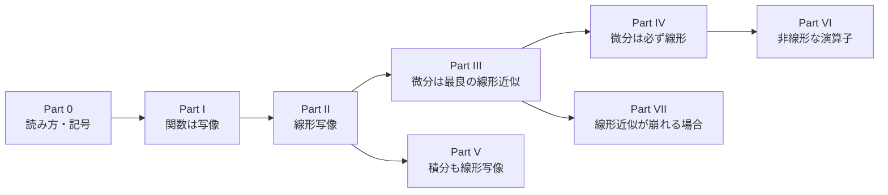

# 関数・線形写像・微分・積分 ―統一的な視点でまとめ直す―

<a id="toc"></a>

## 目次

<!-- toc:start -->

- [Part 0：はじめに ― 読み方・前提・記号](#p0)
  - [1. このノートについて](#p0-1)
  - [2. 前提知識](#p0-2)
  - [3. ノートの構成](#p0-3)
  - [4. 記号の約束](#p0-4)
- [Part I：関数とは「写像」である](#p1)
  - [1. 関数の一般的な定義](#p1-1)
  - [2. さまざまな「関数」を、この枠組みで見直す](#p1-2)
- [Part II：線形写像とは何か](#p2)
  - [1. 線形写像の定義](#p2-1)
  - [2. 線形写像の具体例（他のノートから）](#p2-2)
  - [3. 線形「ではない」写像の具体例：det](#p2-3)
- [Part III：微分とは「最良の線形近似」である](#p3)
  - [1. 前提知識：開集合（Ω）と、連続・微分可能・滑らかの階層](#p3-1)
  - [2. 微分（全微分）の正式な定義](#p3-2)
  - [3. 具体例1：f(x)=x^2（ℝ→ℝ）](#p3-3)
  - [4. 具体例2：f=det（M\_n(ℝ)→ℝ）](#p3-4)
  - [5. ヤコビ行列は「線形写像の行列表現」](#p3-5)
- [Part IV：なぜ「微分は必ず線形」なのか（一般論としての確認）](#p4)
- [Part V：積分も線形写像である](#p5)
  - [1. 積分の線形性](#p5-1)
  - [2. 積分のノートとの接続：ペアリング ⟨ω,C⟩](#p5-2)
  - [3. Hodgeラプラシアン ⋆ d⋆ d も、線形写像の合成](#p5-3)
- [Part VI：非線形な演算子との対比 ―p-ラプラシアンとの接続](#p6)
- [Part VII：線形近似そのものが崩れる場合](#p7)
  - [1. 偏微分は存在するのに、全微分（線形近似）が存在しない関数](#p7-1)
  - [2. 他のノートに現れる同じ種類の崩壊：ln√|g|の座標特異点](#p7-2)
  - [3. 区別すべき点：det自体はどこでも滑らか](#p7-3)
  - [4. もう一つの崩壊パターン：近似の"質"が実用上崩れる場合](#p7-4)
  - [5. Part VII のまとめ](#p7-5)
- [まとめ：全体の構造](#summary)

<!-- toc:end -->

---

<a id="p0"></a>

# Part 0：はじめに ― 読み方・前提・記号

<!-- part-toc:start -->

**この Part の内容**

- [1. このノートについて](#p0-1)
- [2. 前提知識](#p0-2)
- [3. ノートの構成](#p0-3)
- [4. 記号の約束](#p0-4)

<!-- part-toc:end -->

<a id="p0-1"></a>

## 1. このノートについて

このノートは、**関数とは写像である**という視点から、線形写像・微分・積分がどう関係し合っているかを整理します。

出発点は、行列式 $\det$ の微分を計算すると、$\det(M+\Delta M)-\det M$ に2次の項が残る、という具体的な計算です。この「2次の項を捨てて、1次の部分だけを取り出す」という操作を突き詰めると、「微分とは、写像を局所的に最もよく近似する**線形写像**である」という、微分の定義そのものに行き着きます。

この視点に立つと、他のノートに出てくる演算子（行列式の微分、外微分 $d$、ホッジスター $\star$、積分 $\int$、ホッジラプラシアン、$p$-ラプラシアン）が、すべて1本の軸の上に並びます。

<a id="p0-2"></a>

## 2. 前提知識

- **高校数学の微分・積分**と、**多変数の偏微分**、**行列の積と行列式**を前提にしています。
- 例として、他のノートの対象（外微分、ホッジスター、リー微分の流れ、計量など）が出てきます。それらのノートを読んでいなくても、「こういう写像がある」という例として読めるように書いています。詳しい定義は、それぞれのノートへのリンクを参照してください。

<a id="p0-3"></a>

## 3. ノートの構成



Part I〜II で、写像と線形写像を定義します。Part III〜IV が中心で、微分を「最良の線形近似」として定義し、微分が必ず線形写像になる理由を確認します。Part V は積分、Part VI は非線形な演算子（$p$-ラプラシアン）との対比、Part VII は線形近似そのものが崩れる場合です。

<a id="p0-4"></a>

## 4. 記号の約束

- **ベクトル空間**：$V,W$ はベクトル空間（足し算とスカラー倍ができる集合）です。長さ（ノルム）を $\|h\|$ と書きます。
- **小さい誤差** $o(\|h\|)$：$h\to0$ のとき、$\|h\|$ で割ってもゼロに近づく量（$\|h\|$ よりも速くゼロに近づく量）です。
- **行列の集合**：$M_n(\mathbb R)$ は、実数を成分とする $n\times n$ 行列の全体です。
- **関数やベクトル場の集合**（Part I §2 の例で使います）：多様体 $M$ の上の滑らかな関数の全体を $C^\infty(M)$、ベクトル場の全体を $\Gamma(TM)$、$k$-形式の全体を $\Omega^k$ と書きます。多様体やベクトル場を知らなくても、「関数の集まり」「ベクトル場の集まり」と読めば十分です。
- **参照の書き方**：「Part III §2」は、Part III の2番目の節です。節の番号は、Part ごとに 1 から振っています。

---

<a id="p1"></a>

# Part I：関数とは「写像」である

<!-- part-toc:start -->

**この Part の内容**

- [1. 関数の一般的な定義](#p1-1)
- [2. さまざまな「関数」を、この枠組みで見直す](#p1-2)

<!-- part-toc:end -->

<a id="p1-1"></a>

## 1. 関数の一般的な定義

$$
\boxed{f: A \to B}
$$

（集合$A$の各元に、集合$B$の元をちょうど1つ対応させる規則。$A$を**定義域**、$B$を**終域**と呼びます。）高校数学の「$f(x)=x^2$」（$A=B=\mathbb R$）も、この一般的な定義の特別な場合にすぎません。

<a id="p1-2"></a>

## 2. さまざまな「関数」を、この枠組みで見直す

$$
\boxed{
\begin{aligned}
f(x)=x^2&:\ \mathbb R\to\mathbb R\\
\det&:\ M_n(\mathbb R)\to\mathbb R\qquad(\text{行列を"入力"とする関数})\\
\operatorname{grad}&:\ C^\infty(M)\to\Gamma(TM)\qquad(\text{関数からベクトル場への対応})\\
d&:\ \Omega^k\to\Omega^{k+1}\qquad(k\text{-形式から}(k+1)\text{-形式への対応})\\
\phi_t&:\ M\to M\qquad(\text{多様体上の点から点への対応、リー微分のノートの"流れ"})
\end{aligned}
}
$$

**「$x$を入力すると数が返る」という素朴な関数のイメージだけでなく、「行列を入力すると数が返る（$\det$）」「関数を入力するとベクトル場が返る（$\operatorname{grad}$）」「形式を入力すると別の形式が返る（$d$）」というものまで、すべて同じ"写像"という言葉で統一的に扱えます。** このリポジトリのノートで扱う対象は、すべてこの土台の上にあります。

---

<a id="p2"></a>

# Part II：線形写像とは何か

<!-- part-toc:start -->

**この Part の内容**

- [1. 線形写像の定義](#p2-1)
- [2. 線形写像の具体例（他のノートから）](#p2-2)
- [3. 線形「ではない」写像の具体例：det](#p2-3)

<!-- part-toc:end -->

<a id="p2-1"></a>

## 1. 線形写像の定義

写像$L:V\to W$（$V,W$はベクトル空間）が**線形**であるとは：

$$
\boxed{L(x+y) = L(x)+L(y),\qquad L(cx) = c\,L(x)}
$$

（足し算とスカラー倍を、そのまま保つ。）2つを1つにまとめると：

$$
\boxed{L(ax+by) = a\,L(x)+b\,L(y)}
$$

<a id="p2-2"></a>

## 2. 線形写像の具体例（他のノートから）

$$
\boxed{
\begin{aligned}
&\text{行列の積}\ x\mapsto Mx\qquad(\text{最も基本的な線形写像})\\
&\text{微分演算子}\ f\mapsto f'\qquad\big((af+bg)'=af'+bg'\big)\\
&\text{外微分}\ \omega\mapsto d\omega\qquad\big(d(a\omega+b\eta)=a\,d\omega+b\,d\eta\big)\\
&\text{Hodgeスター}\ \alpha\mapsto\star\alpha\qquad(\text{定義式}\beta\wedge\star\alpha=\langle\beta,\alpha\rangle\operatorname{vol}\text{が}\alpha\text{について線形})\\
&\text{積分}\ f\mapsto\int f\,dx\qquad\Big(\int(af+bg)\,dx=a\int f\,dx+b\int g\,dx\Big)
\end{aligned}
}
$$

**他のノートで扱う主要な演算子（$d,\star,\int$）は、すべて線形写像です。**

<a id="p2-3"></a>

## 3. 線形「ではない」写像の具体例：$\det$

$$
\det(A+B) \ne \det A+\det B
$$

**具体的に確認します**：$A=B=I$（$2\times2$単位行列）とすると、$\det(A+B)=\det(2I)=4$、一方$\det A+\det B=1+1=2$。**$4\ne2$なので、$\det$は線形ではありません。**（正確には、$\det$ は**多重線形**です。1つの列（または行）だけを動かし、他を固定すると、その列について線形です。しかし、行列全体を入力とみなすと、上のとおり線形ではありません。）

$f(x)=x^2$も同じく非線形です：$f(x+y)=(x+y)^2=x^2+2xy+y^2\ne f(x)+f(y)=x^2+y^2$（$xy\ne0$なら）。

---

<a id="p3"></a>

# Part III：微分とは「最良の線形近似」である

<!-- part-toc:start -->

**この Part の内容**

- [1. 前提知識：開集合（Ω）と、連続・微分可能・滑らかの階層](#p3-1)
- [2. 微分（全微分）の正式な定義](#p3-2)
- [3. 具体例1：f(x)=x^2（ℝ→ℝ）](#p3-3)
- [4. 具体例2：f=det（M\_n(ℝ)→ℝ）](#p3-4)
- [5. ヤコビ行列は「線形写像の行列表現」](#p3-5)

<!-- part-toc:end -->

<a id="p3-1"></a>

## 1. 前提知識：開集合（$\Omega$）と、連続・微分可能・滑らかの階層

微分の定義に入る前に、他のノートで断りなく使っている「$\Omega\subset\mathbb R^n$（開集合）」「$C^\infty$（滑らか）」という前提を、ここで確認しておきます。

**開集合とは何か**：$U\subset\mathbb R^n$が**開集合**であるとは、$U$のどの点$p$についても、$p$を中心とする（十分小さい）球が、まるごと$U$の中に収まることです。直感的には「境界を含まない」集合です。

**なぜ微分の定義に開集合が必要か**：後述する微分の定義は、$h\to0$という極限を**あらゆる方向から**取れることを前提にしています。もし$x$が定義域の端（境界）だったら、ある方向には$h$を動かせません。**具体例**：$f:[0,1]\to\mathbb R$なら、$x=0$では「左から近づく」ことができません（$0-h\notin[0,1]$、$h>0$のとき）。定義域を開区間$(0,1)$にすれば、内部のどの点も全方向に自由に動けます。微分幾何・解析の教科書が「$\Omega\subset\mathbb R^n$を開集合とする」と前置きするのは、**この「全方向に動ける余地」を保証するため**です。

**「連続」と「滑らか（$C^\infty$）」は別問題ではなく「階層」**：

$$
\boxed{C^0(\text{連続})\ \supseteq\ \text{微分可能}\ \supseteq\ C^1(\text{連続微分可能})\ \supseteq\ C^2\ \supseteq\ \cdots\ \supseteq\ C^\infty(\text{滑らか})}
$$

成り立つ関係を整理すると：

- **微分可能 $\Rightarrow$ 連続**（常に成り立つ：$f(x+h)-f(x)=Df_x(h)+o(\|h\|)\to0$なので、$h\to0$で自動的に$f(x+h)\to f(x)$が従う）
- **連続 $\not\Rightarrow$ 微分可能**（$f(x)=|x|$は$x=0$で連続だが微分不可能、という有名な反例）
- **偏微分が存在する $\not\Rightarrow$ 微分可能**（Part VII §1 で扱う$f(x,y)=xy/(x^2+y^2)$の例がまさにこれです。この関数は原点で不連続なので微分可能ではあり得ませんが、偏微分だけは存在します）
- **偏微分が存在し、かつ連続（$C^1$級） $\Rightarrow$ 微分可能**（標準的な十分条件の定理）

「滑らか（$C^\infty$）」は「連続」を含む、より強い条件であり、両者は独立した別々の性質ではなく、**弱い条件から強い条件へ一列に並んだ階層**です。「連続かどうか」と「微分可能かどうか」は別問題に見えて、実はこの階層のどの段階にいるかを確認しないまま議論を進めると、思わぬ食い違い（偏微分は存在するのに微分可能でない、など）に出くわす、という関係にあります。

<a id="p3-2"></a>

## 2. 微分（全微分）の正式な定義

$f:V\to W$が点$x$で微分可能であるとは、**ある線形写像$Df_x:V\to W$が存在して**：

$$
\boxed{f(x+h) = f(x)+Df_x(h)+o(\|h\|)}
$$

（$o(\|h\|)$は、$h\to0$のとき$\|h\|$よりもさらに速くゼロに近づく誤差項。）**この線形写像$Df_x$こそが、$x$における$f$の微分です。**

**重要な点**：$f$自身がどんなに非線形（$x^2$、$\det$、その他）であっても、**その微分$Df_x$は、定義上、常に線形写像です。** これは天下り的な性質ではなく、**「線形写像による近似の中で、最も誤差が小さいもの」として、微分がそもそもそう定義されている**からです。

<a id="p3-3"></a>

## 3. 具体例1：$f(x)=x^2$（$\mathbb R\to\mathbb R$）

$$
f(x+h)-f(x) = (x+h)^2-x^2 = 2xh+h^2
$$

$2xh$は$h$について線形（$h\mapsto2xh$は明らかに線形写像）、$h^2$は$o(h)$（$h\to0$で$h^2/h=h\to0$）。したがって：

$$
Df_x(h) = 2x\,h,\qquad df = 2x\,dx
$$

<a id="p3-4"></a>

## 4. 具体例2：$f=\det$（$M_n(\mathbb R)\to\mathbb R$）

$2\times2$ の場合に、実際に展開します。$\det(M+\Delta M)=(M_{11}+\Delta M_{11})(M_{22}+\Delta M_{22})-(M_{12}+\Delta M_{12})(M_{21}+\Delta M_{21})$ を展開し、$\det M=M_{11}M_{22}-M_{12}M_{21}$ を引くと：

$$
\det(M+\Delta M)-\det M = \underbrace{M_{22}\Delta M_{11}+M_{11}\Delta M_{22}-M_{21}\Delta M_{12}-M_{12}\Delta M_{21}}_{\Delta M\text{について線形}} + \underbrace{\Delta M_{11}\Delta M_{22}-\Delta M_{12}\Delta M_{21}}_{O(\|\Delta M\|^2)}
$$

線形部分だけを取り出したものが：

$$
\boxed{D\det_M[\Delta M] = M_{22}\Delta M_{11}+M_{11}\Delta M_{22}-M_{21}\Delta M_{12}-M_{12}\Delta M_{21} = d(\det M)}
$$

**線形性の確認**：$\Delta M\mapsto D\det_M[\Delta M]$は、$\Delta M$の各成分の**1次式**（2次の項を一切含まない）なので、確かに線形写像です。$\Delta M_{11}\Delta M_{22}$のような2次の項は、$o(\|\Delta M\|)$として切り捨てられ、**線形写像として残るのは1次の部分だけ**、という点が、この例の核心です。

<a id="p3-5"></a>

## 5. ヤコビ行列は「線形写像の行列表現」

$F:\mathbb R^n\to\mathbb R^m$のとき、$DF_x$という線形写像を、具体的な数の並び（行列）で表したものが**ヤコビ行列**です：

$$
DF_x(h) = J_F(x)\,h,\qquad J_F(x) = \left(\frac{\partial F^i}{\partial x^j}\right)
$$

**「微分＝線形写像」という抽象的な定義を、具体的な計算に落とし込むための道具が、ヤコビ行列**です。[クリストッフェル記号のノート](../02_微分幾何/christoffel_riemann_intro.md)で扱う$J^a{}_i=\partial x^a/\partial q^i$（ヤコビアン）は、まさにこの一般論の、座標変換という特別な場合への適用です。

---

<a id="p4"></a>

# Part IV：なぜ「微分は必ず線形」なのか（一般論としての確認）

$$
\boxed{
\begin{aligned}
&f\text{自身が線形かどうかは、}f\text{ごとにまったく違う（}\det\text{は非線形、}Mx\text{は線形）}\\
&\text{しかし}Df_x\text{（微分）は、}f\text{が何であれ、常に線形写像になるよう定義されている}\\
&\text{理由：微分は「1次近似のうち最良のもの」として定義され、"1次"という言葉自体が"線形"の言い換えだから}
\end{aligned}
}
$$

$f$が最初から線形（$f=L$、線形写像）なら、$f(x+h)-f(x)=L(h)$（誤差項$o(\|h\|)$なしで、厳密に成り立つ）なので、$Df_x=L$、つまり**線形写像の微分は、自分自身**です。これは、$f(x)=Mx$（線形）を微分すると$Df_x(h)=Mh$（$f$と同じ$M$）になる、という当たり前の事実の、一般論での言い方です。

---

<a id="p5"></a>

# Part V：積分も線形写像である

<!-- part-toc:start -->

**この Part の内容**

- [1. 積分の線形性](#p5-1)
- [2. 積分のノートとの接続：ペアリング ⟨ω,C⟩](#p5-2)
- [3. Hodgeラプラシアン ⋆ d⋆ d も、線形写像の合成](#p5-3)

<!-- part-toc:end -->

<a id="p5-1"></a>

## 1. 積分の線形性

$$
\boxed{\int_a^b\big(\alpha f(x)+\beta g(x)\big)\,dx = \alpha\int_a^bf(x)\,dx+\beta\int_a^bg(x)\,dx}
$$

これは、積分がリーマン和（**有限個の値の、重み付き線形結合**）の極限として定義されているため、線形結合の操作がそのまま極限を通り抜ける、という性質です。**微分だけでなく、積分もまた線形写像**です。

<a id="p5-2"></a>

## 2. 積分のノートとの接続：ペアリング $\langle\omega,C\rangle$

[積分のノート](../03_多様体・微分形式・トポロジー/integration_algebraic_structure_stokes.md)で扱う $\langle\omega,C\rangle:=\int_C\omega$ というペアリングは、**$\omega$について線形**です（$\int_C(a\omega+b\eta)=a\int_C\omega+b\int_C\eta$）。Stokesの定理 $\langle d\omega,C\rangle=\langle\omega,\partial C\rangle$ は、**$d$（線形）と$\int$（線形）という、2つの線形写像を組み合わせた恒等式**だ、という見方ができます。

<a id="p5-3"></a>

## 3. Hodgeラプラシアン $\star d\star d$ も、線形写像の合成

[ホッジスターのノート](../03_多様体・微分形式・トポロジー/differential_forms_hodge_star.md)で導出する $\Delta f=\star d\star df$ は、**$d,\star$という2つの線形写像を、順番に合成しただけ**です。線形写像同士の合成は、常にまた線形写像になる（$L_2(L_1(ax+by))=L_2(aL_1(x)+bL_1(y))=aL_2(L_1(x))+bL_2(L_1(y))$）ので、$\Delta=\star d\star d$自体も線形写像（線形微分作用素）であることが、この一般論から即座に分かります。

---

<a id="p6"></a>

# Part VI：非線形な演算子との対比 ―$p$-ラプラシアンとの接続

[非線形ラプラシアンのノート](nonlinear_laplacian_p_laplacian.md)で扱う$p$-ラプラシアン

$$
\Delta_pu = \operatorname{div}\big(|\nabla u|^{p-2}\nabla u\big)
$$

が非線形なのは、**係数$|\nabla u|^{p-2}$自体が、入力$u$に依存しているから**です。$\operatorname{div}$と$\nabla$は、それぞれ単体では線形写像（$d,\star$の合成）ですが、**その間に挟まる$|\nabla u|^{p-2}$という「入力によって変わる重み」**が、全体としての線形性を壊しています。

$$
\boxed{
\begin{aligned}
&\Delta u=\operatorname{div}(\nabla u)\text{：}\nabla,\operatorname{div}\text{とも線形写像、その合成も線形（}\Delta(au+bv)=a\Delta u+b\Delta v\text{）}\\
&\Delta_pu=\operatorname{div}(|\nabla u|^{p-2}\nabla u)\text{：係数が}u\text{自身に依存するため、全体としては非線形}
\end{aligned}
}
$$

**「線形写像の合成でできているかどうか」を確認するだけで、ある演算子が線形か非線形かを見抜ける**、というのが、この一連の議論から得られる、実用上のチェック方法です。

---

<a id="p7"></a>

# Part VII：線形近似そのものが崩れる場合

<!-- part-toc:start -->

**この Part の内容**

- [1. 偏微分は存在するのに、全微分（線形近似）が存在しない関数](#p7-1)
- [2. 他のノートに現れる同じ種類の崩壊：ln√|g|の座標特異点](#p7-2)
- [3. 区別すべき点：det自体はどこでも滑らか](#p7-3)
- [4. もう一つの崩壊パターン：近似の"質"が実用上崩れる場合](#p7-4)
- [5. Part VII のまとめ](#p7-5)

<!-- part-toc:end -->

「1次の項を切り出す」という操作（Part III）が、**そもそも成り立たない、あるいは意味を失う**特殊な状況を整理しておきます。

<a id="p7-1"></a>

## 1. 偏微分は存在するのに、全微分（線形近似）が存在しない関数

$$
f(x,y) := \begin{cases}\dfrac{xy}{x^2+y^2}&((x,y)\ne(0,0))\\0&((x,y)=(0,0))\end{cases}
$$

**原点での偏微分**：$y=0$上で$f\equiv0$なので $\partial f/\partial x(0,0)=\lim_{h\to0}\frac{f(h,0)-0}h=0$。同様に$\partial f/\partial y(0,0)=0$。**両方ともきちんと存在し、値はゼロです。**

**ところが、近づく方向によって関数の値そのものが変わります**：$y=x$（対角線）に沿って原点に近づくと

$$
f(x,x) = \frac{x^2}{2x^2} = \frac12\qquad(\text{どんなに}x\to0\text{でも、常に}\tfrac12)
$$

$x$軸に沿えば$0$、対角線に沿えば$\frac12$——**同じ点に近づいているのに、行き先が方向によって違う**ため、この関数は原点で連続でさえなく、**線形近似（全微分）は存在しません**。「各方向の傾きは分かるのに、それをつなぎ合わせた"平面"が作れない」という、微分可能性の定義（Part III §2）が要求する条件が満たされない例です。

<a id="p7-2"></a>

## 2. 他のノートに現れる同じ種類の崩壊：$\ln\sqrt{|g|}$の座標特異点

[クリストッフェル記号のノート](../02_微分幾何/christoffel_riemann_intro.md#supp-1)の補遺 §1 で扱うJacobiの公式 $\partial_j\ln|\det M|=\operatorname{tr}(M^{-1}\partial_jM)$ は、$M$が正則（$\det M\ne0$）でなければ意味を持ちません。**これが、球座標の極（$\theta=0,\pi$）で実際に起きています。** $\sqrt{|g|}=r^2\sin\theta$は$\theta=0,\pi$でゼロ（計量が特異）になり：

$$
\ln\sqrt{|g|} = \ln(r^2\sin\theta) \to -\infty\qquad(\theta\to0\text{ or }\pi)
$$

$\ln\sqrt{|g|}$自体が定義できなくなり、その微分（クリストッフェル記号$\Gamma^i{}_{ij}$）もこの点では意味を失います。**ただしこれは球座標という座標系の取り方の問題（座標特異点）であって、空間$\mathbb R^3$自体は極でも何も特別なことは起きていません。** 北極点も、他のどの地点とも変わらない、普通の場所です。$\det g\to0$は「座標の目盛りが、その点で潰れてしまう」という測り方の不具合であり、幾何学的な破綻ではありません。

<a id="p7-3"></a>

## 3. 区別すべき点：$\det$自体はどこでも滑らか

念のため、**$\det:M_n(\mathbb R)\to\mathbb R$という関数自体は、多項式（各成分の積と和だけ）なので、あらゆる$M$で何の問題もなく微分可能です。** $\det M=0$（特異行列）であっても、$d(\det M)$（線形近似）はちゃんと存在します。**崩壊するのは$\det M$自体ではなく、$\ln|\det M|$や$M^{-1}$のような、"$\det M=0$で割り算が発生する"派生的な量**です。

<a id="p7-4"></a>

## 4. もう一つの崩壊パターン：近似の"質"が実用上崩れる場合

技術的に微分可能でも、$\Delta M$が「小さい」とは言えないほど大きい状況では、**2次の項を無視する近似そのものが、実用上は役に立たなくなります**。これは定義の破綻ではなく近似の質の問題です。物理でよく使われる**線形化**（強い重力場での一般相対論を、弱い重力場近似で線形の式に置き換える、など）は、ブラックホール近傍のような強い曲率の領域では、この意味で破綻します。

<a id="p7-5"></a>

## 5. Part VII のまとめ

$$
\boxed{
\begin{aligned}
&\text{①線形近似がそもそも存在しない：偏微分は存在するのに全微分は存在しない、という病的な関数がある}\\
&\text{②}\ln\sqrt{|g|}\text{の特異点：計量が退化する点（球座標の極）で、Jacobiの公式自体が意味を失う（座標特異点）}\\
&\text{③}\det\text{自体は多項式なのでどこでも滑らか、崩壊するのは}\ln|\det|,M^{-1}\text{のような派生量}\\
&\text{④線形近似が数学的には存在しても、}\Delta M\text{が大きすぎれば実用上は破綻する（強い重力場の線形化など）}
\end{aligned}
}
$$

---

<a id="summary"></a>

# まとめ：全体の構造

```
関数＝写像 f: A → B
        │
        ├─ 線形写像 L: L(ax+by)=aL(x)+bL(y)
        │     例：行列の積、d（外微分）、⋆（Hodgeスター）、∫（積分）
        │
        └─ 非線形写像（一般の f）
              例：f(x)=x²、det（多重線形）、p-ラプラシアンの係数部分

微分 Df_x：
   f(x+h)-f(x) = Df_x(h) + o(‖h‖)
        │
        │ f が非線形でも、Df_x は常に線形（定義よりそう作られている）
        ▼
   d(det M) = D(det)_M[dM]（線形部分だけを取り出したもの）
   ヤコビ行列 = Df_x の具体的な行列表現

積分 ∫：
   線形写像として、微分と対をなす（Stokesの定理、⟨dω,C⟩=⟨ω,∂C⟩）

線形写像の合成は常に線形：
   Δ=⋆d⋆d（線形） vs Δ_p=div(|∇u|^{p-2}∇u)（係数がuに依存するため非線形）
```

「$\det(M+\Delta M)-\det M$ を展開すると2次の項が残る」という具体的な計算は、**「関数とは写像であり、微分とはその写像を局所的に最良近似する線形写像である」という、微分積分学全体を貫く最も基本的な定義**に、まっすぐつながっています。$d,\star,\int$ という、他のノートで何度も登場する演算子は、すべて「線形写像」という共通の性質を持っています。$p$-ラプラシアンのような非線形の例は、その性質が崩れる具体的な仕組みを教えてくれます。
