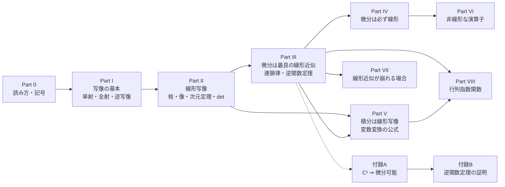
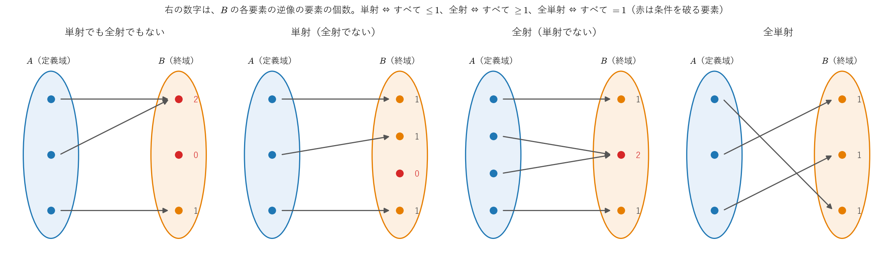
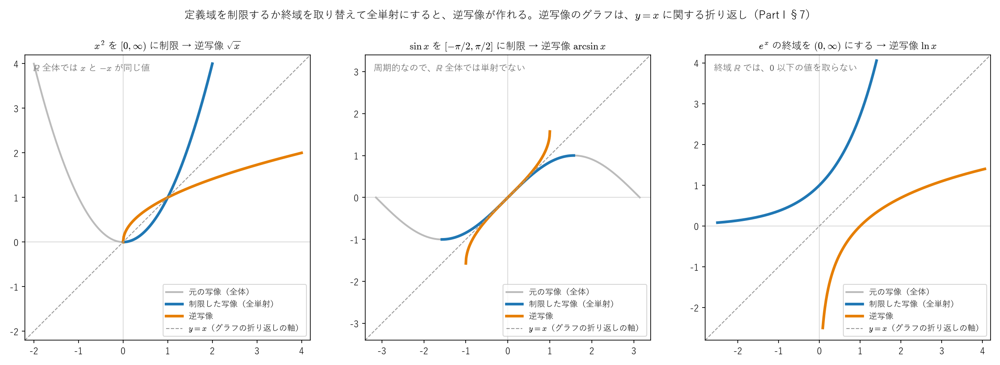
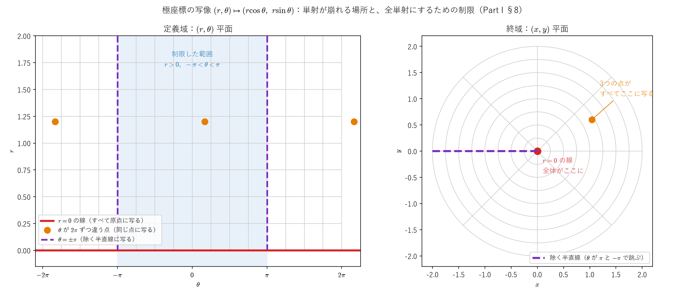
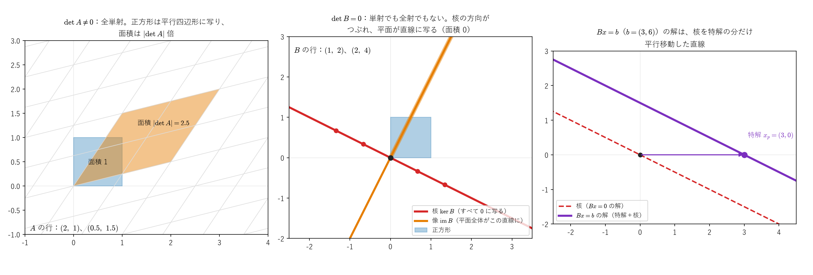
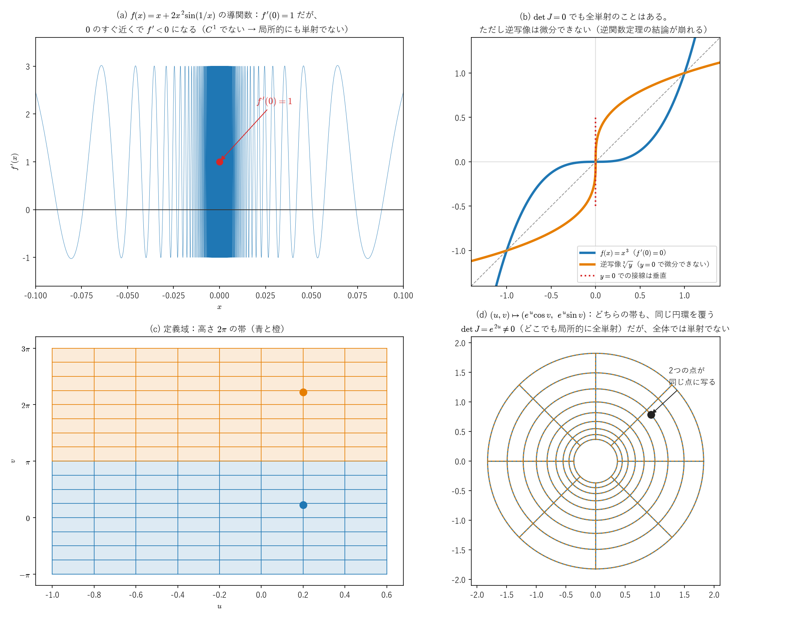
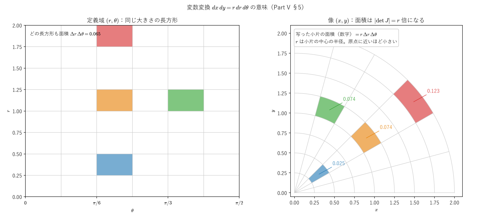
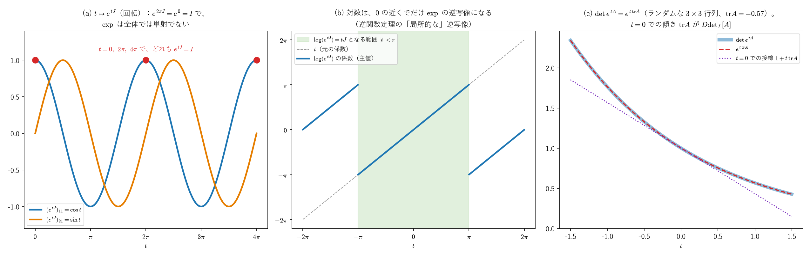

# 関数・線形写像・微分・積分 ―統一的な視点でまとめ直す―

<a id="toc"></a>

## 目次

<!-- toc:start -->

- [Part 0：はじめに ― 読み方・前提・記号](#p0)
  - [1. このノートについて](#p0-1)
  - [2. 前提知識](#p0-2)
  - [3. ノートの構成](#p0-3)
  - [4. 記号の約束](#p0-4)
- [Part I：関数とは「写像」である](#p1)
  - [1. 関数の一般的な定義](#p1-1)
  - [2. さまざまな「関数」を、この枠組みで見直す](#p1-2)
  - [3. 像と逆像](#p1-3)
  - [4. 単射・全射・全単射](#p1-4)
  - [5. 合成と恒等写像](#p1-5)
  - [6. 逆写像](#p1-6)
  - [7. 制限と終域の取り替え：全単射にする](#p1-7)
  - [8. 座標とは全単射である：極座標の例](#p1-8)
- [Part II：線形写像とは何か](#p2)
  - [1. 線形写像の定義](#p2-1)
  - [2. 線形写像の具体例（他のノートから）](#p2-2)
  - [3. 線形「ではない」写像の具体例：det](#p2-3)
  - [4. 線形写像の基本性質](#p2-4)
  - [5. 核と像](#p2-5)
  - [6. 単射 ⇔ 核がゼロ](#p2-6)
  - [7. 基底・次元と、次元定理](#p2-7)
  - [8. 同じ次元なら「単射 ⇔ 全射」](#p2-8)
  - [9. 行列表現と、「合成 ⇔ 行列の積」](#p2-9)
  - [10. 正方行列：単射 ⇔ 全射 ⇔ det≠0](#p2-10)
  - [11. 多重線形写像と双対空間（他のノートへの橋渡し）](#p2-11)
- [Part III：微分とは「最良の線形近似」である](#p3)
  - [1. 前提知識：開集合（Ω）と、連続・微分可能・滑らかの階層](#p3-1)
  - [2. 微分（全微分）の正式な定義](#p3-2)
  - [3. 具体例1：f(x)=x^2（ℝ→ℝ）](#p3-3)
  - [4. 具体例2：f=det（M\_n(ℝ)→ℝ）](#p3-4)
  - [5. ヤコビ行列は「線形写像の行列表現」](#p3-5)
  - [6. 微分の一意性と、方向微分・偏微分](#p3-6)
  - [7. 連鎖律：合成写像の微分は、微分の合成](#p3-7)
  - [8. 逆写像の微分](#p3-8)
  - [9. 逆関数定理（主張）](#p3-9)
  - [10. 局所と大域：極座標と複素指数関数](#p3-10)
- [Part IV：なぜ「微分は必ず線形」なのか（一般論としての確認）](#p4)
- [Part V：積分 ―線形写像と、変数変換の公式―](#p5)
  - [1. 積分の線形性](#p5-1)
  - [2. 積分のノートとの接続：ペアリング ⟨ω,C⟩](#p5-2)
  - [3. Hodgeラプラシアン ⋆ d⋆ d も、線形写像の合成](#p5-3)
  - [4. 1変数の置換積分：連鎖律と微積分の基本定理から](#p5-4)
  - [5. 多変数の変数変換：|det J| は面積の倍率](#p5-5)
  - [6. なぜ全単射が必要か](#p5-6)
  - [7. 微分形式で見ると：向きと det J の符号](#p5-7)
- [Part VI：非線形な演算子との対比 ―p-ラプラシアンとの接続](#p6)
- [Part VII：線形近似そのものが崩れる場合](#p7)
  - [1. 偏微分は存在するのに、全微分（線形近似）が存在しない関数](#p7-1)
  - [2. 他のノートに現れる同じ種類の崩壊：ln√|g|の座標特異点](#p7-2)
  - [3. 区別すべき点：det自体はどこでも滑らか](#p7-3)
  - [4. もう一つの崩壊パターン：近似の"質"が実用上崩れる場合](#p7-4)
  - [5. Part VII のまとめ](#p7-5)
- [Part VIII：行列指数関数 ―写像・線形化・逆関数定理の総合例―](#p8)
  - [1. 定義と収束](#p8-1)
  - [2. 1パラメータ群と、微分方程式](#p8-2)
  - [3. 写像としての exp：原点での微分は恒等写像](#p8-3)
  - [4. 局所的な逆写像：対数](#p8-4)
  - [5. 大域では、単射でも全射でもない](#p8-5)
  - [6. det∘exp=exp∘tr：線形化すると det は tr になる](#p8-6)
  - [7. 群の視点](#p8-7)
- [まとめ：全体の構造](#summary)
- [付録A：偏微分が連続なら微分可能](#appA)
  - [A-1. 主張と証明](#A-1)
  - [A-2. 平均値の不等式](#A-2)
- [付録B：逆関数定理の証明](#appB)
  - [B-1. 縮小写像の原理](#B-1)
  - [B-2. 方程式を、不動点の問題に直す](#B-2)
  - [B-3. 局所的な全単射](#B-3)
  - [B-4. 逆写像は連続](#B-4)
  - [B-5. 逆写像は微分可能で、Dg=(Df)^-1](#B-5)
  - [B-6. 逆写像は C^1 級](#B-6)
  - [B-7. 数値例：反復で、極座標の逆写像を求める](#B-7)

<!-- toc:end -->

---

<a id="p0"></a>

# Part 0：はじめに ― 読み方・前提・記号

<!-- part-toc:start -->

**この Part の内容**

- [1. このノートについて](#p0-1)
- [2. 前提知識](#p0-2)
- [3. ノートの構成](#p0-3)
- [4. 記号の約束](#p0-4)

<!-- part-toc:end -->

<a id="p0-1"></a>

## 1. このノートについて

このノートは、**関数とは写像である**という視点から、線形写像・微分・積分がどう関係し合っているかを整理します。

出発点は、行列式 $\det$ の微分を計算すると、$\det(M+\Delta M)-\det M$ に2次の項が残る、という具体的な計算です。この「2次の項を捨てて、1次の部分だけを取り出す」という操作を突き詰めると、「微分とは、写像を局所的に最もよく近似する**線形写像**である」という、微分の定義そのものに行き着きます。

本編で証明なしに使った2つの定理（偏微分が連続なら微分可能、逆関数定理）は、付録A・B で証明します。

この視点に立つと、他のノートに出てくる演算子（行列式の微分、外微分 $d$、ホッジスター $\star$、積分 $\int$、ホッジラプラシアン、$p$-ラプラシアン）が、すべて1本の軸の上に並びます。

<a id="p0-2"></a>

## 2. 前提知識

- **高校数学の微分・積分**と、**多変数の偏微分**、**行列の積と行列式**を前提にしています。
- 例として、他のノートの対象（外微分、ホッジスター、リー微分の流れ、計量など）が出てきます。それらのノートを読んでいなくても、「こういう写像がある」という例として読めるように書いています。詳しい定義は、それぞれのノートへのリンクを参照してください。

<a id="p0-3"></a>

## 3. ノートの構成



Part I では、写像の基本（像と逆像、単射・全射・全単射、合成、逆写像、座標）を整理します。Part II では、線形写像の核と像、次元定理、行列表現、行列式 $\det$ と逆行列の関係を扱います。Part III〜IV が中心で、微分を「最良の線形近似」として定義し、連鎖律（合成の微分）と逆関数定理（逆写像の存在）を扱い、微分が必ず線形写像になる理由を確認します。Part V は積分（線形性と、全単射・ヤコビ行列式・積分が合流する変数変換の公式）、Part VI は非線形な演算子（$p$-ラプラシアン）との対比、Part VII は線形近似そのものが崩れる場合です。Part VIII は、行列指数関数を例に、ここまでの道具（全単射、線形化、連鎖律、逆関数定理、局所と大域）をすべて当てはめる総合例で、群の視点にも触れます。

<a id="p0-4"></a>

## 4. 記号の約束

- **ベクトル空間**：$V,W$ はベクトル空間（足し算とスカラー倍ができる集合）です。長さ（ノルム）を $\|h\|$ と書きます。
- **小さい誤差** $o(\|h\|)$：$h\to0$ のとき、$\|h\|$ で割ってもゼロに近づく量（$\|h\|$ よりも速くゼロに近づく量）です。
- **行列の集合**：$M_n(\mathbb R)$ は、実数を成分とする $n\times n$ 行列の全体です。
- **関数やベクトル場の集合**（Part I §2 の例で使います）：多様体 $M$ の上の滑らかな関数の全体を $C^\infty(M)$、ベクトル場の全体を $\Gamma(TM)$、$k$-形式の全体を $\Omega^k$ と書きます。多様体やベクトル場を知らなくても、「関数の集まり」「ベクトル場の集まり」と読めば十分です。
- **参照の書き方**：「Part III §2」は、Part III の2番目の節です。節の番号は、Part ごとに 1 から振っています。

---

<a id="p1"></a>

# Part I：関数とは「写像」である

<!-- part-toc:start -->

**この Part の内容**

- [1. 関数の一般的な定義](#p1-1)
- [2. さまざまな「関数」を、この枠組みで見直す](#p1-2)
- [3. 像と逆像](#p1-3)
- [4. 単射・全射・全単射](#p1-4)
- [5. 合成と恒等写像](#p1-5)
- [6. 逆写像](#p1-6)
- [7. 制限と終域の取り替え：全単射にする](#p1-7)
- [8. 座標とは全単射である：極座標の例](#p1-8)

<!-- part-toc:end -->

<a id="p1-1"></a>

## 1. 関数の一般的な定義

$$
\boxed{f: A \to B}
$$

（集合$A$の各元に、集合$B$の元をちょうど1つ対応させる規則。$A$を**定義域**、$B$を**終域**と呼びます。）高校数学の「$f(x)=x^2$」（$A=B=\mathbb R$）も、この一般的な定義の特別な場合にすぎません。

**「ちょうど1つ」の意味**：$A$ のどの元にも値が決まっていて（値がない元がない）、その値が1つに決まっている（2つ以上の値を持つ元がない）、ということです。例えば「$x$ に、$y^2=x$ となる $y$ を対応させる」という規則は、$\mathbb R\to\mathbb R$ の写像になりません。$x<0$ では $y$ がなく、$x>0$ では $y=\pm\sqrt x$ の2つがあるからです。

**写像は、定義域と終域まで含めて決まる**：2つの写像 $f:A\to B$ と $g:A'\to B'$ が等しいのは、$A=A'$、$B=B'$ で、すべての $x\in A$ について $f(x)=g(x)$ のときです。規則（式）が同じでも、定義域や終域が違えば、別の写像として扱います。§4 で見るとおり、単射・全射かどうかは、定義域と終域の取り方で変わります。

<a id="p1-2"></a>

## 2. さまざまな「関数」を、この枠組みで見直す

$$
\boxed{
\begin{aligned}
f(x)=x^2&:\ \mathbb R\to\mathbb R\\
\det&:\ M_n(\mathbb R)\to\mathbb R\qquad(\text{行列を"入力"とする関数})\\
\operatorname{grad}&:\ C^\infty(M)\to\Gamma(TM)\qquad(\text{関数からベクトル場への対応})\\
d&:\ \Omega^k\to\Omega^{k+1}\qquad(k\text{-形式から}(k+1)\text{-形式への対応})\\
\phi_t&:\ M\to M\qquad(\text{多様体上の点から点への対応、リー微分のノートの"流れ"})
\end{aligned}
}
$$

**「$x$を入力すると数が返る」という素朴な関数のイメージだけでなく、「行列を入力すると数が返る（$\det$）」「関数を入力するとベクトル場が返る（$\operatorname{grad}$）」「形式を入力すると別の形式が返る（$d$）」というものまで、すべて同じ"写像"という言葉で統一的に扱えます。** このリポジトリのノートで扱う対象は、すべてこの土台の上にあります。


<a id="p1-3"></a>

## 3. 像と逆像

写像 $f:A\to B$ について、2つの集合を定義します。

**像**：$A$ の部分集合 $S$ の元を、すべて $f$ で写したものの集まりを、$S$ の**像**と呼びます。

$$
f(S):=\{f(x)\ :\ x\in S\}\subset B
$$

特に、定義域全体の像 $f(A)$ を、$f$ の**値域**と呼びます。終域 $B$ と値域 $f(A)$ は、一般には違います。終域は「値が入る場所」として最初に決めた集合で、値域は「実際に値として現れるもの」の集まりです。

**逆像**：$B$ の部分集合 $T$ について、「$f$ で写すと $T$ に入る元」の集まりを、$T$ の**逆像**と呼びます。

$$
f^{-1}(T):=\{x\in A\ :\ f(x)\in T\}\subset A
$$

**逆像は、どんな写像についても定義できます。** 後で出てくる逆写像（§6）とは違い、$f$ が逆写像を持たなくてもかまいません。記号 $f^{-1}$ が2つの意味で使われるので、注意が必要です（§6 の最後でまとめます）。

**例**：$f(x)=x^2$（$\mathbb R\to\mathbb R$）とします。

- 像：$f([-1,2])=[0,4]$（$x$ が $-1$ から $2$ まで動くとき、$x^2$ は $0$ から $4$ まで動きます）。値域は $f(\mathbb R)=[0,\infty)$ で、終域 $\mathbb R$ より小さい集合です。
- 逆像：$f^{-1}(\{4\})=\{-2,\ 2\}$（2つの元）、$f^{-1}(\{0\})=\{0\}$（1つ）、$f^{-1}(\{-1\})=\varnothing$（空集合。$x^2=-1$ となる実数はありません）。

**他のノートの例**：逆像は、「方程式 $f(x)=c$ の解の集まり」です。

- ハミルトニアン $H$ の逆像 $H^{-1}(\{E\})$ は、エネルギーが $E$ の点の集まり（等エネルギー面）です（[リー微分のノート](../02_微分幾何/lie_derivative.md#appC)の付録C の図の、灰色の等高線）。
- 線形写像 $L$ の逆像 $L^{-1}(\{0\})$ は、Part II で扱う**核**です。

<a id="p1-4"></a>

## 4. 単射・全射・全単射

$B$ の1つの元 $y$ について、逆像 $f^{-1}(\{y\})$ に何個の元が入っているか（$y$ に写る元が何個あるか）に注目します。

$$
\boxed{
\begin{aligned}
&f\text{ が単射}\iff\text{すべての }y\in B\text{ で、}f^{-1}(\{y\})\text{ の元は }1\text{ 個以下}\\
&f\text{ が全射}\iff\text{すべての }y\in B\text{ で、}f^{-1}(\{y\})\text{ の元は }1\text{ 個以上}\\
&f\text{ が全単射}\iff\text{すべての }y\in B\text{ で、}f^{-1}(\{y\})\text{ の元はちょうど }1\text{ 個}
\end{aligned}
}
$$

ふつうの書き方では、次のとおりです。

- **単射**：$f(x)=f(x')$ ならば $x=x'$。違う元は、違う元に写ります。
- **全射**：すべての $y\in B$ について、$f(x)=y$ となる $x\in A$ がある。値域が終域全体になります（$f(A)=B$）。
- **全単射**：単射かつ全射。$A$ の元と $B$ の元が、1対1にもれなく対応します。



*有限集合の例です。右の数字は、$B$ の各元に向かう矢印の本数（逆像の元の個数）です。赤い元は、単射の条件（1以下）か全射の条件（1以上）を破っています。*

**例：定義域と終域を変えると、答えが変わる**。写像は「規則」だけでなく、定義域と終域まで含めて決まります（§1）。同じ $x^2$ でも、

| 写像 | 単射 | 全射 | 理由 |
|---|---|---|---|
| $x^2:\ \mathbb R\to\mathbb R$ | × | × | $(-2)^2=2^2$。負の数に写る元がない |
| $x^2:\ \mathbb R\to[0,\infty)$ | × | ○ | 終域を値域にそろえた |
| $x^2:\ [0,\infty)\to\mathbb R$ | ○ | × | 定義域を、単調に増える範囲に制限した |
| $x^2:\ [0,\infty)\to[0,\infty)$ | ○ | ○ | 両方を取り替えた（逆写像は $\sqrt{x}$） |
| $x^3:\ \mathbb R\to\mathbb R$ | ○ | ○ | 単調に増え、$\pm\infty$ に届く |
| $e^x:\ \mathbb R\to\mathbb R$ | ○ | × | $0$ 以下の値を取らない |
| $e^x:\ \mathbb R\to(0,\infty)$ | ○ | ○ | 逆写像は $\ln x$ |
| $\sin x:\ \mathbb R\to[-1,1]$ | × | ○ | 周期 $2\pi$ で同じ値を繰り返す |

**他のノートの例**：

- **行列式** $\det:M_n(\mathbb R)\to\mathbb R$（$n\ge2$）は、全射ですが単射ではありません。全射なのは、どんな実数 $c$ も $\det\operatorname{diag}(c,1,\dots,1)=c$ と書けるからです。単射でないのは、例えば $\det\operatorname{diag}(2,\tfrac12)=1=\det I$ だからです。
- **外微分** $d$（関数から1-形式への写像）は、単射でも全射でもありません。単射でないのは、定数 $c$ を足しても $d(f+c)=df$ だからです。全射でないのは、例えば $\mathbb R^2$ の1-形式 $x\,dy$ は、$d(x\,dy)=dx\wedge dy\ne0$ なので、どんな $f$ についても $df$ になりません（$d(df)=0$ のため。[ポアンカレの補題のノート](../03_多様体・微分形式・トポロジー/poincare_lemma_d_squared_zero.md)）。
- **流れ** $\phi_t:M\to M$（[リー微分のノート](../02_微分幾何/lie_derivative.md#p1)）は全単射です。逆写像は $\phi_{-t}$ です。

**実数の関数で単射を確かめる方法**：微分できる関数 $f:\mathbb R\to\mathbb R$ が、すべての点で $f'(x)>0$ なら、平均値の定理から狭義単調増加（$x<x'$ なら $f(x)<f(x')$）なので、単射です。ただし、これは十分条件にすぎません。$x^3$ は $x=0$ で $f'(0)=0$ ですが、単射です。

**有限集合では、単射と全射が同じになる**：$A$ と $B$ がどちらも $n$ 個の元を持つ有限集合なら、

$$
f\text{ が単射}\iff f\text{ が全射}\iff f\text{ が全単射}
$$

です。単射なら、$n$ 個の元が $n$ 個の違う元に写るので、$B$ の元はすべて使われます（全射）。全射なら、$B$ の $n$ 個の元それぞれに少なくとも1つずつ元が必要で、$A$ にはちょうど $n$ 個しかないので、2つ以上の元が同じ元に写ることはできません（単射。鳩の巣原理）。

無限集合ではこれが成り立ちません。自然数の写像 $n\mapsto n+1$ は単射ですが、$0$ に写る元がないので全射ではありません。それでも、**有限次元のベクトル空間の間の線形写像では、同じ次元なら「単射 ⇔ 全射」が成り立ちます**。これは Part II で扱います。

<a id="p1-5"></a>

## 5. 合成と恒等写像

**合成**：$f:A\to B$ と $g:B\to C$ について、「$f$ で写してから $g$ で写す」写像を、$g$ と $f$ の**合成**と呼び、$g\circ f$ と書きます。

$$
g\circ f:A\to C,\qquad(g\circ f)(x):=g\big(f(x)\big)
$$

**先に作用する $f$ が、右に書かれます。** $f$ の終域と $g$ の定義域がそろっている必要があります。

**順序は入れ替えられない**：$f(x)=x+1$、$g(x)=x^2$（どちらも $\mathbb R\to\mathbb R$）なら、

$$
(g\circ f)(x)=(x+1)^2,\qquad(f\circ g)(x)=x^2+1
$$

で、違う写像です。行列の積 $AB\ne BA$ と同じく、合成は一般に交換できません。

**結合法則**：$h\circ(g\circ f)=(h\circ g)\circ f$ です（どちらも、$x$ を $f,g,h$ の順に写します）。括弧を省いて $h\circ g\circ f$ と書けます。

**恒等写像**：集合 $A$ の各元を自分自身に写す写像を、**恒等写像** $\mathrm{id}_A$ と呼びます（$\mathrm{id}_A(x)=x$）。どんな $f:A\to B$ についても、$f\circ\mathrm{id}_A=f$、$\mathrm{id}_B\circ f=f$ です。数の掛け算の $1$、行列の単位行列 $I$ にあたります。

**単射・全射は、合成で保たれる**：

- $f,g$ がどちらも単射なら、$g\circ f$ も単射です。$g(f(x))=g(f(x'))$ なら、$g$ の単射性から $f(x)=f(x')$、$f$ の単射性から $x=x'$ です。
- $f,g$ がどちらも全射なら、$g\circ f$ も全射です。$z\in C$ に対し、$g$ の全射性から $g(y)=z$ となる $y$ があり、$f$ の全射性から $f(x)=y$ となる $x$ があります。

**逆向きの主張**：

- $g\circ f$ が単射なら、$f$ は単射です。$f(x)=f(x')$ なら $g(f(x))=g(f(x'))$ で、$g\circ f$ の単射性から $x=x'$ です。
- $g\circ f$ が全射なら、$g$ は全射です。$z\in C$ に対し $g(f(x))=z$ となる $x$ があり、$y:=f(x)$ が $g(y)=z$ を満たします。

ただし、$g\circ f$ が単射でも、$g$ が単射とは限りません。例えば $f:\mathbb R\to\mathbb R^2$、$f(x)=(x,0)$ と、$g:\mathbb R^2\to\mathbb R$、$g(x,y)=x$ では、$g\circ f=\mathrm{id}_{\mathbb R}$（全単射）ですが、$f$ は全射でなく、$g$ は単射ではありません。

**他のノートの例**：合成は、いたるところに現れます。

- ホッジラプラシアン $\Delta=\star d\star d$ は、$d$ と $\star$ を4回合成した写像です（Part V §3）。
- 流れは $\phi_s\circ\phi_t=\phi_{s+t}$ を満たします（[リー微分のノート](../02_微分幾何/lie_derivative.md#s3)の §3）。
- Part III では、合成写像の微分が、微分の合成（ヤコビ行列の積）になることを見ます（連鎖律）。

<a id="p1-6"></a>

## 6. 逆写像

**定義**：$f:A\to B$ について、

$$
g\circ f=\mathrm{id}_A\qquad\text{かつ}\qquad f\circ g=\mathrm{id}_B
$$

を満たす $g:B\to A$ を、$f$ の**逆写像**と呼び、$f^{-1}$ と書きます。「$f$ で写してから $g$ で戻すと元に戻り、$g$ で写してから $f$ で戻しても元に戻る」写像です。

**主張**：

$$
\boxed{f\text{ が逆写像を持つ}\iff f\text{ が全単射}}
$$

で、逆写像はただ1つです。

**証明**：

- （$\Rightarrow$）$g\circ f=\mathrm{id}_A$ は単射なので、§5 の逆向きの主張から $f$ は単射です。$f\circ g=\mathrm{id}_B$ は全射なので、同じく $f$ は全射です。
- （$\Leftarrow$）$f$ が全単射なら、各 $y\in B$ について $f(x)=y$ となる $x$ がちょうど1つあります（§4）。その $x$ を $g(y)$ と定めると、$g(f(x))=x$、$f(g(y))=y$ です。
- （ただ1つ）$g,g'$ がどちらも逆写像なら、$g=g\circ\mathrm{id}_B=g\circ(f\circ g')=(g\circ f)\circ g'=\mathrm{id}_A\circ g'=g'$ です。

**片側だけの逆**：片方の式だけを満たすものもあります。

- $g\circ f=\mathrm{id}_A$ を満たす $g$（**左逆写像**）があるのは、$f$ が単射のとき（$A$ が空でなければ）です。$f$ の値域の点 $y=f(x)$ には $g(y):=x$ を、値域の外の点には $A$ の好きな元を割り当てればよいからです。
- $f\circ g=\mathrm{id}_B$ を満たす $g$（**右逆写像**）があるのは、$f$ が全射のときです。各 $y\in B$ について、逆像 $f^{-1}(\{y\})$ から元を1つ選んで $g(y)$ とすればよいからです（$B$ が無限集合のとき、「無限個の集合から同時に1つずつ選べる」ことは、選択公理と呼ばれる集合論の約束として認めます）。

逆向きは §5 から分かります。左逆写像 $g$ があれば、$g\circ f=\mathrm{id}_A$ は単射なので $f$ は単射です。右逆写像 $g$ があれば、$f\circ g=\mathrm{id}_B$ は全射なので $f$ は全射です。

片側だけの逆は、一般にただ1つではありません。§5 の例 $f(x)=(x,0)$ では、$g(x,y)=x$ も $g'(x,y)=x+y$ も、$g\circ f=g'\circ f=\mathrm{id}_{\mathbb R}$ を満たす左逆写像です。

**合成の逆写像は、順序が逆になる**：$f:A\to B$、$g:B\to C$ がどちらも全単射なら、

$$
\boxed{(g\circ f)^{-1}=f^{-1}\circ g^{-1}}
$$

です。実際、$(f^{-1}\circ g^{-1})\circ(g\circ f)=f^{-1}\circ(g^{-1}\circ g)\circ f=f^{-1}\circ f=\mathrm{id}_A$ で、逆向きの合成も同様に $\mathrm{id}_C$ です。「靴下をはいてから靴をはいたら、脱ぐときは靴が先」と同じです。同じ形の「順序の反転」は、次の場所にも現れます。

- 行列の逆行列：$(AB)^{-1}=B^{-1}A^{-1}$
- 引き戻し：$(\phi\circ\psi)^*=\psi^*\phi^*$（[リー微分のノート](../02_微分幾何/lie_derivative.md#B-1)の付録B-1）

**記号 $f^{-1}$ の2つの意味**：

| 記号 | 意味 | いつ使えるか |
|---|---|---|
| $f^{-1}(T)$（$T$ は $B$ の部分集合） | 逆像（§3） | どんな写像でも |
| $f^{-1}(y)$（$y$ は $B$ の元）、写像 $f^{-1}$ | 逆写像 | $f$ が全単射のときだけ |

例えば $f(x)=x^2$（$\mathbb R\to\mathbb R$）では、逆像 $f^{-1}(\{4\})=\{-2,2\}$ は意味がありますが、逆写像 $f^{-1}$ はありません。

**実数の関数のグラフ**：$f:\mathbb R\supset I\to J$ が全単射なら、$y=f(x)$ と $x=f^{-1}(y)$ は同じ関係なので、$f^{-1}$ のグラフは、$f$ のグラフを直線 $y=x$ で折り返したものです（$x$ と $y$ の役割を入れ替えるため）。

<a id="p1-7"></a>

## 7. 制限と終域の取り替え：全単射にする

全単射でない写像も、定義域を小さくするか、終域を取り替えれば、全単射にできることがよくあります。

**制限**：$f:A\to B$ と部分集合 $S\subset A$ について、$f$ を $S$ の上だけで考えた写像 $f|_S:S\to B$ を、$f$ の $S$ への**制限**と呼びます。

- **単射にする**：同じ値に写る元のうち、1つだけを残すように定義域を小さくします。
- **全射にする**：終域を値域 $f(A)$ に取り替えます（$f:A\to f(A)$ は、必ず全射です）。

**例**（図）：

- $x^2$ を $[0,\infty)$ に制限し、終域を $[0,\infty)$ にすると全単射で、逆写像が $\sqrt{x}$ です。
- $\sin x$ を $[-\pi/2,\ \pi/2]$ に制限し、終域を $[-1,1]$ にすると全単射で、逆写像が $\arcsin x$ です。
- $e^x$ の終域を $(0,\infty)$ にすると全単射で、逆写像が $\ln x$ です。



*灰色が元の写像の全体、青が制限した写像（全単射）、橙が逆写像です。逆写像のグラフは、青のグラフを破線 $y=x$ で折り返したものです。$\sqrt{\ },\ \arcsin,\ \ln$ は、「全単射にした写像の逆写像」として定義される関数です。*

**どこに制限するかは、選び方の問題**：$x^2$ を $(-\infty,0]$ に制限しても全単射で、そのときの逆写像は $-\sqrt{x}$ です。$\arcsin$ が $[-\pi/2,\ \pi/2]$ の値を返すのは、そう決めた（主値）からで、$\sin x=\tfrac12$ の解は $\pi/6$ 以外にも無数にあります。

<a id="p1-8"></a>

## 8. 座標とは全単射である：極座標の例

**座標系は、空間の点と数の組との全単射です。** 平面のデカルト座標は、点と $(x,y)\in\mathbb R^2$ を1対1に対応させます。極座標は、次の写像で点を表します。

$$
P:(r,\theta)\mapsto(r\cos\theta,\ r\sin\theta)
$$

**$P:[0,\infty)\times\mathbb R\to\mathbb R^2$ は、全射ですが単射ではありません。** 単射が崩れる場所は2種類あります。

- **$\theta$ の周期**：$(r,\theta)$ と $(r,\theta+2\pi)$ は、同じ点に写ります。
- **原点**：$r=0$ なら、$\theta$ が何であっても $P(0,\theta)=(0,0)$ です。$r=0$ の直線全体が、原点という1点に写ります。

**制限して全単射にする**：定義域を $r>0$、$-\pi<\theta<\pi$ に制限し、終域を「平面から、原点を含む負の $x$ 軸 $\{(x,0):x\le0\}$ を除いたもの」にすると、$P$ は全単射です。逆写像は

$$
r=\sqrt{x^2+y^2},\qquad\theta=\operatorname{atan2}(y,x)
$$

です（$\operatorname{atan2}(y,x)$ は、点 $(x,y)$ の偏角を $-\pi<\theta\le\pi$ の範囲で返す関数）。負の $x$ 軸を除くのは、そこで $\theta$ が $\pi$ から $-\pi$ に跳ぶからです。例えば $(-1,\ 0.0001)$ の偏角は $3.1415\dots$ ですが、すぐ下の $(-1,\ -0.0001)$ の偏角は $-3.1415\dots$ です。この半直線を含めると、逆写像が連続になりません。



*左の $(r,\theta)$ 平面の、橙の3点（$\theta$ が $2\pi$ ずつ違う）は、右の $(x,y)$ 平面の同じ1点に写ります。左の赤い線（$r=0$）は、右の原点1点に写ります。青い範囲に制限し、右の紫の半直線を除くと、全単射になります。*

**他のノートとのつながり**：

- [クリストッフェル記号のノート](../02_微分幾何/christoffel_riemann_intro.md)で扱う球面座標の極（$\theta=0,\pi$）は、原点と同じ種類の点です。$\phi$ が何であっても、極は1点に写るので、そこで単射が崩れます。このノートの Part VII §2 の「座標特異点」は、このことです。
- 極座標のヤコビ行列式は $\det J=r$ で、単射が崩れる $r=0$ でちょうどゼロになります。これは偶然ではありません。Part III で扱う**逆関数定理**は、「ヤコビ行列式がゼロでない点の近くでは、写像は全単射になる（局所的に逆写像を持つ）」ことを主張します。逆に、$\theta$ の周期による単射の崩れは、$\det J=r\ne0$ の場所でも起きます。これは「近くでは全単射でも、全体では単射でない」という、局所と大域の違いです。
- 多様体は、このような「一部分だけを覆う座標系（チャート）」を貼り合わせて全体を表す、という考え方で定義されます（[多様体のノート](../03_多様体・微分形式・トポロジー/manifolds_introduction.md)）。

---

<a id="p2"></a>

# Part II：線形写像とは何か

<!-- part-toc:start -->

**この Part の内容**

- [1. 線形写像の定義](#p2-1)
- [2. 線形写像の具体例（他のノートから）](#p2-2)
- [3. 線形「ではない」写像の具体例：det](#p2-3)
- [4. 線形写像の基本性質](#p2-4)
- [5. 核と像](#p2-5)
- [6. 単射 ⇔ 核がゼロ](#p2-6)
- [7. 基底・次元と、次元定理](#p2-7)
- [8. 同じ次元なら「単射 ⇔ 全射」](#p2-8)
- [9. 行列表現と、「合成 ⇔ 行列の積」](#p2-9)
- [10. 正方行列：単射 ⇔ 全射 ⇔ det≠0](#p2-10)
- [11. 多重線形写像と双対空間（他のノートへの橋渡し）](#p2-11)

<!-- part-toc:end -->

<a id="p2-1"></a>

## 1. 線形写像の定義

写像$L:V\to W$（$V,W$はベクトル空間）が**線形**であるとは：

$$
\boxed{L(x+y) = L(x)+L(y),\qquad L(cx) = c\,L(x)}
$$

（足し算とスカラー倍を、そのまま保つ。）2つを1つにまとめると：

$$
\boxed{L(ax+by) = a\,L(x)+b\,L(y)}
$$

<a id="p2-2"></a>

## 2. 線形写像の具体例（他のノートから）

$$
\boxed{
\begin{aligned}
&\text{行列の積}\ x\mapsto Mx\qquad(\text{最も基本的な線形写像})\\
&\text{微分演算子}\ f\mapsto f'\qquad\big((af+bg)'=af'+bg'\big)\\
&\text{外微分}\ \omega\mapsto d\omega\qquad\big(d(a\omega+b\eta)=a\,d\omega+b\,d\eta\big)\\
&\text{Hodgeスター}\ \alpha\mapsto\star\alpha\qquad(\text{定義式}\beta\wedge\star\alpha=\langle\beta,\alpha\rangle\operatorname{vol}\text{が}\alpha\text{について線形})\\
&\text{積分}\ f\mapsto\int f\,dx\qquad\Big(\int(af+bg)\,dx=a\int f\,dx+b\int g\,dx\Big)
\end{aligned}
}
$$

**他のノートで扱う主要な演算子（$d,\star,\int$）は、すべて線形写像です。**

<a id="p2-3"></a>

## 3. 線形「ではない」写像の具体例：$\det$

$$
\det(A+B) \ne \det A+\det B
$$

**具体的に確認します**：$A=B=I$（$2\times2$単位行列）とすると、$\det(A+B)=\det(2I)=4$、一方$\det A+\det B=1+1=2$。**$4\ne2$なので、$\det$は線形ではありません。**（正確には、$\det$ は**多重線形**です。1つの列（または行）だけを動かし、他を固定すると、その列について線形です。しかし、行列全体を入力とみなすと、上のとおり線形ではありません。）

$f(x)=x^2$も同じく非線形です：$f(x+y)=(x+y)^2=x^2+2xy+y^2\ne f(x)+f(y)=x^2+y^2$（$xy\ne0$なら）。


<a id="p2-4"></a>

## 4. 線形写像の基本性質

**$L(0)=0$**：$L(0)=L(0\cdot0)=0\cdot L(0)=0$ です（スカラー倍を保つことを、$c=0$ で使いました）。したがって、$0$ を $0$ に写さない写像は線形ではありません。例えば $x\mapsto x+1$ は、グラフは直線ですが、線形写像ではありません（「1次関数」と「線形写像」は、定数項の分だけ違います）。

**線形結合を保つ**：定義を繰り返し使うと、$L\big(\sum_ic_ix_i\big)=\sum_ic_iL(x_i)$ です。

**合成も線形**：$L_1:U\to V$、$L_2:V\to W$ が線形なら、

$$
L_2\big(L_1(ax+by)\big)=L_2\big(aL_1(x)+bL_1(y)\big)=a\,L_2\big(L_1(x)\big)+b\,L_2\big(L_1(y)\big)
$$

なので、$L_2\circ L_1$ も線形です。

**逆写像も線形**：線形写像 $L:V\to W$ が全単射なら、逆写像 $L^{-1}:W\to V$（Part I §6）も線形です。$y=L(x)$、$y'=L(x')$ とすると、$L(ax+bx')=ay+by'$ なので、

$$
L^{-1}(ay+by')=ax+bx'=a\,L^{-1}(y)+b\,L^{-1}(y')
$$

です。全単射な線形写像を**同型写像**と呼び、同型写像がある2つのベクトル空間を、**同型**であるといいます。同型なベクトル空間は、線形代数の性質（足し算とスカラー倍）については、まったく同じものとして扱えます。

<a id="p2-5"></a>

## 5. 核と像

線形写像 $L:V\to W$ について、Part I §3 の逆像と像を、特別な名前で呼びます。

$$
\boxed{\ker L:=L^{-1}(\{0\})=\{x\in V\ :\ L(x)=0\},\qquad\operatorname{im}L:=L(V)=\{L(x)\ :\ x\in V\}}
$$

$\ker L$ を $L$ の**核**、$\operatorname{im}L$ を $L$ の**像**と呼びます。

**どちらも部分空間**（足し算とスカラー倍で閉じた部分集合）です。

- 核：$x,y\in\ker L$ なら $L(ax+by)=aL(x)+bL(y)=0$ なので、$ax+by\in\ker L$ です。
- 像：$aL(x)+bL(y)=L(ax+by)$ なので、像の元の線形結合も像に入ります。

一般の写像の逆像や像は、ばらばらの点の集まりにもなりえます（Part I §3 の $f^{-1}(\{4\})=\{-2,2\}$）。線形写像の核と像は、必ず原点を通る「平らな」集合（直線、平面など）です。

**例**：

| 写像 | 核 | 像 |
|---|---|---|
| 射影 $P(x,y,z)=(x,y,0)$（$\mathbb R^3\to\mathbb R^3$） | $z$ 軸 | $xy$ 平面 |
| 多項式の微分 $D(p)=p'$（3次以下の多項式の空間 $\mathcal P_3$ からそれ自身へ） | 定数 | 2次以下の多項式 |
| 外微分 $d$（関数から1-形式へ、つながった領域で） | 定数関数 | $df$ の形の1-形式（完全形式） |
| 行列 $B=\begin{pmatrix}1&2\\2&4\end{pmatrix}$（$\mathbb R^2\to\mathbb R^2$） | $(-2,1)$ の定数倍 | $(1,2)$ の定数倍 |

<a id="p2-6"></a>

## 6. 単射 ⇔ 核がゼロ

$$
\boxed{L\text{ が単射}\iff\ker L=\{0\}}
$$

**証明**：（$\Rightarrow$）$L(0)=0$ なので、$0$ は核に入ります。単射なら、$0$ に写る元は $0$ だけです。（$\Leftarrow$）$L(x)=L(x')$ なら、線形性から $L(x-x')=L(x)-L(x')=0$ なので $x-x'\in\ker L=\{0\}$、つまり $x=x'$ です。

**非線形の写像との違い**：一般の写像では、$0$ の逆像だけを見ても単射かどうかは分かりません。$f(x)=x^2$ では $f^{-1}(\{0\})=\{0\}$ ですが、$f(2)=f(-2)$ なので単射ではありません。線形写像では、次のとおり、**どの点の逆像も、核を平行移動したもの**なので、核1つを調べれば十分です。

**線形方程式の解は「特解＋核」**：方程式 $L(x)=b$ に解 $x_p$（**特解**）が1つあれば、解の全体は

$$
\boxed{L^{-1}(\{b\})=x_p+\ker L=\{x_p+z\ :\ z\in\ker L\}}
$$

です。$L(x)=b$ と $L(x-x_p)=b-b=0$ は同じ条件だからです。

- 行列 $B$ と $b=(3,6)$ では、$x_p=(3,0)$ が特解で、解の全体は $(3,0)+s(-2,1)$（$s$ は任意の実数）という直線です（図 flm04 の右）。
- 線形の微分方程式 $y''+y=f(t)$ の一般解が「特解＋（$y''+y=0$ の解 $a\cos t+b\sin t$）」になるのも、同じ構造です。$y\mapsto y''+y$ という線形写像の核が、$\cos t,\ \sin t$ の線形結合だからです。
- 特に、$L$ が単射（核がゼロ）なら、$L(x)=b$ の解は、あったとしてもただ1つです。

<a id="p2-7"></a>

## 7. 基底・次元と、次元定理

**基底と次元**：ベクトル $v_1,\dots,v_k$ が**1次独立**であるとは、$c_1v_1+\cdots+c_kv_k=0$ となるのが $c_1=\cdots=c_k=0$ のときだけであることです。$V$ のすべてのベクトルが $v_1,\dots,v_k$ の線形結合で書けるとき、$v_1,\dots,v_k$ は $V$ を**張る**といいます。1次独立で $V$ を張るベクトルの組を**基底**と呼び、基底のベクトルの本数を $V$ の**次元** $\dim V$ と呼びます。

ここでは、線形代数の次の2つの事実を、証明せずに使います。

- 基底の取り方はいろいろありますが、本数は取り方によらず同じです（次元が well-defined）。
- 有限次元のベクトル空間の、1次独立なベクトルの組は、ベクトルを付け足して基底にできます（基底の延長）。

**次元定理**：$V$ が有限次元なら、線形写像 $L:V\to W$ について

$$
\boxed{\dim V=\dim\ker L+\dim\operatorname{im}L}
$$

です。$\dim\operatorname{im}L$ を $L$ の**階数**（ランク）と呼びます。

**証明**：$\ker L$ の基底 $u_1,\dots,u_k$ を取り、基底の延長で $V$ の基底 $u_1,\dots,u_k,v_1,\dots,v_r$ にします（$k+r=\dim V$）。$L(v_1),\dots,L(v_r)$ が $\operatorname{im}L$ の基底であることを示せば、$\dim\operatorname{im}L=r$ で、主張が得られます。

- **張ること**：$x\in V$ を $x=\sum_ia_iu_i+\sum_jb_jv_j$ と書くと、$L(u_i)=0$ なので $L(x)=\sum_jb_jL(v_j)$ です。
- **1次独立**：$\sum_jc_jL(v_j)=0$ なら、$L\big(\sum_jc_jv_j\big)=0$ なので $\sum_jc_jv_j\in\ker L$ です。したがって $\sum_jc_jv_j=\sum_ia_iu_i$ と書け、移項すると $\sum_ia_iu_i-\sum_jc_jv_j=0$ です。$u_1,\dots,v_r$ は基底（1次独立）なので、すべての係数がゼロ、特に $c_j=0$ です。

**意味**：$V$ の次元は、$L$ で「つぶれる方向」（核）と「生き残る方向」（像）に分かれます。

**例**（§5 の表）：射影 $P$ では $3=1+2$、多項式の微分 $D:\mathcal P_3\to\mathcal P_3$ では $4=1+3$、行列 $B$ では $2=1+1$ です。

<a id="p2-8"></a>

## 8. 同じ次元なら「単射 ⇔ 全射」

$\dim V=\dim W=n$（有限）なら、線形写像 $L:V\to W$ について

$$
\boxed{L\text{ が単射}\iff L\text{ が全射}\iff L\text{ が全単射}}
$$

です。

**証明**：§6 と次元定理から、$L$ が単射 $\iff\dim\ker L=0\iff\dim\operatorname{im}L=n$ です。$\operatorname{im}L$ は $W$ の部分空間で、次元が $W$ と同じ $n$ なら、$W$ 全体に一致します（$\operatorname{im}L$ の基底は $n$ 本の1次独立なベクトルです。もし $W$ を張らなければ、その線形結合で書けない $W$ のベクトルを付け足して、$n+1$ 本の1次独立なベクトルが作れてしまいます。それを基底に延長すると、$\dim W\ge n+1$ となり、$\dim W=n$ と矛盾します）。したがって、$\dim\operatorname{im}L=n\iff\operatorname{im}L=W\iff L$ が全射です。

**Part I §4 との対比**：有限集合では、元の個数が同じなら「単射 ⇔ 全射」でした。有限次元のベクトル空間では、次元が同じなら同じことが成り立ちます。次元が、線形写像にとっての「個数」の役割を果たしています。

**無限次元では成り立たない**：すべての多項式の空間 $\mathcal P$（次数に上限がない）で、

- 微分 $D(p)=p'$ は全射です（どんな多項式も、ある多項式の導関数です）。しかし、定数が消えるので単射ではありません。
- 積分 $J(p)(x):=\int_0^xp(s)\,ds$ は単射ですが、全射ではありません（$J(p)(0)=0$ なので、定数 $1$ は $J$ の値になりません）。

この2つは、$D\circ J=\mathrm{id}$（積分してから微分すると元に戻る、微積分の基本定理）を満たしますが、$J\circ D\ne\mathrm{id}$（$J(D(p))=p-p(0)$）です。Part I §6 の言葉では、**$D$ は $J$ の左逆写像で、$J$ は $D$ の右逆写像**です。$D\circ J=\mathrm{id}$ から、Part I §5 のとおり $J$ は単射、$D$ は全射になっています。微分方程式を扱う写像は、ほとんどが無限次元の空間の上の写像なので、「解があるか（全射）」と「解がただ1つか（単射）」を、別々に調べる必要があります。

<a id="p2-9"></a>

## 9. 行列表現と、「合成 ⇔ 行列の積」

**行列表現**：$V$ の基底 $e_1,\dots,e_n$ と、$W$ の基底 $f_1,\dots,f_m$ を選びます。線形写像 $L:V\to W$ による基底の像を、$W$ の基底で展開して

$$
L(e_j)=\sum_{i=1}^mA_{ij}\,f_i
$$

と書くと、$m\times n$ 行列 $A=(A_{ij})$ が決まります。**$A$ の第 $j$ 列は、$e_j$ の像の成分**です。$x=\sum_jx_je_j$ の像は、線形性から

$$
L(x)=\sum_jx_jL(e_j)=\sum_i\Big(\sum_jA_{ij}x_j\Big)f_i
$$

なので、成分で書くと $y=Ax$（行列とベクトルの積）です。線形写像は、基底の像（$n$ 本のベクトル）だけで完全に決まります。

**例**：多項式の微分 $D:\mathcal P_3\to\mathcal P_3$ を、基底 $1,x,x^2,x^3$ で表します。$D(1)=0$、$D(x)=1$、$D(x^2)=2x$、$D(x^3)=3x^2$ を列に並べると、

$$
D=\begin{pmatrix}0&1&0&0\\0&0&2&0\\0&0&0&3\\0&0&0&0\end{pmatrix}
$$

です。階数（ゼロでない列の本数）は $3$、核は第1列の方向（定数）で、§7 の $4=1+3$ と一致します。

**合成は行列の積**：さらに $M:W\to U$ が、$U$ の基底 $g_1,\dots,g_l$ で行列 $B$ を持つとします。合成の基底の像を計算すると、

$$
(M\circ L)(e_j)=M\Big(\sum_iA_{ij}f_i\Big)=\sum_iA_{ij}\sum_kB_{ki}\,g_k=\sum_k\Big(\sum_iB_{ki}A_{ij}\Big)g_k=\sum_k(BA)_{kj}\,g_k
$$

なので、

$$
\boxed{M\circ L\ \text{の行列}=BA}
$$

です。**行列の積の定義（行と列を掛けて足す）は、合成写像の行列表現になるように決まっています。** 合成 $M\circ L$ で後に作用する $M$ の行列 $B$ が左に来るのも、合成の記号の順序（Part I §5）と同じです。

**例**：$L$ をせん断 $\begin{pmatrix}1&2\\0&1\end{pmatrix}$、$M$ を $90^\circ$ の回転 $\begin{pmatrix}0&-1\\1&0\end{pmatrix}$ とすると、

$$
M\circ L:\ \begin{pmatrix}0&-1\\1&0\end{pmatrix}\begin{pmatrix}1&2\\0&1\end{pmatrix}=\begin{pmatrix}0&-1\\1&2\end{pmatrix},\qquad L\circ M:\ \begin{pmatrix}1&2\\0&1\end{pmatrix}\begin{pmatrix}0&-1\\1&0\end{pmatrix}=\begin{pmatrix}2&-1\\1&0\end{pmatrix}
$$

で、合成の順序（行列の積の順序）で結果が違います。

**基底の取り替え**：$V=W$ で、同じ基底を使う場合を考えます。新しい基底での成分 $x'$ と古い基底での成分 $x$ が $x=Px'$（$P$ は基底の取り替えの行列で、逆行列を持つ）の関係にあるとします。$y=Ax$ を新しい成分で書くと、$Py'=APx'$ なので

$$
y'=P^{-1}AP\,x'
$$

で、**同じ線形写像でも、基底を取り替えると行列は $A\to P^{-1}AP$ と変わります**。[クリストッフェル記号のノート](../02_微分幾何/christoffel_riemann_intro.md)で、座標を取り替えたときにテンソルの成分がヤコビ行列で変換されるのは、この「同じ対象の、基底による表し方の違い」です。

<a id="p2-10"></a>

## 10. 正方行列：単射 ⇔ 全射 ⇔ $\det\ne0$

$n\times n$ 行列 $A$（$\mathbb R^n\to\mathbb R^n$ の線形写像）について、次はすべて同値です。

$$
\boxed{
\begin{aligned}
&\text{(1) }A\text{ が単射（}\ker A=\{0\}\text{）}\iff\text{(2) }A\text{ が全射}\iff\text{(3) }A\text{ が全単射}\\
&\iff\text{(4) 逆行列 }A^{-1}\text{ がある}\iff\text{(5) }\det A\ne0\iff\text{(6) }A\text{ の列が1次独立}
\end{aligned}
}
$$

**証明**：

- (1)⇔(2)⇔(3)：§8（$\dim V=\dim W=n$）です。
- (3)⇔(4)：全単射なら逆写像があり（Part I §6）、§4 から線形なので、その行列が $A^{-1}$ です。逆行列があれば、逆写像があるので全単射です。
- (4)⇒(5)：行列式の積の公式 $\det(AB)=\det A\det B$（線形代数の事実として、ここでは証明せずに使います）から、$\det A\cdot\det A^{-1}=\det I=1$ なので、$\det A\ne0$ です。
- (5)⇒(4)：余因子行列 $\tilde A$ について $A\tilde A=\tilde AA=(\det A)\,I$ が成り立ちます（[クリストッフェル記号のノート](../02_微分幾何/christoffel_riemann_intro.md#supp-2)の補遺 §2）。$\det A\ne0$ なら、$A^{-1}=\tilde A/\det A$ です。$2\times2$ なら
$$
\begin{pmatrix}a&b\\c&d\end{pmatrix}^{-1}=\frac1{ad-bc}\begin{pmatrix}d&-b\\-c&a\end{pmatrix}
$$
です。
- (1)⇔(6)：$A$ の列を $a_1,\dots,a_n$ とすると、$Ax=x_1a_1+\cdots+x_na_n$ です。$Ax=0$ となる $x\ne0$ があることと、列が1次従属であることは、同じ条件です。

**図形的な意味**：$|\det A|$ は、$A$ で写したときに面積（$n$ 次元なら体積）が何倍になるかを表します。$\det A\ne0$ なら、単位正方形は面積 $|\det A|$ の平行四辺形に写り、平面全体が平面全体に1対1に写ります。$\det A=0$ なら、核の方向がつぶれて、平面全体が直線（またはもっと低い次元）に写り、面積はゼロになります。この「面積の倍率」は、Part V の変数変換の公式で、もう一度出てきます。



*左：$\det A=2.5\ne0$ の行列は全単射で、正方形（青）は面積 $2.5$ の平行四辺形（橙）に写ります。灰色の網は、方眼を $A$ で写したものです。中：$\det B=0$ の行列 $B=\begin{pmatrix}1&2\\2&4\end{pmatrix}$ では、核（赤い直線）の点はすべて原点に写り、平面全体が像（橙の直線）につぶれます。右：$Bx=b$（$b=(3,6)$）の解の全体は、核を特解 $x_p=(3,0)$ だけ平行移動した直線です（§6）。*

**他のノートとのつながり**：[クリストッフェル記号のノート](../02_微分幾何/christoffel_riemann_intro.md)のヤコビ行列 $J$ が逆行列 $A=J^{-1}$ を持つのは、$\det J\ne0$ の場所です。極座標では $\det J=r$ なので、原点（$r=0$）で逆行列がなくなります（Part I §8）。

<a id="p2-11"></a>

## 11. 多重線形写像と双対空間（他のノートへの橋渡し）

線形写像の考え方は、入力が2つ以上ある場合や、値が数になる場合に広がります。他のノートで使う対象を、この言葉で整理しておきます。

**双対空間**：ベクトル空間 $V$ から実数 $\mathbb R$ への線形写像の全体を、$V$ の**双対空間** $V^*$ と呼びます。$V^*$ も、足し算とスカラー倍でベクトル空間になります。$V$ の基底 $e_1,\dots,e_n$ に対し、$\epsilon^i(e_j)=\delta^i{}_j$ を満たす $\epsilon^1,\dots,\epsilon^n$ は $V^*$ の基底（**双対基底**）です。

- [リー微分のノート](../02_微分幾何/lie_derivative.md#s0-6)の §0-6 で扱う **1-形式** は、各点の接ベクトルの空間の双対空間の元です。$dx^i(\partial_j)=\delta^i{}_j$ は、双対基底の式そのものです。
- 関数 $f$ の微分 $df$ は、ベクトル $X$ を入れると方向微分 $X(f)$ を返す線形写像なので、双対空間の元です。Part III の「微分は線形写像」を、1-形式の言葉で言い直したものです。

**多重線形写像**：入力が $k$ 個あり、他の入力を固定すると1つの入力について線形になる写像を、**$k$ 重線形写像**と呼びます。

- **内積・計量**：$g(u,v)=g_{ij}u^iv^j$ は、$u$ についても $v$ についても線形な、2重線形（双線形）写像です。
- **行列式**：$\det$ は、$n$ 本の列ベクトルを入力とみなすと、各列について線形な $n$ 重線形写像です（§3）。さらに、2つの列を入れ替えると符号が変わる（**交代的**）という性質を持ちます。$p$-形式は、この交代的な多重線形写像です（[微分形式のノート](../03_多様体・微分形式・トポロジー/differential_forms_hodge_star.md)）。
- **テンソル**：一般に、ベクトルと双対ベクトルをいくつか入れて数を返す多重線形写像を、テンソルと呼びます（[抽象的な微分幾何のノート](../02_微分幾何/abstract_differential_geometry_bridge.md)）。

行列式が「全体としては線形でない（§3）が、各列については線形」なのは、多重線形写像であることの言い換えです。

---

<a id="p3"></a>

# Part III：微分とは「最良の線形近似」である

<!-- part-toc:start -->

**この Part の内容**

- [1. 前提知識：開集合（Ω）と、連続・微分可能・滑らかの階層](#p3-1)
- [2. 微分（全微分）の正式な定義](#p3-2)
- [3. 具体例1：f(x)=x^2（ℝ→ℝ）](#p3-3)
- [4. 具体例2：f=det（M\_n(ℝ)→ℝ）](#p3-4)
- [5. ヤコビ行列は「線形写像の行列表現」](#p3-5)
- [6. 微分の一意性と、方向微分・偏微分](#p3-6)
- [7. 連鎖律：合成写像の微分は、微分の合成](#p3-7)
- [8. 逆写像の微分](#p3-8)
- [9. 逆関数定理（主張）](#p3-9)
- [10. 局所と大域：極座標と複素指数関数](#p3-10)

<!-- part-toc:end -->

<a id="p3-1"></a>

## 1. 前提知識：開集合（$\Omega$）と、連続・微分可能・滑らかの階層

微分の定義に入る前に、他のノートで断りなく使っている「$\Omega\subset\mathbb R^n$（開集合）」「$C^\infty$（滑らか）」という前提を、ここで確認しておきます。

**開集合とは何か**：$U\subset\mathbb R^n$が**開集合**であるとは、$U$のどの点$p$についても、$p$を中心とする（十分小さい）球が、まるごと$U$の中に収まることです。直感的には「境界を含まない」集合です。

**なぜ微分の定義に開集合が必要か**：後述する微分の定義は、$h\to0$という極限を**あらゆる方向から**取れることを前提にしています。もし$x$が定義域の端（境界）だったら、ある方向には$h$を動かせません。**具体例**：$f:[0,1]\to\mathbb R$なら、$x=0$では「左から近づく」ことができません（$0-h\notin[0,1]$、$h>0$のとき）。定義域を開区間$(0,1)$にすれば、内部のどの点も全方向に自由に動けます。微分幾何・解析の教科書が「$\Omega\subset\mathbb R^n$を開集合とする」と前置きするのは、**この「全方向に動ける余地」を保証するため**です。

**「連続」と「滑らか（$C^\infty$）」は別問題ではなく「階層」**：

$$
\boxed{C^0(\text{連続})\ \supseteq\ \text{微分可能}\ \supseteq\ C^1(\text{連続微分可能})\ \supseteq\ C^2\ \supseteq\ \cdots\ \supseteq\ C^\infty(\text{滑らか})}
$$

成り立つ関係を整理すると：

- **微分可能 $\Rightarrow$ 連続**（常に成り立つ：$f(x+h)-f(x)=Df_x(h)+o(\|h\|)\to0$なので、$h\to0$で自動的に$f(x+h)\to f(x)$が従う）
- **連続 $\not\Rightarrow$ 微分可能**（$f(x)=|x|$は$x=0$で連続だが微分不可能、という有名な反例）
- **偏微分が存在する $\not\Rightarrow$ 微分可能**（Part VII §1 で扱う$f(x,y)=xy/(x^2+y^2)$の例がまさにこれです。この関数は原点で不連続なので微分可能ではあり得ませんが、偏微分だけは存在します）
- **偏微分が存在し、かつ連続（$C^1$級） $\Rightarrow$ 微分可能**（標準的な十分条件の定理。付録A で証明します）

「滑らか（$C^\infty$）」は「連続」を含む、より強い条件であり、両者は独立した別々の性質ではなく、**弱い条件から強い条件へ一列に並んだ階層**です。「連続かどうか」と「微分可能かどうか」は別問題に見えて、実はこの階層のどの段階にいるかを確認しないまま議論を進めると、思わぬ食い違い（偏微分は存在するのに微分可能でない、など）に出くわす、という関係にあります。

<a id="p3-2"></a>

## 2. 微分（全微分）の正式な定義

$f:V\to W$が点$x$で微分可能であるとは、**ある線形写像$Df_x:V\to W$が存在して**：

$$
\boxed{f(x+h) = f(x)+Df_x(h)+o(\|h\|)}
$$

（$o(\|h\|)$は、$h\to0$のとき$\|h\|$よりもさらに速くゼロに近づく誤差項。）**この線形写像$Df_x$こそが、$x$における$f$の微分です。**

**重要な点**：$f$自身がどんなに非線形（$x^2$、$\det$、その他）であっても、**その微分$Df_x$は、定義上、常に線形写像です。** これは天下り的な性質ではなく、**「線形写像による近似の中で、最も誤差が小さいもの」として、微分がそもそもそう定義されている**からです。

<a id="p3-3"></a>

## 3. 具体例1：$f(x)=x^2$（$\mathbb R\to\mathbb R$）

$$
f(x+h)-f(x) = (x+h)^2-x^2 = 2xh+h^2
$$

$2xh$は$h$について線形（$h\mapsto2xh$は明らかに線形写像）、$h^2$は$o(h)$（$h\to0$で$h^2/h=h\to0$）。したがって：

$$
Df_x(h) = 2x\,h,\qquad df = 2x\,dx
$$

<a id="p3-4"></a>

## 4. 具体例2：$f=\det$（$M_n(\mathbb R)\to\mathbb R$）

$2\times2$ の場合に、実際に展開します。$\det(M+\Delta M)=(M_{11}+\Delta M_{11})(M_{22}+\Delta M_{22})-(M_{12}+\Delta M_{12})(M_{21}+\Delta M_{21})$ を展開し、$\det M=M_{11}M_{22}-M_{12}M_{21}$ を引くと：

$$
\det(M+\Delta M)-\det M = \underbrace{M_{22}\Delta M_{11}+M_{11}\Delta M_{22}-M_{21}\Delta M_{12}-M_{12}\Delta M_{21}}_{\Delta M\text{について線形}} + \underbrace{\Delta M_{11}\Delta M_{22}-\Delta M_{12}\Delta M_{21}}_{O(\|\Delta M\|^2)}
$$

線形部分だけを取り出したものが：

$$
\boxed{D\det_M[\Delta M] = M_{22}\Delta M_{11}+M_{11}\Delta M_{22}-M_{21}\Delta M_{12}-M_{12}\Delta M_{21} = d(\det M)}
$$

**線形性の確認**：$\Delta M\mapsto D\det_M[\Delta M]$は、$\Delta M$の各成分の**1次式**（2次の項を一切含まない）なので、確かに線形写像です。$\Delta M_{11}\Delta M_{22}$のような2次の項は、$o(\|\Delta M\|)$として切り捨てられ、**線形写像として残るのは1次の部分だけ**、という点が、この例の核心です。

<a id="p3-5"></a>

## 5. ヤコビ行列は「線形写像の行列表現」

$F:\mathbb R^n\to\mathbb R^m$のとき、$DF_x$という線形写像を、具体的な数の並び（行列）で表したものが**ヤコビ行列**です：

$$
DF_x(h) = J_F(x)\,h,\qquad J_F(x) = \left(\frac{\partial F^i}{\partial x^j}\right)
$$

**「微分＝線形写像」という抽象的な定義を、具体的な計算に落とし込むための道具が、ヤコビ行列**です。[クリストッフェル記号のノート](../02_微分幾何/christoffel_riemann_intro.md)で扱う$J^a{}_i=\partial x^a/\partial q^i$（ヤコビアン）は、まさにこの一般論の、座標変換という特別な場合への適用です。


<a id="p3-6"></a>

## 6. 微分の一意性と、方向微分・偏微分

**微分はただ1つ**：§2 の条件を満たす線形写像が $L,L'$ の2つあったとすると、引き算して $(L-L')(h)=o(\|h\|)$ です。$h=tv$（$v$ は固定したベクトル、$t\to0$）とすると、線形性から

$$
(L-L')(v)=\frac{(L-L')(tv)}{t}\ \longrightarrow\ 0\qquad(t\to0)
$$

ですが、左辺は $t$ によらないので $(L-L')(v)=0$ です。$v$ は任意なので $L=L'$ です。「最良の線形近似」は、あるとすればただ1つで、だから「**その**微分 $Df_x$」と呼べます。

**方向微分**：点 $x$ からベクトル $v$ の向きに動いたときの変化率

$$
D_vf(x):=\lim_{t\to0}\frac{f(x+tv)-f(x)}{t}
$$

を、$v$ 方向の**方向微分**と呼びます。$f$ が $x$ で微分可能なら、§2 の式で $h=tv$ とすると $f(x+tv)-f(x)=t\,Df_x(v)+o(|t|)$ なので、

$$
\boxed{D_vf(x)=Df_x(v)}
$$

です。**方向微分は、微分（線形写像）に方向ベクトルを入れた値です。** 特に、座標軸の向き $v=e_j$ の方向微分が偏微分 $\partial f/\partial x^j=Df_x(e_j)$ で、これを並べたものが、§5 のヤコビ行列の第 $j$ 列です（Part II §9 の「第 $j$ 列は $e_j$ の像」と同じ形です）。

**逆は成り立たない**：すべての方向の方向微分が存在しても、微分可能とは限りません。微分可能なら $v\mapsto D_vf(x)$ は線形のはずですが、そうならない例があります。$f(x,y)=x^3/(x^2+y^2)$（$f(0,0)=0$）では、$v=(v_1,v_2)$ について

$$
\frac{f(tv)-f(0)}{t}=\frac{t^3v_1^3}{t\cdot t^2(v_1^2+v_2^2)}=\frac{v_1^3}{v_1^2+v_2^2}
$$

なので、原点でのすべての方向微分が存在し、$D_vf(0)=v_1^3/(v_1^2+v_2^2)$ です。これは $v$ について線形ではない（例えば $D_{(1,0)}f+D_{(0,1)}f=1+0$ ですが、$D_{(1,1)}f=\tfrac12$）ので、$f$ は原点で微分可能ではありません。偏微分だけが存在する例は、Part VII §1 で扱います。

<a id="p3-7"></a>

## 7. 連鎖律：合成写像の微分は、微分の合成

$f:\mathbb R^n\to\mathbb R^m$ が点 $x$ で、$g:\mathbb R^m\to\mathbb R^l$ が点 $f(x)$ で微分可能なら、$g\circ f$ は $x$ で微分可能で、

$$
\boxed{D(g\circ f)_x=Dg_{f(x)}\circ Df_x,\qquad J_{g\circ f}(x)=J_g\big(f(x)\big)\,J_f(x)}
$$

です。**合成写像の最良の線形近似は、それぞれの最良の線形近似の合成**で、行列で書くと、ヤコビ行列の積です（Part II §9 の「合成 ⇔ 行列の積」）。

**証明**：$y:=f(x)$ とおき、2つの微分の定義を、誤差項 $r,s$ を使って書きます。

$$
f(x+h)=y+Df_x(h)+r(h),\qquad g(y+k)=g(y)+Dg_y(k)+s(k)
$$

ここで $|r(h)|/|h|\to0$（$h\to0$）、$|s(k)|/|k|\to0$（$k\to0$）で、$s(0)=0$ とします。$k:=f(x+h)-y=Df_x(h)+r(h)$ とおくと、

$$
g\big(f(x+h)\big)=g(y+k)=g(y)+Dg_y\big(Df_x(h)\big)+\underbrace{Dg_y\big(r(h)\big)+s(k)}_{\text{誤差}}
$$

です。誤差が $o(|h|)$ であることを示せば、$Dg_y\circ Df_x$ が $g\circ f$ の微分です。線形写像の大きさについて、行列のフロベニウスノルム $|A|_F$ で $|Av|\le|A|_F|v|$ が成り立つこと（各行にコーシー・シュワルツの不等式を使ったもの。[クリストッフェル記号のノート](../02_微分幾何/christoffel_riemann_intro.md#B-0-4)の B-0-4-b）を使います。$C_f:=|J_f(x)|_F$、$C_g:=|J_g(y)|_F$ とおきます。

- 第1項：$|Dg_y(r(h))|\le C_g\,|r(h)|$ で、$|r(h)|/|h|\to0$ なので、$o(|h|)$ です。
- 第2項：$|h|$ が小さければ $|r(h)|\le|h|$ なので、$|k|\le C_f|h|+|r(h)|\le(C_f+1)|h|$ です。特に $h\to0$ で $k\to0$ です。$k\ne0$ なら
$$
\frac{|s(k)|}{|h|}=\frac{|s(k)|}{|k|}\cdot\frac{|k|}{|h|}\le\frac{|s(k)|}{|k|}\,(C_f+1)\ \longrightarrow\ 0
$$
で、$k=0$ なら $s(k)=0$ です。どちらの場合も $o(|h|)$ です。

**例と、他のノートでの使われ方**：

- **1変数**：$(g\circ f)'(x)=g'\big(f(x)\big)\,f'(x)$ は、$1\times1$ 行列の積です。
- **曲線に沿った変化**：曲線 $c(t)$ に沿って関数 $g$ を見ると、$\dfrac{d}{dt}g\big(c(t)\big)=Dg_{c(t)}\big(\dot c(t)\big)=\dfrac{\partial g}{\partial x^i}\dot c^i$ です。[リー微分のノート](../02_微分幾何/lie_derivative.md#s3-2)の §3-2 で、流れに沿った関数の微分 $F'(t)=(Xf)(\phi_t(p))$ を求めたのは、この形です。
- **座標の取り替え**：[クリストッフェル記号のノート](../02_微分幾何/christoffel_riemann_intro.md)の $\partial/\partial q^i=(\partial x^a/\partial q^i)\,\partial/\partial x^a$ は、「$q\mapsto x\mapsto$ 関数」という合成に連鎖律を使ったもので、係数がヤコビアン $J^a{}_i$ です。
- **$\ln|\det M|$ の微分**：$\ln|\det M(t)|$ は、$t\mapsto M(t)\mapsto\det M(t)\mapsto\ln|\det M(t)|$ の合成なので、$\dfrac{d}{dt}\ln|\det M|=\dfrac{1}{\det M}\cdot D\det_M[\dot M]$ です。§4 の $D\det$ が、ここで使われます（Jacobi の公式、[クリストッフェル記号のノート](../02_微分幾何/christoffel_riemann_intro.md#supp-1)の補遺 §1）。

<a id="p3-8"></a>

## 8. 逆写像の微分

$f$ が全単射で、$f$ が $x$ で、逆写像 $f^{-1}$ が $y=f(x)$ で微分可能だとします。$f^{-1}\circ f=\mathrm{id}$ と $f\circ f^{-1}=\mathrm{id}$ に連鎖律を使うと（恒等写像の微分は恒等写像です。Part IV）、

$$
D(f^{-1})_y\circ Df_x=I,\qquad Df_x\circ D(f^{-1})_y=I
$$

なので、$Df_x$ は逆写像を持ち、

$$
\boxed{D(f^{-1})_y=(Df_x)^{-1},\qquad J_{f^{-1}}(y)=J_f(x)^{-1}}
$$

です。**逆写像の微分は、微分の逆写像**です。特に、逆写像が微分可能なら、$\det J_f(x)\ne0$ でなければなりません（Part II §10）。

**1変数の例**：$(f^{-1})'(y)=1/f'(x)$ です。

| $f$ | $f^{-1}$ | $(f^{-1})'(y)=1/f'(x)$ |
|---|---|---|
| $x^2$（$x>0$） | $\sqrt y$ | $\dfrac1{2x}=\dfrac1{2\sqrt y}$ |
| $e^x$ | $\ln y$ | $\dfrac1{e^x}=\dfrac1y$ |
| $\sin x$（$\lvert x\rvert<\pi/2$） | $\arcsin y$ | $\dfrac1{\cos x}=\dfrac1{\sqrt{1-y^2}}$ |

（$\sin x$ の行では、$|x|<\pi/2$ で $\cos x>0$ なので、$\cos x=\sqrt{1-\sin^2x}=\sqrt{1-y^2}$ です。）

**$\det J=0$ の点では、逆写像は微分できない**：$f(x)=x^3$ は全単射（Part I §4）ですが、$f'(0)=0$ です。上の対偶から、逆写像 $\sqrt[3]{y}$ は $y=0$ で微分できません。実際、$\sqrt[3]{y}$ のグラフは $y=0$ で垂直な接線を持ちます（図 flm05 の (b)）。

**多変数の例**：極座標 $(r,\theta)\mapsto(x,y)$ のヤコビ行列 $J$ の逆行列が、逆写像 $(x,y)\mapsto(r,\theta)$ のヤコビ行列です。[クリストッフェル記号のノート](../02_微分幾何/christoffel_riemann_intro.md)で $A=J^{-1}$ を、$r=\sqrt{x^2+y^2}$、$\theta=\arctan(y/x)$ を直接微分して求めたのと、同じ結果になります。

<a id="p3-9"></a>

## 9. 逆関数定理（主張）

§8 では、「逆写像が微分可能なら、$\det J\ne0$」を示しました。逆向きの主張が、**逆関数定理**です。

**逆関数定理**：$U\subset\mathbb R^n$ を開集合、$f:U\to\mathbb R^n$ を $C^1$ 級（偏微分が存在して連続）とし、点 $p\in U$ で $\det J_f(p)\ne0$ とします。このとき、$p$ を含む開集合 $V$ と、$f(p)$ を含む開集合 $W$ があって、

$$
\boxed{f|_V:V\to W\text{ は全単射で、逆写像は }C^1\text{ 級。}\ D(f^{-1})_{f(x)}=(Df_x)^{-1}}
$$

が成り立ちます。

**意味**：「微分は、写像の最良の線形近似」でした（§2）。逆関数定理は、**最良の線形近似が逆写像を持つ（$\det J\ne0$）なら、写像そのものも、その点の近くでは逆写像を持つ**、という主張です。線形代数（Part II §10）で分かることが、微分を通して、非線形の写像の性質に引き継がれます。証明（縮小写像の考え方を使います）は長くなるので、付録B で扱います。

[リー微分のノート](../02_微分幾何/lie_derivative.md#B-0)の付録B では、この定理を「事実 (iv)」として使い、流れから座標を作りました。

**$C^1$ 級という条件は外せない**：$f(x)=x+2x^2\sin(1/x)$（$f(0)=0$）は、$x=0$ で微分可能で、

$$
f'(0)=\lim_{h\to0}\frac{h+2h^2\sin(1/h)}{h}=\lim_{h\to0}\big(1+2h\sin(1/h)\big)=1\ne0
$$

です。しかし、$x\ne0$ での導関数 $f'(x)=1+4x\sin(1/x)-2\cos(1/x)$ は、$x=\dfrac1{2\pi n}$ で $1+0-2=-1$、$x=\dfrac1{(2n+1)\pi}$ で $1+0+2=3$ です（$n$ は正の整数）。$n$ を大きくすると、これらの点は $0$ にいくらでも近づくので、$0$ のどんなに小さい近くでも、$f$ は増える区間と減る区間を両方持ちます。区間の上の連続な単射は単調でなければならない（中間値の定理から分かる事実です）ので、**$f$ は $0$ の近くのどの区間でも単射ではありません**。$f'$ が $0$ で連続でない（$C^1$ でない）ことが原因です（図 flm05 の (a)）。

<a id="p3-10"></a>

## 10. 局所と大域：極座標と複素指数関数

逆関数定理が保証するのは、**点の近くでの**全単射（局所的な全単射）だけです。すべての点で $\det J\ne0$ でも、全体として単射とは限りません。

**極座標**：$P(r,\theta)=(r\cos\theta,\ r\sin\theta)$ のヤコビ行列式は $\det J=r$ です（Part I §8）。$r>0$ のどの点でも $\det J\ne0$ なので、その点の近くでは全単射ですが、$\theta$ と $\theta+2\pi$ が同じ点に写るので、全体では単射ではありません。原点（$r=0$）では $\det J=0$ で、近くでさえ単射ではありません。

**複素指数関数**：$E(u,v):=(e^u\cos v,\ e^u\sin v)$ を考えます（複素数で書くと $u+iv\mapsto e^{u+iv}$）。ヤコビ行列式は

$$
\det J_E=\det\begin{pmatrix}e^u\cos v&-e^u\sin v\\e^u\sin v&e^u\cos v\end{pmatrix}=e^{2u}\ne0
$$

で、**すべての点で**局所的に全単射です。それでも、$(u,v)$ と $(u,v+2\pi)$ は同じ点に写るので、全体では単射ではありません。複素数の対数 $\log$ が「$2\pi i$ の整数倍だけの不定性」を持つ（多価になる）のは、このためです。高さ $2\pi$ の帯（例えば $-\pi<v<\pi$）に制限すれば全単射になり、その逆写像が対数の主値です（Part I §7 の、制限して全単射にする考え方）。[リー微分のノート](../02_微分幾何/lie_derivative.md#B-5)の付録B-5 で、回転と拡大の流れから作った座標 $(\theta,\ \ln r)$ は、この $E$ の逆写像です。



*(a) $f(x)=x+2x^2\sin(1/x)$ の導関数は、$f'(0)=1$（赤）ですが、$0$ に近づくほど激しく振動し、$-1$ から $3$ の間を行き来します。$f'<0$ の区間があるので、$0$ の近くでも単射ではありません。(b) $x^3$（青）は全単射ですが、$f'(0)=0$ なので、逆写像 $\sqrt[3]{y}$（橙）は $y=0$ で垂直な接線を持ち、微分できません。(c)(d) 複素指数関数は、高さ $2\pi$ の青い帯と橙の帯を、どちらも同じ円環に写します（右の網は、青と橙がぴったり重なっています）。どの点でも $\det J\ne0$ ですが、全体では単射ではありません。*

**まとめ**：

| 点 $p$ での条件 | $p$ の近くで全単射か（局所） | 全体で単射か（大域） |
|---|---|---|
| $\det J(p)\ne0$（$C^1$ 級） | ○（逆関数定理） | 分からない（極座標、複素指数関数は ×） |
| $\det J(p)=0$ | 分からない（$x^3$ は ○、極座標の原点は ×） | 分からない |

$\det J(p)=0$ の点で全単射になっている場合でも、逆写像はその点で微分できません（§8）。

1変数で、区間のすべての点で $f'(x)>0$（または $<0$）なら、Part I §4 のとおり、区間全体で単射です。多変数では、すべての点で $\det J\ne0$ でも、全体で単射とは限りません（複素指数関数）。

---

<a id="p4"></a>

# Part IV：なぜ「微分は必ず線形」なのか（一般論としての確認）

$$
\boxed{
\begin{aligned}
&f\text{自身が線形かどうかは、}f\text{ごとにまったく違う（}\det\text{は非線形、}Mx\text{は線形）}\\
&\text{しかし}Df_x\text{（微分）は、}f\text{が何であれ、常に線形写像になるよう定義されている}\\
&\text{理由：微分は「1次近似のうち最良のもの」として定義され、"1次"という言葉自体が"線形"の言い換えだから}
\end{aligned}
}
$$

$f$が最初から線形（$f=L$、線形写像）なら、$f(x+h)-f(x)=L(h)$（誤差項$o(\|h\|)$なしで、厳密に成り立つ）なので、$Df_x=L$、つまり**線形写像の微分は、自分自身**です。これは、$f(x)=Mx$（線形）を微分すると$Df_x(h)=Mh$（$f$と同じ$M$）になる、という当たり前の事実の、一般論での言い方です。

---

<a id="p5"></a>

# Part V：積分 ―線形写像と、変数変換の公式―

<!-- part-toc:start -->

**この Part の内容**

- [1. 積分の線形性](#p5-1)
- [2. 積分のノートとの接続：ペアリング ⟨ω,C⟩](#p5-2)
- [3. Hodgeラプラシアン ⋆ d⋆ d も、線形写像の合成](#p5-3)
- [4. 1変数の置換積分：連鎖律と微積分の基本定理から](#p5-4)
- [5. 多変数の変数変換：|det J| は面積の倍率](#p5-5)
- [6. なぜ全単射が必要か](#p5-6)
- [7. 微分形式で見ると：向きと det J の符号](#p5-7)

<!-- part-toc:end -->

<a id="p5-1"></a>

## 1. 積分の線形性

$$
\boxed{\int_a^b\big(\alpha f(x)+\beta g(x)\big)\,dx = \alpha\int_a^bf(x)\,dx+\beta\int_a^bg(x)\,dx}
$$

これは、積分がリーマン和（**有限個の値の、重み付き線形結合**）の極限として定義されているため、線形結合の操作がそのまま極限を通り抜ける、という性質です。**微分だけでなく、積分もまた線形写像**です。

<a id="p5-2"></a>

## 2. 積分のノートとの接続：ペアリング $\langle\omega,C\rangle$

[積分のノート](../03_多様体・微分形式・トポロジー/integration_algebraic_structure_stokes.md)で扱う $\langle\omega,C\rangle:=\int_C\omega$ というペアリングは、**$\omega$について線形**です（$\int_C(a\omega+b\eta)=a\int_C\omega+b\int_C\eta$）。Stokesの定理 $\langle d\omega,C\rangle=\langle\omega,\partial C\rangle$ は、**$d$（線形）と$\int$（線形）という、2つの線形写像を組み合わせた恒等式**だ、という見方ができます。

<a id="p5-3"></a>

## 3. Hodgeラプラシアン $\star d\star d$ も、線形写像の合成

[ホッジスターのノート](../03_多様体・微分形式・トポロジー/differential_forms_hodge_star.md)で導出する $\Delta f=\star d\star df$ は、**$d,\star$という2つの線形写像を、順番に合成しただけ**です。線形写像同士の合成は、常にまた線形写像になる（$L_2(L_1(ax+by))=L_2(aL_1(x)+bL_1(y))=aL_2(L_1(x))+bL_2(L_1(y))$）ので、$\Delta=\star d\star d$自体も線形写像（線形微分作用素）であることが、この一般論から即座に分かります。


<a id="p5-4"></a>

## 4. 1変数の置換積分：連鎖律と微積分の基本定理から

$\varphi:[a,b]\to\mathbb R$ を $C^1$ 級、$f$ を連続な関数とすると、

$$
\boxed{\int_a^bf\big(\varphi(t)\big)\,\varphi'(t)\,dt=\int_{\varphi(a)}^{\varphi(b)}f(x)\,dx}
$$

です（置換積分）。

**証明**：$F$ を $f$ の原始関数（$F'=f$）とします。連鎖律（Part III §7）から $\dfrac{d}{dt}F\big(\varphi(t)\big)=f\big(\varphi(t)\big)\,\varphi'(t)$ なので、微積分の基本定理から、左辺は $F(\varphi(b))-F(\varphi(a))$ です。右辺も同じ値です。

**例**：$\displaystyle\int_0^12t\cos(t^2)\,dt$ は、$\varphi(t)=t^2$ とおくと $\displaystyle\int_0^1\cos x\,dx=\sin1$ です。

**1変数では、$\varphi$ が単射でなくてもよい**：この証明は、$\varphi$ が単射かどうかを使っていません。例えば $\varphi(t)=\sin t$（$0\le t\le\pi$）は、$0$ から $1$ まで行って $0$ に戻るので単射ではありませんが、$f=1$ とすると、

$$
\int_0^\pi\cos t\,dt=0=\int_0^0dx
$$

で、正しく成り立ちます。行きと帰りで、$\varphi'(t)$ の符号が逆になり、**向きの付いた**積分が打ち消し合うからです。一方、向きを無視して $|\varphi'(t)|$ を使うと $\int_0^\pi|\cos t|\,dt=2$ で、区間 $[0,1]$（長さ $1$）を2回数えてしまいます。多変数の公式（§5）は、絶対値 $|\det J|$ を使う形なので、**単射であること（2回数えないこと）が必要**になります。

<a id="p5-5"></a>

## 5. 多変数の変数変換：$|\det J|$ は面積の倍率

**変数変換の公式**：$U\subset\mathbb R^n$ を開集合、$\varphi:U\to\varphi(U)$ を $C^1$ 級の全単射で、すべての点で $\det J_\varphi\ne0$ とします。このとき、

$$
\boxed{\int_{\varphi(U)}f(x)\,dx=\int_Uf\big(\varphi(u)\big)\,\big|\det J_\varphi(u)\big|\,du}
$$

です（$dx=dx^1\cdots dx^n$、$du=du^1\cdots du^n$）。面積（体積）がゼロの集合（点や線）は積分の値に影響しないので、$U$ や $\varphi(U)$ からそのような集合を除いて考えてかまいません。

**なぜ $|\det J|$ が掛かるのか**（考え方）：$U$ を、一辺 $\varepsilon$ の小さな正方形に細かく分けます。

1. $\varphi$ は、点 $u$ の近くでは、最良の線形近似 $\varphi(u+h)\approx\varphi(u)+D\varphi_u(h)$ で表せます（Part III §2）。
2. したがって、$u$ の小さな正方形は、ほぼ平行四辺形 $\varphi(u)+D\varphi_u(\text{正方形})$ に写ります。
3. 線形写像で写すと、面積は $|\det J_\varphi(u)|$ 倍になります（Part II §10）。小さな正方形の面積 $\varepsilon^n$ は、$|\det J_\varphi(u)|\,\varepsilon^n$ になります。
4. $\varphi(U)$ の上の積分を、写った小片の上の和 $\sum f(\varphi(u))\,|\det J_\varphi(u)|\,\varepsilon^n$ で近似し、$\varepsilon\to0$ とすると、右辺の積分になります。

**「微分は最良の線形近似」（Part III）と「$|\det|$ は面積の倍率」（Part II）を組み合わせると、変数変換の公式が出てきます。** ここでは考え方だけを示し、誤差の評価を含む厳密な証明は扱いません。

**例1：極座標** $x=r\cos\theta$、$y=r\sin\theta$ では $\det J=r$ なので、

$$
dx\,dy=r\,dr\,d\theta
$$

です。極座標の写像は、$r>0$、$-\pi<\theta<\pi$ に制限すると全単射でした（Part I §8）。除いた原点と負の $x$ 軸は面積がゼロなので、平面全体の積分にそのまま使えます。



*左の $(r,\theta)$ 平面の、同じ大きさの長方形（面積 $\Delta r\,\Delta\theta$）が、右の $(x,y)$ 平面では、原点からの距離に比例した大きさの小片に写ります。小片の面積は、ちょうど（中心の半径 $r$）$\times\Delta r\,\Delta\theta$ です（図を描くときに、面積を計算して確かめています）。*

**例2：ガウス積分** $I:=\displaystyle\int_{-\infty}^\infty e^{-x^2}dx$ を求めます。$I^2$ を平面の積分にして、極座標に変換すると、

$$
I^2=\int_{\mathbb R^2}e^{-(x^2+y^2)}\,dx\,dy=\int_{-\pi}^{\pi}\int_0^\infty e^{-r^2}\,r\,dr\,d\theta=2\pi\cdot\Big[-\tfrac12e^{-r^2}\Big]_0^\infty=\pi
$$

なので、$I=\sqrt\pi$ です。$x$ だけでは原始関数が書けない積分が、2次元にして $|\det J|=r$ が掛かることで、計算できるようになります。量子力学の調和振動子や、確率の正規分布で使う積分です。

**例3：球座標** $(r,\theta,\phi)\mapsto(r\sin\theta\cos\phi,\ r\sin\theta\sin\phi,\ r\cos\theta)$ では $\det J=r^2\sin\theta$ なので、

$$
dx\,dy\,dz=r^2\sin\theta\,dr\,d\theta\,d\phi
$$

です。半径 $a$ の球の体積は $\displaystyle\int_0^{2\pi}\int_0^\pi\int_0^ar^2\sin\theta\,dr\,d\theta\,d\phi=\frac43\pi a^3$ です。この $r^2\sin\theta$ は、[クリストッフェル記号のノート](../02_微分幾何/christoffel_riemann_intro.md#supp-1)の補遺 §1 の $\sqrt{|g|}=|\det J|$ そのものです。体積要素 $\sqrt{|g|}\,dq^1\cdots dq^n$ は、変数変換の公式の $|\det J|$ を、計量の言葉で書き直したものです。

<a id="p5-6"></a>

## 6. なぜ全単射が必要か

§5 の公式は、$\varphi$ が単射でないと成り立ちません。2つ以上の点が同じ点に写ると、その点の付近を、右辺で2回以上数えてしまうからです。

**例**：単位円板の面積を、極座標で $\theta$ を $0$ から $4\pi$ まで（2周）動かして計算すると、

$$
\int_0^{4\pi}\int_0^1r\,dr\,d\theta=2\pi
$$

で、正しい値 $\pi$ の2倍になります。$(r,\theta)$ と $(r,\theta+2\pi)$ が同じ点に写る（Part I §8）ので、円板を2回覆っているからです。

**$\det J\ne0$ の条件**：$\det J=0$ の点では、小さな正方形が面積ゼロにつぶれます（Part II §10）。そのような点が面積ゼロの集合（極座標の原点など）に限られていれば、積分には影響しません。

**単射が崩れる例は、Part III §10 の「局所と大域」と同じです**：複素指数関数 $E(u,v)=(e^u\cos v,\ e^u\sin v)$ はどこでも $\det J\ne0$ ですが、$v$ の範囲を $2\pi$ より長く取ると、円環を2回以上覆います。変数変換では、局所的な条件（$\det J\ne0$）だけでなく、大域的な条件（全体で単射）も必要です。

<a id="p5-7"></a>

## 7. 微分形式で見ると：向きと $\det J$ の符号

[微分形式のノート](../03_多様体・微分形式・トポロジー/differential_forms_hodge_star.md)の言葉では、変数変換の公式は、**引き戻し**で書けます。$\varphi(u,v)=(x,y)$ について、2-形式 $dx\wedge dy$ の引き戻しは

$$
\varphi^*(dx\wedge dy)=\det J_\varphi\ du\wedge dv
$$

です（$dx=\frac{\partial x}{\partial u}du+\frac{\partial x}{\partial v}dv$、$dy$ も同様に展開して、$du\wedge du=dv\wedge dv=0$、$dv\wedge du=-du\wedge dv$ を使うと、係数が $\frac{\partial x}{\partial u}\frac{\partial y}{\partial v}-\frac{\partial x}{\partial v}\frac{\partial y}{\partial u}=\det J_\varphi$ になります）。

- 微分形式の積分は、**向き**を持ちます。$\varphi$ が向きを保つ（$\det J>0$）なら $\int_{\varphi(U)}\omega=\int_U\varphi^*\omega$、向きを逆にする（$\det J<0$）なら符号が反転します。§4 の1変数の置換積分で、行きと帰りが打ち消し合ったのと同じ仕組みです。
- 向きを考えない「面積・体積としての積分」では、符号を捨てて $|\det J|$ を使います。これが §5 の公式です。

引き戻しは、[リー微分のノート](../02_微分幾何/lie_derivative.md#s6)の §6 で定義した操作と同じものです。リー微分のノートの §26 で、体積形式のリー微分が発散 $\times$ 体積形式になったのは、流れ $\phi_t$ による引き戻しで $\det J$ がどう変わるかを、$t$ について微分したものです。積分と境界の関係（ストークスの定理）は、[積分のノート](../03_多様体・微分形式・トポロジー/integration_algebraic_structure_stokes.md)で扱います。

---

<a id="p6"></a>

# Part VI：非線形な演算子との対比 ―$p$-ラプラシアンとの接続

[非線形ラプラシアンのノート](nonlinear_laplacian_p_laplacian.md)で扱う$p$-ラプラシアン

$$
\Delta_pu = \operatorname{div}\big(|\nabla u|^{p-2}\nabla u\big)
$$

が非線形なのは、**係数$|\nabla u|^{p-2}$自体が、入力$u$に依存しているから**です。$\operatorname{div}$と$\nabla$は、それぞれ単体では線形写像（$d,\star$の合成）ですが、**その間に挟まる$|\nabla u|^{p-2}$という「入力によって変わる重み」**が、全体としての線形性を壊しています。

$$
\boxed{
\begin{aligned}
&\Delta u=\operatorname{div}(\nabla u)\text{：}\nabla,\operatorname{div}\text{とも線形写像、その合成も線形（}\Delta(au+bv)=a\Delta u+b\Delta v\text{）}\\
&\Delta_pu=\operatorname{div}(|\nabla u|^{p-2}\nabla u)\text{：係数が}u\text{自身に依存するため、全体としては非線形}
\end{aligned}
}
$$

**「線形写像の合成でできているかどうか」を確認するだけで、ある演算子が線形か非線形かを見抜ける**、というのが、この一連の議論から得られる、実用上のチェック方法です。

---

<a id="p7"></a>

# Part VII：線形近似そのものが崩れる場合

<!-- part-toc:start -->

**この Part の内容**

- [1. 偏微分は存在するのに、全微分（線形近似）が存在しない関数](#p7-1)
- [2. 他のノートに現れる同じ種類の崩壊：ln√|g|の座標特異点](#p7-2)
- [3. 区別すべき点：det自体はどこでも滑らか](#p7-3)
- [4. もう一つの崩壊パターン：近似の"質"が実用上崩れる場合](#p7-4)
- [5. Part VII のまとめ](#p7-5)

<!-- part-toc:end -->

「1次の項を切り出す」という操作（Part III）が、**そもそも成り立たない、あるいは意味を失う**特殊な状況を整理しておきます。

<a id="p7-1"></a>

## 1. 偏微分は存在するのに、全微分（線形近似）が存在しない関数

$$
f(x,y) := \begin{cases}\dfrac{xy}{x^2+y^2}&((x,y)\ne(0,0))\\0&((x,y)=(0,0))\end{cases}
$$

**原点での偏微分**：$y=0$上で$f\equiv0$なので $\partial f/\partial x(0,0)=\lim_{h\to0}\frac{f(h,0)-0}h=0$。同様に$\partial f/\partial y(0,0)=0$。**両方ともきちんと存在し、値はゼロです。**

**ところが、近づく方向によって関数の値そのものが変わります**：$y=x$（対角線）に沿って原点に近づくと

$$
f(x,x) = \frac{x^2}{2x^2} = \frac12\qquad(\text{どんなに}x\to0\text{でも、常に}\tfrac12)
$$

$x$軸に沿えば$0$、対角線に沿えば$\frac12$——**同じ点に近づいているのに、行き先が方向によって違う**ため、この関数は原点で連続でさえなく、**線形近似（全微分）は存在しません**。「各方向の傾きは分かるのに、それをつなぎ合わせた"平面"が作れない」という、微分可能性の定義（Part III §2）が要求する条件が満たされない例です。

<a id="p7-2"></a>

## 2. 他のノートに現れる同じ種類の崩壊：$\ln\sqrt{|g|}$の座標特異点

[クリストッフェル記号のノート](../02_微分幾何/christoffel_riemann_intro.md#supp-1)の補遺 §1 で扱うJacobiの公式 $\partial_j\ln|\det M|=\operatorname{tr}(M^{-1}\partial_jM)$ は、$M$が正則（$\det M\ne0$）でなければ意味を持ちません。**これが、球座標の極（$\theta=0,\pi$）で実際に起きています。** $\sqrt{|g|}=r^2\sin\theta$は$\theta=0,\pi$でゼロ（計量が特異）になり：

$$
\ln\sqrt{|g|} = \ln(r^2\sin\theta) \to -\infty\qquad(\theta\to0\text{ or }\pi)
$$

$\ln\sqrt{|g|}$自体が定義できなくなり、その微分（クリストッフェル記号$\Gamma^i{}_{ij}$）もこの点では意味を失います。**ただしこれは球座標という座標系の取り方の問題（座標特異点）であって、空間$\mathbb R^3$自体は極でも何も特別なことは起きていません。** 北極点も、他のどの地点とも変わらない、普通の場所です。$\det g\to0$は「座標の目盛りが、その点で潰れてしまう」という測り方の不具合であり、幾何学的な破綻ではありません。

<a id="p7-3"></a>

## 3. 区別すべき点：$\det$自体はどこでも滑らか

念のため、**$\det:M_n(\mathbb R)\to\mathbb R$という関数自体は、多項式（各成分の積と和だけ）なので、あらゆる$M$で何の問題もなく微分可能です。** $\det M=0$（特異行列）であっても、$d(\det M)$（線形近似）はちゃんと存在します。**崩壊するのは$\det M$自体ではなく、$\ln|\det M|$や$M^{-1}$のような、"$\det M=0$で割り算が発生する"派生的な量**です。

<a id="p7-4"></a>

## 4. もう一つの崩壊パターン：近似の"質"が実用上崩れる場合

技術的に微分可能でも、$\Delta M$が「小さい」とは言えないほど大きい状況では、**2次の項を無視する近似そのものが、実用上は役に立たなくなります**。これは定義の破綻ではなく近似の質の問題です。物理でよく使われる**線形化**（強い重力場での一般相対論を、弱い重力場近似で線形の式に置き換える、など）は、ブラックホール近傍のような強い曲率の領域では、この意味で破綻します。

<a id="p7-5"></a>

## 5. Part VII のまとめ

$$
\boxed{
\begin{aligned}
&\text{①線形近似がそもそも存在しない：偏微分は存在するのに全微分は存在しない、という病的な関数がある}\\
&\text{②}\ln\sqrt{|g|}\text{の特異点：計量が退化する点（球座標の極）で、Jacobiの公式自体が意味を失う（座標特異点）}\\
&\text{③}\det\text{自体は多項式なのでどこでも滑らか、崩壊するのは}\ln|\det|,M^{-1}\text{のような派生量}\\
&\text{④線形近似が数学的には存在しても、}\Delta M\text{が大きすぎれば実用上は破綻する（強い重力場の線形化など）}
\end{aligned}
}
$$

---

<a id="p8"></a>

# Part VIII：行列指数関数 ―写像・線形化・逆関数定理の総合例―

<!-- part-toc:start -->

**この Part の内容**

- [1. 定義と収束](#p8-1)
- [2. 1パラメータ群と、微分方程式](#p8-2)
- [3. 写像としての exp：原点での微分は恒等写像](#p8-3)
- [4. 局所的な逆写像：対数](#p8-4)
- [5. 大域では、単射でも全射でもない](#p8-5)
- [6. det∘exp=exp∘tr：線形化すると det は tr になる](#p8-6)
- [7. 群の視点](#p8-7)

<!-- part-toc:end -->

行列の指数関数 $e^A$ は、[リー微分のノート](../02_微分幾何/lie_derivative.md)の流れ $e^{tA}$、[パウリ行列のノート](../04_群論・代数/pauli_matrices_derivation_and_group.md)の回転 $e^{-i\theta\sigma_a/2}$、[$\det e^A=e^{\operatorname{tr}A}$ のノート](../04_群論・代数/det_exp_trace_proof.md)など、多くのノートに出てきます。この Part では、$\exp$ を**行列の空間から行列の空間への（非線形な）写像**として見て、これまでの道具（全単射、線形化、連鎖律、逆関数定理、局所と大域）をすべて当てはめます。

**記法**：$M_n(\mathbb R)$ は $n\times n$ の実行列の全体で、$n^2$ 次元のベクトル空間です（成分を並べれば $\mathbb R^{n^2}$ と同じ）。行列の大きさは、フロベニウスノルム $|A|_F:=\sqrt{\sum_{i,j}A_{ij}^2}$ で測ります。

<a id="p8-1"></a>

## 1. 定義と収束

$$
\boxed{e^A:=\sum_{k=0}^\infty\frac{A^k}{k!}=I+A+\frac{A^2}{2!}+\frac{A^3}{3!}+\cdots}
$$

**収束**：行列の積について $|AB|_F\le|A|_F\,|B|_F$ が成り立ちます（$AB$ の $(i,j)$ 成分は、$A$ の第 $i$ 行と $B$ の第 $j$ 列の内積なので、コーシー・シュワルツの不等式で各行・各列の長さの積以下です。2乗して足すと、右辺の2乗になります）。したがって $|A^k|_F\le|A|_F^k$ で、

$$
\sum_{k=0}^\infty\Big|\frac{A^k}{k!}\Big|_F\le\sum_{k=0}^\infty\frac{|A|_F^k}{k!}=e^{|A|_F}<\infty
$$

です。各成分の級数が絶対収束するので、**どんな行列 $A$ についても $e^A$ は定まります**。

**例**：

- **対角行列**：$e^{\operatorname{diag}(a,b)}=\operatorname{diag}(e^a,e^b)$（$A^k=\operatorname{diag}(a^k,b^k)$ なので、成分ごとの指数関数）。
- **べき零行列**：$N=\begin{pmatrix}0&1\\0&0\end{pmatrix}$ は $N^2=0$ なので、$e^{tN}=I+tN=\begin{pmatrix}1&t\\0&1\end{pmatrix}$（せん断）。
- **回転の生成子**：$J=\begin{pmatrix}0&-1\\1&0\end{pmatrix}$ は $J^2=-I$ なので、級数を偶数次と奇数次に分けて
$$
e^{tJ}=\cos t\,I+\sin t\,J=\begin{pmatrix}\cos t&-\sin t\\\sin t&\cos t\end{pmatrix}
$$
（角度 $t$ の回転。[リー微分のノート](../02_微分幾何/lie_derivative.md#s2-1)の §2-1）。

<a id="p8-2"></a>

## 2. 1パラメータ群と、微分方程式

**$t$ についての微分**：級数を項ごとに微分すると（べき級数は項ごとに微分できる、という事実を使います）、

$$
\boxed{\frac{d}{dt}e^{tA}=\sum_{k\ge1}\frac{k\,t^{k-1}A^k}{k!}=A\,e^{tA}=e^{tA}A}
$$

です。$x(t)=e^{tA}x_0$ は、線形の微分方程式 $\dot x=Ax$、$x(0)=x_0$ の解です（[クリストッフェル記号のノート](../02_微分幾何/christoffel_riemann_intro.md#B-0-4)の付録B-0-4 の例）。

**指数法則**：$e^{(s+t)A}=e^{sA}\,e^{tA}$ です。$t$ の関数として $F(t):=e^{(s+t)A}$ と $G(t):=e^{sA}e^{tA}$ を比べると、どちらも $\dot X=AX$ を満たし（$G$ では、$A$ と $e^{sA}$ が交換することを使います。$e^{sA}$ は $A$ のべき級数だからです）、$t=0$ で同じ値 $e^{sA}$ を持ちます。線形の微分方程式の解の一意性から、$F=G$ です。

特に $e^{tA}e^{-tA}=e^0=I$ なので、**$e^{tA}$ はいつも逆行列 $e^{-tA}$ を持ちます**。写像 $t\mapsto e^{tA}$ は、数の足し算 $s+t$ を、行列の積 $e^{sA}e^{tA}$ に写します。このような写像を**1パラメータ群**と呼びます（[リー微分のノート](../02_微分幾何/lie_derivative.md#s3-1)の §3-1 の流れ $\phi_s\circ\phi_t=\phi_{s+t}$ と同じ構造です）。

**注意：$e^{A+B}\ne e^Ae^B$**：上の議論では、$sA$ と $tA$ が交換することを使いました。交換しない行列では、指数法則は成り立ちません。$A=\begin{pmatrix}0&1\\0&0\end{pmatrix}$、$B=\begin{pmatrix}0&0\\1&0\end{pmatrix}$ では、

$$
e^Ae^B=\begin{pmatrix}1&1\\0&1\end{pmatrix}\begin{pmatrix}1&0\\1&1\end{pmatrix}=\begin{pmatrix}2&1\\1&1\end{pmatrix},\qquad e^{A+B}=\begin{pmatrix}\cosh1&\sinh1\\\sinh1&\cosh1\end{pmatrix}\approx\begin{pmatrix}1.543&1.175\\1.175&1.543\end{pmatrix}
$$

です（$A+B=\begin{pmatrix}0&1\\1&0\end{pmatrix}$ の2乗は $I$ なので、$e^{A+B}=\cosh1\,I+\sinh1\,(A+B)$）。ずれの最初の項は交換子 $[A,B]=AB-BA$ で決まります。[リー微分のノート](../02_微分幾何/lie_derivative.md#s14-1)の §14-1 の $e^{tX}e^{sY}e^{-tX}e^{-sY}=I+ts[X,Y]+\cdots$ と同じ計算です。

<a id="p8-3"></a>

## 3. 写像としての $\exp$：原点での微分は恒等写像

$\exp:M_n(\mathbb R)\to M_n(\mathbb R)$、$A\mapsto e^A$ を、Part III の意味で微分します。原点 $A=0$ では、

$$
e^H=I+H+\underbrace{\sum_{k\ge2}\frac{H^k}{k!}}_{=:\,R(H)},\qquad|R(H)|_F\le\sum_{k\ge2}\frac{|H|_F^k}{k!}=e^{|H|_F}-1-|H|_F
$$

で、$(e^x-1-x)/x\to0$（$x\to0$）なので $R(H)=o(|H|_F)$ です。したがって、

$$
\boxed{D\exp_0=\mathrm{id}\qquad(D\exp_0[H]=H)}
$$

**原点での $\exp$ の最良の線形近似は、恒等写像**です。数の $e^x\approx1+x$ と同じです。

**一般の点では**：$A$ と $H$ が交換するなら、$e^{A+H}=e^Ae^H=e^A(I+H+\cdots)$ なので $D\exp_A[H]=e^AH$ です。しかし、交換しない一般の場合は

$$
D\exp_A[H]=\int_0^1e^{sA}\,H\,e^{(1-s)A}\,ds
$$

で、$e^AH$ とは違います（ここでは結果だけを示します。ランダムな $3\times3$ の $A,H$ で、数値微分との一致と、$e^AH$ との不一致を確認しています）。行列の非可換性が、微分の形に現れます。

<a id="p8-4"></a>

## 4. 局所的な逆写像：対数

§3 から、原点での微分 $D\exp_0$ は恒等写像で、逆写像を持ちます（行列式は $1\ne0$）。$\exp$ は $C^1$ 級（実は何回でも微分できる）なので、**逆関数定理**（Part III §9、付録B）から、

> 零行列 $0$ を含む開集合 $V$ と、単位行列 $I$ を含む開集合 $W$ があって、$\exp:V\to W$ は全単射で、逆写像は $C^1$ 級

です。この逆写像が、行列の**対数** $\log$ です。$I$ に十分近い行列 $I+X$（$|X|_F<1$）では、数の場合と同じ級数

$$
\log(I+X)=X-\frac{X^2}2+\frac{X^3}3-\cdots
$$

で書けることが知られています（$3\times3$ の小さい $X$ で、数値計算の対数と一致することを確認しています）。

**例：回転**：$e^{tJ}$ の対数（主値）は、$|t|<\pi$ なら $tJ$ に戻ります。しかし $|t|>\pi$ では、角度を $2\pi$ ずらした $(t-2\pi)J$ などが返ってきます（図 flm07 の (b)）。**対数が $\exp$ の逆写像になるのは、原点の近く（局所）だけ**です。

<a id="p8-5"></a>

## 5. 大域では、単射でも全射でもない

**単射でない**：$e^{2\pi J}=\cos2\pi\,I+\sin2\pi\,J=I=e^0$ です。$0$ と $2\pi J$ という違う行列が、同じ $I$ に写ります。Part III §10 の複素指数関数 $e^{2\pi i}=1$ と同じ現象で、実際、$J$ は複素数の $i$ にあたる行列です（$J^2=-I$）。

**逆行列を持つ行列の全体への全射でもない**：§6 の公式 $\det e^A=e^{\operatorname{tr}A}$ から、$\det e^A>0$ です。したがって、$\det$ が負の行列（例えば $\operatorname{diag}(-1,\ 1)$）は、どんな実行列 $A$ についても $e^A$ になりません（なお、複素行列で考えると、逆行列を持つ行列はすべて、ある行列の指数関数になることが知られています）。

| | 写像 | 局所（原点の近く） | 大域 |
|---|---|---|---|
| Part III §10 | 複素指数関数 $u+iv\mapsto e^{u+iv}$ | 全単射（$\det J\ne0$） | 単射でない（$2\pi i$ の周期） |
| Part VIII | 行列指数関数 $A\mapsto e^A$ | 全単射（$D\exp_0=\mathrm{id}$） | 単射でない（$e^{2\pi J}=I$）、$\det\le0$ の行列は像に入らない |

<a id="p8-6"></a>

## 6. $\det\circ\exp=\exp\circ\operatorname{tr}$：線形化すると $\det$ は $\operatorname{tr}$ になる

$$
\boxed{\det\big(e^A\big)=e^{\operatorname{tr}A}}
$$

は、[$\det e^A=e^{\operatorname{tr}A}$ のノート](../04_群論・代数/det_exp_trace_proof.md)で証明しました。写像の言葉では、2通りの合成が等しい、という主張です。

$$
M_n(\mathbb R)\xrightarrow{\ \exp\ }\{\text{逆行列を持つ行列}\}\xrightarrow{\ \det\ }\mathbb R_{>0},\qquad M_n(\mathbb R)\xrightarrow{\ \operatorname{tr}\ }\mathbb R\xrightarrow{\ \exp\ }\mathbb R_{>0}
$$

**原点で微分する**：両辺を、$A=0$ で微分します。連鎖律（Part III §7）と §3 の $D\exp_0=\mathrm{id}$ から、

$$
D(\det\circ\exp)_0[H]=D\det_I\big[D\exp_0[H]\big]=D\det_I[H],\qquad D(\exp\circ\operatorname{tr})_0[H]=e^0\cdot\operatorname{tr}H=\operatorname{tr}H
$$

です（$\operatorname{tr}$ は線形なので、その微分は自分自身です。Part IV）。2つは等しいので、

$$
\boxed{D\det_I[H]=\operatorname{tr}H}
$$

です。**行列式の、単位行列での最良の線形近似は、トレース**です。これは Part III §4 の $2\times2$ の計算と一致します。$M=I$（$M_{11}=M_{22}=1$、$M_{12}=M_{21}=0$）を代入すると、

$$
D\det_I[\Delta M]=\Delta M_{11}+\Delta M_{22}=\operatorname{tr}\Delta M
$$

です。$\det e^A=e^{\operatorname{tr}A}$ は、この「無限小の関係」を、指数関数で有限の大きさまで積み上げたもの、と見ることができます。

**一般の点での $\det$ の微分**：逆行列を持つ $M$ では、$\det(M+H)=\det M\cdot\det(I+M^{-1}H)$ なので（行列式の積の公式、Part II §10）、上の結果から

$$
D\det_M[H]=\det M\cdot\operatorname{tr}\big(M^{-1}H\big)
$$

です。これが、[クリストッフェル記号のノート](../02_微分幾何/christoffel_riemann_intro.md#supp-1)の補遺 §1 の Jacobi の公式 $\partial_j\ln|\det M|=\operatorname{tr}(M^{-1}\partial_jM)$ の中身です。

**体積の意味**：$e^{tA}$ は、線形なベクトル場 $X_A$（点 $x$ で $Ax$ を指す）の流れです。Part V §5 から、流れで運ぶと体積は $\det e^{tA}=e^{t\operatorname{tr}A}$ 倍になり、$t=0$ での変化率は $\operatorname{tr}A$ です。これは $X_A$ の発散 $\partial_i(A^i{}_jx^j)=A^i{}_i=\operatorname{tr}A$ そのもので、[リー微分のノート](../02_微分幾何/lie_derivative.md#s26)の §26（体積形式のリー微分は発散）の、線形な場合です。



*(a) 回転 $e^{tJ}$ の成分は周期 $2\pi$ で、$t=0,2\pi,4\pi$ でどれも単位行列になります（大域では単射でない）。(b) 対数（主値）の係数は、$|t|<\pi$（緑）では元の $t$ に戻りますが、その外では $2\pi$ ずれた値が返ります（局所的な逆写像）。(c) ランダムな $3\times3$ 行列で、$\det e^{tA}$（青）と $e^{t\operatorname{tr}A}$（赤の破線）は一致し、$t=0$ での傾き（紫の点線）が $\operatorname{tr}A=D\det_I[A]$ です。*

<a id="p8-7"></a>

## 7. 群の視点

**群**：集合 $G$ と、2つの元から1つの元を作る演算（積）があって、次を満たすとき、$G$ を**群**と呼びます。

- 結合法則：$(ab)c=a(bc)$
- 単位元 $e$ がある：$ea=ae=a$
- 各元 $a$ に逆元 $a^{-1}$ がある：$aa^{-1}=a^{-1}a=e$

**このノートに出てきた群**：

- **全単射の群**：集合 $A$ からそれ自身への全単射の全体は、合成を積として群になります（結合法則は Part I §5、単位元は恒等写像、逆元は逆写像で、全単射なら存在します。Part I §6）。リー微分の流れ $\{\phi_t\}$ は、その中の1パラメータ部分群です。
- **一般線形群** $GL(n)$：逆行列を持つ $n\times n$ 行列の全体は、行列の積で群になります（逆行列を持つ行列の積は、$(AB)^{-1}=B^{-1}A^{-1}$ を逆行列に持ちます。Part I §6）。これは、$\mathbb R^n$ の全単射な線形写像の群です（Part II §10）。

**$\exp$ は、ベクトル空間を群に写す**：§2 から、$e^A$ はいつも逆行列を持つので、$\exp$ は $M_n(\mathbb R)$（足し算のできるベクトル空間）を $GL(n)$（積の群）に写します。$t\mapsto e^{tA}$ は、$(\mathbb R,+)$ から $GL(n)$ への、足し算を積に写す写像（**準同型**）です。$A$ をこの1パラメータ部分群の**生成子**と呼びます。

**行列の性質と、群の性質の対応**：

- **反対称行列 → 回転**：$A^T=-A$ なら、$(e^A)^T=e^{A^T}=e^{-A}=(e^A)^{-1}$ なので $e^A$ は直交行列で、さらに $\operatorname{tr}A=0$ なので $\det e^A=e^0=1$ です。つまり $e^A$ は回転（$SO(n)$ の元）です。$J$ と $e^{tJ}$ がその例です。
- **トレースゼロ → 行列式1**：$\operatorname{tr}A=0$ なら $\det e^A=1$ です（§6）。
- **複素行列**：同じ議論は複素行列でも成り立ちます。反エルミート行列（$A^\dagger=-A$）の指数関数はユニタリ行列です。パウリ行列 $\sigma_a$（エルミートでトレースゼロ）から作る $e^{-i\theta\sigma_a/2}$ は、行列式1のユニタリ行列、つまり $SU(2)$ の元です（[パウリ行列のノート](../04_群論・代数/pauli_matrices_derivation_and_group.md)）。

生成子（ベクトル空間の元）、指数写像、交換子（$e^{A+B}\ne e^Ae^B$ のずれ）という組み合わせは、[リー微分のノート](../02_微分幾何/lie_derivative.md#s0-5)の §0-5 の対応表そのものです。群の分類は、[古典群と例外型リー群のノート](../04_群論・代数/classical_and_exceptional_lie_groups.md)で扱います。

---

<a id="summary"></a>

# まとめ：全体の構造

```
関数＝写像 f: A → B（定義域・終域まで含めて決まる）
   像 f(S)・逆像 f⁻¹(T)
   単射（逆像の元が1個以下）・全射（1個以上）・全単射（ちょうど1個）
   合成 g∘f、逆写像 f⁻¹（存在 ⇔ 全単射）、(g∘f)⁻¹ = f⁻¹∘g⁻¹
   制限で全単射にする（√, arcsin, ln）、座標 = 全単射（極座標は原点と周期で単射でない）
        │
        ├─ 線形写像 L: L(ax+by)=aL(x)+bL(y)
        │     例：行列の積、d（外微分）、⋆（Hodgeスター）、∫（積分）
        │     核 ker L・像 im L、単射 ⇔ ker L = {0}、Lx=b の解 = 特解 + 核
        │     次元定理 dim V = dim ker L + dim im L、同じ次元なら 単射 ⇔ 全射
        │     合成 ⇔ 行列の積、正方行列：全単射 ⇔ det ≠ 0 ⇔ 逆行列
        │
        └─ 非線形写像（一般の f）
              例：f(x)=x²、det（多重線形）、p-ラプラシアンの係数部分

微分 Df_x：
   f(x+h)-f(x) = Df_x(h) + o(‖h‖)
        │
        │ f が非線形でも、Df_x は常に線形（定義よりそう作られている）
        ▼
   d(det M) = D(det)_M[dM]（線形部分だけを取り出したもの）
   ヤコビ行列 = Df_x の具体的な行列表現、方向微分 D_v f = Df_x(v)
   連鎖律：D(g∘f) = Dg∘Df（ヤコビ行列の積）、逆写像の微分 D(f⁻¹) = (Df)⁻¹
   逆関数定理：det J ≠ 0（C¹ 級）⇒ 点の近くで全単射。全体で単射とは限らない（極座標、複素指数関数）

積分 ∫：
   線形写像として、微分と対をなす（Stokesの定理、⟨dω,C⟩=⟨ω,∂C⟩）
   置換積分 = 連鎖律 + 微積分の基本定理（1変数では単射でなくてよい：向きで打ち消す）
   変数変換 ∫f dx = ∫f(φ(u))|det J| du（全単射が必要。|det J| = 面積の倍率）
      例：dx dy = r dr dθ、ガウス積分 √π、球座標 r² sinθ = √|g|

行列指数関数 exp: M_n → GL(n)（Part VIII）：
   D exp_0 = id ⇒ I の近くで逆写像 log（逆関数定理）。e^{2πJ} = I なので大域では単射でない
   det∘exp = exp∘tr を線形化すると D det_I = tr。t ↦ e^{tA} は 1パラメータ群（足し算 → 積）

線形写像の合成は常に線形：
   Δ=⋆d⋆d（線形） vs Δ_p=div(|∇u|^{p-2}∇u)（係数がuに依存するため非線形）
```

「$\det(M+\Delta M)-\det M$ を展開すると2次の項が残る」という具体的な計算は、**「関数とは写像であり、微分とはその写像を局所的に最良近似する線形写像である」という、微分積分学全体を貫く最も基本的な定義**に、まっすぐつながっています。$d,\star,\int$ という、他のノートで何度も登場する演算子は、すべて「線形写像」という共通の性質を持っています。$p$-ラプラシアンのような非線形の例は、その性質が崩れる具体的な仕組みを教えてくれます。

---

<a id="appA"></a>

# 付録A：偏微分が連続なら微分可能

<!-- part-toc:start -->

**この付録の内容**

- [A-1. 主張と証明](#A-1)
- [A-2. 平均値の不等式](#A-2)

<!-- part-toc:end -->

Part III §1 で「偏微分が存在し、かつ連続（$C^1$ 級）なら微分可能」と書いた定理を証明します。あわせて、付録B で使う**平均値の不等式**も示します。

<a id="A-1"></a>

## A-1. 主張と証明

**主張**：$U\subset\mathbb R^n$ を開集合、$f:U\to\mathbb R$ とします。すべての偏微分 $\partial_jf$ が $U$ で存在し、点 $x\in U$ で連続なら、$f$ は $x$ で微分可能で、

$$
Df_x(h)=\sum_{j=1}^n\partial_jf(x)\,h_j
$$

です。値がベクトル（$f:U\to\mathbb R^m$）の場合は、各成分にこの主張を使えば、ヤコビ行列 $J_f(x)$ が微分の行列になります。

**証明**（$n=2$ で書きます。一般の $n$ も同じです）：$U$ は開集合なので、$x$ を中心とする小さな球が $U$ に含まれます。$h=(h_1,h_2)$ がその球の半径より小さいとします。$x$ から $x+h$ へ、座標軸に沿って1つずつ動かします。

$$
f(x+h)-f(x)=\underbrace{\big[f(x_1+h_1,\,x_2+h_2)-f(x_1,\,x_2+h_2)\big]}_{x_1\text{ だけ動かす}}+\underbrace{\big[f(x_1,\,x_2+h_2)-f(x_1,\,x_2)\big]}_{x_2\text{ だけ動かす}}
$$

それぞれの括弧は、1変数の関数の差なので、平均値の定理が使えます。$0<\vartheta_1,\vartheta_2<1$ となる数があって、

$$
f(x+h)-f(x)=\partial_1f(\xi)\,h_1+\partial_2f(\eta)\,h_2,\qquad\xi:=(x_1+\vartheta_1h_1,\ x_2+h_2),\quad\eta:=(x_1,\ x_2+\vartheta_2h_2)
$$

です。線形な部分を引くと、誤差は

$$
f(x+h)-f(x)-\sum_j\partial_jf(x)\,h_j=\big(\partial_1f(\xi)-\partial_1f(x)\big)h_1+\big(\partial_2f(\eta)-\partial_2f(x)\big)h_2
$$

で、$|h_j|\le|h|$ なので、その大きさは

$$
\le\Big(\big|\partial_1f(\xi)-\partial_1f(x)\big|+\big|\partial_2f(\eta)-\partial_2f(x)\big|\Big)\,|h|
$$

以下です。$h\to0$ で $\xi,\eta\to x$ なので、偏微分が $x$ で連続であることから、括弧の中はゼロに近づきます。したがって誤差は $o(|h|)$ で、$f$ は $x$ で微分可能です。

**どこで連続性を使ったか**：$\partial_1f$ を、$x$ ではなく、少しずれた点 $\xi$ で評価しています。偏微分が存在するだけでは、$\partial_1f(\xi)$ が $\partial_1f(x)$ に近いとは限りません。

**Part VII §1 の関数との対比**：$f(x,y)=xy/(x^2+y^2)$（$f(0,0)=0$）は、すべての点で偏微分が存在します。原点以外では

$$
\frac{\partial f}{\partial x}=\frac{y\,(y^2-x^2)}{(x^2+y^2)^2}
$$

で、$y$ 軸の上（$x=0$）では $\partial f/\partial x=1/y$ です。$y\to0$ で発散するので、$\partial f/\partial x$ は原点で連続ではなく、この定理は使えません。実際、$f$ は原点で微分可能ではありませんでした。

<a id="A-2"></a>

## A-2. 平均値の不等式

1変数の平均値の定理 $f(b)-f(a)=f'(\xi)(b-a)$ は、値がベクトルの写像では、そのままの形では成り立ちません（各成分で $\xi$ が違うため）。代わりに、次の不等式が成り立ちます。

**主張**：$K\subset U$ を凸な集合（2点を結ぶ線分を含む集合。例えば球）、$f:U\to\mathbb R^m$ を $C^1$ 級とし、$K$ の上で $|J_f(z)|_F\le M$ とします。このとき、$K$ の任意の2点 $x,x'$ について、

$$
\boxed{|f(x)-f(x')|\le M\,|x-x'|}
$$

です。

**証明**：線分 $c(s):=x'+s(x-x')$（$0\le s\le1$）は $K$ に含まれます。$s$ についての微積分の基本定理と連鎖律（Part III §7）から、

$$
f(x)-f(x')=\int_0^1\frac{d}{ds}f\big(c(s)\big)\,ds=\int_0^1J_f\big(c(s)\big)\,(x-x')\,ds
$$

です。積分の大きさは、被積分関数の大きさの積分以下で、$|Av|\le|A|_F|v|$（Part III §7）から、

$$
|f(x)-f(x')|\le\int_0^1\big|J_f\big(c(s)\big)\big|_F\,|x-x'|\,ds\le M\,|x-x'|
$$

です。これは、[リー微分のノート](../02_微分幾何/lie_derivative.md#A-1)の付録A-1 のリプシッツ条件と同じ議論です。

---

<a id="appB"></a>

# 付録B：逆関数定理の証明

<!-- part-toc:start -->

**この付録の内容**

- [B-1. 縮小写像の原理](#B-1)
- [B-2. 方程式を、不動点の問題に直す](#B-2)
- [B-3. 局所的な全単射](#B-3)
- [B-4. 逆写像は連続](#B-4)
- [B-5. 逆写像は微分可能で、Dg=(Df)^-1](#B-5)
- [B-6. 逆写像は C^1 級](#B-6)
- [B-7. 数値例：反復で、極座標の逆写像を求める](#B-7)

<!-- part-toc:end -->

Part III §9 の逆関数定理を証明します。

**主張（再掲）**：$U\subset\mathbb R^n$ を開集合、$f:U\to\mathbb R^n$ を $C^1$ 級とし、点 $p\in U$ で $\det J_f(p)\ne0$ とします。このとき、$p$ を含む開集合 $V$ と、$f(p)$ を含む開集合 $W$ があって、$f|_V:V\to W$ は全単射で、逆写像 $g:=(f|_V)^{-1}$ は $C^1$ 級、$Dg_y=(Df_{g(y)})^{-1}$ です。

**方針**：方程式 $f(x)=y$ を、「最良の線形近似を逆に解く」操作の繰り返し（ニュートン法に似た反復）で解きます。その反復が収束し、答えがただ1つであることを、**縮小写像の原理**で保証します。

**記法**：$A:=J_f(p)$（逆行列を持つ）とおき、$|v|$ はベクトルの長さ、$|B|_F$ は行列のフロベニウスノルムとします（$|Bv|\le|B|_F|v|$）。

<a id="B-1"></a>

## B-1. 縮小写像の原理

**主張**：$K\subset\mathbb R^n$ を閉じた集合とし、写像 $T:K\to K$ が、ある定数 $0\le\lambda<1$ について

$$
|T(x)-T(x')|\le\lambda\,|x-x'|\qquad(\text{すべての }x,x'\in K)
$$

を満たす（**縮小写像**）とします。このとき、$T(x^\ast)=x^\ast$ となる点 $x^\ast\in K$（**不動点**）が、ただ1つ存在します。

**証明**：

- **一意性**：$x^\ast,x^{\ast\ast}$ がどちらも不動点なら、$|x^\ast-x^{\ast\ast}|=|T(x^\ast)-T(x^{\ast\ast})|\le\lambda|x^\ast-x^{\ast\ast}|$ で、$\lambda<1$ なので $|x^\ast-x^{\ast\ast}|=0$ です。
- **存在**：$K$ の点 $x_0$ から、$x_{k+1}:=T(x_k)$ と繰り返します。$|x_{k+1}-x_k|\le\lambda|x_k-x_{k-1}|\le\cdots\le\lambda^k|x_1-x_0|$ なので、$m>k$ について
$$
|x_m-x_k|\le\sum_{i=k}^{m-1}\lambda^i|x_1-x_0|\le\frac{\lambda^k}{1-\lambda}|x_1-x_0|\ \longrightarrow\ 0\qquad(k\to\infty)
$$
です。このように、先へ行くほど互いに近づく点列（コーシー列）は、$\mathbb R^n$ では必ず収束します（実数の完備性。ここでは事実として使います）。極限を $x^\ast$ とすると、$K$ は閉じているので $x^\ast\in K$ で、$T$ は連続（縮小写像なので）なので、$x_{k+1}=T(x_k)$ で $k\to\infty$ とすると $x^\ast=T(x^\ast)$ です。

<a id="B-2"></a>

## B-2. 方程式を、不動点の問題に直す

$y$ を固定し、写像 $T_y$ を

$$
T_y(x):=x+A^{-1}\big(y-f(x)\big)
$$

で定めます。$A^{-1}$ は逆行列を持つので、

$$
T_y(x)=x\iff A^{-1}\big(y-f(x)\big)=0\iff f(x)=y
$$

で、**$f(x)=y$ の解は、$T_y$ の不動点**です。$T_y$ は、「今の点 $x$ での残差 $y-f(x)$ を、点 $p$ での線形近似 $A$ で逆に解いて、$x$ を修正する」操作です。

**$T_y$ は、$p$ の近くで縮小写像になる**：$T_y$ のヤコビ行列は $I-A^{-1}J_f(x)$ で、$y$ によりません。$x=p$ ではゼロ行列です。$f$ は $C^1$ 級なので $J_f(x)$ は $x$ について連続で、$p$ を中心とする閉じた球 $K:=\bar B_r(p)\subset U$ を十分小さく取れば、

$$
\big|I-A^{-1}J_f(x)\big|_F\le\frac12\qquad(x\in K)
$$

にできます。球は凸なので、付録A-2 の平均値の不等式から、

$$
|T_y(x)-T_y(x')|\le\frac12\,|x-x'|\qquad(x,x'\in K)
$$

です。

<a id="B-3"></a>

## B-3. 局所的な全単射

**$T_y$ が $K$ を $K$ に写す条件**：$\delta:=r/(2|A^{-1}|_F)$ とし、$W:=\{y:\ |y-f(p)|<\delta\}$（$f(p)$ を中心とする、半径 $\delta$ の開いた球）とします。$y\in W$、$x\in K$ なら、

$$
|T_y(x)-p|\le|T_y(x)-T_y(p)|+|T_y(p)-p|\le\frac12|x-p|+\big|A^{-1}\big(y-f(p)\big)\big|\le\frac r2+|A^{-1}|_F\,\delta=r
$$

なので、$T_y(x)\in K$ です（$T_y(p)-p=A^{-1}(y-f(p))$ を使いました）。

**解がただ1つ**：B-1 から、$y\in W$ ごとに、$T_y$ の不動点、つまり $f(x)=y$ の解 $x\in K$ がただ1つあります。これを $g(y)$ と書きます。

**解は球の内側にある**：$x=g(y)$ について、上と同じ計算で $|x-p|=|T_y(x)-p|\le\frac12|x-p|+|A^{-1}|_F|y-f(p)|$ なので、

$$
|g(y)-p|\le2|A^{-1}|_F\,|y-f(p)|<2|A^{-1}|_F\,\delta=r
$$

で、$g(y)$ は $K$ の内側（開いた球 $B_r(p)$）にあります。

**$V$ と $W$**：$V:=\{x\in B_r(p):\ f(x)\in W\}$ とおきます。$f$ は連続で、$B_r(p)$ と $W$ は開集合なので、$V$ も開集合で、$p\in V$ です。

- $f|_V:V\to W$ は**全射**です。$y\in W$ について $g(y)\in B_r(p)$、$f(g(y))=y\in W$ なので、$g(y)\in V$ です。
- $f|_V$ は**単射**です。$f(x)=f(x')=y$ なら、$x,x'$ はどちらも $T_y$ の $K$ の中の不動点で、一意性から $x=x'$ です。

したがって $f|_V:V\to W$ は全単射で、逆写像が $g$ です。

<a id="B-4"></a>

## B-4. 逆写像は連続

$y,y'\in W$、$x=g(y)$、$x'=g(y')$ とします。$\psi(z):=z-A^{-1}f(z)$ とおくと、$T_y(z)=\psi(z)+A^{-1}y$ で、$\psi$ のヤコビ行列は $T_y$ と同じ $I-A^{-1}J_f$ なので、$|\psi(x)-\psi(x')|\le\frac12|x-x'|$ です。$x=T_y(x)$、$x'=T_{y'}(x')$ から、

$$
x-x'=\psi(x)-\psi(x')+A^{-1}(y-y')
$$

なので、$|x-x'|\le\frac12|x-x'|+|A^{-1}|_F|y-y'|$、つまり

$$
\boxed{|g(y)-g(y')|\le2|A^{-1}|_F\,|y-y'|}
$$

です。$g$ は連続です（$y'\to y$ なら $g(y')\to g(y)$）。

<a id="B-5"></a>

## B-5. 逆写像は微分可能で、$Dg=(Df)^{-1}$

**$K$ の上で $J_f(x)$ は逆行列を持つ**：$E:=I-A^{-1}J_f(x)$ とおくと $|E|_F\le\frac12$ です。$(I-E)v=0$ なら $|v|=|Ev|\le\frac12|v|$ なので $v=0$ で、$I-E=A^{-1}J_f(x)$ は単射、したがって逆行列を持ちます（Part II §10）。$J_f(x)=A(I-E)$ も逆行列を持ちます。

**微分可能性**：$y\in W$、$x=g(y)$ とし、$y+k\in W$、$h:=g(y+k)-g(y)$ とおきます。$f$ の微分の定義から $f(x+h)=f(x)+Df_x(h)+\rho(h)$（$|\rho(h)|/|h|\to0$）で、$f(x+h)=y+k$、$f(x)=y$ なので $k=Df_x(h)+\rho(h)$、つまり

$$
g(y+k)-g(y)-(Df_x)^{-1}(k)=h-(Df_x)^{-1}(k)=-(Df_x)^{-1}\big(\rho(h)\big)
$$

です。右辺が $o(|k|)$ であることを示します。

- $k\ne0$ なら、$g$ は単射なので $h\ne0$ です。B-4 から $|h|\le2|A^{-1}|_F|k|$ で、$k\to0$ なら $h\to0$ です。
- したがって
$$
\frac{|(Df_x)^{-1}\rho(h)|}{|k|}\le\big|(Df_x)^{-1}\big|_F\cdot\frac{|\rho(h)|}{|h|}\cdot\frac{|h|}{|k|}\le\big|(Df_x)^{-1}\big|_F\cdot\frac{|\rho(h)|}{|h|}\cdot2|A^{-1}|_F\ \longrightarrow\ 0
$$
です。

よって $g$ は $y$ で微分可能で、$Dg_y=(Df_{g(y)})^{-1}$ です（Part III §8 の式と一致します）。

<a id="B-6"></a>

## B-6. 逆写像は $C^1$ 級

$J_g(y)=J_f\big(g(y)\big)^{-1}$ は、3つの連続な写像の合成です。

$$
y\ \longmapsto\ g(y)\ \longmapsto\ J_f\big(g(y)\big)\ \longmapsto\ J_f\big(g(y)\big)^{-1}
$$

1つ目は B-4、2つ目は $f$ が $C^1$ 級であることから連続です。3つ目（逆行列を取る操作）は、余因子行列の公式 $B^{-1}=\tilde B/\det B$（Part II §10）から、成分の多項式を $\det B\ne0$ で割ったものなので連続です。したがって $J_g$ は連続で、$g$ は $C^1$ 級です。これで逆関数定理が証明されました。

<a id="B-7"></a>

## B-7. 数値例：反復で、極座標の逆写像を求める

B-2 の反復 $x_{k+1}=T_y(x_k)$ は、そのまま逆写像を計算する方法になります。極座標 $f(r,\theta)=(r\cos\theta,\ r\sin\theta)$ で、$p=(1,\ \pi/4)$、$A=J_f(p)$ とし、点 $y=f(1.05,\ \pi/4+0.03)$ の逆像を、$x_0=p$ から反復で求めると、次のようになります。

| $k$ | $r_k$ | $\theta_k$ | 正しい答え $(1.05,\ 0.81539816)$ との距離 |
|---|---|---|---|
| 0 | 1.00000000 | 0.78539816 | $5.8\times10^{-2}$ |
| 1 | 1.04952754 | 0.81689344 | $1.6\times10^{-3}$ |
| 2 | 1.05004803 | 0.81533902 | $7.6\times10^{-5}$ |
| 3 | 1.04999816 | 0.81539965 | $2.4\times10^{-6}$ |
| 4 | 1.05000005 | 0.81539814 | $5.0\times10^{-8}$ |
| 5 | 1.05000000 | 0.81539816 | $7.3\times10^{-10}$ |

証明が保証するのは「距離が毎回 $\frac12$ 倍以下になる」ことですが、実際には毎回 $\frac1{20}$ 程度まで縮みます。点 $p$ の近くでは、$|I-A^{-1}J_f(x)|_F$ が $\frac12$ よりずっと小さいからです（この例では、$p$ から距離 $0.05$ の範囲で約 $0.07$）。

**ニュートン法との関係**：反復のたびに $A$ を、今の点でのヤコビ行列 $J_f(x_k)$ に取り替えると、ニュートン法 $x_{k+1}=x_k+J_f(x_k)^{-1}(y-f(x_k))$ になり、収束はさらに速くなります（誤差が毎回ほぼ2乗になる）。逆関数定理の証明では、収束の評価を簡単にするために、$A$ を固定した版を使いました。
