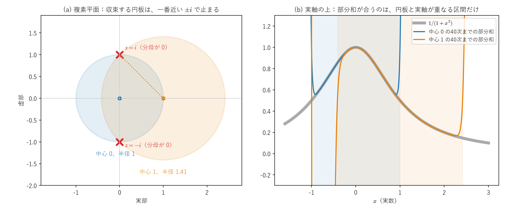
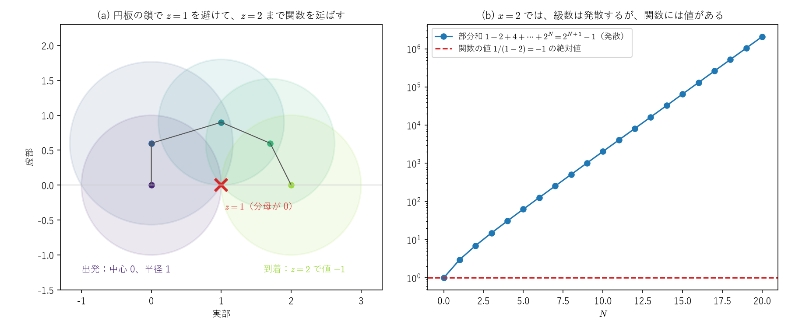
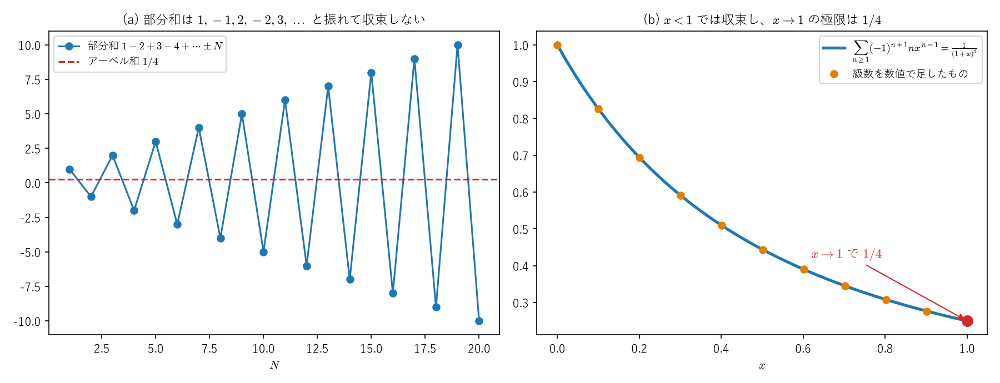
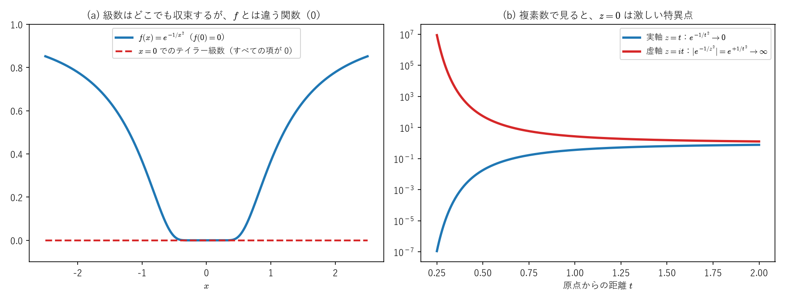
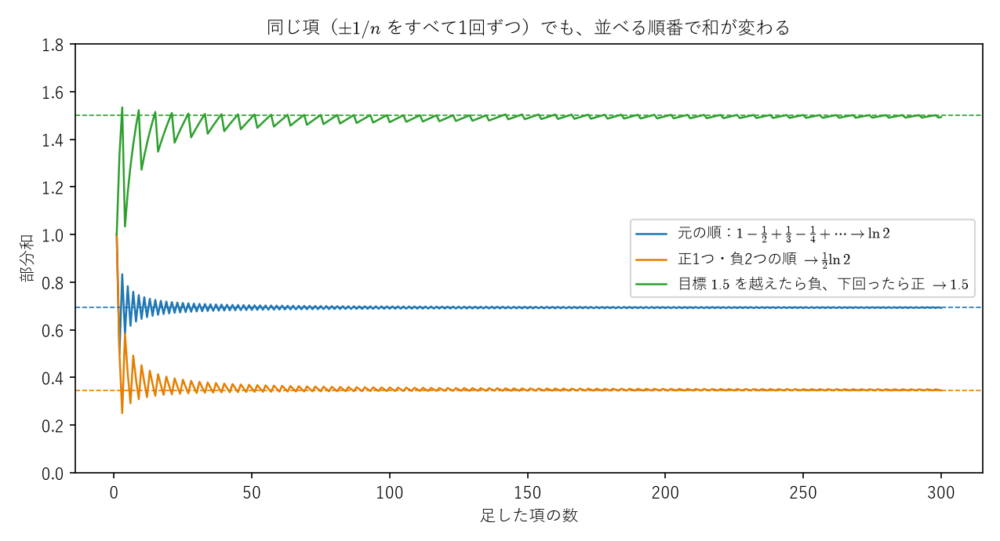

# べき級数と収束半径 ―発散しても延ばせる関数、収束しても表さない級数―

テイラー展開（べき級数）は「点のまわりの、多項式による近似」でした。このノートでは、その級数が**どこまで使えるか**を整理します。

- **Part I**：級数が「収束する」とはどういうことか。べき級数の収束する範囲が、必ず中心のまわりの区間（複素数で見ると円）になる理由と、その半径（**収束半径**）の求め方
- **Part II**：収束半径を決めているのは、**複素平面での一番近い特異点**であること。$1/(1+x^2)$ は実数の範囲ではどこでもなめらかなのに、収束半径が $1$ になる理由
- **Part III**：**級数は発散するが、関数は延ばせる**場合（解析接続）。$1+2+4+\cdots=-1$ や $1+2+3+\cdots=-\frac1{12}$ という式の意味
- **Part IV**：**級数は収束するが、関数を表していない**場合。何回でも微分できるのに、テイラー級数が元の関数に一致しない $e^{-1/x^2}$
- **Part V**：まとめ（点の3分類と、2つの現象の対比）
- **付録A**：リーマンの再配列定理（絶対収束しない級数は、並べ替えると和が変わる）

**関連ファイル**：数値で確かめるノートブックは [01_taylor_euler.ipynb](../../notebooks/foundations/00_taylor_series/01_taylor_euler.ipynb)（§2 が Part II、§5 が Part IV に対応）。図は [figures/make_power_series_figures.py](figures/make_power_series_figures.py) で作っていて、各図の値はスクリプトの中で本文の式と照合しています。複素数の基本は[複素数の幾何学のノート](../04_群論・代数/complex_numbers_geometry.md)、行列の級数（$e^A$）とその収束は[関数・線形写像・微分・積分のノート](functions_linear_maps_derivatives_integrals.md)の Part VIII と[行列の指数関数と交換子のノート](../04_群論・代数/matrix_exponential_commutator_bch_trotter.md)にあります。このノートは、[学習ロードマップ](../../docs/learning_roadmap.md)の候補17（複素解析）の入口にあたります。

**記号の約束**：級数 $\sum_{k=0}^\infty a_k$ の、$N$ 番目までの和 $S_N=a_0+a_1+\cdots+a_N$ を**部分和**と呼びます。$z$ は複素数、$x$ は実数を表します。複素数 $z=x+iy$ の絶対値は $|z|=\sqrt{x^2+y^2}$（原点からの距離）です。

<a id="toc"></a>

## 目次

<!-- toc:start -->

- [Part I：収束とは、収束半径とは](#p1)
  - [1. 級数の「収束」は、部分和の極限](#p1-1)
  - [2. 絶対収束](#p1-2)
  - [3. べき級数の収束する範囲は、中心のまわりの区間になる](#p1-3)
  - [4. 収束半径の求め方](#p1-4)
  - [5. 端点では、どちらもありうる](#p1-5)
- [Part II：半径を決めるもの ―複素平面の特異点―](#p2)
  - [1. 複素数で考えると、収束する範囲は「円板」](#p2-1)
  - [2. 1/(1+x^2) の謎](#p2-2)
  - [3. 中心を変えると、半径も変わる](#p2-3)
  - [4. 一般の事実：収束半径＝一番近い特異点までの距離](#p2-4)
- [Part III：級数は発散するが、関数は延ばせる ―解析接続―](#p3)
  - [1. 「1+2+4+8+⋯=-1」の意味](#p3-1)
  - [2. 円板の鎖で延ばす](#p3-2)
  - [3. 「1+2+3+⋯=-frac112」の意味](#p3-3)
- [Part IV：級数は収束するが、関数を表していない ―e^-1/x^2―](#p4)
  - [1. 何回でも微分できる関数](#p4-1)
  - [2. x=0 での微分係数は、すべて 0](#p4-2)
  - [3. テイラー級数は 0、でも f は 0 ではない](#p4-3)
  - [4. 複素数で見ると、z=0 は激しい特異点](#p4-4)
  - [5. 役に立つ面：なめらかな「こぶ」の関数](#p4-5)
- [Part V：まとめ](#p5)
  - [1. テイラー展開から見た、点の3分類](#p5-1)
  - [2. 2つの現象の対比](#p5-2)
- [付録A：リーマンの再配列定理](#appA)
  - [A-1. 具体例：ln2 が frac12ln2 になる](#A-1)
  - [A-2. 定理](#A-2)
  - [A-3. 証明](#A-3)
  - [A-4. 絶対収束なら、並べ替えても和は変わらない](#A-4)

<!-- toc:end -->

---

<a id="p1"></a>

# Part I：収束とは、収束半径とは

<!-- part-toc:start -->

**この Part の内容**

- [1. 級数の「収束」は、部分和の極限](#p1-1)
- [2. 絶対収束](#p1-2)
- [3. べき級数の収束する範囲は、中心のまわりの区間になる](#p1-3)
- [4. 収束半径の求め方](#p1-4)
- [5. 端点では、どちらもありうる](#p1-5)

<!-- part-toc:end -->

<a id="p1-1"></a>

## 1. 級数の「収束」は、部分和の極限

無限個の数を「全部足す」ことは、そのままではできません。そこで、部分和 $S_N$ を考え、$N\to\infty$ で $S_N$ がある値 $S$ に近づくとき、級数は**収束する**といい、

$$
\sum_{k=0}^\infty a_k=S\quad\overset{\text{定義}}{\iff}\quad\lim_{N\to\infty}S_N=S\tag{I-1}
$$

と書きます。近づく値がなければ**発散する**といいます（無限大に行く場合も、振動する場合も含む）。

**例：等比級数** $\sum_{k\ge0}x^k=1+x+x^2+\cdots$。部分和は、$S_N$ と $xS_N$ の差を取ると、ほとんどの項が消えて

$$
S_N-xS_N=(1+x+\cdots+x^N)-(x+x^2+\cdots+x^{N+1})=1-x^{N+1}
$$

なので、$x\ne1$ なら

$$
S_N=\frac{1-x^{N+1}}{1-x}\tag{I-2}
$$

です。$N\to\infty$ での振る舞いは、$x^{N+1}$ で決まります。

| $x$ | $x^{N+1}$ | $S_N$ | 級数 |
|---|---|---|---|
| $\lvert x\rvert<1$ | $\to0$ | $\to\frac1{1-x}$ | 収束、和は $\frac1{1-x}$ |
| $x=1$ | （式 (I-2) は使えない） | $S_N=N+1\to\infty$ | 発散 |
| $x=-1$ | $\pm1$ を交互に取る | $1,0,1,0,\dots$ と振動 | 発散 |
| $\lvert x\rvert>1$ | 大きさが $\to\infty$ | 大きさが $\to\infty$ | 発散 |

まとめると

$$
\sum_{k\ge0}x^k=\frac1{1-x}\qquad(\lvert x\rvert<1\text{ のときだけ})\tag{I-3}
$$

です。右辺の $\frac1{1-x}$ は $x=1$ 以外ならどこでも値を持ちますが、左辺の級数が意味を持つのは $|x|<1$ だけです。この「ずれ」が、Part III の主題です。

<a id="p1-2"></a>

## 2. 絶対収束

$\sum|a_k|$（各項の絶対値の和）が収束するとき、$\sum a_k$ は**絶対収束する**といいます。

- 絶対収束すれば、収束します（打ち消し合いがなくても有限なので、打ち消し合いがあればなおさら）。
- 絶対収束する級数は、**項の順番を並べ替えても、和が変わりません**。行列の指数関数で $e^Ae^B$ の項を「次数ごとにまとめ直した」とき（[行列の指数関数と交換子のノート](../04_群論・代数/matrix_exponential_commutator_bch_trotter.md)の Part I）に使ったのが、この性質です。
- 絶対収束しない級数（たとえば $1-\frac12+\frac13-\frac14+\cdots$）は、並べ替えると和が変わることがあります。それどころか、並べ替え方しだいで、和を好きな値にできます（**リーマンの再配列定理**。具体例と証明は[付録A](#appA)）。

<a id="p1-3"></a>

## 3. べき級数の収束する範囲は、中心のまわりの区間になる

点 $0$ を中心とする**べき級数** $\sum_{k\ge0}a_kx^k$ を考えます（テイラー展開は、この形の級数です）。

**補題（アーベルの補題）**（アーベルは、19世紀ノルウェーの数学者ニールス・ヘンリック・アーベルで、**アーベル群（可換群）のアーベルと同じ人**です。5次以上の方程式は一般には係数の四則演算と根号だけでは解けないことを示し、その研究から「掛け算の順番を入れ替えてよい群」がアーベル群と呼ばれるようになりました。Part III のアーベル和も同じ人の名前です）：べき級数が、ある点 $x_0\ne0$ で収束するなら、$|x|<|x_0|$ を満たすすべての $x$ で絶対収束します。

**証明**：$x_0$ で収束するので、項 $a_kx_0^k$ は $k\to\infty$ で $0$ に近づき、特に、ある数 $M$ で $|a_kx_0^k|\le M$（すべての $k$）と抑えられます。$|x|<|x_0|$ なら $r=|x|/|x_0|<1$ で、

$$
|a_kx^k|=|a_kx_0^k|\cdot\Big|\frac{x}{x_0}\Big|^k\le M\,r^k\tag{I-4}
$$

です。右辺の和 $\sum Mr^k=\frac M{1-r}$ は有限（等比級数、式 (I-3)）なので、それより小さい項の和 $\sum|a_kx^k|$ も有限です。$\square$

**結論**：収束する点 $x_0$ があれば、それより原点に近い点ではすべて収束します。したがって、収束する点の集まりは「原点のまわりの区間」で、その半分の幅を**収束半径** $R$ と呼びます。

$$
|x|<R\ \Rightarrow\ \text{絶対収束},\qquad|x|>R\ \Rightarrow\ \text{発散}\tag{I-5}
$$

$R=0$（中心以外では発散）も、$R=\infty$（どこでも収束）もありえます。ちょうど $|x|=R$ の端点では、収束することも発散することもあります（§5）。点 $a$ を中心とする級数 $\sum a_k(x-a)^k$ なら、収束する範囲は $|x-a|<R$ です。

<a id="p1-4"></a>

## 4. 収束半径の求め方

**比判定法**：$\Big|\dfrac{a_k}{a_{k+1}}\Big|$ が $k\to\infty$ である値に近づくなら、

$$
R=\lim_{k\to\infty}\Big|\frac{a_k}{a_{k+1}}\Big|\tag{I-6}
$$

です。

**理由**：隣り合う項の比は $\Big|\dfrac{a_{k+1}x^{k+1}}{a_kx^k}\Big|=\Big|\dfrac{a_{k+1}}{a_k}\Big|\,|x|\to\dfrac{|x|}R$ です。これが $1$ より小さい（$|x|<R$）なら、$k$ が大きいところでは項が「公比 $1$ 未満の等比級数」のように小さくなっていくので、収束します。$1$ より大きい（$|x|>R$）なら、項がどんどん大きくなるので、発散します。

**根判定法**（比が近づく値を持たないときも使える）：

$$
\frac1R=\limsup_{k\to\infty}|a_k|^{1/k}\qquad(\text{コーシー・アダマールの公式})
$$

考え方は比判定法と同じで、$|a_kx^k|^{1/k}=|a_k|^{1/k}\,|x|$ が $1$ より小さいか大きいかで、$|a_kx^k|$ が「公比 $1$ 未満の等比数列」より小さくなるかどうかを判定します。

**補足：sup と limsup**　式に出てきた $\limsup$（**上極限**）は、数列が1つの値に近づかないときにも使える「極限の代わり」です。

- **sup（上限）**：数の集まり $\{b_1,b_2,\dots\}$ の「上からの一番きつい抑え」、つまり、すべての $b_k$ 以上である数のうち最小のものです。最大値（max）があればそれと同じですが、最大値がなくても sup はあります。たとえば $\{0.9,\ 0.99,\ 0.999,\dots\}$ には最大値がありません（どれを選んでも、もっと大きいものがある）が、sup は $1$ です。
- **limsup（上極限）**：「$k$ 番目から先の sup」を考え、$k$ を大きくしていったときの極限です。
$$
\limsup_{k\to\infty}b_k=\lim_{k\to\infty}\Big(\sup_{j\ge k}b_j\Big)
$$
先のほうだけを見るほど sup は小さく（または同じに）なるので、この極限は必ず存在します（$+\infty$ も含む）。直感的には、**数列が先のほうで何度も近づく値のうち、一番大きいもの**です。
- **例**：$b_k=1,0,1,0,\dots$ は1つの値に近づかないので $\lim$ はありませんが、どこから先を見ても sup は $1$ なので、$\limsup b_k=1$ です。

**根判定法で $\frac1{1+x^2}$ を直接扱う**：係数は $a_k=1,0,-1,0,1,0,\dots$ で、$|a_k|^{1/k}$ は $1,0,1,0,\dots$ と振れます（$k=0$ を除く）。比判定法は $0$ で割ることになって使えませんでしたが、根判定法なら $\limsup|a_k|^{1/k}=1$ から、そのまま $R=1$ が出ます。0 になる係数が混ざっていても、「何度も近づく値のうち一番大きいもの」だけを見ればよい、というのが limsup を使う理由です。

（アダマールは、フランスの数学者ジャック・アダマールで、**行列の成分ごとの積「アダマール積」$(A\circ B)_{ij}=a_{ij}b_{ij}$ のアダマールと同じ人**です。量子計算の**アダマールゲート** $H=\frac1{\sqrt2}\begin{pmatrix}1&1\\1&-1\end{pmatrix}$ も、彼が研究した「成分が $\pm1$ で、列どうしが直交する行列」（アダマール行列）から名前が来ています。また、[行列の指数関数と交換子のノート](../04_群論・代数/matrix_exponential_commutator_bch_trotter.md)の $e^XYe^{-X}$ の公式（アダマールの補題）や、ゼータ関数を使った素数定理の証明（1896年）も彼の仕事です。）

**例**：

| 級数 | 係数 $a_k$ | $\lvert a_k/a_{k+1}\rvert$ | 収束半径 $R$ |
|---|---|---|---|
| $e^x=\sum\frac{x^k}{k!}$ | $\frac1{k!}$ | $\frac{(k+1)!}{k!}=k+1\to\infty$ | $\infty$ |
| $\frac1{1-x}=\sum x^k$ | $1$ | $1$ | $1$ |
| $\ln(1+x)=\sum_{k\ge1}\frac{(-1)^{k+1}}kx^k$ | $\frac{(-1)^{k+1}}k$ | $\frac{k+1}k\to1$ | $1$ |
| $\sum k!\,x^k$ | $k!$ | $\frac{k!}{(k+1)!}=\frac1{k+1}\to0$ | $0$ |

$\frac1{1+x^2}=\sum(-1)^kx^{2k}=1-x^2+x^4-\cdots$ は奇数次の係数が $0$ なので、式 (I-6) の比がそのままでは作れません。この場合は $u=x^2$ とおくと $\sum(-1)^ku^k$ で、$|u|<1$、つまり $|x|<1$ で収束します。$R=1$ です。

<a id="p1-5"></a>

## 5. 端点では、どちらもありうる

$|x|=R$ では、級数ごとに調べる必要があります。

- $\sum x^k$（$R=1$）：$x=1$ でも $x=-1$ でも発散（§1 の表）。
- $\ln(1+x)=x-\frac{x^2}2+\frac{x^3}3-\cdots$（$R=1$）：
  - $x=1$：$1-\frac12+\frac13-\frac14+\cdots$ は収束し、和は $\ln2\approx0.6931$ です（$10^5$ 項までの部分和は $0.69314\ldots$）。
  - $x=-1$：$-\big(1+\frac12+\frac13+\cdots\big)$ で、**調和級数**の $-1$ 倍なので発散します。調和級数が発散するのは、項を $1+\frac12+\big(\frac13+\frac14\big)+\big(\frac15+\cdots+\frac18\big)+\cdots$ とまとめると、各かっこが $\frac12$ 以上（$\frac13+\frac14>\frac14+\frac14=\frac12$ など）で、$\frac12$ を無限回足すことになるからです。$\ln(1+x)$ が $x=-1$ で $-\infty$ になることと合っています。

---

<a id="p2"></a>

# Part II：半径を決めるもの ―複素平面の特異点―

<!-- part-toc:start -->

**この Part の内容**

- [1. 複素数で考えると、収束する範囲は「円板」](#p2-1)
- [2. 1/(1+x^2) の謎](#p2-2)
- [3. 中心を変えると、半径も変わる](#p2-3)
- [4. 一般の事実：収束半径＝一番近い特異点までの距離](#p2-4)

<!-- part-toc:end -->

<a id="p2-1"></a>

## 1. 複素数で考えると、収束する範囲は「円板」

べき級数の $x$ に複素数 $z$ を入れても、Part I の議論はそのまま成り立ちます（アーベルの補題の証明で使ったのは絶対値 $|\cdot|$ の性質だけで、複素数の絶対値でも同じ）。収束する範囲は

$$
|z-a|<R\qquad(\text{中心 }a\text{、半径 }R\text{ の円板})\tag{II-1}
$$

です。**「収束半径」という名前は、この円の半径から来ています。** 実数の上で見えている区間 $(a-R,\ a+R)$ は、この円板と実軸が重なる部分です。

<a id="p2-2"></a>

## 2. $1/(1+x^2)$ の謎

$f(x)=\frac1{1+x^2}$ は、実数の範囲では分母が $1$ 以上で、どこでもなめらかです。それなのに、$0$ のまわりの級数 $1-x^2+x^4-\cdots$ の収束半径は $1$ で、$x=1.5$ では発散します（ノートブック §2 で確認）。実数だけを見ていると、$x=\pm1$ で何かが起きているようには見えません。

複素数 $z$ に広げると、理由が分かります。$1+z^2=0$ となるのは $z=\pm i$ で、そこで $f$ は無限大になり、定義できません。$0$ から $\pm i$ までの距離は $|\pm i|=1$ で、ちょうど収束半径です。**収束する円板は、壊れる点 $\pm i$ にぶつかるところで止まっている**のです。

<a id="p2-3"></a>

## 3. 中心を変えると、半径も変わる

この見方が正しければ、中心を $a=1$ に移すと、収束半径は $1$ から $\pm i$ までの距離 $|1-i|=\sqrt2\approx1.414$ になるはずです。確かめます。

**部分分数に分ける**：$\frac1{1+z^2}=\frac1{(z-i)(z+i)}=\frac1{2i}\Big(\frac1{z-i}-\frac1{z+i}\Big)$（右辺を通分すると $\frac{(z+i)-(z-i)}{2i(z-i)(z+i)}=\frac{2i}{2i(z^2+1)}$ で、左辺に戻ります）。

**$\frac1{z-b}$ を中心 $a$ のまわりで展開する**：$z-b=(z-a)-(b-a)$ と書き直して、等比級数 (I-3) を使います。

$$
\frac1{z-b}=\frac1{(z-a)-(b-a)}=-\frac1{b-a}\cdot\frac1{1-\frac{z-a}{b-a}}=-\sum_{k\ge0}\frac{(z-a)^k}{(b-a)^{k+1}}\tag{II-2}
$$

これは $\Big|\frac{z-a}{b-a}\Big|<1$、つまり $|z-a|<|b-a|$（中心から $b$ までの距離より内側）で収束します。

**合わせると**、$\frac1{1+z^2}$ の中心 $a$ のまわりの係数は

$$
c_k=\frac1{2i}\Big(-\frac1{(i-a)^{k+1}}+\frac1{(-i-a)^{k+1}}\Big)\tag{II-3}
$$

で、2つの級数がどちらも収束する範囲、つまり $|z-a|<\min(|i-a|,\ |{-i}-a|)$ で収束します。$a=0$ なら半径 $1$、$a=1$ なら半径 $\sqrt2$ です。図のスクリプトでは、式 (II-3) の係数から根判定法で半径を数値的に求め、それぞれ $1$ と $\sqrt2$ になることを確かめています。



*(a) 複素平面で、中心 $0$（青）と中心 $1$（橙）の収束する円板。どちらも、一番近い $\pm i$（赤の×）にぶつかるところで止まる。(b) 実軸の上で、それぞれ40次までの部分和。元の関数（灰色）と合うのは、円板と実軸が重なる区間（中心 $0$ なら $(-1,1)$、中心 $1$ なら $(1-\sqrt2,\ 1+\sqrt2)$）だけ。*

<a id="p2-4"></a>

## 4. 一般の事実：収束半径＝一番近い特異点までの距離

**特異点**とは、関数を複素数の範囲でなめらかに（複素数として微分できるように）定義できない点のことです。分母が $0$ になる点や、$\ln(1+z)$ の $z=-1$ などがその例です。

**事実**：$f$ が中心 $a$ のまわりの円板の中で複素数として微分できるなら、$f$ のテイラー級数はその円板の中で $f$ に収束します。したがって、**収束半径は、中心から一番近い特異点までの距離**です（証明には、複素解析のコーシーの積分公式を使います。ロードマップの候補17）。

| 関数 | 特異点 | 中心 $0$ での収束半径 |
|---|---|---|
| $e^z,\ \sin z,\ \cos z$ | なし | $\infty$ |
| $\frac1{1-z}$ | $z=1$ | $1$ |
| $\ln(1+z)$ | $z=-1$ | $1$ |
| $\frac1{1+z^2}$ | $z=\pm i$ | $1$ |
| $\tan z=\frac{\sin z}{\cos z}$ | $\cos z=0$ の点、一番近いのは $z=\pm\frac\pi2$ | $\frac\pi2\approx1.571$（係数 $1,\frac13,\frac2{15},\frac{17}{315},\dots$ の比から数値でも確認） |
| $g(u)=\frac u{1-e^{-u}}$ | $e^{-u}=1$ の点のうち $u=0$ 以外、一番近いのは $u=\pm2\pi i$ | $2\pi$ |

最後の $g(u)$ は、[行列の指数関数と交換子のノート](../04_群論・代数/matrix_exponential_commutator_bch_trotter.md)の付録B で、BCH の公式を導くのに使った関数です。そこで「$\operatorname{ad}_Z$ が $2\pi ik$ を固有値に持つと破綻する」と書いたのは、$g$ の級数の収束半径が $2\pi$ で、特異点が $\pm2\pi i$ にあることの言いかえです。

**実数だけを見ていては分からない理由が、複素数で見ると分かる**。これが、べき級数を複素数で考える一番の理由です。

---

<a id="p3"></a>

# Part III：級数は発散するが、関数は延ばせる ―解析接続―

<!-- part-toc:start -->

**この Part の内容**

- [1. 「1+2+4+8+⋯=-1」の意味](#p3-1)
- [2. 円板の鎖で延ばす](#p3-2)
- [3. 「1+2+3+⋯=-frac112」の意味](#p3-3)

<!-- part-toc:end -->

<a id="p3-1"></a>

## 1. 「$1+2+4+8+\cdots=-1$」の意味

式 (I-3) $\sum x^k=\frac1{1-x}$ の両辺に $x=2$ を入れると、左辺は $1+2+4+8+\cdots$（発散）、右辺は $\frac1{1-2}=-1$ です。そこで「$1+2+4+\cdots=-1$」と書かれることがあります。

これは、**級数の和が $-1$ になる**という意味ではありません（部分和は $2^{N+1}-1$ で、$\infty$ に行きます）。正しくは、

- 関数 $\frac1{1-z}$ は、$z=1$ 以外のすべての複素数で値を持つ。
- 級数 $\sum z^k$ は、その関数を $|z|<1$ の中だけで表す「一つの書き方」にすぎない。
- $z=2$ での関数の値は $-1$ で、それを「級数が表していた関数の、$z=2$ での値」と呼んでいる。

という意味です。級数が使えない場所でも、**関数そのもの**は延ばせる、ということです。

<a id="p3-2"></a>

## 2. 円板の鎖で延ばす

$\frac1{1-z}$ のように式が分かっていれば話は簡単ですが、級数しか分かっていないときに、どうやって関数を延ばすのでしょうか。方法は、**中心を少しずつ移して、展開し直す**ことです。

$\frac1{1-z}$ を中心 $a$（$a\ne1$）のまわりで展開すると、式 (II-2) と同じ計算で

$$
\frac1{1-z}=\frac1{(1-a)-(z-a)}=\frac1{1-a}\cdot\frac1{1-\frac{z-a}{1-a}}=\sum_{k\ge0}\frac{(z-a)^k}{(1-a)^{k+1}}\tag{III-1}
$$

で、収束半径は $|1-a|$（$a$ から特異点 $z=1$ までの距離）です。

**手順**：

1. 中心 $0$ の級数（半径 $1$）から始める。
2. その円板の内側に新しい中心 $a_1$ を取り、元の級数を使って $a_1$ のまわりの係数を計算する（各点での値と微分係数が、元の級数から計算できる）。新しい円板は、元の円板からはみ出すことがある。
3. これをくり返して、特異点を避けながら、目的の点まで円板をつないでいく。

下の図は、$0\to0.6i\to1+0.9i\to1.7+0.6i\to2$ と中心を移して、$z=1$ を避けながら $z=2$ まで延ばしたものです。各段階で、今の級数を使って次の中心での値を計算すると、確かに $\frac1{1-z}$ の値と一致します（図のスクリプトで確認）。到着した $z=2$ での値は $-1$ です。



*(a) 中心を少しずつ移して展開し直し、特異点 $z=1$ を避けて $z=2$ まで関数を延ばす。各円板の半径は、その中心から $z=1$ までの距離。(b) $x=2$ での元の級数の部分和 $2^{N+1}-1$ は発散するが、延ばした関数の値は $-1$。*

**一意性**：この延ばし方は、途中の道を変えても（特異点の同じ側を通る限り）結果が同じになります（**一致の定理**：複素数として微分できる関数は、小さな円板の上の値で全体が決まる）。この延ばし方を**解析接続**と呼びます。ただし、$\ln z$ や $\sqrt z$ のように、特異点のまわりを1周すると値がずれる関数もあります（$\ln z$ は1周で $2\pi i$ ずれる。ここでも $2\pi i$ です）。

<a id="p3-3"></a>

## 3. 「$1+2+3+\cdots=-\frac1{12}$」の意味

**ゼータ関数**は

$$
\zeta(s)=\sum_{n\ge1}\frac1{n^s}=1+\frac1{2^s}+\frac1{3^s}+\cdots\tag{III-2}
$$

で、$s>1$（複素数なら実部が $1$ より大きい）のときに収束します（$s=1$ は調和級数で発散）。これを解析接続すると、$s=1$ 以外のすべての複素数に延ばせ、$s=-1$ では $\zeta(-1)=-\frac1{12}$ になります。$s=-1$ を式 (III-2) に形式的に入れると $1+2+3+\cdots$ なので、「$1+2+3+\cdots=-\frac1{12}$」と書かれます。§1 と同じく、**級数の和ではなく、延ばした関数の値**です。

この値は、少し回り道をすると、ここまでの道具だけで求められます。

**ステップ1：交代級数版を作る**　$\eta(s)=\sum_{n\ge1}\frac{(-1)^{n+1}}{n^s}=1-\frac1{2^s}+\frac1{3^s}-\cdots$ とおきます（符号が交互なので、$s>0$ で収束します）。$s>1$ では両方とも収束するので、差を取ると、奇数番目の項が消えて偶数番目が2倍残り

$$
\zeta(s)-\eta(s)=2\Big(\frac1{2^s}+\frac1{4^s}+\frac1{6^s}+\cdots\Big)=\frac2{2^s}\Big(1+\frac1{2^s}+\frac1{3^s}+\cdots\Big)=2^{1-s}\zeta(s)
$$

なので

$$
\eta(s)=\big(1-2^{1-s}\big)\,\zeta(s)\tag{III-3}
$$

です。両辺とも解析接続できる関数で、$s>1$ で等しいので、一致の定理から、延ばした先でも等しいままです。

**ステップ2：$\eta(-1)$ を求める**　$\eta(-1)$ は形式的には $1-2+3-4+\cdots$ で、部分和は $1,-1,2,-2,3,\dots$ と振れて収束しません。そこで、各項に $x^{n-1}$ を掛けた級数

$$
\sum_{n\ge1}(-1)^{n+1}n\,x^{n-1}=1-2x+3x^2-4x^3+\cdots\tag{III-4}
$$

を考えます。これは $|x|<1$ で収束するべき級数です。等比級数 $\sum_{n\ge1}(-1)^{n+1}x^n=x-x^2+x^3-\cdots=\frac x{1+x}$ を $x$ で微分すると、左辺は式 (III-4)、右辺は $\frac{(1+x)-x}{(1+x)^2}=\frac1{(1+x)^2}$ なので

$$
1-2x+3x^2-4x^3+\cdots=\frac1{(1+x)^2}\qquad(|x|<1)\tag{III-5}
$$

です。$x\to1$ とすると右辺は $\frac14$ に近づきます。このように「$x^{n}$ を掛けて $x\to1$ の極限を取る」和を**アーベル和**と呼び、$\eta$ のような関数では、それが解析接続した値に一致することが知られています。したがって

$$
\eta(-1)=\frac14\tag{III-6}
$$

**ステップ3：$\zeta(-1)$ を求める**　式 (III-3) に $s=-1$ を入れると、$1-2^{1-(-1)}=1-4=-3$ なので

$$
\zeta(-1)=\frac{\eta(-1)}{1-2^2}=\frac{1/4}{-3}=-\frac1{12}\tag{III-7}
$$

です（SymPy の `zeta(-1)` も $-\frac1{12}$）。



*(a) $1-2+3-4+\cdots$ の部分和は振れて収束しない。(b) 各項に $x^{n-1}$ を掛けた級数は $|x|<1$ で $\frac1{(1+x)^2}$ に収束し（点は数値で足したもの）、$x\to1$ の極限は $\frac14$。*

この $-\frac1{12}$ は、物理でも現れます。2枚の金属板の間の真空のエネルギー（カシミール効果）を計算すると、$\sum n$ のような発散する和が出てきて、それをこの方法で扱うと、実験で測れる力（板どうしが引き合う力）が正しく得られます。

---

<a id="p4"></a>

# Part IV：級数は収束するが、関数を表していない ―$e^{-1/x^2}$―

<!-- part-toc:start -->

**この Part の内容**

- [1. 何回でも微分できる関数](#p4-1)
- [2. x=0 での微分係数は、すべて 0](#p4-2)
- [3. テイラー級数は 0、でも f は 0 ではない](#p4-3)
- [4. 複素数で見ると、z=0 は激しい特異点](#p4-4)
- [5. 役に立つ面：なめらかな「こぶ」の関数](#p4-5)

<!-- part-toc:end -->

<a id="p4-1"></a>

## 1. 何回でも微分できる関数

$$
f(x)=\begin{cases}e^{-1/x^2}&(x\ne0)\\0&(x=0)\end{cases}\tag{IV-1}
$$

を考えます。$x\to0$ で $-1/x^2\to-\infty$ なので $e^{-1/x^2}\to0$ で、$f(0)=0$ はその極限値で穴を埋めたものです（好きに決めた値ではありません）。

**$x\ne0$ での微分**：合成関数の微分で

$$
f'(x)=e^{-1/x^2}\cdot\frac{d}{dx}\Big(-\frac1{x^2}\Big)=\frac2{x^3}\,e^{-1/x^2}\tag{IV-2}
$$

です。一般に、$k$ 回微分すると

$$
f^{(k)}(x)=P_k\Big(\frac1x\Big)\,e^{-1/x^2}\qquad(P_k\text{ はある多項式})\tag{IV-3}
$$

の形になります。理由：$P(1/x)\,e^{-1/x^2}$ を微分すると、積の微分で $\Big(-\frac1{x^2}P'\big(\tfrac1x\big)+\frac2{x^3}P\big(\tfrac1x\big)\Big)e^{-1/x^2}$ で、かっこの中はまた $\frac1x$ の多項式だからです（$P_1(y)=2y^3$、$P_2(y)=4y^6-6y^4$、…）。

<a id="p4-2"></a>

## 2. $x=0$ での微分係数は、すべて $0$

**補題**：どんな $m$ についても、$|y|\to\infty$ で $y^m\,e^{-y^2}\to0$。

**証明**：$e^{y^2}=\sum_j\frac{y^{2j}}{j!}\ge\frac{y^{2n}}{n!}$（すべての項が正なので、1つの項より大きい）なので、$2n>m$ となる $n$ を取ると $|y^m\,e^{-y^2}|\le n!\,|y|^{m-2n}\to0$ です。$\square$（指数関数は、どんな多項式よりも速く大きくなる。）

**$f^{(k)}(0)=0$ の証明**（$k$ についての帰納法）：$f^{(k-1)}(0)=0$ とすると、微分の定義から

$$
f^{(k)}(0)=\lim_{h\to0}\frac{f^{(k-1)}(h)-f^{(k-1)}(0)}h=\lim_{h\to0}\frac1h\,P_{k-1}\Big(\frac1h\Big)\,e^{-1/h^2}\tag{IV-4}
$$

です。$y=\frac1h$ とおくと、これは $y\,P_{k-1}(y)\,e^{-y^2}$（$y$ の多項式 × $e^{-y^2}$）の $|y|\to\infty$ での極限なので、補題から $0$ です。$k=1$ から始めて、すべての $k$ で $f^{(k)}(0)=0$ が分かります。

<a id="p4-3"></a>

## 3. テイラー級数は $0$、でも $f$ は $0$ ではない

$x=0$ でのテイラー級数は

$$
\sum_{k\ge0}\frac{f^{(k)}(0)}{k!}x^k=0+0\cdot x+0\cdot x^2+\cdots=0\tag{IV-5}
$$

で、**すべての $x$ で収束します**（収束半径 $\infty$）。ところが、収束先は $0$ で、$x\ne0$ では $f(x)=e^{-1/x^2}>0$ です。級数は収束するのに、元の関数を表していません。

- **何回でも微分できる**（$C^\infty$ 級、なめらか）
- **テイラー級数が、点のまわりで元の関数に一致する**（**解析的**）

は別のことで、後者のほうがずっと強い条件です。$e^{-1/x^2}$ は、なめらかだが解析的でない関数の代表例です。

<a id="p4-4"></a>

## 4. 複素数で見ると、$z=0$ は激しい特異点

なぜこんなことが起きるのかも、複素数で見ると分かります。$z$ を虚軸の上 $z=it$（$t$ は実数）に取ると、$z^2=-t^2$ なので

$$
e^{-1/z^2}=e^{-1/(-t^2)}=e^{+1/t^2}\xrightarrow{\ t\to0\ }\infty
$$

です。実軸の上では $0$ に吸い込まれるようになめらかに近づくのに、虚軸の上では爆発します。$z=0$ は、複素数で見ると、どう値を決めても微分できない特異点（**真性特異点**）です。

Part II の規則「収束半径＝一番近い特異点までの距離」に当てはめると、中心 $0$ そのものが特異点なので、$0$ のまわりに「級数が $f$ を表す円板」は、どんなに小さくても取れません。実数だけを見ていると不思議な現象が、複素数で見ると規則どおりになっています。

**実数と複素数の大きな違い**：複素数として1回微分できる関数は、自動的に何回でも微分でき、しかも解析的です（コーシーの積分公式から出る、複素解析の基本定理）。実数では「1回微分できる」「何回でも微分できる」「解析的」がすべて別のことですが、複素数では3つが同じことになります。



*(a) $f(x)=e^{-1/x^2}$ と、$x=0$ でのテイラー級数（すべての項が $0$）。級数はどこでも収束するが、$f$ とは違う関数。(b) 原点からの距離 $t$ に対する大きさ。実軸 $z=t$ では $e^{-1/t^2}\to0$、虚軸 $z=it$ では $e^{+1/t^2}\to\infty$（縦軸は対数）。*

<a id="p4-5"></a>

## 5. 役に立つ面：なめらかな「こぶ」の関数

解析的な関数は、ある区間で $0$ なら、どこでも $0$ です（一致の定理）。つまり、解析的な関数では「ある場所だけで $0$ でなく、ほかでは $0$」という関数は作れません。

$e^{-1/x^2}$ のような、なめらかだが解析的でない関数を使うと、それが作れます。たとえば

$$
\psi(x)=\begin{cases}e^{-1/(1-x^2)}&(|x|<1)\\0&(|x|\ge1)\end{cases}\tag{IV-6}
$$

は、何回でも微分できて、$|x|<1$ の外ではちょうど $0$ になる「こぶ」の関数（**バンプ関数**）です（$x=\pm1$ でのつながりは、§2 と同じ議論でなめらかです）。この関数は、

- 弱解・超関数の理論で、関数をなめらかにならす道具（軟化子）や、テスト関数として（[学習ロードマップ](../../docs/learning_roadmap.md)の候補18）
- 多様体の上で、局所的な計算をつなぎ合わせる道具（1の分割）として

使われます。「解析的でない」ことが、ここでは長所になっています。

---

<a id="p5"></a>

# Part V：まとめ

<!-- part-toc:start -->

**この Part の内容**

- [1. テイラー展開から見た、点の3分類](#p5-1)
- [2. 2つの現象の対比](#p5-2)

<!-- part-toc:end -->

<a id="p5-1"></a>

## 1. テイラー展開から見た、点の3分類

| 点の種類 | 例 | テイラー級数 |
|---|---|---|
| **解析的な点** | $\sin x,\ e^x$ の全点、$\tan x$ の $x=0$、$\frac1{1+x^2}$ の全実数点 | 収束し、点のまわりで元の関数に一致する。収束半径は、複素平面で一番近い特異点までの距離 |
| **なめらかだが解析的でない点** | $e^{-1/x^2}$ の $x=0$ | 収束するが（この例では $0$）、元の関数に一致しない。複素数で見ると真性特異点 |
| **特異点**（実数でも定義できない） | $\ln x$ の $x=0$、$\tan x$ の $x=\frac\pi2$、$\frac1x$ の $x=0$ | そもそも作れない。どんな値で埋めてもつながらない |

<a id="p5-2"></a>

## 2. 2つの現象の対比

| | 級数は発散するが、関数は延ばせる（Part III） | 級数は収束するが、関数を表していない（Part IV） |
|---|---|---|
| 例 | $\sum z^k$ と $\frac1{1-z}$（$z=2$）、$\zeta(-1)=-\frac1{12}$ | $e^{-1/x^2}$ の $x=0$ でのテイラー級数 $0$ |
| 何が起きているか | 級数は関数を円板の中だけで表す。外では級数が使えないが、関数は解析接続で延ばせる | 関数は実数ではなめらかだが、中心が（複素数で見た）特異点なので、級数が関数を表す円板がない |
| 複素数で見ると | 円板は一番近い特異点で止まる。特異点を避けて、円板の鎖で先へ進める | $z=0$ が真性特異点（虚軸の上で爆発） |

どちらも、**実数だけを見ていると不思議だが、複素数で見ると「特異点との距離」という1つの規則で説明できる**現象です。

```
べき級数 Σ a_k (z−a)^k
  収束する範囲 = 円板 |z−a| < R（アーベルの補題）
  R = 一番近い特異点までの距離（複素解析）
  円板の外：級数は使えないが、関数は解析接続で延ばせることがある（1+2+4+… = −1、ζ(−1) = −1/12）
  中心が特異点：なめらかでも、級数が関数を表さないことがある（e^{−1/x²}）
```

---

<a id="appA"></a>

# 付録A：リーマンの再配列定理

<!-- part-toc:start -->

**この付録の内容**

- [A-1. 具体例：ln2 が frac12ln2 になる](#A-1)
- [A-2. 定理](#A-2)
- [A-3. 証明](#A-3)
- [A-4. 絶対収束なら、並べ替えても和は変わらない](#A-4)

<!-- part-toc:end -->

Part I §2 の「絶対収束しない級数は、並べ替えると和が変わる」を、具体例と証明で確かめます。

<a id="A-1"></a>

## A-1. 具体例：$\ln2$ が $\frac12\ln2$ になる

$$
1-\frac12+\frac13-\frac14+\frac15-\frac16+\cdots=\ln2
$$

でした（Part I §5）。同じ項を、「正の項1つ、負の項2つ」の順に並べ替えます。

$$
1-\frac12-\frac14+\frac13-\frac16-\frac18+\frac15-\frac1{10}-\frac1{12}+\cdots\tag{A-1}
$$

正の項 $1,\frac13,\frac15,\dots$（奇数分の1）と、負の項 $-\frac12,-\frac14,-\frac16,\dots$（偶数分の1）を、どれも1回ずつ使っているので、項の集まりは元の級数とまったく同じです。

3つずつ区切り、各組の最初の2項をまとめます。$j$ 番目の組は $\frac1{2j-1}-\frac1{4j-2}-\frac1{4j}$ で、$\frac1{2j-1}-\frac1{4j-2}=\frac1{2j-1}-\frac1{2(2j-1)}=\frac1{2(2j-1)}$ なので

$$
\Big(1-\frac12\Big)-\frac14+\Big(\frac13-\frac16\Big)-\frac18+\cdots=\frac12-\frac14+\frac16-\frac18+\cdots=\frac12\Big(1-\frac12+\frac13-\frac14+\cdots\Big)=\frac12\ln2
$$

です。**同じ項を並べ替えただけで、和が半分になりました。**

<a id="A-2"></a>

## A-2. 定理

**リーマンの再配列定理**：実数の級数 $\sum a_k$ が収束するが絶対収束しない（**条件収束**する）とき、どんな実数 $T$ に対しても、項を並べ替えて和を $T$ にできます（$+\infty$ や $-\infty$ に発散させることもできます）。

<a id="A-3"></a>

## A-3. 証明

**ステップ1：項は $0$ に近づく**　級数が収束するので、$a_k=S_k-S_{k-1}\to S-S=0$ です。

**ステップ2：正の項だけの和も、負の項だけの和も、無限大**　正の項だけを集めた和を $P$、負の項の絶対値だけを集めた和を $Q$ とします。

- $P,Q$ がどちらも有限なら、$\sum|a_k|=P+Q$ も有限で、絶対収束してしまいます。
- 片方だけが有限なら（たとえば $P=\infty$、$Q<\infty$）、部分和は正の項に引っ張られて $+\infty$ に行き、収束しません。

条件収束なので、どちらでもなく、$P=Q=\infty$ です。

**ステップ3：目標 $T$ を往復しながら並べる**

1. 部分和が $T$ を越えるまで、正の項を（元の順番で）足していきます。$P=\infty$ なので、いつかは必ず越えます。
2. 部分和が $T$ を下回るまで、負の項を（元の順番で）足していきます。$Q=\infty$ なので、いつかは必ず下回ります。
3. 1と2をくり返します。

どの項もいつかは使われ、2回使われる項はないので、これは元の級数の並べ替えです。部分和は $T$ のまわりを往復しますが、$T$ を越えた（下回った）直後の行き過ぎは、最後に足した項の大きさ以下です。ステップ1から項は $0$ に近づくので、行き過ぎも $0$ に近づき、部分和は $T$ に近づきます。$\square$

下の図は、同じ項 $\pm\frac1n$ を、元の順、正1つ・負2つの順（式 (A-1)）、目標 $T=1.5$ に向けたステップ3の順の3通りで足したものです。



*同じ項 $1,-\frac12,\frac13,-\frac14,\dots$ を、並べる順番だけ変えて足した部分和。元の順なら $\ln2\approx0.693$、正1つ・負2つの順なら $\frac12\ln2\approx0.347$、ステップ3の手順なら目標の $1.5$ に近づく（図のスクリプトで、それぞれの極限を確認）。*

<a id="A-4"></a>

## A-4. 絶対収束なら、並べ替えても和は変わらない

逆に、$\sum|a_k|$ が有限なら、どう並べ替えても和は同じです。

**理由**：どんなに小さな $\varepsilon>0$ に対しても、十分大きな $N$ を取ると、$N$ 番目より後ろの項の絶対値の和は $\varepsilon$ より小さくなります（$\sum|a_k|$ が有限だから）。並べ替えた級数でも、十分先まで足せば最初の $N$ 個の項はすべて含まれ、残りは「$N$ 番目より後ろの項」の一部なので、その合計の大きさは $\varepsilon$ より小さくなります。したがって、並べ替えた級数の部分和と元の和の差は、いくらでも小さくなります。

条件収束の級数では、正の項と負の項がそれぞれ無限大で、それが打ち消し合って有限な和が残っているだけなので、打ち消し合いの順番を変えると結果が変わってしまいます。$e^A$ の級数や、収束半径の内側のべき級数は絶対収束するので（Part I §3）、項を自由にまとめ直してかまいません。
