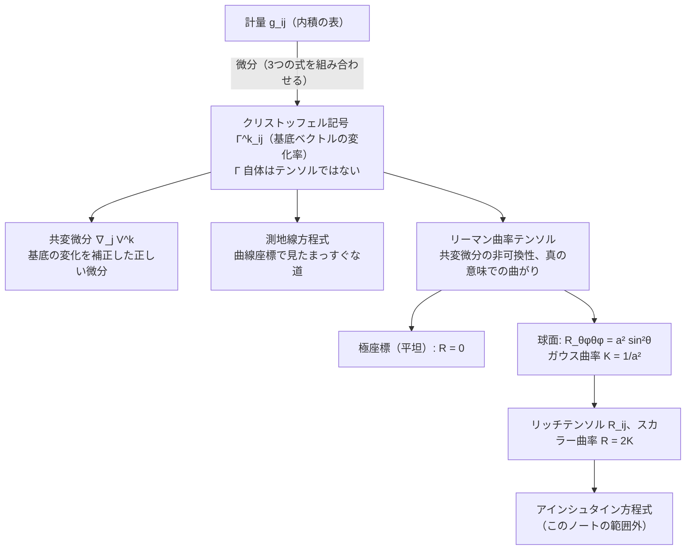
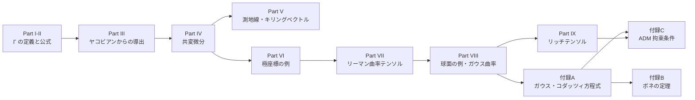
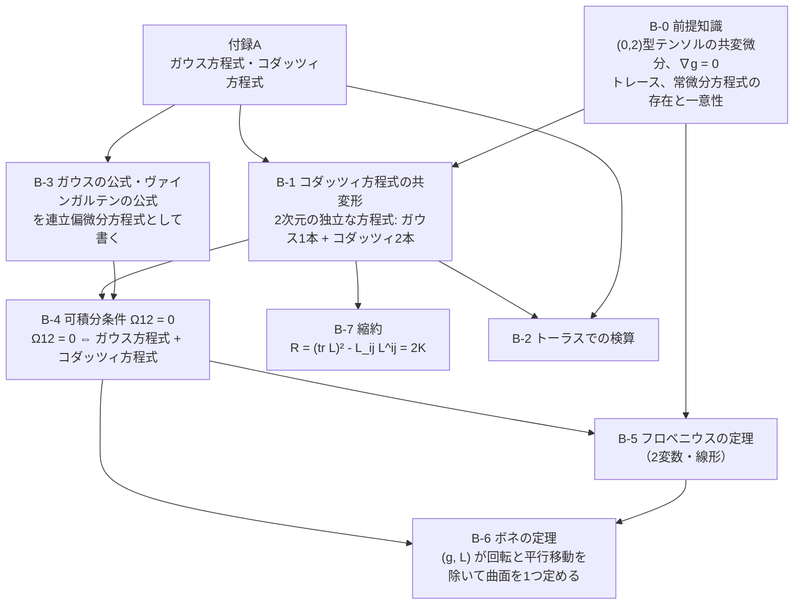
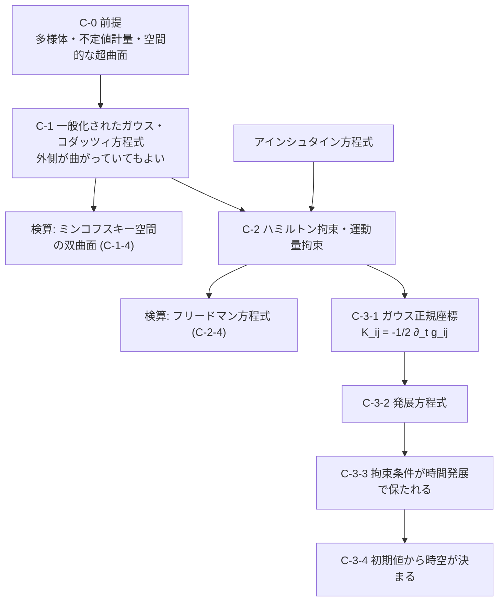

# 図表の貼り付け用スニペット（christoffel_riemann_intro.md 用）

> **作成** 2026-09-30　**更新** 2026-10-02
> クリストッフェル記号のノート用の、表と Mermaid 図の元の下書き。すべて本文に挿入済みで、本文を直してもこのファイルには反映されない。

このファイルは、表と Mermaid 図の元の下書きです。**以下の図・表・Mermaid はすべて本文（christoffel_riemann_intro.md）に挿入済みです。** 本文を直した場合、このファイルには反映されません。
Mermaid は GitHub と VS Code（Markdown Preview Mermaid Support 拡張）で描画できます。ラベルに数式（`$...$`）は使わず、プレーンテキストにしています。

## 0. 画像の挿入位置の一覧（挿入済み、節番号は番号整備後のもの）

| 画像 | 挿入位置 | 内容 |
|---|---|---|
| `fig1_polar_basis.png` | Part I §1 の末尾 | 基底ベクトルが場所で変わる／$\partial\mathbf e_\theta/\partial\theta=-r\mathbf e_r$ |
| `fig4_flat_but_gamma_nonzero.png` | Part VI §3 | 一様な場の成分は変わるが共変微分は 0（Γ≠0でも平坦） |
| `fig2_parallel_transport.png` | Part VII §3 | 並行移動：平面では戻り、球面では 90° 回る |
| `fig6_geodesics_sphere.png` | Part VIII §2（球面の Γ の直後） | 大円は測地線、緯線は測地線でない（Part V から移動） |
| `fig3_principal_curvature.png` | Part VIII §4-a | 主曲率と K の符号（球・円柱・鞍面） |
| `fig7_cylinder_unrolled.png` | Part VIII §4-e | 円柱は切り開けるので内在的に平坦 |
| `fig5_sphere_basis_triangle.png` | Part VIII §5 の末尾 | 球面の基底ベクトル／直角3つの三角形（§1〜3 から移動） |
| `fig8_adm_slicing.png` | 付録C C-3-1 | ラプス・シフト／ガウス正規座標 |
| `fig9_cofactor_matrix.png` | 補遺 §2-c の末尾 | 余因子行列の9成分と、消す行・列（生成は `make_cofactor_figure.py`） |

挿入の書き方（本文は `研究ノート/02_微分幾何/` にあるので、相対パスは `figures/...` です）：

```markdown

```

### 極座標の約定

図1〜図4 と本文はすべて標準の約定 $x=r\cos\theta,\ y=r\sin\theta$ に統一済みです（Part IV §2 の例③ も直しました）。

## 1. 表

### 1-1. 微分の種類（Part IV §3）

| 微分 | 計量・接続が必要か | 一般座標でテンソルとして振る舞うか | 備考 |
|---|---|---|---|
| 偏微分 $\partial_i$ | 不要 | ならない（余分な項が付く） | デカルト座標（$\Gamma=0$）では $\nabla_i$ と一致 |
| 共変微分 $\nabla_i$ | 必要（$\Gamma$、つまり計量） | なる | $\Gamma$ が基底の変化を補正する |
| 外微分 $d$ | 不要 | なる | 反対称化すると $\Gamma$ の項が対称性で消える |
| リー微分 $\mathcal L_X$ | 不要（ベクトル場 $X$ の流れだけ） | なる | キリングベクトルは $\mathcal L_Xg=0$ |

### 1-2. 共変微分の符号（Part IV §1〜§2）

| 対象 | 共変微分 | $\Gamma$ の項の符号 | 理由 |
|---|---|---|---|
| 反変ベクトル $V^k$ | $\nabla_jV^k=\partial_jV^k+\Gamma^k{}_{ij}V^i$ | $+$ | 基底の変化を「足して」補正 |
| 共変ベクトル $V_k$ | $\nabla_jV_k=\partial_jV_k-\Gamma^i{}_{kj}V_i$ | $-$ | スカラー $V^iV_i$ の微分で $\Gamma$ が打ち消し合うため |

### 1-3. 極座標と球面の比較（「まとめ：全体の位置づけ」）

| | 極座標 $(r,\theta)$（平面） | 球面 $(\theta,\phi)$（半径 $a$） |
|---|---|---|
| 計量 | $g=\operatorname{diag}(1,\ r^2)$ | $g=\operatorname{diag}(a^2,\ a^2\sin^2\theta)$ |
| $\Gamma\neq0$ の成分 | $\Gamma^r{}_{\theta\theta}=-r,\ \ \Gamma^\theta{}_{r\theta}=\Gamma^\theta{}_{\theta r}=\dfrac1r$ | $\Gamma^\theta{}_{\phi\phi}=-\sin\theta\cos\theta,\ \ \Gamma^\phi{}_{\theta\phi}=\Gamma^\phi{}_{\phi\theta}=\cot\theta$ |
| リーマン曲率テンソル | $R=0$ | $R_{\theta\phi\theta\phi}=a^2\sin^2\theta\neq0$ |
| ガウス曲率 | $K=0$ | $K=1/a^2$ |
| 空間は曲がっているか | 曲がっていない（座標が曲線的なだけ） | 曲がっている |

### 1-4. 曲面の比較（Part VIII §5 の末尾）

| 曲面 | 主曲率 $\kappa_1,\kappa_2$ | ガウス曲率 $K=\kappa_1\kappa_2$ | 内在的に平坦か | 測地三角形の内角の和 |
|---|---|---|---|---|
| 平面 | $0,\ 0$ | $0$ | 平坦 | $=\pi$ |
| 円柱（半径 $a$） | $1/a,\ 0$ | $0$ | 平坦（切り開ける） | $=\pi$ |
| 球（半径 $a$） | $1/a,\ 1/a$ | $1/a^2>0$ | 曲がっている | $>\pi$ |
| 鞍面 $z=(x^2-y^2)/2$ の原点 | $+1,\ -1$ | $-1<0$ | 曲がっている | $<\pi$ |

円柱は $\kappa_1\ne0$ なので外から見ると曲がっていますが、$K=0$ です。外から見た曲がり方と内在的な曲がり方は別物です（図7）。

### 1-5. 付録A・B と付録C の記法の対応（付録C C-0-1 の要約）

| | 付録A・B | 付録C |
|---|---|---|
| 外側の空間 | $\mathbb R^3$（平坦、正定値計量） | 曲がっていてよい（不定値計量も可、時空） |
| 法線の長さ $\varepsilon=\bar g(n,n)$ | $+1$ | $-1$（空間的な超曲面のとき） |
| 外的曲率の記号 | $L_{ij}$ | $K_{ij}$ |
| 曲面上の共変微分 | $\nabla$ | $D_i$（外側は $\bar\nabla$） |
| ガウス曲率 $K$ | 使う | 使わない（添字のない $K$ も使わない） |

## 2. Mermaid 図

### 2-1. 全体の概念マップ（「まとめ：全体の位置づけ」の ASCII 図の代わりに）



### 2-2. ノート全体の構成



### 2-3. 付録B の論理の依存関係



### 2-4. 付録C の流れ


