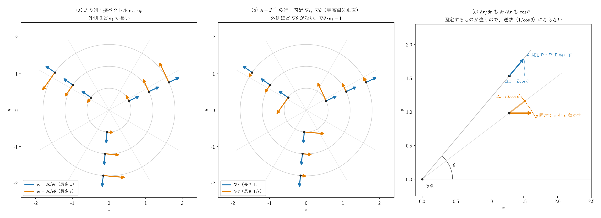
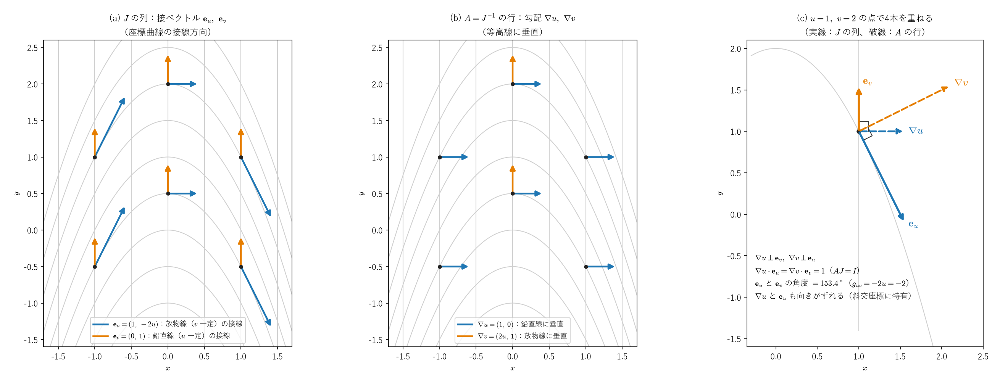
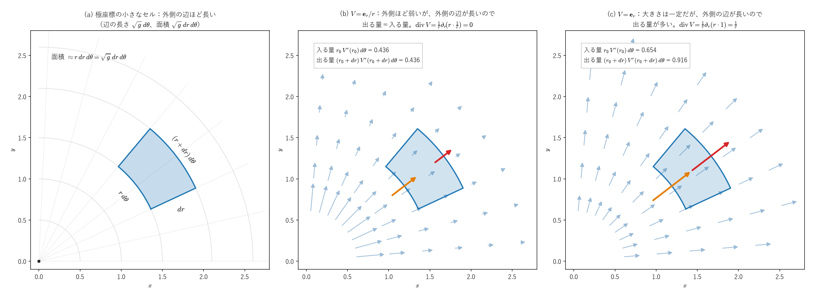

# ヤコビ行列から見るラプラス・ベルトラミ作用素 ―デカルトのラプラシアンとの整合と、一からの導出―

直交座標のラプラシアン $\sum_i\partial^2/\partial(x^i)^2$ を、ヤコビ行列の逆行列 $A=J^{-1}$ を使って曲線座標に書き直すと、ラプラス・ベルトラミ作用素の形になることを確かめます。そのうえで、デカルト座標を経由せずに同じ作用素を定義から導きます。

| Part | 内容 |
|---|---|
| I | 前提：直交座標から極座標へ。行列 $J$ と逆行列 $A=J^{-1}$（余因子行列による成分）、逆計量 $g^{-1}=AA^T$ |
| II | 整合：デカルトのラプラシアンを変換すると、ラプラス・ベルトラミ作用素に一致する |
| III | 非対角成分が $0$ でない場合：斜交座標の具体例 |
| IV | 一から導出：座標によらない定義（部分積分）から同じ式を出す |

---

## 記号の約束

- $x^i$：直交デカルト座標（$i,m=1,\dots,n$）。$q^j$：曲線座標（$j,k,l=1,\dots,n$）。
- $\partial_j:=\dfrac{\partial}{\partial q^j}$（曲線座標での偏微分）。
- ヤコビ行列と、その逆行列：

$$
J_{ij}=\frac{\partial x^i}{\partial q^j},\qquad A_{ji}=\frac{\partial q^j}{\partial x^i}\tag{1}
$$

$J$ は、行番号が $x$ の添字、列番号が $q$ の添字です。$A$ は逆写像 $x\mapsto q$ のヤコビ行列で、行と列の役割が $J$ と入れ替わり、行番号が $q$ の添字、列番号が $x$ の添字です。Part I §1 で示すとおり、$A=J^{-1}$ です。

- 繰り返される添字は和を取ります（アインシュタインの縮約）。誤解しやすい箇所では $\sum$ を明示します。デカルト座標の添字は上下を区別せず、和は $\sum_i$ で明示します。

> **他のノートとの対応**：$A$ は、[計量テンソルと共変反変_まとめ](計量テンソルと共変反変_まとめ.md) の $A^i{}_a=\partial q^i/\partial x^a=(J^{-1})^i{}_a$、[クリストッフェル記号のノート](christoffel_riemann_intro.md#p3) の $A=J^{-1}$ と同じ行列です（このノートの $A_{ji}$ が、それらの $A^j{}_i$ にあたります）。

---

# Part I：前提 ― 直交座標から極座標へ

## 1. 行列 $J$ と $A$ の関係

連鎖律より

$$
\sum_j \frac{\partial x^m}{\partial q^j}\frac{\partial q^j}{\partial x^i}=\frac{\partial x^m}{\partial x^i}=\delta_{mi}
\qquad\Longleftrightarrow\qquad JA=I,\quad\text{つまり}\quad A=J^{-1}\tag{2}
$$

したがって $AJ=I$ も成り立ちます（$q$ の側で連鎖律を使っても、$\sum_i\dfrac{\partial q^j}{\partial x^i}\dfrac{\partial x^i}{\partial q^k}=\delta_{jk}$ と直接わかります）。成分で書くと次の通りです。

$$
\sum_j J_{mj}A_{ji}=\delta_{mi},\qquad \sum_i A_{ji}J_{ik}=\delta_{jk}\tag{3}
$$

**幾何学的な意味**：$J$ の第 $j$ 列は、座標 $q^j$ だけを動かしたときの接ベクトル $\mathbf e_j=\partial\mathbf x/\partial q^j$ です（§4）。$A$ の第 $j$ 行は、座標関数 $q^j$ の勾配 $\nabla q^j=(\partial q^j/\partial x^1,\dots,\partial q^j/\partial x^n)$ です。$AJ=I$ は

$$
\nabla q^j\cdot\mathbf e_k=\delta_{jk}
$$

という関係です。$q^k$ だけを動かす方向に進むと、ほかの座標 $q^j$（$j\ne k$）は変わらず、$q^k$ だけが単位の割合で増える、ということです。

## 2. $A$ の成分を $J$ の成分で書く（余因子行列）

$A=J^{-1}$ の各成分は、$J$ の成分から**余因子行列**で具体的に書けます。

**2次元**：$J=\begin{pmatrix}J_{11}&J_{12}\\J_{21}&J_{22}\end{pmatrix}$ なら

$$
A=J^{-1}=\frac1{\det J}\begin{pmatrix}J_{22}&-J_{12}\\-J_{21}&J_{11}\end{pmatrix},\qquad \det J=J_{11}J_{22}-J_{12}J_{21}
$$

です。偏微分で書くと、曲線座標 $(q^1,q^2)$ とデカルト座標 $(x,y)$ について

$$
\frac{\partial q^1}{\partial x}=\frac1{\det J}\frac{\partial y}{\partial q^2},\qquad
\frac{\partial q^1}{\partial y}=-\frac1{\det J}\frac{\partial x}{\partial q^2},\qquad
\frac{\partial q^2}{\partial x}=-\frac1{\det J}\frac{\partial y}{\partial q^1},\qquad
\frac{\partial q^2}{\partial y}=\frac1{\det J}\frac{\partial x}{\partial q^1}
$$

**一般の $n$ 次元**：$J$ から第 $i$ 行と第 $j$ 列を取り除いた小行列式を $\Delta_{ij}$ とすると、

$$
\boxed{A_{ji}=\frac{\partial q^j}{\partial x^i}=\frac{(-1)^{i+j}\,\Delta_{ij}}{\det J}}
$$

です。$A$ の $(j,i)$ 成分を作るには、$J$ の「$i$ 行 $j$ 列」を取り除きます（行と列が入れ替わることに注意）。$3\times3$ の場合の9成分すべてと、$J\tilde J=(\det J)\,I$（$\tilde J$ は余因子行列）が成り立つ理由は、[クリストッフェル記号のノートの補遺 §2](christoffel_riemann_intro.md#supp-2) にまとめています。

**例（極座標）**：§5 の $J$ では $\det J=r$ なので、

$$
\frac{\partial r}{\partial x}=\frac1r\cdot r\cos\theta=\cos\theta,\qquad
\frac{\partial r}{\partial y}=-\frac1r\cdot(-r\sin\theta)=\sin\theta,\qquad
\frac{\partial\theta}{\partial x}=-\frac{\sin\theta}r,\qquad
\frac{\partial\theta}{\partial y}=\frac{\cos\theta}r
$$

です。$r=\sqrt{x^2+y^2}$、$\theta=\arctan(y/x)$ を直接微分しても、同じ結果になります。

**注意：$A$ の成分は、$J$ の成分の逆数ではありません。** 例えば $\partial x/\partial r=\cos\theta$ ですが、$\partial r/\partial x$ は $1/\cos\theta$ ではなく $\cos\theta$ です。$\partial x/\partial r$ は「$\theta$ を固定して $r$ を動かす」微分、$\partial r/\partial x$ は「$y$ を固定して $x$ を動かす」微分で、固定するものが違うからです。$A$ の各成分は、$J$ の**ほかの成分**（小行列式）と $\det J$ から決まります。このように成分が絡み合っているため、$A$ を微分すると、Part II §4 の (14) のように、$J$ の微分が行列の積の形で現れます。

*(a) $J$ の列は、接ベクトル $\mathbf e_r=\partial\mathbf x/\partial r$（長さ $1$）と $\mathbf e_\theta=\partial\mathbf x/\partial\theta$（長さ $r$）です。(b) $A=J^{-1}$ の行は、勾配 $\nabla r$（長さ $1$）と $\nabla\theta$（長さ $1/r$）で、等高線（円と放射状の直線）に垂直です。極座標は座標曲線が直交するので $\nabla\theta$ と $\mathbf e_\theta$ は同じ向きですが、長さは逆数どうしで、$\nabla\theta\cdot\mathbf e_\theta=1$ です（(a)(b) は同じ縮尺です）。(c) $\partial x/\partial r$ は「$\theta$ を固定して $r$ を動かす」ときの $x$ の変化率、$\partial r/\partial x$ は「$y$ を固定して $x$ を動かす」ときの $r$ の変化率で、どちらも $\cos\theta$ です（橙の破線は $r$ 一定の円弧で、$\Delta r$ は動かす量 $L$ が小さいときの近似です）。図を描くときに、各点で $AJ=I$ と成分の値を数値微分で確かめています。*

## 3. $\nabla_x=A^T\nabla_q$

関数 $f$ を $q$ の関数とみて $x^i$ で微分すると、連鎖律より

$$
\frac{\partial f}{\partial x^i}=\sum_j\frac{\partial q^j}{\partial x^i}\frac{\partial f}{\partial q^j}=\sum_jA_{ji}\partial_jf
$$

そこで次のように置きます。

$$
B_i:=\sum_jA_{ji}\partial_j=\frac{\partial}{\partial x^i}\qquad(B=A^T\nabla_q=\nabla_x)\tag{4}
$$

$A$ の各成分は $q$ の関数です。**成分が位置によって変わること**が、Part II で補正項を生みます。

## 4. 計量テンソル $g$ と逆計量 $g^{-1}=AA^T$

曲線座標の基底ベクトル（接ベクトル）は $\mathbf e_j=\partial\mathbf x/\partial q^j$、つまり $J$ の第 $j$ 列です。その内積が計量です。

$$
g_{jk}=\langle\mathbf e_j,\mathbf e_k\rangle=\sum_iJ_{ij}J_{ik}\quad(g=J^TJ)\tag{5}
$$

(2) より $g^{-1}=(J^TJ)^{-1}=J^{-1}J^{-T}=AA^T$ です。成分で書くと次の通りです。

$$
g^{jk}=\sum_iA_{ji}A_{ki}\tag{6}
$$

$A$ の第 $j$ 行と第 $k$ 行の内積、つまり $g^{jk}=\nabla q^j\cdot\nabla q^k$ です。

また $\det g=(\det J)^2$ なので、次が成り立ちます。

$$
\sqrt{|g|}=|\det J|\tag{7}
$$

## 5. 極座標（2次元）

$x=r\cos\theta,\ y=r\sin\theta$、$(q^1,q^2)=(r,\theta)$ とします。

$$
J=\begin{pmatrix}\cos\theta&-r\sin\theta\\ \sin\theta&r\cos\theta\end{pmatrix},\qquad
A=J^{-1}=\begin{pmatrix}\cos\theta&\sin\theta\\[1mm] -\dfrac{\sin\theta}{r}&\dfrac{\cos\theta}{r}\end{pmatrix}
$$

$A$ の1行目は $\nabla r=(\cos\theta,\ \sin\theta)$、2行目は $\nabla\theta=(-\sin\theta/r,\ \cos\theta/r)$ で、§2 の余因子行列の計算と一致します。

$$
g=J^TJ=\begin{pmatrix}1&0\\0&r^2\end{pmatrix},\qquad
g^{-1}=AA^T=\begin{pmatrix}1&0\\0&1/r^2\end{pmatrix},\qquad \sqrt{|g|}=|\det J|=r
$$

## 6. 球座標（3次元）：$J=RD$ と対角性

$x=r\sin\theta\cos\phi,\ y=r\sin\theta\sin\phi,\ z=r\cos\theta$、$(q^1,q^2,q^3)=(r,\theta,\phi)$ とします。$J$ の3つの列は、$\partial_r,\partial_\theta,\partial_\phi$ に対応する接ベクトルです。

- $\partial_r\mathbf x$：$\theta,\phi$ を固定して $r$ だけ動かす放射状の直線の方向（長さ $1$）
- $\partial_\theta\mathbf x$：$r,\phi$ を固定して $\theta$ だけ動かす、子午線（半径 $r$ の円周）に沿う方向（長さ $r$）
- $\partial_\phi\mathbf x$：$r,\theta$ を固定して $\phi$ だけ動かす、緯線（半径 $r\sin\theta$ の円周）に沿う方向（長さ $r\sin\theta$）

この3方向は互いに直交しています。そこで各列を長さで割った単位ベクトル $\hat{\mathbf e}_r,\hat{\mathbf e}_\theta,\hat{\mathbf e}_\phi$ を並べた行列を $R$（直交行列、$R^TR=I$）、長さを並べた対角行列を $D$ とすると、

$$
J=RD,\qquad D=\mathrm{diag}(1,\ r,\ r\sin\theta)
$$

と分解できます。すると、

$$
g=J^TJ=D R^TRD=D^2=\mathrm{diag}\big(1,\ r^2,\ r^2\sin^2\theta\big)
$$

$$
A=J^{-1}=D^{-1}R^{-1}=D^{-1}R^T,\qquad
g^{-1}=AA^T=D^{-1}R^TRD^{-1}=D^{-2}=\mathrm{diag}\Big(1,\ \frac1{r^2},\ \frac1{r^2\sin^2\theta}\Big)\tag{8}
$$

**非対角成分が $0$ になる理由**は、接ベクトルが互いに直交する（$R$ が直交行列になる）ことです。$g_{jk}=|\mathbf e_j||\mathbf e_k|\cos\angle(\mathbf e_j,\mathbf e_k)$ で、$j\ne k$ のとき角度が $\pi/2$ なので $0$ になります。$g$ が対角なら逆行列 $g^{-1}$ も対角です。

また $A^T=RD^{-1}$ から、勾配は次のように書けます。

$$
\nabla_x=A\nabla_q=\hat{\mathbf e}_r\,\partial_r+\hat{\mathbf e}_\theta\,\frac1r\partial_\theta+\hat{\mathbf e}_\phi\,\frac1{r\sin\theta}\partial_\phi
$$

おなじみの球座標の勾配の式です。$A=D^{-1}R^T$ の各行は、$\nabla r=\hat{\mathbf e}_r$、$\nabla\theta=\hat{\mathbf e}_\theta/r$、$\nabla\phi=\hat{\mathbf e}_\phi/(r\sin\theta)$ です。

> **$A$ が位置の関数であることの意味**：同じ角度 $\theta$ でも、原点に近い点と遠い点では、$\Delta\theta$ に対する $\Delta x$ の大きさが違います。$A$ の成分に $1/r$ が入るのはこのためで、座標系の「網の目」が場所ごとに歪んでいることを表します。

---

# Part II：整合 ― デカルトのラプラシアンを変換するとラプラス・ベルトラミ作用素になる

## 1. 出発点

デカルト座標のラプラシアンは $\Delta=\sum_i\dfrac{\partial^2}{\partial(x^i)^2}=\sum_iB_iB_i$（$B^TB$ にあたります）です。(4) を代入して展開します。

$$
\Delta f=\sum_{i}\Big(\sum_jA_{ji}\partial_j\Big)\Big(\sum_kA_{ki}\partial_kf\Big)
=\sum_{i,j,k}A_{ji}\,\partial_j\big(A_{ki}\,\partial_kf\big)
$$

積の微分 $\partial_j(uv)=(\partial_ju)v+u\,\partial_jv$ を使うと、

$$
\Delta f=\sum_{i,j,k}A_{ji}A_{ki}\,\partial_j\partial_kf+\sum_{i,j,k}A_{ji}(\partial_jA_{ki})\,\partial_kf
$$

(6) より第1項の係数は $g^{jk}$ です。第2項の係数を $C_k$ と置きます。

$$
\boxed{\Delta f=g^{jk}\,\partial_j\partial_kf+C_k\,\partial_kf},\qquad C_k:=\sum_{i,j}A_{ji}\,\partial_jA_{ki}\tag{9}
$$

- **第1項**は接ベクトルの内積（逆計量）が作る2階微分の部分です。球座標なら (8) より $\partial_r^2+\frac1{r^2}\partial_\theta^2+\frac1{r^2\sin^2\theta}\partial_\phi^2$ です。
- **第2項**は、$A$ が位置の関数であるために、積の微分で余分に出てくる1階微分の項です。座標軸の向きや伸び縮みが場所ごとに変わることの補正です。デカルト座標なら $A$ は定数なので消えます。

## 2. 目標

ラプラス・ベルトラミ作用素は

$$
\Delta_g f=\frac1{\sqrt{|g|}}\partial_j\big(\sqrt{|g|}\,g^{jk}\partial_kf\big)=g^{jk}\partial_j\partial_kf+\frac1{\sqrt{|g|}}\partial_j\big(\sqrt{|g|}\,g^{jk}\big)\partial_kf
$$

です。(9) と見比べると、一致するための条件は次の1本だけです。

$$
\boxed{C_k=\frac1{\sqrt{|g|}}\,\partial_j\big(\sqrt{|g|}\,g^{jk}\big)}\tag{10}
$$

以下、$\sqrt{|g|}$ を $\sqrt g$ と略記します。

## 3. 両辺を $g^{jk}$ と $\ln\sqrt g$ で書く

**右辺**：積の微分と、$\dfrac{\partial_j\sqrt g}{\sqrt g}=\partial_j\ln\sqrt g$ より、

$$
\frac1{\sqrt g}\partial_j\big(\sqrt g\,g^{jk}\big)=\partial_jg^{jk}+g^{jk}\,\partial_j\ln\sqrt g\tag{11}
$$

**左辺**：(6) の $g^{jk}=\sum_iA_{ji}A_{ki}$ を $q^j$ で微分して和を取ると、

$$
\partial_jg^{jk}=\sum_{i,j}(\partial_jA_{ji})A_{ki}+\sum_{i,j}A_{ji}\,\partial_jA_{ki}
$$

よって、

$$
C_k=\partial_jg^{jk}-D_k,\qquad D_k:=\sum_{i,j}(\partial_jA_{ji})\,A_{ki}\tag{12}
$$

(11) と (12) を比べると、(10) が成り立つ条件は次の1本になります。

$$
\boxed{D_k=-g^{jk}\,\partial_j\ln\sqrt g}\tag{13}
$$

## 4. $D_k$ を計算する

**(a) $A$ の微分を $J$ の微分で表す。** $AJ=I$ を $q^j$ で微分します。$I$ は定数なので、

$$
(\partial_jA)\,J+A\,(\partial_jJ)=0
$$

右から $A$ を掛けて、$JA=I$ で左辺第1項の $J$ を消すと、

$$
\partial_jA=-A\,(\partial_jJ)\,A,\qquad\text{成分では}\quad \partial_jA_{ki}=-\sum_{m,l}A_{km}\,(\partial_jJ_{ml})\,A_{li}\tag{14}
$$

です（$k,l$ は $q$ の添字、$m,i$ は $x$ の添字）。これは[クリストッフェル記号のノートの Part III §2](christoffel_riemann_intro.md#p3-2) の「逆行列の微分公式」と同じ式です。

**(b) $D_k$ に代入する。** (14) で $k$ を $j$ に置き換えて（$\partial_jA_{ji}=-\sum_{m,l}A_{jm}(\partial_jJ_{ml})A_{li}$）$j$ で和を取り、$A_{ki}$ を掛けて $i$ で和を取ります。

$$
D_k=\sum_{i,j}(\partial_jA_{ji})A_{ki}=-\sum_{j,l,m}\Big[\sum_iA_{ki}A_{li}\Big]A_{jm}\,(\partial_jJ_{ml})
$$

$\sum_iA_{ki}A_{li}=g^{kl}$ ((6)) なので $i$ が消えて、

$$
D_k=-\sum_lg^{kl}\Big[\sum_{j,m}A_{jm}\,\partial_jJ_{ml}\Big]\tag{15}
$$

**(c) 混合偏微分の対称性（シュワルツの定理）。** $J_{ml}=\partial x^m/\partial q^l$ なので $\partial_jJ_{ml}=\dfrac{\partial^2x^m}{\partial q^j\partial q^l}=\partial_lJ_{mj}$ です。したがって (15) の角括弧は、

$$
\sum_{j,m}A_{jm}\,\partial_lJ_{mj}=\operatorname{tr}\big(A\,\partial_lJ\big)=\operatorname{tr}\big(J^{-1}\partial_lJ\big)\tag{16}
$$

（$\sum_mA_{jm}(\partial_lJ)_{mj}$ は行列の積 $A\,\partial_lJ$ の $(j,j)$ 成分なので、$j$ で和を取るとトレースです。）

> **クリストッフェル記号との関係**：[クリストッフェル記号のノートの Part III](christoffel_riemann_intro.md#p3) の $\Gamma^k{}_{ij}=A^k{}_a\,\partial_jJ^a{}_i$ で $k=i$ として和を取ると、(16) の角括弧は、縮約したクリストッフェル記号 $\Gamma^j{}_{jl}$ そのものです。次の (d) の結果 $\Gamma^j{}_{jl}=\partial_l\ln\sqrt g$ は、同じノートの[補遺 §1](christoffel_riemann_intro.md#supp-1) の式で、(15) は $D_k=-g^{kl}\,\Gamma^j{}_{jl}$ とも書けます。

**(d) Jacobi の公式。** 任意の正則行列 $M$ について $\partial_l\ln|\det M|=\operatorname{tr}(M^{-1}\partial_lM)$ が成り立ちます（証明は [det_exp_trace_proof.md](../04_群論・代数/det_exp_trace_proof.md) の「Jacobiの公式」を参照）。$M=J$ とすると、

$$
\operatorname{tr}\big(J^{-1}\partial_lJ\big)=\partial_l\ln|\det J|=\partial_l\ln\sqrt g\tag{17}
$$

最後は (7) $\sqrt g=|\det J|$ を使いました。

**(e) まとめる。** (15)(16)(17) より、

$$
D_k=-\sum_lg^{kl}\,\partial_l\ln\sqrt g
$$

これは (13) そのものです。

## 5. 結論

(13) が成り立つので (10) が成り立ち、(9) の第2項はちょうど $\frac1{\sqrt g}\partial_j(\sqrt g\,g^{jk})\,\partial_k$ になります。

$$
\boxed{\ \sum_i\frac{\partial^2f}{\partial(x^i)^2}
=g^{jk}\partial_j\partial_kf+\frac1{\sqrt g}\partial_j\big(\sqrt g\,g^{jk}\big)\partial_kf
=\frac1{\sqrt g}\,\partial_j\Big(\sqrt g\,g^{jk}\,\partial_kf\Big)\ }
$$

この導出では、$g^{jk}$ が対角であるとは一度も仮定していません。**一般の曲線座標（斜交を含む）で成り立ちます。** 対角性を使ったのは、Part I §5・§6 の極座標・球座標の計算だけです。

> **使った道具**：$AJ=I$ の微分（(14)）、混合偏微分の対称性（(16)）、Jacobi の公式（(17)）、$\sqrt g=|\det J|$（(7)）です。Jacobi の公式の部分で、$\det$ の対数微分とトレースが結びつきます。

## 6. 極座標での確認

2次元極座標では $\sqrt g=r$、$g^{-1}=\mathrm{diag}(1,1/r^2)$ なので、(10) の右辺は次の通りです。

$$
\frac1{\sqrt g}\partial_j(\sqrt g\,g^{jk})\ :\quad k=r:\ \frac1r\partial_r(r\cdot1)=\frac1r,\qquad k=\theta:\ \frac1r\partial_\theta\Big(r\cdot\frac1{r^2}\Big)=0
$$

左辺 $C_k=\sum_{i,j}A_{ji}\partial_jA_{ki}$ を Part I §5 の $A$ から直接計算します。

$$
C_r=\Big(-\frac{\sin\theta}{r}\Big)(-\sin\theta)+\frac{\cos\theta}{r}\cos\theta=\frac1r,\qquad
C_\theta=\frac{2\sin\theta\cos\theta}{r^2}-\frac{2\sin\theta\cos\theta}{r^2}=0
$$

両辺が一致し、$\Delta=\partial_r^2+\dfrac1r\partial_r+\dfrac1{r^2}\partial_\theta^2$ が得られます。

球座標では $\sqrt g=r^2\sin\theta$ なので、同様に

$$
\Delta=\frac1{r^2}\partial_r\big(r^2\partial_r\big)+\frac1{r^2\sin\theta}\partial_\theta\big(\sin\theta\,\partial_\theta\big)+\frac1{r^2\sin^2\theta}\partial_\phi^2
$$

となります。詳しい計算は [球座標の計量テンソル計算例](球座標の計量テンソル計算例.md) の §7 にあります。

---

# Part III：非対角成分が $0$ でない場合

極座標は $g^{jk}$ が対角になる特別な例でした。対角でない例で、Part II の結論を確かめます。

## 1. 例：$u=x,\ v=y+x^2$

$q=(u,v)$ とします。逆に解くと $x=u,\ y=v-u^2$ です。座標曲線 $v=\text{一定}$ は放物線 $y=-x^2+\text{定数}$、$u=\text{一定}$ は鉛直線で、両者は $u\ne0$ では直交しません（$u=0$、つまり $y$ 軸の上では、放物線の接線が水平になり、直交します）。

$$
J=\begin{pmatrix}1&0\\-2u&1\end{pmatrix},\qquad
A=J^{-1}=\begin{pmatrix}1&0\\2u&1\end{pmatrix}
$$

$A$ の1行目は $\nabla u=(\partial u/\partial x,\ \partial u/\partial y)=(1,\ 0)$、2行目は $\nabla v=(2x,\ 1)=(2u,\ 1)$ で、(1) と一致します。Part I §2 の余因子行列でも、$\det J=1$ なので $A=\begin{pmatrix}J_{22}&-J_{12}\\-J_{21}&J_{11}\end{pmatrix}$ から同じ結果になります。

$$
g=J^TJ=\begin{pmatrix}1+4u^2&-2u\\-2u&1\end{pmatrix},\qquad
g^{-1}=AA^T=\begin{pmatrix}1&2u\\2u&1+4u^2\end{pmatrix},\qquad \sqrt g=|\det J|=1
$$

$g$ も $g^{-1}$ も**非対角成分が残ります**。

*灰色の鉛直線が $u$ 一定、放物線が $v$ 一定の線です。(a) $J$ の列 $\mathbf e_u=(1,-2u)$、$\mathbf e_v=(0,1)$ は、座標曲線の接線方向です。(b) $A$ の行 $\nabla u=(1,0)$、$\nabla v=(2u,1)$ は、等高線に垂直です。(c) $u=1$ の点で4本を重ねたものです。$\nabla u\perp\mathbf e_v$、$\nabla v\perp\mathbf e_u$ で、$\nabla u\cdot\mathbf e_u=\nabla v\cdot\mathbf e_v=1$（$AJ=I$）ですが、$\mathbf e_u$ と $\mathbf e_v$ は直交せず（$g_{uv}=\mathbf e_u\cdot\mathbf e_v=-2u$）、$\nabla u$ と $\mathbf e_u$ の向きもずれます。座標曲線が直交する座標では $\nabla q^j=\mathbf e_j/|\mathbf e_j|^2$ で、$\nabla q^j$ と $\mathbf e_j$ は同じ向きになるので（図 lb01）、このずれは斜交座標に特有です。*

## 2. 係数 $C_k$ を直接計算する

$A$ の成分のうち、$q$ に依存するのは $A_{vx}=\partial v/\partial x=2u$ だけで、$\partial_uA_{vx}=2$ です。

$$
C_v=\sum_{i,j}A_{ji}\,\partial_jA_{vi}=A_{ux}\,\partial_uA_{vx}=1\cdot2=2,\qquad C_u=0
$$

(10) の右辺で確かめます。$\sqrt g=1$ なので、

$$
k=v:\ \partial_ug^{uv}+\partial_vg^{vv}=2+0=2,\qquad k=u:\ \partial_ug^{uu}+\partial_vg^{vu}=0+0=0
$$

(10) が成り立っています。

## 3. 結果

$f(x,y)=F(u,v)$ と書くと、(9) より、

$$
\Delta f=F_{uu}+4u\,F_{uv}+(1+4u^2)\,F_{vv}+2\,F_v
$$

**直接変換での検算。** $u=x,\ v=y+x^2$ から、$f_x=F_u+2xF_v$ なので

$$
f_{xx}=F_{uu}+4xF_{uv}+4x^2F_{vv}+2F_v,\qquad f_{yy}=F_{vv}
$$

足すと $F_{uu}+4uF_{uv}+(1+4u^2)F_{vv}+2F_v$ で、上の結果と一致します。

## 4. この例でわかること

- **非対角成分があると、混合微分 $\partial_u\partial_v$ が現れます。** 係数 $g^{uv}=2u$ は、座標曲線が直交しないことの現れです。
- **補正項は $\sqrt g$ の微分だけではありません。** この例では $\sqrt g=1$ なので $\partial_j\ln\sqrt g=0$ ですが、補正項 $C_v=2$ は消えません。(11) の第1項 $\partial_jg^{jk}$ が働いているためです。$g^{jk}$ 自体が位置に依存して変わることが補正を生みます。
- Part II の証明で $g^{jk}$ の対角性を使っていなかったことが、この例で実際に確認できました。

> **補足（クリストッフェル記号との関係）**：リーマン幾何の標準的な恒等式 $\dfrac1{\sqrt g}\partial_j(\sqrt g\,g^{jk})=-g^{ij}\Gamma^k{}_{ij}$ から、$C_k=-g^{ij}\Gamma^k{}_{ij}$ と読めます。つまり (9) は $\Delta f=g^{ij}\big(\partial_i\partial_jf-\Gamma^k{}_{ij}\partial_kf\big)$ という、共変2階微分のトレースの形です（共変微分は[クリストッフェル記号のノート](christoffel_riemann_intro.md#p4)の Part IV）。

---

# Part IV：一から導出 ― 座標によらない定義から

Part II は「デカルト座標のラプラシアンから出発し、それが曲線座標でどう書けるか」を確かめる議論でした。そのため、デカルト座標が存在する空間（ユークリッド空間）でしか使えません。ここでは、計量 $g$ だけから作用素を定義します。曲面のように、デカルト座標がない空間でも使える定義です。

## 1. 勾配と体積要素

計量 $g_{jk}$ が与えられた空間で、

- **勾配**：任意のベクトル $V$ について $\langle\operatorname{grad}f,V\rangle=V(f)$ となるベクトル。成分で解くと $(\operatorname{grad}f)^j=g^{jk}\partial_kf$ です。
- **体積要素**：$dV=\sqrt g\,d^nq$。座標ベクトル $\mathbf e_1dq^1,\dots,\mathbf e_ndq^n$ が張る小さな平行体の体積で、計量だけで決まります（$n$ 本のベクトルが張る平行体の体積の2乗は、内積を並べた行列の行列式で、ここでは $\det g\,(dq^1\cdots dq^n)^2$ です）。別の座標 $q'$ に取り替えると、$K_{jk}=\partial q^j/\partial q'^k$ として $g'=K^TgK$ なので $\sqrt{g'}=\sqrt g\,|\det K|$ で、変数変換の公式 $d^nq=|\det K|\,d^nq'$ とちょうど打ち消し合い、$\sqrt g\,d^nq$ は座標によりません。ユークリッド空間では、Part I の (7) $\sqrt g=|\det J|$ と $d^nx=|\det J|\,d^nq$ から、デカルト座標の $d^nx$ と一致します。

## 2. 定義：部分積分で $-\Delta$ が随伴になること

$\Delta f:=\operatorname{div}\operatorname{grad}f$ を、次の性質で特徴づけます。任意の関数 $h$（領域の端で $0$ になるもの）について、

$$
\int\langle\operatorname{grad}f,\operatorname{grad}h\rangle\,dV=-\int h\,(\Delta f)\,dV\tag{18}
$$

デカルト座標では、これは $\int\nabla f\cdot\nabla h\,d^nx=-\int h\,\nabla^2f\,d^nx$（部分積分）に他なりません。座標を使わずに言い換えたのが (18) です。

## 3. 座標で計算する

(18) の左辺を $q$ 座標で書きます。$\langle\operatorname{grad}f,\operatorname{grad}h\rangle=g^{jk}\,\partial_kf\,\partial_jh$ なので、

$$
\text{左辺}=\int g^{jk}\,\partial_kf\,\partial_jh\,\sqrt g\,d^nq
$$

$\partial_jh$ を $\partial_j$ から外すために部分積分します（$h$ は端で $0$ なので境界項は消えます）。

$$
\text{左辺}=-\int h\,\partial_j\big(\sqrt g\,g^{jk}\partial_kf\big)\,d^nq
=-\int h\,\Big[\frac1{\sqrt g}\partial_j\big(\sqrt g\,g^{jk}\partial_kf\big)\Big]\sqrt g\,d^nq
$$

これが任意の $h$ について (18) の右辺 $-\int h\,(\Delta f)\sqrt g\,d^nq$ に等しいので、$h$ の任意性（変分法の基本補題）から、

$$
\boxed{\Delta f=\frac1{\sqrt g}\,\partial_j\Big(\sqrt g\,g^{jk}\,\partial_kf\Big)}\tag{19}
$$

が得られます。

同じ議論から、ベクトル場の発散が $\operatorname{div}V=\dfrac1{\sqrt g}\partial_j\big(\sqrt g\,V^j\big)$ であることも出ます。

**発散の式の $\sqrt g$ の意味**：$\sqrt g\,d^nq$ は小さなセルの体積で、座標 $q^j$ が一定の面を流れ $V$ が通り抜ける量は、$\sqrt g\,V^j$ に、その面に沿った座標の幅（$q^j$ 以外の $dq$ の積）を掛けたものです。したがって $\partial_j(\sqrt g\,V^j)\,d^nq$ は、向かい合う面を出る量と入る量の差で、それをセルの体積 $\sqrt g\,d^nq$ で割ったものが発散です。

*(a) 極座標の小さなセル（$r$ から $r+dr$、$\theta$ から $\theta+d\theta$）です。内側の辺の長さは $r\,d\theta$、外側の辺は $(r+dr)\,d\theta$ で、面積は $\sqrt g\,dr\,d\theta=r\,dr\,d\theta$ です。$r$ 方向の流れが辺を通る量は、$V^r$ に辺の長さ $\sqrt g\,d\theta$ を掛けた $\sqrt g\,V^r\,d\theta$ です。(b) $V=\mathbf e_r/r$ は外側ほど弱くなりますが、外側の辺が長い分だけ、通る量は内側と同じです。出る量と入る量が等しく、$\operatorname{div}V=\frac1r\partial_r\big(r\cdot\frac1r\big)=0$ です。(c) $V=\mathbf e_r$ は大きさが一定ですが、外側の辺が長い分だけ出る量が多く、$\operatorname{div}V=\frac1r\partial_r(r\cdot1)=\frac1r$ です。図を描くときに、セルの周りの線積分で出入りの差を計算して $\iint\operatorname{div}V\,\sqrt g\,dr\,d\theta$ と一致すること、デカルト座標で計算した発散と一致することを確かめています。*

## 4. Part II との関係

| | Part II | Part IV |
|---|---|---|
| 出発点 | デカルト座標のラプラシアン | 計量 $g$ と体積要素 $\sqrt g$ |
| 必要なもの | デカルト座標が存在すること | 計量だけ（曲面でもよい） |
| 示すこと | 変換すると (19) に一致する | (18) を満たす作用素が (19) になる |
| 道具 | 混合偏微分の対称性、Jacobi の公式 | 部分積分、変分法の基本補題 |

2つの議論から、次のことがわかります。

- (18) は座標を使わずに書かれているので、どの座標系で計算しても同じ作用素を定義します。
- デカルト座標では $g=I$、$\sqrt g=1$ で (19) は $\sum\partial_i^2$ になります。Part II は、これを曲線座標に変換した結果が (19) と一致することを確かめました。
- つまり、デカルトのラプラシアンを座標変換したものと、(18) から導いた作用素は、同じものです。ユークリッド空間では、ラプラス・ベルトラミ作用素は通常のラプラシアンに他なりません。

## 5. 他の導出との関係

(19) には、別の道もあります。

- $\operatorname{div}\circ\operatorname{grad}$ から導く：[計量テンソルと共変反変_まとめ](計量テンソルと共変反変_まとめ.md) の5節
- 微分形式で $\star d\star d$ として導く：[differential_forms_hodge_star.md](../03_多様体・微分形式・トポロジー/differential_forms_hodge_star.md) の Part VII

このノートの Part II は、これらとは独立に、行列計算だけで (19) に到達する道です。

---

# まとめ

1. **行列**：$J_{ij}=\partial x^i/\partial q^j$、$A=J^{-1}$（$A_{ji}=\partial q^j/\partial x^i$。成分は余因子行列で $J$ から作れる）、$\nabla_x=A^T\nabla_q$、$g=J^TJ$、$g^{-1}=AA^T$、$\sqrt g=|\det J|$。
2. **整合**：$\sum_i\partial^2/\partial(x^i)^2=\sum_iB_iB_i$ を展開すると $g^{jk}\partial_j\partial_k+C_k\partial_k$。$C_k=\frac1{\sqrt g}\partial_j(\sqrt g\,g^{jk})$ が $AJ=I$ の微分、混合偏微分の対称性、Jacobi の公式から出て、ラプラス・ベルトラミ作用素に一致する。
3. **非対角**：この導出は $g^{jk}$ の対角性を仮定しない。$u=x,\ v=y+x^2$ の例で、混合微分と $C_v=2$ が現れることを確認した。
4. **一から導出**：$\int\langle\nabla f,\nabla h\rangle\sqrt g\,dq=-\int h\,\Delta f\sqrt g\,dq$ から部分積分で同じ式。デカルト座標が存在しない空間でも使える。
