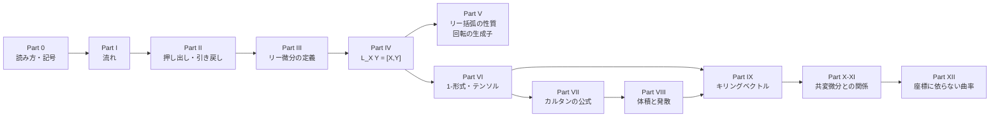
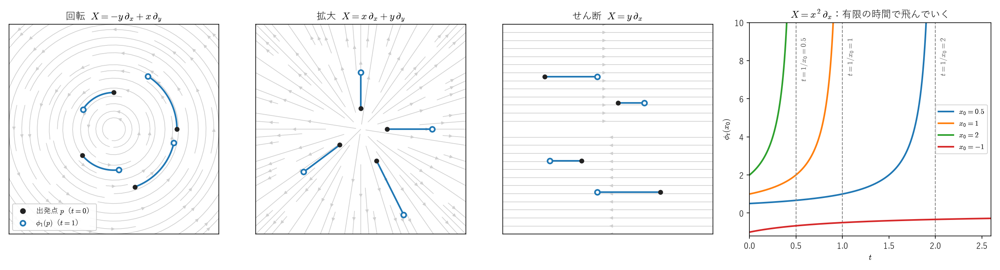
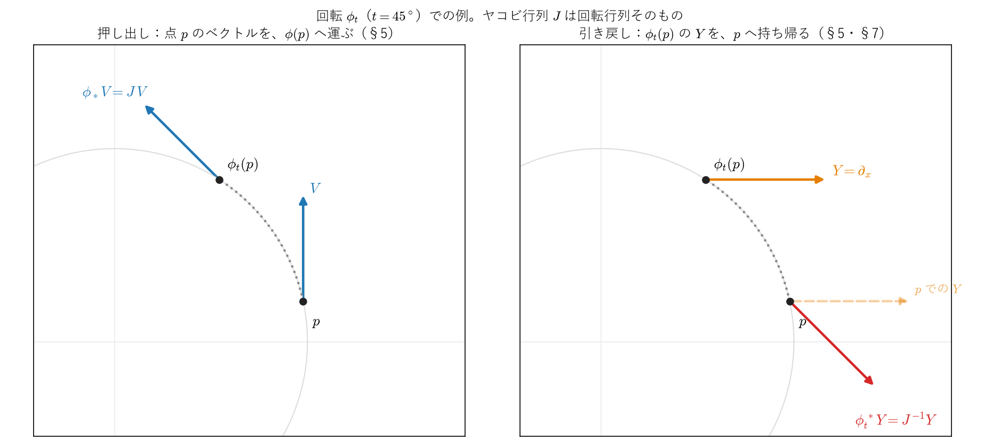
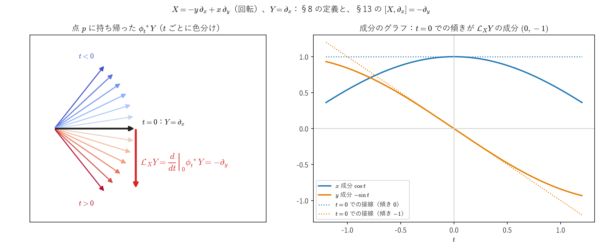
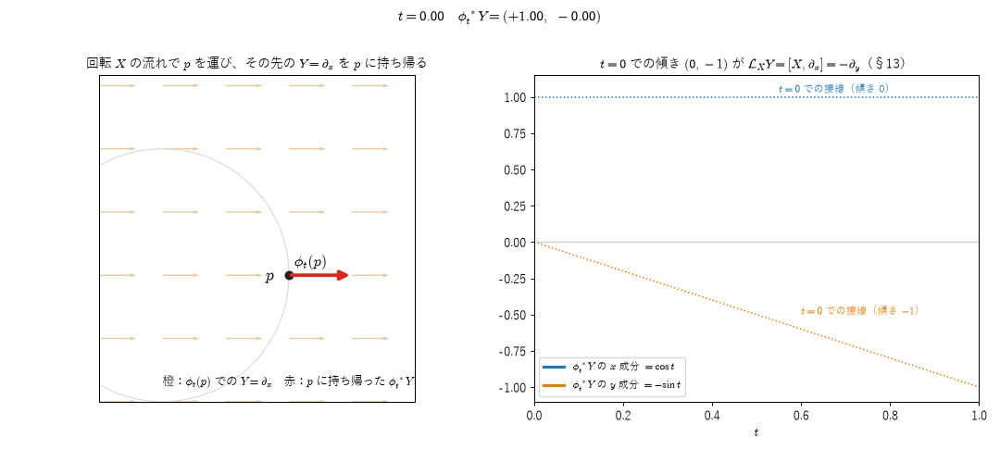
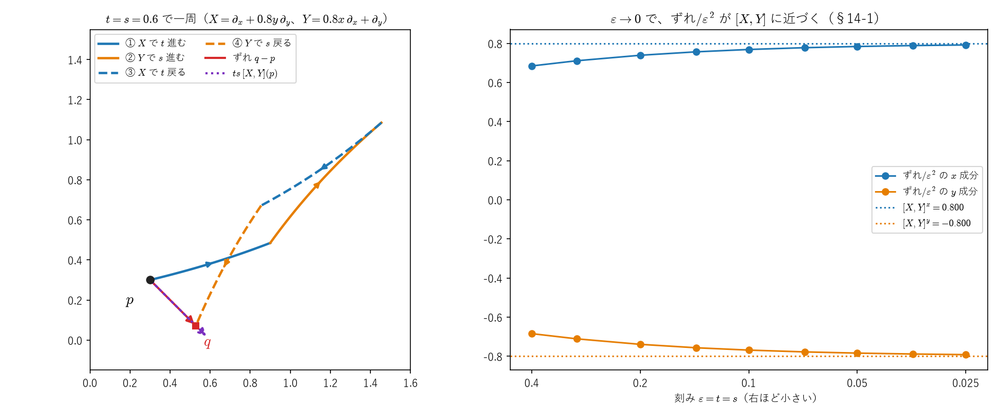
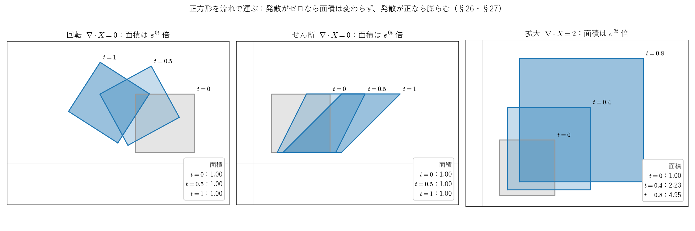
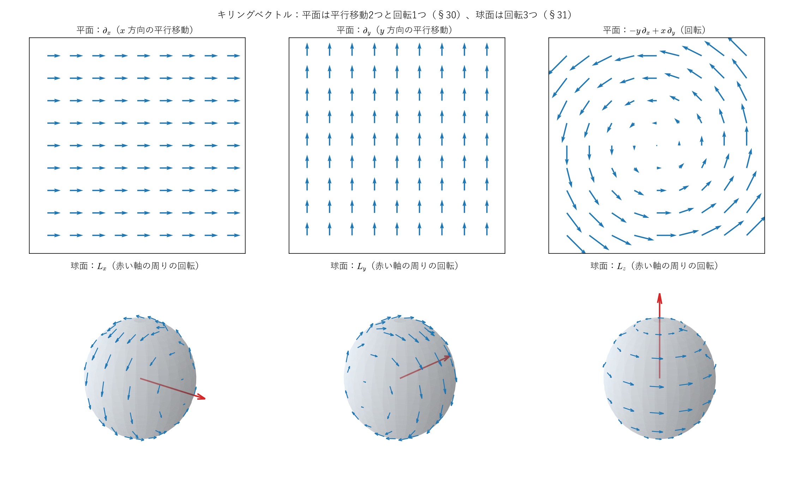
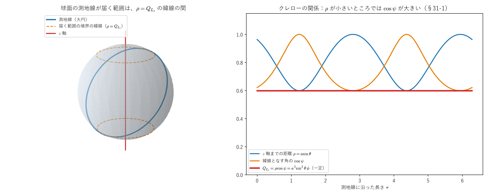

# リー微分 ―流れに沿った、座標に依らない微分―

<!-- toc-style: global -->

<a id="toc"></a>

## 目次

<!-- toc:start -->

- [Part 0：はじめに ― 読み方・前提・記号](#p0)
  - [0-1. このノートについて](#s0-1)
  - [0-2. 前提知識](#s0-2)
  - [0-3. ノートの構成](#s0-3)
  - [0-4. 記号の約束](#s0-4)
  - [0-5. リー群・リー代数との対応](#s0-5)
  - [0-6. 多様体・接ベクトル・1-形式の振り返り](#s0-6)
  - [0-7. 図と動画の見方](#s0-7)
- [Part I：流れ](#p1)
  - [1. 流れの定義と存在](#s1)
  - [2. 具体例：流れを実際に解く](#s2)
  - [3. 流れの群としての性質と、指数写像](#s3)
- [Part II：押し出しと引き戻し](#p2)
  - [4. 関数の引き戻し](#s4)
  - [5. ベクトルの押し出しと引き戻し](#s5)
  - [6. 1-形式とテンソルの引き戻し](#s6)
  - [7. 回転での例](#s7)
- [Part III：リー微分の定義と、関数のリー微分](#p3)
  - [8. リー微分の定義](#s8)
  - [9. 関数のリー微分](#s9)
- [Part IV：ベクトル場のリー微分 ―L\_XY=\[X,Y\]](#p4)
  - [10. 流れの1次近似](#s10)
  - [11. φ\_t^\*Yを計算して、tで微分する](#s11)
  - [12. リー括弧は、演算子としての交換子に等しい](#s12)
  - [13. 回転での例：流れから直接計算する](#s13)
  - [14. 座標ベクトル場のリー括弧はゼロ](#s14)
- [Part V：リー括弧の性質と、回転の生成子](#p5)
  - [15. リー括弧の性質](#s15)
  - [16. 線形なベクトル場と行列の交換子](#s16)
  - [17. 3次元の回転の生成子と、角運動量の交換関係](#s17)
- [Part VI：1-形式とテンソルのリー微分](#p6)
  - [18. 1-形式のリー微分を、引き戻しから直接求める](#s18)
  - [19. ライプニッツ則と、縮約との整合](#s19)
  - [20. (0,2)型テンソルのリー微分](#s20)
  - [21. L\_\[X,Y\]=\[ L\_X, L\_Y\]](#s21)
- [Part VII：内部積とカルタンの公式](#p7)
  - [22. 記法：2-形式の成分と内部積](#s22)
  - [23. リー微分と外微分は交換する](#s23)
  - [24. カルタンの公式の証明](#s24)
  - [25. 具体例による検算](#s25)
- [Part VIII：体積形式のリー微分と発散](#p8)
  - [26. L\_X(体積形式)=(発散)×(体積形式)](#s26)
  - [27. 具体例](#s27)
- [Part IX：キリングベクトル ―計量の対称性](#p9)
  - [28. 定義](#s28)
  - [29. 極座標：回転はキリング、動径方向はキリングでない](#s29)
  - [30. 平面のキリングベクトルをすべて求める](#s30)
  - [31. 球面のキリングベクトルとsu(2)](#s31)
- [Part X：共変微分との違い](#p10)
  - [32. 何を知っている必要があるか](#s32)
  - [33. L\_XY=∇\_XY-∇\_YX](#s33)
- [Part XI：キリングベクトルの恒等式 ∇\_iX\_j+∇\_jX\_i=( L\_Xg)\_ij](#p11)
  - [34. 出発点](#s34)
  - [35. ∇\_iX\_j+∇\_jX\_iを、計量の言葉に展開する](#s35)
  - [36. キリングベクトルへの応用](#s36)
  - [37. 対称な係数との縮約は、対称部分だけを拾う](#s37)
  - [38. キリングベクトルの発散はゼロ](#s38)
  - [39. Part Xとの対比](#s39)
- [Part XII：座標に依らないリーマン曲率テンソルの定義](#p12)
  - [40. 定義](#s40)
  - [41. -∇\_\[X,Y\]Zが必要な理由](#s41)
  - [42. テンソルであることの確認](#s42)
  - [43. 座標ベクトル場に戻すと、添字の計算と一致する](#s43)
  - [44. まとめ](#s44)
- [まとめ：全体の位置づけ](#summary)

<!-- toc:end -->

---

<a id="p0"></a>

# Part 0：はじめに ― 読み方・前提・記号

<!-- part-toc:start -->

**この Part の内容**

- [0-1. このノートについて](#s0-1)
- [0-2. 前提知識](#s0-2)
- [0-3. ノートの構成](#s0-3)
- [0-4. 記号の約束](#s0-4)
- [0-5. リー群・リー代数との対応](#s0-5)
- [0-6. 多様体・接ベクトル・1-形式の振り返り](#s0-6)
- [0-7. 図と動画の見方](#s0-7)

<!-- part-toc:end -->

<a id="s0-1"></a>

## 0-1. このノートについて

微分には、偏微分 $\partial_i$、共変微分 $\nabla_i$、外微分 $d$、リー微分 $\mathcal L_X$ の4種類があります（[クリストッフェル記号のノート](christoffel_riemann_intro.md)の Part IV §3 で整理しました）。このノートでは、そのうちの**リー微分** $\mathcal L_X$ を、一から組み立てます。

リー微分は、「ベクトル場 $X$ が作る流れに沿って、ある量がどう変化するか」を測る微分です。計量も接続も使わずに定義できるのが特徴です。$SU(2)$ とパウリ行列で見た「生成子・指数写像・交換子」という構造が、多様体の上でもう一度現れることを、具体例で確認しながら進めます。

このノートの到達点は、次の4つです。

- **リー括弧** $[X,Y]$ が、流れで運んで比べる微分（リー微分）として現れること（Part IV）
- 回転の生成子のリー括弧から、**量子力学の角運動量の交換関係**が出ること（Part V）
- **キリングベクトル**（計量の対称性）と、その代数構造（Part IX）
- リー微分と**共変微分**の関係、座標に依らない**リーマン曲率テンソル**の定義（Part X〜XII）

<a id="s0-2"></a>

## 0-2. 前提知識

- **多変数の微分と線形代数**：偏微分、連鎖律、混合偏微分の交換、行列の積と逆行列、行列の指数関数です。
- **計量とクリストッフェル記号**：Part X 以降で使います。[クリストッフェル記号のノート](christoffel_riemann_intro.md)の Part I〜IV（共変微分まで）を前提にしています。
- **微分形式**：Part VII・VIII で、外微分 $d$ とウェッジ積 $\wedge$ を使います。[微分形式のノート](../03_多様体・微分形式・トポロジー/differential_forms_hodge_star.md)と[ポアンカレの補題のノート](../03_多様体・微分形式・トポロジー/poincare_lemma_d_squared_zero.md)の範囲です。
- **パウリ行列と $SU(2)$**：Part 0 §0-5 と Part V で比べます。[パウリ行列のノート](../04_群論・代数/pauli_matrices_derivation_and_group.md)の内容です。
- **常微分方程式の解の存在と一意性**：流れを作るのに使います（Part I §1）。線形の場合は、クリストッフェル記号のノートの付録 B-0-4 で証明しています。

他のノートで詳しく扱う内容は、ここで使う範囲だけ簡易的に確認し、その旨を記します。

<a id="s0-3"></a>

## 0-3. ノートの構成



Part I〜III で、流れと、量を流れで運ぶ操作（引き戻し）を準備し、リー微分を定義します。Part IV〜VI で、ベクトル場・1-形式・テンソルのリー微分を計算します。Part VII〜VIII は微分形式との関係（カルタンの公式、体積と発散）、Part IX は計量の対称性（キリングベクトル）です。Part X〜XII では、クリストッフェル記号のノートの共変微分と曲率に結びつけます。

<a id="s0-4"></a>

## 0-4. 記号の約束

- **添字と和**：添字 $i,j,k,l,m$ は座標の番号を走り、同じ添字が1つの項の中で上下に2回現れたら、その添字について和を取ります。
- **座標と偏微分**：座標を $x^i$、$\partial_i:=\partial/\partial x^i$ と書きます。2次元の例では $(x,y)$、極座標では $(r,\theta)$、球面では $(\theta,\phi)$ を使います。
- **ベクトル場と流れ**：ベクトル場を $X,Y,Z$、$X$ の流れを $\phi_t$ と書きます（Part I）。
- **写像のヤコビ行列**：写像 $\phi$ のヤコビ行列を $J^i{}_j=\partial\phi^i/\partial x^j$ と書きます（Part II）。
- **参照の書き方**：節の番号は、ノート全体の通し番号（§1〜§44）です。「§11」は通し番号11の節、「§2-1」はその小項目です。Part 0 の節は「§0-5」のように書きます。他のノートの節は、「クリストッフェル記号のノートの Part IV §2」のように、ノート名を付けて書きます。
- 新しい記法は、その都度「**記法**」として定義します。

<a id="s0-5"></a>

## 0-5. リー群・リー代数との対応

[パウリ行列のノート](../04_群論・代数/pauli_matrices_derivation_and_group.md)で扱った構造を思い出します：

$$
\boxed{
\begin{aligned}
\text{生成子}\ \sigma_a\ &\xrightarrow{\ \exp(-i\theta\sigma_a/2)\ }\ \text{有限の回転}\ R_a(\theta)\\
[\sigma_i,\sigma_j] &= 2i\varepsilon_{ijk}\sigma_k\qquad(\text{リー代数の構造})
\end{aligned}
}
$$

「生成子」は無限小の変換、「指数写像」は無限小の変換を積み重ねて有限の変換を作る操作、「交換子」は2つの無限小変換の順序を入れ替えたときのずれです。

リー微分は、同じ発想を、行列の集まり（$SU(2)$）から、多様体の上の点を動かす変換全体へと広げたものです：

$$
\boxed{
\begin{aligned}
\text{生成子}\ X\ (\text{ベクトル場})\ &\xrightarrow{\ \text{流れ}\ \phi_t\ }\ \text{有限の変換}\ \phi_t\\
[X,Y]&\qquad(\text{リー括弧、行列の交換子にあたるもの})
\end{aligned}
}
$$

$\sigma_a$が「$2\times2$行列の空間の中の無限小変換」だったのに対し、$X$は「多様体の各点を、どちらへどれだけ動かすか」を指定する無限小変換です。以下、この対応が本当に成り立つことを、Part I（流れ）、Part IV（リー括弧）、Part V（回転の生成子）で順に確認します。

<a id="s0-6"></a>

## 0-6. 多様体・接ベクトル・1-形式の振り返り

リー微分は多様体の上で定義されます。詳しくは[多様体のノート](../03_多様体・微分形式・トポロジー/manifolds_introduction.md)と[抽象的な微分幾何のノート](abstract_differential_geometry_bridge.md)で扱うので、ここではこのノートで使う範囲の確認に止めます。

**多様体**：各点の近くで、$\mathbb R^N$と同じように座標$(x^1,\dots,x^N)$が張れる空間です。座標系が重なる部分では、座標の変換が滑らか（何回でも微分できる）であることを要求します。平面、球面、トーラス、時空などが例です。

**接ベクトルとベクトル場**：点$p$での接ベクトルは、座標の方向$\partial_i:=\partial/\partial x^i$の線形結合$X=X^i\partial_i$です。これは関数$f$に作用して方向微分

$$
X(f):=X^i\partial_if
$$

を返す**1階の微分演算子**とみなせます（抽象的な微分幾何のノートでは、この性質を接ベクトルの定義として使いました）。特に座標関数$x^k$に作用させると$X(x^k)=X^i\partial_ix^k=X^i\delta_i{}^k=X^k$なので、**ベクトル場は、座標関数への作用で成分が決まります**。各点に接ベクトルを滑らかに指定したものをベクトル場と呼びます。

**1-形式**：接ベクトルを入力して数を返す線形写像を1-形式と呼び、$\omega=\omega_idx^i$と書きます。$dx^i$は$dx^i(\partial_j)=\delta^i{}_j$を満たす双対基底で、1-形式とベクトルの組み合わせは$\omega(X)=\omega_iX^i$です。関数$f$の外微分$df=\partial_if\,dx^i$は1-形式で、$df(X)=X^i\partial_if=X(f)$です。

**座標変換での成分の変わり方**：座標を$x^i\to x'^i$と取り替えると、ベクトルの成分はヤコビ行列$\partial x'^i/\partial x^j$で、1-形式の成分は逆向きのヤコビ行列$\partial x^j/\partial x'^i$で変換されます（[クリストッフェル記号のノート](christoffel_riemann_intro.md)の Part I と同じ規則です）。

**計量**：各点の接空間に内積$g(X,Y)=g_{ij}X^iY^j$を与える対称行列$g_{ij}$です。**リー微分の定義そのものには計量を使いません。** 計量はPart VIII以降（体積形式、キリングベクトル）で登場します。
<a id="s0-7"></a>

## 0-7. 図と動画の見方

- 図と動画は [figures/](figures/) にあります。このノート用のものは、ファイル名が `lie` で始まります。動画は GIF で、自動的にループ再生されます。
- 図と動画は、数値を実際に計算して描いています。描く値が本文の式と一致することを、生成スクリプトの中で確認しています（`make_lie_figures.py`、`make_lie_animations.py`）。ただし、振る舞いを見せるためのもので、証明の代わりにはなりません。
- 再生成の方法は、リポジトリの [README](../../README.md) にまとめています。


---

<a id="p1"></a>

# Part I：流れ

<!-- part-toc:start -->

**この Part の内容**

- [1. 流れの定義と存在](#s1)
- [2. 具体例：流れを実際に解く](#s2)
  - [2-1. 平面の回転](#s2-1)
  - [2-2. 拡大](#s2-2)
  - [2-3. 有限の時間で飛んでいく流れ](#s2-3)
- [3. 流れの群としての性質と、指数写像](#s3)
  - [3-1. φ\_s∘φ\_t=φ\_s+t](#s3-1)
  - [3-2. e^tXという記法の意味](#s3-2)

<!-- part-toc:end -->

<a id="s1"></a>

## 1. 流れの定義と存在

**定義**：ベクトル場$X$が与えられたとき、各点$p$から出発して、常に$X$の指す方向に進む曲線を考えます。出発してから時間$t$だけ進んだ点を$\phi_t(p)$と書き、$\phi_t$を$X$の**流れ**と呼びます。成分で書くと、$\phi_t^i(p)$（点$\phi_t(p)$の第$i$座標）は

$$
\frac{d}{dt}\phi_t^i(p)=X^i\big(\phi_t(p)\big),\qquad\phi_0^i(p)=p^i\tag{1.1}
$$

を満たします。

**存在について**：(1.1)は$\phi_t^i$についての常微分方程式ですが、$X^i$が一般の関数なので、右辺は$\phi_t$について**非線形**です。線形の場合の存在と一意性は、[クリストッフェル記号のノート](christoffel_riemann_intro.md)の付録B-0-4で証明しました。非線形の場合は、ここでは次を仮定します。

**仮定1**：$X$が滑らかなら、各点$p$について、$t$が十分小さい範囲で(1.1)の解がただ1つ存在し、解は出発点$p$についても滑らかである。

（非線形でも、逐次近似と一意性の証明はB-0-4とほぼ同じ形で書けます。ただし、解が有限の時間で無限遠に飛んでいくことがあるので、一般には「$t$が十分小さい範囲」でしか存在が保証されません。）

<a id="s2"></a>

## 2. 具体例：流れを実際に解く

<a id="s2-1"></a>

### 2-1. 平面の回転

$X=-y\,\partial_x+x\,\partial_y$（成分$X^x=-y$、$X^y=x$）とします。(1.1)は

$$
\dot x=-y,\qquad\dot y=x
$$

です（$\dot{}$は$t$微分）。出発点を$(x_0,y_0)$とすると、解は

$$
x(t)=x_0\cos t-y_0\sin t,\qquad y(t)=x_0\sin t+y_0\cos t
$$

です。実際に微分すると$\dot x=-x_0\sin t-y_0\cos t=-y(t)$、$\dot y=x_0\cos t-y_0\sin t=x(t)$で、$t=0$で$(x_0,y_0)$に戻ります。仮定1の一意性から、解はこれだけです。$\phi_t$は**原点の周りの角度$t$の回転**です。

**行列の指数関数との関係**：(1.1)は、$A:=\begin{pmatrix}0&-1\\1&0\end{pmatrix}$として$\dfrac{d}{dt}\begin{pmatrix}x\\y\end{pmatrix}=A\begin{pmatrix}x\\y\end{pmatrix}$と書けます。係数が定数の線形方程式なので、B-0-4-eの例から解は$e^{tA}\begin{pmatrix}x_0\\y_0\end{pmatrix}$です。$A^2=-I$（複素数の幾何学のノートの$J^2=-I$と同じ行列）なので、指数関数の級数を偶数次と奇数次に分けると：

$$
e^{tA}=\sum_{m=0}^\infty\frac{(tA)^m}{m!}=\Big(1-\frac{t^2}{2!}+\frac{t^4}{4!}-\cdots\Big)I+\Big(t-\frac{t^3}{3!}+\cdots\Big)A=\cos t\,I+\sin t\,A=\begin{pmatrix}\cos t&-\sin t\\\sin t&\cos t\end{pmatrix}
$$

（$A^{2m}=(-1)^mI$、$A^{2m+1}=(-1)^mA$を使いました。）上の解と一致します。**ベクトル場$X$（生成子）を指数化したものが、有限の回転$\phi_t$になっています。**

<a id="s2-2"></a>

### 2-2. 拡大

$X=x\,\partial_x$（1次元）とします。(1.1)は$\dot x=x$で、解は$\phi_t(x_0)=e^tx_0$です。$t>0$で原点から遠ざかる方向に引き伸ばし、$t<0$で縮めます。

2次元では、$X=x\,\partial_x+y\,\partial_y$ の流れは $\phi_t(x,y)=(e^tx,\ e^ty)$ で、原点を中心とする相似拡大です（§27 で、面積が $e^{2t}$ 倍になることを使います）。

**せん断**：$X=y\,\partial_x$ とします。(1.1) は $\dot x=y$、$\dot y=0$ なので、$y$ は一定のまま、$x$ は $y$ に比例する速さで進みます：

$$
\phi_t(x,y)=(x+ty,\ y)
$$

行列で書くと $\begin{pmatrix}1&t\\0&1\end{pmatrix}$ で、§16 の線形なベクトル場 $X_A$（$A=\begin{pmatrix}0&1\\0&0\end{pmatrix}$）の例です。$A^2=0$ なので、$e^{tA}=I+tA$ と、指数関数の級数が2項で止まります。

<a id="s2-3"></a>

### 2-3. 有限の時間で飛んでいく流れ

$X=x^2\,\partial_x$（1次元）とします。(1.1) は $\dot x=x^2$ です。$x_0\ne0$ なら、$dx/x^2=dt$ と変数を分けて積分すると $-1/x+1/x_0=t$ なので、

$$
\phi_t(x_0)=\frac{x_0}{1-tx_0}
$$

です（$x_0=0$ なら $\phi_t(0)=0$ で、この式にも含まれます）。微分すると $\dfrac{d}{dt}\phi_t(x_0)=\dfrac{x_0^2}{(1-tx_0)^2}=\phi_t(x_0)^2$ で、(1.1) を満たします。

$x_0>0$ のとき、$t\to1/x_0$ で分母がゼロになり、$\phi_t(x_0)\to+\infty$ です。**解は有限の時間 $t=1/x_0$ で無限遠に飛んでいき、それ以降は存在しません。** 出発点 $x_0$ が大きいほど、早く飛んでいきます。そのため、すべての点に共通に使える $t$ の範囲はなく、流れ $\phi_t$ は、各点ごとに「$t$ が十分小さい範囲」でしか定義できません。§1 の仮定1が「$t$ が十分小さい範囲で」としているのは、このためです。

**群の性質の確認**：

$$
\phi_s\big(\phi_t(x_0)\big)=\frac{x_0/(1-tx_0)}{1-s\,x_0/(1-tx_0)}=\frac{x_0}{1-(s+t)x_0}=\phi_{s+t}(x_0)
$$

で、§3-1 の $\phi_s\circ\phi_t=\phi_{s+t}$ は、両辺が定義される範囲で成り立ちます。

**補足**：すべての $t$ で流れが定義されるベクトル場を、**完備**なベクトル場と呼びます。回転（§2-1）や拡大（§2-2）は完備で、$x^2\partial_x$ は完備ではありません。球面やトーラスのように、有界で閉じた多様体（コンパクトな多様体）の上の滑らかなベクトル場は、必ず完備になることが知られています（ここでは証明しません）。リー微分の定義（§8）は $t=0$ の近くの流れしか使わないので、完備でなくても問題なく定義できます。



*左の3つは、灰色の流線がベクトル場の向き、青い線が出発点（黒）から時間 $t=1$ だけ進んだ流れ $\phi_t$ です。回転は円に沿って、拡大は原点から遠ざかる向きに、せん断は $y$ に比例する速さで $x$ 方向に進みます（$y=0$ の上の点は動きません）。右端は $X=x^2\partial_x$ の流れ $x_0/(1-tx_0)$ で、$x_0>0$ なら $t=1/x_0$（破線）で無限大に発散します（§2-3）。*

<a id="s3"></a>

## 3. 流れの群としての性質と、指数写像

<a id="s3-1"></a>

### 3-1. $\phi_s\circ\phi_t=\phi_{s+t}$

**主張**：流れは、$\phi_s\circ\phi_t=\phi_{s+t}$、$\phi_0=\mathrm{id}$（恒等写像）、$\phi_{-t}=(\phi_t)^{-1}$を満たします。

$t$を固定し、$s$の関数として2つの曲線$c_1(s):=\phi_s\big(\phi_t(p)\big)$と$c_2(s):=\phi_{s+t}(p)$を考えます。$c_1$は定義から$\dfrac{dc_1}{ds}=X(c_1)$、$c_1(0)=\phi_t(p)$を満たします。$c_2$も、(1.1)の時間を$s+t$として$\dfrac{dc_2}{ds}=X(c_2)$、$c_2(0)=\phi_t(p)$を満たします。同じ方程式と同じ初期値なので、仮定1の一意性から$c_1=c_2$です。

$\phi_0=\mathrm{id}$は(1.1)の初期条件そのものです。$s=-t$とすると$\phi_{-t}\circ\phi_t=\phi_0=\mathrm{id}$なので、$\phi_{-t}$は$\phi_t$の逆写像です。

**回転での確認**：角度$s$の回転と角度$t$の回転を続けて行うと角度$s+t$の回転になることは、加法定理$\cos(s+t)=\cos s\cos t-\sin s\sin t$などと同じ内容です。

$\{\phi_t\}$は、パラメータ$t$の足し算で合成される変換の集まり（1パラメータ変換群）です。$SU(2)$の$\exp(-i\theta\sigma_a/2)$が$\theta$の足し算で合成されたのと同じ構造です。

<a id="s3-2"></a>

### 3-2. $e^{tX}$という記法の意味

**関数に作用させたときの展開**：$f$を関数とし、$F(t):=f\big(\phi_t(p)\big)$とおきます。連鎖律と(1.1)から：

$$
F'(t)=\partial_if\big(\phi_t(p)\big)\cdot\frac{d\phi_t^i(p)}{dt}=X^i\big(\phi_t(p)\big)\,\partial_if\big(\phi_t(p)\big)=(Xf)\big(\phi_t(p)\big)
$$

つまり「$f\circ\phi_t$を$t$で微分すること」は「$f$に$X$を作用させてから$\phi_t$で合成すること」と同じです。これを繰り返すと、$F^{(k)}(t)=(X^kf)(\phi_t(p))$（$X^kf$は$X$を$k$回作用させたもの）です。

**仮定2**：$F(t)$は$t=0$でテイラー展開でき、その級数は$F(t)$に収束する。

この仮定のもとで：

$$
f\big(\phi_t(p)\big)=\sum_{k=0}^\infty\frac{t^k}{k!}(X^kf)(p)=:\big(e^{tX}f\big)(p)
$$

関数に作用する演算子としての$e^{tX}$を、右辺の級数で定義します。**$\phi_t$を「$X$の指数関数」と呼ぶのは、この意味です。**

**拡大の例で確認**：$X=x\partial_x$、$f(x)=x$とすると$Xf=x\cdot1=x$で、何回作用させても$X^kf=x$です。級数は$\sum_kt^kx/k!=e^tx$で、2-2の$\phi_t(x)=e^tx$と一致します。

---

<a id="p2"></a>

# Part II：押し出しと引き戻し

<!-- part-toc:start -->

**この Part の内容**

- [4. 関数の引き戻し](#s4)
- [5. ベクトルの押し出しと引き戻し](#s5)
- [6. 1-形式とテンソルの引き戻し](#s6)
- [7. 回転での例](#s7)

<!-- part-toc:end -->

リー微分は、「流れで運んだ量を、元の点に戻して比べる」という操作で定義されます。そのために、写像で量を運ぶ操作を先に定義します。

**記法**：$\phi$を多様体$M$からそれ自身への滑らかな写像で、滑らかな逆写像を持つもの（$\phi_t$がその例です）とします。点$p$での$\phi$のヤコビ行列を

$$
J^i{}_j(p):=\frac{\partial\phi^i}{\partial x^j}(p)
$$

と書きます。

<a id="s4"></a>

## 4. 関数の引き戻し

関数$f$を、$\phi$で先の点の値を元の点に持ってくる操作を**引き戻し**と呼び、$\phi^*f$と書きます：

$$
(\phi^*f)(p):=f\big(\phi(p)\big)
$$

つまり$\phi^*f=f\circ\phi$（合成関数）です。

<a id="s5"></a>

## 5. ベクトルの押し出しと引き戻し

**押し出し**：点$p$の接ベクトル$V$を、$\phi$で点$\phi(p)$の接ベクトルに運ぶ操作を**押し出し**と呼び、$\phi_*V$と書きます。関数への作用で定義します：

$$
(\phi_*V)(f):=V(f\circ\phi)
$$

（「$\phi$で運んだ先で$f$を方向微分すること」を、「元の点で$f\circ\phi$を方向微分すること」と定めています。）成分を求めるため、$f$を座標関数$x^i$とします（§0-6から、ベクトルは座標関数への作用で成分が決まります）。$x^i\circ\phi=\phi^i$なので：

$$
(\phi_*V)^i=V(\phi^i)=V^j\partial_j\phi^i=J^i{}_jV^j
$$

$$
\boxed{(\phi_*V)^i\big(\phi(p)\big)=J^i{}_j(p)\,V^j(p)}
$$

押し出しは、ヤコビ行列を掛ける操作です。

**ベクトル場の引き戻し**：ベクトル場$Y$について、点$\phi(p)$の値を点$p$に戻す操作を、逆写像の押し出し$\phi^*Y:=(\phi^{-1})_*Y$で定義します。$\phi^{-1}$の点$\phi(p)$でのヤコビ行列は、$\phi^{-1}\circ\phi=\mathrm{id}$に連鎖律を使うと$J(p)$の逆行列です（$\partial(\phi^{-1})^i/\partial x^k\cdot\partial\phi^k/\partial x^j=\delta^i{}_j$）。**記法**：$J(p)$の逆行列の成分を$(J^{-1})^i{}_k(p)$と書くと：

$$
\boxed{(\phi^*Y)^i(p)=(J^{-1})^i{}_k(p)\,Y^k\big(\phi(p)\big)}
$$

<a id="s6"></a>

## 6. 1-形式とテンソルの引き戻し

**1-形式**：1-形式$\omega$の引き戻し$\phi^*\omega$を、「引き戻した1-形式にベクトル$V$を入れた値は、元の1-形式に押し出したベクトルを入れた値」として定義します：

$$
(\phi^*\omega)_p(V):=\omega_{\phi(p)}(\phi_*V)
$$

右辺を成分で書くと$\omega_i(\phi(p))J^i{}_j(p)V^j$です。これがすべての$V$で$(\phi^*\omega)_jV^j$に等しいので：

$$
\boxed{(\phi^*\omega)_j(p)=\omega_i\big(\phi(p)\big)\,J^i{}_j(p)}
$$

特に$\omega=dx^i$（$\omega_k=\delta^i{}_k$）とすると$(\phi^*dx^i)_j=J^i{}_j=\partial_j\phi^i$なので、$\phi^*dx^i=d\phi^i$です。関数$f$については$(\phi^*df)_j=\partial_if(\phi(p))J^i{}_j=\partial_j(f\circ\phi)$（連鎖律）なので：

$$
\phi^*(df)=d(\phi^*f)\tag{6.1}
$$

**(0,2)型テンソル**：同じく「押し出したベクトルを2つ入れる」ことで定義します：

$$
(\phi^*T)_{kl}(p)=T_{ij}\big(\phi(p)\big)\,J^i{}_k(p)\,J^j{}_l(p)
$$

**縮約との整合**：1-形式とベクトル場の組み合わせ$\omega(Y)$（関数）について、

$$
\phi^*\big(\omega(Y)\big)=(\phi^*\omega)(\phi^*Y)\tag{6.2}
$$

が成り立ちます。点$p$での右辺を成分で書くと、§5と§6の式から：

$$
(\phi^*\omega)_j(\phi^*Y)^j=\omega_i(\phi(p))J^i{}_j\,(J^{-1})^j{}_kY^k(\phi(p))=\omega_i(\phi(p))\,\delta^i{}_k\,Y^k(\phi(p))=\omega_i(\phi(p))Y^i(\phi(p))
$$

（$J^i{}_j(J^{-1})^j{}_k=\delta^i{}_k$です。）これは左辺$(\omega(Y))(\phi(p))$と一致します。(0,2)型テンソルについても、同じ計算で$\phi^*\big(T(Y,Z)\big)=(\phi^*T)(\phi^*Y,\phi^*Z)$です。

<a id="s7"></a>

## 7. 回転での例

2-1の回転$\phi_t$では、ヤコビ行列は点によらず回転行列そのものです：

$$
J(t)=\begin{pmatrix}\cos t&-\sin t\\\sin t&\cos t\end{pmatrix},\qquad J(t)^{-1}=J(-t)=\begin{pmatrix}\cos t&\sin t\\-\sin t&\cos t\end{pmatrix}
$$

**ベクトル場の引き戻し**：$Y=\partial_x$（成分$(1,0)$、どこでも同じ）とすると、§5の式から：

$$
\phi_t^*\partial_x=J(-t)\begin{pmatrix}1\\0\end{pmatrix}=\begin{pmatrix}\cos t\\-\sin t\end{pmatrix}\quad\Rightarrow\quad\phi_t^*\partial_x=\cos t\,\partial_x-\sin t\,\partial_y
$$

**1-形式の引き戻し**：$\omega=dx$（成分$(1,0)$）とすると、§6の式から$(\phi_t^*dx)_j=J^x{}_j$、つまり$J(t)$の第1行です：

$$
\phi_t^*dx=\cos t\,dx-\sin t\,dy
$$

（これは$\phi^*dx=d\phi^x=d(x\cos t-y\sin t)$とも一致します。）

**(6.2)の確認**：$dx(\partial_x)=1$です。右辺は$(\cos t\,dx-\sin t\,dy)(\cos t\,\partial_x-\sin t\,\partial_y)=\cos^2t+\sin^2t=1$で、一致します。


*回転 $\phi_t$（$t=45^\circ$）での例です。左：押し出しは、点 $p$ のベクトル $V$ を、ヤコビ行列 $J$ を掛けて点 $\phi_t(p)$ に運びます（§5）。右：引き戻しは逆向きで、点 $\phi_t(p)$ での $Y=\partial_x$（橙）を、逆行列 $J^{-1}$ を掛けて点 $p$ に持ち帰ります。持ち帰ったベクトル（赤）は $\cos t\,\partial_x-\sin t\,\partial_y$ で、$p$ での $Y$（薄い破線）とは向きが違います。この違いの $t$ についての変化率が、リー微分です（§8）。*


---

<a id="p3"></a>

# Part III：リー微分の定義と、関数のリー微分

<!-- part-toc:start -->

**この Part の内容**

- [8. リー微分の定義](#s8)
- [9. 関数のリー微分](#s9)

<!-- part-toc:end -->

<a id="s8"></a>

## 8. リー微分の定義

**定義**：関数、ベクトル場、1-形式、テンソルなどの量$T$について、

$$
\boxed{\mathcal L_XT:=\left.\frac{d}{dt}\right|_{t=0}\phi_t^*T}
$$

を$T$の$X$方向の**リー微分**と呼びます。$\phi_t^*$は、Part IIで定義した引き戻し（関数なら合成、ベクトル場なら$(\phi_t^{-1})_*=(\phi_{-t})_*$、1-形式やテンソルなら引き戻し）です。

**意味**：点$p$での量と点$\phi_t(p)$での量は、一般に別々の接空間に住んでいるので、そのまま引き算できません。そこで、点$\phi_t(p)$での値を$\phi_t^*$で点$p$に持ち帰り、同じ接空間の中で$t$についての変化率を取ります。

**計量も接続も使わない**：この定義に現れるのは、$X$が作る流れ$\phi_t$とそのヤコビ行列だけで、$g_{ij}$も$\Gamma^k{}_{ij}$も登場しません。共変微分$\nabla$が、基底の変化を補正するために接続$\Gamma$という追加のデータを必要としたのとは対照的です。

<a id="s9"></a>

## 9. 関数のリー微分

$T=f$（関数）の場合、$\phi_t^*f=f\circ\phi_t$です。3-2の計算で$t=0$とすると：

$$
\mathcal L_Xf=\left.\frac{d}{dt}\right|_{t=0}f\big(\phi_t(p)\big)=(Xf)(p)
$$

$$
\boxed{\mathcal L_Xf=X^i\partial_if}
$$

関数に対しては、リー微分は方向微分そのものです（grad/div/rotのノートの$(\mathbf u\cdot\nabla)f$と同じ形です）。

**回転での確認**：$X=-y\partial_x+x\partial_y$、$f=x$とすると、公式からは$\mathcal L_Xx=X^x=-y$です。流れからは、2-1から$f(\phi_t(x_0,y_0))=x_0\cos t-y_0\sin t$で、$t=0$での微分は$-y_0$です。一致します。

---

<a id="p4"></a>

# Part IV：ベクトル場のリー微分 ―$\mathcal L_XY=[X,Y]$

<!-- part-toc:start -->

**この Part の内容**

- [10. 流れの1次近似](#s10)
- [11. φ\_t^\*Yを計算して、tで微分する](#s11)
  - [11-1. 成分をそのまま微分してはいけない理由](#s11-1)
- [12. リー括弧は、演算子としての交換子に等しい](#s12)
- [13. 回転での例：流れから直接計算する](#s13)
- [14. 座標ベクトル場のリー括弧はゼロ](#s14)
  - [14-1. 流れで四角形を一周したときのずれ](#s14-1)

<!-- part-toc:end -->

<a id="s10"></a>

## 10. 流れの1次近似

(1.1)から、$\phi_t(q)$は$t=0$で$q$、$t$についての微分が$X(q)$なので、$t$についてテイラー展開すると：

$$
\phi_t^i(q)=q^i+t\,X^i(q)+O(t^2)
$$

これを出発点$q$の座標$q^j$で微分すると（仮定1から、解は$q$について滑らかです）、ヤコビ行列は：

$$
J^i{}_j(q)=\frac{\partial\phi_t^i}{\partial q^j}=\delta^i{}_j+t\,\partial_jX^i(q)+O(t^2)
$$

逆行列は、$(\delta+tB)(\delta-tB)=\delta-t^2B^2$から、$t$の1次までで：

$$
(J^{-1})^i{}_j(q)=\delta^i{}_j-t\,\partial_jX^i(q)+O(t^2)
$$

<a id="s11"></a>

## 11. $\phi_t^*Y$を計算して、$t$で微分する

§5の式から、$(\phi_t^*Y)^i(q)=(J^{-1})^i{}_k(q)\,Y^k\big(\phi_t(q)\big)$です。$Y^k(\phi_t(q))$を、変位$\phi_t(q)-q=tX(q)+O(t^2)$の方向に1次までテイラー展開すると：

$$
Y^k\big(\phi_t(q)\big)=Y^k(q)+t\,X^j(q)\,\partial_jY^k(q)+O(t^2)
$$

§10の逆行列と掛けます：

$$
(\phi_t^*Y)^i(q)=\big(\delta^i{}_k-t\,\partial_kX^i\big)\big(Y^k+t\,X^j\partial_jY^k\big)+O(t^2)
$$

展開して、$t$の1次までの項を残します（$\delta^i{}_k$は$k=i$の項だけを残します）：

$$
(\phi_t^*Y)^i(q)=Y^i+t\,X^j\partial_jY^i-t\,Y^k\partial_kX^i+O(t^2)
$$

$t$で微分して$t=0$とし、第3項のダミー添字を$k\to j$と付け替えると：

$$
(\mathcal L_XY)^i=X^j\partial_jY^i-Y^j\partial_jX^i
$$

**記法**：右辺を$[X,Y]^i$と書き、$[X,Y]$を$X$と$Y$の**リー括弧**と呼びます：

$$
\boxed{\mathcal L_XY=[X,Y],\qquad[X,Y]^i:=X^j\partial_jY^i-Y^j\partial_jX^i}
$$

<a id="s11-1"></a>

### 11-1. 成分をそのまま微分してはいけない理由

§11 の結果 $(\mathcal L_XY)^i=X^j\partial_jY^i-Y^j\partial_jX^i$ のうち、第1項 $X^j\partial_jY^i$ は、$Y$ の成分を $X$ 方向に素朴に微分したものです。第2項がなぜ必要なのかを、座標変換で確かめます。**素朴な微分 $X^j\partial_jY^i$ だけでは、座標の取り方に依存してしまい、ベクトルになりません。**

**記法**：座標を $x^i\to x'^i$ と取り替え、$\Lambda^i{}_k:=\partial x'^i/\partial x^k$（座標変換のヤコビ行列）とします。ベクトルの成分は $Y'^i=\Lambda^i{}_kY^k$ と変換され、方向微分は座標に依らないので $X'^j\partial'_j=X^l\partial_l$ です。積の微分を使うと：

$$
X'^j\partial'_jY'^i=X^l\partial_l\big(\Lambda^i{}_kY^k\big)=\Lambda^i{}_k\,X^l\partial_lY^k+X^lY^k\,\frac{\partial^2x'^i}{\partial x^l\,\partial x^k}
$$

第1項は、ベクトルの変換則そのものです。**第2項が余分な項**で、座標変換の2階微分を含みます。クリストッフェル記号の変換則に余分な項が付くのと、同じ理由です（[クリストッフェル記号のノート](christoffel_riemann_intro.md#p7-1)の Part VII §1）。

ところが、$X$ と $Y$ を入れ替えた $Y'^j\partial'_jX'^i$ にも、余分な項 $Y^lX^k\,\partial^2x'^i/\partial x^l\partial x^k$ が付きます。ダミー添字 $l,k$ の名前を入れ替え、混合偏微分の対称性を使うと、これは $X^lY^k\,\partial^2x'^i/\partial x^l\partial x^k$ と同じ値です。したがって、引き算すると余分な項は打ち消し合い、

$$
[X,Y]'^i=\Lambda^i{}_k\,[X,Y]^k
$$

と、ベクトルの変換則に従います。

**リー微分 $\mathcal L_XY=[X,Y]$ は、成分の素朴な微分に $-Y^j\partial_jX^i$ という補正が付いた形で、この補正が余分な項をちょうど打ち消しています。** 共変微分では、接続 $\Gamma$ が補正の役割を担いました。リー微分では、$X$ 自身の微分が補正の役割を担います。

この性質は、§8 の定義（流れで運んで、同じ点で比べる）から、最初から保証されています。引き戻し $\phi_t^*Y$ は、座標に依らずに定義された操作だからです。上の計算は、その事実を成分で確かめたものです。

<a id="s12"></a>

## 12. リー括弧は、演算子としての交換子に等しい

$X,Y$を関数に作用する1階の微分演算子とみなし、交換子$X(Y(f))-Y(X(f))$を計算します。

**ステップ1**：$X(Y(f))$を積の微分で計算します：

$$
X(Y(f))=X^j\partial_j\big(Y^i\partial_if\big)=X^j(\partial_jY^i)\partial_if+X^jY^i\partial_j\partial_if
$$

**ステップ2**：$X$と$Y$を入れ替えて、同じ手順で計算します：

$$
Y(X(f))=Y^j(\partial_jX^i)\partial_if+Y^jX^i\partial_j\partial_if
$$

**ステップ3**：引き算し、1階微分の項と2階微分の項に分けます：

$$
X(Y(f))-Y(X(f))=\underbrace{\big[X^j\partial_jY^i-Y^j\partial_jX^i\big]\partial_if}_{\text{1階微分の項}}+\underbrace{\big[X^jY^i-Y^jX^i\big]\partial_j\partial_if}_{\text{2階微分の項}}
$$

**1階微分の項**：角括弧は§11の$[X,Y]^i$そのものです。

**2階微分の項**：係数$X^jY^i-Y^jX^i$は$i,j$の入れ替えで符号が反転し（反対称）、$\partial_j\partial_if$は混合偏微分の対称性から$i,j$について対称です。ポアンカレの補題のノートで示した「対称なものと反対称なものの縮約はゼロ」から、この項はゼロです。（念のため直接確認すると、和$\sum_{i,j}(X^jY^i-Y^jX^i)\partial_j\partial_if$の第2項のダミー添字$i,j$の名前を入れ替えると$\sum X^iY^j\partial_i\partial_jf=\sum X^jY^i\partial_j\partial_if$となり、第1項と打ち消し合います。）

**結論**：

$$
\boxed{[X,Y](f)=X(Y(f))-Y(X(f))}
$$

2階微分が消えるので、交換子は再び1階の微分演算子、つまりベクトル場になります。行列の交換子が再び行列になるのと同じです。

<a id="s13"></a>

## 13. 回転での例：流れから直接計算する

$X=-y\partial_x+x\partial_y$（回転）、$Y=\partial_x$とします。

**公式から**：$Y$の成分は定数なので$X^j\partial_jY^i=0$です。$Y^j\partial_jX^i=\partial_xX^i=(\partial_x(-y),\ \partial_x(x))=(0,1)$なので：

$$
[X,Y]=(0,0)-(0,1)=(0,-1)\quad\Rightarrow\quad[X,\partial_x]=-\partial_y
$$

**流れから**：§7で$\phi_t^*\partial_x=\cos t\,\partial_x-\sin t\,\partial_y$を求めました。$t$で微分して$t=0$とすると$-\sin0\,\partial_x-\cos0\,\partial_y=-\partial_y$です。**定義（流れで運んで比べる）と公式（リー括弧）が一致しました。**

**意味**：回転していく座標系から見ると、固定された向き$\partial_x$は逆向きに回って見えます。その回り始めの向きが$-\partial_y$です。



*左：点 $p$ に持ち帰った $\phi_t^*Y$ を、$t$ ごとに色を変えて重ねたものです（青が $t<0$、赤が $t>0$）。矢印の先端は単位円の上を動き、$t=0$ での動く向き（赤の太い矢印）が $\mathcal L_XY=-\partial_y$ です。右：成分 $(\cos t,\ -\sin t)$ のグラフで、$t=0$ での傾き $(0,-1)$ が、§13 の公式の結果 $[X,\partial_x]=-\partial_y$ と一致します。*

同じことを動かすと、次のようになります（ループ再生）。$t$ を $0$ から $1$ まで増やしながら、流れで運んだ先の $Y$（橙）と、$p$ に持ち帰った $\phi_t^*Y$（赤）を並べています。



*左の点線が流れ $\phi_t(p)$ の軌跡、赤い細い線が、持ち帰ったベクトルの先端の軌跡です。右のグラフでは、成分が $t=0$ の接線（点線）から離れていく様子が分かります。リー微分は、この接線の傾き、つまり $t=0$ での変化率だけを取り出したものです。*

<a id="s14"></a>

## 14. 座標ベクトル場のリー括弧はゼロ

座標ベクトル場$\partial_i$は、成分が定数（$(\partial_i)^k=\delta_i{}^k$）です。§11の式で両方の成分が定数なら、微分の項がすべてゼロなので：

$$
\boxed{[\partial_i,\partial_j]=0}
$$

これは§12の形で見ると、混合偏微分の対称性$\partial_i\partial_jf=\partial_j\partial_if$そのものです。逆に$[X,Y]\ne0$であることは、「$X$方向に進んでから$Y$方向に進むのと、逆の順序で進むのとで、行き着く先がずれる」ことを表しています。

<a id="s14-1"></a>

### 14-1. 流れで四角形を一周したときのずれ

§14 の最後の「行き着く先がずれる」を、式で確かめます。**記法**：$X$ の流れを $\phi^X_t$、$Y$ の流れを $\phi^Y_s$ と書き分けます。点 $p$ から出発し、次の順に流れで進みます。

1. $X$ の流れで、時間 $t$ 進む
2. $Y$ の流れで、時間 $s$ 進む
3. $X$ の流れで、時間 $t$ 戻る（$-t$ 進む）
4. $Y$ の流れで、時間 $s$ 戻る

着いた点を $q:=\phi^Y_{-s}\circ\phi^X_{-t}\circ\phi^Y_s\circ\phi^X_t(p)$ と書きます。

**主張**：

$$
\boxed{q^i=p^i+ts\,[X,Y]^i(p)+(t,s\text{ について3次以上の項})}
$$

**関数への作用で計算します**。§3-2 から、$f\big(\phi^X_t(p)\big)=\big(e^{tX}f\big)(p)$ です。$g:=f\circ\phi^Y_s=e^{sY}f$ とおくと、

$$
f\big(\phi^Y_s(\phi^X_t(p))\big)=g\big(\phi^X_t(p)\big)=\big(e^{tX}g\big)(p)=\big(e^{tX}e^{sY}f\big)(p)
$$

です。**先に進んだ $X$ の演算子が、左（外側）に来ます。** 同じことを4回繰り返すと、

$$
f(q)=\big(e^{tX}e^{sY}e^{-tX}e^{-sY}f\big)(p)
$$

です。各指数関数を、2次まで展開します（$e^{tX}=1+tX+\tfrac{t^2}2X^2+\cdots$。2次までのテイラー展開として使うだけなので、§3-2 の仮定2の収束は必要ありません）。

- 1次の項：$tX+sY-tX-sY=0$
- $t^2$ の項：$\tfrac12X^2-X^2+\tfrac12X^2=0$（$s^2$ の項も同様に $0$）
- $ts$ の項：4つの因子のうち、$X$ を含む因子と $Y$ を含む因子を1つずつ選んで、左から順に掛けたものの和です。$(1,2)$ 番目から $XY$、$(1,4)$ 番目から $-XY$、$(2,3)$ 番目から $-YX$、$(3,4)$ 番目から $XY$ で、合計 $XY-YX$ です。

したがって $e^{tX}e^{sY}e^{-tX}e^{-sY}=1+ts\,(XY-YX)+\cdots$ で、§12 から $XY-YX=[X,Y]$ です。$f=x^i$（座標関数）とすると、$f(q)=q^i$、$[X,Y](x^i)=[X,Y]^i$（§0-6）から、主張が得られます。

**意味**：ずれは $ts$ に比例する2次の小さな量で、その向きと大きさが $[X,Y]$ です。座標ベクトル場（§14）では $[\partial_i,\partial_j]=0$ なので、四角形は2次までぴったり閉じます（実際には、平行移動を4回するだけなので、完全に閉じます）。$[X,Y]\ne0$ なら、四角形は閉じません。

**例：回転と $\partial_x$**：$X=-y\,\partial_x+x\,\partial_y$（回転）、$Y=\partial_x$ とします。回転の流れを $R(t)$（角度 $t$ の回転行列）と書くと、1〜4 の結果は正確に計算できて、

$$
q=R(-t)\big(R(t)p+(s,0)\big)-(s,0)=p+R(-t)(s,0)-(s,0)=p+s\big(\cos t-1,\ -\sin t\big)
$$

です。$t$ について展開すると $s(\cos t-1,\ -\sin t)=ts\,(0,-1)+O(t^2s)$ で、§13 の $[X,\partial_x]=-\partial_y$ と一致します。



*左：$X=\partial_x+0.8y\,\partial_y$、$Y=0.8x\,\partial_x+\partial_y$ の流れで、$t=s=0.6$ の四角形を一周したものです（実線が進む向き、破線が戻る向き）。着いた点 $q$ は出発点 $p$ からずれ、そのずれ（赤）は $ts\,[X,Y](p)$（紫の点線）とほぼ一致します。この例では §11 の公式から $[X,Y]=(0.8,\ -0.8)$（場所によらず一定）です。右：刻み $\varepsilon=t=s$ を小さくしていくと、ずれ$/\varepsilon^2$ が $[X,Y]$ に近づきます。*

刻み $\varepsilon$ を小さくしていく様子を、動かすと次のようになります（ループ再生）。

![四角形を小さくしていくと、ずれ/ε² が [X,Y] に近づく](figures/lieanim02_flow_square.gif)

*左は、経路を $\varepsilon$ で割って、大きさを一定に保って表示したものです。$\varepsilon$ が小さくなると、四角形は平行四辺形に近づき、すきまは見えなくなります。それでも、ずれを $\varepsilon^2$ で割った量（赤）は $0$ にならず、$[X,Y](p)$（紫）に近づきます。ずれが $\varepsilon^2$ に比例する2次の量であることを表しています。*

**クリストッフェル記号のノートの動画との関係**：[クリストッフェル記号のノート](christoffel_riemann_intro.md#p1-2)の Part I §2 の動画（anim02）の後半は、極座標の単位ベクトル場 $X=\hat e_r=\partial_r$、$Y=\hat e_\theta=\tfrac1r\partial_\theta$ で、同じ四角形を回ったものです。§11 の公式から $[\partial_r,\tfrac1r\partial_\theta]=\partial_r\big(\tfrac1r\big)\partial_\theta=-\tfrac1{r^2}\partial_\theta$ で、$\partial_\theta$ の長さは $r$ なので、$[X,Y]$ の長さは $1/r$ です。動画の「ずれ$/t^2\to1/r$」は、この主張の $t=s$ の場合です。

**逆向きの主張**：$[X,Y]=0$ なら、流れは（$t,s$ が小さい範囲で）完全に可換、つまり $\phi^X_t\circ\phi^Y_s=\phi^Y_s\circ\phi^X_t$ になります。これは、上の2次の展開だけでは示せません（3次以上の項もすべて消えることが必要です）。ここでは証明しません。

---

<a id="p5"></a>

# Part V：リー括弧の性質と、回転の生成子

<!-- part-toc:start -->

**この Part の内容**

- [15. リー括弧の性質](#s15)
- [16. 線形なベクトル場と行列の交換子](#s16)
- [17. 3次元の回転の生成子と、角運動量の交換関係](#s17)

<!-- part-toc:end -->

<a id="s15"></a>

## 15. リー括弧の性質

**(a) 反対称性**：$[Y,X]=-[X,Y]$。§11の定義で$X,Y$を入れ替えると、各項の符号が反転します。

**(b) 線形性**：定数$a,b$について$[X,aY+bZ]=a[X,Y]+b[X,Z]$。定義が$Y$について1次式であることから分かります。

**(c) 関数倍についてのライプニッツ則**：関数$h$について

$$
[X,hY]=h[X,Y]+(Xh)Y
$$

§12の形で確認します。$[X,hY](f)=X(hY(f))-hY(X(f))$で、第1項を積の微分で$(Xh)Y(f)+hX(Y(f))$と展開すると、$h\big(X(Y(f))-Y(X(f))\big)+(Xh)Y(f)$になります。

**(d) ヤコビ恒等式**：

$$
\boxed{[X,[Y,Z]]+[Y,[Z,X]]+[Z,[X,Y]]=0}
$$

§12から、リー括弧は関数に作用する演算子の交換子です。演算子の積は結合法則を満たすので、行列の交換子と同じ計算ができます。第1項を展開すると：

$$
[X,[Y,Z]]=X(YZ-ZY)-(YZ-ZY)X=XYZ-XZY-YZX+ZYX
$$

（ここで$XYZ$は「$Z$、$Y$、$X$の順に作用させる演算子」です。）文字を$X\to Y\to Z\to X$と巡回させて、残りの2項も書きます：

$$
[Y,[Z,X]]=YZX-YXZ-ZXY+XZY,\qquad[Z,[X,Y]]=ZXY-ZYX-XYZ+YXZ
$$

3つを足すと、12個の項はすべて符号の異なる組で打ち消し合います（例えば$XYZ$と$-XYZ$、$-XZY$と$XZY$）。関数への作用がゼロなので、座標関数への作用（成分）もゼロで、ベクトル場としてゼロです。

(a)(b)(d)を満たす積を持つベクトル空間を**リー代数**と呼びます。$\mathfrak{su}(2)$（パウリ行列）と同じく、ベクトル場の全体もリー括弧についてリー代数です。

<a id="s16"></a>

## 16. 線形なベクトル場と行列の交換子

$A$を定数の$N\times N$行列とし、**記法**：$X_A$を成分が$(X_A)^i=A^i{}_kx^k$（点$x$で、ベクトル$Ax$を指す）のベクトル場とします。2-1の回転は$X_A$の例で、その流れは$e^{tA}$でした。

2つの行列$A,B$について、§11の式を計算します。$\partial_j(X_B)^i=\partial_j(B^i{}_kx^k)=B^i{}_j$なので：

$$
(X_A)^j\partial_j(X_B)^i=A^j{}_kx^k\,B^i{}_j=(BA)^i{}_kx^k,\qquad(X_B)^j\partial_j(X_A)^i=(AB)^i{}_kx^k
$$

$$
\boxed{[X_A,X_B]=X_{BA-AB}=-X_{[A,B]}}
$$

（$[A,B]:=AB-BA$は行列の交換子です。）**ベクトル場のリー括弧は、行列の交換子に対応しますが、符号が反転します。** これは、行列がベクトルに左から作用するのに対し、ベクトル場の合成（§12の$X(Y(f))$）では、後から作用するものが外側に来るという、作用の順序の違いから生じる符号です。

<a id="s17"></a>

## 17. 3次元の回転の生成子と、角運動量の交換関係

$\mathbb R^3$（座標$(x,y,z)$）で、各軸の周りの回転を生成する行列とベクトル場を次のように定義します：

$$
A_x=\begin{pmatrix}0&0&0\\0&0&-1\\0&1&0\end{pmatrix},\quad A_y=\begin{pmatrix}0&0&1\\0&0&0\\-1&0&0\end{pmatrix},\quad A_z=\begin{pmatrix}0&-1&0\\1&0&0\\0&0&0\end{pmatrix}
$$

**記法**：$L_a:=X_{A_a}$（$a=x,y,z$）とします。§16の定義で成分を計算すると：

$$
L_x=y\,\partial_z-z\,\partial_y,\qquad L_y=z\,\partial_x-x\,\partial_z,\qquad L_z=x\,\partial_y-y\,\partial_x
$$

（例えば$A_x(x,y,z)^T=(0,-z,y)^T$です。）$L_z$は2-1の平面の回転を3次元に置いたものです。

**行列の交換子**：$A_xA_y$と$A_yA_x$を計算します。$A_xA_y$は、第2行$(0,0,-1)$と$A_y$の第1列$(0,0,-1)^T$の内積だけが残り$1$、他はゼロです。$A_yA_x$は、第1行$(0,0,1)$と$A_x$の第2列$(0,0,1)^T$の内積だけが残り$1$、他はゼロです：

$$
A_xA_y=\begin{pmatrix}0&0&0\\1&0&0\\0&0&0\end{pmatrix},\quad A_yA_x=\begin{pmatrix}0&1&0\\0&0&0\\0&0&0\end{pmatrix}\quad\Rightarrow\quad[A_x,A_y]=\begin{pmatrix}0&-1&0\\1&0&0\\0&0&0\end{pmatrix}=A_z
$$

同様に$[A_y,A_z]=A_x$、$[A_z,A_x]=A_y$です。まとめて$[A_a,A_b]=\varepsilon_{abc}A_c$です。

**ベクトル場のリー括弧**：§16から$[L_a,L_b]=-X_{[A_a,A_b]}=-\varepsilon_{abc}L_c$です。§11の公式で1つ直接確認します。$L_x$の成分は$(0,-z,y)$、$L_y$の成分は$(z,0,-x)$です：

$$
(L_x)^j\partial_j(L_y)^i=(-z)\partial_y(z,0,-x)+y\,\partial_z(z,0,-x)=(0,0,0)+y(1,0,0)=(y,0,0)
$$

$$
(L_y)^j\partial_j(L_x)^i=z\,\partial_x(0,-z,y)+(-x)\partial_z(0,-z,y)=(0,0,0)-x(0,-1,0)=(0,x,0)
$$

$$
[L_x,L_y]=(y,-x,0)=-(x\partial_y-y\partial_x)=-L_z
$$

**$\mathfrak{su}(2)$との比較**：パウリ行列から$T_a:=-\tfrac i2\sigma_a$と定義すると、$[\sigma_a,\sigma_b]=2i\varepsilon_{abc}\sigma_c$から

$$
[T_a,T_b]=\Big(-\frac i2\Big)^2[\sigma_a,\sigma_b]=-\frac14\cdot2i\varepsilon_{abc}\sigma_c=\varepsilon_{abc}\Big(-\frac i2\sigma_c\Big)=\varepsilon_{abc}T_c
$$

で、$A_a$と同じ構造定数$\varepsilon_{abc}$を持ちます。ベクトル場では、§16の符号を吸収するため$M_a:=-L_a$とおくと、$[M_a,M_b]=[L_a,L_b]=-\varepsilon_{abc}L_c=\varepsilon_{abc}M_c$です。**$\mathfrak{su}(2)$、3次元の回転行列、3次元の回転のベクトル場は、同じリー代数を持っています。** これで§0-5の対応表が、具体的な計算で確認できました。

**量子力学の角運動量**：量子力学の軌道角動量演算子は$\hat L_z=-i\hbar(x\partial_y-y\partial_x)=-i\hbar L_z$などです。§12から、演算子の交換子はリー括弧で計算できるので：

$$
[\hat L_x,\hat L_y]=(-i\hbar)^2[L_x,L_y]=-\hbar^2(-L_z)=\hbar^2L_z=i\hbar\,(-i\hbar L_z)=i\hbar\hat L_z
$$

ラダー演算子のノートで出発点にした交換関係$[\hat J_x,\hat J_y]=i\hbar\hat J_z$が、回転のベクトル場のリー括弧から得られました。

---

<a id="p6"></a>

# Part VI：1-形式とテンソルのリー微分

<!-- part-toc:start -->

**この Part の内容**

- [18. 1-形式のリー微分を、引き戻しから直接求める](#s18)
- [19. ライプニッツ則と、縮約との整合](#s19)
- [20. (0,2)型テンソルのリー微分](#s20)
  - [20-1. 一般のテンソルの規則と、(1,1)型の例](#s20-1)
- [21. L\_\[X,Y\]=\[ L\_X, L\_Y\]](#s21)

<!-- part-toc:end -->

<a id="s18"></a>

## 18. 1-形式のリー微分を、引き戻しから直接求める

§6の式から、$(\phi_t^*\omega)_j(q)=\omega_i\big(\phi_t(q)\big)\,J^i{}_j(q)$です。§10・§11と同じく1次までテイラー展開します：

$$
\omega_i\big(\phi_t(q)\big)=\omega_i(q)+t\,X^k\partial_k\omega_i(q)+O(t^2),\qquad J^i{}_j(q)=\delta^i{}_j+t\,\partial_jX^i(q)+O(t^2)
$$

掛けて、$t$の1次までの項を残します（$\delta^i{}_j$は$i=j$の項だけを残します）：

$$
(\phi_t^*\omega)_j=\omega_j+t\,X^k\partial_k\omega_j+t\,\omega_i\partial_jX^i+O(t^2)
$$

$t$で微分して$t=0$とし、ダミー添字の名前を$k\to i$（第1項）、$i\to k$（第2項）と付け替えて見やすくすると：

$$
\boxed{(\mathcal L_X\omega)_j=X^i\partial_i\omega_j+\omega_k\partial_jX^k}
$$

**ベクトル場の場合との比較**：ベクトル場では$-Y^j\partial_jX^i$（逆行列から来るマイナス）、1-形式では$+\omega_k\partial_jX^k$（ヤコビ行列そのものから来るプラス）です。

**回転での確認**：$X=-y\partial_x+x\partial_y$、$\omega=dx$（$\omega_x=1,\omega_y=0$、定数）とします。$\omega_k\partial_jX^k=\partial_jX^x=\partial_j(-y)$なので、$j=x$で$0$、$j=y$で$-1$です。したがって$\mathcal L_Xdx=-dy$です。§7の$\phi_t^*dx=\cos t\,dx-\sin t\,dy$を$t=0$で微分しても$-dy$で、一致します。

<a id="s19"></a>

## 19. ライプニッツ則と、縮約との整合

§6の(6.2)$\phi_t^*\big(\omega(Y)\big)=(\phi_t^*\omega)(\phi_t^*Y)$の両辺を$t$で微分し、$t=0$とします。右辺は成分の積$(\phi_t^*\omega)_j(\phi_t^*Y)^j$なので、積の微分が使えます：

$$
\boxed{\mathcal L_X\big(\omega(Y)\big)=(\mathcal L_X\omega)(Y)+\omega(\mathcal L_XY)}
$$

左辺は関数のリー微分なので$X(\omega(Y))$です。§18の公式と§11の公式でこれを確かめます。右辺を成分で書くと：

$$
\big(X^i\partial_i\omega_j+\omega_k\partial_jX^k\big)Y^j+\omega_k\big(X^i\partial_iY^k-Y^i\partial_iX^k\big)
$$

第2項$\omega_k\partial_jX^kY^j$と第4項$-\omega_kY^i\partial_iX^k$は、第4項のダミー添字を$i\to j$と付け替えると同じ量の符号違いで、打ち消し合います。第1項と第3項は、第3項のダミー添字を$k\to j$と付け替えると$X^i\big((\partial_i\omega_j)Y^j+\omega_j\partial_iY^j\big)=X^i\partial_i(\omega_jY^j)$です。これは$X(\omega(Y))$で、左辺と一致します。

**同じ議論で**、(0,2)型テンソル$T$について

$$
\mathcal L_X\big(T(Y,Z)\big)=(\mathcal L_XT)(Y,Z)+T(\mathcal L_XY,Z)+T(Y,\mathcal L_XZ)\tag{19.1}
$$

が成り立ちます（§6の$\phi^*(T(Y,Z))=(\phi^*T)(\phi^*Y,\phi^*Z)$を微分します）。

<a id="s20"></a>

## 20. (0,2)型テンソルのリー微分

§6の式$(\phi_t^*T)_{kl}(q)=T_{ij}\big(\phi_t(q)\big)J^i{}_k(q)J^j{}_l(q)$を、§18と同じく1次まで展開します：

$$
(\phi_t^*T)_{kl}=\big(T_{ij}+t\,X^m\partial_mT_{ij}\big)\big(\delta^i{}_k+t\,\partial_kX^i\big)\big(\delta^j{}_l+t\,\partial_lX^j\big)+O(t^2)
$$

$t$の1次の項は、3つの因子のうち1つだけから$t$の項を取ったもので、3つあります：

$$
(\phi_t^*T)_{kl}=T_{kl}+t\Big(X^m\partial_mT_{kl}+T_{il}\,\partial_kX^i+T_{kj}\,\partial_lX^j\Big)+O(t^2)
$$

（第2項では$\delta^j{}_l$が$j=l$の項を、第3項では$\delta^i{}_k$が$i=k$の項を残します。）$t$で微分して$t=0$とし、ダミー添字の名前を$m\to i$（第1項）、$i\to m$（第2項）、$j\to m$（第3項）と付け替えます：

$$
\boxed{(\mathcal L_XT)_{kl}=X^i\partial_iT_{kl}+T_{ml}\,\partial_kX^m+T_{km}\,\partial_lX^m}
$$

**計量の場合**：$T=g$とし、自由な添字の名前を$(k,l)\to(i,j)$と付け替え、ダミー添字（$i$と$m$）の名前をどちらも$k$と読み替えると、Part IX以降で使う形になります：

$$
\boxed{(\mathcal L_Xg)_{ij}=X^k\partial_kg_{ij}+g_{kj}\,\partial_iX^k+g_{ik}\,\partial_jX^k}\tag{20.1}
$$

**一般のテンソルの規則**：以上から、テンソルのリー微分は「$X$方向の微分$X^i\partial_i$」に、**下付き添字ごとに$+T\,\partial X$の項、上付き添字ごとに$-T\,\partial X$の項**を1つずつ足したものです（§11のベクトル場では上付き添字1個で$-Y^j\partial_jX^i$、§18の1-形式では下付き添字1個で$+\omega_k\partial_jX^k$でした）。共変微分では「上付きに$+\Gamma$、下付きに$-\Gamma$」だったので、符号の付き方が逆になっています。

<a id="s20-1"></a>

### 20-1. 一般のテンソルの規則と、(1,1)型の例

§20 の最後の規則を、式で書いておきます。$(1,1)$ 型テンソル $T^i{}_j$（上付き1個、下付き1個）の引き戻しは、上付きに逆ヤコビ行列、下付きにヤコビ行列を掛けた

$$
(\phi^*T)^i{}_j(p)=(J^{-1})^i{}_k(p)\,T^k{}_l\big(\phi(p)\big)\,J^l{}_j(p)
$$

です。§18・§20 と同じく、$t$ について1次まで展開して微分すると：

$$
\boxed{(\mathcal L_XT)^i{}_j=X^k\partial_kT^i{}_j-T^k{}_j\,\partial_kX^i+T^i{}_k\,\partial_jX^k}
$$

上付き添字 $i$ には $-T\,\partial X$、下付き添字 $j$ には $+T\,\partial X$ の項が、1つずつ付いています。

**例：単位テンソル $\delta^i{}_j$**：成分が定数なので、第1項はゼロです。第2・3項は

$$
-\delta^k{}_j\,\partial_kX^i+\delta^i{}_k\,\partial_jX^k=-\partial_jX^i+\partial_jX^i=0
$$

で、$\mathcal L_X\delta=0$ です。「何もしない写像」は、流れで運んでも変わりません。

**一般の $(p,q)$ 型**：上付き添字が $p$ 個、下付き添字が $q$ 個のテンソルでは、

$$
(\mathcal L_XT)^{i_1\cdots i_p}{}_{j_1\cdots j_q}=X^k\partial_kT^{i_1\cdots i_p}{}_{j_1\cdots j_q}-\sum_{a=1}^pT^{i_1\cdots k\cdots i_p}{}_{j_1\cdots j_q}\,\partial_kX^{i_a}+\sum_{b=1}^qT^{i_1\cdots i_p}{}_{j_1\cdots k\cdots j_q}\,\partial_{j_b}X^k
$$

です。第2項の和の各項は、$a$ 番目の上付き添字を $k$ に置き換えたもの、第3項の和の各項は、$b$ 番目の下付き添字を $k$ に置き換えたものです。共変微分の一般の規則（クリストッフェル記号のノートの Part IV §5-a）と同じ形で、補正項の符号だけが逆です。

<a id="s21"></a>

## 21. $\mathcal L_{[X,Y]}=[\mathcal L_X,\mathcal L_Y]$

**記法**：演算子の交換子を$[\mathcal L_X,\mathcal L_Y]:=\mathcal L_X\mathcal L_Y-\mathcal L_Y\mathcal L_X$と書きます。

**主張**：関数、ベクトル場、(0,2)型テンソルのどれに作用させても、

$$
\boxed{\mathcal L_{[X,Y]}=\mathcal L_X\mathcal L_Y-\mathcal L_Y\mathcal L_X}
$$

が成り立ちます。「リー微分をする操作」自体が、リー括弧を保つということです。

**関数**：§9から$\mathcal L_Xf=X(f)$なので、主張は$[X,Y](f)=X(Y(f))-Y(X(f))$で、§12そのものです。

**ベクトル場**：$\mathcal L_XZ=[X,Z]$なので、示すべき式は$[[X,Y],Z]=[X,[Y,Z]]-[Y,[X,Z]]$です。ヤコビ恒等式（§15(d)）$[X,[Y,Z]]+[Y,[Z,X]]+[Z,[X,Y]]=0$を、反対称性で書き直します：$[Y,[Z,X]]=-[Y,[X,Z]]$、$[Z,[X,Y]]=-[[X,Y],Z]$。代入すると$[X,[Y,Z]]-[Y,[X,Z]]-[[X,Y],Z]=0$で、主張と同じです。

**(0,2)型テンソル**：任意のベクトル場$Z,W$を入れた関数$T(Z,W)$に、$\mathcal L_X\mathcal L_Y$を作用させます。(19.1)を2回使うと：

$$
\mathcal L_X\mathcal L_Y\big(T(Z,W)\big)=(\mathcal L_X\mathcal L_YT)(Z,W)+(\mathcal L_YT)(\mathcal L_XZ,W)+(\mathcal L_YT)(Z,\mathcal L_XW)
$$

$$
+(\mathcal L_XT)(\mathcal L_YZ,W)+T(\mathcal L_X\mathcal L_YZ,W)+T(\mathcal L_YZ,\mathcal L_XW)
$$

$$
+(\mathcal L_XT)(Z,\mathcal L_YW)+T(\mathcal L_XZ,\mathcal L_YW)+T(Z,\mathcal L_X\mathcal L_YW)
$$

$X$と$Y$を入れ替えたものを引くと、「$T$の微分とベクトルの微分を1回ずつ含む項」（1行目の第2・3項と2行目の第1項・3行目の第1項）と「2つのベクトルを1回ずつ微分した項」（2行目の第3項と3行目の第2項）は、入れ替えでちょうど互いに移り合うので打ち消し合います。残るのは：

$$
[\mathcal L_X,\mathcal L_Y]\big(T(Z,W)\big)=\big([\mathcal L_X,\mathcal L_Y]T\big)(Z,W)+T\big([\mathcal L_X,\mathcal L_Y]Z,W\big)+T\big(Z,[\mathcal L_X,\mathcal L_Y]W\big)
$$

左辺は関数の場合から$\mathcal L_{[X,Y]}(T(Z,W))$、右辺の第2・3項はベクトル場の場合から$T(\mathcal L_{[X,Y]}Z,W)+T(Z,\mathcal L_{[X,Y]}W)$です。一方、(19.1)を$[X,Y]$について書くと$\mathcal L_{[X,Y]}(T(Z,W))=(\mathcal L_{[X,Y]}T)(Z,W)+T(\mathcal L_{[X,Y]}Z,W)+T(Z,\mathcal L_{[X,Y]}W)$です。2式を比べると$\big([\mathcal L_X,\mathcal L_Y]T\big)(Z,W)=(\mathcal L_{[X,Y]}T)(Z,W)$で、$Z,W$は任意なので主張が示されました。

---

<a id="p7"></a>

# Part VII：内部積とカルタンの公式

<!-- part-toc:start -->

**この Part の内容**

- [22. 記法：2-形式の成分と内部積](#s22)
- [23. リー微分と外微分は交換する](#s23)
- [24. カルタンの公式の証明](#s24)
- [25. 具体例による検算](#s25)

<!-- part-toc:end -->

<a id="s22"></a>

## 22. 記法：2-形式の成分と内部積

**2-形式の成分**：2-形式$\alpha$を$\alpha=\tfrac12\alpha_{ij}\,dx^i\wedge dx^j$（$\alpha_{ij}=-\alpha_{ji}$）と書きます。例えば$dx\wedge dy$は$\alpha_{xy}=1$、$\alpha_{yx}=-1$です（$\tfrac12(dx\wedge dy-dy\wedge dx)=dx\wedge dy$）。1-形式の外微分は、微分形式のノートと同じく$(d\omega)_{ij}=\partial_i\omega_j-\partial_j\omega_i$、つまり$d\omega=\tfrac12(\partial_i\omega_j-\partial_j\omega_i)dx^i\wedge dx^j$です。

**内部積**：ベクトル場$X$を形式の最初の入力に入れる操作を**内部積**と呼び、$i_X$と書きます：

- 関数（0-形式）：$i_Xf:=0$
- 1-形式：$i_X\omega:=\omega(X)=\omega_iX^i$（関数）
- 2-形式：$(i_X\alpha)_j:=X^i\alpha_{ij}$（1-形式）

**例**：$i_X(dx\wedge dy)$の成分は、$j=x$で$X^y\alpha_{yx}=-X^y$、$j=y$で$X^x\alpha_{xy}=X^x$なので：

$$
i_X(dx\wedge dy)=X^x\,dy-X^y\,dx
$$

**積についての規則**：$p$-形式$\alpha$と形式$\beta$について

$$
i_X(\alpha\wedge\beta)=(i_X\alpha)\wedge\beta+(-1)^p\alpha\wedge(i_X\beta)
$$

が成り立ちます（外微分の規則$d(\alpha\wedge\beta)=d\alpha\wedge\beta+(-1)^p\alpha\wedge d\beta$と同じ形です）。上の例で確認すると、$\alpha=dx$（$p=1$）、$\beta=dy$として$i_X(dx)\,dy-dx\,i_X(dy)=X^xdy-X^ydx$で、成分から求めたものと一致します。3-形式以上については、この規則で内部積を定めます。

<a id="s23"></a>

## 23. リー微分と外微分は交換する

$$
\boxed{\mathcal L_X(d\alpha)=d(\mathcal L_X\alpha)}
$$

**関数の場合を成分で確認します**。§18の公式で$\omega=df$（$\omega_j=\partial_jf$）とすると：

$$
\big(\mathcal L_Xdf\big)_j=X^i\partial_i\partial_jf+\partial_kf\,\partial_jX^k
$$

一方、$\mathcal L_Xf=X^k\partial_kf$の外微分の成分は、積の微分で：

$$
\partial_j\big(X^k\partial_kf\big)=(\partial_jX^k)\partial_kf+X^k\partial_j\partial_kf
$$

混合偏微分の対称性と、ダミー添字の名前の付け替え（$i\to k$）で、2つは一致します。

**一般の形式**：引き戻しについて、$\phi^*dx^i=d\phi^i$と(6.1)$\phi^*df=d(\phi^*f)$を§6で示しました。形式は$f\,dx^{i_1}\wedge\cdots\wedge dx^{i_k}$の和なので、引き戻しを1つずつの因子に適用すると：

$$
\phi^*\big(f\,dx^{i_1}\wedge\cdots\wedge dx^{i_k}\big)=(\phi^*f)\,d\phi^{i_1}\wedge\cdots\wedge d\phi^{i_k}
$$

この外微分は、$d(d\phi^{i})=0$（ポアンカレの補題）と外微分の積の規則から$d(\phi^*f)\wedge d\phi^{i_1}\wedge\cdots\wedge d\phi^{i_k}$だけが残り、(6.1)からこれは$\phi^*\big(df\wedge dx^{i_1}\wedge\cdots\wedge dx^{i_k}\big)=\phi^*\big(d(f\,dx^{i_1}\wedge\cdots)\big)$です。つまり$d(\phi^*\alpha)=\phi^*(d\alpha)$で、$\phi=\phi_t$として$t$で微分すれば主張が得られます。同じく、引き戻しは積を保つ（$\phi^*(\alpha\wedge\beta)=\phi^*\alpha\wedge\phi^*\beta$）ので、微分すると積の微分則

$$
\mathcal L_X(\alpha\wedge\beta)=\mathcal L_X\alpha\wedge\beta+\alpha\wedge\mathcal L_X\beta\tag{23.1}
$$

が得られます。

<a id="s24"></a>

## 24. カルタンの公式の証明

$$
\boxed{\mathcal L_X\alpha=i_X(d\alpha)+d(i_X\alpha)}
$$

（積分のノートで紹介した公式です。）

**関数（0-形式）**：$i_Xf=0$なので右辺は$i_X(df)=df(X)=X^i\partial_if$で、§9の$\mathcal L_Xf$に一致します。

**1-形式**：右辺の第1項は、§22の定義から$\big(i_Xd\omega\big)_j=X^i(d\omega)_{ij}=X^i(\partial_i\omega_j-\partial_j\omega_i)$です。第2項は$i_X\omega=\omega_iX^i$の外微分で、成分は積の微分から$\partial_j(\omega_iX^i)=X^i\partial_j\omega_i+\omega_i\partial_jX^i$です。足すと：

$$
X^i\partial_i\omega_j-X^i\partial_j\omega_i+X^i\partial_j\omega_i+\omega_i\partial_jX^i=X^i\partial_i\omega_j+\omega_i\partial_jX^i
$$

これは§18の$(\mathcal L_X\omega)_j$（ダミー添字$k$を$i$と読み替えたもの）です。

**一般の形式**：**記法**：右辺の演算を$H:=i_Xd+di_X$と書きます。次の3つを示せば十分です。

1. $H$と$\mathcal L_X$は、関数$f$と$dx^i$の上で一致する。
2. $H$と$\mathcal L_X$は、どちらも積の微分則を満たす。
3. したがって、$f\,dx^{i_1}\wedge\cdots\wedge dx^{i_k}$の形の形式（とその和）の上で一致する。

1について、関数では上で示しました。$dx^i$については、$H(dx^i)=i_X(d\,dx^i)+d(i_Xdx^i)=0+d(X^i)$、$\mathcal L_X(dx^i)=d(\mathcal L_Xx^i)=d(X^i)$（§23）で一致します。

2について、$\mathcal L_X$は(23.1)です。$H$については、$p$-形式$\alpha$と形式$\beta$に対して、$d$と$i_X$の積の規則（§22）を使って展開します：

$$
i_Xd(\alpha\wedge\beta)=i_X\big(d\alpha\wedge\beta+(-1)^p\alpha\wedge d\beta\big)
$$

$$
=i_Xd\alpha\wedge\beta+(-1)^{p+1}d\alpha\wedge i_X\beta+(-1)^p\big(i_X\alpha\wedge d\beta+(-1)^p\alpha\wedge i_Xd\beta\big)
$$

（$d\alpha$は$p+1$次、$\alpha$は$p$次なので、$i_X$の規則の符号がそれぞれ$(-1)^{p+1}$、$(-1)^p$です。）同様に：

$$
d\,i_X(\alpha\wedge\beta)=d\big(i_X\alpha\wedge\beta+(-1)^p\alpha\wedge i_X\beta\big)
$$

$$
=di_X\alpha\wedge\beta+(-1)^{p-1}i_X\alpha\wedge d\beta+(-1)^p\big(d\alpha\wedge i_X\beta+(-1)^p\alpha\wedge di_X\beta\big)
$$

（$i_X\alpha$は$p-1$次です。）2つを足すと、$(-1)^{p+1}d\alpha\wedge i_X\beta$と$(-1)^pd\alpha\wedge i_X\beta$、$(-1)^pi_X\alpha\wedge d\beta$と$(-1)^{p-1}i_X\alpha\wedge d\beta$がそれぞれ打ち消し合い、$(-1)^{2p}=1$なので：

$$
H(\alpha\wedge\beta)=H\alpha\wedge\beta+\alpha\wedge H\beta
$$

3について、$f\,dx^{i_1}\wedge\cdots\wedge dx^{i_k}$に積の微分則を繰り返し使うと、$H$でも$\mathcal L_X$でも「各因子に1回ずつ作用させたものの和」になり、1から各因子への作用は一致します。以上で、すべての形式についてカルタンの公式が示されました。

<a id="s25"></a>

## 25. 具体例による検算

2次元、$X=-y\,\partial_x+x\,\partial_y$（回転）、$\omega=dx$とします。

**§18の公式で直接**：§18の最後で$\mathcal L_Xdx=-dy$を求めました。

**カルタンの公式で**：$d\omega=d(dx)=0$なので$i_Xd\omega=0$です。$i_X\omega=\omega(X)=1\cdot(-y)+0\cdot x=-y$で、$d(i_X\omega)=d(-y)=-dy$です。合わせて$\mathcal L_Xdx=-dy$で、一致します。

**2-形式の例**：$\alpha=dx\wedge dy$とします。$d\alpha=0$（2次元の3-形式はゼロ）なので、カルタンの公式から$\mathcal L_X\alpha=d(i_X\alpha)$です。§22の例から$i_X(dx\wedge dy)=X^xdy-X^ydx=-y\,dy-x\,dx$で：

$$
d(-y\,dy-x\,dx)=-dy\wedge dy-dx\wedge dx=0
$$

回転は面積要素$dx\wedge dy$を変えません。これが次のPartの話題です。

---

<a id="p8"></a>

# Part VIII：体積形式のリー微分と発散

<!-- part-toc:start -->

**この Part の内容**

- [26. L\_X(体積形式)=(発散)×(体積形式)](#s26)
- [27. 具体例](#s27)

<!-- part-toc:end -->

<a id="s26"></a>

## 26. $\mathcal L_X(\text{体積形式})=(\text{発散})\times(\text{体積形式})$

**記法**：$N$次元で、計量$g$の体積形式を

$$
\mathrm{vol}:=\sqrt{|g|}\,dx^1\wedge\cdots\wedge dx^N
$$

と書きます（$|g|:=|\det g|$。微分形式のノートの記法です）。また$\rho:=\sqrt{|g|}$と書きます。

$d\,\mathrm{vol}$は$N+1$次の形式なので、$N$次元ではゼロです。カルタンの公式から：

$$
\mathcal L_X\mathrm{vol}=i_X(d\,\mathrm{vol})+d(i_X\mathrm{vol})=d(i_X\mathrm{vol})
$$

**2次元で計算します**。§22の例（$dx\wedge dy$）と同じく：

$$
i_X\big(\rho\,dx\wedge dy\big)=\rho X^x\,dy-\rho X^y\,dx
$$

外微分します。$d(\rho X^x)=\partial_x(\rho X^x)dx+\partial_y(\rho X^x)dy$で、$dy\wedge dy=0$なので$dx\wedge dy$の項だけが残ります。第2項も同様で、$dy\wedge dx=-dx\wedge dy$を使うと：

$$
d\big(\rho X^x\,dy-\rho X^y\,dx\big)=\partial_x(\rho X^x)\,dx\wedge dy-\partial_y(\rho X^y)\,dy\wedge dx=\big(\partial_x(\rho X^x)+\partial_y(\rho X^y)\big)dx\wedge dy
$$

**$N$次元でも同じです**。§22の積の規則を繰り返し使うと、$i_X$は$dx^i$の位置で$X^i$を取り出し、その前にある$i-1$個の1-形式を通り越すたびに符号$-1$が付きます：

$$
i_X\big(\rho\,dx^1\wedge\cdots\wedge dx^N\big)=\sum_{i=1}^N(-1)^{i-1}\rho X^i\,dx^1\wedge\cdots\wedge\widehat{dx^i}\wedge\cdots\wedge dx^N
$$

（$\widehat{dx^i}$は$dx^i$を除くという意味です。）第$i$項の外微分では、$d(\rho X^i)$のうち$\partial_i(\rho X^i)dx^i$だけが残ります（他の$dx^j$は既にある因子と重なりゼロになるため）。$dx^i$を先頭から第$i$の位置まで移すのに$i-1$回の入れ替えが必要で、符号$(-1)^{i-1}$が付き、元の符号と打ち消し合います：

$$
\mathcal L_X\mathrm{vol}=\sum_i\partial_i(\rho X^i)\,dx^1\wedge\cdots\wedge dx^N=\frac1\rho\partial_i(\rho X^i)\,\mathrm{vol}
$$

**発散との関係**：積の微分で$\frac1\rho\partial_i(\rho X^i)=\partial_iX^i+X^i\partial_i\ln\rho$です。[クリストッフェル記号のノート](christoffel_riemann_intro.md)の補遺 §1 で導出した$\Gamma^i{}_{ij}=\partial_j\ln\sqrt{|g|}$を使うと、第2項は$\Gamma^i{}_{ij}X^j$で、全体は共変的な発散$\nabla_iX^i=\partial_iX^i+\Gamma^i{}_{ij}X^j$です：

$$
\boxed{\mathcal L_X\mathrm{vol}=(\nabla_iX^i)\,\mathrm{vol}=\frac1{\sqrt{|g|}}\partial_i\big(\sqrt{|g|}\,X^i\big)\,\mathrm{vol}}
$$

**意味**：発散は、流れに沿って体積要素がどれだけの割合で膨らむかを表します。発散がゼロの流れは、体積を変えません。ラプラス・ベルトラミ作用素の式$\Delta f=\frac1{\sqrt{|g|}}\partial_i(\sqrt{|g|}g^{ij}\partial_jf)$に現れた形が、「$\operatorname{grad}f$の流れによる体積の変化率」として意味づけられます。

<a id="s27"></a>

## 27. 具体例

**平面の回転**（デカルト座標、$\rho=1$）：$X=-y\partial_x+x\partial_y$の発散は$\partial_x(-y)+\partial_y(x)=0$です。§25の結果（面積要素が変わらない）と一致します。

**平面の拡大**：$X=x\partial_x+y\partial_y$の発散は$1+1=2$です。流れは$\phi_t(x,y)=(e^tx,e^ty)$（§2-2と同じく各成分が$e^t$倍）で、面積は$e^{2t}$倍になります。$t=0$での変化率は$2$で、一致します。



*正方形を、それぞれの流れで $t$ だけ運んだものです。回転とせん断は発散がゼロで、形は変わっても面積は $1$ のままです。拡大は発散が $2$ で、面積は $e^{2t}$ 倍になります（右下の表）。図を描くときに、運んだ多角形の面積を計算し、$e^{(\nabla\cdot X)t}$ 倍になっていることを確認しています。*

**極座標**（$g=\operatorname{diag}(1,r^2)$、$\rho=r$）：$X=\partial_\theta$では$\frac1r\partial_\theta(r\cdot1)=0$、$X=\partial_r$では$\frac1r\partial_r(r\cdot1)=\frac1r$です。後者は、半径方向の単位ベクトル場の発散が$1/r$（円周の長さ$2\pi r$が$r$とともに増える割合）であることを表しています。

**補足**：解析力学では、ハミルトン方程式の流れは相空間の体積を保つ（リウヴィルの定理）ことが知られています。これは、その流れの発散がゼロであることに対応します（[学習ロードマップ](../../docs/learning_roadmap.md)の候補7で扱う予定の内容です）。

---

<a id="p9"></a>

# Part IX：キリングベクトル ―計量の対称性

<!-- part-toc:start -->

**この Part の内容**

- [28. 定義](#s28)
- [29. 極座標：回転はキリング、動径方向はキリングでない](#s29)
- [30. 平面のキリングベクトルをすべて求める](#s30)
- [31. 球面のキリングベクトルとsu(2)](#s31)
  - [31-1. キリングベクトルから、測地線の保存量を作る](#s31-1)

<!-- part-toc:end -->

<a id="s28"></a>

## 28. 定義

$$
\boxed{\mathcal L_Xg=0}
$$

を満たすベクトル場$X$を**キリングベクトル**と呼びます。$X$の流れで空間を動かしても、長さや角度の測り方（計量）が変わらない、つまり$X$が空間の対称性を生成することを表します。成分では、(20.1)から

$$
X^k\partial_kg_{ij}+g_{kj}\,\partial_iX^k+g_{ik}\,\partial_jX^k=0
$$

です（**キリング方程式**）。

<a id="s29"></a>

## 29. 極座標：回転はキリング、動径方向はキリングでない

$g_{rr}=1,\ g_{\theta\theta}=r^2,\ g_{r\theta}=0$とします。

**$X=\partial_\theta$**（$X^r=0,X^\theta=1$、定数）：成分が定数なので$\partial_iX^k=0$で、(20.1)の第2・3項は消えます。第1項は$X^\theta\partial_\theta g_{ij}$で、$g$の成分は$\theta$によらないのでゼロです。したがって$\mathcal L_{\partial_\theta}g=0$で、回転はキリングベクトルです。

**$X=\partial_r$**（$X^r=1,X^\theta=0$）：$(\theta\theta)$成分は、$X^k\partial_kg_{\theta\theta}=\partial_r(r^2)=2r$、第2・3項は$\partial_iX^k=0$でゼロなので：

$$
(\mathcal L_{\partial_r}g)_{\theta\theta}=2r\ne0
$$

動径方向の移動はキリングベクトルではありません。原点から離れると、同じ$d\theta$が囲む弧の長さ$r\,d\theta$が変わるためです。

<a id="s30"></a>

## 30. 平面のキリングベクトルをすべて求める

デカルト座標（$g_{ij}=\delta_{ij}$）では$\partial_kg_{ij}=0$、また$\delta_{kj}\partial_iX^k=\partial_iX^j$なので、キリング方程式は：

$$
\partial_iX^j+\partial_jX^i=0
$$

成分ごとに書くと：

$$
(xx)\ \ 2\partial_xX^x=0,\qquad(yy)\ \ 2\partial_yX^y=0,\qquad(xy)\ \ \partial_xX^y+\partial_yX^x=0
$$

$(xx)$から$X^x$は$x$によらず、$X^x=f(y)$と書けます。$(yy)$から$X^y=h(x)$です。$(xy)$に代入すると$h'(x)+f'(y)=0$、つまり$h'(x)=-f'(y)$です。左辺は$x$だけ、右辺は$y$だけの関数なので、両辺は定数です。これを$c$とおくと$h(x)=cx+b$、$f(y)=-cy+a$（$a,b$は定数）です：

$$
X=(a-cy)\,\partial_x+(b+cx)\,\partial_y=a\,\partial_x+b\,\partial_y+c\,(-y\,\partial_x+x\,\partial_y)
$$

**平面のキリングベクトルは、$x$方向の平行移動、$y$方向の平行移動、原点の周りの回転の3つの線形結合で尽くされます。**

**リー括弧で閉じていること**：$R:=-y\partial_x+x\partial_y$とすると、§13から$[R,\partial_x]=-\partial_y$です。同じく$[R,\partial_y]$は、$\partial_y$の成分が定数なので$-\partial_yR^i=-(\partial_y(-y),\partial_y(x))=(1,0)$で、$[R,\partial_y]=\partial_x$です。$[\partial_x,\partial_y]=0$（§14）です。3つのリー括弧はすべて、3つのキリングベクトルの線形結合になっています。

**一般に、キリングベクトルのリー括弧はキリングベクトルです**。$\mathcal L_Xg=\mathcal L_Yg=0$なら、§21から$\mathcal L_{[X,Y]}g=\mathcal L_X(\mathcal L_Yg)-\mathcal L_Y(\mathcal L_Xg)=0$です。キリングベクトル全体は、リー括弧についてリー代数になります。

<a id="s31"></a>

## 31. 球面のキリングベクトルと$\mathfrak{su}(2)$

半径$a$の球面を$x=a\sin\theta\cos\phi$、$y=a\sin\theta\sin\phi$、$z=a\cos\theta$と表し、計量は$g_{\theta\theta}=a^2$、$g_{\phi\phi}=a^2\sin^2\theta$、$g_{\theta\phi}=0$です（クリストッフェル記号のノートの Part VIII の球面と同じ設定です）。

**回転のベクトル場を球面の座標で書く**：§17の$L_a$は、位置ベクトル$\mathbf x$に対して$A_a\mathbf x$を指し、$A_a$は反対称行列なので$\mathbf x\cdot A_a\mathbf x=0$です（反対称行列$A$では$\mathbf x\cdot A\mathbf x=\sum x_iA_{ij}x_j$が、ダミー添字$i,j$の入れ替えで自分自身の符号反転になるためゼロ）。つまり$L_a$は球面に接し、球面上のベクトル場として$(\theta,\phi)$成分で書けます。接ベクトル

$$
\mathbf e_\theta=a(\cos\theta\cos\phi,\ \cos\theta\sin\phi,\ -\sin\theta),\qquad\mathbf e_\phi=a(-\sin\theta\sin\phi,\ \sin\theta\cos\phi,\ 0)
$$

を使って、$L_a=X^\theta\mathbf e_\theta+X^\phi\mathbf e_\phi$となる係数を求めると：

$$
L_x=-\sin\phi\,\partial_\theta-\cot\theta\cos\phi\,\partial_\phi,\qquad L_y=\cos\phi\,\partial_\theta-\cot\theta\sin\phi\,\partial_\phi,\qquad L_z=\partial_\phi
$$

$L_x$で確認します。右辺を$\mathbb R^3$の成分に戻すと：

$$
-\sin\phi\,\mathbf e_\theta-\cot\theta\cos\phi\,\mathbf e_\phi=a\big(-\sin\phi\cos\theta\cos\phi+\cos\theta\cos\phi\sin\phi,\ -\cos\theta\sin^2\phi-\cos\theta\cos^2\phi,\ \sin\theta\sin\phi\big)
$$

$$
=a\big(0,\ -\cos\theta,\ \sin\theta\sin\phi\big)=(0,\ -z,\ y)
$$

（$\cot\theta\sin\theta=\cos\theta$を使いました。）これは$L_x=(0,-z,y)$と一致します。$L_y$も同様に確認できます。

**キリング方程式の確認（$L_x$）**：$X^\theta=-\sin\phi$、$X^\phi=-\cot\theta\cos\phi$を(20.1)に代入します。$g$の成分で0でない微分は$\partial_\theta g_{\phi\phi}=2a^2\sin\theta\cos\theta$だけです。

$(\theta\theta)$成分：$X^k\partial_kg_{\theta\theta}=0$、第2・3項は$2g_{\theta\theta}\partial_\theta X^\theta=2a^2\partial_\theta(-\sin\phi)=0$。合計$0$です。

$(\phi\phi)$成分：第1項$X^\theta\partial_\theta g_{\phi\phi}=-\sin\phi\cdot2a^2\sin\theta\cos\theta$。第2・3項は$2g_{\phi\phi}\partial_\phi X^\phi=2a^2\sin^2\theta\cdot\cot\theta\sin\phi=2a^2\sin\theta\cos\theta\sin\phi$。合計$0$です。

$(\theta\phi)$成分：第1項は$g_{\theta\phi}=0$でゼロ。第2項は$k=\phi$だけ残り$g_{\phi\phi}\partial_\theta X^\phi=a^2\sin^2\theta\cdot\dfrac{\cos\phi}{\sin^2\theta}=a^2\cos\phi$（$\partial_\theta(-\cot\theta)=1/\sin^2\theta$）。第3項は$k=\theta$だけ残り$g_{\theta\theta}\partial_\phi X^\theta=a^2(-\cos\phi)$。合計$0$です。

$L_x$はキリングベクトルです。$L_y$も同じ計算で、$L_z=\partial_\phi$は$g$が$\phi$によらないことから、キリングベクトルです。

**リー括弧（$[L_x,L_y]$）**：$(\theta,\phi)$成分で§11の公式を使います。$\theta$成分は：

$$
L_x^\theta\partial_\theta L_y^\theta+L_x^\phi\partial_\phi L_y^\theta-L_y^\theta\partial_\theta L_x^\theta-L_y^\phi\partial_\phi L_x^\theta=0+(-\cot\theta\cos\phi)(-\sin\phi)-0-(-\cot\theta\sin\phi)(-\cos\phi)=0
$$

$\phi$成分は、$\partial_\theta(-\cot\theta)=1/\sin^2\theta$、$\partial_\phi(-\cot\theta\sin\phi)=-\cot\theta\cos\phi$、$\partial_\phi(-\cot\theta\cos\phi)=\cot\theta\sin\phi$を使って：

$$
(-\sin\phi)\frac{\sin\phi}{\sin^2\theta}+(-\cot\theta\cos\phi)(-\cot\theta\cos\phi)-\cos\phi\frac{\cos\phi}{\sin^2\theta}-(-\cot\theta\sin\phi)(\cot\theta\sin\phi)
$$

$$
=-\frac{\sin^2\phi+\cos^2\phi}{\sin^2\theta}+\cot^2\theta(\cos^2\phi+\sin^2\phi)=\frac{-1+\cos^2\theta}{\sin^2\theta}=-1
$$

したがって$[L_x,L_y]=-\partial_\phi=-L_z$で、§17の$\mathbb R^3$での結果と一致します。**球面の対称性（3つの回転）は、$\mathfrak{su}(2)$と同じ構造定数を持つリー代数をなしています。** 平面のキリングベクトル（§30）との違いは、平行移動の代わりに回転が3つ現れ、それらのリー括弧がゼロにならずに互いに移り合う点です。これは、球面が曲がっていることの反映です。



*上段：平面のキリングベクトル3つ（§30）。$x$ 方向・$y$ 方向の平行移動と、原点の周りの回転です。下段：球面のキリングベクトル3つ（§31）。$L_x,L_y,L_z$ は、それぞれ赤い軸の周りの回転で、どれも球面に接しています。平面では平行移動どうしのリー括弧がゼロですが、球面の3つの回転は $[L_x,L_y]=-L_z$ のように互いに移り合います。*

<a id="s31-1"></a>

### 31-1. キリングベクトルから、測地線の保存量を作る

[クリストッフェル記号のノート](christoffel_riemann_intro.md#p5-3)の Part V §3 では、キリングベクトル $X$ について、測地線 $q(\tau)$ に沿って

$$
Q_X:=g_{ij}X^i\dot q^j
$$

が保存量（一定値）になることを示しました（このノートの §35〜§37 の恒等式を使います）。球面の3つのキリングベクトルに、これを当てはめます。速度を $\dot\theta,\dot\phi$ と書きます。

**$L_z=\partial_\phi$ から**：$X^\theta=0,\ X^\phi=1$ なので、

$$
Q_{L_z}=g_{\phi\phi}\dot\phi=a^2\sin^2\theta\,\dot\phi
$$

が保存されます。これを**クレローの関係**と呼びます。

**意味**：点から $z$ 軸までの距離は $\rho=a\sin\theta$ です。測地線を速さ1で進むとき、測地線が緯線（$\theta$ が一定の円）となす角を $\psi$ とすると、緯線の方向の速さは $a\sin\theta\,\dot\phi=\cos\psi$ なので、

$$
Q_{L_z}=\rho\cos\psi
$$

です。$z$ 軸に近づく（$\rho$ が小さくなる）と、$\cos\psi$ が大きくなり、測地線は緯線に沿う向きに寝ていきます。$\cos\psi=1$ となる緯度が、測地線が到達する最も北（または南）の点です。

**$L_x$ から**：$X^\theta=-\sin\phi,\ X^\phi=-\cot\theta\cos\phi$（§31）を代入します。$g_{\phi\phi}X^\phi=a^2\sin^2\theta\cdot(-\cot\theta\cos\phi)=-a^2\sin\theta\cos\theta\cos\phi$ なので、

$$
Q_{L_x}=a^2\big(-\sin\phi\,\dot\theta-\sin\theta\cos\theta\cos\phi\,\dot\phi\big)
$$

も保存されます。$L_y$ からも、同様に1つ得られます。

**3つの保存量の意味**：$L_a$ は、$\mathbb R^3$ の位置 $\mathbf x$ で $\mathbf e_a\times\mathbf x$ を指すベクトル場です（§17。例えば $L_z$ は $(-y,x,0)=\mathbf e_z\times\mathbf x$）。球面の計量は $\mathbb R^3$ の内積なので、

$$
Q_{L_a}=(\mathbf e_a\times\mathbf x)\cdot\dot{\mathbf x}=\mathbf e_a\cdot(\mathbf x\times\dot{\mathbf x})
$$

で、3つの保存量は、角運動量ベクトル $\mathbf x\times\dot{\mathbf x}$ の3つの成分そのものです。角運動量ベクトルが一定なので、$\mathbf x$ は常に、この一定のベクトルに垂直で原点を通る平面の上にあります（$\mathbf x\cdot(\mathbf x\times\dot{\mathbf x})=0$）。**球面の測地線が大円になることが、3つのキリングベクトルの保存量だけから分かります。** 測地線方程式を直接解かずに、対称性から解の形が決まる例です。



*左：球面の測地線（青）は大円で、$z$ 軸からの距離 $\rho$ が $Q_{L_z}$ になる2本の緯線（橙の破線）の間を往復します。右：測地線に沿って、$\rho$（青）と $\cos\psi$（橙）は変化しますが、積 $Q_{L_z}=\rho\cos\psi$（赤）は一定です。$\rho$ が最小になる点で $\cos\psi=1$、つまり測地線が緯線に接します。*

（数値で測地線方程式を解き、$Q_{L_z}$ と $Q_{L_x}$ が $10^{-10}$ の精度で一定であることを確認しています。）

---

<a id="p10"></a>

# Part X：共変微分との違い

<!-- part-toc:start -->

**この Part の内容**

- [32. 何を知っている必要があるか](#s32)
  - [32-1. X を関数倍したときの振る舞い](#s32-1)
- [33. L\_XY=∇\_XY-∇\_YX](#s33)

<!-- part-toc:end -->

<a id="s32"></a>

## 32. 何を知っている必要があるか

$$
\boxed{
\begin{aligned}
&\nabla_XY\ \text{（共変微分）：}X\text{はその点での値だけが分かれば計算できる（}X\text{の微分を含まない）}\\
&\mathcal L_XY\ \text{（リー微分）：}X\text{をその点の近くで知る必要がある（流れを作るため、}X\text{の微分を含む）}
\end{aligned}
}
$$

$\nabla_XY=X^j\nabla_jY$では、$X^j$は係数として掛かるだけです。一方、$\mathcal L_XY=[X,Y]=X^j\partial_jY^i-Y^j\partial_jX^i$には、$X$自身の微分$\partial_jX^i$が入っています。その代わり、共変微分は接続$\Gamma$を必要とし、リー微分は必要としません。

<a id="s32-1"></a>

### 32-1. $X$ を関数倍したときの振る舞い

§32 の違いは、$X$ を関数 $f$ 倍したときに、はっきり現れます。

**共変微分**：$\nabla_{fX}Y=fX^j\nabla_jY=f\,\nabla_XY$ です。点ごとに $f$ の値を掛けるだけで、$f$ の微分は現れません（§42 で使った性質です）。

**リー微分**：§15 の (a)(c) から、

$$
\mathcal L_{fX}Y=[fX,Y]=f\,[X,Y]-(Yf)\,X
$$

で、$f$ の微分 $Yf$ を含む項が残ります。1-形式についても、§18 の公式に $fX^i$ を代入すると、$\partial_j(fX^k)=f\,\partial_jX^k+X^k\partial_jf$ から、

$$
\mathcal L_{fX}\omega=f\,\mathcal L_X\omega+\omega(X)\,df
$$

です。カルタンの公式（§24）でも確かめられます。$i_{fX}=f\,i_X$ なので、

$$
\mathcal L_{fX}\omega=f\,i_Xd\omega+d\big(f\,\omega(X)\big)=f\,i_Xd\omega+f\,d\big(\omega(X)\big)+\omega(X)\,df=f\,\mathcal L_X\omega+\omega(X)\,df
$$

**意味**：$\mathcal L_XY$ の値は、点 $p$ での $X$ の値だけでは決まらず、$p$ の近くでの $X$ の変化にも依存します。例えば、$f(p)=1$ となる関数 $f$ を取ると、$X$ と $fX$ は点 $p$ で同じ値を持ちますが、$\mathcal L_XY$ と $\mathcal L_{fX}Y$ は、$p$ で $-(Yf)X$ だけ違います。数学の言葉では、$\nabla_XY$ は $X$ について**テンソル的**（関数倍について線形）で、$\mathcal L_XY$ はそうではありません。同じ「$X$ 方向の微分」でも、共変微分は点での矢印1本があれば計算でき、リー微分はベクトル場（流れ）全体が必要です。

<a id="s33"></a>

## 33. $\mathcal L_XY=\nabla_XY-\nabla_YX$

捩れのない接続（$\Gamma^k{}_{ij}=\Gamma^k{}_{ji}$、クリストッフェル記号のノートの Part II で確認済み）のもとでは、共変微分の反対称化がリー括弧になります。反変ベクトルの共変微分$\nabla_jY^i=\partial_jY^i+\Gamma^i{}_{kj}Y^k$を代入すると：

$$
\nabla_XY-\nabla_YX=X^j\nabla_jY^i-Y^j\nabla_jX^i=X^j\big(\partial_jY^i+\Gamma^i{}_{kj}Y^k\big)-Y^j\big(\partial_jX^i+\Gamma^i{}_{kj}X^k\big)
$$

$$
=\big(X^j\partial_jY^i-Y^j\partial_jX^i\big)+\Gamma^i{}_{kj}X^jY^k-\Gamma^i{}_{kj}Y^jX^k
$$

最後の項で、ダミー添字$j,k$の名前を入れ替えると$\Gamma^i{}_{jk}Y^kX^j$、さらに$\Gamma$の対称性から$\Gamma^i{}_{kj}X^jY^k$となり、その前の項と同じ量です。したがって2つの$\Gamma$の項は打ち消し合います：

$$
\boxed{\nabla_XY-\nabla_YX=[X,Y]=\mathcal L_XY}
$$

共変微分とリー微分は、異なる定義から出発していますが、反対称化すると$\Gamma$が消えて、同じ答えに行き着きます。これは、クリストッフェル記号のノートの Part IV §4 で確認した「外微分$d$（$\operatorname{rot}$）には$\Gamma$が不要」と同じ構造の現象で、「反対称化すると接続の情報が落ちる」という、クリストッフェル記号のノート全体を通じて現れる性質です。

---

<a id="p11"></a>

# Part XI：キリングベクトルの恒等式 $\nabla_iX_j+\nabla_jX_i=(\mathcal L_Xg)_{ij}$

<!-- part-toc:start -->

**この Part の内容**

- [34. 出発点](#s34)
- [35. ∇\_iX\_j+∇\_jX\_iを、計量の言葉に展開する](#s35)
- [36. キリングベクトルへの応用](#s36)
- [37. 対称な係数との縮約は、対称部分だけを拾う](#s37)
- [38. キリングベクトルの発散はゼロ](#s38)
- [39. Part Xとの対比](#s39)

<!-- part-toc:end -->

クリストッフェル記号のノート（測地線方程式、保存量の節）で使う関係式を、ここで導出します。Part Xでは反対称化（引き算）を扱いましたが、ここでは**対称化（足し算）した共変微分**が、計量のリー微分と一致することを示します。

<a id="s34"></a>

## 34. 出発点

**①計量のリー微分**（§20の(20.1)）：

$$
(\mathcal L_Xg)_{ij}=X^k\partial_kg_{ij}+g_{kj}\partial_iX^k+g_{ik}\partial_jX^k\tag{①}
$$

**②共変ベクトルの共変微分**（クリストッフェル記号のノートの Part IV §2）：

$$
\nabla_iX_j=\partial_iX_j-\Gamma^k{}_{ji}X_k\qquad(X_j:=g_{jl}X^l)
$$

<a id="s35"></a>

## 35. $\nabla_iX_j+\nabla_jX_i$を、計量の言葉に展開する

**ステップ1**：$\nabla_iX_j$に$X_j=g_{jl}X^l$と$X_k=g_{kl}X^l$を代入し、積の微分で展開します：

$$
\nabla_iX_j=(\partial_ig_{jl})X^l+g_{jl}\partial_iX^l-\Gamma^k{}_{ji}g_{kl}X^l
$$

**ステップ2**：$\nabla_jX_i$も同様に展開し、$\Gamma^k{}_{ji}=\Gamma^k{}_{ij}$を使って足し合わせます：

$$
\nabla_iX_j+\nabla_jX_i=(\partial_ig_{jl}+\partial_jg_{il})X^l+g_{jl}\partial_iX^l+g_{il}\partial_jX^l-2\Gamma^k{}_{ij}g_{kl}X^l
$$

**ステップ3**：クリストッフェル記号の公式$\Gamma^k{}_{ij}=\frac12g^{km}(\partial_ig_{jm}+\partial_jg_{im}-\partial_mg_{ij})$の両辺に$g_{kl}$を掛け、$k$について和を取ります（$g_{kl}g^{km}=\delta^m{}_l$で、$m=l$の項だけが残ります）：

$$
2\Gamma^k{}_{ij}g_{kl}=\partial_ig_{jl}+\partial_jg_{il}-\partial_lg_{ij}
$$

**ステップ4**：ステップ3をステップ2に代入すると、$(\partial_ig_{jl}+\partial_jg_{il})X^l$の項が打ち消し合います：

$$
\nabla_iX_j+\nabla_jX_i=\underbrace{(\partial_ig_{jl}+\partial_jg_{il})X^l-(\partial_ig_{jl}+\partial_jg_{il})X^l}_{=0}+(\partial_lg_{ij})X^l+g_{jl}\partial_iX^l+g_{il}\partial_jX^l
$$

**ステップ5**：ダミー添字$l$を$k$に付け替えると、①と一致します：

$$
\boxed{\nabla_iX_j+\nabla_jX_i=X^k\partial_kg_{ij}+g_{jk}\partial_iX^k+g_{ik}\partial_jX^k=(\mathcal L_Xg)_{ij}}
$$

<a id="s36"></a>

## 36. キリングベクトルへの応用

キリングベクトルの定義$\mathcal L_Xg=0$を、§35の恒等式に代入すると：

$$
\boxed{X\text{がキリングベクトル}\iff\nabla_iX_j+\nabla_jX_i=0}
$$

§35で示したのは、$X$が何であれ成り立つ**恒等式**です。個々の$X$が実際にキリングベクトルかどうかは、この恒等式からは分からず、§29〜§31のように(20.1)に代入して確かめます。

<a id="s37"></a>

## 37. 対称な係数との縮約は、対称部分だけを拾う

クリストッフェル記号のノートでは、この恒等式を使って$\dfrac d{dt}(X_iu^i)=u^iu^j\nabla_jX_i$（$u^i:=\dot q^i$）を計算します。そこで使う一般則を導出します。

**主張**：$u^iu^j$（$i,j$について対称：$u^ju^i=u^iu^j$）を$\nabla_jX_i$に掛けて縮約すると、$\nabla_jX_i$の対称部分だけが残ります：

$$
\boxed{u^iu^j\nabla_jX_i=u^iu^j\cdot\tfrac12\big(\nabla_jX_i+\nabla_iX_j\big)}
$$

**導出**：$u^iu^j\nabla_jX_i$のダミー添字$i,j$の名前を入れ替えると（値は変わりません）$u^ju^i\nabla_iX_j$で、$u^ju^i=u^iu^j$から$u^iu^j\nabla_iX_j$です。つまり$u^iu^j\nabla_jX_i=u^iu^j\nabla_iX_j$で、両辺を足して2で割ると主張が得られます。この一般則は、$u^iu^j$に限らず、任意の対称な係数との縮約で成り立ちます。

<a id="s38"></a>

## 38. キリングベクトルの発散はゼロ

§26の発散は、キリングベクトルについてゼロです。$\nabla_iX^i=g^{ij}\nabla_iX_j$（クリストッフェル記号のノートの Part IV §5-b の$\nabla g=0$から、添字の上げ下げは共変微分と交換します）で、$g^{ij}$は対称なので、§37と同じ議論で対称部分だけが残ります：

$$
\nabla_iX^i=g^{ij}\nabla_iX_j=\tfrac12g^{ij}\big(\nabla_iX_j+\nabla_jX_i\big)=\tfrac12g^{ij}(\mathcal L_Xg)_{ij}=0
$$

**キリングベクトルの流れは体積を保ちます**（§26）。計量を保つ変換は長さを保つので、体積も保つ、という直感と一致します。§27の平面の回転（発散ゼロ）はその例です。

<a id="s39"></a>

## 39. Part Xとの対比

$$
\boxed{
\begin{aligned}
&\text{Part X（反対称化・引き算）：}\nabla_XY-\nabla_YX=[X,Y]=\mathcal L_XY\qquad(\Gamma\text{が完全に消える})\\
&\text{Part XI（対称化・足し算）：}\nabla_iX_j+\nabla_jX_i=(\mathcal L_Xg)_{ij}\qquad(\Gamma\text{が計量の微分として残る})
\end{aligned}
}
$$

どちらも$\Gamma$の下2添字の対称性を使って共変微分とリー微分を結びつけますが、引き算では$\Gamma$が完全に消えるのに対し、足し算では$\Gamma$が計量の微分の形で残り、それが$\mathcal L_Xg$になります。

---

<a id="p12"></a>

# Part XII：座標に依らないリーマン曲率テンソルの定義

<!-- part-toc:start -->

**この Part の内容**

- [40. 定義](#s40)
- [41. -∇\_\[X,Y\]Zが必要な理由](#s41)
- [42. テンソルであることの確認](#s42)
- [43. 座標ベクトル場に戻すと、添字の計算と一致する](#s43)
- [44. まとめ](#s44)

<!-- part-toc:end -->

クリストッフェル記号のノートで添字を使って導出したリーマン曲率テンソルを、座標に依らない記法で書き直します。リー括弧$[X,Y]$（Part IV）が本質的な役割を果たします。

<a id="s40"></a>

## 40. 定義

$$
\boxed{R(X,Y)Z:=\nabla_X\nabla_YZ-\nabla_Y\nabla_XZ-\nabla_{[X,Y]}Z}
$$

添字を使った定義$(\nabla_i\nabla_j-\nabla_j\nabla_i)V^l=R^l{}_{kij}V^k$と比べると、$-\nabla_{[X,Y]}Z$という項が加わっています。

<a id="s41"></a>

## 41. $-\nabla_{[X,Y]}Z$が必要な理由

添字を使った計算では、$X=\partial_i$、$Y=\partial_j$（座標ベクトル場）という特別な場合を扱っていました。座標ベクトル場同士のリー括弧はゼロです（§14）。一般のベクトル場では$[X,Y]\ne0$で、$-\nabla_{[X,Y]}Z$の項がなければ$R(X,Y)Z$はテンソルになりません。これを確認します。

<a id="s42"></a>

## 42. テンソルであることの確認

$R$がテンソルであるためには、$X$を関数$f$倍したとき$R(fX,Y)Z=fR(X,Y)Z$となる必要があります。$\nabla_{fX}\eta=f\nabla_X\eta$と、積の微分則$\nabla_Y(f\eta)=(Yf)\eta+f\nabla_Y\eta$を使います：

$$
\nabla_{fX}\nabla_YZ=f\nabla_X\nabla_YZ,\qquad\nabla_Y\nabla_{fX}Z=\nabla_Y(f\nabla_XZ)=(Yf)\nabla_XZ+f\nabla_Y\nabla_XZ
$$

§15(c)と(a)から、$[fX,Y]=-[Y,fX]=-\big(f[Y,X]+(Yf)X\big)=f[X,Y]-(Yf)X$です。したがって：

$$
\nabla_{[fX,Y]}Z=\nabla_{f[X,Y]-(Yf)X}Z=f\nabla_{[X,Y]}Z-(Yf)\nabla_XZ
$$

すべてを組み合わせます：

$$
R(fX,Y)Z=f\nabla_X\nabla_YZ-\big[(Yf)\nabla_XZ+f\nabla_Y\nabla_XZ\big]-\big[f\nabla_{[X,Y]}Z-(Yf)\nabla_XZ\big]
$$

$-(Yf)\nabla_XZ$と$+(Yf)\nabla_XZ$が打ち消し合い：

$$
R(fX,Y)Z=f\big[\nabla_X\nabla_YZ-\nabla_Y\nabla_XZ-\nabla_{[X,Y]}Z\big]=f\,R(X,Y)Z
$$

$-\nabla_{[X,Y]}Z$の項がなければ、$-(Yf)\nabla_XZ$が残ってテンソルになりません。

<a id="s43"></a>

## 43. 座標ベクトル場に戻すと、添字の計算と一致する

$X=\partial_i$、$Y=\partial_j$、$Z=\partial_k$とすると、$[\partial_i,\partial_j]=0$から余分な項は消えます：

$$
R(\partial_i,\partial_j)\partial_k=\nabla_i\nabla_j\partial_k-\nabla_j\nabla_i\partial_k
$$

$\nabla_j\partial_k=\Gamma^l{}_{kj}\partial_l$（クリストッフェル記号の定義）と積の微分則から：

$$
\nabla_i\nabla_j\partial_k=\nabla_i\big(\Gamma^l{}_{kj}\partial_l\big)=(\partial_i\Gamma^l{}_{kj})\partial_l+\Gamma^l{}_{kj}\Gamma^m{}_{li}\partial_m
$$

第2項のダミー添字の名前を$l\leftrightarrow m$と入れ替えて$\Gamma^m{}_{kj}\Gamma^l{}_{mi}\partial_l$とし、$i,j$を入れ替えたものを引くと、$\Gamma$の対称性で並びを整えて：

$$
R(\partial_i,\partial_j)\partial_k=\big[\partial_i\Gamma^l{}_{jk}-\partial_j\Gamma^l{}_{ik}+\Gamma^l{}_{im}\Gamma^m{}_{jk}-\Gamma^l{}_{jm}\Gamma^m{}_{ik}\big]\partial_l=R^l{}_{kij}\,\partial_l
$$

座標に依らない定義と、添字で計算した$R^l{}_{kij}$が一致しました。

<a id="s44"></a>

## 44. まとめ

$$
\boxed{
\begin{aligned}
&R(X,Y)Z=\nabla_X\nabla_YZ-\nabla_Y\nabla_XZ-\nabla_{[X,Y]}Z\text{：一般のベクトル場に対するテンソルとしての定義}\\
&\text{座標ベクトル場では}[\partial_i,\partial_j]=0\text{なので補正項が消え、添字の計算と一致する}
\end{aligned}
}
$$

添字を使った計算が簡単に見えたのは、座標ベクトル場という、リー括弧がゼロになる特別な場合を扱っていたためです。座標に依らない記法では、その特別な事情が補正項$-\nabla_{[X,Y]}Z$として明示されます。

---

<a id="summary"></a>

# まとめ：全体の位置づけ

```
リー群・リー代数（パウリ行列、SU(2)）
   生成子 σ_a → exp → 有限の回転、[σ_i,σ_j] = 2iε_ijk σ_k
        │  多様体の上の変換へ拡張
        ▼
流れ φ_t（Part I）
   dφ_t/dt = X(φ_t)、φ_s∘φ_t = φ_{s+t}、回転の流れ = e^{tA}
        │  押し出し・引き戻し（Part II）で量を運ぶ
        ▼
リー微分 L_X T = d/dt|₀ φ_t^* T（Part III〜VI）
   ├─ 関数：L_X f = X^i ∂_i f
   ├─ ベクトル場：L_X Y = [X,Y]（交換子、2階微分は対称×反対称で消える）
   ├─ 1-形式：(L_X ω)_j = X^i∂_iω_j + ω_k∂_jX^k
   ├─ (0,2)テンソル：(L_X g)_ij = X^k∂_k g_ij + g_kj∂_iX^k + g_ik∂_jX^k
   └─ L_[X,Y] = [L_X, L_Y]
        │
        ├─ リー括弧の性質（Part V）：ヤコビ恒等式、[L_x,L_y] = -L_z
        │     → so(3) = su(2) と同じ構造、[L̂_x,L̂_y] = iħ L̂_z
        ├─ カルタンの公式（Part VII）：L_X = i_X d + d i_X
        ├─ 体積と発散（Part VIII）：L_X vol = (∇·X) vol
        ├─ キリングベクトル（Part IX）：L_X g = 0
        │     平面：平行移動2つ + 回転1つ、球面：回転3つ（su(2)と同じ構造）
        ├─ 共変微分との関係（Part X, XI）：
        │     ∇_XY - ∇_YX = [X,Y]、∇_iX_j + ∇_jX_i = (L_X g)_ij
        └─ 座標に依らない曲率（Part XII）：R(X,Y)Z に -∇_[X,Y] Z が必要
```

リー微分は、パウリ行列と$SU(2)$で見た「生成子・指数写像・交換子」という枠組みを、多様体全体に広げた微分でした。計量も接続も使わずに定義でき、回転の生成子のリー括弧からは量子力学の角運動量の交換関係が、キリングベクトルからは空間の対称性とその代数構造が現れます。共変微分とは、反対称化するとリー括弧に、対称化すると計量のリー微分に結びつきます。
