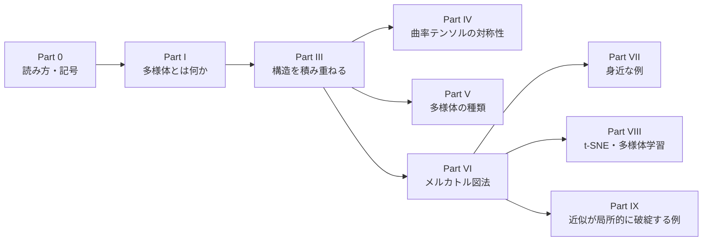

# 多様体入門 ―他のノート全体の「舞台」を整理する―

<a id="toc"></a>

## 目次

<!-- toc:start -->

- [Part 0：はじめに ― 読み方・前提・記号](#p0)
  - [1. このノートについて](#p0-1)
  - [2. 前提知識](#p0-2)
  - [3. ノートの構成](#p0-3)
  - [4. 記号の約束](#p0-4)
- [Part I：多様体とは何か](#p1)
  - [1. 直感：「局所的にはℝ^n、全体では違うかもしれない空間」](#p1-1)
  - [2. 正式な定義](#p1-2)
  - [3. チャートの重なり（座標変換）となぜC^∞が必要か（復習）](#p1-3)
- [Part III：多様体に構造を積み重ねる](#p3)
  - [1. 簡易復習：計量テンソル g\_ij](#p3-1)
  - [2. 簡易復習：体積要素 √|g|](#p3-2)
  - [3. 簡易復習：クリストッフェル記号 Γ^k\_ij](#p3-3)
  - [4. 簡易復習：リーマン曲率テンソル](#p3-4)
- [Part IV：リーマン曲率テンソルの対称性と、独立成分の数](#p4)
  - [1. 最後の2添字についての反対称性](#p4-1)
  - [2. 最初の2添字についての反対称性](#p4-2)
  - [3. 2次元では、この2つの反対称性だけで、独立成分が1個に決まる](#p4-3)
  - [4. 3次元以上ではどうなるか](#p4-4)
  - [5. Part IV のまとめ](#p4-5)
- [Part V：多様体の種類](#p5)
- [Part VI：メルカトル図法 ―計量テンソルの最も身近な実例](#p6)
  - [1. 設定：球面の計量（復習）](#p6-1)
  - [2. メルカトル図法の定義](#p6-2)
  - [3. なぜ高緯度ほど引き伸ばされるのか（実際に計算する）](#p6-3)
  - [4. 座標特異点との接続](#p6-4)
  - [5. ガウスの驚異の定理（Theorema Egregium）](#p6-5)
  - [6. 他の地図投影法との比較](#p6-6)
- [Part VII：他の身近な例](#p7)
- [Part VIII：t-SNE・多様体学習との異同](#p8)
  - [1. 似ている部分](#p8-1)
  - [2. 根本的に違う部分](#p8-2)
  - [3. 「多様体学習」という接点](#p8-3)
- [Part IX：「マクロでは成り立つ近似」が局所的に破綻する例](#p9)
  - [1. 座標特異点 vs 真の特異点](#p9-1)
  - [2. ニュートン力学から一般相対論への移行](#p9-2)
  - [3. GPSの重力遅延（教訓として）](#p9-3)
- [まとめ：全体の位置づけ](#summary)

<!-- toc:end -->

---

<a id="p0"></a>

# Part 0：はじめに ― 読み方・前提・記号

<!-- part-toc:start -->

**この Part の内容**

- [1. このノートについて](#p0-1)
- [2. 前提知識](#p0-2)
- [3. ノートの構成](#p0-3)
- [4. 記号の約束](#p0-4)

<!-- part-toc:end -->

<a id="p0-1"></a>

## 1. このノートについて

計量テンソル、クリストッフェル記号、曲率、微分形式、リー群といったノートは、どれも**多様体**という共通の「舞台」の上の話です。このノートでは、その舞台そのものを正面から扱います。

- 多様体の定義と、その上に積み重ねる構造（接空間、計量、接続、曲率）
- リーマン曲率テンソルの対称性と、独立な成分の数
- 多様体の種類（リーマン、擬リーマン、複素、シンプレクティック、リー群）と、それぞれを詳しく扱うノートへの案内
- 身近な例：地図投影法（メルカトル図法）、GPS、画像処理、機械学習の多様体学習

<a id="p0-2"></a>

## 2. 前提知識

- **写像と微分**：全単射、逆写像、ヤコビ行列、逆関数定理を使います。[関数・線形写像・微分・積分のノート](../01_基礎・ベクトル解析/functions_linear_maps_derivatives_integrals.md)の範囲です。
- **計量とクリストッフェル記号**：[クリストッフェル記号のノート](../02_微分幾何/christoffel_riemann_intro.md)の Part I〜VII（共変微分と曲率まで）を前提にしています。復習は Part III で簡単に行います。

<a id="p0-3"></a>

## 3. ノートの構成



Part I で多様体を定義し、Part III で、その上に接空間・計量・接続・曲率を積み重ねます。Part IV は曲率テンソルの対称性、Part V は多様体の種類の一覧です。Part VI〜IX は、地図投影法を中心とした身近な例です。

<a id="p0-4"></a>

## 4. 記号の約束

- 多様体を $M$、その次元を $n$、局所座標を $q^i$（$i=1,\dots,n$）と書きます。同じ添字が上下に現れたら和を取ります。
- 計量 $g_{ij}$、クリストッフェル記号 $\Gamma^k{}_{ij}$、リーマン曲率テンソル $R^l{}_{kij}$ の記号は、[クリストッフェル記号のノート](../02_微分幾何/christoffel_riemann_intro.md)と同じです。
- **参照の書き方**：「Part IV §2」は、Part IV の2番目の節です。節の番号は、Part ごとに 1 から振っています。

---

<a id="p1"></a>

# Part I：多様体とは何か

<!-- part-toc:start -->

**この Part の内容**

- [1. 直感：「局所的にはℝ^n、全体では違うかもしれない空間」](#p1-1)
- [2. 正式な定義](#p1-2)
- [3. チャートの重なり（座標変換）となぜC^∞が必要か（復習）](#p1-3)

<!-- part-toc:end -->

<a id="p1-1"></a>

## 1. 直感：「局所的には$\mathbb R^n$、全体では違うかもしれない空間」

一番身近な例は**地球の表面**です。地球儀を1枚の平らな紙に、歪みなく広げることはできません（全体は球面）。しかし、**どんなに小さい地域の地図なら、普通の平面地図として問題なく描けます**。この「小さい範囲なら平面のように扱える」という性質が、多様体の本質です。

<a id="p1-2"></a>

## 2. 正式な定義

$$
\boxed{
\begin{aligned}
&\text{多様体}M\text{とは：}M\text{の各点}p\text{の周りに、}\mathbb R^n\text{の開集合と1対1に対応する「座標」}(q^1,\dots,q^n)\text{が取れる空間}
\end{aligned}
}
$$

この対応（局所座標）を**チャート**、チャート全体の集まりを**アトラス**と呼びます。他のノートで使う極座標$(r,\theta)$や球座標$(r,\theta,\phi)$は、まさに「地球の"地図"の描き方」の一例、つまりチャートそのものです。

<a id="p1-3"></a>

## 3. チャートの重なり（座標変換）となぜ$C^\infty$が必要か（復習）

地図帳の隣り合うページが重なる境目では、2つの地図（座標系）が矛盾なく繋がっていなければなりません。$q^i\to\tilde q^i$という座標変換が**滑らか（$C^\infty$）に**繋がっていることを要求すると、これが**微分可能多様体**の定義になります。

**簡易復習（[関数・線形写像・微分・積分のノート](../01_基礎・ベクトル解析/functions_linear_maps_derivatives_integrals.md)の Part III §1）**：微分可能性には階層があり、$C^0$（連続）$\supseteq$微分可能$\supseteq C^1\supseteq\cdots\supseteq C^\infty$（滑らか）という順で条件が強くなります。「開集合$\Omega$」が必要なのは、微分の定義（$f(x+h)-f(x)=Df_x(h)+o(\|h\|)$）が、あらゆる方向から$h\to0$を取れることを前提にしているためでした。多様体のチャートも、この「全方向に動ける」開集合の上に定義されています。

---

<a id="p3"></a>

# Part III：多様体に構造を積み重ねる

<!-- part-toc:start -->

**この Part の内容**

- [1. 簡易復習：計量テンソル g\_ij](#p3-1)
- [2. 簡易復習：体積要素 √|g|](#p3-2)
- [3. 簡易復習：クリストッフェル記号 Γ^k\_ij](#p3-3)
- [4. 簡易復習：リーマン曲率テンソル](#p3-4)

<!-- part-toc:end -->

多様体そのものは、ただの"舞台"（点の集まり）にすぎません。他のノートは、すべて「その舞台の上に、何を追加で載せるか」という話です。

$$
\boxed{
\begin{aligned}
&\text{①多様体}M\text{（ただの舞台、座標}q^i\text{が張れるだけ）}\\
&\text{②}+\text{接空間}T_pM\text{（各点での"方向"の集まり、基底}\mathbf e_i=\partial/\partial q^i\text{）}\\
&\text{③}+\text{余接空間}T_p^*M\text{（}T_pM\text{の双対、基底}dq^i\text{、微分形式の住処）}\\
&\text{④}+\text{計量}g\text{（}T_pM\text{に内積を入れる）}\to\flat,\sharp\text{（音楽同型）が定義できる}\\
&\text{⑤}+\text{接続}\Gamma\text{（共変微分を定義する道具）}\\
&\text{⑥}+\text{曲率}R\text{（接続からもう一段導かれる量）}
\end{aligned}
}
$$

<a id="p3-1"></a>

## 1. 簡易復習：計量テンソル $g_{ij}$

$$
\boxed{g_{ij} := \mathbf e_i\cdot\mathbf e_j}
$$

基底ベクトル同士の内積の表。デカルト座標の基底$\mathbf e_a$を使うと$g_{ij}=\delta_{ab}J^a{}_iJ^b{}_j$（$J^a{}_i=\partial x^a/\partial q^i$：ヤコビアン）。行列で言えば$g=J^TJ$です。

<a id="p3-2"></a>

## 2. 簡易復習：体積要素 $\sqrt{|g|}$

$g=J^TJ$の行列式を取ると $\det g=(\det J)^2$ なので $\sqrt{|g|}=|\det J|$。これは座標変換による**体積要素の伸縮率**です（球座標なら$\sqrt{|g|}=r^2\sin\theta$。関数のノートの Part V §5 の変数変換の公式の $|\det J|$ です）。

<a id="p3-3"></a>

## 3. 簡易復習：クリストッフェル記号 $\Gamma^k{}_{ij}$

$$
\boxed{\Gamma^k{}_{ij} = \frac12g^{kl}\big(\partial_ig_{jl}+\partial_jg_{il}-\partial_lg_{ij}\big)}
$$

基底ベクトルの変化率 $\dfrac{\partial\mathbf e_i}{\partial q^j}=\Gamma^k{}_{ij}\mathbf e_k$ を、計量の微分から逆算した式です（[クリストッフェル記号のノート](../02_微分幾何/christoffel_riemann_intro.md#p2)の Part II で、3本の式を組み合わせて導出）。

<a id="p3-4"></a>

## 4. 簡易復習：リーマン曲率テンソル

$$
\boxed{R^l{}_{kij} = \partial_i\Gamma^l{}_{jk}-\partial_j\Gamma^l{}_{ik}+\Gamma^l{}_{im}\Gamma^m{}_{jk}-\Gamma^l{}_{jm}\Gamma^m{}_{ik}}
$$

共変微分の非可換性 $(\nabla_i\nabla_j-\nabla_j\nabla_i)V^l=R^l{}_{kij}V^k$ として定義される量。球面（半径$a$）なら、成分を計算するとガウス曲率$K=1/a^2$が得られます（[クリストッフェル記号のノート](../02_微分幾何/christoffel_riemann_intro.md#p8)の Part VIII）。

---

<a id="p4"></a>

# Part IV：リーマン曲率テンソルの対称性と、独立成分の数

<!-- part-toc:start -->

**この Part の内容**

- [1. 最後の2添字についての反対称性](#p4-1)
- [2. 最初の2添字についての反対称性](#p4-2)
- [3. 2次元では、この2つの反対称性だけで、独立成分が1個に決まる](#p4-3)
- [4. 3次元以上ではどうなるか](#p4-4)
- [5. Part IV のまとめ](#p4-5)

<!-- part-toc:end -->

クリストッフェル記号のノートやリッチテンソルのノートでは、「2次元では独立成分が1つしかない」ことを繰り返し使います。この Part では、リーマン曲率テンソルの対称性を導き、次元ごとに何個の独立成分があるのかを数えます。

<a id="p4-1"></a>

## 1. 最後の2添字についての反対称性

曲率の定義 $(\nabla_i\nabla_j-\nabla_j\nabla_i)V^l=R^l{}_{kij}V^k$ で $i\leftrightarrow j$ を入れ替えると、左辺の符号が反転するので：

$$
R^l{}_{kij} = -R^l{}_{kji}
$$

です（公式で見ても、$i\leftrightarrow j$ で全項の符号が反転します）。

<a id="p4-2"></a>

## 2. 最初の2添字についての反対称性

$\nabla_ig_{jk}=0$（[クリストッフェル記号のノート](../02_微分幾何/christoffel_riemann_intro.md#p4-5b)の Part IV §5-b）を使います。

**準備：共変ベクトルの交換公式を導出する。** ベクトル$V^l$の公式$(\nabla_i\nabla_j-\nabla_j\nabla_i)V^l=R^l{}_{kij}V^k$と、任意の共変ベクトル$\omega_k$から、$\omega_kV^k$（スカラー）を作ります。スカラーの交換子は必ずゼロなので：

$$
0 = (\nabla_i\nabla_j-\nabla_j\nabla_i)(\omega_kV^k) = \big[(\nabla_i\nabla_j-\nabla_j\nabla_i)\omega_k\big]V^k+\omega_k\big[R^k{}_{mij}V^m\big]
$$

$V^k$は任意なので、係数を比較すると（クリストッフェル記号のノートの Part IV §2 で、共変ベクトルの共変微分の符号を決めたのと同じ手法）：

$$
\boxed{(\nabla_i\nabla_j-\nabla_j\nabla_i)\omega_k = -R^m{}_{kij}\,\omega_m}
$$

**次に、$\nabla g=0$を使い、添字を下げる操作が共変微分と交換することを示します。** $\nabla_i(g_{lm}V^l)=(\nabla_ig_{lm})V^l+g_{lm}\nabla_iV^l=g_{lm}\nabla_iV^l$（$\nabla g=0$なので第1項が消える）。つまり「$g$を掛けて添字を下げる」操作は、$\nabla_i$を素通りします。2回微分の交換子でも同様なので：

$$
g_{lm}(\nabla_i\nabla_j-\nabla_j\nabla_i)V^l = (\nabla_i\nabla_j-\nabla_j\nabla_i)(g_{lm}V^l) = (\nabla_i\nabla_j-\nabla_j\nabla_i)V_m
$$

左辺に元の公式を代入すると：

$$
g_{lm}R^l{}_{kij}V^k = R_{mkij}V^k\qquad(R_{mkij}:=g_{lm}R^l{}_{kij})
$$

一方、$V_m$（$V^l$を下げたもの）自体が任意の共変ベクトルなので、上の共変ベクトルの公式が使えます：

$$
(\nabla_i\nabla_j-\nabla_j\nabla_i)V_m = -R_{kmij}V^k
$$

**2つの式は同じ左辺を持つので、右辺同士を比較します**：

$$
R_{mkij}V^k = -R_{kmij}V^k
$$

$V^k$は任意なので：

$$
\boxed{R_{mkij} = -R_{kmij}}\qquad\text{（最初の2添字についても反対称）}
$$

<a id="p4-3"></a>

## 3. 2次元では、この2つの反対称性だけで、独立成分が1個に決まる

$n$次元で、反対称な添字の組 $(i,j)$ の独立な取り方は、$i<j$ となる組の数 $\binom n2$ 個です（$i=j$ の成分はゼロ、$(j,i)$ は $(i,j)$ の符号違い）。$n=2$なら$\binom22=1$——**つまり、添字の組$(i,j)$（あるいは$(l,k)$）が取りうる「独立な向き」は、たった1種類しかありません。**

$R_{lkij}$は、$(l,k)$という反対称なペアと、$(i,j)$という反対称なペアの、**2つの組み合わせ**で決まる量です。$n=2$では、**どちらのペアも「独立な向きが1種類しかない」**ので、$R_{lkij}$全体も、その1種類の組み合わせに対応する値、ただ1つで完全に決まります：

$$
\boxed{n=2\text{では、}\binom22\times\binom22=1\times1=1\text{個の独立成分（}R_{1212}\text{）}}
$$

<a id="p4-4"></a>

## 4. 3次元以上ではどうなるか

$n=3$なら$\binom32=3$（3種類の"面"の向きがある）ので、$(l,k)$のペア3通り×$(i,j)$のペア3通り＝最大$9$個、対称性を考慮しても、一般に複数の独立成分が残ります。**ここから先は、$(l,k)$と$(i,j)$のペア全体の"入れ替え対称性"と、第一ビアンキ恒等式が必要になります。** それらを認めた上での結果だけ述べると：

$$
\boxed{
\begin{array}{c|c}
n & \text{独立成分の数} \\
\hline
2 & 1 \\
3 & 6 \\
4 & 20 \\
\end{array}
}
$$

（一般公式：$\dfrac{n^2(n^2-1)}{12}$。$n=2$なら$\dfrac{4\times3}{12}=1$、$n=3$なら$\dfrac{9\times8}{12}=6$、$n=4$なら$\dfrac{16\times15}{12}=20$——ちょうど、4次元時空（一般相対論）のリーマン曲率テンソルが20個の独立成分を持つ、というよく知られた数字とも一致します。）

<a id="p4-5"></a>

## 5. Part IV のまとめ

$$
\boxed{
\begin{aligned}
&R^l{}_{kij}=-R^l{}_{kji}\text{（定義から）}+\nabla g=0\ \to\ R_{mkij}=-R_{kmij}\text{（§2）}\\
&n=2\text{では}\binom n2=1\text{なので、この2つの反対称性だけで、独立成分が}1\text{個に決まる}\\
&n\ge3\text{では}\binom n2>1\text{なので、一般に複数残る（正確な個数には、ペア入れ替え対称性とビアンキ恒等式が必要）}
\end{aligned}
}
$$

---

<a id="p5"></a>

# Part V：多様体の種類

$$
\boxed{
\begin{array}{ll}
\text{位相多様体} & \text{連続性だけの、一番弱い多様体（微分ができない）}\\
\text{微分可能多様体（}C^\infty\text{）} & \text{座標変換が滑らか。微積分ができる、他のノートの土台}\\
\text{リーマン多様体} & \text{微分可能多様体}+\text{正定値計量}g\text{。長さ・角度・}\flat,\sharp\text{が定義できる（クリストッフェル記号のノートなどの舞台）}\\
\text{擬リーマン多様体} & \text{計量}g\text{が不定値（}\eta=\operatorname{diag}(-1,1,1,1)\text{など）。時空、一般相対論の舞台}\\
\text{複素多様体} & \text{チャートが}\mathbb C^n\text{に写り、座標変換が正則関数}\\
\text{ケーラー多様体} & \text{複素多様体}+\text{リーマン計量}+\text{両立するシンプレクティック構造}\\
\text{シンプレクティック多様体} & \text{微分可能多様体}+\text{非退化な閉2-形式}\omega\text{（}d\omega=0\text{）。解析力学の相空間}\\
\text{リー群} & \text{多様体}+\text{群構造が滑らかに両立。}SU(2)\cong S^3\text{がまさにこれ}
\end{array}
}
$$

他のノートは、すべて**この表のどこかに位置づく**、異なる舞台設定です（[計量テンソルのノート](../02_微分幾何/計量テンソルと共変反変_まとめ.md)や[クリストッフェル記号のノート](../02_微分幾何/christoffel_riemann_intro.md)→リーマン多様体、[ユニタリ行列のノート](../04_群論・代数/unitary_matrix_full_decomposition.md)→リー群、[複素数の幾何学のノート](../04_群論・代数/complex_numbers_geometry.md)と[複素多様体のノート](complex_manifolds_twistor_theory.md)→複素多様体、クリストッフェル記号のノートの付録C→擬リーマン多様体、という具合です）。

---

<a id="p6"></a>

# Part VI：メルカトル図法 ―計量テンソルの最も身近な実例

<!-- part-toc:start -->

**この Part の内容**

- [1. 設定：球面の計量（復習）](#p6-1)
- [2. メルカトル図法の定義](#p6-2)
- [3. なぜ高緯度ほど引き伸ばされるのか（実際に計算する）](#p6-3)
- [4. 座標特異点との接続](#p6-4)
- [5. ガウスの驚異の定理（Theorema Egregium）](#p6-5)
- [6. 他の地図投影法との比較](#p6-6)

<!-- part-toc:end -->

<a id="p6-1"></a>

## 1. 設定：球面の計量（復習）

半径$a$の球面（[クリストッフェル記号のノート](../02_微分幾何/christoffel_riemann_intro.md#p8)の Part VIII と同じ設定）：

$$
g_{\theta\theta}=a^2,\qquad g_{\phi\phi}=a^2\sin^2\theta,\qquad g_{\theta\phi}=0
$$

（$\theta$：北極からの角度、$\phi$：経度）

<a id="p6-2"></a>

## 2. メルカトル図法の定義

緯度・経度を、平面座標$(X,Y)$に変換します：

$$
X=\phi,\qquad Y=-\ln\tan(\theta/2)
$$

（$Y$ の形は、**地図が角度を保つ**（各点で、東西方向と南北方向の伸び率が等しい）という要請から決まります。$X=\phi$ なら、東西方向の伸び率は §3 のとおり $1/(a\sin\theta)$ です。南北方向に $d\theta$ 動くと、実際の距離は $a\,d\theta$、地図上の距離は $|dY|$ なので、伸び率は $|dY/d\theta|/a$ です。2つを等しくすると $dY/d\theta=-1/\sin\theta$（北が上になるように符号を選ぶ）で、積分すると $Y=-\ln\tan(\theta/2)$ です。$X=\phi$、$Y=f(\theta)$ の形の地図では、経線と緯線は $f$ によらず必ず直角に交わるので、直角に交わることだけでは $Y$ は決まりません。）

<a id="p6-3"></a>

## 3. なぜ高緯度ほど引き伸ばされるのか（実際に計算する）

$g_{\phi\phi}=a^2\sin^2\theta$は、経度方向に$\Delta\phi$動いたときの**実際の距離の2乗**を表します：

$$
\text{実際の距離} = a\sin\theta\cdot\Delta\phi
$$

一方、地図上では$X=\phi$とそのまま置くので、**地図上の距離はどの緯度でも$\Delta X=\Delta\phi$のまま**です。比を取ると：

$$
\boxed{\frac{\text{地図上の距離}}{\text{実際の距離}} = \frac1{a\sin\theta}}
$$

$\theta\to0$（北極に近づく）ほど、この比は**発散**します。**これが「メルカトル図法は高緯度ほど東西に引き伸ばされる」現象の正体**です（グリーンランドが実際より大きく見えるのはこのため）。

<a id="p6-4"></a>

## 4. 座標特異点との接続

$\theta=0,\pi$（極）で$\sqrt{|g|}=a^2\sin\theta\to0$になるのは、[球座標のノート](../02_微分幾何/球座標の計量テンソル計算例.md)で扱った**座標特異点**と同じ現象です。メルカトル図法で北極・南極そのものが地図に描けず、無限遠まで引き伸ばされてしまうのは、この特異点が「地図の描き方」の問題として表面化したものです。

<a id="p6-5"></a>

## 5. ガウスの驚異の定理（Theorema Egregium）

**「球面という曲がった空間の情報を、平面という別の空間に、完全に歪みなく写すことはできない」**——これがガウスの定理の直感的な内容です。クリストッフェル記号のノートで計算した**ガウス曲率$K=1/a^2$**（ゼロでない値）が、まさに「歪みなく写せるかどうか」を判定する量です。曲率がゼロでない空間は、どんな座標変換を使っても平面のように真っ直ぐには描けない、ということが、この1つの数値で保証されています。

<a id="p6-6"></a>

## 6. 他の地図投影法との比較

- **正距方位図法**：ある1点からの距離だけは正しく保つ
- **正積図法**（モルワイデ図法など）：面積比だけは正しく保つ
- **正角図法**（メルカトル図法もこれ）：角度（形）だけは正しく保つ

**「距離・面積・角度のすべてを同時に正しく保つ地図は存在しない」**というのも、ガウス曲率がゼロでないことの帰結です。

---

<a id="p7"></a>

# Part VII：他の身近な例

**1. カーナビ・GPS航法**：地球を回転楕円体（WGS84測地系）として扱い、計量テンソルに相当する補正を常時計算しています。平面近似で長距離を計算すると誤差が蓄積します。

**2. パノラマ写真のスティッチング**：広角・360度パノラマは、複数の平面画像を球面（あるいは円柱面）に貼り付けます。継ぎ目の歪み・伸びは、平面から曲面への座標変換で計量が変わることが原因です。

**3. CT・MRIの画像再構成**：X線の減衰データ（ラドン変換）から画像を再構成する際、検出器の幾何学的配置（扇状ビーム、円錐ビームなど）に応じた**ヤコビアンによる重み補正**が必須です。補正を誤ると、画像の中心部と周辺部で濃度・シャープさが歪みます。

**4. GPS衛星の一般相対論補正**：GPS衛星は地球より弱い重力場（高度2万km）にあるため、地上より時間の進み方が速くなります（重力による時間の遅れ）。この補正をしないと、GPSは1日あたり数kmの誤差を生みます。**計量テンソル$g_{00}$の重力場による変化**を、実際に補正計算に組み込んでいる、身近な技術に潜む相対論の例です。

---

<a id="p8"></a>

# Part VIII：t-SNE・多様体学習との異同

<!-- part-toc:start -->

**この Part の内容**

- [1. 似ている部分](#p8-1)
- [2. 根本的に違う部分](#p8-2)
- [3. 「多様体学習」という接点](#p8-3)

<!-- part-toc:end -->

<a id="p8-1"></a>

## 1. 似ている部分

t-SNEも「高次元の情報を、低次元（通常2次元）に落とし込む」という点で、地図投影法と発想は同じです。高次元空間での点同士の距離関係（確率分布）を、できるだけ保ったまま低次元に埋め込もうとします。

<a id="p8-2"></a>

## 2. 根本的に違う部分

$$
\boxed{
\begin{aligned}
&\text{メルカトル図法：計量}g_{ij}\text{が既知}\to\text{解析的な座標変換の公式}\\
&\text{t-SNE：真の計量は未知（あるいは存在しない）}\to\text{確率分布の近さを目的関数として、数値的に最適化}
\end{aligned}
}
$$

地図投影法は「元の空間の計量が、数式としてあらかじめ厳密に分かっている」前提で解析的に座標変換を構成しますが、t-SNEは「元の高次元空間の"真の計量"は分からない」状態で、確率的・反復最適化によって答えを探します。

<a id="p8-3"></a>

## 3. 「多様体学習」という接点

**多様体学習（manifold learning）**という機械学習の一分野（t-SNE、UMAP、Isomapなど）は、「高次元データが、実は低次元の多様体上に分布しているはず」という仮定のもとで、その多様体の構造をデータから推定しようとします。この意味では、**「多様体」という言葉そのものが、地図投影法と機械学習の両方に共通する、同じ数学的概念**を指しています。特にIsomapは、データ点間の**測地線距離**を近似的に計算する、地図投影法により近いアプローチです。t-SNEが直接扱うのは確率分布同士のKLダイバージェンスであり、計量そのものではありません。

---

<a id="p9"></a>

# Part IX：「マクロでは成り立つ近似」が局所的に破綻する例

<!-- part-toc:start -->

**この Part の内容**

- [1. 座標特異点 vs 真の特異点](#p9-1)
- [2. ニュートン力学から一般相対論への移行](#p9-2)
- [3. GPSの重力遅延（教訓として）](#p9-3)

<!-- part-toc:end -->

<a id="p9-1"></a>

## 1. 座標特異点 vs 真の特異点

Part VI §4 の「球座標の極で$\sqrt{|g|}\to0$」という現象は、**座標の選び方が悪いだけの見かけの破綻（座標特異点）**でした。一方、シュワルツシルト時空の$r=0$（ブラックホールの中心）のような**真の特異点**は、どんな座標を選んでも曲率テンソル自体が発散します。

$$
\boxed{
\begin{aligned}
&\text{座標特異点：別の座標を選べば消える（例：球座標の極、メルカトル図法の極）}\\
&\text{真の特異点：どんな座標を選んでも残る（例：ブラックホールの中心、曲率テンソルが発散）}
\end{aligned}
}
$$

<a id="p9-2"></a>

## 2. ニュートン力学から一般相対論への移行

ニュートン力学は、太陽系レベルの重力場では十分な精度で惑星の軌道を予言できます。しかし、ブラックホール近傍のような極端に強い重力場では、ニュートン力学の枠組みそのものが破綻し、一般相対論（曲がった時空、測地線方程式）に置き換える必要があります。**「遠くではうまくいくから、近くでも大丈夫だろう」という外挿が、局所的に破綻する典型例**です。

<a id="p9-3"></a>

## 3. GPSの重力遅延（教訓として）

Part VII の4番目の例で触れた重力遅延は、日常的なスケールでは無視できるほど小さい効果ですが、無視すると誤差が蓄積します。「マクロでは十分成り立つはずの近似が、精度を上げると局所的に破綻する」という教訓の、身近で具体的な実例です。

---

<a id="summary"></a>

# まとめ：全体の位置づけ

```
多様体 M（ただの舞台、チャート q^i が張れるだけ）
        │
        ├─ + 計量 g → リーマン多様体（計量テンソル・クリストッフェル記号のノート）
        │        │
        │        ├─ メルカトル図法：g_φφ=a²sin²θ から、高緯度の引き伸ばしを実際に導出
        │        └─ ガウス曲率 K=1/a²（ゼロでない）→ 歪みなく平面化できない理由
        │
        ├─ 不定値計量 → 擬リーマン多様体（クリストッフェル記号のノートの付録C、一般相対論）
        ├─ 複素チャート → 複素多様体（複素数の幾何学、複素多様体のノート）
        ├─ 群構造 → リー群（パウリ行列・ユニタリ行列のノート）
        │
        └─ 身近な応用：GPS航法、パノラマ画像、CT/MRI再構成、GPS相対論補正
                │
                └─ t-SNE・多様体学習：計量が既知か未知かという点で、地図投影法とは性格が異なる

「マクロで成立する近似」が局所的に破綻する例：
   座標特異点（見かけの破綻）vs 真の特異点（本質的な破綻）
   ニュートン力学 → 一般相対論（強い重力場での破綻）
```

**他のノートは、すべて「多様体」という1つの土台の上に、少しずつ異なる追加構造（計量、接続、複素構造、群構造）を載せた、異なる舞台設定です。** メルカトル図法という身近な地図は、計量テンソル・座標特異点・ガウス曲率という、他のノートで抽象的に扱う概念すべての、具体的な実例になっています。
