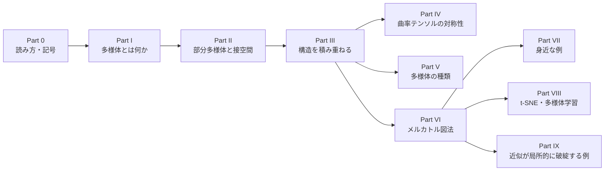
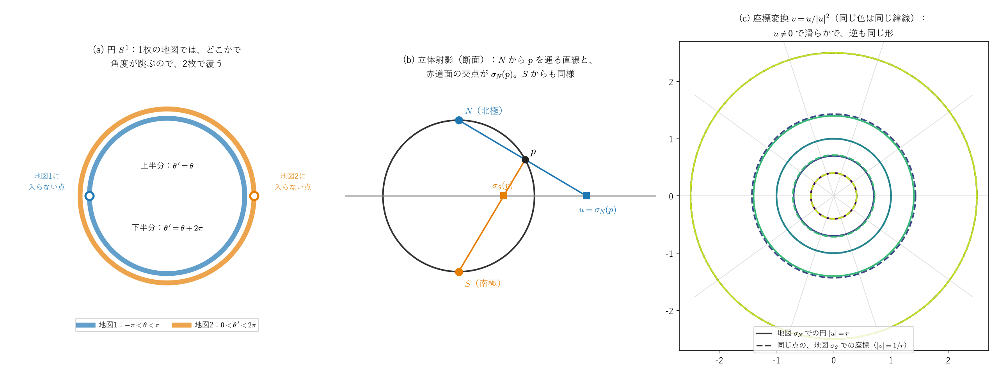
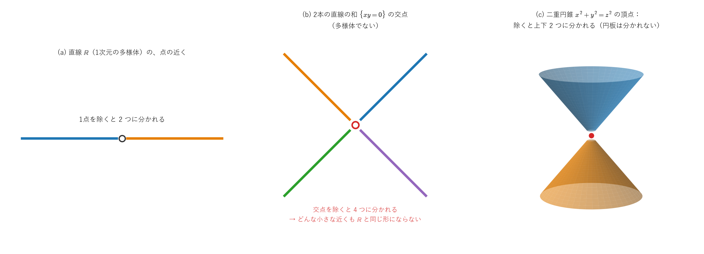
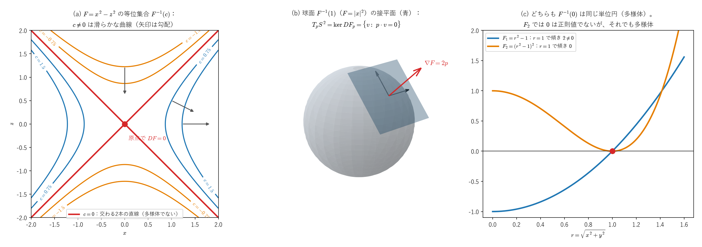

# 多様体入門 ―他のノート全体の「舞台」を整理する―

<a id="toc"></a>

## 目次

<!-- toc:start -->

- [Part 0：はじめに ― 読み方・前提・記号](#p0)
  - [1. このノートについて](#p0-1)
  - [2. 前提知識](#p0-2)
  - [3. ノートの構成](#p0-3)
  - [4. 記号の約束](#p0-4)
- [Part I：多様体とは何か](#p1)
  - [1. 直感：「局所的にはℝ^n、全体では違うかもしれない空間」](#p1-1)
  - [2. 正式な定義：チャートとアトラス](#p1-2)
  - [3. 座標変換と、滑らかな構造](#p1-3)
  - [4. 例1：円 S^1 には、地図が2枚必要](#p1-4)
  - [5. 例2：球面と立体射影](#p1-5)
  - [6. 例3：トーラスと、そのほかの例](#p1-6)
  - [7. 多様体でない例](#p1-7)
  - [8. 多様体の間の滑らかな写像と、微分同相](#p1-8)
- [Part II：部分多様体と接空間](#p2)
  - [1. 部分多様体：「平らにできる」部分集合](#p2-1)
  - [2. 陰関数定理](#p2-2)
  - [3. 正則値定理：方程式の解の集まりが多様体になる条件](#p2-3)
  - [4. 例と反例](#p2-4)
  - [5. 接空間](#p2-5)
  - [6. 写像の微分（押し出し）と、余接空間](#p2-6)
- [Part III：多様体に構造を積み重ねる](#p3)
  - [1. 簡易復習：計量テンソル g\_ij](#p3-1)
  - [2. 簡易復習：体積要素 √|g|](#p3-2)
  - [3. 簡易復習：クリストッフェル記号 Γ^k\_ij](#p3-3)
  - [4. 簡易復習：リーマン曲率テンソル](#p3-4)
- [Part IV：リーマン曲率テンソルの対称性と、独立成分の数](#p4)
  - [1. 最後の2添字についての反対称性](#p4-1)
  - [2. 最初の2添字についての反対称性](#p4-2)
  - [3. 第一ビアンキ恒等式](#p4-3)
  - [4. ペア交換対称性](#p4-4)
  - [5. 独立成分の数：n^2(n^2-1)/12](#p4-5)
  - [6. 次元ごとの意味](#p4-6)
  - [7. Part IV のまとめ](#p4-7)
- [Part V：多様体の種類](#p5)
- [Part VI：メルカトル図法 ―計量テンソルの最も身近な実例](#p6)
  - [1. 設定：球面の計量（復習）](#p6-1)
  - [2. メルカトル図法の定義](#p6-2)
  - [3. なぜ高緯度ほど引き伸ばされるのか（実際に計算する）](#p6-3)
  - [4. 座標特異点との接続](#p6-4)
  - [5. ガウスの驚異の定理（Theorema Egregium）](#p6-5)
  - [6. 他の地図投影法との比較](#p6-6)
- [Part VII：他の身近な例](#p7)
- [Part VIII：t-SNE・多様体学習との異同](#p8)
  - [1. 似ている部分](#p8-1)
  - [2. 根本的に違う部分](#p8-2)
  - [3. 「多様体学習」という接点](#p8-3)
- [Part IX：「マクロでは成り立つ近似」が局所的に破綻する例](#p9)
  - [1. 座標特異点 vs 真の特異点](#p9-1)
  - [2. ニュートン力学から一般相対論への移行](#p9-2)
  - [3. GPSの重力遅延（教訓として）](#p9-3)
- [まとめ：全体の位置づけ](#summary)

<!-- toc:end -->

---

<a id="p0"></a>

# Part 0：はじめに ― 読み方・前提・記号

<!-- part-toc:start -->

**この Part の内容**

- [1. このノートについて](#p0-1)
- [2. 前提知識](#p0-2)
- [3. ノートの構成](#p0-3)
- [4. 記号の約束](#p0-4)

<!-- part-toc:end -->

<a id="p0-1"></a>

## 1. このノートについて

計量テンソル、クリストッフェル記号、曲率、微分形式、リー群といったノートは、どれも**多様体**という共通の「舞台」の上の話です。このノートでは、その舞台そのものを正面から扱います。

- 多様体の定義と、その上に積み重ねる構造（接空間、計量、接続、曲率）
- リーマン曲率テンソルの対称性と、独立な成分の数
- 多様体の種類（リーマン、擬リーマン、複素、シンプレクティック、リー群）と、それぞれを詳しく扱うノートへの案内
- 身近な例：地図投影法（メルカトル図法）、GPS、画像処理、機械学習の多様体学習

<a id="p0-2"></a>

## 2. 前提知識

- **写像と微分**：全単射、逆写像、ヤコビ行列、逆関数定理を使います。[関数・線形写像・微分・積分のノート](../01_基礎・ベクトル解析/functions_linear_maps_derivatives_integrals.md)の範囲です。
- **計量とクリストッフェル記号**：[クリストッフェル記号のノート](../02_微分幾何/christoffel_riemann_intro.md)の Part I〜VII（共変微分と曲率まで）を前提にしています。復習は Part III で簡単に行います。

<a id="p0-3"></a>

## 3. ノートの構成



Part I で多様体を定義し、Part II で、方程式の解の集まりが多様体になる条件（正則値定理）と、接空間・写像の微分を扱います。Part III で、その上に計量・接続・曲率を積み重ねます。Part IV は曲率テンソルの対称性、Part V は多様体の種類の一覧です。Part VI〜IX は、地図投影法を中心とした身近な例です。

<a id="p0-4"></a>

## 4. 記号の約束

- 多様体を $M$、その次元を $n$、局所座標を $q^i$（$i=1,\dots,n$）と書きます。同じ添字が上下に現れたら和を取ります。
- 計量 $g_{ij}$、クリストッフェル記号 $\Gamma^k{}_{ij}$、リーマン曲率テンソル $R^l{}_{kij}$ の記号は、[クリストッフェル記号のノート](../02_微分幾何/christoffel_riemann_intro.md)と同じです。
- **参照の書き方**：「Part IV §2」は、Part IV の2番目の節です。節の番号は、Part ごとに 1 から振っています。

---

<a id="p1"></a>

# Part I：多様体とは何か

<!-- part-toc:start -->

**この Part の内容**

- [1. 直感：「局所的にはℝ^n、全体では違うかもしれない空間」](#p1-1)
- [2. 正式な定義：チャートとアトラス](#p1-2)
- [3. 座標変換と、滑らかな構造](#p1-3)
- [4. 例1：円 S^1 には、地図が2枚必要](#p1-4)
- [5. 例2：球面と立体射影](#p1-5)
- [6. 例3：トーラスと、そのほかの例](#p1-6)
- [7. 多様体でない例](#p1-7)
- [8. 多様体の間の滑らかな写像と、微分同相](#p1-8)

<!-- part-toc:end -->

<a id="p1-1"></a>

## 1. 直感：「局所的には$\mathbb R^n$、全体では違うかもしれない空間」

一番身近な例は**地球の表面**です。地球儀を1枚の平らな紙に、歪みなく広げることはできません（全体は球面）。しかし、**十分に小さい地域なら、普通の平面地図として問題なく描けます**。この「小さい範囲なら平面のように扱える」という性質が、多様体の本質です。

<a id="p1-2"></a>

## 2. 正式な定義：チャートとアトラス

**チャート（地図）**：多様体 $M$ の開集合 $U$ と、写像 $\varphi:U\to\mathbb R^n$ の組 $(U,\varphi)$ で、次を満たすものを**チャート**と呼びます。

- $\varphi$ は、$U$ から $\mathbb R^n$ の開集合 $\varphi(U)$ への**全単射**である（[関数のノート](../01_基礎・ベクトル解析/functions_linear_maps_derivatives_integrals.md#p1-8)の Part I §8 の「座標とは全単射」）。
- $\varphi$ も、その逆写像 $\varphi^{-1}$ も連続である（このような全単射を**同相写像**と呼びます）。

$\varphi(p)=(q^1,\dots,q^n)$ が、点 $p$ の**局所座標**です。

**アトラス（地図帳）**：$M$ のすべての点が、どれかのチャートの $U$ に入っているとき、チャートの集まりを**アトラス**と呼びます。

**多様体**：このようなアトラスを持つ空間を、**$n$ 次元の（位相）多様体**と呼びます。

$$
\boxed{\text{多様体}=\text{各点の近くが、}\mathbb R^n\text{ の開集合と同相写像で対応する空間}}
$$

他のノートで使う極座標 $(r,\theta)$ や球座標 $(r,\theta,\phi)$ は、まさに「地球の"地図"の描き方」の一例、つまりチャートそのものです。

**補足（技術的な条件）**：「開集合」が意味を持つには、$M$ に「近さ」の構造（位相）が入っている必要があります（[トポロジー入門のノート](topology_introduction.md)）。正式な定義では、さらに2つの条件を課します。

- **ハウスドルフ性**：違う2点は、重ならない近くで分けられる。これを課さないと、「原点が2つある直線」（直線の原点だけを2つに分けたもの）のような、各点の近くは $\mathbb R$ と同じなのに奇妙な空間が、多様体に入ってしまいます。
- **第二可算性**：可算個のチャートで覆える（大きすぎない）。

このノートで扱う例（球面、トーラス、$\mathbb R^n$ の開集合、行列の群など）は、どれもこの2つを満たします。

<a id="p1-3"></a>

## 3. 座標変換と、滑らかな構造

2枚のチャート $(U_\alpha,\varphi_\alpha)$、$(U_\beta,\varphi_\beta)$ が重なる部分 $U_\alpha\cap U_\beta$ では、同じ点に2組の座標があります。その間の対応

$$
\varphi_\beta\circ\varphi_\alpha^{-1}:\ \varphi_\alpha(U_\alpha\cap U_\beta)\ \to\ \varphi_\beta(U_\alpha\cap U_\beta)
$$

を**座標変換**（チャートの貼り合わせ写像）と呼びます。$\mathbb R^n$ の開集合から $\mathbb R^n$ の開集合への全単射で、逆写像は $\varphi_\alpha\circ\varphi_\beta^{-1}$ です（[関数のノート](../01_基礎・ベクトル解析/functions_linear_maps_derivatives_integrals.md#p1-6)の Part I §6 の、合成の逆写像）。

**滑らかな多様体**：すべての座標変換が滑らか（$C^\infty$）なアトラスを持つ多様体を、**滑らかな多様体**（微分可能多様体）と呼びます。他のノートの多様体は、すべてこれです。

**なぜ滑らかさを要求するのか**：多様体の上の関数 $f$ の微分を、チャートを使って「$f\circ\varphi^{-1}$（$\mathbb R^n$ の上の関数）の微分」として定義したいからです。別のチャートでは $f\circ\varphi_\beta^{-1}=(f\circ\varphi_\alpha^{-1})\circ(\varphi_\alpha\circ\varphi_\beta^{-1})$ なので、連鎖律（[関数のノート](../01_基礎・ベクトル解析/functions_linear_maps_derivatives_integrals.md#p3-7)の Part III §7）から、座標変換が滑らかなら、「微分できるかどうか」はチャートの選び方によりません。偏微分の値は、座標変換のヤコビ行列で互いに変換されます。これが、テンソルの成分の変換則の出どころです。

**簡易復習（[関数・線形写像・微分・積分のノート](../01_基礎・ベクトル解析/functions_linear_maps_derivatives_integrals.md)の Part III §1）**：微分可能性には階層があり、$C^0$（連続）$\supseteq$微分可能$\supseteq C^1\supseteq\cdots\supseteq C^\infty$（滑らか）という順で条件が強くなります。「開集合」が必要なのは、微分の定義（$f(x+h)-f(x)=Df_x(h)+o(\|h\|)$）が、あらゆる方向から$h\to0$を取れることを前提にしているためです。チャートの像 $\varphi(U)$ が $\mathbb R^n$ の開集合であることを要求するのは、このためです。

<a id="p1-4"></a>

## 4. 例1：円 $S^1$ には、地図が2枚必要

単位円 $S^1=\{(x,y):x^2+y^2=1\}$ を、角度で表します。

- **地図1**：$(x,y)=(\cos\theta,\sin\theta)$、$-\pi<\theta<\pi$。点 $(-1,0)$ だけが入りません。
- **地図2**：$(x,y)=(\cos\theta',\sin\theta')$、$0<\theta'<2\pi$。点 $(1,0)$ だけが入りません。

2枚で円全体を覆います。重なる部分（$(\pm1,0)$ 以外）での座標変換は、

$$
\theta'=\begin{cases}\theta&(\text{上半分：}0<\theta<\pi)\\\theta+2\pi&(\text{下半分：}-\pi<\theta<0)\end{cases}
$$

で、どちらの部分でも定数を足すだけなので、滑らかです。

**1枚では足りない理由**：1枚の地図で円全体を覆おうとすると、一周して元に戻ったところで、角度が $2\pi$ 跳びます（[関数のノート](../01_基礎・ベクトル解析/functions_linear_maps_derivatives_integrals.md#p1-8)の Part I §8 で、$\operatorname{atan2}$ が負の $x$ 軸で $\pi$ から $-\pi$ に跳んだのと同じです）。より正確には、円は「閉じて有界」（コンパクト）なので、連続な全単射の像も閉じて有界になり、$\mathbb R$ の開集合（端を含まない）にはなれません。



*(a) 円の2枚の地図です。青の地図1は左端の点を、橙の地図2は右端の点を含みません。(b) 球面の立体射影の断面です。北極 $N$ から点 $p$ を通る直線が赤道面と交わる点が $\sigma_N(p)$、南極 $S$ からの直線の交点が $\sigma_S(p)$ です。(c) 2枚の地図の座標変換 $v=u/|u|^2$ です。地図 $\sigma_N$ で半径 $r$ の円（実線）は、地図 $\sigma_S$ では半径 $1/r$ の円（同じ色の破線）になります。*

<a id="p1-5"></a>

## 5. 例2：球面と立体射影

単位球面 $S^2=\{(x,y,z):x^2+y^2+z^2=1\}$ は、**立体射影**の2枚の地図で覆えます。

- **北極からの射影**：北極 $N=(0,0,1)$ と点 $p$ を結ぶ直線が、赤道面 $z=0$ と交わる点を $\sigma_N(p)$ とします。式で書くと
$$
\sigma_N(x,y,z)=\frac{(x,\ y)}{1-z}\qquad(p\ne N)
$$
で、逆写像は、$u=(u_1,u_2)$、$|u|^2=u_1^2+u_2^2$ として
$$
\sigma_N^{-1}(u)=\Big(\frac{2u_1}{|u|^2+1},\ \frac{2u_2}{|u|^2+1},\ \frac{|u|^2-1}{|u|^2+1}\Big)
$$
です（成分の2乗の和が $1$ になり、球面の上にあることが確かめられます）。$\sigma_N$ は、北極以外の球面と、平面 $\mathbb R^2$ 全体との全単射です。
- **南極からの射影**：同じく $\sigma_S(x,y,z)=\dfrac{(x,\ y)}{1+z}$（$p\ne S$）です。

**座標変換**：北極と南極以外の点では、両方の地図が使えます。$\sigma_N$ の座標 $u$ から $\sigma_S$ の座標への変換は、

$$
\boxed{\sigma_S\circ\sigma_N^{-1}(u)=\frac{u}{|u|^2}\qquad(u\ne0)}
$$

です。実際、$\sigma_N^{-1}(u)$ の $z$ 成分を使うと $1+z=\dfrac{2|u|^2}{|u|^2+1}$ なので、$\sigma_S$ の分子 $\dfrac{2u}{|u|^2+1}$ を割ると $u/|u|^2$ になります。これは $u\ne0$ で滑らかで、ヤコビ行列式は $-1/|u|^4\ne0$ です（SymPy で確認しています）。したがって、立体射影の2枚の地図は、球面を滑らかな多様体にします。

**球座標との比較**：球座標 $(\theta,\phi)$ の地図は、北極・南極を通る経線（$\phi=0$ の半円）を除いた部分しか覆いません。極では $\phi$ が決まらない（単射でない）からです。クリストッフェル記号のノートで「極は座標特異点」と呼んだのは、**極が、この地図の外にある**ということです。立体射影の地図 $\sigma_N$ では、南極も、地図の中の普通の点（$u=0$）です。

<a id="p1-6"></a>

## 6. 例3：トーラスと、そのほかの例

- **$\mathbb R^n$ の開集合**：1枚の地図（恒等写像）で覆えます。
- **滑らかな関数のグラフ**：$z=f(x,y)$ のグラフは、$(x,y,f(x,y))\mapsto(x,y)$ という1枚の地図で覆えます。
- **トーラス** $T^2$：2つの角度 $(\theta,\phi)$ で表します（[クリストッフェル記号のノート](../02_微分幾何/christoffel_riemann_intro.md#B-2)の付録B-2）。円の地図（§4）を2枚ずつ組み合わせた4枚で覆えます。一般に、多様体 $M,N$ の**直積** $M\times N$ は、チャートを組み合わせて多様体になります（$T^2=S^1\times S^1$）。
- **行列の群**：回転行列の全体 $SO(n)$ なども多様体です。これは、Part II の正則値定理で示します。

<a id="p1-7"></a>

## 7. 多様体でない例

「各点の近くが $\mathbb R^n$ と同じ形」という条件は、意外に強い制約です。

**2本の直線の交点**：$\{(x,y):xy=0\}$（$x$ 軸と $y$ 軸の和）を考えます。交点（原点）以外の点の近くは、普通の直線です。しかし原点では、どんなに小さい近くを取っても、原点を除くと **4本の線分に分かれます**。一方、直線 $\mathbb R$ の1点の近くから、その点を除くと **2つ**に分かれます。同相写像は「分かれ方」を保つので、原点の近くは $\mathbb R$ の開集合と同相になりえません。8の字の交点も同じ理由で、多様体ではありません。

**二重円錐の頂点**：$\{x^2+y^2=z^2\}$ の頂点（原点）の近くから頂点を除くと、上下の2つに分かれます。一方、平面の円板から1点を除いても、分かれません（つながったままです）。したがって、頂点の近くは $\mathbb R^2$ の開集合と同相ではなく、二重円錐は多様体ではありません（片側だけの円錐は、平面と同相なので位相多様体ですが、頂点で「尖って」います。滑らかさの意味は、Part II で扱います）。



*(a) 直線の点の近くから、その点を除くと2つに分かれます。(b) 2本の直線の交点では4つに分かれるので、交点の近くは直線と同じ形になりえません。(c) 二重円錐の頂点では、除くと上下の2つに分かれます。平面の円板は、1点を除いても分かれません。*

<a id="p1-8"></a>

## 8. 多様体の間の滑らかな写像と、微分同相

**滑らかな写像**：多様体の間の写像 $F:M\to N$ が**滑らか**であるとは、各点の近くで、チャートを使って座標で書いた写像

$$
\psi\circ F\circ\varphi^{-1}:\ \mathbb R^m\supset\varphi(U)\ \to\ \mathbb R^n
$$

が滑らかなことです（$\varphi$ は $M$ のチャート、$\psi$ は $N$ のチャート）。座標変換が滑らかなので、§3 と同じく連鎖律から、この条件はチャートの選び方によりません。

**微分同相**：滑らかな全単射で、逆写像も滑らかなものを、**微分同相写像**と呼びます。微分同相な2つの多様体は、滑らかな多様体としては「同じもの」とみなせます。

- チャート $\varphi:U\to\varphi(U)$ 自身が、$U$ と $\mathbb R^n$ の開集合との微分同相写像です。
- [リー微分のノート](../02_微分幾何/lie_derivative.md#p1)の流れ $\phi_t$ は、逆写像 $\phi_{-t}$ を持つ微分同相写像です。
- 開区間 $(-1,1)$ と $\mathbb R$ は、$x\mapsto\tan(\pi x/2)$ で微分同相です。「大きさ」は、微分同相で保たれる性質ではありません。
- 一方、$x\mapsto x^3$（$\mathbb R\to\mathbb R$）は、滑らかな全単射ですが、逆写像 $\sqrt[3]{x}$ が $0$ で微分できないので、**微分同相ではありません**（[関数のノート](../01_基礎・ベクトル解析/functions_linear_maps_derivatives_integrals.md#p3-8)の Part III §8）。

**逆関数定理の言い換え**：$F:M\to N$（同じ次元）の、点 $p$ での座標のヤコビ行列が逆行列を持つなら、$F$ は $p$ の近くで微分同相です（関数のノートの Part III §9）。この「局所的な微分同相」の考え方は、次の Part II で、部分多様体を作るのに使います。

（抽象的な定義の詳しい扱いは、[抽象的な微分幾何のノート](../02_微分幾何/abstract_differential_geometry_bridge.md)を参照してください。）


---

<a id="p2"></a>

# Part II：部分多様体と接空間

<!-- part-toc:start -->

**この Part の内容**

- [1. 部分多様体：「平らにできる」部分集合](#p2-1)
- [2. 陰関数定理](#p2-2)
- [3. 正則値定理：方程式の解の集まりが多様体になる条件](#p2-3)
- [4. 例と反例](#p2-4)
- [5. 接空間](#p2-5)
- [6. 写像の微分（押し出し）と、余接空間](#p2-6)

<!-- part-toc:end -->

Part I では、チャートを1枚ずつ与えて多様体を作りました。実際には、多様体の多くは「方程式の解の集まり」として現れます。球面は $x^2+y^2+z^2=1$ の解、回転行列の全体は $A^TA=I$ の解です。この Part では、方程式の解の集まりが多様体になる条件（**正則値定理**）を示し、その上の**接空間**と、写像の**微分**を定義します。

<a id="p2-1"></a>

## 1. 部分多様体：「平らにできる」部分集合

$\mathbb R^N$ の部分集合 $S$ が、$k$ 次元の**部分多様体**であるとは、$S$ の各点 $p$ の近くで、$\mathbb R^N$ の座標をうまく取り直す（局所的な微分同相写像で写す）と、$S$ が平らな $\mathbb R^k\times\{0\}$（最初の $k$ 個の座標だけが動き、残りが $0$）に見えることです。このとき、その最初の $k$ 個の座標が $S$ のチャートになり、$S$ は $k$ 次元の多様体になります。

例えば、関数 $g$ のグラフ $\{(x,g(x))\}$ は、座標を $(x,\ y-g(x))$ と取り直すと平らな $\{(x,0)\}$ になるので、部分多様体です（Part I §6）。以下の正則値定理は、「方程式の解の集まりが、局所的にはグラフとして書ける」ことを示すことで、部分多様体であることを示します。

<a id="p2-2"></a>

## 2. 陰関数定理

**主張**：$\mathbb R^N$ の座標を $(x,y)$（$x\in\mathbb R^k$、$y\in\mathbb R^m$、$N=k+m$）と分け、滑らかな写像 $F:\mathbb R^N\to\mathbb R^m$ と点 $(x_0,y_0)$ を考えます。$F(x_0,y_0)=c$ で、$y$ についての偏微分の行列 $\dfrac{\partial F}{\partial y}(x_0,y_0)$（$m\times m$）が逆行列を持つなら、$x_0$ の近くの $x$ ごとに、$F(x,y)=c$ を満たす $y$（$y_0$ の近く）がただ1つあって、$y=g(x)$ と書け、$g$ は滑らかです。

つまり、**方程式 $F(x,y)=c$ の解の集まりは、点 $(x_0,y_0)$ の近くでは、滑らかな関数 $g$ のグラフ** $\{(x,g(x))\}$ です。

**証明**（逆関数定理から）：写像 $\Phi(x,y):=\big(x,\ F(x,y)\big)$（$\mathbb R^N\to\mathbb R^N$）を考えます。ヤコビ行列は

$$
J_\Phi=\begin{pmatrix}I&0\\\dfrac{\partial F}{\partial x}&\dfrac{\partial F}{\partial y}\end{pmatrix},\qquad\det J_\Phi=\det\frac{\partial F}{\partial y}\ne0
$$

です（ブロック三角行列の行列式は、対角ブロックの行列式の積）。[関数のノート](../01_基礎・ベクトル解析/functions_linear_maps_derivatives_integrals.md#p3-9)の逆関数定理（Part III §9、証明は付録B）から、$\Phi$ は $(x_0,y_0)$ の近くで滑らかな逆写像を持ちます。$\Phi$ は $x$ を変えないので、逆写像も $\Phi^{-1}(x,c)=(x,\ g(x))$ の形です。$\Phi(x,g(x))=(x,c)$、つまり $F(x,g(x))=c$ で、解は $y=g(x)$ だけです。

**例**：$F(x,y)=x^2+y^2$、$c=1$（円）では、$\partial F/\partial y=2y$ です。$y_0>0$ なら、近くの解は $y=\sqrt{1-x^2}$ と書けます。$y_0=0$（点 $(\pm1,0)$）では $\partial F/\partial y=0$ で、$y$ を $x$ の関数として書けません（その点の左右で $y$ が2通りあります）。代わりに $\partial F/\partial x=2x\ne0$ なので、$x=\pm\sqrt{1-y^2}$ と、$x$ を $y$ の関数として書けます。

<a id="p2-3"></a>

## 3. 正則値定理：方程式の解の集まりが多様体になる条件

**正則値**：滑らかな写像 $F:\mathbb R^N\to\mathbb R^m$ について、$F^{-1}(\{c\})$（[関数のノート](../01_基礎・ベクトル解析/functions_linear_maps_derivatives_integrals.md#p1-3)の Part I §3 の逆像）のすべての点 $p$ で、ヤコビ行列 $DF_p$（$m\times N$）の階数が $m$（$DF_p$ が全射）であるとき、$c$ を $F$ の**正則値**と呼びます。

**正則値定理**：

$$
\boxed{c\text{ が }F\text{ の正則値なら、}F^{-1}(\{c\})\text{ は }(N-m)\text{ 次元の部分多様体}}
$$

です（空集合でなければ）。

**証明**：$p\in F^{-1}(\{c\})$ で $DF_p$ の階数が $m$ なので、$DF_p$ の $N$ 本の列から、1次独立な $m$ 本を選べます（[関数のノート](../01_基礎・ベクトル解析/functions_linear_maps_derivatives_integrals.md#p2-7)の Part II §7）。座標の番号を並べ替えて、それが最後の $m$ 列（変数 $y$）になるようにすると、$\partial F/\partial y$ は逆行列を持ちます。§2 の陰関数定理から、$p$ の近くの解は、残りの $N-m$ 個の変数 $x$ の滑らかな関数のグラフ $y=g(x)$ で、$x$ が $N-m$ 次元のチャートになります。チャートどうしの座標変換も、グラフの式を経由するので滑らかです。

**次元の数え方**：$N$ 個の変数に $m$ 本の（独立な）方程式を課すので、自由に動ける方向は $N-m$ 個、という直感どおりです。「独立な」の正確な意味が、「$DF_p$ の階数が $m$」です（[関数のノート](../01_基礎・ベクトル解析/functions_linear_maps_derivatives_integrals.md#p2-7)の Part II §7 の次元定理で、$\dim\ker DF_p=N-m$）。

<a id="p2-4"></a>

## 4. 例と反例

**例1：球面**：$F(x)=|x|^2=x_1^2+\cdots+x_N^2$（$\mathbb R^N\to\mathbb R$）、$c=a^2>0$ とします。$DF_x=2x^T$ は、$x\ne0$ ならゼロでない（階数 $1$）ので、$a^2$ は正則値です。したがって半径 $a$ の球面 $S^{N-1}=F^{-1}(\{a^2\})$ は、$N-1$ 次元の多様体です。Part I §5 の立体射影の地図を作らなくても、これだけで分かります。

**例2：直交行列の群 $O(n)$ と回転の群 $SO(n)$**：$n\times n$ 行列の空間 $M_n(\mathbb R)\cong\mathbb R^{n^2}$ から、対称行列の空間（次元 $n(n+1)/2$）への写像

$$
F(A):=A^TA
$$

を考えます。直交行列の全体は $O(n)=F^{-1}(\{I\})$ です。$F$ の点 $A$ での微分は、積の微分から

$$
DF_A[H]=H^TA+A^TH
$$

です。$A\in O(n)$ のとき、任意の対称行列 $S$ に対して $H:=AS/2$ とおくと、$A^TA=I$ と $S^T=S$ から

$$
DF_A[H]=\frac12S^TA^TA+\frac12A^TAS=\frac12S+\frac12S=S
$$

なので、$DF_A$ は全射で、$I$ は正則値です。したがって

$$
\boxed{\dim O(n)=n^2-\frac{n(n+1)}2=\frac{n(n-1)}2}
$$

の多様体です。$\det A=\pm1$ のうち $\det A=1$ の部分 $SO(n)$（回転の群）も、同じ次元の多様体です。$n=2$ では次元 $1$（回転角 $1$ つ）、$n=3$ では次元 $3$（[リー微分のノート](../02_微分幾何/lie_derivative.md#s17)の §17 の、3つの軸の周りの回転 $L_x,L_y,L_z$）です。群であり、かつ多様体である $SO(n)$ は、リー群の例です（Part V）。

**例3：双曲面**：$G(x,y,z)=x^2+y^2-z^2$ では $DG=(2x,\ 2y,\ -2z)$ で、原点以外ではゼロでないので、$c\ne0$ は正則値です。$G^{-1}(\{c\})$ は、$c>0$ なら一葉双曲面、$c<0$ なら二葉双曲面で、どちらも2次元の多様体です。二葉双曲面は、[クリストッフェル記号のノート](../02_微分幾何/christoffel_riemann_intro.md#C-1-4)の付録C-1-4 で、ミンコフスキー空間の中の負の曲率の曲面として扱いました。

**反例：$c$ が正則値でないとき**：上の $G$ で $c=0$ とすると、$G^{-1}(\{0\})$ は二重円錐で、頂点（原点）で $DG=0$ です。正則値定理は使えず、実際に頂点で多様体ではありません（Part I §7）。同じく $F(x,y)=xy$ では、$DF=(y,\ x)$ が原点でゼロで、$F^{-1}(\{0\})$ は交わる2本の直線です（Part I §7）。**多様体でなくなる点では、$DF$ の階数が落ちています。**

**注意：正則値は十分条件にすぎない**：$F_2(x,y)=(x^2+y^2-1)^2$ では、$F_2^{-1}(\{0\})$ は単位円（多様体）ですが、円の上では $DF_2=0$ なので、$0$ は正則値ではありません。同じ円を、$F_1=x^2+y^2-1$ の逆像として書けば、$0$ は正則値です。正則値定理は「正則値なら多様体」を保証するだけで、逆は言いません。



*(a) $F=x^2-z^2$ の等位集合です。$c\ne0$ の等位集合（青・橙の双曲線）は滑らかで、勾配（矢印）はゼロになりません。$c=0$ の等位集合（赤）は交わる2本の直線で、交点で $DF=0$ です。(b) 球面の点 $p$ での接平面（青）は、勾配 $\nabla F=2p$（赤）に垂直な平面、つまり $\ker DF_p$ です（§5）。(c) 単位円は、$F_1=r^2-1$ の逆像としても、$F_2=(r^2-1)^2$ の逆像としても書けます。$F_2$ では $r=1$ で傾きがゼロ（正則値でない）ですが、それでも円は多様体です。*

<a id="p2-5"></a>

## 5. 接空間

**曲線の速度としての接ベクトル**：部分多様体 $S\subset\mathbb R^N$ の点 $p$ を通る、$S$ の中の滑らかな曲線 $c(t)$（$c(0)=p$）の速度 $c'(0)\in\mathbb R^N$ を、$p$ での**接ベクトル**と呼びます。その全体が、$p$ での**接空間** $T_pS$ です。

**等位集合の接空間は、$DF$ の核**：$S=F^{-1}(\{c\})$（$c$ は正則値）なら、

$$
\boxed{T_pS=\ker DF_p}
$$

です。$S$ の中の曲線では $F(c(t))=c$（一定）なので、連鎖律から $DF_p\big(c'(0)\big)=0$、つまり接ベクトルは $\ker DF_p$ に入ります。逆に、§3 のグラフのチャート $x\mapsto(x,g(x))$ で $x$ の各座標だけを動かした曲線の速度は、$N-m$ 本の1次独立な接ベクトルで、$\dim\ker DF_p=N-m$（次元定理）なので、$\ker DF_p$ 全体を張ります。

- **球面**：$T_pS^{N-1}=\{v:\ 2p^Tv=0\}=\{v:\ p\cdot v=0\}$。**半径に垂直なベクトル**の全体で、図 (b) の接平面です。
- **$O(n)$ の単位行列での接空間**：$T_IO(n)=\ker DF_I=\{H:\ H^T+H=0\}$、つまり**反対称行列**の全体です。[関数のノート](../01_基礎・ベクトル解析/functions_linear_maps_derivatives_integrals.md#p8-7)の Part VIII §7 で、反対称行列の指数関数が回転になることを見ました。**回転の群の、単位行列での接ベクトルが、回転の生成子**です（[リー微分のノート](../02_微分幾何/lie_derivative.md#s0-5)の §0-5 の「生成子」）。

**座標基底**：チャート $\varphi$ の逆写像 $\mathbf r:=\varphi^{-1}$（座標 $q$ から点への写像）について、$q^i$ だけを動かした曲線の速度

$$
\mathbf e_i:=\frac{\partial\mathbf r}{\partial q^i}
$$

は、接空間の基底です。これが、[クリストッフェル記号のノート](../02_微分幾何/christoffel_riemann_intro.md)の基底ベクトル $\mathbf e_i$ です。接ベクトル $v$ は $v=v^i\mathbf e_i$ と書け、チャートを取り替えると、成分 $v^i$ は座標変換のヤコビ行列で変換されます（連鎖律）。

**外側の空間がない場合**：一般の多様体には、$\mathbb R^N$ のような外側の空間がありません。そのときは、接ベクトルを「関数を方向微分する操作」$v(f):=\dfrac{d}{dt}f\big(c(t)\big)\big|_{t=0}$ として定義し、座標基底を $\partial/\partial q^i$ と書きます（[リー微分のノート](../02_微分幾何/lie_derivative.md#s0-6)の §0-6、[抽象的な微分幾何のノート](../02_微分幾何/abstract_differential_geometry_bridge.md)）。$\mathbf e_i$ と $\partial/\partial q^i$ は、同じものの2つの書き方です。

<a id="p2-6"></a>

## 6. 写像の微分（押し出し）と、余接空間

**写像の微分**：滑らかな写像 $F:M\to N$ の、点 $p$ での**微分**（**押し出し**）$dF_p:T_pM\to T_{F(p)}N$ を、曲線を写して速度を測ることで定義します。

$$
dF_p\big(c'(0)\big):=\frac{d}{dt}F\big(c(t)\big)\Big|_{t=0}
$$

チャートを使って座標で書くと、$dF_p$ は**ヤコビ行列を掛ける線形写像**です（[関数のノート](../01_基礎・ベクトル解析/functions_linear_maps_derivatives_integrals.md#p3-5)の Part III §5）。[リー微分のノート](../02_微分幾何/lie_derivative.md#s5)の §5 の押し出し $\phi_*V=JV$ は、これのことです。

- **連鎖律**：$d(G\circ F)_p=dG_{F(p)}\circ dF_p$（関数のノートの Part III §7 を、多様体の上で言い直したもの）。
- **微分同相なら、$dF_p$ は同型**：$F$ が微分同相なら、$F^{-1}\circ F=\mathrm{id}$ に連鎖律を使って、$dF_p$ は逆写像を持ちます。逆関数定理（Part I §8）は、この逆を局所的に主張します。

**余接空間**：接空間 $T_pM$ の双対空間（[関数のノート](../01_基礎・ベクトル解析/functions_linear_maps_derivatives_integrals.md#p2-11)の Part II §11）を、**余接空間** $T_p^*M$ と呼びます。関数 $f$ の微分 $df_p$ は、接ベクトル $v$ に方向微分 $v(f)$ を返す線形写像なので、$T_p^*M$ の元です。座標関数の微分 $dq^1,\dots,dq^n$ は、$dq^i(\mathbf e_j)=\delta^i{}_j$ を満たす、座標基底の双対基底です。1-形式は、各点に余接空間の元を指定したもので、微分形式の住処になります（Part III）。

**接ベクトルと余接ベクトルの違い**：[関数のノート](../01_基礎・ベクトル解析/functions_linear_maps_derivatives_integrals.md#p9-5)の Part IX §5 のとおり、$df$（余接ベクトル）は計量なしで決まりますが、$\operatorname{grad}f$（接ベクトル）にするには計量が必要です。Part III で計量を載せると、この2つを $\flat,\sharp$ で行き来できるようになります。

---

<a id="p3"></a>

# Part III：多様体に構造を積み重ねる

<!-- part-toc:start -->

**この Part の内容**

- [1. 簡易復習：計量テンソル g\_ij](#p3-1)
- [2. 簡易復習：体積要素 √|g|](#p3-2)
- [3. 簡易復習：クリストッフェル記号 Γ^k\_ij](#p3-3)
- [4. 簡易復習：リーマン曲率テンソル](#p3-4)

<!-- part-toc:end -->

多様体そのものは、ただの"舞台"（点の集まり）にすぎません。他のノートは、すべて「その舞台の上に、何を追加で載せるか」という話です。

$$
\boxed{
\begin{aligned}
&\text{①多様体}M\text{（ただの舞台、座標}q^i\text{が張れるだけ）}\\
&\text{②}+\text{接空間}T_pM\text{（各点での"方向"の集まり、基底}\mathbf e_i=\partial/\partial q^i\text{）}\\
&\text{③}+\text{余接空間}T_p^*M\text{（}T_pM\text{の双対、基底}dq^i\text{、微分形式の住処）}\\
&\text{④}+\text{計量}g\text{（}T_pM\text{に内積を入れる）}\to\flat,\sharp\text{（音楽同型）が定義できる}\\
&\text{⑤}+\text{接続}\Gamma\text{（共変微分を定義する道具）}\\
&\text{⑥}+\text{曲率}R\text{（接続からもう一段導かれる量）}
\end{aligned}
}
$$

<a id="p3-1"></a>

## 1. 簡易復習：計量テンソル $g_{ij}$

$$
\boxed{g_{ij} := \mathbf e_i\cdot\mathbf e_j}
$$

基底ベクトル同士の内積の表。デカルト座標の基底$\mathbf e_a$を使うと$g_{ij}=\delta_{ab}J^a{}_iJ^b{}_j$（$J^a{}_i=\partial x^a/\partial q^i$：ヤコビアン）。行列で言えば$g=J^TJ$です。

<a id="p3-2"></a>

## 2. 簡易復習：体積要素 $\sqrt{|g|}$

$g=J^TJ$の行列式を取ると $\det g=(\det J)^2$ なので $\sqrt{|g|}=|\det J|$。これは座標変換による**体積要素の伸縮率**です（球座標なら$\sqrt{|g|}=r^2\sin\theta$。関数のノートの Part V §5 の変数変換の公式の $|\det J|$ です）。

<a id="p3-3"></a>

## 3. 簡易復習：クリストッフェル記号 $\Gamma^k{}_{ij}$

$$
\boxed{\Gamma^k{}_{ij} = \frac12g^{kl}\big(\partial_ig_{jl}+\partial_jg_{il}-\partial_lg_{ij}\big)}
$$

基底ベクトルの変化率 $\dfrac{\partial\mathbf e_i}{\partial q^j}=\Gamma^k{}_{ij}\mathbf e_k$ を、計量の微分から逆算した式です（[クリストッフェル記号のノート](../02_微分幾何/christoffel_riemann_intro.md#p2)の Part II で、3本の式を組み合わせて導出）。

<a id="p3-4"></a>

## 4. 簡易復習：リーマン曲率テンソル

$$
\boxed{R^l{}_{kij} = \partial_i\Gamma^l{}_{jk}-\partial_j\Gamma^l{}_{ik}+\Gamma^l{}_{im}\Gamma^m{}_{jk}-\Gamma^l{}_{jm}\Gamma^m{}_{ik}}
$$

共変微分の非可換性 $(\nabla_i\nabla_j-\nabla_j\nabla_i)V^l=R^l{}_{kij}V^k$ として定義される量。球面（半径$a$）なら、成分を計算するとガウス曲率$K=1/a^2$が得られます（[クリストッフェル記号のノート](../02_微分幾何/christoffel_riemann_intro.md#p8)の Part VIII）。

---

<a id="p4"></a>

# Part IV：リーマン曲率テンソルの対称性と、独立成分の数

<!-- part-toc:start -->

**この Part の内容**

- [1. 最後の2添字についての反対称性](#p4-1)
- [2. 最初の2添字についての反対称性](#p4-2)
- [3. 第一ビアンキ恒等式](#p4-3)
- [4. ペア交換対称性](#p4-4)
- [5. 独立成分の数：n^2(n^2-1)/12](#p4-5)
- [6. 次元ごとの意味](#p4-6)
- [7. Part IV のまとめ](#p4-7)

<!-- part-toc:end -->

クリストッフェル記号のノートやリッチテンソルのノートでは、「2次元では独立成分が1つしかない」ことを繰り返し使います。この Part では、リーマン曲率テンソルの4つの対称性（2つの反対称性、第一ビアンキ恒等式、ペア交換対称性）をすべて証明し、次元ごとに何個の独立成分があるのかを数えます。（[クリストッフェル記号のノート](../02_微分幾何/christoffel_riemann_intro.md#p7-2a)の Part VII §2-a は、最初の2つの反対称性までを扱っています。）

**記法**：添字を下げた曲率を $R_{lkij}:=g_{lm}R^m{}_{kij}$ と書きます。曲率の公式は

$$
R^l{}_{kij}=\partial_i\Gamma^l{}_{jk}-\partial_j\Gamma^l{}_{ik}+\Gamma^l{}_{im}\Gamma^m{}_{jk}-\Gamma^l{}_{jm}\Gamma^m{}_{ik}
$$

で、クリストッフェル記号は下の2つの添字について対称（$\Gamma^l{}_{ij}=\Gamma^l{}_{ji}$）です。

<a id="p4-1"></a>

## 1. 最後の2添字についての反対称性

曲率の定義 $(\nabla_i\nabla_j-\nabla_j\nabla_i)V^l=R^l{}_{kij}V^k$ で $i\leftrightarrow j$ を入れ替えると、左辺の符号が反転するので：

$$
R^l{}_{kij} = -R^l{}_{kji}
$$

です（公式で見ても、$i\leftrightarrow j$ で全項の符号が反転します）。

<a id="p4-2"></a>

## 2. 最初の2添字についての反対称性

$\nabla_ig_{jk}=0$（[クリストッフェル記号のノート](../02_微分幾何/christoffel_riemann_intro.md#p4-5b)の Part IV §5-b）を使います。

**準備：共変ベクトルの交換公式を導出する。** ベクトル$V^l$の公式$(\nabla_i\nabla_j-\nabla_j\nabla_i)V^l=R^l{}_{kij}V^k$と、任意の共変ベクトル$\omega_k$から、$\omega_kV^k$（スカラー）を作ります。スカラーの交換子は必ずゼロなので：

$$
0 = (\nabla_i\nabla_j-\nabla_j\nabla_i)(\omega_kV^k) = \big[(\nabla_i\nabla_j-\nabla_j\nabla_i)\omega_k\big]V^k+\omega_k\big[R^k{}_{mij}V^m\big]
$$

$V^k$は任意なので、係数を比較すると（クリストッフェル記号のノートの Part IV §2 で、共変ベクトルの共変微分の符号を決めたのと同じ手法）：

$$
\boxed{(\nabla_i\nabla_j-\nabla_j\nabla_i)\omega_k = -R^m{}_{kij}\,\omega_m}
$$

**次に、$\nabla g=0$を使い、添字を下げる操作が共変微分と交換することを示します。** $\nabla_i(g_{lm}V^l)=(\nabla_ig_{lm})V^l+g_{lm}\nabla_iV^l=g_{lm}\nabla_iV^l$（$\nabla g=0$なので第1項が消える）。つまり「$g$を掛けて添字を下げる」操作は、$\nabla_i$を素通りします。2回微分の交換子でも同様なので：

$$
g_{lm}(\nabla_i\nabla_j-\nabla_j\nabla_i)V^l = (\nabla_i\nabla_j-\nabla_j\nabla_i)(g_{lm}V^l) = (\nabla_i\nabla_j-\nabla_j\nabla_i)V_m
$$

左辺に元の公式を代入すると：

$$
g_{lm}R^l{}_{kij}V^k = R_{mkij}V^k\qquad(R_{mkij}:=g_{lm}R^l{}_{kij})
$$

一方、$V_m$（$V^l$を下げたもの）自体が任意の共変ベクトルなので、上の共変ベクトルの公式が使えます：

$$
(\nabla_i\nabla_j-\nabla_j\nabla_i)V_m = -R_{kmij}V^k
$$

**2つの式は同じ左辺を持つので、右辺同士を比較します**：

$$
R_{mkij}V^k = -R_{kmij}V^k
$$

$V^k$は任意なので：

$$
\boxed{R_{mkij} = -R_{kmij}}\qquad\text{（最初の2添字についても反対称）}
$$

<a id="p4-3"></a>

## 3. 第一ビアンキ恒等式

$$
\boxed{R^l{}_{kij}+R^l{}_{ijk}+R^l{}_{jki}=0}
$$

後ろの3つの添字 $(k,i,j)$ を、巡回的に入れ替えた3つの和がゼロ、という恒等式です。添字を下げると $R_{lkij}+R_{lijk}+R_{ljki}=0$ です。

**証明**：曲率の公式の $(k,i,j)$ を $(i,j,k)$、$(j,k,i)$ と巡回させた3つを足します。

**微分を含む項**：3つの式の微分の項を並べると、

$$
\big(\partial_i\Gamma^l{}_{jk}-\partial_j\Gamma^l{}_{ik}\big)+\big(\partial_j\Gamma^l{}_{ki}-\partial_k\Gamma^l{}_{ji}\big)+\big(\partial_k\Gamma^l{}_{ij}-\partial_i\Gamma^l{}_{kj}\big)
$$

です。$\Gamma$ の下の添字の対称性から、$\partial_i\Gamma^l{}_{jk}$ と $-\partial_i\Gamma^l{}_{kj}$、$-\partial_j\Gamma^l{}_{ik}$ と $\partial_j\Gamma^l{}_{ki}$、$-\partial_k\Gamma^l{}_{ji}$ と $\partial_k\Gamma^l{}_{ij}$ が、それぞれ打ち消し合います。

**$\Gamma$ の2次の項**：同様に、

$$
\big(\Gamma^l{}_{im}\Gamma^m{}_{jk}-\Gamma^l{}_{jm}\Gamma^m{}_{ik}\big)+\big(\Gamma^l{}_{jm}\Gamma^m{}_{ki}-\Gamma^l{}_{km}\Gamma^m{}_{ji}\big)+\big(\Gamma^l{}_{km}\Gamma^m{}_{ij}-\Gamma^l{}_{im}\Gamma^m{}_{kj}\big)
$$

で、$\Gamma^l{}_{im}\Gamma^m{}_{jk}$ と $-\Gamma^l{}_{im}\Gamma^m{}_{kj}$ のように、同じ $\Gamma^l{}_{\ast m}$ を持つ2項ずつが、$\Gamma^m$ の下の添字の対称性で打ち消し合います。したがって和はゼロです。

**使ったのは $\Gamma$ の対称性だけ**：第一ビアンキ恒等式は、接続が「ねじれを持たない」（$\Gamma^l{}_{ij}=\Gamma^l{}_{ji}$）ことの帰結です。座標に依らない書き方では $R(X,Y)Z+R(Y,Z)X+R(Z,X)Y=0$ で、ベクトル場のリー括弧のヤコビ恒等式（[リー微分のノート](../02_微分幾何/lie_derivative.md#s15)の §15）と同じ形をしています。

<a id="p4-4"></a>

## 4. ペア交換対称性

$$
\boxed{R_{abcd}=R_{cdab}}
$$

前半の添字の組 $(a,b)$ と、後半の組 $(c,d)$ を丸ごと入れ替えても、値が変わらない、という対称性です。§1・§2 の2つの反対称性と、§3 の第一ビアンキ恒等式だけから導けます。

**証明**：§3 の恒等式を、最初の添字が $a,b,c,d$ のそれぞれになるように4本書きます（後ろの3つの添字を巡回させます）。

$$
\begin{aligned}
&(1)\quad R_{abcd}+R_{acdb}+R_{adbc}=0\\
&(2)\quad R_{bcda}+R_{bdac}+R_{bacd}=0\\
&(3)\quad R_{cdab}+R_{cabd}+R_{cbda}=0\\
&(4)\quad R_{dabc}+R_{dbca}+R_{dcab}=0
\end{aligned}
$$

2つの反対称性（$R_{abcd}=-R_{bacd}=-R_{abdc}$）を使って、各項を、次の6つのどれかの $\pm1$ 倍に書き直します。

$$
R_{abcd},\quad R_{cdab},\quad R_{acdb},\quad R_{adbc},\quad R_{bcda},\quad R_{dbca}
$$

例えば $R_{bacd}=-R_{abcd}$、$R_{dcab}=-R_{cdab}$、$R_{cabd}=-R_{acbd}=R_{acdb}$、$R_{bdac}=-R_{dbac}=R_{dbca}$、$R_{cbda}=-R_{bcda}$、$R_{dabc}=-R_{adbc}$ です。すると、

$$
\begin{aligned}
&(1)\quad R_{abcd}+R_{acdb}+R_{adbc}=0\\
&(2)\quad R_{bcda}+R_{dbca}-R_{abcd}=0\\
&(3)\quad R_{cdab}+R_{acdb}-R_{bcda}=0\\
&(4)\quad -R_{adbc}+R_{dbca}-R_{cdab}=0
\end{aligned}
$$

です。$(1)-(2)-(3)+(4)$ を計算すると、$R_{acdb}$、$R_{adbc}$、$R_{bcda}$、$R_{dbca}$ はすべて打ち消し合い、

$$
2R_{abcd}-2R_{cdab}=0
$$

が残ります。これで $R_{abcd}=R_{cdab}$ が示されました。

（一般の3次元の計量（成分が場所によって変わり、対角でないもの）で曲率を計算し、4つの対称性がすべて、計算の誤差の範囲（$10^{-16}$ 程度）で成り立つことを数値で確認しています。）

<a id="p4-5"></a>

## 5. 独立成分の数：$n^2(n^2-1)/12$

4つの対称性を、順に使って数えます。

**ステップ1：2つの反対称性**：$R_{abcd}$ は、$(a,b)$ についても $(c,d)$ についても反対称です。反対称な添字の組の独立な取り方は、$a<b$ の組の数

$$
M:=\binom n2=\frac{n(n-1)}2
$$

個です（$a=b$ の成分はゼロ、$(b,a)$ は $(a,b)$ の符号違い）。したがって $R$ は、「組 $(a,b)$」を行、「組 $(c,d)$」を列とする、$M\times M$ の行列とみなせます。

**ステップ2：ペア交換対称性**：$R_{abcd}=R_{cdab}$ は、この $M\times M$ 行列が**対称行列**であることを意味します。対称行列の独立な成分は $M(M+1)/2$ 個です。

**ステップ3：第一ビアンキ恒等式**：$B_{abcd}:=R_{abcd}+R_{acdb}+R_{adbc}$ とおきます。ここまでの対称性を使うと、$B_{abcd}$ は**4つの添字すべてについて反対称**です。

- $(c,d)$ の入れ替え：$B_{abdc}=R_{abdc}+R_{adcb}+R_{acbd}=-R_{abcd}-R_{adbc}-R_{acdb}=-B_{abcd}$。$B$ は定義から $(b,c,d)$ の巡回で変わらないので、これと合わせて、$b,c,d$ のどの2つの入れ替えでも符号が変わります。
- $(a,b)$ の入れ替え：ペア交換対称性を使うと $R_{bcda}=R_{dabc}=-R_{adbc}$、$R_{bdac}=R_{acbd}=-R_{acdb}$ なので、$B_{bacd}=R_{bacd}+R_{bcda}+R_{bdac}=-B_{abcd}$。

4つの添字すべてについて反対称な量は、2つの添字が等しいとゼロで、4つが全部違う組ごとに、独立な値が1つずつあります。したがって、ステップ2までの成分に新しく課される条件（$B_{abcd}=0$）は、$n$ 個の中から違う4つを選ぶ組み合わせの数

$$
\binom n4=\frac{n(n-1)(n-2)(n-3)}{24}
$$

本です。

**数え上げ**：

$$
\frac{M(M+1)}2-\binom n4=\frac{n(n-1)}{24}\Big[3\big(n^2-n+2\big)-(n-2)(n-3)\Big]=\frac{n(n-1)}{24}\big(2n^2+2n\big)=\boxed{\frac{n^2(n^2-1)}{12}}
$$

（1つ目の等号では $\frac{M(M+1)}2=\frac{n(n-1)(n^2-n+2)}8$ を使いました。）

| $n$ | $M=\binom n2$ | ペア交換まで $\frac{M(M+1)}2$ | ビアンキの条件 $\binom n4$ | 独立成分 $\frac{n^2(n^2-1)}{12}$ |
|---|---|---|---|---|
| 2 | 1 | 1 | 0 | 1 |
| 3 | 3 | 6 | 0 | 6 |
| 4 | 6 | 21 | 1 | 20 |
| 5 | 10 | 55 | 5 | 50 |

（4つの対称性を、$R_{abcd}$ の $n^4$ 個の成分についての連立1次方程式とみなし、その解の空間の次元を数値計算で求めると、$n=2,3,4,5$ で $1,6,20,50$ になり、上の表と一致します。）

<a id="p4-6"></a>

## 6. 次元ごとの意味

**2次元：曲率は1つの関数**：独立な成分は $R_{1212}$ だけで、ほかの成分は $\pm R_{1212}$ かゼロです。$R_{1212}$ は、ガウス曲率 $K$ と

$$
R_{1212}=K\,\det g
$$

の関係にあります（[クリストッフェル記号のノート](../02_微分幾何/christoffel_riemann_intro.md#p8-4e)の Part VIII §4-e）。曲面の曲がり方の情報は、各点で $K$ という1つの数に集約されます。

**3次元：リッチテンソルだけで決まる**：独立成分は6個で、リッチテンソル $R_{ij}$（対称な $3\times3$ 行列、独立成分6個）と同じ数です。実際、3次元では、リーマン曲率テンソルはリッチテンソル（と計量）から完全に決まることが知られています。そのため、3次元で真空のアインシュタイン方程式（$R_{ij}=0$）を解くと、曲率がすべてゼロになり、重力波のような「曲率の波」はありません。

**4次元：リッチ10個＋ワイル10個**：独立成分20個は、リッチテンソル（対称な $4\times4$ 行列、10個）と、残りの10個（**ワイルテンソル**）に分かれます。アインシュタイン方程式が直接決めるのは、物質の分布で決まるリッチテンソルの側です。真空（$R_{ij}=0$）でも、ワイルテンソルの10個は残り得ます。これが、潮汐力や重力波を表す部分です（[リッチテンソルのノート](../02_微分幾何/ricci_tensor_einstein_equations.md)の「重要な注意」で、真空のシュワルツシルト解でもリーマン曲率テンソルがゼロでない、としたのはこのためです）。

<a id="p4-7"></a>

## 7. Part IV のまとめ

$$
\boxed{
\begin{aligned}
&R_{abcd}=-R_{abdc}\text{（定義から）},\qquad R_{abcd}=-R_{bacd}\text{（}\nabla g=0\text{ から、§2）}\\
&R_{abcd}+R_{acdb}+R_{adbc}=0\text{（第一ビアンキ恒等式。}\Gamma\text{ の対称性から、§3）}\\
&R_{abcd}=R_{cdab}\text{（ペア交換。上の3つから、§4）}\\
&\text{独立成分}=\frac{M(M+1)}2-\binom n4=\frac{n^2(n^2-1)}{12}\quad(M=\tbinom n2)\text{：}n=2,3,4\text{ で }1,6,20
\end{aligned}
}
$$

---

<a id="p5"></a>

# Part V：多様体の種類

$$
\boxed{
\begin{array}{ll}
\text{位相多様体} & \text{連続性だけの、一番弱い多様体（微分ができない）}\\
\text{微分可能多様体（}C^\infty\text{）} & \text{座標変換が滑らか。微積分ができる、他のノートの土台}\\
\text{リーマン多様体} & \text{微分可能多様体}+\text{正定値計量}g\text{。長さ・角度・}\flat,\sharp\text{が定義できる（クリストッフェル記号のノートなどの舞台）}\\
\text{擬リーマン多様体} & \text{計量}g\text{が不定値（}\eta=\operatorname{diag}(-1,1,1,1)\text{など）。時空、一般相対論の舞台}\\
\text{複素多様体} & \text{チャートが}\mathbb C^n\text{に写り、座標変換が正則関数}\\
\text{ケーラー多様体} & \text{複素多様体}+\text{リーマン計量}+\text{両立するシンプレクティック構造}\\
\text{シンプレクティック多様体} & \text{微分可能多様体}+\text{非退化な閉2-形式}\omega\text{（}d\omega=0\text{）。解析力学の相空間}\\
\text{リー群} & \text{多様体}+\text{群構造が滑らかに両立。}SU(2)\cong S^3\text{がまさにこれ}
\end{array}
}
$$

他のノートは、すべて**この表のどこかに位置づく**、異なる舞台設定です（[計量テンソルのノート](../02_微分幾何/計量テンソルと共変反変_まとめ.md)や[クリストッフェル記号のノート](../02_微分幾何/christoffel_riemann_intro.md)→リーマン多様体、[ユニタリ行列のノート](../04_群論・代数/unitary_matrix_full_decomposition.md)→リー群、[複素数の幾何学のノート](../04_群論・代数/complex_numbers_geometry.md)と[複素多様体のノート](complex_manifolds_twistor_theory.md)→複素多様体、クリストッフェル記号のノートの付録C→擬リーマン多様体、という具合です）。

---

<a id="p6"></a>

# Part VI：メルカトル図法 ―計量テンソルの最も身近な実例

<!-- part-toc:start -->

**この Part の内容**

- [1. 設定：球面の計量（復習）](#p6-1)
- [2. メルカトル図法の定義](#p6-2)
- [3. なぜ高緯度ほど引き伸ばされるのか（実際に計算する）](#p6-3)
- [4. 座標特異点との接続](#p6-4)
- [5. ガウスの驚異の定理（Theorema Egregium）](#p6-5)
- [6. 他の地図投影法との比較](#p6-6)

<!-- part-toc:end -->

<a id="p6-1"></a>

## 1. 設定：球面の計量（復習）

半径$a$の球面（[クリストッフェル記号のノート](../02_微分幾何/christoffel_riemann_intro.md#p8)の Part VIII と同じ設定）：

$$
g_{\theta\theta}=a^2,\qquad g_{\phi\phi}=a^2\sin^2\theta,\qquad g_{\theta\phi}=0
$$

（$\theta$：北極からの角度、$\phi$：経度）

<a id="p6-2"></a>

## 2. メルカトル図法の定義

緯度・経度を、平面座標$(X,Y)$に変換します：

$$
X=\phi,\qquad Y=-\ln\tan(\theta/2)
$$

（$Y$ の形は、**地図が角度を保つ**（各点で、東西方向と南北方向の伸び率が等しい）という要請から決まります。$X=\phi$ なら、東西方向の伸び率は §3 のとおり $1/(a\sin\theta)$ です。南北方向に $d\theta$ 動くと、実際の距離は $a\,d\theta$、地図上の距離は $|dY|$ なので、伸び率は $|dY/d\theta|/a$ です。2つを等しくすると $dY/d\theta=-1/\sin\theta$（北が上になるように符号を選ぶ）で、積分すると $Y=-\ln\tan(\theta/2)$ です。$X=\phi$、$Y=f(\theta)$ の形の地図では、経線と緯線は $f$ によらず必ず直角に交わるので、直角に交わることだけでは $Y$ は決まりません。）

<a id="p6-3"></a>

## 3. なぜ高緯度ほど引き伸ばされるのか（実際に計算する）

$g_{\phi\phi}=a^2\sin^2\theta$は、経度方向に$\Delta\phi$動いたときの**実際の距離の2乗**を表します：

$$
\text{実際の距離} = a\sin\theta\cdot\Delta\phi
$$

一方、地図上では$X=\phi$とそのまま置くので、**地図上の距離はどの緯度でも$\Delta X=\Delta\phi$のまま**です。比を取ると：

$$
\boxed{\frac{\text{地図上の距離}}{\text{実際の距離}} = \frac1{a\sin\theta}}
$$

$\theta\to0$（北極に近づく）ほど、この比は**発散**します。**これが「メルカトル図法は高緯度ほど東西に引き伸ばされる」現象の正体**です（グリーンランドが実際より大きく見えるのはこのため）。

<a id="p6-4"></a>

## 4. 座標特異点との接続

$\theta=0,\pi$（極）で$\sqrt{|g|}=a^2\sin\theta\to0$になるのは、[球座標のノート](../02_微分幾何/球座標の計量テンソル計算例.md)で扱った**座標特異点**と同じ現象です。メルカトル図法で北極・南極そのものが地図に描けず、無限遠まで引き伸ばされてしまうのは、この特異点が「地図の描き方」の問題として表面化したものです。

<a id="p6-5"></a>

## 5. ガウスの驚異の定理（Theorema Egregium）

**「球面という曲がった空間の情報を、平面という別の空間に、完全に歪みなく写すことはできない」**——これがガウスの定理の直感的な内容です。クリストッフェル記号のノートで計算した**ガウス曲率$K=1/a^2$**（ゼロでない値）が、まさに「歪みなく写せるかどうか」を判定する量です。曲率がゼロでない空間は、どんな座標変換を使っても平面のように真っ直ぐには描けない、ということが、この1つの数値で保証されています。

<a id="p6-6"></a>

## 6. 他の地図投影法との比較

- **正距方位図法**：ある1点からの距離だけは正しく保つ
- **正積図法**（モルワイデ図法など）：面積比だけは正しく保つ
- **正角図法**（メルカトル図法もこれ）：角度（形）だけは正しく保つ

**「距離・面積・角度のすべてを同時に正しく保つ地図は存在しない」**というのも、ガウス曲率がゼロでないことの帰結です。

---

<a id="p7"></a>

# Part VII：他の身近な例

**1. カーナビ・GPS航法**：地球を回転楕円体（WGS84測地系）として扱い、計量テンソルに相当する補正を常時計算しています。平面近似で長距離を計算すると誤差が蓄積します。

**2. パノラマ写真のスティッチング**：広角・360度パノラマは、複数の平面画像を球面（あるいは円柱面）に貼り付けます。継ぎ目の歪み・伸びは、平面から曲面への座標変換で計量が変わることが原因です。

**3. CT・MRIの画像再構成**：X線の減衰データ（ラドン変換）から画像を再構成する際、検出器の幾何学的配置（扇状ビーム、円錐ビームなど）に応じた**ヤコビアンによる重み補正**が必須です。補正を誤ると、画像の中心部と周辺部で濃度・シャープさが歪みます。

**4. GPS衛星の一般相対論補正**：GPS衛星は地球より弱い重力場（高度2万km）にあるため、地上より時間の進み方が速くなります（重力による時間の遅れ）。この補正をしないと、GPSは1日あたり数kmの誤差を生みます。**計量テンソル$g_{00}$の重力場による変化**を、実際に補正計算に組み込んでいる、身近な技術に潜む相対論の例です。

---

<a id="p8"></a>

# Part VIII：t-SNE・多様体学習との異同

<!-- part-toc:start -->

**この Part の内容**

- [1. 似ている部分](#p8-1)
- [2. 根本的に違う部分](#p8-2)
- [3. 「多様体学習」という接点](#p8-3)

<!-- part-toc:end -->

<a id="p8-1"></a>

## 1. 似ている部分

t-SNEも「高次元の情報を、低次元（通常2次元）に落とし込む」という点で、地図投影法と発想は同じです。高次元空間での点同士の距離関係（確率分布）を、できるだけ保ったまま低次元に埋め込もうとします。

<a id="p8-2"></a>

## 2. 根本的に違う部分

$$
\boxed{
\begin{aligned}
&\text{メルカトル図法：計量}g_{ij}\text{が既知}\to\text{解析的な座標変換の公式}\\
&\text{t-SNE：真の計量は未知（あるいは存在しない）}\to\text{確率分布の近さを目的関数として、数値的に最適化}
\end{aligned}
}
$$

地図投影法は「元の空間の計量が、数式としてあらかじめ厳密に分かっている」前提で解析的に座標変換を構成しますが、t-SNEは「元の高次元空間の"真の計量"は分からない」状態で、確率的・反復最適化によって答えを探します。

<a id="p8-3"></a>

## 3. 「多様体学習」という接点

**多様体学習（manifold learning）**という機械学習の一分野（t-SNE、UMAP、Isomapなど）は、「高次元データが、実は低次元の多様体上に分布しているはず」という仮定のもとで、その多様体の構造をデータから推定しようとします。この意味では、**「多様体」という言葉そのものが、地図投影法と機械学習の両方に共通する、同じ数学的概念**を指しています。特にIsomapは、データ点間の**測地線距離**を近似的に計算する、地図投影法により近いアプローチです。t-SNEが直接扱うのは確率分布同士のKLダイバージェンスであり、計量そのものではありません。

---

<a id="p9"></a>

# Part IX：「マクロでは成り立つ近似」が局所的に破綻する例

<!-- part-toc:start -->

**この Part の内容**

- [1. 座標特異点 vs 真の特異点](#p9-1)
- [2. ニュートン力学から一般相対論への移行](#p9-2)
- [3. GPSの重力遅延（教訓として）](#p9-3)

<!-- part-toc:end -->

<a id="p9-1"></a>

## 1. 座標特異点 vs 真の特異点

Part VI §4 の「球座標の極で$\sqrt{|g|}\to0$」という現象は、**座標の選び方が悪いだけの見かけの破綻（座標特異点）**でした。一方、シュワルツシルト時空の$r=0$（ブラックホールの中心）のような**真の特異点**は、どんな座標を選んでも曲率テンソル自体が発散します。

$$
\boxed{
\begin{aligned}
&\text{座標特異点：別の座標を選べば消える（例：球座標の極、メルカトル図法の極）}\\
&\text{真の特異点：どんな座標を選んでも残る（例：ブラックホールの中心、曲率テンソルが発散）}
\end{aligned}
}
$$

<a id="p9-2"></a>

## 2. ニュートン力学から一般相対論への移行

ニュートン力学は、太陽系レベルの重力場では十分な精度で惑星の軌道を予言できます。しかし、ブラックホール近傍のような極端に強い重力場では、ニュートン力学の枠組みそのものが破綻し、一般相対論（曲がった時空、測地線方程式）に置き換える必要があります。**「遠くではうまくいくから、近くでも大丈夫だろう」という外挿が、局所的に破綻する典型例**です。

<a id="p9-3"></a>

## 3. GPSの重力遅延（教訓として）

Part VII の4番目の例で触れた重力遅延は、日常的なスケールでは無視できるほど小さい効果ですが、無視すると誤差が蓄積します。「マクロでは十分成り立つはずの近似が、精度を上げると局所的に破綻する」という教訓の、身近で具体的な実例です。

---

<a id="summary"></a>

# まとめ：全体の位置づけ

```
多様体 M（ただの舞台、チャート q^i が張れるだけ）
        │
        ├─ + 計量 g → リーマン多様体（計量テンソル・クリストッフェル記号のノート）
        │        │
        │        ├─ メルカトル図法：g_φφ=a²sin²θ から、高緯度の引き伸ばしを実際に導出
        │        └─ ガウス曲率 K=1/a²（ゼロでない）→ 歪みなく平面化できない理由
        │
        ├─ 不定値計量 → 擬リーマン多様体（クリストッフェル記号のノートの付録C、一般相対論）
        ├─ 複素チャート → 複素多様体（複素数の幾何学、複素多様体のノート）
        ├─ 群構造 → リー群（パウリ行列・ユニタリ行列のノート）
        │
        └─ 身近な応用：GPS航法、パノラマ画像、CT/MRI再構成、GPS相対論補正
                │
                └─ t-SNE・多様体学習：計量が既知か未知かという点で、地図投影法とは性格が異なる

「マクロで成立する近似」が局所的に破綻する例：
   座標特異点（見かけの破綻）vs 真の特異点（本質的な破綻）
   ニュートン力学 → 一般相対論（強い重力場での破綻）
```

**他のノートは、すべて「多様体」という1つの土台の上に、少しずつ異なる追加構造（計量、接続、複素構造、群構造）を載せた、異なる舞台設定です。** メルカトル図法という身近な地図は、計量テンソル・座標特異点・ガウス曲率という、他のノートで抽象的に扱う概念すべての、具体的な実例になっています。
