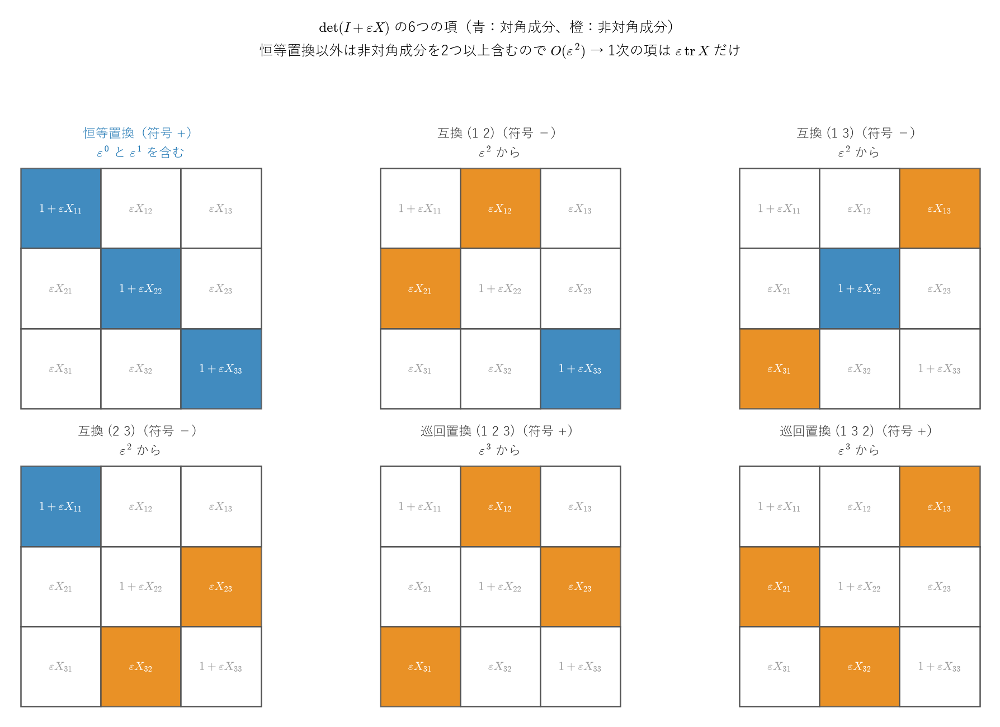
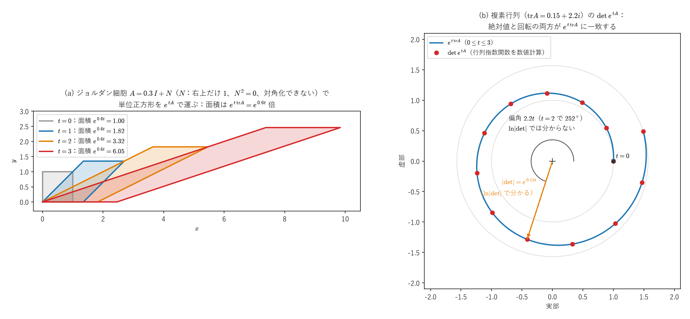
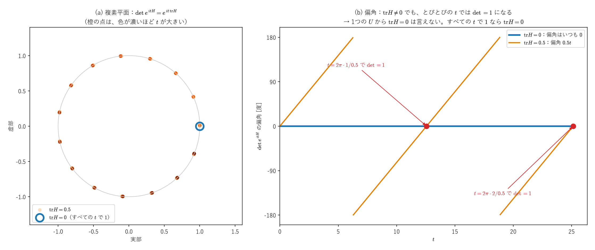

# $\det(e^A) = e^{\operatorname{tr}A}$ の証明

この公式は、[パウリ行列のノート](pauli_matrices_derivation_and_group.md) Part I で「$SU(2)$ の条件 $\det U=1$ には $\operatorname{tr}A=0$ が必要」として使った根拠である（ただし、その使い方には注意が必要で、最後の節で述べる）。証明に使う道具は、これまでの議論の中で既に手に入れたものだけで足りる。

**関連ファイル**：数値検証 [test_det_exp_trace.py](../../notebooks/foundations/09_matrix_mechanics/test_det_exp_trace.py)（pytest。このノートの各主張に対応するテストがある）、形式証明 [DetExpTrace.lean](../../lean4/QuantumStudy/DetExpTrace.lean)（Lean 4 + Mathlib。証明1に沿った対角化できる行列・エルミート行列の場合と、証明2に沿った一般の複素正方行列の場合 `det_exp` を証明済み）。

---

## 方針：2つの経路

| 経路 | 対象 | 使う道具 |
|------|------|---------|
| 対角化を使う | $A$ が対角化可能な場合 | 相似変換を指数の中に通す公式・トレースの巡回性 |
| Jacobiの公式を使う | 一般の場合（対角化できなくても、複素行列でもよい） | Jacobiの公式・トレースの巡回性・微分が $0$ の関数は定数 |

---

## 証明1：対角化できる場合

### 前提

$A$ が対角化可能とする。つまりある正則行列 $P$ と対角行列 $\Lambda=\operatorname{diag}(\lambda_1,\dots,\lambda_n)$（$\lambda_i$：$A$ の固有値）を使って

$$
A = P\Lambda P^{-1}\tag{式1}
$$

と書けるとする。目標は $\det(e^A)=e^{\operatorname{tr}A}$ を示すことである。

---

### ステップ1：$e^A$ を対角行列の指数に置き換える

以前証明した「相似変換は指数の中に丸ごと通せる」公式

$$
Pe^{X}P^{-1} = e^{PXP^{-1}}\tag{式2}
$$

（証明：$P^{-1}P=I$ を挟み込んで $P\Lambda^nP^{-1}=(P\Lambda P^{-1})^n$ を示し、テイラー展開の各項に適用する）に $X=\Lambda$ を代入する：

$$
Pe^\Lambda P^{-1} = e^{P\Lambda P^{-1}}\tag{式3}
$$

右辺の $P\Lambda P^{-1}$ は式1よりちょうど $A$ なので：

$$
Pe^\Lambda P^{-1} = e^A\tag{式4}
$$

これで「$e^A$ という計算しにくいもの」が「対角行列 $\Lambda$ の指数だけを含む形」に置き換わった。

---

### ステップ2：両辺の行列式を取り、$P, P^{-1}$ を消す

式4の両辺に $\det(\cdot)$ を適用する：

$$
\det\big(Pe^\Lambda P^{-1}\big) = \det\big(e^A\big)\tag{式5}
$$

左辺に行列式の乗法性 $\det(XYZ)=\det X\cdot\det Y\cdot\det Z$ を使う：

$$
\det\big(Pe^\Lambda P^{-1}\big) = \det(P)\cdot\det(e^\Lambda)\cdot\det(P^{-1})\tag{式6}
$$

$\det(P^{-1})=\dfrac{1}{\det P}$ なので：

$$
\det(P)\cdot\det(P^{-1}) = \det(P)\cdot\frac{1}{\det P} = 1\tag{式7}
$$

式7を式6に代入し、さらに式5と合わせると：

$$
\det\big(e^A\big) = \det(e^\Lambda)\tag{式8}
$$

「$e^A$ の行列式」の計算が「$e^\Lambda$ の行列式」の計算に帰着した。$\Lambda$ は対角行列なのでこちらの方がずっと簡単である。

---

### ステップ3：$e^\Lambda$ を具体的に計算する

$\Lambda = \operatorname{diag}(\lambda_1,\dots,\lambda_n)$ のべき乗は対角成分ごとにべき乗するだけ：

$$
\Lambda^k = \operatorname{diag}\big(\lambda_1^k,\dots,\lambda_n^k\big)\tag{式9}
$$

これをテイラー展開の定義 $e^\Lambda=\sum_{k=0}^\infty\dfrac{\Lambda^k}{k!}$ に代入する：

$$
e^\Lambda = \sum_{k=0}^\infty\frac{1}{k!}\operatorname{diag}\big(\lambda_1^k,\dots,\lambda_n^k\big) = \operatorname{diag}\!\left(\sum_{k=0}^\infty\frac{\lambda_1^k}{k!},\ \dots,\ \sum_{k=0}^\infty\frac{\lambda_n^k}{k!}\right)\tag{式10}
$$

各対角成分はスカラーの指数関数のテイラー展開そのものなので：

$$
\sum_{k=0}^\infty\frac{\lambda_i^k}{k!} = e^{\lambda_i}\tag{式11}
$$

したがって：

$$
e^\Lambda = \operatorname{diag}\big(e^{\lambda_1},\dots,e^{\lambda_n}\big)\tag{式12}
$$

---

### ステップ4：対角行列の行列式を計算する

対角行列の行列式は対角成分の積である（後述の補足参照）：

$$
\det(e^\Lambda) = e^{\lambda_1}\cdot e^{\lambda_2}\cdots e^{\lambda_n} = \prod_{i=1}^ne^{\lambda_i}\tag{式13}
$$

指数法則 $e^{x_1}\cdots e^{x_n}=e^{x_1+\cdots+x_n}$ を使う：

$$
\det(e^\Lambda) = e^{\sum_i\lambda_i}\tag{式14}
$$

式14を式8に代入すると：

$$
\det\big(e^A\big) = e^{\sum_i\lambda_i}\tag{式15}
$$

---

### ステップ5：$\sum_i\lambda_i = \operatorname{tr}(A)$ を示す

$\Lambda$ のトレースは定義より：

$$
\operatorname{tr}(\Lambda) = \lambda_1+\cdots+\lambda_n = \sum_i\lambda_i\tag{式16}
$$

トレースの巡回性 $\operatorname{tr}(XY)=\operatorname{tr}(YX)$ を $\operatorname{tr}(A)=\operatorname{tr}(P\Lambda P^{-1})$ に適用する（$X=P\Lambda,\ Y=P^{-1}$）：

$$
\operatorname{tr}(A) = \operatorname{tr}(P\Lambda P^{-1}) = \operatorname{tr}(P^{-1}P\Lambda) = \operatorname{tr}(I\Lambda) = \operatorname{tr}(\Lambda)\tag{式17}
$$

式16・17より：

$$
\sum_i\lambda_i = \operatorname{tr}(A)\tag{式18}
$$

---

### 結論

式18を式15に代入すると：

$$
\boxed{\det(e^A) = e^{\operatorname{tr}(A)}}
$$

### 証明1の限界

すべての行列が対角化できるわけではない。例えば $\begin{pmatrix}\lambda&1\\0&\lambda\end{pmatrix}$ は対角化できない（証明2のステップ5）。証明2は、このような行列も含めて成り立つ。

---

## 証明2：一般の場合（Jacobiの公式を使う）

対角化できない行列（ジョルダン標準形が必要な行列）や、複素数を成分に持つ行列も含めて成り立つ証明。[ラプラス・ベルトラミ作用素のノート](../02_微分幾何/laplace_beltrami_from_jacobian_matrix.md)（Part II §4 (d)）でも使ったJacobiの公式を、ここで導き直してから使う。

### ステップ1：$\det(I+\varepsilon X)$ を $\varepsilon$ の1次まで展開する

$2\times2$ では直接計算できる：

$$
\det\begin{pmatrix}1+\varepsilon X_{11}&\varepsilon X_{12}\\ \varepsilon X_{21}&1+\varepsilon X_{22}\end{pmatrix}
=1+\varepsilon\,(X_{11}+X_{22})+\varepsilon^2(X_{11}X_{22}-X_{12}X_{21})\tag{式19}
$$

$\varepsilon$ の1次の係数は、ちょうど $\operatorname{tr}X$ である。

一般の $n\times n$ では、行列式の定義（置換 $\sigma$ についての和）

$$
\det M=\sum_{\sigma}\operatorname{sgn}(\sigma)\,M_{1\sigma(1)}M_{2\sigma(2)}\cdots M_{n\sigma(n)}
$$

に $M=I+\varepsilon X$ を代入する。$M$ の対角成分は $1+\varepsilon X_{ii}$、非対角成分は $\varepsilon X_{ij}$ である。

- **恒等置換**（すべての $i$ で $\sigma(i)=i$）の項は $(1+\varepsilon X_{11})\cdots(1+\varepsilon X_{nn})=1+\varepsilon\sum_iX_{ii}+O(\varepsilon^2)$ である。
- **それ以外の置換**は、少なくとも2つの番号を動かす（$\sigma(i)=j\ne i$ なら、$\sigma(j)=j$ とはなれないので、$j$ も動く）。そのため、積の中に非対角成分 $\varepsilon X_{i\sigma(i)}$ が少なくとも2つ入り、項全体が $O(\varepsilon^2)$ になる。

したがって

$$
\boxed{\det(I+\varepsilon X)=1+\varepsilon\operatorname{tr}X+O(\varepsilon^2)}\tag{式20}
$$



*$3\times3$ の場合の6つの置換。各マスの色は、積に使う成分（青：対角成分 $1+\varepsilon X_{ii}$、橙：非対角成分 $\varepsilon X_{ij}$）。恒等置換（左上）だけが $\varepsilon$ の0次と1次を含み、互換（3つ）は $\varepsilon^2$、巡回置換（2つ）は $\varepsilon^3$ から始まる。図を描くときに、6つの項の和が $\det(I+\varepsilon X)$ に一致することを SymPy で確かめている。*

### ステップ2：Jacobiの公式

$M(t)$ を、$t$ について微分できる正則行列とする。$h$ が小さいとき $M(t+h)=M(t)+hM'(t)+o(h)$ なので、$M(t)$ をくくり出すと

$$
M(t+h)=M(t)\big(I+h\,M(t)^{-1}M'(t)+o(h)\big)
$$

である。行列式の乗法性と式20（$\varepsilon=h$、$X=M^{-1}M'$）から

$$
\det M(t+h)=\det M(t)\,\big(1+h\operatorname{tr}(M^{-1}M')+o(h)\big)
$$

両辺から $\det M(t)$ を引いて $h$ で割り、$h\to0$ とすると：

$$
\boxed{\frac{d}{dt}\det M(t)=\det M(t)\cdot\operatorname{tr}\big(M(t)^{-1}M'(t)\big)}\tag{式21}
$$

これがJacobiの公式である。

- 余因子行列 $\tilde M=(\det M)\,M^{-1}$ を使うと $\dfrac{d}{dt}\det M=\operatorname{tr}(\tilde M\,M')$ とも書ける。これは $M$ が正則でなくても成り立つ形である（余因子行列は[ラプラス・ベルトラミのノート](../02_微分幾何/laplace_beltrami_from_jacobian_matrix.md)の Part I §2）。
- 実行列（$\det M\ne0$）なら、両辺を $\det M$ で割って $\dfrac{d}{dt}\ln|\det M|=\operatorname{tr}(M^{-1}M')$ と書ける。ラプラス・ベルトラミのノートと、[クリストッフェル記号のノートの補遺 §1](../02_微分幾何/christoffel_riemann_intro.md#supp-1) で使ったのはこの形である。複素行列で対数を使うときの注意は、この証明の最後で述べる。

### ステップ3：$\det(e^{tA})$ が満たす微分方程式

$f(t):=\det(e^{tA})$ とおく。テイラー展開の項別微分より（指数関数の級数は絶対収束するので、項別に微分してよい）：

$$
\frac{d}{dt}e^{tA} = Ae^{tA}\tag{式22}
$$

$e^{tA}$ はいつも正則（逆行列は $e^{-tA}$）なので、式21に $M(t)=e^{tA}$ を代入できる：

$$
f'(t)=f(t)\operatorname{tr}\big(e^{-tA}Ae^{tA}\big)=f(t)\operatorname{tr}\big(Ae^{tA}e^{-tA}\big)=f(t)\operatorname{tr}A\tag{式23}
$$

（2つ目の等号はトレースの巡回性 $\operatorname{tr}(XYZ)=\operatorname{tr}(YZX)$。）また $f(0)=\det I=1$ である。

### ステップ4：対数を使わずに解く

$g(t):=e^{-t\operatorname{tr}A}f(t)$ とおいて微分すると、式23より

$$
g'(t)=-\operatorname{tr}A\,e^{-t\operatorname{tr}A}f(t)+e^{-t\operatorname{tr}A}f'(t)=e^{-t\operatorname{tr}A}\big(f'(t)-\operatorname{tr}A\,f(t)\big)=0\tag{式24}
$$

微分がいつも $0$ の関数は定数である（複素数値の関数なら、実部と虚部のそれぞれに平均値の定理を使う）。$g(0)=f(0)=1$ なので $g(t)=1$、つまり $f(t)=e^{t\operatorname{tr}A}$ である。$t=1$ を代入して：

$$
\boxed{\det(e^A) = e^{\operatorname{tr}(A)}}
$$

**この証明は、$A$ が対角化できるかどうかにも、成分が実数か複素数かにも依存しない。**

### ステップ5（例）：対角化できない行列

$A=\begin{pmatrix}\lambda&1\\0&\lambda\end{pmatrix}$（ジョルダン細胞）は、固有値が $\lambda$ だけで、固有ベクトルが1つの方向にしかないので、対角化できない。$N:=\begin{pmatrix}0&1\\0&0\end{pmatrix}$ とおくと $A=\lambda I+N$、$N^2=0$ で、$\lambda I$ と $N$ は交換するので

$$
e^{tA}=e^{\lambda t}e^{tN}=e^{\lambda t}(I+tN)=e^{\lambda t}\begin{pmatrix}1&t\\0&1\end{pmatrix},\qquad
\det e^{tA}=e^{2\lambda t}=e^{t\operatorname{tr}A}
$$

となり、確かに成り立つ（$e^{X+Y}=e^Xe^Y$ は $XY=YX$ のときに成り立つ）。

### 注意：対数を取ると、複素行列では位相を取りこぼす

式21を $\det M$ で割り、$\ln|\det M|$ の微分として扱う方法は、複素行列では使えない。$\ln|\det M|$ が見ているのは $\det M$ の**絶対値**だけで、その微分は $\operatorname{Re}\operatorname{tr}(M^{-1}M')$（実部）になるからである。例えば $A=\operatorname{diag}(i,i)$ なら $\det e^{tA}=e^{2it}$ は単位円の上を回るが、絶対値は $1$ のままで、$\ln|\det e^{tA}|=0$ からは回転（位相）が分からない。$SU(2)$ で必要なのはまさに $A=iH$（$H$：エルミート）の場合で、この位相が $\det U=1$ かどうかを決める。そのため、ステップ4では対数を使わずに解いた。



*(a) ジョルダン細胞 $A=\begin{pmatrix}0.3&1\\0&0.3\end{pmatrix}$ で単位正方形を $e^{tA}$ で運んだもの。対角化できなくても、面積は $e^{t\operatorname{tr}A}=e^{0.6t}$ 倍になる。(b) 複素行列 $A$（$\operatorname{tr}A=0.15+2.2i$）について、$\det e^{tA}$ を複素平面に描いたもの。点は行列指数関数を数値計算して求めた値で、曲線 $e^{t\operatorname{tr}A}$ の上に乗る。原点からの距離 $e^{0.15t}$ は $\ln|\det|$ でも分かるが、回転の角度 $2.2t$ は分からない。*

---

## 補足：対角行列の行列式が対角成分の積になる理由

### $2\times2$ の確認

$$
\det\begin{pmatrix}\mu_1&0\\0&\mu_2\end{pmatrix} = \mu_1\mu_2 - 0\cdot0 = \mu_1\mu_2
$$

非対角成分が $0$ なので引き算の項が消える。

### $3\times3$ の確認（余因子展開）

1行目に沿って展開すると、非対角成分（0）が掛かる項はすべて消え：

$$
\det\begin{pmatrix}\mu_1&0&0\\0&\mu_2&0\\0&0&\mu_3\end{pmatrix} = \mu_1\cdot\det\begin{pmatrix}\mu_2&0\\0&\mu_3\end{pmatrix} = \mu_1\cdot\mu_2\mu_3 = \mu_1\mu_2\mu_3
$$

### 一般の $n\times n$（数学的帰納法）

$n\times n$ の対角行列を1行目に沿って余因子展開すると、生き残るのは $j=1$ の項だけ：

$$
\det D = \mu_1\cdot\det(D^{(1,1)})
$$

$D^{(1,1)}$ は $\operatorname{diag}(\mu_2,\dots,\mu_n)$ という1次小さい対角行列なので、帰納法の仮定より $\det(D^{(1,1)})=\mu_2\cdots\mu_n$。したがって：

$$
\det D = \mu_1\mu_2\cdots\mu_n = \prod_{i=1}^n\mu_i
$$

### 幾何学的な意味

計量テンソルのノートで扱った「行列式 = 体積の拡大率」という視点：対角行列は各座標軸を独立に $\mu_i$ 倍するだけなので、全体の体積拡大率は $\mu_1\mu_2\cdots\mu_n$ の単純な積になる。

---

## 補足2：トレースは体積の変化率

式23で $t=0$ とすると $f'(0)=\operatorname{tr}A$、つまり

$$
\frac{d}{dt}\det(e^{tA})\Big|_{t=0}=\operatorname{tr}A
$$

である。$\det$ は体積の拡大率なので、**トレースは、$e^{tA}$ で運ばれる図形の体積が、$t=0$ で増える速さ**である。$e^{tA}$ は線形なベクトル場 $\dot{\mathbf x}=A\mathbf x$ の流れで、その発散は $\nabla\cdot(A\mathbf x)=\sum_iA_{ii}=\operatorname{tr}A$ なので、これは「発散＝体積の変化率」（[リー微分のノート](../02_微分幾何/lie_derivative.md#p8)の Part VIII）の、線形な場合にあたる。$\det e^{tA}=e^{t\operatorname{tr}A}$ は、この変化率が一定なので、体積が指数関数的に変わることを表す。

---

## 全体の流れ（振り返り）

```
証明1（対角化できる場合）
    式1〜4 : A = PΛP⁻¹ と「相似変換を指数に通す公式」→ e^A = Pe^Λ P⁻¹
    式5〜8 : det を取り、det(P)det(P⁻¹)=1 で消去 → det(e^A) = det(e^Λ)
    式9〜14: e^Λ を対角成分ごとに計算 → det(e^Λ) = e^(Σλᵢ)
    式15〜18: トレースの巡回性 → Σλᵢ = tr(A)
    → det(e^A) = e^(tr A)

証明2（一般の場合）
    式19〜20 : 置換の和で det(I+εX) = 1 + ε tr X + O(ε²)
    式21     : M(t+h) = M(t)(I + hM⁻¹M' + …) → Jacobiの公式 (det M)' = det M · tr(M⁻¹M')
    式22〜23 : f(t) = det(e^(tA)) は f' = (tr A) f、f(0) = 1
    式24     : g = e^(-t tr A) f は g' = 0 → f(t) = e^(t tr A)
    → det(e^A) = e^(tr A)（対角化できなくても、複素行列でもよい）
```

## この公式の意味：$SU(2)$ の生成子がトレースゼロになる理由

[パウリ行列のノート](pauli_matrices_derivation_and_group.md) Part I では、「$\det U=1$ なら $\operatorname{tr}A=0$」としてこの公式を使う。ただし、**1つの $U$ だけからは $\operatorname{tr}A=0$ は出ない**ことに注意する。

### 1つの $U$ からは、$\operatorname{tr}A\in2\pi\mathbb Z$ までしか言えない

$U=e^{iA}$ とすると、この公式から

$$
\det U=e^{i\operatorname{tr}A}=1\iff\operatorname{tr}A\in2\pi\mathbb Z
$$

である。例えば $A=\operatorname{diag}(2\pi,0)$ はエルミートで、$e^{iA}=\operatorname{diag}(e^{2\pi i},1)=I$ なので $\det U=1$ だが、$\operatorname{tr}A=2\pi\ne0$ である。エルミート性も同じで、$P$ をユニタリでない正則行列として $A=P\operatorname{diag}(2\pi,0)P^{-1}$ とすると、$A$ はエルミートではないのに、$e^{iA}=PIP^{-1}=I$ はユニタリである。

### 1パラメータの族で考える

正しい言い方は、「**すべての $t$ について** $U(t)=e^{itA}$ が $SU(2)$ に入る」ための条件である：

$$
\boxed{e^{itA}\in SU(2)\ \ (\text{すべての }t)\iff A^\dagger=A\ \text{かつ}\ \operatorname{tr}A=0}
$$

- （$\Rightarrow$）$\det U(t)=e^{it\operatorname{tr}A}=1$ がすべての $t$ で成り立つので、$t=0$ で微分して $i\operatorname{tr}A=0$ である。同様に、$U(t)^\dagger U(t)=I$ を $t=0$ で微分すると $(iA)^\dagger+iA=0$、つまり $A^\dagger=A$ である（$(e^X)^\dagger=e^{X^\dagger}$ を使う）。
- （$\Leftarrow$）$A^\dagger=A$ なら $U(t)^\dagger=e^{-itA^\dagger}=e^{-itA}=U(t)^{-1}$ でユニタリ、$\operatorname{tr}A=0$ なら $\det U(t)=e^0=1$ である。

$t=0$ での微分は、$I$ での**接ベクトル**を取り出す操作で、[多様体のノート](../03_多様体・微分形式・トポロジー/manifolds_introduction.md#p2-5)の Part II §5 で「$O(n)$ の $I$ での接空間は反対称行列」を示したのと同じ考え方である。トレースゼロのエルミート行列（に $i$ を掛けたもの）が、$SU(2)$ の $I$ での接空間をなす。この見方は、パウリ行列のノートの Part I で詳しく扱う。



*$\det e^{itH}=e^{it\operatorname{tr}H}$ を、(a) 複素平面と (b) 偏角で描いたもの。$\operatorname{tr}H=0$（青）ならすべての $t$ で $1$ のまま。$\operatorname{tr}H=0.5$（橙）なら単位円の上を回り、$1$ に戻るのは $t=2\pi k/0.5$ のときだけである。1つの $t$ で $\det=1$ でも、$\operatorname{tr}H=0$ とは限らない。*

### Jacobiの公式とのつながり

Jacobiの公式は、[ラプラス・ベルトラミ作用素のノート](../02_微分幾何/laplace_beltrami_from_jacobian_matrix.md)（Part II §4 (d)）と[クリストッフェル記号のノートの補遺 §1](../02_微分幾何/christoffel_riemann_intro.md#supp-1)で、$\sqrt{|g|}$ の微分（$\Gamma^i{}_{ij}=\partial_j\ln\sqrt{|g|}$）を導くのにも使った。行列の指数関数の行列式と、曲がった空間の体積要素という、一見無関係な2つの話が、同じ公式でつながっている。
