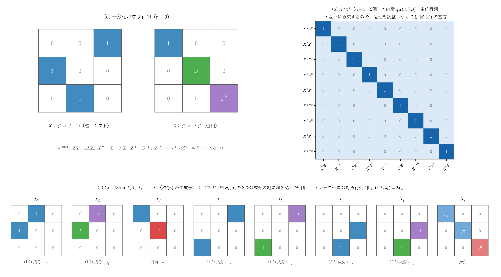

# 一般化パウリ行列と$SU(n)$の生成子 ―$2\times2$を超えて―

「トレースゼロ・エルミート」という条件だけなら$n\times n$でも成り立つはずなのに、なぜ「パウリ行列」は$2\times2$に限定されているのか、そして実際にどう一般化されるのかを整理します。

---

# Part I：パウリ行列の「本質」を再確認する

[パウリ行列のノート](pauli_matrices_derivation_and_group.md)（Part V §2）で確認した通り、パウリ行列は単に「エルミート・トレースゼロ」というだけの行列ではなく、

$$
\boxed{\sigma_i\sigma_j = \delta_{ij}I+i\varepsilon_{ijk}\sigma_k}
$$

という、**交換関係と反交換関係の両方を同時に満たす、非常に強い代数的構造**を持っていました。この構造まで込みで一般化するかどうかで、話が大きく3方向に分かれます。

---

# Part II：一般化パウリ行列（qudit用、$n$準位系）

## 1. 定義

$n$次元で、$\omega:=e^{2\pi i/n}$（$1$の$n$乗根）とおき、2つの行列を定義します：

**巡回シフト行列 $X$**：

$$
X|j\rangle = |j+1\bmod n\rangle
$$

**位相行列 $Z$**：

$$
Z|j\rangle = \omega^j|j\rangle
$$

例えば $n=3$ なら：

$$
X=\begin{pmatrix}0&0&1\\1&0&0\\0&1&0\end{pmatrix},\qquad Z=\begin{pmatrix}1&0&0\\0&\omega&0\\0&0&\omega^2\end{pmatrix}\qquad(\omega=e^{2\pi i/3})
$$

## 2. $n=2$ の場合、確かにパウリ行列に戻る

$n=2$（$\omega=e^{i\pi}=-1$）を代入すると：

$$
X = \begin{pmatrix}0&1\\1&0\end{pmatrix} = \sigma_x,\qquad Z=\begin{pmatrix}1&0\\0&-1\end{pmatrix}=\sigma_z
$$

**確かに元のパウリ行列と一致します。**

## 3. 交換関係の一般化

$$
\boxed{ZX = \omega\,XZ}
$$

成分で確かめると、$ZX|j\rangle=Z|j+1\rangle=\omega^{j+1}|j+1\rangle$、$XZ|j\rangle=\omega^jX|j\rangle=\omega^j|j+1\rangle$ なので、$ZX=\omega XZ$ です（$j+1$ は $n$ で割った余りですが、$\omega^n=1$ なので、$\omega^{j+1}$ はそのままで正しい値になります）。

（$n=2$なら $\omega=-1$ なので $ZX=-XZ$、つまり $\{Z,X\}=0$。これは以前確認したパウリ行列の反交換関係 $\{\sigma_x,\sigma_z\}=0$ と一致します。）

## 4. $n^2$個の行列で基底を作る

$$
\boxed{X^aZ^b\qquad(a,b=0,1,\dots,n-1)}
$$

という$n^2$個の行列は、$M_n(\mathbb C)$（$n\times n$複素行列全体、複素 $n^2$ 次元）の基底になります。[パウリ行列のノート](pauli_matrices_derivation_and_group.md)の Part II §4 と同じく、ヒルベルト・シュミット内積 $\langle A,B\rangle=\operatorname{tr}(A^\dagger B)$ で互いに直交していることから分かります。$X,Z$ はユニタリ（$X^\dagger=X^{-1}$、$Z^\dagger=Z^{-1}$）なので、

$$
\langle X^aZ^b,\,X^cZ^d\rangle=\operatorname{tr}\big(Z^{-b}X^{c-a}Z^d\big)=\operatorname{tr}\big(X^{c-a}Z^{d-b}\big)=n\,\delta_{ac}\,\delta_{bd}
$$

です（2つ目の等号はトレースの巡回性）。

- $c\ne a$ なら、$X^{c-a}Z^{d-b}$ は $|j\rangle$ を $|j+c-a\rangle$ の定数倍に移すので、対角成分がすべて $0$ で、トレースは $0$ です。
- $c=a$ なら $\operatorname{tr}(Z^{d-b})=\sum_{j=0}^{n-1}\omega^{j(d-b)}$ で、$d=b$ なら $n$、$d\ne b$ なら等比級数の和 $\dfrac{1-\omega^{n(d-b)}}{1-\omega^{d-b}}=0$ です（$\omega^n=1$）。

互いに直交する、$0$ でない $n^2$ 個の行列は1次独立なので、$n^2$ 次元の $M_n(\mathbb C)$ の基底です。つまり、**基底にするためには、位相を調整する必要はありません**。

位相の調整が問題になるのは、積を考えるときです。$ZX=\omega XZ$ を繰り返し使うと $Z^bX^c=\omega^{bc}X^cZ^b$ なので、

$$
X^aZ^b\cdot X^cZ^d=\omega^{bc}\,X^{a+c}Z^{b+d}
$$

で、積に位相 $\omega^{bc}$ が付きます。そのため、$\{X^aZ^b\}$ そのものは積について閉じておらず、群（一般化パウリ群）にするには、位相 $\omega^k$ 倍したものも含めます。$n=2$ では、$\sigma_y=iXZ$ のように位相をそろえると、エルミートな行列にできます。これらは、量子情報理論で$n$準位系（qudit）を扱う際の標準的な道具です。

*(a) $n=3$ の一般化パウリ行列 $X$（巡回シフト）と $Z$（位相）です。(b) 9個の $X^aZ^b$ の内積 $\frac13\operatorname{tr}(A^\dagger B)$ の表で、単位行列になります。互いに直交するので、位相を調整しなくても基底です。(c) Part IV §2 の Gell-Mann 行列 $\lambda_1,\dots,\lambda_8$ です。図を描く前に、$n=2\sim5$ で $ZX=\omega XZ$、直交性、積の公式、ランダムな行列の展開を確かめ、Gell-Mann 行列について Part IV の性質と構造定数を確かめています。*

---

# Part III：エルミート性が崩れる理由

通常のパウリ行列は $\sigma_i^\dagger=\sigma_i$（エルミート）でしたが、$n>2$の一般化パウリ行列 $X,Z$ は**一般にエルミートではありません**。

$Z$ を具体的に確認します（$n=3$）：

$$
Z^\dagger = \begin{pmatrix}1&0&0\\0&\omega^*&0\\0&0&(\omega^2)^*\end{pmatrix} = \begin{pmatrix}1&0&0\\0&\omega^{-1}&0\\0&0&\omega^{-2}\end{pmatrix} = Z^{-1}
$$

（$\omega^*=\omega^{-1}$、$1$の$n$乗根は絶対値$1$の複素数なので、共役を取ると逆数になる。）つまり $Z^\dagger=Z^{-1}\ne Z$ なので、**$Z$はユニタリではありますが、エルミートではありません**。

$X$ も同じです。$X$ は実行列ですが、置換行列なので $X^\dagger=X^T=X^{-1}=X^{n-1}$（逆向きの巡回シフト）で、$n>2$ では $X^\dagger\ne X$ です。

$n=2$のときだけ、たまたま $\omega=-1$ が実数（自分自身が複素共役）だったため、$Z=\sigma_z$ がエルミートにもなっていた、という特殊な偶然だったことが分かります。

---

# Part IV：$SU(n)$の生成子（エルミート性を優先する方向）

「エルミート・トレースゼロ」という性質を優先して一般化すると、$SU(n)$の生成子（リー代数 $\mathfrak{su}(n)$の基底）という、別の一般化にたどり着きます。

## 1. 生成子の個数：$n^2-1$個

$SU(n)$（$n\times n$、行列式$1$のユニタリ行列）のリー代数 $\mathfrak{su}(n)$ の次元（＝独立な生成子の個数）は：

$$
\boxed{\dim\mathfrak{su}(n) = n^2-1}
$$

これは以前確認した「トレースゼロ・エルミート行列の自由パラメータの数」という数え方から出てきます。$n\times n$エルミート行列全体は $n^2$個の実パラメータを持ち（対角成分$n$個の実数＋非対角成分の組の実部・虚部）、トレースゼロという1本の拘束を引くと $n^2-1$になります。

$n=2$なら $2^2-1=3$（パウリ行列3本）、$n=3$なら $3^2-1=8$（次で見るGell-Mann行列8本）です。

## 2. Gell-Mann行列（$SU(3)$の場合）

$SU(3)$の8個の生成子は、以下のように構成されます（パウリ行列を$3\times3$に自然に埋め込んだものが基本パターンです）：

$$
\lambda_1=\begin{pmatrix}0&1&0\\1&0&0\\0&0&0\end{pmatrix},\quad
\lambda_2=\begin{pmatrix}0&-i&0\\i&0&0\\0&0&0\end{pmatrix},\quad
\lambda_3=\begin{pmatrix}1&0&0\\0&-1&0\\0&0&0\end{pmatrix}
$$

（これらは左上の$2\times2$ブロックがそのままパウリ行列 $\sigma_x,\sigma_y,\sigma_z$ になっています。）残りの5つは、

$$
\lambda_4=\begin{pmatrix}0&0&1\\0&0&0\\1&0&0\end{pmatrix},\quad
\lambda_5=\begin{pmatrix}0&0&-i\\0&0&0\\i&0&0\end{pmatrix},\quad
\lambda_6=\begin{pmatrix}0&0&0\\0&0&1\\0&1&0\end{pmatrix},\quad
\lambda_7=\begin{pmatrix}0&0&0\\0&0&-i\\0&i&0\end{pmatrix},\quad
\lambda_8=\frac1{\sqrt3}\begin{pmatrix}1&0&0\\0&1&0\\0&0&-2\end{pmatrix}
$$

です。構成は次のように整理できます（成分は Part II §4 の後の図の (c)）。

- **非対角の6個**：パウリ行列の $\sigma_x,\sigma_y$ を、3つの成分の組 $(1,2)$、$(1,3)$、$(2,3)$ にそれぞれ埋め込んだもの（$\lambda_1,\lambda_2$、$\lambda_4,\lambda_5$、$\lambda_6,\lambda_7$）。
- **対角の2個**：トレースゼロの $3\times3$ 対角行列は実数2個で決まるので、その基底として $\lambda_3$（$\sigma_z$ の埋め込み）と $\lambda_8$。$\lambda_8$ の係数 $\frac1{\sqrt3}$ は、長さをほかとそろえるためのものです。

どれもトレースゼロのエルミート行列で、パウリ行列と同じく

$$
\operatorname{tr}(\lambda_a\lambda_b)=2\delta_{ab}
$$

（$\lambda_8$ なら $\frac13(1+1+4)=2$）を満たします。互いに直交する8個なので1次独立で、§1 の $n^2-1=8$ 次元の空間の基底です。

## 3. 交換関係の一般化

$$
\boxed{[\lambda_a,\lambda_b] = 2if_{abc}\lambda_c}
$$

（$f_{abc}$：$SU(3)$の構造定数、$\varepsilon_{ijk}$の役割を果たすが、$SU(3)$ではより複雑な値の集合になる。）これは以前導出した

$$
[\sigma_i,\sigma_j]=2i\varepsilon_{ijk}\sigma_k
$$

の、$SU(3)$版です。$\varepsilon_{ijk}$（$SU(2)$の構造定数）に対応する$f_{abc}$が、$SU(3)$ではもっと複雑になります（$8\times8\times8$個の成分を持つテンソルですが、対称性により独立な非ゼロ成分は限られます）。

**構造定数の求め方**：交換関係の両辺に $\lambda_d$ を掛けてトレースを取ると、$\operatorname{tr}(\lambda_c\lambda_d)=2\delta_{cd}$ から

$$
f_{abd}=\frac1{4i}\operatorname{tr}\big([\lambda_a,\lambda_b]\,\lambda_d\big)
$$

です。$f_{abc}$ は3つの添字について完全反対称（2つを入れ替えると符号が変わる）で、$a<b<c$ で $0$ でないのは次の9個だけです：

$$
f_{123}=1,\qquad f_{147}=f_{246}=f_{257}=f_{345}=\tfrac12,\qquad f_{156}=f_{367}=-\tfrac12,\qquad f_{458}=f_{678}=\tfrac{\sqrt3}2
$$

（図のスクリプトで、トレースの式からすべての成分を計算して確かめています。）特に $f_{123}=1$ は、$\lambda_1,\lambda_2,\lambda_3$ どうしの交換関係が、パウリ行列の $\varepsilon_{123}=1$ と同じ形であることを表します。$SU(3)$ の中に、$SU(2)$ が含まれているということです。

---

# Part V：3つの一般化方向の整理

| 一般化の目的 | 一般化されたもの | 保持される性質 | 失われる性質 |
|---|---|---|---|
| $n$準位系のパウリ的演算子 | 一般化パウリ行列（$X,Z$） | 交換関係 $ZX=\omega XZ$、群構造 | エルミート性（$n>2$で） |
| $SU(n)$の生成子 | Gell-Mann型行列 | エルミート性、トレースゼロ | $3$次元回転との単純な対応（$SU(3)$では8次元の"内部空間"になる） |
| 反交換関係の一般化 | Clifford代数・ガンマ行列 | $\{\gamma^\mu,\gamma^\nu\}=2\eta^{\mu\nu}I$ | 次元・符号が時空の計量に依存 |

**なぜ$SU(2)$だけ、$3$次元の回転（$x,y,z$軸）と綺麗に対応するのか**：[パウリ行列のノート](pauli_matrices_derivation_and_group.md)の Part VII §3 で見たとおり、$U\in SU(2)$ は $\vec r\cdot\vec\sigma\mapsto U(\vec r\cdot\vec\sigma)U^\dagger$ によって、トレースゼロのエルミート行列の空間（3次元の実ベクトル空間）を回転させます。同じことは $SU(n)$ でもできて（$H\mapsto UHU^\dagger$。**随伴表現**と呼びます）、内積 $\operatorname{tr}(AB)$ を保つ変換になりますが、その空間は $n^2-1$ 次元です。これが3次元になるのは $n=2$ のときだけなので、$SU(2)$ だけが、私たちの住む3次元空間の回転と結びつきます（$n\geq3$ では、$n^2-1$ 次元のすべての回転が現れるわけでもありません）。$SU(3)$ では8次元の空間での変換になり、もはや「3次元空間の回転」という直感的なイメージでは捉えられず、**素粒子物理でいう「内部対称性」**（カラー自由度など）という、空間の回転とは異なる種類の自由度を表すことになります。

---

# まとめ

$$
\boxed{
\begin{aligned}
&\text{パウリ行列の本質は「エルミート・トレースゼロ」だけでなく}\sigma_i\sigma_j=\delta_{ij}I+i\varepsilon_{ijk}\sigma_k\text{という強い代数構造}\\
&\text{一般化パウリ行列（}X,Z\text{）：交換関係を保つが、}n>2\text{でエルミート性を失う（qudit用）}\\
&\text{Gell-Mann型行列：エルミート性を保ち、}SU(n)\text{の}n^2-1\text{個の生成子になる}\\
&SU(2)\text{が}3\text{次元回転と対応するのは、随伴表現の空間が }n^2-1=3\text{ 次元になるのが }n=2\text{ だけだから}\\
&SU(3)\text{では}8\text{個の生成子となり、空間回転ではなく内部対称性（QCDのカラー）を表す}
\end{aligned}
}
$$

「トレースゼロ・エルミートという条件だけならもっと自由に作れるのでは」という着眼は正確で、実際その条件だけを一般化すると $SU(n)$ の生成子（Gell-Mann型）にたどり着きます。一方、パウリ行列の**交換関係の構造**の方を優先して一般化すると、qudit用の一般化パウリ行列という、エルミート性を犠牲にした別の方向の一般化になる、という2つの異なる道がある、というのが今回の整理の要点です。
