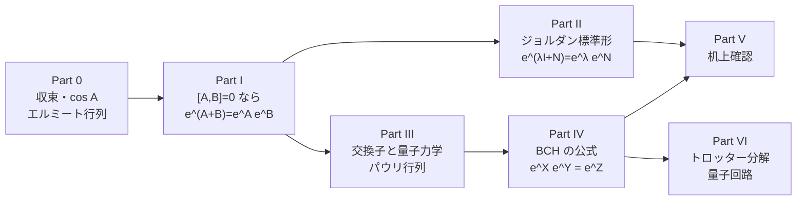
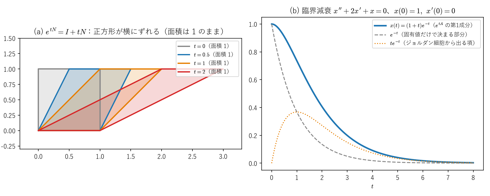
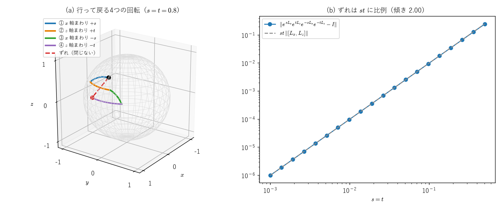
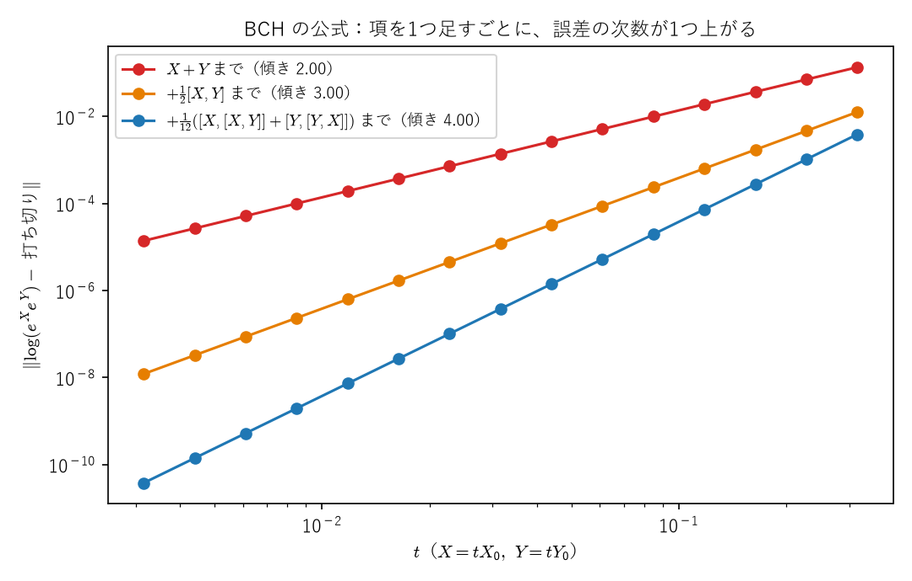
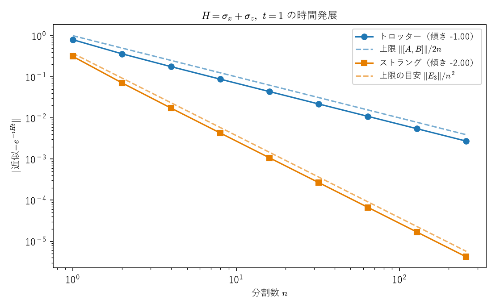

# 行列の指数関数と交換子 ―ジョルダン標準形・BCH の公式・トロッター分解―

> **作成** 2026-10-04　**更新** 2026-10-05
> 行列の指数関数と交換子のノート。e^{A+B} ≠ e^A e^B のずれを測る交換子を中心に、ジョルダン標準形、BCH の公式、
> トロッター分解までを、具体例での机上確認つきで整理する。

数なら $e^{a+b}=e^ae^b$ ですが、行列では一般に $e^{A+B}\ne e^Ae^B$ です。このノートでは、そのずれを測る量である**交換子** $[A,B]=AB-BA$ を中心に、行列の指数関数の計算と積の扱いを整理します。

- **Part 0**：行列に代入してよい理由。収束、$\cos A,\sin A$ とオイラーの公式、エルミート行列 $H$ の $e^{-iHt}$ がユニタリになる理由
- **Part I**：$[A,B]=0$ なら $e^{A+B}=e^Ae^B$（十分条件）と、その逆が「すべての $t$ で」なら成り立つこと、1点だけなら偶然成り立つ反例
- **Part II**：対角化できない行列の $e^A$（ジョルダン標準形）。Part I の結果を使う
- **Part III**：交換子と量子力学。パウリ行列の交換子・反交換子と、交換子の図形的な意味（行って戻ると閉じない）
- **Part IV**：ベイカー・キャンベル・ハウスドルフ（BCH）の公式。$e^Xe^Y=e^Z$ の $Z$ を交換子で書く
- **Part V**：**机上確認のコーナー**。具体的な $A,B$ を当てはめて、Part I〜IV を手で確かめる
- **Part VI**：トロッター分解とストラング分解。量子コンピュータで時間発展を作る方法
- **付録A**：ジョルダン標準形の証明（三角化 → 固有値ごとに分ける → べき零部分を「鎖」で並べる）
- **付録B**：BCH の公式が交換子だけで書ける理由（$\log(e^Xe^{tY})$ が満たす微分方程式）

**関連ファイル**：数値で確かめるノートブック [02_matrix_exponential.ipynb](../../notebooks/foundations/00_taylor_series/02_matrix_exponential.ipynb)（§3・§6・§7 がこのノートの Part II・I・VI に対応）。図は [figures/make_matrix_exp_commutator_figures.py](figures/make_matrix_exp_commutator_figures.py) で作っていて、各図の値はスクリプトの中で本文の式と照合しています。行列の指数関数の定義と、写像としての性質は[関数・線形写像・微分・積分のノート](../01_基礎・ベクトル解析/functions_linear_maps_derivatives_integrals.md)の Part VIII、$\det e^A=e^{\operatorname{tr}A}$ は[別のノート](det_exp_trace_proof.md)、パウリ行列の交換関係の導出は[パウリ行列のノート](pauli_matrices_derivation_and_group.md)の Part IV・V、$e^{-i\frac\theta2\sigma}$ から回転ゲート $R_z,R_y$ を作る計算は[ユニタリ行列のノート](unitary_matrix_full_decomposition.md)の Part VIII にあります。



<a id="toc"></a>

## 目次

<!-- toc:start -->

- [Part 0：行列に代入してよい理由 ―収束・cos A・エルミート行列―](#p0)
  - [1. 収束：成分ごとに確かめる](#p0-1)
  - [2. なぜこの定義なのか：時間発展の方程式が決める](#p0-2)
  - [3. 行列の cos A, sin A とオイラーの公式](#p0-3)
  - [4. エルミート行列 H の e^-iHt は、なぜユニタリか](#p0-4)
  - [5. べき級数の代入が使える関数](#p0-5)
- [Part I：\[A,B\]=0 なら e^A+B=e^Ae^B](#p1)
  - [1. 十分条件：交換すれば、数と同じ](#p1-1)
  - [2. 「すべての t で」成り立つなら、\[A,B\]=0](#p1-2)
  - [3. 1点だけなら、交換しなくても偶然成り立つ](#p1-3)
- [Part II：対角化できない行列の e^A ―ジョルダン標準形―](#p2)
  - [1. 固有値と固有ベクトル](#p2-1)
  - [2. 対角化できれば、固有値の指数関数で済む](#p2-2)
  - [3. 対角化できないとき：足りない1本を「ほとんど固有ベクトル」で埋める](#p2-3)
  - [4. 3次元以上：「鎖」と、ジョルダン標準形の定理](#p2-4)
  - [5. j\_12=1 は、基底をどう取り直しても 0 にならない](#p2-5)
  - [6. ガウスの消去法との違い](#p2-6)
  - [7. ジョルダン細胞と、三角行列・三重対角行列](#p2-7)
  - [8. ジョルダン細胞の指数関数](#p2-8)
  - [9. 例：鎖を求める計算と、P を求めずに e^tA を計算する方法](#p2-9)
  - [10. なぜ必要か、量子計算での位置づけ](#p2-10)
- [Part III：交換子と量子力学](#p3)
  - [1. 交換子の基本性質](#p3-1)
  - [2. 量子力学での交換子](#p3-2)
  - [3. パウリ行列：交換子と反交換子](#p3-3)
  - [4. 交換子の図形的な意味：行って戻ると閉じない](#p3-4)
- [Part IV：BCH の公式](#p4)
  - [1. 問題：e^Xe^Y=e^Z の Z は何か](#p4-1)
  - [2. 2次の項の導出](#p4-2)
  - [3. 3次の項](#p4-3)
  - [4. 交換子が定数なら、級数は途中で終わる](#p4-4)
  - [5. 相棒の公式：e^XYe^-X](#p4-5)
  - [6. 収束と、リー代数が群を決めること](#p4-6)
- [Part V：机上確認のコーナー](#p5)
  - [1. 交換する例：双曲線関数の加法定理が出る](#p5-1)
  - [2. 交換しない例：はしご演算子](#p5-2)
  - [3. 級数が途中で終わる例：3×3 の上三角](#p5-3)
  - [4. パウリ行列で、ずれが frac12\[A,B\] であることを手で見る](#p5-4)
  - [5. 1点だけ偶然成り立つ例](#p5-5)
  - [6. まとめの表](#p5-6)
- [Part VI：トロッター分解とストラング分解](#p6)
  - [1. 問題：e^-iHt を回路で作りたい](#p6-1)
  - [2. トロッター分解：細かく刻む](#p6-2)
  - [3. ストラング分解：対称に並べると、2次の誤差が消える](#p6-3)
  - [4. Qiskit での対応](#p6-4)
  - [5. 経路積分との関係](#p6-5)
- [まとめ](#summary)
- [付録A：ジョルダン標準形の証明](#appA)
  - [A-1. 準備：ケーリー・ハミルトンの定理](#A-1)
  - [A-2. ステップ1：固有値ごとに分ける](#A-2)
  - [A-3. ステップ2：べき零行列を「鎖」で並べる](#A-3)
  - [A-4. まとめと例](#A-4)
- [付録B：BCH の公式が交換子だけで書ける理由](#appB)
  - [B-1. 道具1：ad と、挟み込みの公式](#B-1)
  - [B-2. 道具2：行列の指数関数の微分](#B-2)
  - [B-3. Z(t) = log(e^X e^{tY}) が満たす微分方程式](#B-3)
  - [B-4. 3次までの計算](#B-4)
  - [B-5. どこで壊れるか：2πi との関係](#B-5)

<!-- toc:end -->

---

<a id="p0"></a>

# Part 0：行列に代入してよい理由 ―収束・$\cos A$・エルミート行列―

<!-- part-toc:start -->

**この Part の内容**

- [1. 収束：成分ごとに確かめる](#p0-1)
- [2. なぜこの定義なのか：時間発展の方程式が決める](#p0-2)
- [3. 行列の cos A, sin A とオイラーの公式](#p0-3)
- [4. エルミート行列 H の e^-iHt は、なぜユニタリか](#p0-4)
- [5. べき級数の代入が使える関数](#p0-5)

<!-- part-toc:end -->

このノートは、行列の指数関数を $e^A=\sum_{k\ge0}A^k/k!$ と定義して始めます。Part 0 では、この定義について最初に出てきそうな疑問を整理します。

- 数のテイラー展開に、行列をそのまま代入してよいのか（収束。§1）
- なぜこの定義を選ぶのか（§2）
- $\cos A,\sin A$ も同じように定義でき、オイラーの公式は行列でも成り立つのか（§3）
- エルミート行列 $H$ から作った $e^{-iHt}$ がユニタリになることを、成分ごとに確かめられるのか（§4）
- 代入が使えるのは、どんな関数か（§5）

<a id="p0-1"></a>

## 1. 収束：成分ごとに確かめる

$A$ の $(i,j)$ 成分を $a_{ij}$、$A^n$ の $(i,j)$ 成分を $(A^n)_{ij}$ と書きます。フロベニウスノルム $\|A\|_F=\sqrt{\sum_{i,j}|a_{ij}|^2}$ について $\|AB\|_F\le\|A\|_F\|B\|_F$ が成り立つことは、[関数・線形写像のノート](../01_基礎・ベクトル解析/functions_linear_maps_derivatives_integrals.md)の Part VIII §1 で示されています。これを繰り返すと $\|A^n\|_F\le\|A\|_F^n$ です。1つの成分の絶対値は全体のノルム以下なので、

$$
|(A^n)_{ij}|\le\|A^n\|_F\le\|A\|_F^{\,n}
\qquad\Longrightarrow\qquad
\sum_{n=0}^\infty\frac{|(A^n)_{ij}|}{n!}\le\sum_{n=0}^\infty\frac{\|A\|_F^{\,n}}{n!}=e^{\|A\|_F}<\infty
$$

です（右辺は**数の**指数関数の級数）。つまり $(e^A)_{ij}=\sum_n\frac{(A^n)_{ij}}{n!}$ は、どんな正方行列 $A$ でも絶対収束し、$e^A$ が定まります。絶対収束なので、Part I で使う項の並べ替えも許されます。

**成分ごとの具体例**：$J=\begin{pmatrix}0&-1\\1&0\end{pmatrix}$ では $J^2=-I$ なので、$J^{2k}=(-1)^kI$、$J^{2k+1}=(-1)^kJ$ です。したがって

$$
(e^{tJ})_{11}=\sum_{k=0}^\infty\frac{(-1)^kt^{2k}}{(2k)!}=\cos t,\qquad
(e^{tJ})_{21}=\sum_{k=0}^\infty\frac{(-1)^kt^{2k+1}}{(2k+1)!}=\sin t
$$

で、$(1,2)$ 成分は $-\sin t$、$(2,2)$ 成分は $\cos t$ です。各成分が、そのまま $\cos,\sin$ の（数の）テイラー級数になっています。

$$
e^{tJ}=\begin{pmatrix}\cos t&-\sin t\\\sin t&\cos t\end{pmatrix}
$$

これは[ユニタリ行列のノート](unitary_matrix_full_decomposition.md)の Part VIII §5 の $R_y(\theta)$ で $t=\theta/2$ とおいた行列で、$-i\sigma_y=J$ だからです（$-i\sigma_y=-i\begin{pmatrix}0&-i\\i&0\end{pmatrix}=\begin{pmatrix}0&-1\\1&0\end{pmatrix}$）。

<a id="p0-2"></a>

## 2. なぜこの定義なのか：時間発展の方程式が決める

数の $e^{tx}$ は、$\dfrac{d}{dt}f=xf,\ f(0)=1$ の解です。行列でも、$G(t)=e^{tA}$ を成分ごとに項別微分すると $\dfrac{d}{dt}G=AG$、$G(0)=I$ を満たします（[関数・線形写像のノート](../01_基礎・ベクトル解析/functions_linear_maps_derivatives_integrals.md)の Part VIII §2）。

**この方程式の解は他にありません。** $G$ がこの方程式の解なら、$e^{-tA}$ との積を微分して

$$
\frac{d}{dt}\big(e^{-tA}G\big)=-Ae^{-tA}G+e^{-tA}AG=0
$$

です（$e^{-tA}$ は $A$ のべき級数なので $A$ と交換し、$-Ae^{-tA}+e^{-tA}A=0$ になります）。よって $e^{-tA}G$ は定数で、$t=0$ の値が $I$ なので $G=e^{tA}$ です。

**物理への接続**：時間に依存しない $H$ のシュレーディンガー方程式 $i\hbar\dfrac{d}{dt}U=HU,\ U(0)=I$ は、$A=-iH/\hbar$ とおいた $\dfrac{d}{dt}U=AU$ です。したがって解は $U(t)=e^{-iHt/\hbar}$ ただ1つです。$e^{-iHt}$ の定義は、時間発展の方程式から強制されます。

<a id="p0-3"></a>

## 3. 行列の $\cos A,\ \sin A$ とオイラーの公式

数のテイラー展開 $\cos x=\sum_k\frac{(-1)^kx^{2k}}{(2k)!}$、$\sin x=\sum_k\frac{(-1)^kx^{2k+1}}{(2k+1)!}$ の $x$ に行列 $A$ を代入して、

$$
\cos A:=\sum_{k=0}^\infty\frac{(-1)^kA^{2k}}{(2k)!},\qquad
\sin A:=\sum_{k=0}^\infty\frac{(-1)^kA^{2k+1}}{(2k+1)!}
$$

と定義します。§1 と同じ評価（$\|A\|_F^{\,n}$ で抑える）で、どんな $A$ でも各成分が絶対収束します。

**オイラーの公式は、任意の正方行列 $A$ で成り立ちます。** $(iA)^{2k}=i^{2k}A^{2k}=(-1)^kA^{2k}$、$(iA)^{2k+1}=i\,(-1)^kA^{2k+1}$ なので、$e^{iA}$ の級数を偶数項と奇数項に分けると（絶対収束なので並べ替えてよい）、

$$
e^{iA}=\sum_k\frac{(iA)^{2k}}{(2k)!}+\sum_k\frac{(iA)^{2k+1}}{(2k+1)!}=\cos A+i\sin A\tag{0-1}
$$

使う行列は $A$ ただ1つなので、非可換性は問題になりません。$A$ がエルミートでなくても成り立ちます。[ユニタリ行列のノート](unitary_matrix_full_decomposition.md)の Part VIII §3〜4 の計算は、$A=\frac\theta2\sigma$ のときの (0-1) です。$\sigma^2=I$ より $\cos(\frac\theta2\sigma)=\cos\frac\theta2\,I$（偶数乗がすべて $I$）、$\sin(\frac\theta2\sigma)=\sin\frac\theta2\,\sigma$（奇数乗がすべて $\sigma$）になります。

$\cos(-A)=\cos A$、$\sin(-A)=-\sin A$ なので、$e^{-iA}=\cos A-i\sin A$ です。

<a id="p0-4"></a>

## 4. エルミート行列 $H$ の $e^{-iHt}$ は、なぜユニタリか

**事実（知られている）**：エルミート行列 $H$ は、ユニタリ行列 $U$ と、実数を対角に持つ対角行列 $D=\mathrm{diag}(\lambda_1,\dots,\lambda_N)$ で $H=UDU^\dagger$ と書けます（スペクトル定理）。たとえばシューア分解 $H=UTU^\dagger$（[Schur.lean](../../lean4/QuantumStudy/Schur.lean) で証明済み）から、$T=U^\dagger HU$ もエルミートで、しかも上三角なので、対角行列になり、その対角成分は実数です。

$U^\dagger U=I$ より $H^n=UD^nU^\dagger$ です。級数の部分和も $U\big(\sum_{n\le N}\frac{(-it)^nD^n}{n!}\big)U^\dagger$ なので、$N\to\infty$ として、

$$
e^{-iHt}=U\Big(\sum_n\frac{(-itD)^n}{n!}\Big)U^\dagger=U\,\mathrm{diag}\big(e^{-i\lambda_1t},\dots,e^{-i\lambda_Nt}\big)\,U^\dagger\tag{0-2}
$$

です。中央の対角行列の $(j,j)$ 成分は、数 $-i\lambda_jt$ についての**数の**指数関数の級数なので、そのまま $e^{-i\lambda_jt}$ です。$\lambda_j$ が実数なので $|e^{-i\lambda_jt}|=1$ で、中央は位相だけの対角行列（ユニタリ）です。ユニタリ行列の積はユニタリなので、$e^{-iHt}$ もユニタリです。

**具体例（$\sigma_x$）**：$\sigma_x=U\,\mathrm{diag}(1,-1)\,U^\dagger$、$U=\frac1{\sqrt2}\begin{pmatrix}1&1\\1&-1\end{pmatrix}$ です（固有値 $+1,-1$、固有ベクトルは $(1,1)^T/\sqrt2$ と $(1,-1)^T/\sqrt2$。$(\cdot)^T$ は縦に直して読む印）。$\varphi=\theta/2$ とおくと、(0-2) から

$$
e^{-i\varphi\sigma_x}=\frac12\begin{pmatrix}1&1\\1&-1\end{pmatrix}\begin{pmatrix}e^{-i\varphi}&0\\0&e^{i\varphi}\end{pmatrix}\begin{pmatrix}1&1\\1&-1\end{pmatrix}
=\begin{pmatrix}\cos\varphi&-i\sin\varphi\\-i\sin\varphi&\cos\varphi\end{pmatrix}
$$

です（$(1,1)$ 成分は $\frac{e^{-i\varphi}+e^{i\varphi}}2=\cos\varphi$、$(1,2)$ 成分は $\frac{e^{-i\varphi}-e^{i\varphi}}2=-i\sin\varphi$）。これは (0-1) と $\sigma_x^2=I$ から出る $\cos\varphi\,I-i\sin\varphi\,\sigma_x$ と一致します。固有値が $\pm1$ なので $e^{\mp i\varphi}$ が出る、というのが $\sigma_z$ の $R_z$ と同じ仕組みです。

**$\cos,\sin$ で見ると**：$H$ がエルミートなら、$(H^n)^\dagger=H^n$ で係数が実数なので、$\cos(Ht)$ と $\sin(Ht)$ はエルミートです。$e^{-iHt}=\cos(Ht)-i\sin(Ht)$ は、複素数 $e^{-i\lambda t}=\cos\lambda t-i\sin\lambda t$ の「実部と虚部」にあたる2つのエルミート行列（互いに交換する）への分解です。

**対角化を使わない証明**は、Part VI §1 にあります。$(e^{-iHt})^\dagger=e^{iHt}$ と、Part I の $e^Xe^Y=e^{X+Y}$（$X,Y$ が交換するとき）から $e^{iHt}e^{-iHt}=I$ を出します。一般には $(e^A)^\dagger=e^{A^\dagger}$ なので、$A^\dagger=-A$（反エルミート）なら $e^A$ はユニタリです。

**エルミート性が要る例**：$N=\begin{pmatrix}0&1\\0&0\end{pmatrix}$（固有値はどちらも $0$ で実数ですが、エルミートではありません）では $N^2=0$ なので、

$$
e^{-iN}=I-iN=\begin{pmatrix}1&-i\\0&1\end{pmatrix},\qquad
(e^{-iN})^\dagger e^{-iN}=\begin{pmatrix}1&0\\i&1\end{pmatrix}\begin{pmatrix}1&-i\\0&1\end{pmatrix}=\begin{pmatrix}1&-i\\i&2\end{pmatrix}\ne I
$$

です。固有値が実数というだけでは足りず、固有ベクトルが直交する（ユニタリ行列で対角化できる）、つまりエルミート性が効いています。

<a id="p0-5"></a>

## 5. べき級数の代入が使える関数

テイラー展開に行列を代入する方法は、$\exp,\cos,\sin$ のように**どんな $x$ でも収束する関数**で、そのまま使えます。収束半径が有限の関数では、条件が要ります。たとえば $\ln(1+x)=\sum_{k\ge1}\frac{(-1)^{k+1}x^k}{k}$ は $|x|<1$ でしか収束しません。$A=\mathrm{diag}(3,1)$ のとき $A-I=\mathrm{diag}(2,0)$ の $(1,1)$ 成分の級数は $x=2$ の級数で、部分和（$n=5,10,20$）は $5.07,\ -64.8,\ -34359.7$ と発散します。

一般の関数 $f$ には、エルミート行列 $H=UDU^\dagger$ について $f(H):=U\,\mathrm{diag}(f(\lambda_1),\dots,f(\lambda_N))\,U^\dagger$ と定義する方法があります（関数計算）。$f=\exp,\cos,\sin$ では、(0-2) の通り、べき級数による定義と一致します。$\ln$ は、固有値がすべて正の $H$ について、この定義で定まります。

---

<a id="p1"></a>

# Part I：$[A,B]=0$ なら $e^{A+B}=e^Ae^B$

<!-- part-toc:start -->

**この Part の内容**

- [1. 十分条件：交換すれば、数と同じ](#p1-1)
- [2. 「すべての t で」成り立つなら、\[A,B\]=0](#p1-2)
- [3. 1点だけなら、交換しなくても偶然成り立つ](#p1-3)

<!-- part-toc:end -->

<a id="p1-1"></a>

## 1. 十分条件：交換すれば、数と同じ

行列の指数関数は $e^A=\sum_{k\ge0}A^k/k!$ でした。数の場合の $e^{a+b}=e^ae^b$ の証明は、二項定理 $(a+b)^n=\sum_k\binom nka^kb^{n-k}$ を使います。行列では、たとえば

$$
(A+B)^2=A^2+AB+BA+B^2\tag{I-1}
$$

で、$AB=BA$ のときに限り $A^2+2AB+B^2$ にまとまります。一般に、**$AB=BA$ なら二項定理がそのまま成り立ちます**（$A$ と $B$ を好きな順に並べ替えられるので、数と同じ数え方ができる）。

$AB=BA$ とします。$e^Ae^B$ を、両方の級数を書き並べて掛けます。

$$
e^Ae^B=\Big(I+A+\frac{A^2}{2!}+\frac{A^3}{3!}+\cdots\Big)\Big(I+B+\frac{B^2}{2!}+\frac{B^3}{3!}+\cdots\Big)
$$

左の $\frac{A^j}{j!}$ と右の $\frac{B^k}{k!}$ を掛けた項 $\frac{A^jB^k}{j!\,k!}$ が、すべての組 $(j,k)$ について1回ずつ出ます（左の因子は必ず左に置きます）。これを、**次数 $n=j+k$ が同じもの**ごとにまとめます。

| 次数 $n$ | 出てくる項 $\frac{A^jB^k}{j!\,k!}$（$j+k=n$） | 和 |
|---|---|---|
| $0$ | $I$ | $I$ |
| $1$ | $A,\ B$ | $A+B$ |
| $2$ | $\frac{A^2}{2},\ AB,\ \frac{B^2}{2}$ | $\frac12(A^2+2AB+B^2)$ |
| $3$ | $\frac{A^3}{6},\ \frac{A^2B}{2},\ \frac{AB^2}{2},\ \frac{B^3}{6}$ | $\frac16(A^3+3A^2B+3AB^2+B^3)$ |

一方、$e^{A+B}$ の次数 $n$ の項は $\frac{(A+B)^n}{n!}$ です。これと表の和を比べます。

- $n=2$：$\frac12(A+B)^2=\frac12(A^2+AB+BA+B^2)$。$AB=BA$ なら $BA$ を $AB$ に置き換えて $\frac12(A^2+2AB+B^2)$ となり、表の和と一致します。
- $n=3$：$(A+B)^3$ を展開すると、$A,B$ を3つ並べた8つの単語 $AAA,\ AAB,\ ABA,\ BAA,\ ABB,\ BAB,\ BBA,\ BBB$ が出ます。$A$ が2つ・$B$ が1つの3つ（$AAB,ABA,BAA$）は、$AB=BA$ を使って $B$ を右端へ移すと、すべて $A^2B$ になります。同じく $ABB,BAB,BBA$ はすべて $AB^2$ になるので、$(A+B)^3=A^3+3A^2B+3AB^2+B^3$。$3!=6$ で割ると、表の和と一致します。

一般の $n$ でも同じです。$(A+B)^n$ を展開すると、$A$ を $j$ 個・$B$ を $k=n-j$ 個並べた単語が $\binom nj=\frac{n!}{j!\,k!}$ 通り出て、$AB=BA$ ならどれも $A^jB^k$ に並べ替えられるので

$$
(A+B)^n=\sum_{j+k=n}\frac{n!}{j!\,k!}A^jB^k\qquad(\text{二項定理。}AB=BA\text{ が必要})
$$

です。両辺を $n!$ で割ると $\frac{(A+B)^n}{n!}=\sum_{j+k=n}\frac{A^jB^k}{j!\,k!}$、つまり **$e^{A+B}$ の次数 $n$ の項は、$e^Ae^B$ の次数 $n$ の項の和にちょうど等しい**ことが分かります。すべての $n$ について足し合わせると

$$
e^Ae^B=\sum_{j\ge0}\sum_{k\ge0}\frac{A^jB^k}{j!\,k!}=\sum_{n\ge0}\ \sum_{j+k=n}\frac{A^jB^k}{j!\,k!}=\sum_{n\ge0}\frac{(A+B)^n}{n!}=e^{A+B}\tag{I-2}
$$

です。2つ目の等号（次数ごとにまとめ直す並べ替え）は、級数が絶対収束する（成分の大きさで見て $\sum\|A\|^j/j!=e^{\|A\|}$ が有限）ので許されます。3つ目の等号で、二項定理（$AB=BA$ が必要）を使いました。$AB\ne BA$ だと、$n=2$ の段階で $\frac12(AB+BA)$ と $AB$ がずれます。これが §2 の式 (I-5) です。

**すぐ分かること**：

- $A$ と $-A$ は交換するので、$e^Ae^{-A}=e^0=I$。つまり **$e^A$ は必ず正則で、逆行列は $e^{-A}$** です。
- $sA$ と $tA$ は交換するので、$e^{sA}e^{tA}=e^{(s+t)A}$。$t\mapsto e^{tA}$ は、足し算を掛け算に移す写像（1パラメータ群）です。
- $\lambda I$ はどんな行列とも交換するので、$e^{\lambda I+N}=e^{\lambda}e^N$。これが Part II の出発点です。

<a id="p1-2"></a>

## 2. 「すべての $t$ で」成り立つなら、$[A,B]=0$

逆に、すべての実数 $t$ で $e^{t(A+B)}=e^{tA}e^{tB}$ が成り立つとします。両辺を $t$ で展開して、$t^2$ の係数を比べます。

$$
e^{tA}e^{tB}=I+t(A+B)+t^2\Big(\frac{A^2}2+AB+\frac{B^2}2\Big)+O(t^3)\tag{I-3}
$$

$$
e^{t(A+B)}=I+t(A+B)+\frac{t^2}2(A^2+AB+BA+B^2)+O(t^3)\tag{I-4}
$$

$t^2$ の係数の差は

$$
\Big(\frac{A^2}2+AB+\frac{B^2}2\Big)-\frac12(A^2+AB+BA+B^2)=\frac12(AB-BA)=\frac12[A,B]\tag{I-5}
$$

です。すべての $t$ で両辺が等しいなら、各係数も等しいので $[A,B]=0$ です。まとめると：

$$
e^{t(A+B)}=e^{tA}e^{tB}\ \text{がすべての } t \text{ で成り立つ}\iff[A,B]=0\tag{I-6}
$$

式 (I-5) は、**交換しないときのずれは、$t^2$ の次数で $\frac12[A,B]$ から始まる**ことも示しています。これが Part IV の BCH の公式の最初の項です。

<a id="p1-3"></a>

## 3. 1点だけなら、交換しなくても偶然成り立つ

特定の1点（たとえば $t=1$）で $e^{A+B}=e^Ae^B$ が成り立っても、$[A,B]=0$ とは限りません。

$$
A=\begin{pmatrix}0&0\\0&2\pi i\end{pmatrix},\qquad B=\begin{pmatrix}0&1\\0&2\pi i\end{pmatrix}\tag{I-7}
$$

とします。

- $AB=\begin{pmatrix}0&0\\0&-4\pi^2\end{pmatrix}$、$BA=\begin{pmatrix}0&2\pi i\\0&-4\pi^2\end{pmatrix}$ なので、$[A,B]=\begin{pmatrix}0&-2\pi i\\0&0\end{pmatrix}\ne0$ です。
- $e^A=\operatorname{diag}(e^0,e^{2\pi i})=I$。
- $B$ は固有値 $0,2\pi i$ が異なるので対角化でき、$e^B=P\operatorname{diag}(1,e^{2\pi i})P^{-1}=I$。
- $A+B=\begin{pmatrix}0&1\\0&4\pi i\end{pmatrix}$ も固有値 $0,4\pi i$ が異なるので、$e^{A+B}=I$。

したがって $e^{A+B}=I=e^Ae^B$ ですが、$A,B$ は交換しません。原因は $e^{2\pi i}=1$ という**周期**で、[det のノート](det_exp_trace_proof.md)の「1つの $U$ からは $\operatorname{tr}=0$ は出ない」反例（$\operatorname{diag}(2\pi,0)$）と同じ仕組みです。$t$ を少しずらすと（$t=0.9$ など）成り立たなくなります（ノートブック §6 で確認）。

---

<a id="p2"></a>

# Part II：対角化できない行列の $e^A$ ―ジョルダン標準形―

<!-- part-toc:start -->

**この Part の内容**

- [1. 固有値と固有ベクトル](#p2-1)
- [2. 対角化できれば、固有値の指数関数で済む](#p2-2)
- [3. 対角化できないとき：足りない1本を「ほとんど固有ベクトル」で埋める](#p2-3)
- [4. 3次元以上：「鎖」と、ジョルダン標準形の定理](#p2-4)
- [5. j\_12=1 は、基底をどう取り直しても 0 にならない](#p2-5)
- [6. ガウスの消去法との違い](#p2-6)
- [7. ジョルダン細胞と、三角行列・三重対角行列](#p2-7)
- [8. ジョルダン細胞の指数関数](#p2-8)
- [9. 例：鎖を求める計算と、P を求めずに e^tA を計算する方法](#p2-9)
- [10. なぜ必要か、量子計算での位置づけ](#p2-10)

<!-- part-toc:end -->

この Part では、まず固有値と固有ベクトル、対角化を整理し（§1・§2）、対角化できないときに「どこで失敗し、どう妥協するとジョルダン細胞の形になるか」をたどります（§3〜§5）。形を先に覚えるのではなく、基底の選び方から形が出てくる、という順番です。そのあとで、ガウスの消去法との違い（§6）、ほかの「形の決まった行列」との比較（§7）、指数関数の計算（§8・§9）、量子計算での位置づけ（§10）を扱います。

**記号の約束**

- $2\times2$ 行列の成分を、$M=\begin{pmatrix}m_{11}&m_{12}\\m_{21}&m_{22}\end{pmatrix}$ のように「行の番号・列の番号」で呼びます。$m_{12}$ は「1行目・2列目」（右上）の成分です。
- ベクトルは縦に並べたもの（列ベクトル）$\begin{pmatrix}x\\y\end{pmatrix}$ です。文章の中では場所を取らないよう、横に書いて右肩に $T$ を付け、$(x,y)^T$ と書きます。**$T$ は「縦に直して読む」という印で、何かを掛けているわけではありません。**

<a id="p2-1"></a>

## 1. 固有値と固有ベクトル

**定義**：正方行列 $A$ と、$\mathbf 0$ でないベクトル $\mathbf v$、数 $\lambda$ が

$$
A\mathbf v=\lambda\mathbf v
$$

を満たすとき、$\lambda$ を $A$ の**固有値**、$\mathbf v$ を（固有値 $\lambda$ に対する）**固有ベクトル**と呼びます。

**図形的な意味**：ふつう、ベクトルに行列を掛けると、向きも長さも変わります。固有ベクトルは、$A$ を掛けても**向きが変わらず（または真逆になるだけで）、長さが $\lambda$ 倍になるだけ**の特別なベクトルです。固有値は、その「何倍になるか」です。

- 固有値が先に決まり、固有ベクトルはそれに付いてくるもの、という関係です。固有値1つに対して、固有ベクトルの**方向**が1つ以上あります。
- 固有ベクトルを何倍しても固有ベクトルです（$A(c\mathbf v)=cA\mathbf v=\lambda(c\mathbf v)$）。なので、大事なのは長さではなく**方向**です。

**求め方**：

1. $A\mathbf v=\lambda\mathbf v$ を $(A-\lambda I)\mathbf v=\mathbf 0$ と書き直します（$\lambda\mathbf v=\lambda I\mathbf v$）。
2. $\mathbf v\ne\mathbf 0$ の解がほしいのですが、もし $A-\lambda I$ に逆行列があれば、両辺に掛けて $\mathbf v=(A-\lambda I)^{-1}\mathbf 0=\mathbf 0$ しかありません。したがって、**$A-\lambda I$ は逆行列を持たない**、つまり $\det(A-\lambda I)=0$ でなければなりません。これを $\lambda$ について解くと、固有値が求まります（左辺を $\lambda$ の多項式とみたものが**固有多項式**）。
3. 求めた $\lambda$ ごとに、$(A-\lambda I)\mathbf v=\mathbf 0$ を連立方程式として解くと、固有ベクトルが求まります。

**大事な点**：固有値 $\lambda$ では、$A-\lambda I$ は**必ず逆行列を持ちません**（それが固有値の定義そのもの）。§3 で、これが効いてきます。

**「重なり」の数え方は2種類ある**：固有値が重なる（重解になる）とき、2つの数を区別します。

| 呼び方 | 意味 |
|---|---|
| **代数的重複度** | 固有多項式で、その固有値が何重解か |
| **幾何的重複度** | その固有値の固有ベクトルの、独立な方向がいくつあるか |

いつも「幾何的重複度 $\le$ 代数的重複度」で、**すべての固有値で2つが等しいときに限り、対角化できます**（固有ベクトルだけで基底が作れる）。

| 行列 | 固有多項式 | 固有値 | 固有ベクトルの方向 | 対角化 |
|---|---|---|---|---|
| $\begin{pmatrix}2&0\\0&3\end{pmatrix}$ | $(\lambda-2)(\lambda-3)$ | $2,\ 3$（それぞれ1重） | $(1,0)^T$ と $(0,1)^T$ | できる |
| $\begin{pmatrix}2&0\\0&2\end{pmatrix}=2I$ | $(\lambda-2)^2$ | $2$（2重） | どの方向も固有ベクトル（独立な方向は2つ） | できる（もともと対角） |
| $\begin{pmatrix}2&1\\0&2\end{pmatrix}$ | $(\lambda-2)^2$ | $2$（2重） | $(1,0)^T$ の方向だけ（1つ） | **できない** |

3つ目が、§3 以降で扱う行列です。固有値は $2I$ と同じ「$2$ が2重」なのに、固有ベクトルの方向が1つ足りません。

<a id="p2-2"></a>

## 2. 対角化できれば、固有値の指数関数で済む

$A=P\Lambda P^{-1}$（$\Lambda=\operatorname{diag}(\lambda_1,\dots,\lambda_n)$、$\lambda_i$ は固有値、$P$ は固有ベクトルを列に並べた行列）と対角化できるとします。2つのことを使います。

**(1) 挟み込みは、指数の外に出せる**：間の $P^{-1}P=I$ が消えるので

$$
(P\Lambda P^{-1})^k=P\Lambda\underbrace{P^{-1}P}_{I}\Lambda\underbrace{P^{-1}P}_{I}\cdots\Lambda P^{-1}=P\Lambda^kP^{-1}
$$

です。級数の各項にこれを使うと

$$
e^{P\Lambda P^{-1}}=\sum_{k\ge0}\frac{P\Lambda^kP^{-1}}{k!}=P\Big(\sum_{k\ge0}\frac{\Lambda^k}{k!}\Big)P^{-1}=Pe^\Lambda P^{-1}
$$

**(2) 対角行列の指数関数は、成分ごとの指数関数**：対角行列のべきは成分ごとのべき $\Lambda^k=\operatorname{diag}(\lambda_1^k,\dots,\lambda_n^k)$ なので

$$
e^\Lambda=\sum_{k\ge0}\frac1{k!}\operatorname{diag}(\lambda_1^k,\dots,\lambda_n^k)=\operatorname{diag}\Big(\sum_k\frac{\lambda_1^k}{k!},\dots,\sum_k\frac{\lambda_n^k}{k!}\Big)=\operatorname{diag}(e^{\lambda_1},\dots,e^{\lambda_n})
$$

2つを合わせると

$$
e^A=e^{P\Lambda P^{-1}}=Pe^\Lambda P^{-1}=P\operatorname{diag}(e^{\lambda_1},\dots,e^{\lambda_n})P^{-1}\tag{II-1}
$$

です（[det のノート](det_exp_trace_proof.md)の証明1）。右から読むと、$P^{-1}$ で固有ベクトルを軸にした座標に移り、各固有方向を $e^{\lambda_i}$ 倍し、$P$ で元の座標に戻す、という計算です。$e^A$ が固有値の指数関数だけで決まります。

<a id="p2-3"></a>

## 3. 対角化できないとき：足りない1本を「ほとんど固有ベクトル」で埋める

$$
A=\begin{pmatrix}2&1\\0&2\end{pmatrix}
$$

で考えます。

**固有ベクトルが1方向しかない**：固有多項式は $\det(A-\lambda I)=\det\begin{pmatrix}2-\lambda&1\\0&2-\lambda\end{pmatrix}=(2-\lambda)^2$ で、固有値は $2$ だけです。固有ベクトルを $\mathbf v=(x,y)^T$ とおいて $(A-2I)\mathbf v=\mathbf 0$ を解くと

$$
(A-2I)\mathbf v=\begin{pmatrix}0&1\\0&0\end{pmatrix}\begin{pmatrix}x\\y\end{pmatrix}=\begin{pmatrix}0\cdot x+1\cdot y\\0\cdot x+0\cdot y\end{pmatrix}=\begin{pmatrix}y\\0\end{pmatrix}=\begin{pmatrix}0\\0\end{pmatrix}
$$

から $y=0$ で、$x$ は何でもよいので、$\mathbf v=x\,(1,0)^T$ です。**固有ベクトルの方向は $(1,0)^T$ の1つだけ**で、これを $\mathbf v_1=(1,0)^T$ とします。対角化とは「固有ベクトルだけで基底を作ること」でしたが、2次元なのに方向が1つしかないので、基底のベクトルがもう1本足りません。これが「対角化できない」の正体です。

**1段ゆるめる**：固有ベクトルなら $(A-2I)\mathbf v_2=\mathbf 0$ ですが、そういう方向は $\mathbf v_1$ しかありません。そこで

$$
(A-2I)\,\mathbf v_2=\mathbf v_1
$$

を満たす $\mathbf v_2$ を探します。「$A-2I$ を1回掛けると、$\mathbf 0$ にはならないが固有ベクトル $\mathbf v_1$ になる」（もう1回掛けると $\mathbf 0$ になる）ベクトルです。

**逆行列は使えない**：「$\mathbf v_2$ について解くなら、両辺に $(A-2I)^{-1}$ を掛ければよい」と思うかもしれません。しかし §1 で見たように、**固有値 $2$ では $A-2I$ は逆行列を持ちません**（$\det(A-2I)=\det\begin{pmatrix}0&1\\0&0\end{pmatrix}=0$）。なので、成分を文字でおいて、連立方程式として直接解きます。$\mathbf v_2=(x,y)^T$ とおくと

$$
(A-2I)\mathbf v_2=\begin{pmatrix}0&1\\0&0\end{pmatrix}\begin{pmatrix}x\\y\end{pmatrix}=\begin{pmatrix}y\\0\end{pmatrix}
$$

で、これが $\mathbf v_1=\begin{pmatrix}1\\0\end{pmatrix}$ に等しいので、成分ごとに比べて

- 1行目：$y=1$
- 2行目：$0=0$（いつでも成り立つ）

です。$x$ には条件がないので、**解は1つに決まりません**。$(x,1)^T$ ならどれでも解で、一番簡単な $x=0$ を選んで $\mathbf v_2=(0,1)^T$ とします。

- **解が1つに決まらないのは、逆行列がないことの裏返し**です。$x$ を変えると $(x,1)^T=(0,1)^T+x\,\mathbf v_1$ で、固有ベクトル $\mathbf v_1$ の分だけずれます（$(A-2I)\mathbf v_1=\mathbf 0$ なので、足しても式は変わらない）。どれを選んでも、下の結果（ジョルダン細胞の形）は同じです。
- **解が存在する理由**：逆行列がないと、解がない場合もあります（右辺が $(0,1)^T$ なら、2行目が $0=1$ になって解なし）。ここで解があったのは、右辺の $\mathbf v_1=(1,0)^T$ が、$A-2I$ を掛けて出てくるベクトル $(y,0)^T$ の形をしていたからです。いつもこうなることは、付録A で示します。

$(A-2I)\mathbf v_2=\mathbf v_1$ を書き直すと

$$
A\mathbf v_2=2\,\mathbf v_2+\mathbf v_1
$$

で、$\mathbf v_2$ は**「$2$ 倍されるが、余分に $\mathbf v_1$ が1つ付いてくる」**ベクトル、つまり「ほとんど固有ベクトル」です（確かめ：$A\mathbf v_2=\begin{pmatrix}2&1\\0&2\end{pmatrix}\begin{pmatrix}0\\1\end{pmatrix}=\begin{pmatrix}1\\2\end{pmatrix}=2\begin{pmatrix}0\\1\end{pmatrix}+\begin{pmatrix}1\\0\end{pmatrix}$）。

**この基底で $A$ を書くと、ジョルダン細胞になる**：基底 $(\mathbf v_1,\mathbf v_2)$ で $A$ を書いた行列を $J=\begin{pmatrix}j_{11}&j_{12}\\j_{21}&j_{22}\end{pmatrix}$ とすると、**第 $i$ 列は「$A\mathbf v_i$ を $\mathbf v_1,\mathbf v_2$ の組み合わせで書いたときの係数」**です。

| 基底ベクトル | $A$ を掛けた結果 | 係数（＝ $J$ の列） |
|---|---|---|
| $\mathbf v_1$ | $A\mathbf v_1=2\,\mathbf v_1+0\,\mathbf v_2$ | 第1列：$j_{11}=2,\ j_{21}=0$ |
| $\mathbf v_2$ | $A\mathbf v_2=1\,\mathbf v_1+2\,\mathbf v_2$ | 第2列：$j_{12}=1,\ j_{22}=2$ |

$$
J=\begin{pmatrix}j_{11}&j_{12}\\j_{21}&j_{22}\end{pmatrix}=\begin{pmatrix}2&1\\0&2\end{pmatrix}
$$

- **対角の $j_{11}=j_{22}=2$** は「固有値倍」
- **$j_{12}=1$** は「$A\mathbf v_2$ に余分に付いてくる $\mathbf v_1$ の係数」
- **$j_{21}=0$** は「$A\mathbf v_1$ には $\mathbf v_2$ が混ざらない」（$\mathbf v_1$ は本物の固有ベクトルだから）

を表しています。形は覚えるものではなく、**基底の選び方から出てくるもの**です。（この例では、たまたま $\mathbf v_1,\mathbf v_2$ が標準基底そのものなので $J=A$ です。§9 で、そうでない例をやります。）

<a id="p2-4"></a>

## 4. 3次元以上：「鎖」と、ジョルダン標準形の定理

固有値 $\lambda$ の固有ベクトルが1方向しかない $3\times3$ 行列なら、$N=A-\lambda I$ として

$$
N\mathbf v_1=\mathbf 0,\qquad N\mathbf v_2=\mathbf v_1,\qquad N\mathbf v_3=\mathbf v_2
$$

となるベクトルの**鎖**を作ります（$\mathbf v_2,\mathbf v_3$ は §3 と同じように成分で解いて求めます）。

$$
\mathbf v_3\ \xrightarrow{\ N\ }\ \mathbf v_2\ \xrightarrow{\ N\ }\ \mathbf v_1\ \xrightarrow{\ N\ }\ \mathbf 0
$$

$A\mathbf v_i=\lambda\mathbf v_i+N\mathbf v_i$ なので、基底 $(\mathbf v_1,\mathbf v_2,\mathbf v_3)$ で書いた行列 $J=(j_{ik})$ は

| 基底ベクトル | $A$ を掛けた結果 | $J$ の列 |
|---|---|---|
| $\mathbf v_1$ | $\lambda\mathbf v_1$ | 第1列：$(\lambda,\ 0,\ 0)^T$ |
| $\mathbf v_2$ | $1\,\mathbf v_1+\lambda\mathbf v_2$ | 第2列：$(1,\ \lambda,\ 0)^T$ |
| $\mathbf v_3$ | $1\,\mathbf v_2+\lambda\mathbf v_3$ | 第3列：$(0,\ 1,\ \lambda)^T$ |

$$
J=\begin{pmatrix}j_{11}&j_{12}&j_{13}\\j_{21}&j_{22}&j_{23}\\j_{31}&j_{32}&j_{33}\end{pmatrix}=\begin{pmatrix}\lambda&1&0\\0&\lambda&1\\0&0&\lambda\end{pmatrix}
$$

です。各ベクトルは「自分の $\lambda$ 倍」と「**すぐ前の1本だけ**」にしか写らないので、$0$ でない成分は対角（$j_{11},j_{22},j_{33}$）とその1つ上（$j_{12},j_{23}$）だけです。$j_{13}=0$ なのは、$A\mathbf v_3$ に $\mathbf v_1$ が混ざらないからです。**対角とその1つ上だけになる理由は、$N$ が鎖を1段ずつ下へずらす写像だから**です。

これを一般の大きさ・複数の固有値に広げたのが、次の定理です。

**ジョルダン標準形の定理**（証明は[付録A](#appA)）：どんな複素正方行列 $A$ も、正則行列 $P$ を使って $A=PJP^{-1}$ と書けます。$J$ は、**ジョルダン細胞**

$$
J_k(\lambda)=\begin{pmatrix}\lambda&1&&\\&\lambda&\ddots&\\&&\ddots&1\\&&&\lambda\end{pmatrix}=\lambda I+N,\qquad N=\begin{pmatrix}0&1&&\\&0&\ddots&\\&&\ddots&1\\&&&0\end{pmatrix}\tag{II-2}
$$

を対角に並べたブロック対角行列です。$P$ の列は、固有値ごとの鎖のベクトルを並べたもので、鎖1本が細胞1つに対応します。$N$ は対角の1つ上に $1$ が並ぶ行列で、掛けるたびに $1$ の並びが1つ上にずれ、$N^k=0$ になります（**べき零**）。対角化できるのは、すべての細胞が $1\times1$（鎖の長さがすべて $1$、つまり固有ベクトルだけ）の場合です。

<a id="p2-5"></a>

## 5. $j_{12}=1$ は、基底をどう取り直しても $0$ にならない

「もっとうまく基底を選べば、$j_{12}$ を $0$ にできて、対角行列 $\begin{pmatrix}2&0\\0&2\end{pmatrix}$ になるのでは？」と思うかもしれません。§3 の $A=\begin{pmatrix}2&1\\0&2\end{pmatrix}$ で、実際に試します。基底を取り直した後の行列を $B=P^{-1}AP=\begin{pmatrix}b_{11}&b_{12}\\b_{21}&b_{22}\end{pmatrix}$ と書きます（$P$ は新しい基底のベクトルを列に並べた行列）。

**試し方1：$\mathbf v_2$ を $c$ 倍する**　基底を $(\mathbf v_1,\ c\,\mathbf v_2)$ に取り直すと、$A(c\mathbf v_2)=c\,\mathbf v_1+2\,(c\mathbf v_2)$ なので、$b_{12}=c$ になります。$P=\begin{pmatrix}1&0\\0&c\end{pmatrix}$ として計算すると

| $c$ | $B=P^{-1}AP$ | $b_{12}$ |
|---|---|---|
| $1$ | $\begin{pmatrix}2&1\\0&2\end{pmatrix}$ | $1$ |
| $5$ | $\begin{pmatrix}2&5\\0&2\end{pmatrix}$ | $5$ |
| $0.1$ | $\begin{pmatrix}2&0.1\\0&2\end{pmatrix}$ | $0.1$ |
| $0$ | 計算できない（$c\mathbf v_2=\mathbf 0$ で基底にならず、$P$ の逆行列がない） | ― |

$b_{12}$ はいくらでも小さくできますが、$0$ にしようとすると $P$ が逆行列を持たなくなって失敗します。つまり、**$b_{12}$ の値（$1$ でも $5$ でも $0.1$ でも）に意味はなく、「$0$ でない」ことだけが意味を持ちます**。ジョルダン細胞で $1$ にそろえているのは、見やすさのための約束です。

**試し方2：どんな $P$ でも無理な理由**　もし、ある逆行列を持つ $P$ で $B=P^{-1}AP=2I$（$b_{12}=0$ の対角行列）にできたとします。左から $P$、右から $P^{-1}$ を掛けると

$$
A=P\,(2I)\,P^{-1}=2\,PP^{-1}=2I=\begin{pmatrix}2&0\\0&2\end{pmatrix}
$$

となり、$A$ の $a_{12}=1$ と矛盾します。$2I$ は**どんな $P$ で挟んでも $2I$ のまま**なので、$2I$ と相似な行列は $2I$ 自身しかありません。したがって、$A$ をどう基底変換しても $2I$ にはならず、$b_{12}\ne0$ の成分が必ず残ります。言いかえると、$A$ には「固有ベクトルの方向が1つしかない」（§1 の幾何的重複度が $1$）という、基底の取り方によらない性質があり、それが $b_{12}\ne0$ として表れています（$2I$ なら、どの方向も固有ベクトルで、幾何的重複度は $2$）。

**上三角（シューア分解）との違い**：

| 形 | 各基底ベクトル $\mathbf v_i$ の行き先 $A\mathbf v_i$ | $0$ でない成分 |
|---|---|---|
| 対角 | 自分だけ（固有ベクトル） | $j_{ii}$ だけ |
| ジョルダン細胞 | 自分と、**すぐ前の1本だけ** | $j_{ii}$ と $j_{i,i+1}$ |
| 上三角 | 自分と、**それより前の全部** | $j_{ik}$（$i\le k$）すべて |

上三角にするだけなら、基底はかなり自由に選べ、ユニタリ行列で $A=UTU^*$ とできます（シューア分解。[Schur.lean](../../lean4/QuantumStudy/Schur.lean) で証明済み）。ジョルダン標準形は、「鎖」といううまい基底の取り方で、上三角の余分な成分を掃除しきった形です。

<a id="p2-6"></a>

## 6. ガウスの消去法との違い

行列を「操作して簡単な形にする」という点で、ジョルダン標準形はガウスの消去法とよく似ています。違いは、**許される操作**です。

**消去法では、$a_{12}=1$ が消える**：$A=\begin{pmatrix}2&1\\0&2\end{pmatrix}$ に、行の操作「1行目から、2行目の $\frac12$ 倍を引く」を行います。これは、左から $E=\begin{pmatrix}1&-\frac12\\0&1\end{pmatrix}$ を掛けることです。

$$
EA=\begin{pmatrix}1&-\frac12\\0&1\end{pmatrix}\begin{pmatrix}2&1\\0&2\end{pmatrix}=\begin{pmatrix}2&0\\0&2\end{pmatrix}
$$

$(1,2)$ 成分が消えて対角行列になり、§5 と矛盾するように見えます。

**基底の取り直しでは、左右に同時に掛ける**：§5 で考えたのは、基底の取り直し（相似変換）$P^{-1}AP$ です。これは「左から $P^{-1}$、右から $P$ を同時に掛ける」操作で、行の操作をしたら、それを打ち消す列の操作も必ず一緒に行います。上の $E$ なら $P^{-1}=E$、$P=E^{-1}=\begin{pmatrix}1&\frac12\\0&1\end{pmatrix}$ なので

$$
EAE^{-1}=\begin{pmatrix}2&0\\0&2\end{pmatrix}\begin{pmatrix}1&\frac12\\0&1\end{pmatrix}=\begin{pmatrix}2&1\\0&2\end{pmatrix}
$$

と、**消したはずの $(1,2)$ 成分の $1$ が戻ってきます**。

| 目的 | 許される操作 | 行き着く簡単な形 | 操作しても変わらないもの |
|---|---|---|---|
| 連立方程式 $A\mathbf x=\mathbf b$ を解く（ガウスの消去法） | 行の操作（左から掛ける）。列の操作も独立に使ってよい | 逆行列を持てば $I$、一般には $\begin{pmatrix}I_r&0\\0&0\end{pmatrix}$ | 階数（rank）だけ |
| 写像 $A$ そのものを、別の基底で見る（相似変換） | 左から $P^{-1}$、右から $P$ を**同時に** | ジョルダン標準形 | 固有値、トレース、行列式、固有ベクトルの方向の数 |

- 連立方程式では、方程式の順番を入れ替えたり足し引きしたりしても、**解は変わりません**。だから行の操作だけで自由に変形でき、逆行列を持つ行列は全部 $I$ まで簡単になります。そのかわり、固有値などの情報は消えてしまいます（$A$（固有値 $2,2$）も $\begin{pmatrix}1&1\\0&4\end{pmatrix}$（固有値 $1,4$）も、行の操作でどちらも $I$ になり、区別がつかなくなります）。
- 基底の取り直しでは、**写像そのもの（入力と出力の両方の座標）**を同時に変えるので、左右の操作がセットになります。その分、変形の自由度は小さく、固有値などの情報が保たれます。行き着く先がジョルダン標準形です。§5 の試し方1（対角行列で挟む）は、「行を $\frac1{d_i}$ 倍する」と「列を $d_j$ 倍する」をセットで行う、相似変換の一番簡単な例です。

**計算の道具としては、ガウスの消去法を使う**：鎖を求めるときの $(A-\lambda I)\mathbf v_1=\mathbf 0$、$(A-\lambda I)\mathbf v_2=\mathbf v_1$ は、どちらも連立方程式です。§3・§9 では式が1本に減ったので暗算で解きましたが、大きな行列ではガウスの消去法で解きます。ジョルダン標準形は「相似変換で行き着く形」で、それを求める途中の計算に「ガウスの消去法」を使う、という関係です。

<a id="p2-7"></a>

## 7. ジョルダン細胞と、三角行列・三重対角行列

成分の並び方で見ると、ジョルダン細胞は、よく出てくる「形の決まった行列」の特別な場合です。$4\times4$ で書くと（$*$ は任意の数、空白は $0$）：

$$
\underbrace{\begin{pmatrix}*&*&*&*\\&*&*&*\\&&*&*\\&&&*\end{pmatrix}}_{\text{上三角}}\qquad\underbrace{\begin{pmatrix}*&*&&\\ *&*&*&\\&*&*&*\\&&*&*\end{pmatrix}}_{\text{三重対角}}\qquad\underbrace{\begin{pmatrix}*&*&&\\&*&*&\\&&*&*\\&&&*\end{pmatrix}}_{\text{上二重対角}}\qquad\underbrace{\begin{pmatrix}\lambda&1&&\\&\lambda&1&\\&&\lambda&1\\&&&\lambda\end{pmatrix}}_{\text{ジョルダン細胞}}
$$

| 形 | $0$ でなくてよい成分 | よく出てくる場所 |
|---|---|---|
| 上三角 | 対角とその上すべて | シューア分解の $T$。行列式は対角成分の積 |
| 三重対角 | 対角と、その1つ上・1つ下 | 2階微分の差分（$f_{i-1}-2f_i+f_{i+1}$）、スピンの $S_x$、調和振動子の $\hat x$ |
| 上二重対角 | 対角と、その1つ上 | 上三角と三重対角の両方に当てはまる形 |
| ジョルダン細胞 | 上二重対角のうち、対角がすべて同じ $\lambda$、1つ上がすべて $1$ | ジョルダン標準形 |

ジョルダン細胞は「上三角かつ三重対角（＝上二重対角）」で、さらに成分の値まで決まっている形です。1つ上の成分が $0$ でない値 $c_1,\dots,c_{k-1}$ なら、対角行列 $D=\operatorname{diag}\big(1,\frac1{c_1},\frac1{c_1c_2},\dots\big)$ で挟むと $D^{-1}MD$ の1つ上はすべて $1$ になります（$(D^{-1}MD)_{i,i+1}=\frac{d_{i+1}}{d_i}c_i=1$。§5 の試し方1の一般化）。途中に $0$ があれば、そこで細胞が分かれます。

**ジョルダン標準形の定理の強さ**：どんな行列も、相似変換で上三角にはできます（シューア分解）。ジョルダン標準形の定理はそれよりずっと強く、**対角の1つ上だけに $0$ か $1$ が並ぶ形まで整理できる**、しかも細胞の大きさの組は行列ごとに一通りに決まる、という主張です。

**梯子演算子との関係**：スピン $j$ の上げる演算子 $S_+$ は、$S_z$ の固有状態の基底で、対角の1つ上だけに $\hbar\sqrt{j(j+1)-m(m+1)}$ が並ぶ行列です（[角運動量のラダー演算子のノート](../05_量子力学/angular_momentum_ladder_operators.md)）。対角は $0$ で、1つ上はどれも $0$ でないので、対角行列での挟み込みにより、$S_+$ は大きさ $2j+1$ のジョルダン細胞 $J_{2j+1}(0)$（べき零の $N$）と相似です。$S_x=\frac12(S_++S_-)$ は三重対角になります。

<a id="p2-8"></a>

## 8. ジョルダン細胞の指数関数

$\lambda I$ と $N$ は交換するので、Part I の式 (I-2) から $e^{t(\lambda I+N)}=e^{\lambda t}e^{tN}$ です。$N^k=0$ なので、$e^{tN}$ の級数は**有限項で終わります**：

$$
e^{tJ_k(\lambda)}=e^{\lambda t}\Big(I+tN+\frac{t^2}{2!}N^2+\cdots+\frac{t^{k-1}}{(k-1)!}N^{k-1}\Big)\tag{II-3}
$$

$2\times2$ と $3\times3$ では

$$
e^{t\begin{pmatrix}\lambda&1\\0&\lambda\end{pmatrix}}=e^{\lambda t}\begin{pmatrix}1&t\\0&1\end{pmatrix},\qquad e^{t\begin{pmatrix}\lambda&1&0\\0&\lambda&1\\0&0&\lambda\end{pmatrix}}=e^{\lambda t}\begin{pmatrix}1&t&t^2/2\\0&1&t\\0&0&1\end{pmatrix}\tag{II-4}
$$

です。固有値だけで決まる $e^{\lambda t}$ に加えて、**$t\,e^{\lambda t}$、$t^2e^{\lambda t}$ のような「多項式 × 指数関数」の項**が出るのが、対角化できない場合の特徴です。行列式は対角成分の積で $e^{k\lambda t}=e^{t\operatorname{tr}J}$ となり、$\det e^A=e^{\operatorname{tr}A}$ と合っています。一般の $A=PJP^{-1}$ では、§2 の (1) と同じく $e^{tA}=Pe^{tJ}P^{-1}$ です。

図の (a) は、$e^{tN}=\begin{pmatrix}1&t\\0&1\end{pmatrix}$ で単位正方形を写したものです。回転も伸び縮みもせず、横に**ずれる**（せん断）だけで、面積は $1$ のままです。



*(a) $e^{tN}$ による単位正方形の像。$t$ とともに横にずれるが、面積は $\det e^{tN}=e^{\operatorname{tr}(tN)}=1$ のまま。(b) 臨界減衰 $x''+2x'+x=0$ の解 $x(t)=(1+t)e^{-t}$。固有値 $-1$ だけで決まる $e^{-t}$（破線）に、ジョルダン細胞から出る $te^{-t}$（点線）が加わる。*

<a id="p2-9"></a>

## 9. 例：鎖を求める計算と、$P$ を求めずに $e^{tA}$ を計算する方法

$$
A=\begin{pmatrix}a_{11}&a_{12}\\a_{21}&a_{22}\end{pmatrix}=\begin{pmatrix}3&1\\-1&1\end{pmatrix}\tag{II-5}
$$

**(a) ジョルダン標準形を求める**（§3 の手順を、基底が標準基底でない例で）

1. **固有値**：$\det(A-\lambda I)=\det\begin{pmatrix}3-\lambda&1\\-1&1-\lambda\end{pmatrix}=(3-\lambda)(1-\lambda)-1\cdot(-1)=\lambda^2-4\lambda+4=(\lambda-2)^2$ で、固有値は $2$（2重）。
2. **固有ベクトル**：$\mathbf v_1=(x,y)^T$ とおいて $(A-2I)\mathbf v_1=\begin{pmatrix}1&1\\-1&-1\end{pmatrix}\begin{pmatrix}x\\y\end{pmatrix}=\begin{pmatrix}x+y\\-x-y\end{pmatrix}=\begin{pmatrix}0\\0\end{pmatrix}$。1行目も2行目も $x+y=0$ という同じ式なので、$y=-x$。$x=1$ として $\mathbf v_1=(1,-1)^T$。方向はこの1つだけなので、対角化できません。
3. **鎖の次**：$\mathbf v_2=(x,y)^T$ とおいて $(A-2I)\mathbf v_2=\mathbf v_1$、つまり $\begin{pmatrix}x+y\\-x-y\end{pmatrix}=\begin{pmatrix}1\\-1\end{pmatrix}$ を解きます（$A-2I$ は逆行列を持たないので、ここでも成分で解く）。1行目は $x+y=1$、2行目は $-x-y=-1$（1行目の両辺を $-1$ 倍したもので同じ式）なので、条件は $x+y=1$ の1つだけです。$y=0$ を選ぶと $\mathbf v_2=(1,0)^T$（ほかの選び方は $(1,0)^T+t\,\mathbf v_1$ の形で、どれでもよい）。確かめ：$A\mathbf v_2=(3,-1)^T=2\,(1,0)^T+(1,-1)^T=2\mathbf v_2+\mathbf v_1$。
4. **並べる**：$P=(\mathbf v_1\ \ \mathbf v_2)=\begin{pmatrix}1&1\\-1&0\end{pmatrix}$（第1列が $\mathbf v_1$、第2列が $\mathbf v_2$）とすると
$$
AP=\begin{pmatrix}3&1\\-1&1\end{pmatrix}\begin{pmatrix}1&1\\-1&0\end{pmatrix}=\begin{pmatrix}2&3\\-2&-1\end{pmatrix},\qquad PJ=\begin{pmatrix}1&1\\-1&0\end{pmatrix}\begin{pmatrix}2&1\\0&2\end{pmatrix}=\begin{pmatrix}2&3\\-2&-1\end{pmatrix}
$$
で $AP=PJ$、つまり $P^{-1}AP=J=\begin{pmatrix}2&1\\0&2\end{pmatrix}$。$A$ の成分（$a_{12}=1,\ a_{21}=-1$ など）は $J$ と全然違いますが、鎖の基底で見ると同じジョルダン細胞です。

**(b) $P$ を求めずに $e^{tA}$ を計算する**：固有値が1つだけのときは、もっと楽な方法があります。$N=A-2I=\begin{pmatrix}1&1\\-1&-1\end{pmatrix}$ とおくと

$$
N^2=\begin{pmatrix}1\cdot1+1\cdot(-1)&1\cdot1+1\cdot(-1)\\(-1)\cdot1+(-1)(-1)&(-1)\cdot1+(-1)(-1)\end{pmatrix}=0
$$

なので、$A=2I+N$ と分けて（$2I$ と $N$ は交換する）

$$
e^{tA}=e^{2t}(I+tN)=e^{2t}\begin{pmatrix}1+t&t\\-t&1-t\end{pmatrix}
$$

です。「対角部分 $2I$ ＋ べき零部分 $N$」に分けるだけで、$P$ を求めなくても計算できました。確認：$\det e^{tA}=e^{4t}\big((1+t)(1-t)+t^2\big)=e^{4t}=e^{t\operatorname{tr}A}$。

**微分方程式での意味**：$x''+2x'+x=0$（臨界減衰）は、$\mathbf u=(x,x')^T$ とおくと $\mathbf u'=A\mathbf u$、$A=\begin{pmatrix}0&1\\-1&-2\end{pmatrix}$ です。固有多項式は $(\lambda+1)^2$ で、$A=-I+N$（$N^2=0$）。解は $\mathbf u(t)=e^{tA}\mathbf u(0)=e^{-t}(I+tN)\mathbf u(0)$ で、$x(0)=1,x'(0)=0$ なら

$$
x(t)=(1+t)e^{-t}\tag{II-6}
$$

です（図 (b)）。微分方程式で「重解のときは $te^{\lambda t}$ も解」と習う項は、ジョルダン細胞の $tN$ から来ています。

<a id="p2-10"></a>

## 10. なぜ必要か、量子計算での位置づけ

- 対角化できない行列でも、$e^{tA}$ や $A^n$、微分方程式の解（臨界減衰の $te^{-t}$）が計算できます。
- 「2つの行列が相似かどうか（同じ写像を別の基底で見たものかどうか）」は、ジョルダン標準形が同じかどうかで判定できます（行列の分類）。

ただし、量子力学の主役である**エルミート行列**（物理量）と**ユニタリ行列**（時間発展・ゲート）は、必ずユニタリ行列で対角化できるので、ジョルダン細胞は出てきません。量子計算で直接使う場面は少なく、「対角化できない場合に何が起きるか」を知っておくための道具、という位置づけです。

---


<a id="p3"></a>

# Part III：交換子と量子力学

<!-- part-toc:start -->

**この Part の内容**

- [1. 交換子の基本性質](#p3-1)
- [2. 量子力学での交換子](#p3-2)
- [3. パウリ行列：交換子と反交換子](#p3-3)
- [4. 交換子の図形的な意味：行って戻ると閉じない](#p3-4)

<!-- part-toc:end -->

<a id="p3-1"></a>

## 1. 交換子の基本性質

交換子 $[A,B]=AB-BA$ は、次の性質を持ちます（どれも定義を展開すれば確かめられます）。

| 性質 | 式 |
|---|---|
| 反対称 | $[A,B]=-[B,A]$、特に $[A,A]=0$ |
| 双線形 | $[aA+bB,C]=a[A,C]+b[B,C]$ |
| ライプニッツ則（積の微分と同じ形） | $[A,BC]=[A,B]C+B[A,C]$ |
| ヤコビ恒等式 | $[A,[B,C]]+[B,[C,A]]+[C,[A,B]]=0$ |
| トレースはゼロ | $\operatorname{tr}[A,B]=\operatorname{tr}(AB)-\operatorname{tr}(BA)=0$ |

最後の性質から、**有限次元の行列では $[X,P]=i\hbar I$ は不可能**です（左辺のトレースは $0$、右辺は $i\hbar n\ne0$）。量子力学の正準交換関係 $[\hat x,\hat p]=i\hbar$ は、無限次元の空間（関数の空間）でしか実現できません。

<a id="p3-2"></a>

## 2. 量子力学での交換子

量子力学では、物理量は行列（演算子）で表され、**交換しないこと**が古典力学との本質的な違いです。

- $[A,B]=0$ なら、$A$ と $B$ を同時に対角化できる（同時に確定した値を持つ状態がある）。
- $[A,B]\ne0$ なら、一般にはできない。その度合いが**不確定性関係**（ロバートソンの不等式）
$$
\Delta A\,\Delta B\ \ge\ \frac12\big|\langle[A,B]\rangle\big|\tag{III-1}
$$
で、$A=\hat x$、$B=\hat p$ なら $\Delta x\Delta p\ge\hbar/2$ です。
- 時間発展 $e^{-iHt}$ で保存される量は、$[H,A]=0$ を満たす $A$ です。

<a id="p3-3"></a>

## 3. パウリ行列：交換子と反交換子

1量子ビット（スピン $1/2$）の物理量は、パウリ行列 $\sigma_x,\sigma_y,\sigma_z$ で書けます。交換子は

$$
[\sigma_x,\sigma_y]=2i\sigma_z,\qquad[\sigma_y,\sigma_z]=2i\sigma_x,\qquad[\sigma_z,\sigma_x]=2i\sigma_y\qquad\big(\text{まとめて }[\sigma_i,\sigma_j]=2i\varepsilon_{ijk}\sigma_k\big)\tag{III-2}
$$

で、**反交換子** $\{A,B\}=AB+BA$ は

$$
\{\sigma_i,\sigma_j\}=2\delta_{ij}I\tag{III-3}
$$

です（$\sigma_i^2=I$ と、異なるパウリ行列どうしは反交換する、の2つをまとめた式。クリフォード代数の関係）。積は $AB=\frac12\{A,B\}+\frac12[A,B]$ と分けられるので、2つを合わせると

$$
\sigma_i\sigma_j=\delta_{ij}I+i\varepsilon_{ijk}\sigma_k\tag{III-4}
$$

と、積の表がまるごと1つの式になります（$\varepsilon_{ijk}$ はレヴィ・チヴィタ記号）。ベクトル $\mathbf a,\mathbf b$ で書くと $(\mathbf a\cdot\boldsymbol\sigma)(\mathbf b\cdot\boldsymbol\sigma)=(\mathbf a\cdot\mathbf b)I+i(\mathbf a\times\mathbf b)\cdot\boldsymbol\sigma$ で、内積が反交換子から、外積が交換子から出ます。導出は[パウリ行列のノート](pauli_matrices_derivation_and_group.md)の Part IV・V、Lean による形式証明は [Pauli.lean](../../lean4/QuantumStudy/Pauli.lean) にあります。

パウリ行列は、**交換しない行列の一番小さな例**です。$2\times2$ で、しかも量子ビットの演算子そのものなので、このノートでは何度も例に使います。たとえば $[\sigma_x,\sigma_z]=-2i\sigma_y\ne0$ なので、$e^{-it(\sigma_x+\sigma_z)}\ne e^{-it\sigma_x}e^{-it\sigma_z}$ です（Part V §4 で手計算します）。

不確定性関係 (III-1) にあてはめると、$\Delta\sigma_x\,\Delta\sigma_y\ge|\langle\sigma_z\rangle|$ です。$|0\rangle$（$\langle\sigma_z\rangle=1$）では、$\sigma_x$ と $\sigma_y$ の値を同時に確定させることはできません。

<a id="p3-4"></a>

## 4. 交換子の図形的な意味：行って戻ると閉じない

$X$ 方向に $s$ 進み、$Y$ 方向に $t$ 進み、$X$ 方向に $s$ 戻り、$Y$ 方向に $t$ 戻る、という操作 $e^{sX}e^{tY}e^{-sX}e^{-tY}$（**群の交換子**）を考えます。数なら、すべて打ち消し合って $1$ です。行列では、展開すると（BCH の公式、Part IV、から出ます）

$$
e^{sX}e^{tY}e^{-sX}e^{-tY}=I+st[X,Y]+(\text{3次以上の項})\tag{III-5}
$$

です。**交換子は、「小さな四角形を回って戻ったときの、閉じなさ」**です。

下の図は、3次元の回転で確かめたものです。$L_x,L_y,L_z$ を各軸まわりの回転の生成子（$e^{\theta L_x}$ が $x$ 軸まわりの角度 $\theta$ の回転）とすると $[L_x,L_z]=-L_y$ で、「$x$ 軸まわりに $s$、$z$ 軸まわりに $t$、戻る、戻る」と回した点は、出発点に戻らず、$y$ 軸まわりに約 $st$ だけ（$[L_x,L_z]=-L_y$ なので負の向きに）回った位置に来ます。



*(a) 球面上の点を、$x$ 軸・$z$ 軸まわりに順に回して戻したもの（$s=t=0.8$）。黒の出発点に戻らず、赤の点に来る。(b) ずれ $\|e^{sL_x}e^{tL_z}e^{-sL_x}e^{-tL_z}-I\|$ と、式 (III-5) の $st\|[L_x,L_z]\|$。小さな $s=t$ で一致し、傾き 2（$st$ に比例）。*

[クリストッフェル記号のノート](../02_微分幾何/christoffel_riemann_intro.md)の曲率（小さなループに沿って平行移動すると、ベクトルが回る）も、同じ「閉じなさ」の考え方です。

---

<a id="p4"></a>

# Part IV：BCH の公式

<!-- part-toc:start -->

**この Part の内容**

- [1. 問題：e^Xe^Y=e^Z の Z は何か](#p4-1)
- [2. 2次の項の導出](#p4-2)
- [3. 3次の項](#p4-3)
- [4. 交換子が定数なら、級数は途中で終わる](#p4-4)
- [5. 相棒の公式：e^XYe^-X](#p4-5)
- [6. 収束と、リー代数が群を決めること](#p4-6)

<!-- part-toc:end -->

<a id="p4-1"></a>

## 1. 問題：$e^Xe^Y=e^Z$ の $Z$ は何か

$X,Y$ が小さければ、$e^Xe^Y$ は単位行列に近いので、ある $Z$ で $e^Xe^Y=e^Z$ と書けます（$Z=\log(e^Xe^Y)$）。交換すれば $Z=X+Y$ ですが、一般には違います。**ベイカー・キャンベル・ハウスドルフ（BCH）の公式**は、$Z$ を $X,Y$ の級数で表したもので、

$$
Z=X+Y+\frac12[X,Y]+\frac1{12}\big([X,[X,Y]]+[Y,[Y,X]]\big)-\frac1{24}[Y,[X,[X,Y]]]+\cdots\tag{IV-1}
$$

です。大事なのは、**2次以上の項がすべて交換子だけで書ける**ことです（ディンキンの公式で、すべての次数について示されています）。なぜ交換子だけで書けるのかは、[付録B](#appB) で示します（$\log(e^Xe^{tY})$ が満たす微分方程式の右辺が、交換子だけでできていることを使います）。

<a id="p4-2"></a>

## 2. 2次の項の導出

$X,Y$ に小さなパラメータが掛かっているとして、2次までで計算します。$e^Xe^Y=I+M$ とおくと、

$$
M=X+Y+\frac12X^2+XY+\frac12Y^2+O(3)\tag{IV-2}
$$

$\log(I+M)=M-\frac12M^2+\frac13M^3-\cdots$ で、$M^2=(X+Y)^2+O(3)=X^2+XY+YX+Y^2+O(3)$ なので

$$
Z=X+Y+\frac12X^2+XY+\frac12Y^2-\frac12(X^2+XY+YX+Y^2)+O(3)=X+Y+\frac12(XY-YX)+O(3)\tag{IV-3}
$$

です。$X^2,Y^2$ は打ち消し合い、$XY$ と $YX$ の差、つまり交換子だけが残りました。Part I の式 (I-5) と同じ計算です。

<a id="p4-3"></a>

## 3. 3次の項

同じ計算を3次まで続けます。$M$ の3次の部分は $\frac16X^3+\frac12X^2Y+\frac12XY^2+\frac16Y^3$、$M^2$ の3次の部分は $(X+Y)(\frac12X^2+XY+\frac12Y^2)+(\frac12X^2+XY+\frac12Y^2)(X+Y)$、$M^3$ の3次の部分は $(X+Y)^3$ です。これらを $M-\frac12M^2+\frac13M^3$ に入れて、単語（$X,Y$ の並び）ごとに係数を集めると、$X^3,Y^3$ は消えて

$$
Z_3=\frac1{12}X^2Y-\frac16XYX+\frac1{12}YX^2+\frac1{12}XY^2-\frac16YXY+\frac1{12}Y^2X\tag{IV-4}
$$

になります。$[X,[X,Y]]=X^2Y-2XYX+YX^2$、$[Y,[Y,X]]=Y^2X-2YXY+XY^2$ なので、ちょうど

$$
Z_3=\frac1{12}\big([X,[X,Y]]+[Y,[Y,X]]\big)\tag{IV-5}
$$

です（SymPy の非可換記号でも確認しました）。

下の図は、ランダムな $3\times3$ 行列 $X=tX_0,Y=tY_0$ で、$\log(e^Xe^Y)$ と BCH の打ち切りの差を描いたものです。1次まで（$X+Y$）なら誤差は $t^2$、2次までなら $t^3$、3次までなら $t^4$ に比例し、式 (IV-3)・(IV-5) が正しいことが分かります。



*BCH の公式を 1・2・3 次で打ち切ったときの誤差。両対数の傾きがそれぞれ 2・3・4 で、項を1つ足すごとに誤差の次数が1つ上がる。*

<a id="p4-4"></a>

## 4. 交換子が定数なら、級数は途中で終わる

$[X,Y]$ が $X$ とも $Y$ とも交換するなら、$[X,[X,Y]]=[Y,[X,Y]]=0$ で、3次以上の項はすべて $0$ です。したがって

$$
e^Xe^Y=e^{X+Y+\frac12[X,Y]}\qquad\big([X,Y]\text{ が }X,Y\text{ と交換するとき}\big)\tag{IV-6}
$$

です。量子力学の $[\hat x,\hat p]=i\hbar$（定数）はこの場合で、$e^{a\hat x}e^{b\hat p}=e^{a\hat x+b\hat p+\frac12i\hbar ab}$ となります。コヒーレント状態や、位相空間での平行移動（変位演算子）の計算で使います。有限次元の例は Part V §3 で手計算します。

<a id="p4-5"></a>

## 5. 相棒の公式：$e^XYe^{-X}$

BCH と同じ考え方で、「$Y$ を $e^X$ で挟んだもの」も交換子で書けます（アダマールの補題）：

$$
e^XYe^{-X}=Y+[X,Y]+\frac1{2!}[X,[X,Y]]+\frac1{3!}[X,[X,[X,Y]]]+\cdots\tag{IV-7}
$$

**例（ブロッホ球の回転）**：$X=-i\frac\theta2\sigma_z$、$Y=\sigma_x$ とします。式 (III-2) から

$$
[X,\sigma_x]=-i\tfrac\theta2\cdot2i\sigma_y=\theta\sigma_y,\qquad[X,\sigma_y]=-i\tfrac\theta2\cdot(-2i\sigma_x)=-\theta\sigma_x
$$

なので、式 (IV-7) の項は $\sigma_x,\ \theta\sigma_y,\ -\frac{\theta^2}{2!}\sigma_x,\ -\frac{\theta^3}{3!}\sigma_y,\dots$ と続き、

$$
e^{-i\theta\sigma_z/2}\,\sigma_x\,e^{i\theta\sigma_z/2}=\cos\theta\,\sigma_x+\sin\theta\,\sigma_y\tag{IV-8}
$$

です。$\cos$ と $\sin$ の級数が、交換子をくり返すことで出てきました。これは、回転ゲート $R_z(\theta)$ がブロッホ球を $z$ 軸まわりに $\theta$ 回すこと（[NB-02](../../notebooks/02_su2_rotation/02_bloch_rotation.ipynb)）の、演算子の側から見た表現です。

<a id="p4-6"></a>

## 6. 収束と、リー代数が群を決めること

- BCH の級数は、$X,Y$ が十分小さいとき（たとえば $\|X\|+\|Y\|<\log2$）に収束します。大きいと収束しないことがあり、$\log$ も一意ではなくなります（Part I §3 の反例では、$e^Ae^B=I=e^0$ ですが $A+B\ne0$）。
- 2次以上の項が交換子だけで書けることから、**単位元の近くでの群の掛け算は、交換子（リー代数）だけで決まります**。$SU(2)$ の掛け算が、パウリ行列の交換関係 (III-2) だけで決まるということで、[パウリ行列のノート](pauli_matrices_derivation_and_group.md)の Part VII（リー代数 $\mathfrak{su}(2)$ と指数写像）の背景にある事実です。

---

<a id="p5"></a>

# Part V：机上確認のコーナー

<!-- part-toc:start -->

**この Part の内容**

- [1. 交換する例：双曲線関数の加法定理が出る](#p5-1)
- [2. 交換しない例：はしご演算子](#p5-2)
- [3. 級数が途中で終わる例：3×3 の上三角](#p5-3)
- [4. パウリ行列で、ずれが frac12\[A,B\] であることを手で見る](#p5-4)
- [5. 1点だけ偶然成り立つ例](#p5-5)
- [6. まとめの表](#p5-6)

<!-- part-toc:end -->

具体的な $A,B$ を当てはめて、Part I〜IV を手で確かめます。各例で、$AB,\ BA,\ [A,B],\ e^Ae^B,\ e^{A+B}$ を計算して比べます。数値はノートブック・図のスクリプトと同じ値です。

<a id="p5-1"></a>

## 1. 交換する例：双曲線関数の加法定理が出る

$$
A=\sigma_x=\begin{pmatrix}0&1\\1&0\end{pmatrix},\qquad B=I+2\sigma_x=\begin{pmatrix}1&2\\2&1\end{pmatrix}
$$

- $AB=\sigma_x+2I=\begin{pmatrix}2&1\\1&2\end{pmatrix}$、$BA=\sigma_x+2I$ なので、$[A,B]=0$。
- $\sigma_x^2=I$ から、$e^{a\sigma_x}=\cosh a\,I+\sinh a\,\sigma_x$（偶数次と奇数次に分ける。オイラーの公式と同じ計算で、$i$ がないので $\cosh,\sinh$ になる）。
- $e^A=\cosh1\,I+\sinh1\,\sigma_x$、$e^B=e^Ie^{2\sigma_x}=e\,(\cosh2\,I+\sinh2\,\sigma_x)$。
- $e^Ae^B=e\big[(\cosh1\cosh2+\sinh1\sinh2)I+(\sinh1\cosh2+\cosh1\sinh2)\sigma_x\big]=e\,(\cosh3\,I+\sinh3\,\sigma_x)$。
- $e^{A+B}=e^{I+3\sigma_x}=e\,(\cosh3\,I+\sinh3\,\sigma_x)$。

一致しました。途中で使った $\cosh1\cosh2+\sinh1\sinh2=\cosh3$ は、双曲線関数の**加法定理**です。逆に言えば、加法定理は「交換する行列では $e^{A+B}=e^Ae^B$」の特別な場合です（$\cos,\sin$ の加法定理も、$e^{i(a+b)}=e^{ia}e^{ib}$ から同じように出ます）。

<a id="p5-2"></a>

## 2. 交換しない例：はしご演算子

$$
A=\sigma_+=\begin{pmatrix}0&1\\0&0\end{pmatrix},\qquad B=\sigma_-=\begin{pmatrix}0&0\\1&0\end{pmatrix}
$$

**名前の整理**：はしご演算子・梯子演算子・ラダー演算子（ladder operator）は、同じものの呼び方です。スピン $1/2$ では

$$
S_\pm=S_x\pm iS_y=\hbar\sigma_\pm,\qquad\sigma_\pm=\frac12(\sigma_x\pm i\sigma_y)
$$

で、$|\!\uparrow\rangle=(1,0)^T$、$|\!\downarrow\rangle=(0,1)^T$ とすると、$\sigma_+|\!\downarrow\rangle=|\!\uparrow\rangle$（上げる）、$\sigma_+|\!\uparrow\rangle=0$（一番上より上はない）です。$\sigma_-$ はその逆です。どちらも $2\times2$ のべき零行列で、$\sigma_+$ は Part II の $N$ そのものです。構成と係数の導出は[角運動量のラダー演算子のノート](../05_量子力学/angular_momentum_ladder_operators.md)、パウリ行列との関係は[パウリ行列のノート](pauli_matrices_derivation_and_group.md)の Part III にあります。

量子力学でよく出るもう1つの梯子演算子、調和振動子の $a,a^\dagger$ との違いもまとめておきます。

| | スピン（角運動量）の $S_\pm$ | 調和振動子の $a,a^\dagger$ |
|---|---|---|
| 交換関係 | $[S_+,S_-]=2\hbar S_z$（$2\times2$ では $[\sigma_+,\sigma_-]=\sigma_z$） | $[a,a^\dagger]=1$ |
| 空間の次元 | 有限（$2j+1$ 次元） | 無限（Part III §1 のトレースの議論から、有限次元にはできない） |
| べき零か | べき零（一番上・一番下で止まる） | べき零でない（$a^\dagger$ でどこまでも上がれる） |

調和振動子の $a,a^\dagger$ は、§3 のハイゼンベルク代数（$[\hat x,\hat p]=i\hbar$）の仲間です。

- $AB=\begin{pmatrix}1&0\\0&0\end{pmatrix}$、$BA=\begin{pmatrix}0&0\\0&1\end{pmatrix}$ なので、$[A,B]=\begin{pmatrix}1&0\\0&-1\end{pmatrix}=\sigma_z$。
- $A^2=B^2=0$ なので、$e^A=I+A=\begin{pmatrix}1&1\\0&1\end{pmatrix}$、$e^B=I+B=\begin{pmatrix}1&0\\1&1\end{pmatrix}$（Part II の式 (II-3)）。
- $e^Ae^B=\begin{pmatrix}1\cdot1+1\cdot1&1\cdot0+1\cdot1\\0\cdot1+1\cdot1&0\cdot0+1\cdot1\end{pmatrix}=\begin{pmatrix}2&1\\1&1\end{pmatrix}$。順序を変えると $e^Be^A=\begin{pmatrix}1&1\\1&2\end{pmatrix}$ で、違う行列です。
- $A+B=\sigma_x$ なので、$e^{A+B}=\begin{pmatrix}\cosh1&\sinh1\\\sinh1&\cosh1\end{pmatrix}\approx\begin{pmatrix}1.543&1.175\\1.175&1.543\end{pmatrix}$。

$e^Ae^B\ne e^{A+B}$ です。ただし、行列式はどれも $1$（$2\cdot1-1\cdot1=1$、$\cosh^21-\sinh^21=1$）で、$\det e^M=e^{\operatorname{tr}M}=e^0$ と合っています。積の順序で行列は変わっても、行列式は変わりません。

**BCH で近づける**：2次まで取ると $Z_2=A+B+\frac12[A,B]=\sigma_x+\frac12\sigma_z$ で、$e^{Z_2}\approx\begin{pmatrix}2.304&1.222\\1.222&1.082\end{pmatrix}$、3次まで取ると $\begin{pmatrix}2.093&0.971\\0.971&0.928\end{pmatrix}$ です。目標 $\begin{pmatrix}2&1\\1&1\end{pmatrix}$ との差（ノルム）は、$0.75\to0.44\to0.12$ と小さくなります。$A,B$ が小さくない（ノルム $1$）ので一気には合いませんが、項を足すごとに近づきます。

<a id="p5-3"></a>

## 3. 級数が途中で終わる例：3×3 の上三角

$E_{ij}$ を「$(i,j)$ 成分だけが $1$ の行列」とし、

$$
X=E_{12}=\begin{pmatrix}0&1&0\\0&0&0\\0&0&0\end{pmatrix},\qquad Y=E_{23}=\begin{pmatrix}0&0&0\\0&0&1\\0&0&0\end{pmatrix}
$$

とします。$E_{ij}E_{kl}$ は $j=k$ のとき $E_{il}$、それ以外は $0$ です。

- $XY=E_{12}E_{23}=E_{13}$、$YX=E_{23}E_{12}=0$ なので、$[X,Y]=E_{13}$。
- $E_{13}$ は $X,Y$ と交換する（$E_{13}E_{12}=E_{12}E_{13}=0$ など、どれも $0$）ので、Part IV §4 の場合です。式 (IV-6) から、$e^Xe^Y=e^{X+Y+\frac12E_{13}}$ のはずです。
- 左辺：$X^2=Y^2=0$ なので、$e^Xe^Y=(I+E_{12})(I+E_{23})=I+E_{12}+E_{23}+E_{13}$。
- 右辺：$Z=E_{12}+E_{23}+\frac12E_{13}$ とおくと、$Z^2=E_{12}E_{23}=E_{13}$、$Z^3=0$ なので、$e^Z=I+Z+\frac12Z^2=I+E_{12}+E_{23}+\frac12E_{13}+\frac12E_{13}=I+E_{12}+E_{23}+E_{13}$。

$$
e^Xe^Y=e^{X+Y+\frac12[X,Y]}=\begin{pmatrix}1&1&1\\0&1&1\\0&0&1\end{pmatrix}
$$

と、ぴったり一致しました。この3つの行列 $X,Y,[X,Y]$ は、$\hat x,\hat p,i\hbar$ と同じ交換関係を持ち（**ハイゼンベルク代数**）、$[\hat x,\hat p]=i\hbar$ の有限次元の「模型」になっています（ただし Part III §1 のトレースの議論の通り、$[X,Y]$ は単位行列の定数倍にはなれません）。

<a id="p5-4"></a>

## 4. パウリ行列で、ずれが $\frac12[A,B]$ であることを手で見る

$A=-it\sigma_x$、$B=-it\sigma_z$ とします（$H=\sigma_x+\sigma_z$ の時間発展を、2つに分けたもの）。$c=\cos t$、$s=\sin t$ と書きます。

- $\sigma_x^2=I$ から、$e^A=cI-is\sigma_x$、$e^B=cI-is\sigma_z$（オイラーの公式の行列版）。
- 積：$e^Ae^B=c^2I-ics(\sigma_x+\sigma_z)+(-is)^2\sigma_x\sigma_z$。式 (III-4) から $\sigma_x\sigma_z=-i\sigma_y$ なので、
$$
e^Ae^B=c^2I-ics(\sigma_x+\sigma_z)+is^2\sigma_y
$$
- 正確な時間発展：$(\sigma_x+\sigma_z)^2=\sigma_x^2+\{\sigma_x,\sigma_z\}+\sigma_z^2=2I$（式 (III-3) で反交換子は $0$）なので、$\hat n=(\sigma_x+\sigma_z)/\sqrt2$ は $\hat n^2=I$ を満たし、
$$
e^{A+B}=e^{-i\sqrt2t\,\hat n}=\cos(\sqrt2t)\,I-i\frac{\sin(\sqrt2t)}{\sqrt2}(\sigma_x+\sigma_z)
$$
で、**$\sigma_y$ の成分を持ちません**。

積 $e^Ae^B$ にだけ現れる $\sigma_y$ の成分 $is^2\sigma_y\approx it^2\sigma_y$ が、ずれの主要部分です。BCH の2次の項は

$$
\frac12[A,B]=\frac12(-it)^2[\sigma_x,\sigma_z]=\frac12(-t^2)(-2i\sigma_y)=it^2\sigma_y
$$

で、ちょうど一致します。交換しない量子ビットの演算子では、ずれが「第3の方向 $\sigma_y$」に出てくることが、手計算で見えました。

<a id="p5-5"></a>

## 5. 1点だけ偶然成り立つ例

Part I §3 の $A=\operatorname{diag}(0,2\pi i)$、$B=\begin{pmatrix}0&1\\0&2\pi i\end{pmatrix}$ です。そこで $[A,B]\ne0$ と $e^A=e^B=e^{A+B}=I$ を手で確かめました。$B$ の対角化は、固有値 $0$ の固有ベクトル $(1,0)$、固有値 $2\pi i$ の固有ベクトル $(1,2\pi i)$（$(B-2\pi iI)\mathbf v=0$ を解く）を並べた $P=\begin{pmatrix}1&1\\0&2\pi i\end{pmatrix}$ で、$e^B=P\operatorname{diag}(1,e^{2\pi i})P^{-1}=PIP^{-1}=I$ です。

<a id="p5-6"></a>

## 6. まとめの表

| 例 | $[A,B]$ | $e^Ae^B=e^{A+B}$？ | 見どころ |
|---|---|---|---|
| §1 $\sigma_x$ と $I+2\sigma_x$ | $0$ | ○ | 加法定理 |
| §2 $\sigma_+$ と $\sigma_-$ | $\sigma_z$ | × | 行列式は一致、BCH で近づく |
| §3 $E_{12}$ と $E_{23}$ | $E_{13}$（中心） | ×（$e^{X+Y+\frac12[X,Y]}$ とぴったり一致） | BCH が2次で終わる |
| §4 $-it\sigma_x$ と $-it\sigma_z$ | $2it^2\sigma_y$ | × | ずれ $\approx\frac12[A,B]=it^2\sigma_y$ |
| §5 $2\pi i$ の例 | $\ne0$ | ○（$t=1$ だけ） | 周期による偶然 |

---

<a id="p6"></a>

# Part VI：トロッター分解とストラング分解

<!-- part-toc:start -->

**この Part の内容**

- [1. 問題：e^-iHt を回路で作りたい](#p6-1)
- [2. トロッター分解：細かく刻む](#p6-2)
- [3. ストラング分解：対称に並べると、2次の誤差が消える](#p6-3)
- [4. Qiskit での対応](#p6-4)
- [5. 経路積分との関係](#p6-5)

<!-- part-toc:end -->

<a id="p6-1"></a>

## 1. 問題：$e^{-iHt}$ を回路で作りたい

量子コンピュータで、ハミルトニアン $H$ による時間発展 $e^{-iHt}$ を作ることを考えます。$H$ はたいてい、パウリ行列の積（パウリ文字列）の和

$$
H=\sum_jh_jP_j\qquad(\text{例：}H=\sigma_x+\sigma_z,\ \ H=\sum_kZ_kZ_{k+1}+g\sum_kX_k)\tag{VI-1}
$$

で、各項の $e^{-i\theta P_j}$ は簡単なゲートで作れます。

- 1量子ビットなら回転ゲート：$e^{-i\theta\sigma_z}=R_z(2\theta)$ など（$R_z(\varphi)=e^{-i\varphi\sigma_z/2}$）。
- 2量子ビットの $Z\otimes Z$ なら、$e^{-i\theta Z\otimes Z}=\mathrm{CNOT}\,(I\otimes R_z(2\theta))\,\mathrm{CNOT}$。CNOT で2つのビットの偶奇を2番目のビットに集め、そこで回してから戻す、という作り方です。

各項が交換すれば、Part I から $e^{-iHt}=\prod_je^{-ih_jP_jt}$ でおしまいです。交換しない項があると、そうはいきません。

**補足：なぜ $e^{-iHt}$ という形を使うのか**

- **$H$ はエルミート、$e^{-iHt}$ はユニタリ**：ハミルトニアン $H$（エネルギーの演算子）は物理量なのでエルミート（$H^\dagger=H$）です。$e^{-iHt}$ のほうはエルミートではなく、**ユニタリ**です。$(e^{-iHt})^\dagger=e^{iH^\dagger t}=e^{iHt}$ で、$iHt$ と $-iHt$ は交換するので、Part I から $e^{iHt}e^{-iHt}=e^0=I$、つまり $U^\dagger U=I$ です。
- **シュレーディンガー方程式の解**：$i\hbar\frac{d}{dt}|\psi(t)\rangle=H|\psi(t)\rangle$ に $|\psi(t)\rangle=e^{-iHt/\hbar}|\psi(0)\rangle$ を入れると、$\frac{d}{dt}e^{-iHt/\hbar}=-\frac i\hbar He^{-iHt/\hbar}$ なので、確かに満たします（$H$ が時間によらないとき）。このノートでは $\hbar=1$ とする単位で $e^{-iHt}$ と書いています。ブラケット記法では、$U(t)=e^{-iHt}$（**時間発展演算子**）を使って $|\psi(t)\rangle=U(t)|\psi(0)\rangle$、$\langle\psi(t)|=\langle\psi(0)|U(t)^\dagger$ です。
- **ユニタリだから確率が保たれる**：$\langle\psi(t)|\psi(t)\rangle=\langle\psi(0)|U^\dagger U|\psi(0)\rangle=\langle\psi(0)|\psi(0)\rangle=1$ で、確率の合計はいつも $1$ です。
- **エネルギー固有状態では、位相が回るだけ**：$H=\sum_nE_n|n\rangle\langle n|$ と対角化すると、Part II §2 の式 (II-1) から $e^{-iHt}=\sum_ne^{-iE_nt}|n\rangle\langle n|$ です。固有状態 $|n\rangle$ は $e^{-iE_nt}|n\rangle$ と、位相（単位円の上の回転、オイラーの公式）が回るだけです。
- **量子ゲートはすべてユニタリ**：量子コンピュータのゲートはユニタリ行列で、どのユニタリ行列も、あるエルミート行列 $H$ を使って $e^{-iH}$ と書けます（ユニタリ行列はユニタリ行列で対角化でき、固有値は絶対値 $1$ なので $e^{-i\theta_n}$ と書ける）。$e^{-i\theta P}$ 型の回転ゲートは、その一番簡単な例です。物理系の時間発展 $e^{-iHt}$ を回路で作ることを**量子シミュレーション**と呼び、ファインマンが量子コンピュータを提案した動機でもあります。

<a id="p6-2"></a>

## 2. トロッター分解：細かく刻む

時間 $t$ を $n$ 等分し、$A=-iH_1t$、$B=-iH_2t$（$H=H_1+H_2$）として

$$
e^{A+B}=\lim_{n\to\infty}\big(e^{A/n}e^{B/n}\big)^n\tag{VI-2}
$$

を使います（**リー・トロッターの積公式**）。1回あたりのずれは、BCH の式 (IV-3) から $\frac1{2n^2}[A,B]$ 程度で、これを $n$ 回くり返すので、全体のずれは $\frac1{2n}[A,B]$ 程度、$n\to\infty$ で $0$ です。

**誤差の評価**：$U=e^{A/n}e^{B/n}$、$V=e^{(A+B)/n}$ とおきます。望遠鏡のように打ち消し合う和

$$
U^n-V^n=\sum_{k=0}^{n-1}U^{n-1-k}(U-V)V^k\tag{VI-3}
$$

（右辺の各項は $U^{n-k}V^k-U^{n-1-k}V^{k+1}$ で、隣どうしが消えて $U^n-V^n$ だけが残る）を使うと、量子力学では $U,V$ はユニタリで $\|U\|=\|V\|=1$ なので、$\|U^n-V^n\|\le n\|U-V\|$ です。さらに、$A,B$ が反エルミート（$-i\times$エルミート）のとき $\|e^{A/n}e^{B/n}-e^{(A+B)/n}\|\le\frac1{2n^2}\|[A,B]\|$ が成り立つことが知られていて、

$$
\big\|\big(e^{A/n}e^{B/n}\big)^n-e^{A+B}\big\|\ \le\ \frac{\|[A,B]\|}{2n}=\frac{t^2\|[H_1,H_2]\|}{2n}\tag{VI-4}
$$

です。誤差は $1/n$ に比例し、交換子の大きさに比例します。誤差を $\varepsilon$ 以下にするには、$n\ge t^2\|[H_1,H_2]\|/(2\varepsilon)$ 回に分ければ十分です。

<a id="p6-3"></a>

## 3. ストラング分解：対称に並べると、2次の誤差が消える

1ステップを対称に並べた

$$
S(\delta)=e^{\delta A/2}\,e^{\delta B}\,e^{\delta A/2}\tag{VI-5}
$$

を使います（**ストラング分解**、2次のスズキ・トロッター分解）。$S(\delta)=e^{Z(\delta)}$ と書くと、$Z(\delta)$ には $\delta$ の偶数次の項がありません。

**理由（対称性）**：$S(-\delta)=e^{-\delta A/2}e^{-\delta B}e^{-\delta A/2}$ は、$S(\delta)$ の逆行列です（掛けると内側から順に $I$ になる）。したがって $e^{Z(-\delta)}=e^{-Z(\delta)}$ で、$\delta$ が小さいとき $\log$ は一意なので $Z(-\delta)=-Z(\delta)$、つまり $Z$ は $\delta$ の**奇関数**です。BCH の2次の項（$\delta^2$）は、自動的に消えます。

3次まで計算すると（SymPy で確認）

$$
Z(\delta)=\delta(A+B)+\delta^3E_3+O(\delta^5),\qquad E_3=-\frac1{24}[A,[A,B]]+\frac1{12}[B,[B,A]]\tag{VI-6}
$$

です。$\delta=1/n$ で $n$ 回くり返すと、ずれは $n\cdot\delta^3\|E_3\|$ 程度で、

$$
\big\|S(1/n)^n-e^{A+B}\big\|\ \approx\ \frac{\|E_3\|}{n^2}\qquad(\text{目安。}A,B\text{ に }t\text{ を含めると }t^3/n^2)\tag{VI-7}
$$

と、**誤差が $1/n^2$ に比例**します。しかも $S(\delta)^n=e^{\delta A/2}e^{\delta B}e^{\delta A}e^{\delta B}\cdots e^{\delta B}e^{\delta A/2}$ と、隣り合う半ステップがまとまるので、ゲートの数はトロッター分解とほとんど変わりません。同じ手間で精度が1桁上がる、ということです。

さらに $S$ を組み合わせて4次、6次…の公式を作ることもできます（スズキのフラクタル分解）。



*$H=\sigma_x+\sigma_z$、$t=1$ の時間発展を、トロッター分解（青）とストラング分解（橙）で近似した誤差。破線は式 (VI-4) の上限と式 (VI-7) の目安。傾きはそれぞれ $-1$ と $-2$。*

<a id="p6-4"></a>

## 4. Qiskit での対応

Qiskit の `PauliEvolutionGate` は、$e^{-iHt}$ を表すゲートで、分解の方法を `synthesis` で選びます。ノートブック §7 で、$H=\sigma_x+\sigma_z$ について次を確かめました（回路を `decompose()` で基本ゲートまで分解し、大域位相を除いて比較）。

| Qiskit | 1ステップ（$\delta=t/n$） | このノートの式 |
|---|---|---|
| `LieTrotter(reps=n)` | $e^{-i\sigma_z\delta}\,e^{-i\sigma_x\delta}$（$\sigma_x$ を先に作用） | (VI-2) |
| `SuzukiTrotter(order=2, reps=n)` | $e^{-i\sigma_x\delta/2}\,e^{-i\sigma_z\delta}\,e^{-i\sigma_x\delta/2}$ | (VI-5) |

<a id="p6-5"></a>

## 5. 経路積分との関係

[ブラケット・経路積分のノート](../05_量子力学/bra_ket_notation_path_integral.md)の Part IV §4 では、$\hat H=\hat p^2/2m+V(\hat x)$ について

$$
e^{-i\hat H\varepsilon/\hbar}\approx e^{-i\hat p^2\varepsilon/2m\hbar}e^{-iV(\hat x)\varepsilon/\hbar}
$$

と分けました。$[\hat x,\hat p]\ne0$ なので運動エネルギーと位置エネルギーは交換せず、これは**トロッター分解そのもの**です。時間を $N$ 等分して $N\to\infty$ とする経路積分の極限は、式 (VI-2) の極限にあたります（$\hat p$ のような有界でない演算子では、トロッター・加藤の定理がこれを保証します）。量子コンピュータでの時間発展のシミュレーションと、ファインマンの経路積分は、同じ分解の上に立っています。

---

<a id="summary"></a>

# まとめ

| Part | 主張 | 式 |
|---|---|---|
| I | $[A,B]=0$ なら $e^{A+B}=e^Ae^B$。すべての $t$ で成り立つのは $[A,B]=0$ のときだけ。1点だけなら偶然成り立つこともある | (I-2)、(I-6)、(I-7) |
| II | ジョルダン細胞 $\lambda I+N$ では $e^{t(\lambda I+N)}=e^{\lambda t}\sum_mt^mN^m/m!$（有限和）。$te^{\lambda t}$ の項が出る | (II-3)、(II-6) |
| III | パウリ行列：$[\sigma_i,\sigma_j]=2i\varepsilon_{ijk}\sigma_k$、$\{\sigma_i,\sigma_j\}=2\delta_{ij}I$、$\sigma_i\sigma_j=\delta_{ij}I+i\varepsilon_{ijk}\sigma_k$。交換子は「行って戻ると閉じない」量 | (III-2)〜(III-5) |
| IV | $e^Xe^Y=e^Z$、$Z=X+Y+\frac12[X,Y]+\frac1{12}([X,[X,Y]]+[Y,[Y,X]])+\cdots$。交換子が中心なら2次で終わる | (IV-1)、(IV-5)、(IV-6) |
| V | 具体例での手計算 | §6 の表 |
| VI | トロッター分解の誤差 $\le t^2\|[H_1,H_2]\|/2n$、ストラング分解は対称性で $1/n^2$。$e^{-iHt}$ はユニタリ（$H$ はエルミート） | (VI-4)、(VI-7) |
| 付録A | ジョルダン標準形の存在：三角化 → 広義固有空間に分ける → べき零部分を鎖で並べる | (A-1)〜(A-4) |
| 付録B | $Z(t)=\log(e^Xe^{tY})$ は $Z'=g(\operatorname{ad}_Z)Y$ を満たし、右辺は交換子だけでできている | (B-1)〜(B-5) |

```
e^A の計算        対角化（固有値）→ できなければジョルダン標準形（対角＋べき零、Part I を使う）
e^A e^B の計算    交換すれば e^{A+B}。しなければ BCH：ずれは交換子 ½[A,B] から始まる
量子力学          交換子 = 同時に確定できないこと、不確定性関係。パウリ行列が一番小さな例
時間発展の回路    トロッター分解（誤差 ∝ 1/n）、ストラング分解（∝ 1/n²）。経路積分も同じ分解
```

---

<a id="appA"></a>

# 付録A：ジョルダン標準形の証明

<!-- part-toc:start -->

**この付録の内容**

- [A-1. 準備：ケーリー・ハミルトンの定理](#A-1)
- [A-2. ステップ1：固有値ごとに分ける](#A-2)
- [A-3. ステップ2：べき零行列を「鎖」で並べる](#A-3)
- [A-4. まとめと例](#A-4)

<!-- part-toc:end -->

Part II §4 の定理「どんな複素正方行列 $A$ も、正則行列 $P$ で $A=PJP^{-1}$（$J$ はジョルダン細胞を対角に並べたもの）と書ける」を証明します。3段階で進めます。

1. **準備**：三角化（シューア分解）から、ケーリー・ハミルトンの定理 $p(A)=0$ を示す。
2. **固有値ごとに分ける**：空間を、固有値ごとの部分（広義固有空間）に分ける。各部分では $A=\mu I+N$（$N$ はべき零）。
3. **べき零部分を並べる**：べき零行列 $N$ に対して「鎖」と呼ぶ基底を作ると、$N$ がジョルダン細胞の形になる。

<a id="A-1"></a>

## A-1. 準備：ケーリー・ハミルトンの定理

シューア分解（[Schur.lean](../../lean4/QuantumStudy/Schur.lean) で証明済み）から、$A=UTU^*$（$U$ ユニタリ、$T$ 上三角）と書けます。$T$ の対角成分 $t_{11},\dots,t_{nn}$ が $A$ の固有値（重複込み）で、固有多項式は

$$
p(x)=\det(xI-A)=\det(xI-T)=(x-t_{11})(x-t_{22})\cdots(x-t_{nn})\tag{A-1}
$$

です。

**ケーリー・ハミルトンの定理**：$p(A)=0$（$p$ の $x$ に $A$ を入れると零行列）。

**証明**：$A^k=UT^kU^*$ なので $p(A)=Up(T)U^*$ で、$p(T)=0$ を示せば十分です。$e_1,\dots,e_n$ を標準基底とし、次の主張 $(C_k)$ を $k$ についての帰納法で示します。

$$
(C_k):\quad(T-t_{11}I)(T-t_{22}I)\cdots(T-t_{kk}I)\,e_j=0\qquad(j=1,\dots,k)
$$

$T$ は上三角なので、$T$ の第 $k$ 列は $Te_k=t_{1k}e_1+\cdots+t_{kk}e_k$ で、

$$
(T-t_{kk}I)e_k=t_{1k}e_1+\cdots+t_{k-1,k}e_{k-1}\in\operatorname{span}(e_1,\dots,e_{k-1})
$$

です。$(C_1)$ は $(T-t_{11}I)e_1=0$ で、これは上の式で $k=1$ としたもの（右辺が空）です。$(C_{k-1})$ を仮定します。各因子は $T$ の多項式なので互いに交換し、掛ける順番を入れ替えられます。

- $j=k$：$(T-t_{kk}I)$ を先に $e_k$ に作用させると $\operatorname{span}(e_1,\dots,e_{k-1})$ のベクトルになり、残りの $(T-t_{11}I)\cdots(T-t_{k-1,k-1}I)$ が、$(C_{k-1})$ によってそれを $0$ にします。
- $j<k$：$(T-t_{11}I)\cdots(T-t_{k-1,k-1}I)e_j=0$（$(C_{k-1})$）に、さらに $(T-t_{kk}I)$ を掛けても $0$ です。

よって $(C_k)$ が成り立ちます。$(C_n)$ から $p(T)e_j=0$（すべての $j$）、つまり $p(T)=0$ です。$\square$

<a id="A-2"></a>

## A-2. ステップ1：固有値ごとに分ける

$A$ の**異なる**固有値を $\mu_1,\dots,\mu_r$、その重複度を $m_1,\dots,m_r$ とすると、$p(x)=\prod_{i=1}^r(x-\mu_i)^{m_i}$ です。

$$
q_i(x)=\frac{p(x)}{(x-\mu_i)^{m_i}}=\prod_{l\ne i}(x-\mu_l)^{m_l}\tag{A-2}
$$

とおきます。$q_1,\dots,q_r$ には共通の根がありません（共通の根があれば、それはどれかの $\mu_l$ ですが、$q_l(\mu_l)\ne0$ です）。共通の根を持たない多項式たちについては、多項式 $r_1,\dots,r_r$ で

$$
r_1(x)q_1(x)+\cdots+r_r(x)q_r(x)=1\tag{A-3}
$$

とできます（ベズーの等式。整数の「最大公約数が $1$ なら $ax+by=1$ と書ける」の多項式版で、ユークリッドの互除法で $r_i$ が求まります）。$x$ に $A$ を入れて、$E_i=r_i(A)q_i(A)$ とおきます。

- **(a)** 式 (A-3) から、$E_1+\cdots+E_r=I$。
- **(b)** $(A-\mu_iI)^{m_i}E_i=r_i(A)\,(A-\mu_iI)^{m_i}q_i(A)=r_i(A)\,p(A)=0$（ケーリー・ハミルトン）。したがって、$E_i$ の像は
$$
W_i=\ker(A-\mu_iI)^{m_i}=\{v:(A-\mu_iI)^{m_i}v=0\}
$$
に入ります。$W_i$ を、固有値 $\mu_i$ の**広義固有空間**と呼びます（普通の固有空間 $\ker(A-\mu_iI)$ を含みます）。
- **(c)** $w\in W_j$（$j\ne i$）なら、$q_i(A)$ は因子 $(A-\mu_jI)^{m_j}$ を含むので $E_iw=0$。すると (a) から $E_jw=w$ です。

**結論**：どの $v$ も $v=E_1v+\cdots+E_rv$（$E_iv\in W_i$）と書け、この書き方は一通りです（$w_1+\cdots+w_r=0$、$w_i\in W_i$ なら、$E_j$ を掛けると (c) から $w_j=0$）。つまり、空間全体が $W_1,\dots,W_r$ に分かれます（直和）。さらに $A$ は $(A-\mu_iI)^{m_i}$ と交換するので、$A$ は $W_i$ を $W_i$ に写します。

各 $W_i$ の基底を並べた行列を $P_0$ とすると、$P_0^{-1}AP_0$ はブロック対角になり、$W_i$ のブロック $A_i$ は $(A_i-\mu_iI)^{m_i}=0$ を満たします。つまり

$$
A_i=\mu_iI+N_i,\qquad N_i\ \text{はべき零}\tag{A-4}
$$

です。対角化できるのは、すべての $i$ で $N_i=0$（広義固有空間＝普通の固有空間）のときです。

<a id="A-3"></a>

## A-3. ステップ2：べき零行列を「鎖」で並べる

残りは、べき零行列 $N$（$N^k=0$ となる最小の $k$）に対して、ジョルダン細胞の形になる基底を作ることです。$K_j=\ker N^j$ とおくと

$$
\{0\}=K_0\subset K_1\subset K_2\subset\cdots\subset K_k=W
$$

です（$N^jv=0$ なら $N^{j+1}v=0$）。$v\in K_j$ は「$N$ を $j$ 回掛けると消える」ベクトルです。

**補題**：$v_1,\dots,v_s\in K_j$ が「$K_{j-1}$ を法として独立」（$\sum c_iv_i\in K_{j-1}$ なら $c_i$ はすべて $0$）なら、$Nv_1,\dots,Nv_s\in K_{j-1}$ は $K_{j-2}$ を法として独立です。

**証明**：$\sum c_iNv_i\in K_{j-2}$ とすると、$N^{j-2}N\big(\sum c_iv_i\big)=N^{j-1}\big(\sum c_iv_i\big)=0$ なので $\sum c_iv_i\in K_{j-1}$。仮定から $c_i$ はすべて $0$ です。$\square$

**鎖の作り方**（上の段から下の段へ）：

1. 段 $k$：$K_k$ のベクトルで、$K_{k-1}$ を法として独立なものを、できるだけ多く選びます（$\dim K_k-\dim K_{k-1}$ 個）。
2. 段 $k-1$：段 $k$ で選んだベクトルに $N$ を掛けたもの（補題により、$K_{k-2}$ を法として独立）に、足りなければ $K_{k-1}$ から新しいベクトルを足して、$K_{k-2}$ を法として独立なものをできるだけ多くそろえます。
3. これを段 $1$（$K_0=\{0\}$ を法として、つまり普通の意味で独立）までくり返します。

段 $j$ で新しく選んだベクトル $v$ からは、**鎖** $v,\ Nv,\ \dots,\ N^{j-1}v$ が出ます（$N^{j-1}v\in K_1$ は $0$ でなく、$N^jv=0$）。各段のベクトルは、その1つ下の段を法として独立なので、すべての鎖のベクトルを合わせると独立で、その個数は $\sum_j(\dim K_j-\dim K_{j-1})=\dim W$ です。したがって、鎖のベクトル全体が $W$ の基底になります。

**この基底で $N$ を書く**：1本の鎖を $u_1=N^{j-1}v,\ u_2=N^{j-2}v,\ \dots,\ u_j=v$ の順に並べると

$$
Nu_1=0,\qquad Nu_2=u_1,\qquad\dots,\qquad Nu_j=u_{j-1}
$$

です。行列の第 $i$ 列は $Nu_i$ の成分なので、第 $i$ 列は「第 $i-1$ 成分だけが $1$」、つまり**対角の1つ上に $1$ が並ぶ** $j\times j$ のジョルダン細胞 $J_j(0)$ になります。鎖1本ごとに細胞が1つです。

**細胞の大きさは一通り**：長さ $j$ 以上の鎖の本数は、段 $j$ にあるベクトルの数 $\dim K_j-\dim K_{j-1}$ に等しいです。これは $N$（つまり $A$）だけで決まる数なので、各大きさの細胞が何個あるかは、基底の選び方によらず決まります。

<a id="A-4"></a>

## A-4. まとめと例

各 $W_i$ で $N_i$ の鎖の基底を取り、それを全部並べた行列を $P$ とすると、$P^{-1}AP=J$ は、ジョルダン細胞 $J_j(\mu_i)=\mu_iI+J_j(0)$ を対角に並べた形になります。これで定理が証明されました。$\square$

**例**：Part II §9 (a) で、この手順を $A=\begin{pmatrix}3&1\\-1&1\end{pmatrix}$ に当てはめました。固有値 $2$ だけで $N=A-2I$、$N^2=0$ なので $k=2$、$K_1=\ker N=\operatorname{span}\{(1,-1)^T\}$、$K_2=\mathbb C^2$ です。段 $2$ で $K_1$ に入らない $v=(1,0)^T$ を選ぶと、鎖は $u_1=Nv=(1,-1)^T$、$u_2=v$ で、これが §9 (a) の $\mathbf v_1,\mathbf v_2$ です。

**数値計算での注意**：ジョルダン標準形は、成分をほんの少し変えるだけで形が変わります（$\begin{pmatrix}\lambda&1\\\varepsilon&\lambda\end{pmatrix}$ は、$\varepsilon\ne0$ なら固有値 $\lambda\pm\sqrt\varepsilon$ が異なり、対角化できる）。丸め誤差のある計算では安定しないので、数値計算のライブラリはジョルダン標準形を使わず、シューア分解（ユニタリ行列で上三角にする）などを使います。

---

<a id="appB"></a>

# 付録B：BCH の公式が交換子だけで書ける理由

<!-- part-toc:start -->

**この付録の内容**

- [B-1. 道具1：ad と、挟み込みの公式](#B-1)
- [B-2. 道具2：行列の指数関数の微分](#B-2)
- [B-3. Z(t) = log(e^X e^{tY}) が満たす微分方程式](#B-3)
- [B-4. 3次までの計算](#B-4)
- [B-5. どこで壊れるか：2πi との関係](#B-5)

<!-- part-toc:end -->

Part IV §1 の「$\log(e^Xe^Y)$ の2次以上の項は、すべて交換子で書ける」ことを示します。$Z(t)=\log(e^Xe^{tY})$ が満たす微分方程式を作り、その右辺が交換子だけでできていることを使います。

<a id="B-1"></a>

## B-1. 道具1：ad と、挟み込みの公式

行列 $X$ に対して、「$X$ との交換子を取る」写像を $\operatorname{ad}_X(Y)=[X,Y]$ と書きます。$\operatorname{ad}_X$ は行列を行列に写す線形写像で、くり返すと $\operatorname{ad}_X^2Y=[X,[X,Y]]$ などです。

$f(s)=e^{sX}Ye^{-sX}$ とおくと、積の微分から

$$
f'(s)=Xe^{sX}Ye^{-sX}-e^{sX}Ye^{-sX}X=[X,f(s)]=\operatorname{ad}_X\big(f(s)\big)\tag{B-1}
$$

です。$f(0)=Y$ なので、これは線形写像 $\operatorname{ad}_X$ についての微分方程式 $f'=\operatorname{ad}_Xf$ で、解は（$\operatorname{ad}_X$ の指数関数を使って）$f(s)=e^{s\operatorname{ad}_X}Y$ です。$s=1$ として

$$
e^XYe^{-X}=e^{\operatorname{ad}_X}Y=Y+[X,Y]+\frac1{2!}[X,[X,Y]]+\cdots
$$

これが Part IV の式 (IV-7) です。

<a id="B-2"></a>

## B-2. 道具2：行列の指数関数の微分

$Z(t)$ を行列に値を取る関数とします。数なら $\frac{d}{dt}e^{Z}=Z'e^Z$ ですが、行列では $Z$ と $Z'$ が交換するとは限らないので、そうはなりません。正しくは

$$
e^{-Z}\frac{d}{dt}e^{Z}=\sum_{k\ge0}\frac{(-1)^k}{(k+1)!}\operatorname{ad}_Z^k(Z')=Z'-\frac1{2!}[Z,Z']+\frac1{3!}[Z,[Z,Z']]-\cdots\tag{B-2}
$$

です。右辺を $\varphi(\operatorname{ad}_Z)Z'$、$\varphi(u)=\frac{1-e^{-u}}u=1-\frac u2+\frac{u^2}6-\cdots$ と書きます。$Z$ と $Z'$ が交換すれば交換子はすべて消え、数と同じ $Z'$ になります。

**証明**：$t$ を固定し、$G(s)=e^{-sZ}\frac{\partial}{\partial t}e^{sZ}$ とおきます。$\frac{\partial}{\partial s}e^{sZ}=Ze^{sZ}$ と、$s,t$ の微分の順序交換を使うと

$$
G'(s)=e^{-sZ}(-Z)\frac{\partial e^{sZ}}{\partial t}+e^{-sZ}\frac{\partial}{\partial t}\big(Ze^{sZ}\big)=e^{-sZ}\Big(-Z\frac{\partial e^{sZ}}{\partial t}+Z'e^{sZ}+Z\frac{\partial e^{sZ}}{\partial t}\Big)=e^{-sZ}Z'e^{sZ}
$$

です。$G(0)=0$ なので、$G(1)=\int_0^1e^{-sZ}Z'e^{sZ}\,ds$。B-1 の公式（$X$ を $-sZ$ とする）で $e^{-sZ}Z'e^{sZ}=\sum_k\frac{(-s)^k}{k!}\operatorname{ad}_Z^kZ'$ なので、$\int_0^1(-s)^kds=\frac{(-1)^k}{k+1}$ から式 (B-2) が出ます。$\square$

<a id="B-3"></a>

## B-3. Z(t) = log(e^X e^{tY}) が満たす微分方程式

$e^{Z(t)}=e^Xe^{tY}$、$Z(0)=X$ とします。右辺を $t$ で微分すると $e^Xe^{tY}Y=e^{Z}Y$ なので、$e^{-Z}\frac{d}{dt}e^Z=Y$ です。式 (B-2) から

$$
\varphi(\operatorname{ad}_Z)\,Z'=Y\tag{B-3}
$$

です。$\varphi$ の逆数のべき級数 $g(u)=\frac1{\varphi(u)}=\frac u{1-e^{-u}}=1+\frac u2+\frac{u^2}{12}-\frac{u^4}{720}+\cdots$ を使うと

$$
Z'(t)=g(\operatorname{ad}_Z)Y=Y+\frac12[Z,Y]+\frac1{12}[Z,[Z,Y]]-\frac1{720}[Z,[Z,[Z,[Z,Y]]]]+\cdots\tag{B-4}
$$

です（$g$ の係数は、$\varphi(u)\,g(u)=1$ を次数ごとに解くと求まります。たとえば $u$ の係数から $g_1-\frac12=0$、$u^2$ の係数から $g_2-\frac12g_1+\frac16=0$ で $g_2=\frac1{12}$）。

**結論**：$Z(1)=X+\int_0^1Z'(t)\,dt$ で、右辺の $Z'$ は、$Y$ と「$Z$ と $Y$ の交換子をくり返したもの」だけでできています。$Z$ を $X+tY$ から始めて逐次近似で求めていくと、各段階で新しく出る項は、それまでに求めた $Z$（$X,Y$ とその交換子の組み合わせ）と $Y$ の交換子なので、やはり交換子です。したがって $Z(1)=\log(e^Xe^Y)$ は、$X+Y$ に交換子の組み合わせを足したものです。$\square$

<a id="B-4"></a>

## B-4. 3次までの計算

式 (B-4) を使って、Part IV の式 (IV-5) を導き直します。$X,Y$ を1次の小さな量として数えます。

**2次まで**：$Z=X+tY+O(2)$ を右辺に入れると、$[Z,Y]=[X,Y]+t[Y,Y]+O(3)=[X,Y]+O(3)$ なので

$$
Z'=Y+\frac12[X,Y]+O(3),\qquad Z(t)=X+tY+\frac t2[X,Y]+O(3)
$$

**3次まで**：この $Z$ を式 (B-4) の右辺に入れます。

$$
\frac12[Z,Y]=\frac12[X,Y]+\frac t4\big[[X,Y],Y\big]+O(4),\qquad\frac1{12}[Z,[Z,Y]]=\frac1{12}[X,[X,Y]]+\frac t{12}[Y,[X,Y]]+O(4)
$$

（2つ目は、$[Z,Y]=[X,Y]+O(3)$ と $Z=X+tY+O(2)$ から。）$\big[[X,Y],Y\big]=[Y,[Y,X]]$、$[Y,[X,Y]]=-[Y,[Y,X]]$ なので

$$
Z'=Y+\frac12[X,Y]+\frac1{12}[X,[X,Y]]+\Big(\frac t4-\frac t{12}\Big)[Y,[Y,X]]+O(4)=Y+\frac12[X,Y]+\frac1{12}[X,[X,Y]]+\frac t6[Y,[Y,X]]+O(4)
$$

$t=0$ から $1$ まで積分すると（$\int_0^1\frac t6\,dt=\frac1{12}$）

$$
Z(1)=X+Y+\frac12[X,Y]+\frac1{12}[X,[X,Y]]+\frac1{12}[Y,[Y,X]]+O(4)\tag{B-5}
$$

で、Part IV §3 の式 (IV-5) と一致します。Part IV では単語ごとに係数を集めましたが、ここでは最初から交換子の形で出てきます。

<a id="B-5"></a>

## B-5. どこで壊れるか：2πi との関係

式 (B-3) から $Z'$ を求めるには、$\varphi(\operatorname{ad}_Z)$ を逆に解ける必要があります。$\varphi(u)=\frac{1-e^{-u}}u$ は $u=2\pi ik$（$k\ne0$ の整数）で $0$ になるので、$\operatorname{ad}_Z$ がその値を固有値に持つと、この計算は破綻します。$\operatorname{ad}_Z$ の固有値は、$Z$ の固有値の差 $\lambda_i-\lambda_j$ です。Part I §3 の反例の $A+B$ は固有値が $0$ と $4\pi i$ で、差が $\pm4\pi i=2\pi i\times(\pm2)$ なので、ちょうどこの破綻する場所にあります。$e^{2\pi i}=1$ の周期が、ここでも顔を出しています。
