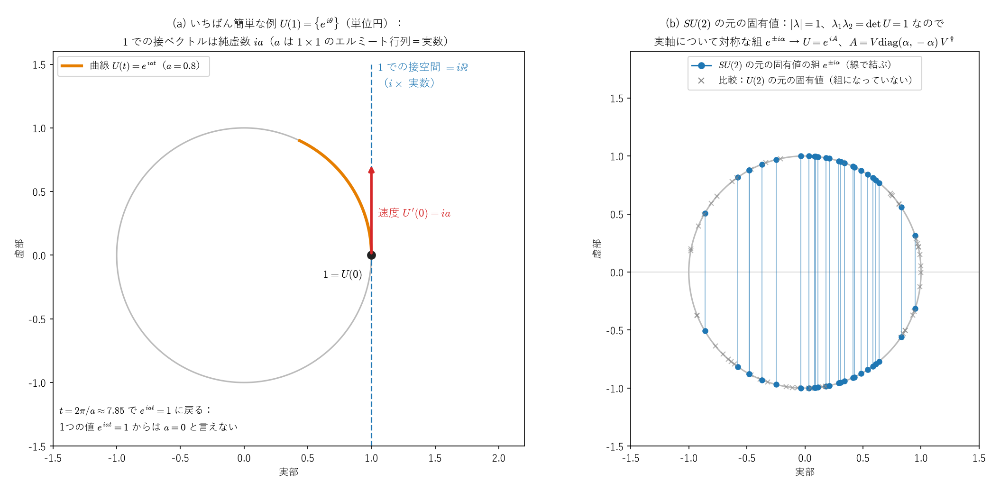

# パウリ行列 ―導出・交換関係・群構造のまとめ―

これまでの $U(2),SU(2)$ の議論の中で天下り的に使ってきたパウリ行列を、今回はその**出自**（なぜこの3つの行列なのか）、**交換関係の証明**（なぜ $[\sigma_i,\sigma_j]=2i\varepsilon_{ijk}\sigma_k$ が成り立つのか）、そして**どんな群・代数を作るのか**という3点について整理します。

---

# Part I：なぜ「トレースゼロのエルミート行列」なのか ―$SU(2)$ の接空間―

前回まで扱った通り、$SU(2)$ の元は $\exp(-i\theta M/2)$（$M$：トレースゼロのエルミート行列）という指数写像で作られました。この Part では、**なぜ「トレースゼロ・エルミート」でなければならないか**を、きちんと導きます。結論を先に言うと、トレースゼロのエルミート行列（に $i$ を掛けたもの）は、$SU(2)$ という曲がった空間の、単位行列 $I$ での**接空間**です。パウリ行列は、その基底です。

## 1. 出発点：$SU(2)$ とは

$$
SU(2)=\{\,U\in M_2(\mathbb C)\ :\ U^\dagger U=I,\ \det U=1\,\}
$$

成分で書くと $U=\begin{pmatrix}a&-b^*\\ b&a^*\end{pmatrix}$（$|a|^2+|b|^2=1$）の形になります。実数4個（$a,b$ の実部と虚部）に拘束が1本かかるので、$SU(2)$ は3次元の球面 $S^3$ と同じ形をした、3次元の多様体です（[ユニタリ行列のノート](unitary_matrix_full_decomposition.md)の Part 0、[四元数とパウリ行列のノート](quaternions_pauli_matrices.md)の Part V）。

## 2. 1つの $U$ だけからは、条件は決まらない

$U=e^{iA}$ と書いたとき、

- $A$ がエルミートなら、$U$ はユニタリです：$U^\dagger=e^{-iA^\dagger}=e^{-iA}=U^{-1}$。
- $\operatorname{tr}A=0$ なら、$\det U=1$ です：[$\det(e^A)=e^{\operatorname{tr}A}$ のノート](det_exp_trace_proof.md)から $\det(e^{iA})=e^{i\operatorname{tr}A}=e^0=1$。

つまり「$A$ がトレースゼロのエルミート行列なら $e^{iA}\in SU(2)$」は成り立ちます（十分条件）。しかし逆向き、「$e^{iA}\in SU(2)$ なら $A$ はトレースゼロのエルミート行列」は、**1つの $U$ だけでは成り立ちません**。例えば $A=\operatorname{diag}(2\pi,0)$ はエルミートで $e^{iA}=I\in SU(2)$ ですが、$\operatorname{tr}A=2\pi\ne0$ です。エルミートでない $A$ で $e^{iA}=I$ となる例もあります（同じノートの「この公式の意味」）。数の指数関数 $e^{i\theta}$ が、$\theta$ に $2\pi$ を足しても変わらないのと同じで、行列の指数関数も「一周して元に戻る」ことがあるからです。

## 3. 曲線の速度で考える：$SU(2)$ の接空間

そこで、1つの $U$ ではなく、$I$ を通る $SU(2)$ の中の**曲線** $U(t)$（$U(0)=I$）を考え、その $t=0$ での速度 $X:=U'(0)$ を調べます。$X$ は、$SU(2)$ の $I$ での**接ベクトル**です。

- **ユニタリ性から**：$U(t)^\dagger U(t)=I$ がすべての $t$ で成り立つので、$t=0$ で微分すると、積の微分と $U(0)=I$ から
$$
X^\dagger+X=0
$$
です。つまり $X$ は**反エルミート**です。
- **行列式から**：$\det U(t)=1$ がすべての $t$ で成り立つので、$t=0$ で微分すると、Jacobiの公式（[$\det$ のノート](det_exp_trace_proof.md)の式21で $M(0)=I$ としたもの）から
$$
\frac{d}{dt}\det U(t)\Big|_{t=0}=\operatorname{tr}X=0
$$
です。

$X=iA$ と書けば、$X^\dagger=-X$ は $A^\dagger=A$、$\operatorname{tr}X=0$ は $\operatorname{tr}A=0$ です。逆に、トレースゼロのエルミート行列 $A$ を選ぶと、曲線 $U(t)=e^{itA}$ はすべての $t$ で $SU(2)$ に入り（§2）、その速度は $U'(0)=iA$ です。したがって

$$
\boxed{T_ISU(2)=\{\,iA\ :\ A^\dagger=A,\ \operatorname{tr}A=0\,\}}
$$

です。これは、[多様体のノート](../03_多様体・微分形式・トポロジー/manifolds_introduction.md#p2-5)の Part II §5 で「直交群 $O(n)$ の $I$ での接空間は反対称行列」を示したのと、まったく同じ計算です（$A^TA=I$ を微分すると $H^T+H=0$）。

**次元の確認**：トレースゼロのエルミート $2\times2$ 行列は実数3個で決まり（Part II §2）、$SU(2)\cong S^3$ の次元3と一致します。

## 4. 逆向き：$SU(2)$ のどの元も $e^{iA}$ と書ける

§3 は $I$ の近くの話でしたが、実は $SU(2)$ の**すべての元**が、トレースゼロのエルミート行列 $A$ を使って $U=e^{iA}$ と書けます。

$U$ はユニタリなので $UU^\dagger=U^\dagger U$（正規行列）で、正規行列はユニタリ行列 $V$ で対角化できます（スペクトル定理）：

$$
U=V\begin{pmatrix}\lambda_1&0\\0&\lambda_2\end{pmatrix}V^\dagger
$$

固有値は $|\lambda_i|=1$ です（$U\mathbf v=\lambda\mathbf v$ なら、ユニタリ行列は長さを保つので $|\mathbf v|=|U\mathbf v|=|\lambda||\mathbf v|$）。さらに $\lambda_1\lambda_2=\det U=1$ です。$\lambda_1=e^{i\alpha}$ と書くと $\lambda_2=e^{-i\alpha}$ なので、

$$
A:=V\begin{pmatrix}\alpha&0\\0&-\alpha\end{pmatrix}V^\dagger
$$

とおくと、$A$ はエルミートで $\operatorname{tr}A=0$、そして

$$
e^{iA}=V\begin{pmatrix}e^{i\alpha}&0\\0&e^{-i\alpha}\end{pmatrix}V^\dagger=U
$$

です（$V^\dagger=V^{-1}$ なので、[$\det$ のノート](det_exp_trace_proof.md)の式2「相似変換は指数の中に通せる」が使えます）。$A$ は一通りには決まりません（$\alpha$ に $2\pi$ を足しても同じ $U$ になる）が、少なくとも1つは必ずあります。

*(a) いちばん簡単な例として、$1\times1$ のユニタリ行列の全体 $U(1)=\{e^{i\theta}\}$（単位円）を描いたものです。$1$ を通る曲線 $e^{iat}$ の速度は $ia$ で、$1$ での接空間は純虚数の全体 $i\mathbb R$ です（$a$ は $1\times1$ のエルミート行列、つまり実数）。$t=2\pi/a$ で $e^{iat}=1$ に戻るので、1つの値だけからは $a=0$ とは言えません（§2）。(b) ランダムに選んだ $SU(2)$ の元の固有値です。どれも単位円の上にあり、$\lambda_1\lambda_2=1$ なので実軸について対称な組 $e^{\pm i\alpha}$ になります（灰色の×は、比較のための一般の $U(2)$ の元の固有値で、組になりません）。図を描くときに、各元について §4 の $A$ を作り、$A$ がトレースゼロのエルミート行列で $e^{iA}=U$ となることを確かめています。*

## 5. まとめ：パウリ行列は、$SU(2)$ の接空間の基底

$$
SU(2)\ \xleftarrow{\ \exp\ }\ \{\,iA\ :\ A\text{ はトレースゼロのエルミート }2\times2\text{ 行列}\,\}=T_ISU(2)
$$

- 接空間は3次元の実ベクトル空間で、§4 から、指数写像による像は $SU(2)$ 全体です。
- **パウリ行列とは、この3次元の空間（トレースゼロのエルミート行列の全体）の基底**です。$i$ を掛ければ、接空間 $T_ISU(2)$ の基底になります。Part II で、エルミート行列の一般形から具体的に作ります。
- Part VI では、$A=-\frac\theta2\,\hat n\cdot\vec\sigma$ とした形 $U=\exp\!\big(-i\frac\theta2\,\hat n\cdot\vec\sigma\big)$ を扱います。

---

# Part II：導出方法1 ―トレースゼロのエルミート行列の基底として

## 1. 一般のエルミート $2\times2$ 行列を書き下す

エルミート行列 $M=M^\dagger$ の一般形を考えます。対角成分は実数でなければならず（$M_{ii}=M_{ii}^*$）、非対角成分は互いに複素共役でなければなりません（$M_{12}=M_{21}^*$）：

$$
M = \begin{pmatrix}a & b-ic\\ b+ic & d\end{pmatrix}\qquad(a,b,c,d\in\mathbb R)
$$

（$M_{12}=b-ic$ と実部・虚部に分けて書いています。）

## 2. トレースゼロの条件を課す

$\operatorname{tr}M=a+d=0$ より $d=-a$：

$$
M = \begin{pmatrix}a & b-ic\\ b+ic & -a\end{pmatrix}\qquad(a,b,c\in\mathbb R)
$$

**自由パラメータは実数3個**（$a,b,c$）になりました。

## 3. これを3つの基底行列に分解する

$M$ を $a,b,c$ それぞれの係数でくくり出します：

$$
M = a\begin{pmatrix}1&0\\0&-1\end{pmatrix} + b\begin{pmatrix}0&1\\1&0\end{pmatrix} + c\begin{pmatrix}0&-i\\i&0\end{pmatrix}
$$

この3つの行列こそが、**パウリ行列**です：

$$
\boxed{\sigma_z=\begin{pmatrix}1&0\\0&-1\end{pmatrix},\qquad \sigma_x=\begin{pmatrix}0&1\\1&0\end{pmatrix},\qquad \sigma_y=\begin{pmatrix}0&-i\\i&0\end{pmatrix}}
$$

つまり：

$$
\boxed{M = a\sigma_z+b\sigma_x+c\sigma_y}
$$

**任意のトレースゼロ・エルミート$2\times2$行列は、必ずこの3つの行列の実数係数の組み合わせとして、一意に書けます。** これがパウリ行列の最も構造的な正体で、「都合よく発明された行列」ではなく、**$SU(2)$の生成子が住む3次元の実ベクトル空間に、自然な座標軸を1本ずつ入れただけ**、というのが正確な理解です。

---

# Part III：導出方法2 ―スピン角運動量の梯子演算子から

もう一つの、より物理的な導出方法です。以前扱った水素原子の角運動量の議論を思い出してください。

## 1. $S_z$ を対角行列として設定する

スピン$\frac12$の系では、$S_z$ の固有値は $\pm\hbar/2$ です。固有状態 $|\!\uparrow\rangle,|\!\downarrow\rangle$ を基底に選べば、$S_z$ はその基底で自動的に対角行列になります：

$$
S_z = \frac\hbar2\begin{pmatrix}1&0\\0&-1\end{pmatrix} = \frac\hbar2\sigma_z
$$

## 2. 梯子演算子 $S_\pm$ を作る

一般の角運動量理論（水素原子の $l,m$ の議論で使った理論と同じもの）から、梯子演算子は

$$
S_+|\!\downarrow\rangle=\hbar|\!\uparrow\rangle,\quad S_+|\!\uparrow\rangle=0,\qquad S_-|\!\uparrow\rangle=\hbar|\!\downarrow\rangle,\quad S_-|\!\downarrow\rangle=0
$$

を満たします（$S_\pm|j,m\rangle=\hbar\sqrt{j(j+1)-m(m\pm1)}\,|j,m\pm1\rangle$ という一般公式に $j=\frac12$ を代入すると、係数がちょうど $\hbar$ になります）。基底 $(|\!\uparrow\rangle,|\!\downarrow\rangle)$ で行列表示すると：

$$
S_+ = \hbar\begin{pmatrix}0&1\\0&0\end{pmatrix},\qquad S_- = \hbar\begin{pmatrix}0&0\\1&0\end{pmatrix}
$$

## 3. $S_x,S_y$ を組み立てる

$S_\pm=S_x\pm iS_y$ の定義から逆算します：

$$
S_x = \frac{S_++S_-}2 = \frac\hbar2\begin{pmatrix}0&1\\1&0\end{pmatrix} = \frac\hbar2\sigma_x
$$

$$
S_y = \frac{S_+-S_-}{2i} = \frac\hbar{2i}\begin{pmatrix}0&1\\-1&0\end{pmatrix} = \frac\hbar2\begin{pmatrix}0&-i\\i&0\end{pmatrix} = \frac\hbar2\sigma_y
$$

**こちらの経路では、パウリ行列は**「**スピン角運動量演算子を $\hbar/2$ で割って無次元化したもの**」として自然に出てきます。歴史的にも、パウリが電子のスピンを記述するために導入したのはまさにこの文脈でした。

---

# Part IV：交換関係 $[\sigma_i,\sigma_j]=2i\varepsilon_{ijk}\sigma_k$ の証明

天下り的に信じるのではなく、実際に行列の掛け算で確認します。3組の組み合わせ（$xy,yz,zx$、循環的な並び）をすべて計算します。

## 1. $[\sigma_x,\sigma_y]$

$$
\sigma_x\sigma_y = \begin{pmatrix}0&1\\1&0\end{pmatrix}\begin{pmatrix}0&-i\\i&0\end{pmatrix} = \begin{pmatrix}i&0\\0&-i\end{pmatrix} = i\sigma_z
$$

$$
\sigma_y\sigma_x = \begin{pmatrix}0&-i\\i&0\end{pmatrix}\begin{pmatrix}0&1\\1&0\end{pmatrix} = \begin{pmatrix}-i&0\\0&i\end{pmatrix} = -i\sigma_z
$$

$$
\boxed{[\sigma_x,\sigma_y] = \sigma_x\sigma_y-\sigma_y\sigma_x = i\sigma_z-(-i\sigma_z) = 2i\sigma_z}
$$

（$\varepsilon_{xyz}=1$ なので $2i\varepsilon_{xyz}\sigma_z=2i\sigma_z$ と一致。）

## 2. $[\sigma_y,\sigma_z]$

$$
\sigma_y\sigma_z = \begin{pmatrix}0&-i\\i&0\end{pmatrix}\begin{pmatrix}1&0\\0&-1\end{pmatrix} = \begin{pmatrix}0&i\\i&0\end{pmatrix} = i\sigma_x
$$

$$
\sigma_z\sigma_y = \begin{pmatrix}1&0\\0&-1\end{pmatrix}\begin{pmatrix}0&-i\\i&0\end{pmatrix} = \begin{pmatrix}0&-i\\-i&0\end{pmatrix} = -i\sigma_x
$$

$$
\boxed{[\sigma_y,\sigma_z] = i\sigma_x-(-i\sigma_x)=2i\sigma_x}
$$

（$\varepsilon_{yzx}=1$ と一致。）

## 3. $[\sigma_z,\sigma_x]$

$$
\sigma_z\sigma_x = \begin{pmatrix}1&0\\0&-1\end{pmatrix}\begin{pmatrix}0&1\\1&0\end{pmatrix} = \begin{pmatrix}0&1\\-1&0\end{pmatrix} = i\sigma_y
$$

（検算：$i\sigma_y=i\begin{pmatrix}0&-i\\i&0\end{pmatrix}=\begin{pmatrix}0&1\\-1&0\end{pmatrix}$、一致。）

$$
\sigma_x\sigma_z = \begin{pmatrix}0&1\\1&0\end{pmatrix}\begin{pmatrix}1&0\\0&-1\end{pmatrix} = \begin{pmatrix}0&-1\\1&0\end{pmatrix} = -i\sigma_y
$$

$$
\boxed{[\sigma_z,\sigma_x] = i\sigma_y-(-i\sigma_y)=2i\sigma_y}
$$

（$\varepsilon_{zxy}=1$ と一致。）

## 4. 残りのケース（同じ添字・反循環）

$[\sigma_i,\sigma_i]=0$ は自明（$\sigma_i\sigma_i-\sigma_i\sigma_i=0$）で、$\varepsilon_{iik}=0$（同じ添字が2つある $\varepsilon$ は常にゼロ）と整合します。$[\sigma_y,\sigma_x]=-[\sigma_x,\sigma_y]=-2i\sigma_z$ のような反循環の並びも、交換子の反対称性 $[\sigma_i,\sigma_j]=-[\sigma_j,\sigma_i]$ と、$\varepsilon$ の反対称性 $\varepsilon_{yxz}=-\varepsilon_{xyz}=-1$ が自動的に整合するので、個別に計算する必要はありません。

**以上3通りの直接計算により、$[\sigma_i,\sigma_j]=2i\varepsilon_{ijk}\sigma_k$ が成り立つことを確認しました。** 天下り的な公式ではなく、$2\times2$の具体的な行列の積を計算するだけで導ける、代数的に完結した事実です。

---

# Part V：おまけ ―反交換関係とクリフォード代数

パウリ行列には、交換関係とペアになる**反交換関係**もあります：

$$
\boxed{\{\sigma_i,\sigma_j\} := \sigma_i\sigma_j+\sigma_j\sigma_i = 2\delta_{ij}I}
$$

例えば $\{\sigma_x,\sigma_y\}=\sigma_x\sigma_y+\sigma_y\sigma_x=i\sigma_z+(-i\sigma_z)=0$（Part IVの計算結果を使うだけ）、$\{\sigma_x,\sigma_x\}=2\sigma_x^2=2I$（$\sigma_x^2=I$ から）。

交換関係と反交換関係を組み合わせると：

$$
\sigma_i\sigma_j = \frac12\{\sigma_i,\sigma_j\}+\frac12[\sigma_i,\sigma_j] = \delta_{ij}I+i\varepsilon_{ijk}\sigma_k
$$

というパウリ行列の積の一般公式が得られます（交換子と反交換子を足すと、2つの積のうち片方が2倍、引くと差になる、という単純な代数）。この反交換関係 $\{\sigma_i,\sigma_j\}=2\delta_{ij}I$ は、**クリフォード代数**と呼ばれる代数構造の定義そのものであり、パウリ行列はクリフォード代数の最小次元での具体的な表現（行列表現）になっています。ディラック方程式のガンマ行列も、次元は違いますが同じクリフォード代数の仲間です。

---

# Part VI：パウリ行列が作る群・代数のまとめ

## 1. リー代数 $\mathfrak{su}(2)$（無限小の生成子として）

$T_a:=\dfrac{\sigma_a}2$（$a=x,y,z$）と定義すると、交換関係は

$$
[T_a,T_b] = i\varepsilon_{abc}T_c
$$

（Part IVの結果を $4$ で割るだけ：$[\sigma_a/2,\sigma_b/2]=\frac14[\sigma_a,\sigma_b]=\frac14\cdot2i\varepsilon_{abc}\sigma_c=i\varepsilon_{abc}(\sigma_c/2)$）となり、これは**リー代数 $\mathfrak{su}(2)$ の標準的な交換関係**（構造定数が $\varepsilon_{abc}$）そのものです。$T_a$（あるいはパウリ行列そのもの）は、この**リー代数の基底**を成しています。

## 2. リー群 $SU(2)$（指数写像で得られる有限変換）

$$
\exp\!\left(-i\frac\theta2\,\hat n\cdot\vec\sigma\right)\qquad(\hat n:\text{単位ベクトル、回転軸})
$$

という指数写像によって、$\mathfrak{su}(2)$（生成子の集まり）から $SU(2)$（実際の回転・量子ゲート）が作られます。これが今回ずっと扱ってきた「生成子 $\to$ 有限変換」の構造です。

## 3. パウリ群（有限群、量子誤り訂正での役割）

パウリ行列自身とその虚数倍・符号違いを全部集めた

$$
\mathcal P_1 := \{\pm I,\pm iI,\pm\sigma_x,\pm i\sigma_x,\pm\sigma_y,\pm i\sigma_y,\pm\sigma_z,\pm i\sigma_z\}
$$

という**16個の行列の集合**は、行列の掛け算について**閉じており**（例えば $\sigma_x\sigma_y=i\sigma_z$ もこの中に含まれる）、単位元 $I$、逆元（$\sigma_i^{-1}=\sigma_i$ 自身、$(iI)^{-1}=-iI$）を持つので、**有限群**（位数16の群、「パウリ群」）を成します。これは量子コンピュータの誤り訂正理論（スタビライザー符号）で中心的な役割を果たす群です。

## 4. まとめの構造図

$$
\boxed{
\begin{aligned}
&\text{パウリ行列 }\sigma_i\ \longrightarrow\ \text{トレースゼロ・エルミート}2\times2\text{行列の基底}\\
&\downarrow\ \div2\\
&\mathfrak{su}(2)\text{の生成子 }T_a=\sigma_a/2,\quad[T_a,T_b]=i\varepsilon_{abc}T_c\quad\text{（リー代数）}\\
&\downarrow\ \exp(-i\theta\,\hat n\cdot\vec T)\\
&SU(2)\quad\text{（リー群、単一量子ビットゲート）}\\
\\
&\text{一方、パウリ行列＋位相}\{\pm1,\pm i\}\text{倍を全部集めると}\\
&\mathcal P_1=\{\pm I,\pm iI,\pm\sigma_x,\dots\}\quad\text{（位数16の有限群、パウリ群）}
\end{aligned}
}
$$

---

# まとめ

- **パウリ行列の正体**：$SU(2)$を生成するために必要な「トレースゼロ・エルミート$2\times2$行列」の自然な基底（3次元の空間に3本の座標軸を入れただけ）
- **物理的な由来**：スピン$\frac12$の角運動量演算子を $\hbar/2$ で割って無次元化したもの（梯子演算子から具体的に構成できる）
- **交換関係**：$2\times2$の具体的な行列の掛け算を3パターン計算するだけで、天下り的な公式ではなく直接確認できる
- **作る代数・群**：$\mathfrak{su}(2)$（無限小の生成子としてのリー代数）、$SU(2)$（指数写像で得られるリー群）、そしてパウリ行列自身とその位相倍を集めた**パウリ群**（位数16の有限群、量子誤り訂正で重要）の、3段階の異なる代数的構造に関わっている
