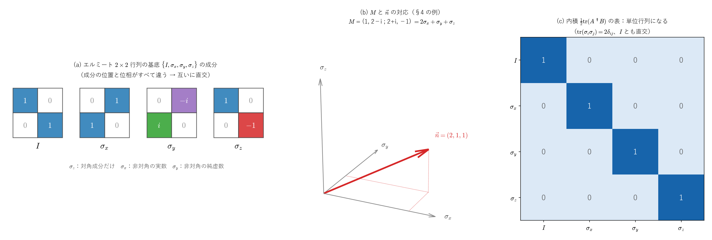
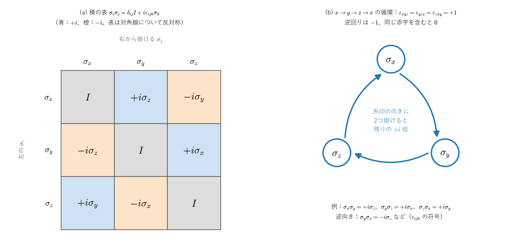
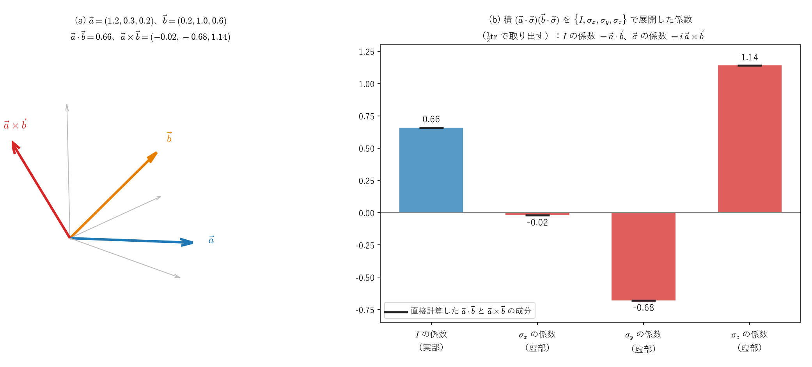
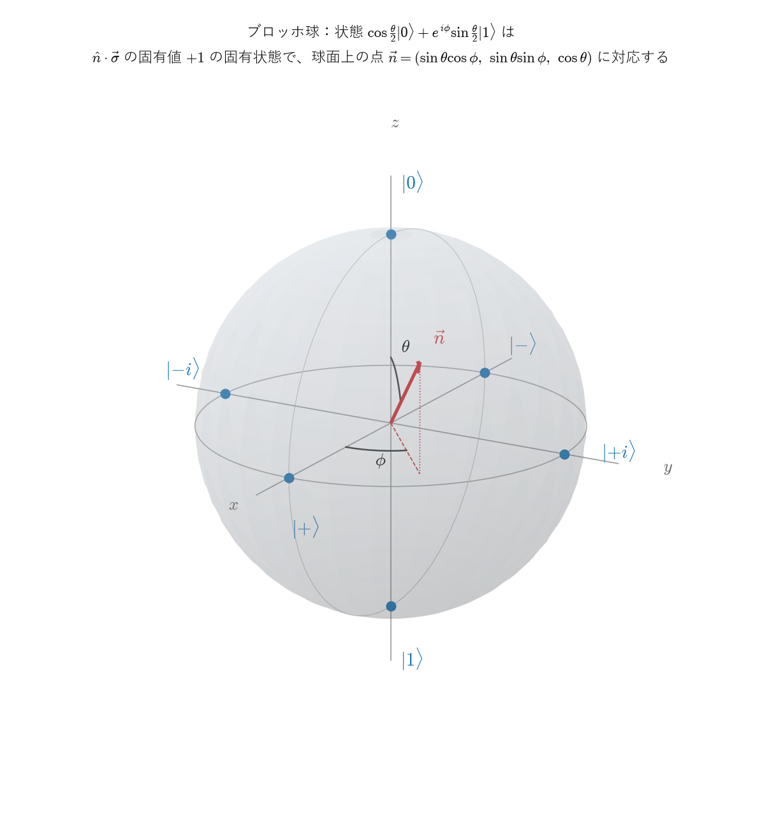
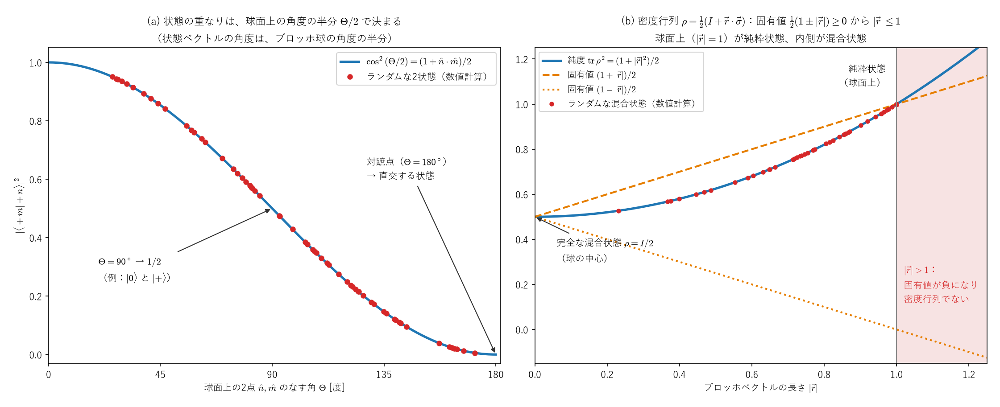

# パウリ行列 ―導出・交換関係・群構造のまとめ―

これまでの $U(2),SU(2)$ の議論の中で天下り的に使ってきたパウリ行列を、今回はその**出自**（なぜこの3つの行列なのか）、**交換関係の証明**（なぜ $[\sigma_i,\sigma_j]=2i\varepsilon_{ijk}\sigma_k$ が成り立つのか）、そして**どんな群・代数を作るのか**という3点について整理します。

---

# Part I：なぜ「トレースゼロのエルミート行列」なのか ―$SU(2)$ の接空間―

前回まで扱った通り、$SU(2)$ の元は $\exp(-i\theta M/2)$（$M$：トレースゼロのエルミート行列）という指数写像で作られました。この Part では、**なぜ「トレースゼロ・エルミート」でなければならないか**を、きちんと導きます。結論を先に言うと、トレースゼロのエルミート行列（に $i$ を掛けたもの）は、$SU(2)$ という曲がった空間の、単位行列 $I$ での**接空間**です。パウリ行列は、その基底です。

## 1. 出発点：$SU(2)$ とは

$$
SU(2)=\{\,U\in M_2(\mathbb C)\ :\ U^\dagger U=I,\ \det U=1\,\}
$$

成分で書くと $U=\begin{pmatrix}a&-b^*\\ b&a^*\end{pmatrix}$（$|a|^2+|b|^2=1$）の形になります。実数4個（$a,b$ の実部と虚部）に拘束が1本かかるので、$SU(2)$ は3次元の球面 $S^3$ と同じ形をした、3次元の多様体です（[ユニタリ行列のノート](unitary_matrix_full_decomposition.md)の Part 0、[四元数とパウリ行列のノート](quaternions_pauli_matrices.md)の Part V）。

## 2. 1つの $U$ だけからは、条件は決まらない

$U=e^{iA}$ と書いたとき、

- $A$ がエルミートなら、$U$ はユニタリです：$U^\dagger=e^{-iA^\dagger}=e^{-iA}=U^{-1}$。
- $\operatorname{tr}A=0$ なら、$\det U=1$ です：[$\det(e^A)=e^{\operatorname{tr}A}$ のノート](det_exp_trace_proof.md)から $\det(e^{iA})=e^{i\operatorname{tr}A}=e^0=1$。

つまり「$A$ がトレースゼロのエルミート行列なら $e^{iA}\in SU(2)$」は成り立ちます（十分条件）。しかし逆向き、「$e^{iA}\in SU(2)$ なら $A$ はトレースゼロのエルミート行列」は、**1つの $U$ だけでは成り立ちません**。例えば $A=\operatorname{diag}(2\pi,0)$ はエルミートで $e^{iA}=I\in SU(2)$ ですが、$\operatorname{tr}A=2\pi\ne0$ です。エルミートでない $A$ で $e^{iA}=I$ となる例もあります（同じノートの「この公式の意味」）。数の指数関数 $e^{i\theta}$ が、$\theta$ に $2\pi$ を足しても変わらないのと同じで、行列の指数関数も「一周して元に戻る」ことがあるからです。

## 3. 曲線の速度で考える：$SU(2)$ の接空間

そこで、1つの $U$ ではなく、$I$ を通る $SU(2)$ の中の**曲線** $U(t)$（$U(0)=I$）を考え、その $t=0$ での速度 $X:=U'(0)$ を調べます。$X$ は、$SU(2)$ の $I$ での**接ベクトル**です。

- **ユニタリ性から**：$U(t)^\dagger U(t)=I$ がすべての $t$ で成り立つので、$t=0$ で微分すると、積の微分と $U(0)=I$ から
$$
X^\dagger+X=0
$$
です。つまり $X$ は**反エルミート**です。
- **行列式から**：$\det U(t)=1$ がすべての $t$ で成り立つので、$t=0$ で微分すると、Jacobiの公式（[$\det$ のノート](det_exp_trace_proof.md)の式21で $M(0)=I$ としたもの）から
$$
\frac{d}{dt}\det U(t)\Big|_{t=0}=\operatorname{tr}X=0
$$
です。

$X=iA$ と書けば、$X^\dagger=-X$ は $A^\dagger=A$、$\operatorname{tr}X=0$ は $\operatorname{tr}A=0$ です。逆に、トレースゼロのエルミート行列 $A$ を選ぶと、曲線 $U(t)=e^{itA}$ はすべての $t$ で $SU(2)$ に入り（§2）、その速度は $U'(0)=iA$ です。したがって

$$
\boxed{T_ISU(2)=\{\,iA\ :\ A^\dagger=A,\ \operatorname{tr}A=0\,\}}
$$

です。これは、[多様体のノート](../03_多様体・微分形式・トポロジー/manifolds_introduction.md#p2-5)の Part II §5 で「直交群 $O(n)$ の $I$ での接空間は反対称行列」を示したのと、まったく同じ計算です（$A^TA=I$ を微分すると $H^T+H=0$）。

**次元の確認**：トレースゼロのエルミート $2\times2$ 行列は実数3個で決まり（Part II §2）、$SU(2)\cong S^3$ の次元3と一致します。

## 4. 逆向き：$SU(2)$ のどの元も $e^{iA}$ と書ける

§3 は $I$ の近くの話でしたが、実は $SU(2)$ の**すべての元**が、トレースゼロのエルミート行列 $A$ を使って $U=e^{iA}$ と書けます。

$U$ はユニタリなので $UU^\dagger=U^\dagger U$（正規行列）で、正規行列はユニタリ行列 $V$ で対角化できます（スペクトル定理）：

$$
U=V\begin{pmatrix}\lambda_1&0\\0&\lambda_2\end{pmatrix}V^\dagger
$$

固有値は $|\lambda_i|=1$ です（$U\mathbf v=\lambda\mathbf v$ なら、ユニタリ行列は長さを保つので $|\mathbf v|=|U\mathbf v|=|\lambda||\mathbf v|$）。さらに $\lambda_1\lambda_2=\det U=1$ です。$\lambda_1=e^{i\alpha}$ と書くと $\lambda_2=e^{-i\alpha}$ なので、

$$
A:=V\begin{pmatrix}\alpha&0\\0&-\alpha\end{pmatrix}V^\dagger
$$

とおくと、$A$ はエルミートで $\operatorname{tr}A=0$、そして

$$
e^{iA}=V\begin{pmatrix}e^{i\alpha}&0\\0&e^{-i\alpha}\end{pmatrix}V^\dagger=U
$$

です（$V^\dagger=V^{-1}$ なので、[$\det$ のノート](det_exp_trace_proof.md)の式2「相似変換は指数の中に通せる」が使えます）。$A$ は一通りには決まりません（$\alpha$ に $2\pi$ を足しても同じ $U$ になる）が、少なくとも1つは必ずあります。

*(a) いちばん簡単な例として、$1\times1$ のユニタリ行列の全体 $U(1)=\{e^{i\theta}\}$（単位円）を描いたものです。$1$ を通る曲線 $e^{iat}$ の速度は $ia$ で、$1$ での接空間は純虚数の全体 $i\mathbb R$ です（$a$ は $1\times1$ のエルミート行列、つまり実数）。$t=2\pi/a$ で $e^{iat}=1$ に戻るので、1つの値だけからは $a=0$ とは言えません（§2）。(b) ランダムに選んだ $SU(2)$ の元の固有値です。どれも単位円の上にあり、$\lambda_1\lambda_2=1$ なので実軸について対称な組 $e^{\pm i\alpha}$ になります（灰色の×は、比較のための一般の $U(2)$ の元の固有値で、組になりません）。図を描くときに、各元について §4 の $A$ を作り、$A$ がトレースゼロのエルミート行列で $e^{iA}=U$ となることを確かめています。*

## 5. まとめ：パウリ行列は、$SU(2)$ の接空間の基底

$$
SU(2)\ \xleftarrow{\ \exp\ }\ \{\,iA\ :\ A\text{ はトレースゼロのエルミート }2\times2\text{ 行列}\,\}=T_ISU(2)
$$

- 接空間は3次元の実ベクトル空間で、§4 から、指数写像による像は $SU(2)$ 全体です。
- **パウリ行列とは、この3次元の空間（トレースゼロのエルミート行列の全体）の基底**です。$i$ を掛ければ、接空間 $T_ISU(2)$ の基底になります。Part II で、エルミート行列の一般形から具体的に作ります。
- Part VII では、$A=-\frac\theta2\,\hat n\cdot\vec\sigma$ とした形 $U=\exp\!\big(-i\frac\theta2\,\hat n\cdot\vec\sigma\big)$ を扱います。

---

# Part II：導出方法1 ―トレースゼロのエルミート行列の基底として

Part I で、$SU(2)$ の生成子が住む空間は「トレースゼロのエルミート $2\times2$ 行列」の全体だと分かりました。この Part では、この空間に座標軸を入れて、パウリ行列を具体的に作ります。

## 1. 一般のエルミート $2\times2$ 行列を書き下す

エルミート行列 $M=M^\dagger$ の一般形を考えます。対角成分は実数でなければならず（$M_{ii}=M_{ii}^*$）、非対角成分は互いに複素共役でなければなりません（$M_{12}=M_{21}^*$）：

$$
M = \begin{pmatrix}a & b-ic\\ b+ic & d\end{pmatrix}\qquad(a,b,c,d\in\mathbb R)
$$

（左下の成分を $M_{21}=b+ic$ と実部・虚部に分けて書いています。）

## 2. トレースゼロの条件を課す

$\operatorname{tr}M=a+d=0$ より $d=-a$：

$$
M = \begin{pmatrix}a & b-ic\\ b+ic & -a\end{pmatrix}\qquad(a,b,c\in\mathbb R)
$$

**自由パラメータは実数3個**（$a,b,c$）になりました。

## 3. 3つの基底行列に分解する

以下、$x,y,z$ の順に並べるため、$b,c,a$ を $n_x,n_y,n_z$ と書き直します。$M$ をそれぞれの係数でくくり出すと：

$$
M=\begin{pmatrix}n_z&n_x-in_y\\ n_x+in_y&-n_z\end{pmatrix}
=n_x\begin{pmatrix}0&1\\1&0\end{pmatrix}+n_y\begin{pmatrix}0&-i\\i&0\end{pmatrix}+n_z\begin{pmatrix}1&0\\0&-1\end{pmatrix}
$$

この3つの行列こそが、**パウリ行列**です：

$$
\boxed{\sigma_x=\begin{pmatrix}0&1\\1&0\end{pmatrix},\qquad \sigma_y=\begin{pmatrix}0&-i\\i&0\end{pmatrix},\qquad \sigma_z=\begin{pmatrix}1&0\\0&-1\end{pmatrix}}
$$

つまり、$\vec n=(n_x,n_y,n_z)\in\mathbb R^3$、$\vec\sigma=(\sigma_x,\sigma_y,\sigma_z)$ として：

$$
\boxed{M = n_x\sigma_x+n_y\sigma_y+n_z\sigma_z=\vec n\cdot\vec\sigma}
$$

**トレースゼロのエルミート $2\times2$ 行列 $M$ と、3次元の実ベクトル $\vec n$ が、1対1に対応します。** パウリ行列は「都合よく発明された行列」ではなく、$SU(2)$ の生成子が住む3次元の実ベクトル空間に、自然な座標軸を1本ずつ入れただけ、というのが正確な理解です（「1対1」であること、つまり $\vec n$ が $M$ から一通りに決まることは、§4 で確かめます）。

**$\sigma_y$ の符号について**：$\sigma_y$ の右上が $-i$ なのは、左下の成分 $M_{21}$ の虚部を $n_y$ と選んだからです。右上の虚部を $n_y$ と選ぶと $\sigma_y$ の符号が反対になりますが、その場合は $\sigma_x\sigma_y=-i\sigma_z$ となり、Part IV の交換関係 $[\sigma_x,\sigma_y]=2i\sigma_z$（スピン角運動量 $\vec S=\frac\hbar2\vec\sigma$ の $[S_x,S_y]=i\hbar S_z$）と符号が合いません。$x,y,z$ の右手系の順序と、交換関係の符号がそろうように、この選び方が標準になっています。

## 4. 「一通りに書ける」ことの証明：トレースで係数を取り出す

**行列の内積**：$2\times2$ 行列 $A,B$ に対して

$$
\langle A,B\rangle:=\operatorname{tr}(A^\dagger B)=\sum_{k,l}\overline{A_{kl}}\,B_{kl}
$$

と定めると、これは4つの成分を並べたベクトルどうしの（複素）内積と同じです（**ヒルベルト・シュミット内積**）。$A$ がエルミートなら $A^\dagger=A$ なので、$\langle A,B\rangle=\operatorname{tr}(AB)$ です。

**パウリ行列は互いに直交している**：成分の位置を見ると、$\sigma_z$ は対角成分だけ、$\sigma_x$ と $\sigma_y$ は非対角成分だけを持ちます。そのため $\sigma_z$ と $\sigma_x,\sigma_y$ の内積は $0$ です。$\sigma_x$ と $\sigma_y$ は位置が同じですが、位相が違います：

$$
\langle\sigma_x,\sigma_y\rangle=\overline{1}\cdot(-i)+\overline{1}\cdot i=0,\qquad
\langle\sigma_i,\sigma_i\rangle=|{\pm1}|^2+|{\pm1}|^2\ \text{または}\ |{\pm i}|^2+|{\pm i}|^2=2
$$

まとめると

$$
\boxed{\operatorname{tr}(\sigma_i\sigma_j)=2\delta_{ij}}
$$

**係数の取り出し**：$M=\sum_jn_j\sigma_j$ に左から $\sigma_i$ を掛けてトレースを取ると、

$$
\operatorname{tr}(\sigma_iM)=\sum_jn_j\operatorname{tr}(\sigma_i\sigma_j)=2n_i,\qquad\text{つまり}\qquad\boxed{n_i=\tfrac12\operatorname{tr}(\sigma_iM)}
$$

です。係数が $M$ から一通りに決まるので、$M=\vec n\cdot\vec\sigma$ という表し方は一通りです。特に、$\sum_jn_j\sigma_j=0$ なら $n_i=0$ なので、3つのパウリ行列は1次独立です。

**例**：$M=\begin{pmatrix}1&2-i\\2+i&-1\end{pmatrix}$ なら、

$$
\begin{aligned}
n_x&=\tfrac12\operatorname{tr}(\sigma_xM)=\tfrac12\operatorname{tr}\begin{pmatrix}2+i&-1\\1&2-i\end{pmatrix}=2\\
n_y&=\tfrac12\operatorname{tr}(\sigma_yM)=\tfrac12\operatorname{tr}\begin{pmatrix}1-2i&i\\i&1+2i\end{pmatrix}=1\\
n_z&=\tfrac12\operatorname{tr}(\sigma_zM)=\tfrac12\,(1+1)=1
\end{aligned}
$$

で、$M=2\sigma_x+\sigma_y+\sigma_z$ です（§3 の形と見比べると、$n_x=\operatorname{Re}M_{21}$、$n_y=\operatorname{Im}M_{21}$、$n_z=M_{11}$ で、確かに一致します）。

## 5. 単位行列を加えると、エルミート行列全体の基底になる

トレースゼロでない一般のエルミート行列も、単位行列 $I$ を加えれば書けます。$\operatorname{tr}(I\cdot I)=2$、$\operatorname{tr}(I\sigma_i)=\operatorname{tr}\sigma_i=0$ なので、$I$ もパウリ行列と直交していて、§4 と同じ計算から

$$
\boxed{M=\tfrac12\operatorname{tr}(M)\,I+\sum_i\tfrac12\operatorname{tr}(\sigma_iM)\,\sigma_i}
$$

です。

- $M$ がエルミートなら、係数はすべて実数です（エルミート行列どうしの積のトレースは実数：$\operatorname{tr}(\sigma_iM)$ の複素共役は $\operatorname{tr}\big((\sigma_iM)^\dagger\big)=\operatorname{tr}(M\sigma_i)=\operatorname{tr}(\sigma_iM)$）。エルミート $2\times2$ 行列の全体は、$\{I,\sigma_x,\sigma_y,\sigma_z\}$ を基底とする、4次元の実ベクトル空間です。
- 係数を複素数まで許せば、この式は**任意の $2\times2$ 複素行列**で成り立ちます。$2\times2$ 複素行列の全体は複素4次元で、$\{I,\sigma_x,\sigma_y,\sigma_z\}$ はその基底です。例えば $\begin{pmatrix}0&1\\0&0\end{pmatrix}=\frac12(\sigma_x+i\sigma_y)$ です。
- 量子ビットの状態を表す密度行列 $\rho$ は、トレースが $1$ のエルミート行列なので、$\rho=\frac12\big(I+\vec r\cdot\vec\sigma\big)$ と書けます。この $\vec r$ が、ブロッホ球の点（ブロッホベクトル）になります（Part VI §6）。

*(a) 基底 $\{I,\sigma_x,\sigma_y,\sigma_z\}$ の成分です。$\sigma_z$ は対角成分だけ、$\sigma_x$ は非対角の実数、$\sigma_y$ は非対角の純虚数で、成分の位置と位相がすべて違います。(b) §4 の例 $M=2\sigma_x+\sigma_y+\sigma_z$ と、対応するベクトル $\vec n=(2,1,1)$ です。(c) 内積 $\frac12\operatorname{tr}(A^\dagger B)$ を表にすると単位行列になり、4つの行列が互いに直交していることが分かります。図を描くときに、ランダムな複素行列が §5 の式で展開できること、エルミート行列なら係数が実数になることを確かめています。*

## 6. パウリ行列の基本性質

| 性質 | $\sigma_x$ | $\sigma_y$ | $\sigma_z$ | 理由 |
|---|---|---|---|---|
| エルミート $\sigma^\dagger=\sigma$ | ○ | ○ | ○ | 作り方から |
| 2乗すると単位行列 $\sigma^2=I$ | ○ | ○ | ○ | 直接計算（例：$\sigma_y^2$ の対角成分は $(-i)\cdot i=1$ と $i\cdot(-i)=1$） |
| ユニタリ $\sigma^\dagger\sigma=I$ | ○ | ○ | ○ | エルミートで、かつ $\sigma^2=I$ |
| トレース | $0$ | $0$ | $0$ | 作り方から |
| 行列式 | $-1$ | $-1$ | $-1$ | 直接計算 |
| 固有値 | $\pm1$ | $\pm1$ | $\pm1$ | 下の説明 |
| 固有値 $+1$ の固有ベクトル | $\frac1{\sqrt2}(1,1)$ | $\frac1{\sqrt2}(1,i)$ | $(1,0)$ | 直接確かめられる |
| 固有値 $-1$ の固有ベクトル | $\frac1{\sqrt2}(1,-1)$ | $\frac1{\sqrt2}(1,-i)$ | $(0,1)$ | 直接確かめられる |

**固有値が $\pm1$ になる理由**：$\sigma\mathbf v=\lambda\mathbf v$ なら、$\mathbf v=\sigma^2\mathbf v=\lambda^2\mathbf v$ なので $\lambda^2=1$、つまり $\lambda=\pm1$ です。さらに、2つの固有値の和はトレース $0$ なので、$+1$ と $-1$ が1つずつです。同じ議論は、単位ベクトル $\hat n$ についての $\hat n\cdot\vec\sigma$ にも使えます（Part VI で、その固有ベクトルがブロッホ球の点になることを見ます）。

**$\sigma_i$ 自身は $SU(2)$ の元ではない**：$\det\sigma_i=-1$ なので、$\sigma_i$ はユニタリですが $SU(2)$ には入りません。一方、$i\sigma_i$ は $\det(i\sigma_i)=i^2\cdot(-1)=1$ で $SU(2)$ の元です。これは、Part VII の回転 $\exp(-i\frac\theta2\hat n\cdot\vec\sigma)$ で $\theta=-\pi$ としたもの（符号を除いて、角度 $\pi$ の回転）にあたります。

---

# Part III：導出方法2 ―スピン角運動量の梯子演算子から

もう一つの、より物理的な導出方法です。以前扱った水素原子の角運動量の議論を思い出してください。

## 1. $S_z$ を対角行列として設定する

スピン$\frac12$の系では、$S_z$ の固有値は $\pm\hbar/2$ です。固有状態 $|\!\uparrow\rangle,|\!\downarrow\rangle$ を基底に選べば、$S_z$ はその基底で自動的に対角行列になります：

$$
S_z = \frac\hbar2\begin{pmatrix}1&0\\0&-1\end{pmatrix} = \frac\hbar2\sigma_z
$$

## 2. 梯子演算子 $S_\pm$ を作る

一般の角運動量理論（水素原子の $l,m$ の議論で使った理論と同じもの）から、梯子演算子は

$$
S_+|\!\downarrow\rangle=\hbar|\!\uparrow\rangle,\quad S_+|\!\uparrow\rangle=0,\qquad S_-|\!\uparrow\rangle=\hbar|\!\downarrow\rangle,\quad S_-|\!\downarrow\rangle=0
$$

を満たします（$S_\pm|j,m\rangle=\hbar\sqrt{j(j+1)-m(m\pm1)}\,|j,m\pm1\rangle$ という一般公式に $j=\frac12$ を代入すると、係数がちょうど $\hbar$ になります）。基底 $(|\!\uparrow\rangle,|\!\downarrow\rangle)$ で行列表示すると：

$$
S_+ = \hbar\begin{pmatrix}0&1\\0&0\end{pmatrix},\qquad S_- = \hbar\begin{pmatrix}0&0\\1&0\end{pmatrix}
$$

## 3. $S_x,S_y$ を組み立てる

$S_\pm=S_x\pm iS_y$ の定義から逆算します：

$$
S_x = \frac{S_++S_-}2 = \frac\hbar2\begin{pmatrix}0&1\\1&0\end{pmatrix} = \frac\hbar2\sigma_x
$$

$$
S_y = \frac{S_+-S_-}{2i} = \frac\hbar{2i}\begin{pmatrix}0&1\\-1&0\end{pmatrix} = \frac\hbar2\begin{pmatrix}0&-i\\i&0\end{pmatrix} = \frac\hbar2\sigma_y
$$

**こちらの経路では、パウリ行列は**「**スピン角運動量演算子を $\hbar/2$ で割って無次元化したもの**」として自然に出てきます。歴史的にも、パウリが電子のスピンを記述するために導入したのはまさにこの文脈でした。

---

# Part IV：交換関係 $[\sigma_i,\sigma_j]=2i\varepsilon_{ijk}\sigma_k$ の証明

天下り的に信じるのではなく、実際に行列の掛け算で確認します。3組の組み合わせ（$xy,yz,zx$、循環的な並び）をすべて計算します。

**記号 $\varepsilon_{ijk}$（レヴィ＝チヴィタ記号）**：添字 $i,j,k$ は $x,y,z$ のどれかで、

$$
\varepsilon_{xyz}=\varepsilon_{yzx}=\varepsilon_{zxy}=+1,\qquad \varepsilon_{xzy}=\varepsilon_{zyx}=\varepsilon_{yxz}=-1,\qquad \text{同じ添字を含むものは }0
$$

と定めます。$x\to y\to z\to x$ の順に回る並びが $+1$、逆回りが $-1$ です。$[\sigma_i,\sigma_j]=2i\varepsilon_{ijk}\sigma_k$ は $k$ について和を取る式ですが、$i\ne j$ のとき $0$ でないのは、$i,j$ のどちらとも違う $k$ の1項だけです。3次元の外積も、同じ記号で $(\vec a\times\vec b)_k=\sum_{i,j}\varepsilon_{ijk}a_ib_j$ と書けます（Part V §3 で使います）。

## 1. $[\sigma_x,\sigma_y]$

$$
\sigma_x\sigma_y = \begin{pmatrix}0&1\\1&0\end{pmatrix}\begin{pmatrix}0&-i\\i&0\end{pmatrix} = \begin{pmatrix}i&0\\0&-i\end{pmatrix} = i\sigma_z
$$

$$
\sigma_y\sigma_x = \begin{pmatrix}0&-i\\i&0\end{pmatrix}\begin{pmatrix}0&1\\1&0\end{pmatrix} = \begin{pmatrix}-i&0\\0&i\end{pmatrix} = -i\sigma_z
$$

$$
\boxed{[\sigma_x,\sigma_y] = \sigma_x\sigma_y-\sigma_y\sigma_x = i\sigma_z-(-i\sigma_z) = 2i\sigma_z}
$$

（$\varepsilon_{xyz}=1$ なので $2i\varepsilon_{xyz}\sigma_z=2i\sigma_z$ と一致。）

## 2. $[\sigma_y,\sigma_z]$

$$
\sigma_y\sigma_z = \begin{pmatrix}0&-i\\i&0\end{pmatrix}\begin{pmatrix}1&0\\0&-1\end{pmatrix} = \begin{pmatrix}0&i\\i&0\end{pmatrix} = i\sigma_x
$$

$$
\sigma_z\sigma_y = \begin{pmatrix}1&0\\0&-1\end{pmatrix}\begin{pmatrix}0&-i\\i&0\end{pmatrix} = \begin{pmatrix}0&-i\\-i&0\end{pmatrix} = -i\sigma_x
$$

$$
\boxed{[\sigma_y,\sigma_z] = i\sigma_x-(-i\sigma_x)=2i\sigma_x}
$$

（$\varepsilon_{yzx}=1$ と一致。）

## 3. $[\sigma_z,\sigma_x]$

$$
\sigma_z\sigma_x = \begin{pmatrix}1&0\\0&-1\end{pmatrix}\begin{pmatrix}0&1\\1&0\end{pmatrix} = \begin{pmatrix}0&1\\-1&0\end{pmatrix} = i\sigma_y
$$

（検算：$i\sigma_y=i\begin{pmatrix}0&-i\\i&0\end{pmatrix}=\begin{pmatrix}0&1\\-1&0\end{pmatrix}$、一致。）

$$
\sigma_x\sigma_z = \begin{pmatrix}0&1\\1&0\end{pmatrix}\begin{pmatrix}1&0\\0&-1\end{pmatrix} = \begin{pmatrix}0&-1\\1&0\end{pmatrix} = -i\sigma_y
$$

$$
\boxed{[\sigma_z,\sigma_x] = i\sigma_y-(-i\sigma_y)=2i\sigma_y}
$$

（$\varepsilon_{zxy}=1$ と一致。）

## 4. 残りのケース（同じ添字・反循環）

$[\sigma_i,\sigma_i]=0$ は自明（$\sigma_i\sigma_i-\sigma_i\sigma_i=0$）で、$\varepsilon_{iik}=0$（同じ添字が2つある $\varepsilon$ は常にゼロ）と整合します。$[\sigma_y,\sigma_x]=-[\sigma_x,\sigma_y]=-2i\sigma_z$ のような反循環の並びも、交換子の反対称性 $[\sigma_i,\sigma_j]=-[\sigma_j,\sigma_i]$ と、$\varepsilon$ の反対称性 $\varepsilon_{yxz}=-\varepsilon_{xyz}=-1$ が自動的に整合するので、個別に計算する必要はありません。

**以上3通りの直接計算により、$[\sigma_i,\sigma_j]=2i\varepsilon_{ijk}\sigma_k$ が成り立つことを確認しました。** 天下り的な公式ではなく、$2\times2$の具体的な行列の積を計算するだけで導ける、代数的に完結した事実です。

## 5. まとめ：積の表

§1〜§3 の計算と $\sigma_i^2=I$（Part II §6）をまとめると、9通りの積は次の図のようになります。

*(a) 左の $\sigma_i$ と右の $\sigma_j$ の積 $\sigma_i\sigma_j$ です。対角線は $I$、それ以外は残りの1つの $\pm i$ 倍で、表は対角線について反対称です（$i\ne j$ なら $\sigma_j\sigma_i=-\sigma_i\sigma_j$）。(b) $x\to y\to z\to x$ の向きに2つ掛けると残りの $+i$ 倍、逆向きなら $-i$ 倍で、この符号が $\varepsilon_{ijk}$ です。図を描くときに、9通りの積と、交換関係・反交換関係を数値で確かめています。*

この表の9通りの積、3つの交換関係、3つの反交換関係は、Lean でも証明しています（[Pauli.lean](../../lean4/QuantumStudy/Pauli.lean)）。

---

# Part V：反交換関係と積の一般公式 ―内積と外積―

## 1. 反交換関係

パウリ行列には、交換関係とペアになる**反交換関係**もあります：

$$
\boxed{\{\sigma_i,\sigma_j\} := \sigma_i\sigma_j+\sigma_j\sigma_i = 2\delta_{ij}I}
$$

例えば $\{\sigma_x,\sigma_y\}=\sigma_x\sigma_y+\sigma_y\sigma_x=i\sigma_z+(-i\sigma_z)=0$（Part IVの計算結果を使うだけ）、$\{\sigma_x,\sigma_x\}=2\sigma_x^2=2I$（$\sigma_x^2=I$ から）です。

## 2. 積の一般公式

交換関係と反交換関係を足して2で割ると、

$$
\boxed{\sigma_i\sigma_j = \frac12\{\sigma_i,\sigma_j\}+\frac12[\sigma_i,\sigma_j] = \delta_{ij}I+i\varepsilon_{ijk}\sigma_k}
$$

です（$\frac12(\sigma_i\sigma_j+\sigma_j\sigma_i)+\frac12(\sigma_i\sigma_j-\sigma_j\sigma_i)=\sigma_i\sigma_j$）。これは、Part IV §5 の積の表を1本の式にまとめたものです。

## 3. ベクトルとの積：内積と外積が同時に現れる

実ベクトル $\vec a$ について、$\vec a\cdot\vec\sigma:=a_x\sigma_x+a_y\sigma_y+a_z\sigma_z$ と書きます。§2 の公式から

$$
(\vec a\cdot\vec\sigma)(\vec b\cdot\vec\sigma)=\sum_{i,j}a_ib_j\,\sigma_i\sigma_j=\sum_{i,j}a_ib_j\big(\delta_{ij}I+i\varepsilon_{ijk}\sigma_k\big)
=\Big(\sum_ia_ib_i\Big)I+i\sum_k\Big(\sum_{i,j}\varepsilon_{ijk}a_ib_j\Big)\sigma_k
$$

です。1つ目の括弧は内積 $\vec a\cdot\vec b$、2つ目の括弧は外積の成分 $(\vec a\times\vec b)_k$（Part IV の冒頭）なので、

$$
\boxed{(\vec a\cdot\vec\sigma)(\vec b\cdot\vec\sigma)=(\vec a\cdot\vec b)\,I+i\,(\vec a\times\vec b)\cdot\vec\sigma}
$$

です。パウリ行列で表した2つのベクトルの積は、**内積（$I$ の係数）と外積（$\vec\sigma$ の係数）を同時に含みます**。

*(a) 例として選んだ2つのベクトル $\vec a,\vec b$ と、その外積 $\vec a\times\vec b$ です。(b) 積 $(\vec a\cdot\vec\sigma)(\vec b\cdot\vec\sigma)$ を、Part II §5 の方法（$\frac12\operatorname{tr}$）で $\{I,\sigma_x,\sigma_y,\sigma_z\}$ に展開した係数です。$I$ の係数は実数で内積 $\vec a\cdot\vec b$ に、$\vec\sigma$ の係数は純虚数で $i\,\vec a\times\vec b$ に一致します（黒い線が、直接計算した値）。図を描くときに、下の3つの系と四元数の対応（§4）も数値で確かめています。*

この公式から、次のことがすぐに分かります。

- **2乗**：$\vec b=\vec a$ とすると $\vec a\times\vec a=0$ なので、$(\vec a\cdot\vec\sigma)^2=|\vec a|^2I$ です。特に単位ベクトル $\hat n$ なら $(\hat n\cdot\vec\sigma)^2=I$ で、Part II §6 と同じ議論から、固有値は $\pm1$ です。Part VI の固有ベクトルと、Part VII の指数関数の計算で、この性質を使います。
- **交換子は外積**：$[\vec a\cdot\vec\sigma,\vec b\cdot\vec\sigma]=2i\,(\vec a\times\vec b)\cdot\vec\sigma$ です（$\vec b\cdot\vec a=\vec a\cdot\vec b$、$\vec b\times\vec a=-\vec a\times\vec b$ なので、内積の部分が打ち消し合います）。パウリ行列の交換関係は、3次元の外積と同じ構造をしています。これが、$SU(2)$ が3次元の回転と結びつく理由の1つです（Part VII）。
- **反交換子は内積**：$\{\vec a\cdot\vec\sigma,\vec b\cdot\vec\sigma\}=2(\vec a\cdot\vec b)I$ です。特に、$\vec a\perp\vec b$ なら、$\vec a\cdot\vec\sigma$ と $\vec b\cdot\vec\sigma$ は反交換します。

## 4. 四元数との対応

[四元数とパウリ行列のノート](quaternions_pauli_matrices.md)では、四元数の単位を $\mathbf i=-i\sigma_x,\ \mathbf j=-i\sigma_y,\ \mathbf k=-i\sigma_z$ と行列で表しました。§3 の公式にこの対応を当てはめると、

$$
(-i\,\vec a\cdot\vec\sigma)(-i\,\vec b\cdot\vec\sigma)=-(\vec a\cdot\vec\sigma)(\vec b\cdot\vec\sigma)=-(\vec a\cdot\vec b)\,I+(\vec a\times\vec b)\cdot(-i\vec\sigma)
$$

です。左辺は、実部が $0$ の四元数 $a_x\mathbf i+a_y\mathbf j+a_z\mathbf k$ と $b_x\mathbf i+b_y\mathbf j+b_z\mathbf k$ の積で、右辺は実部 $-\vec a\cdot\vec b$、虚部 $\vec a\times\vec b$ の四元数です。これは、四元数のノートの Part VI の積の公式 $(a+\mathbf u)(b+\mathbf v)=(ab-\mathbf u\cdot\mathbf v)+(a\mathbf v+b\mathbf u+\mathbf u\times\mathbf v)$ で、実部 $a=b=0$ としたものと一致します。例えば $\vec a=(1,0,0)$、$\vec b=(0,1,0)$ とすると、$\mathbf{ij}=\mathbf k$ です。

## 5. クリフォード代数（関連する話題）

反交換関係 $\{\sigma_i,\sigma_j\}=2\delta_{ij}I$ は、**クリフォード代数**と呼ばれる代数構造の定義そのもので、パウリ行列は、クリフォード代数の最小次元での具体的な表現（行列表現）になっています。ディラック方程式のガンマ行列も、次元は違いますが同じクリフォード代数の仲間です（[一般化パウリ行列のノート](generalized_pauli_and_sun_generators.md)の Part V）。

---

# Part VI：$\hat n\cdot\vec\sigma$ の固有ベクトルとブロッホ球

Part V §3 で、単位ベクトル $\hat n$ について $(\hat n\cdot\vec\sigma)^2=I$ が分かりました。この Part では、$\hat n\cdot\vec\sigma$ の固有ベクトルを求め、**量子ビットのすべての状態が、球面上の点で表せる**（ブロッホ球）ことを導きます。以下、$|0\rangle=\begin{pmatrix}1\\0\end{pmatrix}$、$|1\rangle=\begin{pmatrix}0\\1\end{pmatrix}$ と書きます（$\sigma_z$ の固有値 $+1,-1$ の固有ベクトル）。

## 1. 固有値は $\pm1$

$\hat n\cdot\vec\sigma$ はエルミートで、$(\hat n\cdot\vec\sigma)^2=I$、$\operatorname{tr}(\hat n\cdot\vec\sigma)=0$ です。Part II §6 と同じ議論（$\lambda^2=1$ で、2つの固有値の和が $0$）から、固有値は $+1$ と $-1$ が1つずつです。

## 2. 固有ベクトルを求める

単位ベクトルを球座標で $\hat n=(\sin\theta\cos\phi,\ \sin\theta\sin\phi,\ \cos\theta)$（$0\leq\theta\leq\pi$）と書くと、Part II §3 の形から

$$
\hat n\cdot\vec\sigma=\begin{pmatrix}\cos\theta&\sin\theta\,e^{-i\phi}\\ \sin\theta\,e^{i\phi}&-\cos\theta\end{pmatrix}
$$

です（$n_x\pm in_y=\sin\theta\,e^{\pm i\phi}$）。固有値 $+1$ の固有ベクトル $(v_1,v_2)$ は、1行目から $(\cos\theta-1)v_1+\sin\theta\,e^{-i\phi}v_2=0$、つまり

$$
\frac{v_2}{v_1}=\frac{1-\cos\theta}{\sin\theta}\,e^{i\phi}=\frac{2\sin^2(\theta/2)}{2\sin(\theta/2)\cos(\theta/2)}\,e^{i\phi}=e^{i\phi}\tan\frac\theta2
$$

を満たします（半角の公式 $1-\cos\theta=2\sin^2\frac\theta2$、$\sin\theta=2\sin\frac\theta2\cos\frac\theta2$）。長さを $1$ にそろえると：

$$
\boxed{|{+}\hat n\rangle=\cos\frac\theta2\,|0\rangle+e^{i\phi}\sin\frac\theta2\,|1\rangle,\qquad |{-}\hat n\rangle=\sin\frac\theta2\,|0\rangle-e^{i\phi}\cos\frac\theta2\,|1\rangle}
$$

$|{-}\hat n\rangle$ は、$\theta\to\pi-\theta$、$\phi\to\phi+\pi$（**反対側の点** $-\hat n$）とした $|{+}({-}\hat n)\rangle$ と同じです。$\hat n$ を $x,y,z$ 軸の方向にとると、Part II §6 の表の固有ベクトルが出てきます：

| $\hat n$ | $(\theta,\phi)$ | $\vert {+}\hat n\rangle$ | よく使う名前 |
|---|---|---|---|
| $+z$ | $(0,\ -)$ | $\vert 0\rangle$ | |
| $-z$ | $(\pi,\ -)$ | $\vert 1\rangle$ | |
| $+x$ | $(\pi/2,\ 0)$ | $\frac1{\sqrt2}(\vert 0\rangle+\vert 1\rangle)$ | $\vert {+}\rangle$ |
| $-x$ | $(\pi/2,\ \pi)$ | $\frac1{\sqrt2}(\vert 0\rangle-\vert 1\rangle)$ | $\vert {-}\rangle$ |
| $+y$ | $(\pi/2,\ \pi/2)$ | $\frac1{\sqrt2}(\vert 0\rangle+i\vert 1\rangle)$ | $\vert {+i}\rangle$ |
| $-y$ | $(\pi/2,\ -\pi/2)$ | $\frac1{\sqrt2}(\vert 0\rangle-i\vert 1\rangle)$ | $\vert {-i}\rangle$ |

## 3. すべての状態は、球面上の1点で表せる（ブロッホ球）

逆に、長さ $1$ の任意の状態 $|\psi\rangle=\alpha|0\rangle+\beta|1\rangle$（$|\alpha|^2+|\beta|^2=1$）を考えます。量子力学では、全体に掛かる位相 $e^{i\gamma}$（**大域位相**）は観測できないので、$|\psi\rangle$ と $e^{i\gamma}|\psi\rangle$ は同じ状態です。そこで $\alpha$ が $0$ 以上の実数になるように位相をそろえると、$|\alpha|^2+|\beta|^2=1$ から

$$
\alpha=\cos\frac\theta2,\qquad \beta=e^{i\phi}\sin\frac\theta2\qquad(0\leq\theta\leq\pi)
$$

と書けます。これは §2 の $|{+}\hat n\rangle$ そのものです。したがって、

$$
\boxed{\text{量子ビットの状態（大域位相を除く）}\ \longleftrightarrow\ \text{単位球面上の点 }\hat n}
$$

という1対1の対応があります。この球面を**ブロッホ球**と呼びます。

*ブロッホ球と、§2 の表の6つの状態です。北極が $|0\rangle$、南極が $|1\rangle$、赤道上の $\pm x$ が $|{\pm}\rangle$、$\pm y$ が $|{\pm i}\rangle$ です。一般の状態 $\cos\frac\theta2|0\rangle+e^{i\phi}\sin\frac\theta2|1\rangle$ は、北極からの角度 $\theta$、経度 $\phi$ の点 $\hat n$ に対応します。図を描くときに、6つの点が $\hat n\cdot\vec\sigma$ の固有値 $+1$ の固有状態であることを確かめています。*

**補足（極は座標特異点）**：$\theta=0$（北極、$|0\rangle$）と $\theta=\pi$（南極、$|1\rangle$）では $\phi$ が決まりません（$\sin\frac\theta2$ や $\cos\frac\theta2$ が $0$ になり、$e^{i\phi}$ が効かなくなる）。これは、球座標の極が座標特異点であるのと同じ現象で、状態そのものに特別なことは起きていません（[多様体のノート](../03_多様体・微分形式・トポロジー/manifolds_introduction.md)の Part I §5、Part IX §1）。

**補足（リーマン球面）**：比 $\beta/\alpha=e^{i\phi}\tan\frac\theta2$ は、$\hat n$ を使うと $\dfrac{n_x+in_y}{1+n_z}$ で、[多様体のノート](../03_多様体・微分形式・トポロジー/manifolds_introduction.md#p5-3)の南極からの立体射影 $\sigma_S$ を複素数で書いたものです。大域位相を除いた量子ビットの状態の空間は、多様体のノートの Part V §3 の**リーマン球面 $\mathbb{CP}^1$** と同じものです。

## 4. パウリ行列の期待値は $\hat n$

状態 $|{+}\hat n\rangle$ でのパウリ行列の期待値を計算します。$|\psi\rangle=\alpha|0\rangle+\beta|1\rangle$ について

$$
\langle\sigma_z\rangle=|\alpha|^2-|\beta|^2,\qquad
\langle\sigma_x\rangle=\bar\alpha\beta+\bar\beta\alpha=2\operatorname{Re}(\bar\alpha\beta),\qquad
\langle\sigma_y\rangle=-i\bar\alpha\beta+i\bar\beta\alpha=2\operatorname{Im}(\bar\alpha\beta)
$$

です（$\langle A\rangle:=\langle\psi|A|\psi\rangle$）。$\alpha=\cos\frac\theta2$、$\beta=e^{i\phi}\sin\frac\theta2$ を代入すると、$\bar\alpha\beta=e^{i\phi}\sin\frac\theta2\cos\frac\theta2=\frac12e^{i\phi}\sin\theta$ なので、

$$
\boxed{\big(\langle\sigma_x\rangle,\ \langle\sigma_y\rangle,\ \langle\sigma_z\rangle\big)=(\sin\theta\cos\phi,\ \sin\theta\sin\phi,\ \cos\theta)=\hat n}
$$

です。**ブロッホ球の点 $\hat n$ は、パウリ行列の期待値を並べたベクトル**でもあります。

これを Part II §5 の展開に当てはめると、状態 $|{+}\hat n\rangle$ への射影（密度行列）は

$$
|{+}\hat n\rangle\langle{+}\hat n|=\tfrac12\operatorname{tr}\big(|{+}\hat n\rangle\langle{+}\hat n|\big)\,I+\sum_i\tfrac12\langle{+}\hat n|\sigma_i|{+}\hat n\rangle\,\sigma_i=\frac12\big(I+\hat n\cdot\vec\sigma\big)
$$

です（$\operatorname{tr}\big(\sigma_i|\psi\rangle\langle\psi|\big)=\langle\psi|\sigma_i|\psi\rangle$、$\operatorname{tr}|\psi\rangle\langle\psi|=1$ を使いました）。

## 5. なぜ半角 $\theta/2$ なのか：直交する状態は対蹠点

2つの状態 $|{+}\hat n\rangle$、$|{+}\hat m\rangle$ の重なりは、§4 の射影の式から

$$
|\langle{+}\hat m|{+}\hat n\rangle|^2=\langle{+}\hat n|\Big(\frac12\big(I+\hat m\cdot\vec\sigma\big)\Big)|{+}\hat n\rangle=\frac12\big(1+\hat m\cdot\hat n\big)=\cos^2\frac\Theta2
$$

です（$\Theta$ は $\hat n$ と $\hat m$ のなす角。2つ目の等号で §4 の期待値 $\langle\vec\sigma\rangle=\hat n$ を使いました）。

- $\Theta=0$（同じ点）なら重なりは $1$、$\Theta=\pi$（**反対側の点**）なら $0$ です。**直交する2つの状態は、ブロッホ球の対蹠点**にあります（$|0\rangle$ と $|1\rangle$、$|{+}\rangle$ と $|{-}\rangle$ など）。
- 状態ベクトルの空間では直交（角度 $90^\circ$）なのに、球面上では反対側（角度 $180^\circ$）になります。状態の角度は、球面上の角度の半分で、これが $|{+}\hat n\rangle$ に半角 $\theta/2$ が現れる理由です。
- この式は測定の確率でもあります。状態 $|{+}\hat n\rangle$ で $\hat m\cdot\vec\sigma$ を測ると、$+1$ が出る確率は $\frac12(1+\hat m\cdot\hat n)$ です。例えば $\sigma_z$ を測ると、$|0\rangle$（$+1$）が出る確率は $\cos^2\frac\theta2$ です。

## 6. 密度行列と、ブロッホ球の内側

いくつかの状態を確率的に混ぜた**混合状態**は、密度行列 $\rho$（トレース $1$ で、固有値が $0$ 以上のエルミート行列）で表します（[密度行列のノート](../05_量子力学/density_matrix_bracket_notation.md)）。Part II §5 の展開から

$$
\rho=\frac12\big(I+\vec r\cdot\vec\sigma\big),\qquad \vec r=\big(\operatorname{tr}(\rho\sigma_x),\ \operatorname{tr}(\rho\sigma_y),\ \operatorname{tr}(\rho\sigma_z)\big)
$$

と書け、$\vec r$ を**ブロッホベクトル**と呼びます。

- **固有値**：$\vec r\cdot\vec\sigma$ の固有値は $\pm|\vec r|$（§1 と同じ議論で、$(\vec r\cdot\vec\sigma)^2=|\vec r|^2I$）なので、$\rho$ の固有値は $\frac12(1\pm|\vec r|)$ です。これが $0$ 以上であることから、$|\vec r|\leq1$、つまり**ブロッホベクトルは球の内側（球面を含む）にあります**。
- **純粋状態は球面上**：$\operatorname{tr}\rho^2=\frac14\operatorname{tr}\big(I+2\vec r\cdot\vec\sigma+|\vec r|^2I\big)=\frac12(1+|\vec r|^2)$ で、これが $1$（純粋状態）になるのは $|\vec r|=1$ のときです。§4 の $|{+}\hat n\rangle\langle{+}\hat n|$ は $\vec r=\hat n$ にあたります。
- **完全な混合状態は中心**：$\vec r=0$ なら $\rho=\frac12I$ で、どの方向に測っても $\pm1$ が半分ずつ出ます。

*(a) 2つの状態の重なり $|\langle{+}\hat m|{+}\hat n\rangle|^2$ を、球面上の角度 $\Theta$ に対して描いたものです。曲線 $\cos^2(\Theta/2)$ の上に、ランダムな2状態の数値計算が乗ります。$\Theta=180^\circ$（対蹠点）で $0$、つまり直交します。(b) ランダムな混合状態の純度 $\operatorname{tr}\rho^2$ と固有値を、ブロッホベクトルの長さ $|\vec r|$ に対して描いたものです。固有値 $\frac12(1-|\vec r|)$ が負にならない範囲が $|\vec r|\leq1$ で、$|\vec r|=1$ が純粋状態です。図を描くときに、§2〜§6 の式（固有ベクトル、期待値、射影、立体射影との対応、重なり、密度行列の展開と固有値）を、ランダムな状態で確かめています。*

---

# Part VII：パウリ行列が作る群・代数のまとめ

## 1. リー代数 $\mathfrak{su}(2)$（無限小の生成子として）

$T_a:=\dfrac{\sigma_a}2$（$a=x,y,z$）と定義すると、交換関係は

$$
[T_a,T_b] = i\varepsilon_{abc}T_c
$$

（Part IVの結果を $4$ で割るだけ：$[\sigma_a/2,\sigma_b/2]=\frac14[\sigma_a,\sigma_b]=\frac14\cdot2i\varepsilon_{abc}\sigma_c=i\varepsilon_{abc}(\sigma_c/2)$）となり、これは**リー代数 $\mathfrak{su}(2)$ の標準的な交換関係**（構造定数が $\varepsilon_{abc}$）そのものです。$T_a$（あるいはパウリ行列そのもの）は、この**リー代数の基底**を成しています。

## 2. リー群 $SU(2)$（指数写像で得られる有限変換）

$$
\exp\!\left(-i\frac\theta2\,\hat n\cdot\vec\sigma\right)\qquad(\hat n:\text{単位ベクトル、回転軸})
$$

という指数写像によって、$\mathfrak{su}(2)$（生成子の集まり）から $SU(2)$（実際の回転・量子ゲート）が作られます。これが今回ずっと扱ってきた「生成子 $\to$ 有限変換」の構造です。

## 3. パウリ群（有限群、量子誤り訂正での役割）

パウリ行列自身とその虚数倍・符号違いを全部集めた

$$
\mathcal P_1 := \{\pm I,\pm iI,\pm\sigma_x,\pm i\sigma_x,\pm\sigma_y,\pm i\sigma_y,\pm\sigma_z,\pm i\sigma_z\}
$$

という**16個の行列の集合**は、行列の掛け算について**閉じており**（例えば $\sigma_x\sigma_y=i\sigma_z$ もこの中に含まれる）、単位元 $I$、逆元（$\sigma_i^{-1}=\sigma_i$ 自身、$(iI)^{-1}=-iI$）を持つので、**有限群**（位数16の群、「パウリ群」）を成します。これは量子コンピュータの誤り訂正理論（スタビライザー符号）で中心的な役割を果たす群です。

## 4. まとめの構造図

$$
\boxed{
\begin{aligned}
&\text{パウリ行列 }\sigma_i\ \longrightarrow\ \text{トレースゼロ・エルミート}2\times2\text{行列の基底}\\
&\downarrow\ \div2\\
&\mathfrak{su}(2)\text{の生成子 }T_a=\sigma_a/2,\quad[T_a,T_b]=i\varepsilon_{abc}T_c\quad\text{（リー代数）}\\
&\downarrow\ \exp(-i\theta\,\hat n\cdot\vec T)\\
&SU(2)\quad\text{（リー群、単一量子ビットゲート）}\\
\\
&\text{一方、パウリ行列＋位相}\{\pm1,\pm i\}\text{倍を全部集めると}\\
&\mathcal P_1=\{\pm I,\pm iI,\pm\sigma_x,\dots\}\quad\text{（位数16の有限群、パウリ群）}
\end{aligned}
}
$$

---

# まとめ

- **パウリ行列の正体**：$SU(2)$を生成するために必要な「トレースゼロ・エルミート$2\times2$行列」の自然な基底（3次元の空間に3本の座標軸を入れただけ）
- **物理的な由来**：スピン$\frac12$の角運動量演算子を $\hbar/2$ で割って無次元化したもの（梯子演算子から具体的に構成できる）
- **交換関係**：$2\times2$の具体的な行列の掛け算を3パターン計算するだけで、天下り的な公式ではなく直接確認できる
- **作る代数・群**：$\mathfrak{su}(2)$（無限小の生成子としてのリー代数）、$SU(2)$（指数写像で得られるリー群）、そしてパウリ行列自身とその位相倍を集めた**パウリ群**（位数16の有限群、量子誤り訂正で重要）の、3段階の異なる代数的構造に関わっている
