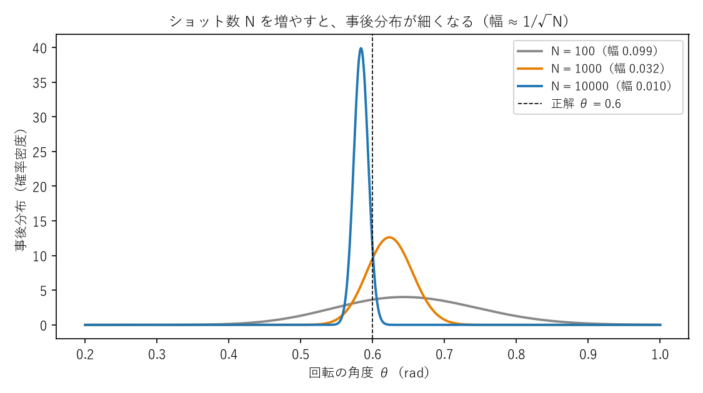
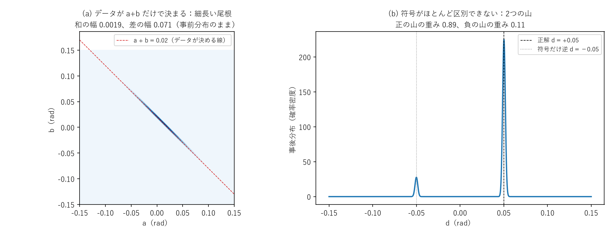

# 雑音をモデルにする ―MRI の緩和から、量子ビットの誤差、ベイズ推定まで―

> **作成** 2026-10-08　**更新** 2026-10-11
> A-5 の雑音のモデリングを読むためのノート。MRI の T1・T2・T2*・エコーから量子ビットの誤差へ進み、制御の状態ごとの回転、
> 誤差をデータから推定するベイズ推定を AI・深層学習の言葉と対応させて説明し、S2 の結果（感度分析、F5）と、
> モデルの点検（事後予測チェック、T1、ニールの漏斗、SBI、来月の測り方の比較）を読む。

テーマ A-5 の「雑音のモデリング」（実験計画の S2）を読むためのノートです。MRI の物理（スピン、RF パルス、T1・T2・T2\*、エコー）から出発して、量子ビットとその誤差を同じ言葉で説明し、最後に、その誤差をデータから推定するベイズ推定を、AI・深層学習の言葉と対応させて説明します。

- **Part 0：誤差とは何か**（3種類の誤差、古典コンピュータとの対応、「実用化」の意味）
- **Part I：MRI のスピンと量子ビット**（プロトンのスピン、ブロッホ球、RF パルス、T1・T2・T2\*、エコーとラムゼー、集団とショット、方式による違い）
- **Part II：量子ゲートとは**（行列・パルス・論理の3つの見方、ZYZ 分解、実機のゲート）
- **Part III：実機の誤差を式にする**（コヒーレントな誤差と確率的な誤差、制御の状態ごとの回転、較正の値との関係）
- **Part IV：ベイズ推定でモデルにする**（事前分布・尤度・事後分布、AI との対応表、データが決めない方向、収束の確かめ方、モデルの比べ方）
- **Part V：S2 の結果を読む**（決まったこと・決まらないこと、前提への違和感、事前分布の感度分析と制御の状態ごとの形の結果、モデルの点検：事後予測チェック・T1・ニールの漏斗・SBI の改良・来月の測り方）

**関連ファイル**：図のスクリプトは [figures/make_noise_modeling_figures.py](figures/make_noise_modeling_figures.py)。前のノート [trotter_experiment_translation](trotter_experiment_translation.md)（トロッター分解、ツイリング、誤差と不確かさ）の続きです。パウリ行列は [pauli_matrices_derivation_and_group](../04_群論・代数/pauli_matrices_derivation_and_group.md)、ZYZ 分解は [unitary_matrix_full_decomposition](../04_群論・代数/unitary_matrix_full_decomposition.md) の Part IX、ラダー演算子は [angular_momentum_ladder_operators](angular_momentum_ladder_operators.md)、密度行列は [density_matrix_bracket_notation](density_matrix_bracket_notation.md)。実験の本体は [experiments/a5_trotter_noise/README.md](../../experiments/a5_trotter_noise/README.md)、計画と S2 の経過は [docs/a5_modeling_plan.md](../../docs/a5_modeling_plan.md)。

**記号の約束**：パウリ行列 $X=\begin{pmatrix}0&1\\1&0\end{pmatrix}$、$Y=\begin{pmatrix}0&-i\\i&0\end{pmatrix}$、$Z=\begin{pmatrix}1&0\\0&-1\end{pmatrix}$。量子ビットの $\lvert0\rangle=(1,0)^T$ は $Z$ の固有値 $+1$ の状態（$T$ は「縦に直して読む」印）。2量子ビットの $P\otimes Q$ は「左が制御（量子ビット 0）、右が標的（量子ビット 1）」に作用し、$Z\otimes X$ を $ZX$ のように略します（前のノートと同じ）。

<a id="toc"></a>
## 目次

<!-- toc:start -->

- [Part 0：誤差とは何か](#p0)
  - [0-a. 誤差は3種類ある（古典コンピュータも同じ）](#p0-0a)
  - [0-b. 「2030 年ごろに実用化」の意味](#p0-0b)
- [Part I：MRI のスピンと量子ビット](#p1)
  - [1. プロトンのスピンは、そのまま量子ビット](#p1-1)
  - [2. ブロッホ球と磁化](#p1-2)
  - [3. RF パルス＝量子ゲート](#p1-3)
  - [4. T1・T2・T2\\*](#p1-4)
  - [5. エコーとラムゼー](#p1-5)
  - [6. 集団とショット](#p1-6)
  - [7. 方式による違い](#p1-7)
- [Part II：量子ゲートとは](#p2)
  - [8. 3つの見方](#p2-8)
- [Part III：実機の誤差を式にする](#p3)
  - [9. コヒーレントな誤差と確率的な誤差](#p3-9)
  - [10. 制御の状態ごとの回転](#p3-10)
  - [11. 較正の値との関係](#p3-11)
- [Part IV：ベイズ推定でモデルにする](#p4)
  - [12. 事前分布・尤度・事後分布](#p4-12)
  - [13. AI・深層学習との対応](#p4-13)
  - [14. データが決めない方向：尾根と2つの山](#p4-14)
  - [15. 収束の確かめ方](#p4-15)
  - [16. モデルの比べ方](#p4-16)
- [Part V：S2 の結果を読む](#p5)
  - [17. 決まったこと・決まらないこと](#p5-17)
  - [18. 前提への違和感](#p5-18)
  - [19. 確かめた結果（2026年10月9日）](#p5-19)
  - [20. モデルを点検する（2026年10月11日）](#p5-20)
- [まとめ](#summary)

<!-- toc:end -->

<a id="p0"></a>

# Part 0：誤差とは何か

<!-- part-toc:start -->

**この Part の内容**

- [0-a. 誤差は3種類ある（古典コンピュータも同じ）](#p0-0a)
- [0-b. 「2030 年ごろに実用化」の意味](#p0-0b)

<!-- part-toc:end -->

<a id="p0-0a"></a>

## 0-a. 誤差は3種類ある（古典コンピュータも同じ）

量子コンピュータの計算結果がずれる原因は、大きく3種類に分けられます。実は古典コンピュータにも、同じ3種類があります。

| 誤差の種類 | 古典コンピュータ | 量子コンピュータ（今の実機） | 誤り訂正が実用になったあと |
|---|---|---|---|
| **ハードウェアの誤り** | ほぼ無視できる（宇宙線によるビット反転などはまれに起き、サーバでは誤り訂正つきのメモリで直す） | **大きい**（A-5 の主役） | 誤り訂正で非常に小さくできる（量子ビットを増やすほど指数的に小さくなる） |
| **近似の誤差**（アルゴリズム） | 浮動小数点の丸め（倍精度で1回あたり約 $10^{-16}$）、微分方程式を時間の刻みで解く誤差 | **トロッター誤差**（時間を $n$ 段に刻む誤差） | 残る（設計で許容範囲に収める） |
| **統計的な誤差** | モンテカルロ法のばらつき | **ショットのばらつき**（測定は確率的） | 残る（測定の回数で小さくする） |

A-5 の「正確な値」$\langle Z_0\rangle=-0.2959$ も、古典コンピュータの計算で、丸め誤差は約 $10^{-15}$ です。目的に対して十分小さいので「正確」とみなしています。また、トロッター誤差は、古典の数値計算で微分方程式を時間刻みで解く誤差とまったく同じ種類で、「刻みを細かくすれば正確になるが、計算量が増える」という綱引きも同じです。

<a id="p0-0b"></a>

## 0-b. 「2030 年ごろに実用化」の意味

各社の計画では、2029〜2030 年ごろに誤り訂正つきの量子コンピュータを目指すと公表されています（たとえば IBM は、200 個程度の論理量子ビットで 1 億回程度のゲートを動かす機械を 2029 年に、という目標を出していると知られています）。これは、

- **ハードウェアの誤りを、誤り訂正で十分小さくする**（論理的なゲート1回あたりの誤り率を、たとえば百万分の1程度にする）という話で、**誤差 0 ではない**。
- 近似の誤差と統計的な誤差は残り、古典の数値計算と同じく「目的に対して許せる範囲」に設計して使う。
- 使えるのは、化学・材料の計算など、量子が有利と期待される特定の問題が中心。

という意味です。時期は各社の目標で、遅れる可能性も十分あります。A-5 の研究は「ハードウェアの誤りが大きい今の機械で、3種類の誤差をどう分けて扱うか」を調べています。

<a id="p1"></a>

# Part I：MRI のスピンと量子ビット

<!-- part-toc:start -->

**この Part の内容**

- [1. プロトンのスピンは、そのまま量子ビット](#p1-1)
- [2. ブロッホ球と磁化](#p1-2)
- [3. RF パルス＝量子ゲート](#p1-3)
- [4. T1・T2・T2\\*](#p1-4)
- [5. エコーとラムゼー](#p1-5)
- [6. 集団とショット](#p1-6)
- [7. 方式による違い](#p1-7)

<!-- part-toc:end -->

**この対応の使い方と限界**：MRI と量子ビットは「同じ数学構造を持つ」のであって、「同じもの」ではありません。両者は次の階層でつながっています。

```
MRI の現象（多数のスピン、周りの環境との相互作用、測定の手順を含む）
  ↓ 現象論的にまとめる
ブロッホ方程式（T1・T2 という2つの時定数）
  ↓ 量子の言葉で書き直す
量子チャネル・リンドブラッド方程式（どんな演算子で誤差が起きるか）
  ↓ 実機に合わせて具体化する
誤差のパラメータ（A-5 のモデルの θ や p）
```

たとえば MRI の T2 の主な原因はスピンどうしの相互作用（双極子相互作用など）、超伝導の量子ビットの T2 の主な原因は回路の周りの電荷や磁束の揺らぎで、**原因は違っても、行き着く数学（位相が指数関数的に失われる）が同じ**、というのが正確な言い方です。以下の対応は、理解の入口として使います。

<a id="p1-1"></a>

## 1. プロトンのスピンは、そのまま量子ビット

MRI が主に見ているのは、水素の原子核（プロトン）の**スピン**です。プロトンのスピンは「上向き」「下向き」の2つの状態を持つ**スピン 1/2** で、その数学は量子ビットとまったく同じです。スピン演算子はパウリ行列で

$$
\vec S=\frac\hbar2\,(X,\;Y,\;Z)\tag{I-1}
$$

と書けます。静磁場 $B_0$ の中では、2つの状態のエネルギーが分かれ（ゼーマン分裂）、その差に当たる周波数で、スピンは磁場のまわりを回ります（歳差運動）。これが**ラーモア周波数**

$$
\omega=\gamma B_0\tag{I-2}
$$

で、プロトンでは $\gamma/2\pi\approx42.58$ MHz/T と知られています（1.5 T の MRI で約 64 MHz）。超伝導の量子ビットは本物のスピンではなく電気回路ですが、2つの状態だけを使うので、数学的にはスピン 1/2 とまったく同じに扱えます（擬スピンと呼びます）。周波数は約 5 GHz です。

<a id="p1-2"></a>

## 2. ブロッホ球と磁化

量子ビットの状態は、3つの期待値 $(\langle X\rangle,\langle Y\rangle,\langle Z\rangle)$ を座標とする球（**ブロッホ球**）の上の点で表せます。MRI の**磁化ベクトル** $(M_x,M_y,M_z)$ と同じ図です。

| 量子ビット | ブロッホ球の上の位置 | MRI |
|---|---|---|
| $\lvert0\rangle$ | 北極（$\langle Z\rangle=+1$） | 静磁場の向きにそろった縦磁化（平衡状態） |
| $\lvert1\rangle$ | 南極（$\langle Z\rangle=-1$） | 反転した磁化 |
| $\lvert+\rangle=\frac1{\sqrt2}(\lvert0\rangle+\lvert1\rangle)$ | 赤道（$\langle X\rangle=+1$） | 90° パルスで倒した横磁化 |

<a id="p1-3"></a>

## 3. RF パルス＝量子ゲート

MRI の RF パルスは、磁化を決まった軸のまわりに決まった角度だけ回す操作です。量子ビットでは、これが**量子ゲート**です。$X$ 軸のまわりの角度 $\theta$ の回転は

$$
R_X(\theta)=e^{-i\theta X/2}=\cos\frac\theta2\,I-i\sin\frac\theta2\,X\tag{I-3}
$$

で、**90° パルスは $R_X(\pi/2)$、180° パルス（反転）は $X$ ゲート**（位相を除いて $R_X(\pi)$）に当たります。パルスの「強さ×長さ」で回転の角度が、RF の位相で回転の軸（$X$ か $Y$ か）が決まるのも同じです。

IBM の実機では、$Z$ 軸のまわりの回転 $R_Z$ はパルスを打たず、以後のパルスの位相の基準をずらして実現します（**仮想 Z ゲート**、所要時間ゼロ）。MRI の回転座標系で、基準の位相をずらすのと同じ考え方です。

<a id="p1-4"></a>

## 4. T1・T2・T2\*

MRI の緩和は、量子ビットでもそのまま現れます。

- **T1（縦緩和、エネルギー緩和）**：$\lvert1\rangle$ が $\lvert0\rangle$ に落ちる。$\lvert1\rangle$ から始めると、$\lvert1\rangle$ にいる確率は

$$
P_1(t)=e^{-t/T_1}\tag{I-4}
$$

- **T2（横緩和、位相緩和）**：重ね合わせの位相がそろわなくなる。$\lvert+\rangle$ から始めると

$$
\langle X\rangle(t)=e^{-t/T_2},\qquad\frac1{T_2}=\frac1{2T_1}+\frac1{T_\varphi}\tag{I-5}
$$

ここで $T_\varphi$ は、エネルギーの出入りを伴わない純粋な位相の乱れの時間です。T1 による緩和も位相を乱すので、$T_2\le2T_1$ になります。

量子の言葉では、これらは**リンドブラッド方程式**（密度行列の時間変化の式）で表されます。T1 は「ときどき $\lvert1\rangle$ を $\lvert0\rangle$ へ移す操作が起きる」、T2 の純粋な部分は「ときどき $Z$（位相の反転）が起きる」という形で、それぞれ

$$
L_1=\frac1{\sqrt{T_1}}\lvert0\rangle\langle1\rvert,\qquad L_\varphi=\frac1{\sqrt{2T_\varphi}}Z\tag{I-6}
$$

という演算子で書きます。$\lvert0\rangle\langle1\rvert$ は**ラダー演算子**（状態を1段移す演算子）で、T1 の緩和がラダー演算子そのもので書けるわけです。MRI の**ブロッホ方程式**は、この式を集団で平均したものに当たります。

**記号の注意**：$\lvert0\rangle\langle1\rvert=\frac12(X+iY)$ です。スピンの言葉では、これは $S_z$ を上げる演算子 $S_+$（$\sigma_+$）に当たります。量子ビットでは $Z=+1$ の $\lvert0\rangle$ をエネルギーの低い状態に選ぶので、「エネルギーを下げる」演算子が、スピンの記号では「上げる」演算子になる、というずれがあります。

**数値で確かめた例**（$T_1=150$ μs、$T_\varphi=200$ μs、$t=60$ μs。リンドブラッド方程式を数値で解いた）：(I-5) から $T_2=120$ μs。$P_1=0.670=e^{-60/150}$、$\langle X\rangle=0.607=e^{-60/120}$ で、式どおりでした。さらに、$\lvert+\rangle$ から始めると $\langle Z\rangle$ は $0$ から $1-e^{-t/T_1}=0.330$ へ増えます。**T1 の緩和は「$\lvert0\rangle$ の側へ」という向きを持つ誤差**で、どの向きにも等しく壊れる脱分極とは性質が違います（Part V の 18 で、これがモデルに入っていないことを問題にします）。

- **T2\***：MRI では、場所ごとに違う静的な磁場のずれによって、スピンどうしの位相がずれていき、集団の信号が減衰する。これは**エコーで巻き戻せる**。

**周波数のずれ方による3つの場合**：量子ビットの周波数（MRI のラーモア周波数に当たる）がずれるとき、ずれ方によって起きることが違います。

| 周波数のずれ方 | 量子ビットで起きること | MRI での対応 |
|---|---|---|
| **毎回同じだけずれている** | 位相が決まった向きに回り続ける。減衰はしない。**これがコヒーレントな誤差**（Part III） | 試料全体が共鳴からずれている（オフレゾナンス）。位相がそろったまま回る |
| **ショットごとに違うが、1回の実行の中では一定** | ショットを平均すると位相がそろわなくなって減衰する。エコーで戻せる | **T2\***（場所ごとに違う静的なずれ） |
| **1回の実行の中でも速く揺らぐ** | 戻せない位相の消失 | **T2** |

つまり、コヒーレントな誤差は T2\* そのものではなく、「T2\* を作る周波数のずれが、全員（全ショット）で同じ値になった特別な場合」です。A-5 で見た「**ジョブごとの揺らぎ**」は1行目と2行目の中間で、1つのジョブの中ではほぼ一定（コヒーレント）、ジョブが変わると値が変わります（MRI で言えば、撮像の回ごとに中心周波数がずれる状況）。A-5 のモデルで「コヒーレントな回転」と「ジョブごとの揺らぎ」を分けて置いたのは、この区別に当たります。

<a id="p1-5"></a>

## 5. エコーとラムゼー

- MRI の**スピンエコー**（途中で 180° パルスを打って、ずれた位相をそろえ直す）は、量子ビットの**動的デカップリング**の原型です。A-5 で試した XY4 も、NMR で生まれたパルス列です。
- MRI の**自由誘導減衰（FID）**（90° パルスで倒した横磁化が、回りながら減衰していく信号）に当たるのが、量子ビットの**ラムゼー型の測定**です。A-5 の**直接の測定の回路**（$\lvert+\rangle$ にして CNOT の組をくり返し、位相のたまり方を見る）は、このラムゼー型の測定です。

<a id="p1-6"></a>

## 6. 集団とショット

一つだけ大きな違いがあります。

- **MRI** は、膨大な数のスピンの**集団**の平均（磁化）を測ります。室温では上向きと下向きの数の差はごくわずか（百万分の数程度）で、密度行列で書くと $\frac12(I+\varepsilon Z)$（$\varepsilon$ はごく小さい）のような、ほとんど混ざった状態です。位相がバラバラになるのは、場所ごとに磁場が違うスピンたちの位相が、互いにずれるからです。
- **量子ビット**は1個で、冷やしてほぼ完全に $\lvert0\rangle$ に準備し、測るたびに 0 か 1 かしか出ません。そこで同じ回路を何千回も測って（**ショット**）平均します。**ショットの集まりが、MRI のスピンの集団の役**をします。ショットごとに量子ビットの周波数が少し違えば、平均すると位相がそろわなくなります。
- A-5 で見た「**ジョブごとの揺らぎ**」（量子ビット 22 の位相の跳び）は、MRI で言えば、撮像の回ごとに静磁場が少しずれるようなものです。

歴史的なつながりとして、ショアのアルゴリズム（素因数分解）を最初に実機で動かしたのは、液体の分子の核スピン7個を量子ビットにした NMR の量子コンピュータでした（2001 年、15 = 3 × 5。Vandersypen ら、Nature として知られています）。

<a id="p1-7"></a>

## 7. 方式による違い

量子コンピュータの作り方は、まだ1つに決まっていません。方式ごとに、誤差の性質が大きく違います。

| 方式 | 誤差の特徴 |
|---|---|
| 超伝導（IBM、Google。A-5 で使用） | ゲートが速い（数十〜数百ナノ秒）、T1・T2 は約 100 μs。**周波数のずれや揺らぎ**、隣どうしの常に働く結合など、コヒーレントな誤差が出やすい。2つ以外の状態（$\lvert2\rangle$）へ漏れることもある |
| イオントラップ（Quantinuum、IonQ） | 位相の寿命が秒単位と長く、ゲートは高精度だが遅い。レーザーの強さや位相の揺らぎが、回転の狂いとして出る。2量子ビットゲートの仕組みが違うので、誤差の項の種類も違う |
| 中性原子（QuEra、Pasqal） | 原子が抜け落ちる誤差がある（どこで失敗したか分かる「消失誤差」で、A-5 のモデルにはない種類） |
| 光（PsiQuantum、Xanadu） | 光子が失われることが主な誤差 |

A-5 で見た誤差の「中身」は、IBM の超伝導量子ビット（さらに量子ビットの組と日時）に固有です。一方、誤差を成分に分け、成分ごとのつまみを用意し、正直な不確かさで推定する**やり方**は、方式によらず使えます。

<a id="p2"></a>

# Part II：量子ゲートとは

<!-- part-toc:start -->

**この Part の内容**

- [8. 3つの見方](#p2-8)

<!-- part-toc:end -->

<a id="p2-8"></a>

## 8. 3つの見方

**数学の見方**：量子ゲートは、状態ベクトルにかける**ユニタリ行列**（$U^\dagger U=I$）です。ユニタリでなければいけない理由は、(1) ベクトルの長さを変えないので、測定で出る確率の合計がいつも 1 のまま、(2) 必ず逆行列 $U^\dagger$ があるので、操作を巻き戻せる、の2つです。1量子ビットのゲートは、ブロッホ球の上の**回転**です。

**物理の見方**：実機の量子ゲートは、決まった強さ・長さ・位相の**パルス**（超伝導ならマイクロ波、イオントラップならレーザー）で、MRI の RF パルスと同じものです（3 節）。

**計算の見方**：古典の論理ゲートの量子版です。ただし、逆にたどれるものしか使えません（AND は出力から入力が分からないので使えず、代わりに CNOT などを使う）。また、重ね合わせ（H ゲート）やもつれ（CNOT）を作れます。

**ZYZ 分解**（[unitary_matrix_full_decomposition](../04_群論・代数/unitary_matrix_full_decomposition.md) の Part IX）：どんな1量子ビットのゲートも、全体の位相を除いて

$$
U=e^{i\alpha}R_Z(\beta)\,R_Y(\gamma)\,R_Z(\delta)\tag{II-1}
$$

と、3回の回転に分けられます。剛体の向きを3つのオイラー角で表すのと同じです。これに2量子ビットのゲートを1種類（CNOT か CZ）加えるだけで、何量子ビットのどんなユニタリ行列も作れることが知られています。そのため実機は少数の「ネイティブなゲート」だけを持ち、IBM の Heron なら $R_Z$（仮想）、$\sqrt X$、$X$、CZ です。A-5 の回路の CNOT も、実機では「$H$・CZ・$H$」に、$H$ はさらに「$R_Z$・$\sqrt X$・$R_Z$」に変換されて実行されます。

<a id="p3"></a>

# Part III：実機の誤差を式にする

<!-- part-toc:start -->

**この Part の内容**

- [9. コヒーレントな誤差と確率的な誤差](#p3-9)
- [10. 制御の状態ごとの回転](#p3-10)
- [11. 較正の値との関係](#p3-11)

<!-- part-toc:end -->

<a id="p3-9"></a>

## 9. コヒーレントな誤差と確率的な誤差

「コヒーレント」は、もともと「位相がそろっている」という意味です（レーザー光が「コヒーレントな光」と呼ばれるのと同じ）。雑音の文脈では、

| | コヒーレントな誤差 | 確率的な誤差 |
|---|---|---|
| 中身 | 毎回、同じ向きに、同じだけ回りすぎる（ユニタリ） | ときどきランダムに状態が乱れる（確率の混ざり） |
| MRI の対応 | フリップ角の誤差、試料全体の共鳴からのずれ（4 節の表の1行目。ショットごとにずれ方が変わると T2\* になる） | **T2**（戻せない位相の消失） |
| 積み重なり | 角度が足し算（$n$ に比例）→ 測る量への効き方は $n$ か $n^2$（$\lvert0\rangle$ から $Z$ を測る例では $n^2$） | 確率が足し算 → 効果は $n$ に比例 |
| たとえ | 装置の系統的なずれ（いつも同じ方向に狂った較正） | ランダムな雑音 |

と使い分けます。コヒーレントな誤差は位相を保つので、誤差どうしが**干渉**し、強め合ったり（角度が $n$ に比例して積み重なる理由）、対称な回路で打ち消し合ったり（エコー）します。詳しい式と数値の例は [trotter_experiment_translation](trotter_experiment_translation.md) の Part III・IV にあります。「**デコヒーレンス**」は、量子状態がコヒーレンス（位相のそろい）を失っていくことで、T2 はその速さの目安です。

<a id="p3-10"></a>

## 10. 制御の状態ごとの回転

A-5 のモデルでは、CNOT の直後に、2量子ビットのパウリ行列による小さな回転 $E=e^{-i\sum_k\theta_kP_k}$ を入れました（15 成分）。このうち、たとえば $IX$ と $ZX$ は互いに交換するので、

$$
e^{-i(a\,IX+b\,ZX)}=\lvert0\rangle\langle0\rvert\otimes e^{-i(a+b)X}+\lvert1\rangle\langle1\rvert\otimes e^{-i(a-b)X}\tag{III-1}
$$

と分けられます（数値で一致を確かめました）。$Z$ が制御の $\lvert0\rangle$ には $+1$、$\lvert1\rangle$ には $-1$ として働くからです。同じく

$$
e^{-i(c\,IZ+d\,ZZ)}=\lvert0\rangle\langle0\rvert\otimes e^{-i(c+d)Z}+\lvert1\rangle\langle1\rvert\otimes e^{-i(c-d)Z}\tag{III-2}
$$

です。つまり、2量子ビットにまたがる回転は、「2つの量子ビットが干渉している」のではなく、**制御の状態によって、標的の回り方が変わる回転**です。

- **制御が $\lvert0\rangle$ のとき**：標的は $X$ 軸のまわりに $a+b$（$=IX+ZX$）、$Z$ 軸のまわりに $c+d$（$=IZ+ZZ$）だけ余分に回る。
- **制御が $\lvert1\rangle$ のとき**：標的は $a-b$（$=IX-ZX$）、$c-d$（$=IZ-ZZ$）だけ回る。

A-5 の直接の測定の回路は、制御を $\lvert0\rangle$ のままにして標的の回転を見るので、**制御が $\lvert0\rangle$ のときの回転**を直接測っています。実際、標的の $X$ 回転の位相の傾き（CNOT の組1回あたり）は

$$
\text{傾き}=-4\,(IX+ZX)\tag{III-3}
$$

になります（$IX$ と $ZX$ の値を変えて数値で確かめました。$IX=0.0176$、$ZX=-0.0108$ でも $IX=-0.0005$、$ZX=0.0074$ でも、和がほぼ同じ $0.0068$〜$0.0069$ なので、傾きはどちらも $-0.027$）。実測は $-0.024$ でした。

<a id="p3-11"></a>

## 11. 較正の値との関係

IBM の較正データのゲートの誤差（22–23 の CZ で約 0.18%）は、ランダムなゲート列で測る「平均の失敗の確率」（平均ゲート不忠実度）です。小さな誤差では、

$$
r\approx0.8\sum_k\theta_k^2\;+\;0.75\,p\tag{III-4}
$$

と近似できます（2量子ビットの平均ゲート不忠実度の式から。コヒーレントな回転の項の係数 $0.8=\frac{4}{5}$、全体の脱分極 $p$ の係数 $0.75=\frac45\cdot\frac{15}{16}$。数値で確かめました）。回転の角度が全部合わせて 0.04〜0.05 rad 程度なら、較正の値と同じ大きさになります。

<a id="p4"></a>

# Part IV：ベイズ推定でモデルにする

<!-- part-toc:start -->

**この Part の内容**

- [12. 事前分布・尤度・事後分布](#p4-12)
- [13. AI・深層学習との対応](#p4-13)
- [14. データが決めない方向：尾根と2つの山](#p4-14)
- [15. 収束の確かめ方](#p4-15)
- [16. モデルの比べ方](#p4-16)

<!-- part-toc:end -->

<a id="p4-12"></a>

## 12. 事前分布・尤度・事後分布

ベイズ推定は、「パラメータ $\theta$ がどんな値でありそうか」を、確率の分布として求める方法です。

$$
\underbrace{p(\theta\mid\text{データ})}_{\text{事後分布}}\;\propto\;\underbrace{p(\text{データ}\mid\theta)}_{\text{尤度}}\;\times\;\underbrace{p(\theta)}_{\text{事前分布}}\tag{IV-1}
$$

- **事前分布**：データを見る前に、$\theta$ についてどう思っているか（たとえば「回転は 0 のまわりの、0.05 rad くらいの範囲だろう」）。
- **尤度**：$\theta$ がその値だったら、そのデータがどれくらい出やすいか。
- **事後分布**：データを見たあとの、$\theta$ についての考え。2つの積に比例する。

**一番簡単な例**：$R_X(\theta)$ をかけて測ると、「1」が出る確率は $P=\sin^2\frac\theta2$ です（(I-3) から）。$N$ 回測って「1」が $n_1$ 回出たとき、尤度は二項分布

$$
p(n_1\mid\theta)\propto P^{\,n_1}(1-P)^{\,N-n_1}\tag{IV-2}
$$

です。事前分布を一様にすると、事後分布はこの尤度に比例します。$N$ が大きいとき、事後分布の幅（標準偏差）は、「$P$ の統計的なばらつき」を「$P$ が $\theta$ でどれだけ変わるか」で割ったものになります：

$$
\sigma_\theta\approx\frac{\sqrt{P(1-P)/N}}{\lvert dP/d\theta\rvert}\tag{IV-3}
$$

ここで $P(1-P)=\sin^2\frac\theta2\cos^2\frac\theta2=\frac14\sin^2\theta$、$\frac{dP}{d\theta}=\sin\frac\theta2\cos\frac\theta2=\frac12\sin\theta$ なので、

$$
\sigma_\theta\approx\frac{\frac12\lvert\sin\theta\rvert/\sqrt N}{\frac12\lvert\sin\theta\rvert}\tag{IV-4}
$$

$$
\sigma_\theta\approx\frac1{\sqrt N}\tag{IV-5}
$$

と、$\theta$ によらず $1/\sqrt N$ になります。下の図は、正解 $\theta=0.6$ で $N=100,1000,10000$ 回測ったときの事後分布です（幅は 0.099、0.032、0.010。スクリプトで (IV-5) と照合）。$N=10000$ の山が正解から少しずれているのは、たまたまの統計のずれ（約 1.6 倍の標準偏差）です。



<a id="p4-13"></a>

## 13. AI・深層学習との対応

| ベイズ推定の言葉 | AI・深層学習での対応 | A-5 での意味 |
|---|---|---|
| 尤度（の対数） | 損失関数（の符号を変えたもの） | モデルの予測と実機のデータの合い方 |
| 事前分布 | 正則化（L2 正則化は正規分布の事前分布と同じ） | 「回転は小さいだろう」という前提 |
| **MAP 推定**（事後分布の一番高い山を探す） | **学習**（損失＋正則化の最小化） | `s2_map.py` |
| 多くの出発点から探す | 初期値を変えて何度も学習する | 30〜60 個の出発点 |
| 山がいくつもある | 損失関数の局所解 | 偽の山（合成データで 17.6 低い山） |
| データが決めない方向 | パラメータを増やしすぎて、重みの組み合わせを変えても出力が同じ | IZ−ZZ（下の 14） |
| **NUTS**（事後分布からのサンプリング） | 1つの答えではなく、ありうる答えの分布を求める | `s2_fit.py` |
| **R-hat**（チェーンがそろうか） | 乱数の種を変えた複数回の学習で、同じ結果が出るか | 4本のチェーン |
| **PSIS-LOO** | 交差検証（1点抜き） | モデルの比べ方 |
| **スタッキング** | アンサンブル（予測の良さで重みづけ） | F3s の正・負の合わせ方 |

ベイズ推定が深層学習の「学習」と違うのは、**1つの答え（重み）ではなく、答えの分布（不確かさ）まで求める**ところです。そのぶん計算が重くなります（A-5 では NUTS 1回に 15〜35 分）。

<a id="p4-14"></a>

## 14. データが決めない方向：尾根と2つの山

**尾根**：データが2つのパラメータの和 $a+b$ だけで決まるとき、事後分布は「$a+b=$ 一定」の線に沿って細長く伸びます。下の図 (a) は、$a+b=0.02$ を測ったおもちゃの例です。和の幅は 0.0019 とデータで決まりますが、差 $a-b$ の幅は 0.071 で、**事前分布の幅（$0.05\sqrt2$）のまま**です。データは差について何も言っていないので、事前分布がそのまま残ります。

**2つの山**：データが、あるパラメータ $d$ の符号をほとんど区別しないとき（$d$ と $-d$ でほぼ同じ予測になるとき）、事後分布は $\pm d$ の2つの山になります。図 (b) では、符号の手がかりが弱く、正の山に 0.89、負の山に 0.11 の重みが乗っています。



A-5 の S2 では、これがそのまま起きていました。

- **F3（5 項）の IZ と ZZ**：データが決めるのは和 $IZ+ZZ$（(III-2) の「制御が $\lvert0\rangle$ のときの標的の Z 回転」）で、差 $IZ-ZZ$（制御が $\lvert1\rangle$ のとき）はほとんど決まらない。22–23 では差の大きさは約 0.1 に決まるが符号が決まらず、山が2つに分かれた（差の符号を反転させても、トロッター回路の予測の変化は 0.0005 以下）。
- そこで IZ と ZZ を和と差に置き直し（**F3s**）、差の符号ごとに当てはめて、スタッキングで合わせた。

<a id="p4-15"></a>

## 15. 収束の確かめ方

NUTS は、事後分布の上を「転がるボール」のように動きながら、点を集めていきます（ハミルトン力学を使う方法）。複数の**チェーン**（独立に始めた転がり）を走らせ、それらが同じ分布にたどり着いたかを **R-hat** で確かめます。R-hat が 1.01 未満なら、そろったとみなすのが目安です。

- **遅くなる理由**：細長い尾根や曲がった谷では、ボールが小刻みにしか進めず、1回の更新に多くの勾配の計算が要ります（A-5 では上限の 255 回に達することが多かった）。
- **そろわない理由**：山が複数あると、チェーンが別々の山に落ちて、抜け出せなくなります（S2 の最初の実行で、142–143 のパラメータでチェーンが2つの解に分かれた）。
- **対処**：パラメータの置き方を変える（データが決める方向と決めない方向を分ける）、多くの出発点からの MAP 探索で一番高い山を見つけてから始める、山の曲がり具合（ヘッセ行列）を最初から教える。

<a id="p4-16"></a>

## 16. モデルの比べ方

- **PSIS-LOO**：1点ずつデータを抜いて、残りで学んだモデルが、抜いた点をどれだけ予測できるか（交差検証）を、学び直さずに近似する方法です。値（elpd）が大きいほど予測が良い。信頼性の目安 $\hat k$ が 0.7 を超える点が多いと、近似が怪しくなります。
- **スタッキング**：複数のモデルの予測を、「混ぜたときの予測が一番良くなる」重みで混ぜる方法です（アンサンブル）。ただし、2つのモデルの予測がほぼ同じだと、重みが 0 と 1 のように極端に出やすく、不安定です（F3s の正・負の重みが 0／1 になったのはこのため。elpd の差 $1.9\pm1.7$ から、符号は「どちらとも言えない」と読む）。

<a id="p5"></a>

# Part V：S2 の結果を読む

<!-- part-toc:start -->

**この Part の内容**

- [17. 決まったこと・決まらないこと](#p5-17)
- [18. 前提への違和感](#p5-18)
- [19. 確かめた結果（2026年10月9日）](#p5-19)
- [20. モデルを点検する（2026年10月11日）](#p5-20)

<!-- part-toc:end -->

<a id="p5-17"></a>

## 17. 決まったこと・決まらないこと

| 量 | 22–23 | 142–143 | 決まり方 |
|---|---|---|---|
| **制御が $\lvert0\rangle$ のときの、標的の X 回転**（$IX+ZX$） | $+0.0069$ | $+0.0254$ | **どのモデルでも同じ**。直接の測定とも合う |
| **制御が $\lvert0\rangle$ のときの、標的の Z 回転**（$IZ+ZZ$） | $+0.0021$ | $-0.0013$ | どのモデルでも同じ |
| 制御の Z 位相（ZI） | $-0.005$ | $-0.007$ | ほぼ同じ |
| ジョブごとの揺らぎの大きさ | 約 0.002 rad | | 同じ |
| 制御が $\lvert1\rangle$ のときの回転（$IX-ZX$、$IZ-ZZ$） | | | **モデルで大きく変わる、または符号が決まらない** |
| 脱分極の強さ $p$ | | | モデルで3倍変わる（コヒーレントな項と取り合う） |

モデルの比較（PSIS-LOO）では、ジョブごとの揺らぎを入れたモデルが、入れないモデルより圧倒的に良く（elpd の差 $-310\pm73$）、5項の形が3項より良い（差 $-63\pm38$）結果でした。

<a id="p5-18"></a>

## 18. 前提への違和感

事後分布の「データが決めている部分」は現実と合っています（直接の測定と一致）。一方、「データが決めていない部分」は、前提の置き方しだいで現実離れした値になりえます。

1. **事前分布が広すぎる（較正の値を使っていない）**：F3 の当てはめでは、決まらない方向が $IZ\approx-0.053$、$ZZ\approx+0.055$ に流れました。(III-4) で計算すると、回転の部分だけで不忠実度が約 0.0047、脱分極を合わせると約 0.0056 で、較正の値（約 0.0018）の**3倍**です。和が同じでも差を小さくとれば、回転の部分は 0.00007 程度で済みます。データが「どんな値でもよい」と言う方向は、事前分布が許す範囲の端まで流れます。→ 「(III-4) の不忠実度が較正の値の近くになる」という知識を、事前分布に入れる。
2. **T1 の緩和がモデルにない**：T1 は「$\lvert0\rangle$ の側へ」という向きのある誤差で（4 節）、脱分極とは性質が違います。回路の長さは数 μs で、T1 ≈ 150 μs なので、効果は数 % になりえ、A-5 で見ている効果（0.01〜0.1）と同じ大きさです。モデルにない誤差は、ほかのパラメータが肩代わりします（$p$ がモデルで3倍変わったのは、その表れかもしれない）。
3. **揺らぎの置き方が単純**：ZI だけが揺らぎ、ジョブどうしは独立、と置いています。ZI を選んだのは監視用の回路の結果を見たからで、同じデータで形を決めて当てはめた面があります。時間的に近いジョブが似ていることも使っていません（計画の S3 でガウス過程を入れる予定）。

**確かめ方：事前分布の感度分析**。事前分布の幅を変えて当てはめ直し、結果がどう動くかを見ます。データが決めている量は動かず、決めていない量は事前分布につられて動くはずです。これで、「どの結論がデータから来ていて、どの結論が前提から来ているか」を分けて示せます。

<a id="p5-19"></a>

## 19. 確かめた結果（2026年10月9日）

18 の確かめ方と、10 節の「制御の状態ごとの回転」を、実際に当てはめて確かめました（11 本、合計約8時間。詳しい表は [results/s2/s2_report.md](../../experiments/a5_trotter_noise/results/s2/s2_report.md)、経過は [docs/a5_modeling_plan.md](../../docs/a5_modeling_plan.md)）。

**事前分布の感度分析**（F3s の、回転の事前分布の幅だけを変えた）：

| 量 | 幅 0.01 | 0.02 | 0.05 | 0.1 | 判定 |
|---|---|---|---|---|---|
| 22–23、制御 $\lvert0\rangle$ の X 回転 | 0.0068 | 0.0069 | 0.0069 | 0.0069 | データが決めている |
| 22–23、制御 $\lvert0\rangle$ の Z 回転 | 0.0021 | 0.0021 | 0.0021 | 0.0021 | データが決めている |
| 142–143、制御 $\lvert0\rangle$ の X 回転 | 0.0254 | 0.0255 | 0.0254 | 0.0255 | データが決めている |
| 22–23、制御 $\lvert1\rangle$ の Z 回転 | 0.010 | 0.046 | 0.105 | 0.111 | **前提から来ている**（幅につられて動く） |
| 脱分極の強さ $p$（22–23） | 0.0046 | 0.0039 | 0.0014 | 0.0012 | **前提から来ている** |

予想どおり、14 節の図 (a) の「尾根」と同じことが実データで起きていました。データが知らない方向は、事前分布の幅のぶんだけ動きます。一方、較正の値を事前分布に入れても（18 の 1）、決まらない量は少し縮んだだけでした（0.105 → 0.089）。制約が緩く、$p$ を下げて帳尻を合わせられてしまうためです。

**制御の状態ごとの形（F5）**：(III-1)(III-2) のとおり、誤差を「制御が $\lvert0\rangle$ のときの標的の回転（X・Y・Z の3成分）」と「$\lvert1\rangle$ のときの回転（3成分）」と ZI で表した形です。

- これまでの形より**予測がはるかに良く**（PSIS-LOO の elpd で約 160 ± 36 良い）、サンプルを増やすと **R-hat 1.01 で収束**しました。
- 良くなった理由は、F3 系になかった標的の **Y 軸まわりの回転**（特に制御が $\lvert1\rangle$ のとき、22–23 で −0.031、142–143 で −0.027 rad）です。
- 22–23 の制御の Z 位相は −0.0071 となり、直接の測定（傾き −0.027 ÷ 4 ＝ −0.0068、(III-3) と同じ考え方）と合いました。以前のずれは、Y 成分が足りなかったためと考えられます。

**制御 $\lvert1\rangle$ の直接の測定を加えると**（合成データ、正解は 0）：22–23 の制御 $\lvert1\rangle$ の Z 回転の不確かさが ± 0.034 から **± 0.0009** に縮みました（約 40 分の 1）。データが知らなかった方向に、専用のつまみ（実験条件）を足すと、その方向が決まる、という例です。ただし、同じ設定を別の乱数の種で回した1本は、サンプリングに失敗しました（原因は未解明）。

なお、制御を $\lvert1\rangle$ にしたまま Z 回転を測ろうとしても、CNOT のたびに標的が反転し、Z 回転の誤差がエコーのように打ち消されて見えません。各 CNOT のあとに標的へ X をかけて反転を戻すと、Z 回転がたまって見えるようになります。トロッター回路で $IZ-ZZ$ がほとんど決まらなかった物理的な理由も、ZZ の項の CNOT の組が自然なエコーになっていたためです。

**10月10日の追加**：F5 の事前分布の幅を 0.02・0.1 に変えても、22–23 の制御 $\lvert1\rangle$ の Z 回転は −0.100 ± 0.049、−0.115 ± 0.009 で、ほぼ変わりませんでした。F3s では同じ量が幅につられて動いたのと対照的で、F5 では**データから来ている量**です（18 の感度分析の考え方）。ただし、ジョブごとの揺らぎを入れないモデルでは +0.105 と符号が逆になるので、揺らぎの扱いと強く絡んだ量だという注意がつきます（データへの合い方は揺らぎありが圧倒的に良い）。

**ニューラルネットによる推定（SBI）も試しました**（13 節の対応表の「NUTS」の代わりに、正規化フローに「データ → 事後分布」を学ばせる方法）。100 万回のシミュレーションで学ばせると、正解の分かる合成データ 300 組で 68% 区間に正解が入る割合が 0.689、90% 区間が 0.901 と、**平均としては正直な不確かさ**を出せました。一方、実データでは NUTS より 2〜10 倍広い事後分布しか得られず、中心もずれました。事前分布に比べてデータが決める幅がはるかに狭いこと、そして本物のデータがモデルの作るデータの典型から外れている（モデルに足りない誤差がある）可能性が理由として考えられます。後者は、「モデルが正しい世界」での正直さを確かめる SBC では見抜けない点に注意が要ります。

**新しい問い**：F5 の実データでは、22–23 の制御 $\lvert1\rangle$ の Z 回転が −0.11 ± 0.01 rad と大きく、データでよく決まっています。(III-4) で見ると、較正の誤差の2〜3倍のゲートということになります。本当にそう回っているのか、モデルにない誤差（T1 の緩和、$\lvert2\rangle$ への漏れなど）の肩代わりかは、まだ分かりません。**測る前の予測**：制御を $\lvert1\rangle$ にし、反転を戻す Z 回転の測定で、CNOT の組1回あたり約 +0.45 rad の傾きが出るはずです。来月の実機で、これを確かめます。

<a id="p5-20"></a>

## 20. モデルを点検する（2026年10月11日）

19 までは「モデルの中で、どの値がデータから決まるか」を見てきました。この節では逆に、**モデルそのものがデータに合っているか**を確かめます。あわせて、サンプリングの失敗の原因、SBI の改良、来月の測り方の比較の結果も読みます（コードは `s2_ppc.py`・`s6_design.py`、結果は [README の 34〜39](../../experiments/a5_trotter_noise/README.md)）。

**事後予測チェック**：事後分布のサンプル $\theta_s$ ごとに予測 $\mu_i(\theta_s)$ を作り、観測 $y_i$ が統計誤差 $\sigma_i$ の何倍ずれているかを、標準化残差

$$
r_i=\frac{y_i-\bar\mu_i}{\sigma_i},\qquad\bar\mu_i=\frac1S\sum_{s=1}^{S}\mu_i(\theta_s)\tag{V-1}
$$

で見ます。モデルが正しく、誤差棒も正しければ、$r_i$ は平均 0・分散 1 の正規分布に従うので、$\frac1M\sum_i r_i^2$（$M$ は点の数）は 1 前後になるはずです。

さらに、同じ $\theta_s$ から「もう一度測ったら出るはずのデータ」$y^{\rm rep}_i=\mu_i(\theta_s)+\sigma_i\varepsilon_i$（$\varepsilon_i$ は標準正規分布の乱数）を作り、ずれの大きさ $T(y)=\sum_i\bigl((y_i-\mu_i(\theta_s))/\sigma_i\bigr)^2$ を本物と複製で比べます。

$$
p_{\rm ppc}=P\bigl(T(y^{\rm rep})\ge T(y)\bigr)\tag{V-2}
$$

これが**事後予測 p 値**です。0.5 前後ならモデルは本物のデータを「ありそうなデータ」として作れています。0 に近ければ、本物のデータはモデルが作るデータよりずれが大きい、つまりモデルに足りないものがあります。AI・深層学習で言えば、学習済みのモデルにデータを生成させ、本物と見分けがつくかを調べる点検に当たります（GAN の識別器の役を、ずれの大きさ $T$ という1つの統計量が担う）。

F5＋D1（19 の最良のモデル）では、$\frac1M\sum r_i^2=1.70$、$p_{\rm ppc}=0.000$ でした。ずれは統計誤差の約 $\sqrt{1.70}\approx1.3$ 倍です。ずれの平均は $-0.06$ で、一方向に偏ってはいません。**ばらつきが誤差棒より大きい**という形の当てはまりの悪さです。

**T1 の形のずれはあるか**：18 の 2 で心配した T1 の緩和が抜けていれば、⟨Z₀⟩ の符号によらず、残差が「深さ $n$ に比例して $+1$ の側（$\lvert0\rangle$）へ」育つはずです。脱分極の取り残しは「0 へ縮む」向きで、予測 $\mu$ に比例します。そこで、トロッター回路の残差を

$$
y_i-\bar\mu_i\approx a\,n_i+c\,(-n_i\bar\mu_i)\tag{V-3}
$$

と重みつき最小二乗で当てはめました。$a>0$ が T1 の兆候です。結果は、トロッター回路全体で $a=+0.19\times10^{-3}$／ステップ、標準誤差の 1.0 倍で、**T1 の兆候は見えません**でした。

**T1 をモデルに入れて確かめる**：CNOT ごとに、両方の量子ビットへ振幅減衰（4 節の T1）をかけます。1量子ビットのクラウス演算子は

$$
K_0=\begin{pmatrix}1&0\\0&\sqrt{1-\gamma}\end{pmatrix},\qquad K_1=\begin{pmatrix}0&\sqrt\gamma\\0&0\end{pmatrix}=\sqrt\gamma\,\lvert0\rangle\langle1\rvert\tag{V-4}
$$

で、$\rho\to K_0\rho K_0^\dagger+K_1\rho K_1^\dagger$ と働きます。$K_1$ は (I-6) のラダー演算子 $\lvert0\rangle\langle1\rvert$ そのもので、$\lvert1\rangle$ にいる確率が $1-\gamma$ 倍に減ります。時間 $t$ の間の減衰の確率は (I-4) から $\gamma=1-e^{-t/T_1}$ です。較正の $T_1\approx160$ μs と、CNOT 1回と前後のゲートの時間 $t\approx0.1$ μs を入れると

$$
\gamma=1-e^{-0.1/160}\approx6.2\times10^{-4}\tag{V-5}
$$

になります。これを中心に事前分布を置いて当てはめると、予測の良さ（PSIS-LOO）は元の F5 と変わらず（差 $+0.7\pm1.3$）、$\gamma$ の事後分布も事前分布から動きませんでした。

ただし、これは「T1 の効果が無い」という意味ではありません。(V-5) の $\gamma$ で、F5 の当てはめた値のまま深さ $n=14$（CNOT 28 個）の ⟨Z₀⟩ を計算すると、変化は 0.004〜0.010 でした（スクリプトで確認）。トロッター回路の統計誤差は1点あたり約 0.006〜0.01 なので、**1点の誤差棒と同じくらいの大きさ**です。それでもデータが $\gamma$ を決められないのは、同じくらいの変化を、脱分極 $p$ や回転の値を少しずらすことでも作れてしまうためです（14 節の「尾根」と同じ、見分けのつかない方向）。(V-3) の $a$ も $(0.19\pm0.19)\times10^{-3}$ で、「T1 なし」とも「較正どおりの T1」とも矛盾しません。結論は「今のデータでは T1 を入れても入れなくても同じ予測になり、T1 は決まらない」です。18 の 2 の心配（モデルにない誤差を、ほかのパラメータが肩代わりする）は、T1 については実際に起きうる大きさで、肩代わりの先は主に $p$ です。T1 を分けて測るには、T1 だけに敏感な測定（$\lvert1\rangle$ に置いて待つ、MRI の反転回復に当たる測定）を加える必要があります。

ずれの残りは、**誤差棒を広げる係数**（トロッター回路と直接の測定で別々の倍率）を入れると説明できました。倍率は 1.42 と 1.35 で、上の 1.3 倍と合い、予測の良さは $+23.8\pm12.0$ 良くなりました。回転の値は変わらず、幅だけが正直に広がります（22–23 の制御 $\lvert1\rangle$ の Z 回転は $-0.114\pm0.010$ から $-0.107\pm0.025$）。統計誤差に入っていないばらつき（読み出し補正の不確かさなど）があり、それを無視すると確信度を高く見積もりすぎる、ということです。

さらに、誤差棒の係数と T1 を**両方**入れると（予測の良さは誤差棒だけの場合と同じ）、22–23 の制御 $\lvert1\rangle$ の Z 回転は $0.00\pm0.09$ になりました。19 の $-0.11$ と、揺らぎなしの $+0.105$ の2つの山をまたいだ、事前分布なみの広さです。誤差棒を正直に広げると、データの「引っぱる力」が弱まり、T1 という新しい自由度がずれの一部を肩代わりできるようになって、この量は決まらなくなります。19 の最後の「新しい問い」への今の答えは、**$-0.11$ はモデルの細部しだいで変わる量で、今のデータだけでは決められない**、です。だからこそ、この方向だけに敏感な直接の測定（下の「来月の測り方」）が要ります。

**サンプリングの失敗の原因：ニールの漏斗**：19 で「原因は未解明」とした合成データの失敗は、階層モデルに特有の形が原因でした。ジョブごとのずれ $\delta_j$（$j=1,\dots,J$）を、広がり $\sigma$ の分布から引く、と置いています。$\delta_j$ をすべて 0 にしたときの事前の密度は、正規分布で書くと

$$
\prod_{j=1}^{J}\frac{1}{\sqrt{2\pi}\,\sigma}\exp\Bigl(-\frac{\delta_j^2}{2\sigma^2}\Bigr)\Bigg|_{\delta_j=0}=(2\pi)^{-J/2}\,\sigma^{-J}\tag{V-6}
$$

で、$\sigma\to0$ で**いくらでも大きく**なります（A-5 のモデルの StudentT でも、$\sigma^{-J}$ の形は同じ）。事後分布を $(\sigma,\delta)$ の平面に描くと、$\sigma$ が大きいところでは $\delta$ が広く動け、$\sigma\to0$ では $\delta$ が細い首に押し込まれる「漏斗」の形になります（Neal 2003 で名前がついた、知られた現象です）。

- MAP 探索（密度の一番高い点を探す）は、データが $\delta$ をはっきり決めないと、この首の奥（$\sigma\approx7\times10^{-8}$）へ落ちます。
- 首の中では、許される $\delta$ の幅が極端に狭いので、NUTS は歩幅を極端に小さくするしかなく、そこから抜け出せません（1回の更新ごとに勾配の計算が上限に達し、R-hat 3.3）。
- AI・深層学習での対応は、混合ガウスの最尤推定で、1つの成分の分散が1点に縮んで尤度が無限大になる特異点です。
- 実データの当てはめでも、この首はモデルの中に残っています。$\delta_j=0$ のときの尤度は小さくても正の値なので、(V-6) の $\sigma^{-J}$ の発散は消えません。実データで MAP が首に落ちなかったのは、監視用の回路が各ジョブの $\delta_j$ をはっきり決め、首の付近の**事後確率（の質量）を小さくしている**ためと考えられます。「縮められない」のではなく、「縮めた場所の重みが小さい」ということです。

出発点の $\sigma$ が小さすぎるとき（$10^{-4}$ 未満）に $10^{-3}$ へ置き直すだけで、R-hat 1.008 で収束し、正解 14 項目がすべて 2σ 以内に戻りました。19 の「サンプル数を増やしても失敗した」は、事後分布の形ではなく**出発点の問題**でした。

**SBI の改良**：19 で NUTS より大幅に粗かった SBI は、シミュレーションの範囲（事前分布）を、NUTS の事後分布の中央値 ± 6 標準偏差の箱に絞ると、**回転の 13 項目すべてで NUTS と 1σ 以内**になりました（幅の比 0.8〜1.3、SBC も正直なまま）。確かめられたのは「範囲を絞ると、SBI と NUTS の差が縮む」ことです。19 で挙げた2つの理由のうち、「事前分布に比べてデータが決める幅がはるかに狭い」ほうが、ずれの少なくとも一部の原因だったと考えられます。深層学習で言えば、訓練データの分布が広すぎて、テストデータの近くに訓練例がほとんどなかった状態です。

ただし、**もう1つの理由（モデルの誤り）は、これでは否定できません**。SBI と NUTS は同じシミュレータ、つまり同じモデルを使っています。同じモデルの中で2つの計算法の答えがそろっても、モデルが現実に合っている証拠にはなりません（この節の最初の事後予測チェックでは、当てはまりの悪さが出ています）。しかも箱は NUTS の結果から作ったので、NUTS と独立な推定でもありません。22–23 の制御 $\lvert1\rangle$ の Z 回転が SBI でも $-0.12\pm0.01$ だったことは、**同じモデルの中での数値の検算**として読みます。

**来月の測り方を、測る前に比べる**：今の知識（事後分布）を正規分布 $\mathcal N(\bar\phi,\Sigma_0)$ で近似し、候補の測定を足したあとの共分散を、フィッシャー情報で見積もります。新しい測定は新しいジョブで行うので、そのジョブのずれ $\delta$（事前分布 $\mathcal N(0,\sigma_{\rm drift}^2)$）も一緒に推定しなければなりません。候補の測定の予測を $\mu(\phi,\delta)$、統計誤差を $\sigma$ とし、予測の傾き

$$
J_\phi=\frac{\partial\mu}{\partial\phi},\qquad J_\delta=\frac{\partial\mu}{\partial\delta}\tag{V-7}
$$

を $(\bar\phi,0)$ で計算します。$W=\mathrm{diag}(\sigma^{-2})$ と書くと、測ったあとの $(\phi,\delta)$ の精度行列（共分散行列の逆行列）は、今の精度行列に測定のフィッシャー情報を足した

$$
\Lambda_{\rm 後}\approx\begin{pmatrix}\Sigma_0^{-1}+J_\phi^{T}WJ_\phi & J_\phi^{T}WJ_\delta\\ J_\delta^{T}WJ_\phi & \sigma_{\rm drift}^{-2}+J_\delta^{T}WJ_\delta\end{pmatrix}\tag{V-8}
$$

です（ラプラス近似と同じ考え方。尤度を $(\phi,\delta)$ の2次式で近似している）。知りたいのは $\phi$ だけなので、$\Lambda_{\rm 後}$ の逆行列を取ってから、その左上の $\phi$ のブロックを読みます。

$$
\Sigma_{\rm 後}\approx\bigl[\Lambda_{\rm 後}^{-1}\bigr]_{\phi\phi}\tag{V-9}
$$

先に $\phi$ のブロック $\Sigma_0^{-1}+J_\phi^{T}WJ_\phi$ だけを逆行列にすると、「$\delta$ が分かっている」と仮定したことになり、精度を高く見積もりすぎます（$\delta$ と $\phi$ がデータの中で取り合う分が抜けるため）。どれだけ違うかは測定しだいで、下の推奨の回路（標的の位相を見る測定）は制御の Z 位相のずれ $\delta$ にほとんど反応しない（$J_\delta\approx0$）ので、2つの計算の差は出ませんでした（スクリプトで確認）。制御の位相を見る測定では差が出ます。たとえば 10/5 と同じ「制御の Z 位相」の直接の測定を足すと、22–23 の ZI の幅は、正しく (V-9) で計算すると 0.00038、$\delta$ を分かっているとみなすと 0.00028 で、約 1.4 倍狭く見積もってしまいます（スクリプトで確認）。ジョブが複数あれば、$\delta$ をジョブの数だけ並べます。AI・深層学習で言えば、「どのデータを追加で集めると一番モデルが良くなるか」を先に計算する**能動学習**に当たります。

比べた結果、**制御 $\lvert1\rangle$・反転を戻す Z の直接の測定**（19 の最後の段落の回路）が、QPU の時間あたりで最も情報が多くなりました。トロッター回路を増やしても、ほとんど何も分かりません（トロッター回路の CNOT の組がエコーになり、この方向を打ち消すため。19 の最後の段落と同じ理由）。

ただし $-0.11$ が正しければ、CNOT の組1回あたり約 0.44 rad 進むので、組を 8 回重ねると $\pm\pi$ を超えて折り返し、値を読み違えます。そこで 22–23 では組の回数を $k=1$〜$4$ と小さく取り、その回路（142–143 は $k=2$〜$12$、3000 ショット、約 18 秒）で計算し直しました。

(V-9) の値は、**出発点のモデルが正しいと仮定したときの予測**です。上で見たとおり、22–23 の制御 $\lvert1\rangle$ の Z 回転の今の幅はモデルによって大きく違うので、出発点を3つにして比べました（スクリプトで確認）。

| 出発点のモデル | 22–23 の制御 $\lvert1\rangle$ の Z 回転：今 → 測ったあと | 142–143：今 → 測ったあと |
|---|---|---|
| F5＋D1 | 0.0096 → 0.0009（1/11） | 0.061 → 0.0013 |
| ＋誤差棒 | 0.025 → 0.0012（1/21） | 0.060 → 0.0016 |
| ＋T1＋誤差棒 | 0.091 → 0.0012（1/76） | 0.054 → 0.0016 |

縮む割合は出発点によって 1/11〜1/76 と大きく違いますが、**測ったあとの幅は、どの出発点でも約 0.001** です。測ったあとの幅は、今の知識ではなく、新しい測定そのものが決めているということです（MRI で言えば、ぼやけた事前の画像がどれだけぼやけていても、高分解能の撮像を1回すれば、分解能はその撮像で決まるのと同じです）。

(V-9) は線形化なので、「$-0.11$ と $+0.105$ のどちらの山か」までは答えません。そこで2つの値のときの予測を直接比べると、$k=1$〜$4$ で位相の差は統計誤差の 41〜145 倍で、1回の測定で見分けられます。

<a id="summary"></a>

# まとめ

```
誤差の3種類   ハードウェアの誤り／近似の誤差（トロッター）／統計的な誤差（ショット）。古典にも同じ3種類がある
MRI との対応   プロトンのスピン＝量子ビット、RF パルス＝量子ゲート、磁化＝ブロッホ球の点
              T1＝|1>→|0>（ラダー演算子 |0><1| で書ける）、T2＝戻せない位相の消失、T2*＝戻せる位相のずれ
              周波数のずれが毎回同じ → コヒーレントな誤差、ショットごとに違う → T2*、速く揺らぐ → T2
              （同じ数学構造であって同じものではない：現象 → ブロッホ方程式 → 量子チャネル → 誤差のパラメータ）
              エコー＝動的デカップリング、FID＝ラムゼー型の測定（A-5 の直接の測定）、スピンの集団＝ショットの集まり
量子ゲート    ユニタリ行列＝パルス＝可逆な論理ゲート。ZYZ 分解＋CNOT で何でも作れる
制御ごとの回転 exp(-i(a IX + b ZX)) は、制御が |0> なら X 回転 a+b、|1> なら a−b
              A-5 のデータが決めるのは「制御が |0> のとき」の回転。|1> のときはほとんど決まらない
ベイズ推定    事後分布 ∝ 尤度 × 事前分布。MAP＝学習、NUTS＝分布を求める、R-hat＝複数回の学習の一致
              LOO＝交差検証、スタッキング＝アンサンブル。ショットで幅は 1/√N
データが決めない方向  尾根（和だけ決まる）と2つの山（符号が決まらない）。そこは事前分布の置き方がそのまま出る
前提への違和感  事前分布が較正の値を使っていない／T1 がない／揺らぎが単純 → 事前分布の感度分析で確かめる
確かめた結果  幅を変えると、制御 |0> の回転は動かず（データ由来）、制御 |1> の Z 回転と p は動いた（前提由来）
              制御の状態ごとの形 F5（Y 回転を含む）が最良で収束。制御 |1> の直接の測定で、決まらない方向が決まる（来月）
モデルの点検  事後予測チェック：残差は誤差棒の約 1.3 倍（ばらつき）。誤差棒を広げる係数で予測が良くなる
              T1：効果は誤差棒と同程度だが、p や回転と見分けがつかず決まらない（分けるには T1 専用の測定）
              ニールの漏斗：揺らぎの広がり σ→0 で密度が無限大。MAP がそこへ落ちて NUTS が動けなかった → 出発点を置き直す
              SBI：事前分布を NUTS のまわりに絞ると NUTS とほぼ一致（同じモデルの中での検算。モデルの正しさの証拠ではない）
              来月の測り方：フィッシャー情報（能動学習）で比べると、制御 |1> の Z の測定が QPU 秒あたり最良
              （新しいジョブのずれ δ も入れて周辺化。測ったあとの幅は、どの出発点のモデルでも約 0.001）
```
