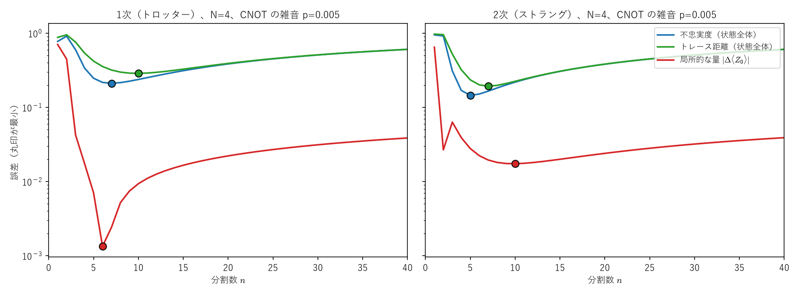

# トロッター実験を読むための翻訳 ―イジング模型・量子回路・雑音・ツイリング―

> **作成** 2026-10-05　**更新** 2026-10-10
> テーマ A-5（トロッター分解の最適な分割数）の実験の言葉を、行列と具体的な数値に翻訳するノート。
> なぜ最適な分割数があるのか、イジング模型、CNOT による ZZ、確率的な誤差とコヒーレントな誤差、ツイリング、誤差と不確かさ。

テーマ A-5（トロッター分解の最適な分割数）の実験で出てくる言葉を、行列と具体的な数値に翻訳するノートです。Part 0 で実験の問い（なぜ最適な分割数があるのか）を整理し、Part I 以降で、その周りの「模型」「回路」「雑音」「ツイリング」を扱います。

- **Part 0：そもそも何を調べているのか**（n で割っても可換にはならないこと、綱引きのモデルと最適な分割数、測り方で答えが変わる理由、誤り訂正のあとに残るもの）
- **Part I：何をシミュレーションしているか**（イジング模型とは何か、何を測っているか）
- **Part II：回路にする**（量子ビット、ゲート、ZZ の項を CNOT で作る仕組み）
- **Part III：雑音の2つの種類**（確率的な誤差とコヒーレントな誤差、積み重なり方の違い）
- **Part IV：ツイリング**（ランダムなパウリを挟むと、なぜコヒーレントな誤差が消えるのか）
- **Part V：実験の結果を翻訳する**（用語の対応表と、分かったことの言い直し）
- **Part VI：誤差と不確かさの言葉で言い直す**（系統誤差と偶然誤差、誤差と不確かさ、ジョブごとの揺らぎをどう捉えるか）

**関連ファイル**：実験の本体は [experiments/a5_trotter_noise/README.md](../../experiments/a5_trotter_noise/README.md)、記事の下書きは [article_draft.md](../../experiments/a5_trotter_noise/article_draft.md)。トロッター分解・BCH の公式は [matrix_exponential_commutator_bch_trotter](../04_群論・代数/matrix_exponential_commutator_bch_trotter.md)、パウリ行列は [pauli_matrices_derivation_and_group](../04_群論・代数/pauli_matrices_derivation_and_group.md)、密度行列は [density_matrix_bracket_notation](density_matrix_bracket_notation.md)。

**記号の約束**：パウリ行列を

$$
I=\begin{pmatrix}1&0\\0&1\end{pmatrix},\quad X=\begin{pmatrix}0&1\\1&0\end{pmatrix},\quad Y=\begin{pmatrix}0&-i\\i&0\end{pmatrix},\quad Z=\begin{pmatrix}1&0\\0&-1\end{pmatrix}
$$

とします。2量子ビットの行列 $P\otimes Q$ は「左が量子ビット 0、右が量子ビット 1」に作用するものとし、$Z_0=Z\otimes I$、$Z_0Z_1=Z\otimes Z$ のように書きます。基底の並びは $\lvert00\rangle,\lvert01\rangle,\lvert10\rangle,\lvert11\rangle$（左の数字が量子ビット 0）です。（Qiskit は左右を逆に並べるので、Qiskit の出力を読むときは注意が要ります。）

<a id="toc"></a>
## 目次

<!-- toc:start -->

- [Part 0：そもそも何を調べているのか](#p0)
  - [0-a. n で割っても、可換になるわけではない](#p0-0a)
  - [0-b. 綱引きのモデルと最適な分割数](#p0-0b)
  - [0-c. 何を「誤差」と呼ぶかで、q も n\* も変わる](#p0-0c)
  - [0-d. 誤り訂正が完成したら、この問題は消えるか](#p0-0d)
- [Part I：何をシミュレーションしているか](#p1)
  - [1. イジング模型は「方式」ではなく「模型」](#p1-1)
  - [2. 横磁場イジング模型：2つの項の綱引き](#p1-2)
  - [3. 何を測っているか：⟨ Z\_0⟩](#p1-3)
- [Part II：回路にする](#p2)
  - [4. 量子ビットとゲート](#p2-4)
  - [5. ZZ の項は CNOT・RZ・CNOT で作る](#p2-5)
  - [6. 1ステップと n ステップ](#p2-6)
- [Part III：雑音の2つの種類](#p3)
  - [7. 確率的な誤差：ときどき状態が壊れる](#p3-7)
  - [8. コヒーレントな誤差：毎回同じ向きに少し回りすぎる](#p3-8)
  - [9. 積み重なり方の比較](#p3-9)
- [Part IV：ツイリング](#p4)
  - [10. アイデア：ランダムなパウリで挟む](#p4-10)
  - [11. 誤差はどう変わるか](#p4-11)
  - [12. 平均すると確率的な誤差になる](#p4-12)
  - [13. 実機ではどうしたか](#p4-13)
- [Part V：実験の結果を翻訳する](#p5)
  - [14. 用語の対応表](#p5-14)
  - [15. 分かったことを言い直す](#p5-15)
- [Part VI：誤差と不確かさの言葉で言い直す](#p6)
  - [16. 3つの「ずれ」を分ける](#p6-16)
  - [17. ツイリングが変えるのは、系統誤差の「形」](#p6-17)
  - [18. 「誤差」と「不確かさ」の使い分け](#p6-18)
  - [19. くり返し性と再現性：ジョブごとの揺らぎ](#p6-19)
  - [20. 短い計測で揺らぎを捉えるには](#p6-20)
- [まとめ](#summary)

<!-- toc:end -->

<a id="p0"></a>

# Part 0：そもそも何を調べているのか

<!-- part-toc:start -->

**この Part の内容**

- [0-a. n で割っても、可換になるわけではない](#p0-0a)
- [0-b. 綱引きのモデルと最適な分割数](#p0-0b)
- [0-c. 何を「誤差」と呼ぶかで、q も n\* も変わる](#p0-0c)
- [0-d. 誤り訂正が完成したら、この問題は消えるか](#p0-0d)

<!-- part-toc:end -->

Part I 以降の用語に入る前に、この実験の問いそのものを整理します。「なぜ分割数 $n$ に最適な値があるのか」「なぜ測り方で答えが変わるのか」の2つです。

<a id="p0-0a"></a>

## 0-a. n で割っても、可換になるわけではない

トロッター分解

$$
e^{-i(A+B)t}\approx\Big(e^{-iBt/n}\,e^{-iAt/n}\Big)^n\tag{0-1}
$$

は、「$n$ で割ると $A$ と $B$ が可換に近づく」から成り立つ、と言いたくなります。しかし交換子は

$$
\Big[\frac An,\frac Bn\Big]=\frac1{n^2}[A,B]\tag{0-2}
$$

で、小さくはなりますが 0 にはなりません。$A$ と $B$ の非可換性そのものは、いくら刻んでも残ります。

起きていることは、「1回あたりの誤差が速く小さくなる」ことです。BCH の公式（[matrix_exponential_commutator_bch_trotter](../04_群論・代数/matrix_exponential_commutator_bch_trotter.md)）

$$
e^Xe^Y=\exp\Big(X+Y+\frac12[X,Y]+\cdots\Big)\tag{0-3}
$$

に、$X=-iBd$、$Y=-iAd$（$d=t/n$ は1ステップの時間）を入れると、$[X,Y]=(-i)^2d^2[B,A]=d^2[A,B]$ なので

$$
e^{-iBd}e^{-iAd}=\exp\Big(-i(A+B)d+\frac{d^2}2[A,B]+\cdots\Big)\tag{0-4}
$$

です。正しい1ステップ $e^{-i(A+B)d}$ とのずれは、交換子の項 $\frac{d^2}2[A,B]$ から始まり、大きさは $d^2=t^2/n^2$ に比例します。これを $n$ 回くり返すので、全体のずれはおおよそ

$$
n\times\frac{t^2}{2n^2}\big\lVert[A,B]\big\rVert=\frac{t^2}{2n}\big\lVert[A,B]\big\rVert\tag{0-5}
$$

で、$1/n$ で減ります（$\lVert\cdot\rVert$ は行列の大きさを測るノルム。ずれがステップごとに足し算で積み重なる以上には増えないことは、望遠鏡和の不等式 $\lVert U^n-V^n\rVert\le n\lVert U-V\rVert$ で保証され、Lean で形式証明してある：[Telescoping.lean](../../lean4/QuantumStudy/Telescoping.lean)）。

この実験の模型（$N=2$、$t=2$、$\lVert[A,B]\rVert=4$）で数値を確かめると

| $n$ | 1ステップの誤差 | $\frac{d^2}2\lVert[A,B]\rVert$ | 全体の誤差 | $n\times$ 全体の誤差 |
|---|---|---|---|---|
| 4 | 0.435 | 0.500 | 0.488 | 1.95 |
| 8 | 0.121 | 0.125 | 0.224 | 1.79 |
| 16 | 0.0310 | 0.0313 | 0.109 | 1.75 |
| 32 | 0.00780 | 0.00781 | 0.0544 | 1.74 |

で、1ステップの誤差は $\frac{d^2}2\lVert[A,B]\rVert$ にほぼ一致し（$n$ を2倍にすると 1/4）、全体の誤差は $n$ を2倍にすると約半分になります（$n\times$ 全体の誤差がほぼ一定）。誤差は行列の差の作用素ノルムで測りました。

<a id="p0-0b"></a>

## 0-b. 綱引きのモデルと最適な分割数

理想の量子コンピュータなら、$n$ を大きくするほど正確になります。しかし Part II で見るように、1ステップごとに CNOT が増え、実機では CNOT ごとに雑音が入ります。そこで、誤差を

$$
E(n)\approx\underbrace{\frac a{n^q}}_{\text{トロッター誤差}}+\underbrace{b\,p\,n}_{\text{雑音}}\tag{0-6}
$$

とモデル化します。$p$ は CNOT 1個あたりの雑音の強さ、$a,b$ は問題で決まる係数、$q$ はトロッター誤差が $n$ についてどれだけ速く減るかを表す指数です。第1項は $n$ とともに減り、第2項は増えるので、間に最小点があります。微分して 0 とおくと

$$
\frac{dE}{dn}=-\frac{qa}{n^{q+1}}+bp=0\;\Longrightarrow\;n^{q+1}=\frac{qa}{bp}\;\Longrightarrow\;n^*=\Big(\frac{qa}{bp}\Big)^{1/(q+1)}\tag{0-7}
$$

です（$\frac{d^2E}{dn^2}=\frac{q(q+1)a}{n^{q+2}}>0$ なので、確かに最小）。雑音の強さへの依存だけを取り出すと

$$
n^*\propto p^{-1/(q+1)}\tag{0-8}
$$

で、雑音が弱いほど細かく刻むのが得になります。

実際の計算（$N=4$、$p=0.005$、1次、状態全体のトレース距離で測った誤差）では

| $n$ | 2 | 4 | 6 | 8 | 10 | 12 | 16 | 24 |
|---|---|---|---|---|---|---|---|---|
| トロッター誤差だけ（雑音なし） | 0.955 | 0.521 | 0.306 | 0.215 | 0.166 | 0.135 | 0.099 | 0.064 |
| 雑音込み | 0.953 | 0.540 | 0.356 | 0.299 | **0.288** | 0.297 | 0.340 | 0.442 |

となり、雑音なしでは $n$ とともに減り続けるのに、雑音込みでは $n=10$ 付近で最小になり、その先は増えます。図にすると U 字型です。



<a id="p0-0c"></a>

## 0-c. 何を「誤差」と呼ぶかで、q も n* も変わる

(0-8) の指数は $q$ で決まります。その $q$ は、**誤差を何で測るか**で変わります。この実験では3通りで測りました。

- **トレース距離** $D=\frac12\lVert\rho-\lvert\psi\rangle\langle\psi\rvert\rVert_1$：状態全体が、正しい状態からどれだけ離れているか（距離）。
- **不忠実度** $1-\langle\psi\rvert\rho\lvert\psi\rangle$：正しい状態と重ならない割合。
- **局所的な量の誤差** $\lvert\langle Z_0\rangle_\rho-\langle Z_0\rangle_{\text{正確}}\rvert$：量子ビット 0 の向きだけを見たずれ（実機で測りやすい）。

$k$ 次の分解（1次なら $k=1$、ストラングなら $k=2$）では、状態のずれ（距離）は $1/n^k$ で減ります。だからトレース距離では $q=k$ です。

不忠実度は、雑音のない（純粋な）状態どうしでは、トレース距離のちょうど2乗になることが知られています（$1-F=D^2$。数値でも確かめました）。そのため $q=2k$ です。雑音の項は、どちらの測り方でも $p\,n$ に比例します。

局所的な量では、ふつうは $q=k$ ですが、この模型では初期状態 $\lvert0\cdots0\rangle$ と $Z_0$ が ZZ の項と交換するため、1次の分解でも誤差の $1/n$ の項が消えて $1/n^2$ から始まります（Layden 2021 の条件）。そのため1次・2次とも $q=2$ です。

| 測り方 | $q$ の予想（1次／2次） | $q$ の当てはめ（$N=4$） | $n^*\propto p^s$ の $s=-\frac1{q+1}$（1次／2次） |
|---|---|---|---|
| トレース距離 | 1 ／ 2 | 1.06 ／ 2.01 | $-\frac12$ ／ $-\frac13$ |
| 不忠実度 | 2 ／ 4 | 2.12 ／ 4.02 | $-\frac13$ ／ $-\frac15$ |
| 局所的な量 $\langle Z_0\rangle$ | 2 ／ 2 | 2.02 ／ 2.00 | $-\frac13$ ／ $-\frac13$ |

つまり、「最適な分割数はいくつか」という問いには、「何の誤差を小さくしたいのか」が先に決まらないと答えられません。さらに局所的な量では、トロッター誤差と雑音が符号つきで打ち消し合い、誤差が偶然小さく見える $n$（偽の最適点）が現れることもあります（Part V の 15 節の 4）。

<a id="p0-0d"></a>

## 0-d. 誤り訂正が完成したら、この問題は消えるか

誤り訂正つきの量子コンピュータが完成すれば、(0-6) の雑音の項 $b\,p\,n$ はほぼ消えます。しかし、綱引きそのものは形を変えて残ります。$n$ を増やすほど論理ゲートの数（計算時間）が増えるので、「必要な精度を、いちばん少ない計算量で出すには、何段に分けるか」という、**精度と計算コストの綱引き**になります。誤り訂正では1個の論理ゲートに多くの物理ゲートが要るので、ゲートの数を減らす工夫（高次の分解の選び方など）の重みは、むしろ増すと考えられます。

今の実機（誤り訂正なし）では、それに加えて、雑音の種類（Part III）、雑音の揺らぎ（Part VI）、測る量（0-c 節）まで含めて実装を選ぶ必要があります。数学的に良い近似（$n\to\infty$）と、実機で良い実装（有限の $n^*$）が逆向きになる、というのがこの実験の出発点です。

<a id="p1"></a>

# Part I：何をシミュレーションしているか

<!-- part-toc:start -->

**この Part の内容**

- [1. イジング模型は「方式」ではなく「模型」](#p1-1)
- [2. 横磁場イジング模型：2つの項の綱引き](#p1-2)
- [3. 何を測っているか：⟨ Z\_0⟩](#p1-3)

<!-- part-toc:end -->

<a id="p1-1"></a>

## 1. イジング模型は「方式」ではなく「模型」

**イジング模型**は、量子コンピュータの方式ではなく、物理の**模型**（磁石の性質を説明するための、小さな磁石の並びのおもちゃ）です。小さな磁石（スピン）が一列に並び、それぞれが「上向き」か「下向き」を取ります。

混同しやすい理由があります。**量子アニーリング**と呼ばれる方式の計算機（D-Wave など）や、富士通のデジタルアニーラは、「イジング模型の、エネルギーがいちばん低い並び方を探す」装置として知られています。組み合わせ最適化の問題をイジング模型の形に書き直して解くので、「イジング型の計算機」と呼ばれることがあります。

このリポジトリの実験は、それとは別の使い方です。

| | 量子アニーリング | この実験（ゲート型） |
|---|---|---|
| 計算機 | イジング模型を「解く」専用の装置 | 汎用のゲート型量子コンピュータ（IBM の `ibm_fez`） |
| イジング模型の役割 | 解きたい問題そのもの | **シミュレーションする対象**（時間とともにどう変わるか） |
| 欲しいもの | エネルギー最小の並び | 時刻 $t$ での量子状態と、その測定値 |

つまり、ゲート型の量子コンピュータの上で、「量子力学に従うイジング模型の磁石が、時間とともにどう揺れ動くか」を再現しています。量子コンピュータの量子ビット1個が、模型の磁石1個に対応します。

<a id="p1-2"></a>

## 2. 横磁場イジング模型：2つの項の綱引き

実験で使ったのは、2個の磁石（$N=2$）の**横磁場イジング模型**です。ハミルトニアン（エネルギーを表す行列。時間発展を決める）は

$$
H=\underbrace{Z_0Z_1}_{A}+\underbrace{X_0+X_1}_{B}\tag{I-1}
$$

です。2つの項の意味は次のとおりです。

- $A=Z_0Z_1$（**イジングの項**）：2つの磁石の向きが揃っている（$\lvert00\rangle$ か $\lvert11\rangle$）と $+1$、逆向き（$\lvert01\rangle$ か $\lvert10\rangle$）だと $-1$ を返す、対角の行列です。向きの関係を「数える」だけで、向きは変えません。
- $B=X_0+X_1$（**横磁場の項**）：$X$ は $\lvert0\rangle$ と $\lvert1\rangle$ を入れ替える行列なので、磁石の向きを揺さぶる働きをします。

4×4 の行列で書くと

$$
A=\begin{pmatrix}1&0&0&0\\0&-1&0&0\\0&0&-1&0\\0&0&0&1\end{pmatrix},\quad
B=\begin{pmatrix}0&1&1&0\\1&0&0&1\\1&0&0&1\\0&1&1&0\end{pmatrix},\quad
H=\begin{pmatrix}1&1&1&0\\1&-1&0&1\\1&0&-1&1\\0&1&1&1\end{pmatrix}\tag{I-2}
$$

です。たとえば $B$ の $b_{12}=1$ は「$\lvert01\rangle$ から $\lvert00\rangle$ へ移る」成分で、量子ビット 1 の向きが入れ替わる効果を表します。

**なぜトロッター分解が要るのか**：$A$ と $B$ は交換しません。実際に計算すると

$$
[A,B]=AB-BA=\begin{pmatrix}0&2&2&0\\-2&0&0&-2\\-2&0&0&-2\\0&2&2&0\end{pmatrix}\neq0\tag{I-3}
$$

なので、$e^{-iHt}\neq e^{-iBt}e^{-iAt}$ です。$e^{-iAt}$（対角なので簡単）と $e^{-iBt}$（1量子ビットの回転の組なので簡単）は量子回路で作れますが、$e^{-iHt}$ はそのままでは作れません。そこで、時間を $n$ 個に刻んで $\big(e^{-iBt/n}e^{-iAt/n}\big)^n$ で近似します。これがトロッター分解（1次）です。

<a id="p1-3"></a>

## 3. 何を測っているか：$\langle Z_0\rangle$

初期状態は全部上向き $\lvert00\rangle$、時刻は $t=2$ です。測るのは

$$
\langle Z_0\rangle=P(\text{量子ビット 0 が }0)-P(\text{量子ビット 0 が }1)\tag{I-4}
$$

です。$Z_0=Z\otimes I$ の固有値は、量子ビット 0 が $0$ なら $+1$、$1$ なら $-1$ なので、その平均は「上向きの確率 − 下向きの確率」になります。$+1$ なら確実に上向き、$-1$ なら確実に下向き、$0$ なら五分五分です。

正確な値（$e^{-iHt}$ を行列の指数関数で直接計算したもの）は

| 時刻 $t$ | 0 | 0.5 | 1.0 | 2.0 |
|---|---|---|---|---|
| $\langle Z_0\rangle$ | 1 | 0.5767 | −0.0374 | **−0.2959** |

です。横磁場に揺さぶられて、上向きだった磁石が時間とともに下向きのほうへ傾いていきます。

1次のトロッター分解で近似すると、分割数 $n$ ごとに

| $n$ | 1 | 2 | 6 | 14 | 正確な値 |
|---|---|---|---|---|---|
| $\langle Z_0\rangle$（雑音なし） | −0.6536 | +0.5173 | −0.2058 | −0.2800 | −0.2959 |

となり、$n$ を十分大きくすると正確な値に近づきます（ただし小さい $n$ では単調ではなく、$n=2$ のほうが $n=1$ よりずれが大きい）。この差が**トロッター誤差**です。

<a id="p2"></a>

# Part II：回路にする

<!-- part-toc:start -->

**この Part の内容**

- [4. 量子ビットとゲート](#p2-4)
- [5. ZZ の項は CNOT・RZ・CNOT で作る](#p2-5)
- [6. 1ステップと n ステップ](#p2-6)

<!-- part-toc:end -->

<a id="p2-4"></a>

## 4. 量子ビットとゲート

- **量子ビット**：$\lvert0\rangle$ と $\lvert1\rangle$ の重ね合わせを取る、2次元のベクトル。模型の磁石1個に当たります。
- **ゲート**：量子ビットに掛けるユニタリ行列。回路図の箱1つが行列1つです。

この実験で使うゲートは3種類です。

$$
R_X(\theta)=e^{-i\theta X/2},\qquad R_Z(\theta)=e^{-i\theta Z/2}=\begin{pmatrix}e^{-i\theta/2}&0\\0&e^{i\theta/2}\end{pmatrix},\qquad
\mathrm{CX}=\lvert0\rangle\langle0\rvert\otimes I+\lvert1\rangle\langle1\rvert\otimes X\tag{II-1}
$$

$\mathrm{CX}$（CNOT）は「量子ビット 0（制御）が $1$ のときだけ、量子ビット 1（標的）を反転する」2量子ビットのゲートです。

横磁場の項 $e^{-iBd}=e^{-iX_0d}e^{-iX_1d}$（$X_0$ と $X_1$ は別の量子ビットなので交換する）は、各量子ビットに $R_X(2d)$ を掛けるだけで作れます。

<a id="p2-5"></a>

## 5. ZZ の項は CNOT・RZ・CNOT で作る

イジングの項 $e^{-iZ_0Z_1d}$ は、2つの量子ビットにまたがる回転なので、1量子ビットのゲートだけでは作れません。そこで

$$
e^{-iZ_0Z_1d}=\mathrm{CX}\;\big(I\otimes R_Z(2d)\big)\;\mathrm{CX}\tag{II-2}
$$

と組み立てます（数値で一致を確かめました）。仕組みは次のとおりです。

1. 最初の CX で、標的（量子ビット 1）に「2つの量子ビットが揃っているか」を書き込みます。揃っていれば $0$、違えば $1$ になります（$\lvert ab\rangle\to\lvert a,\,a\oplus b\rangle$、$\oplus$ は排他的論理和）。
2. 標的に $R_Z(2d)$ を掛けると、標的が $0$ なら位相 $e^{-id}$、$1$ なら $e^{+id}$ が付きます。つまり「揃っていれば $e^{-id}$、違えば $e^{+id}$」。
3. 2つ目の CX で標的を元に戻します。

結果として、対角に

$$
e^{-iZ_0Z_1d}=\operatorname{diag}\big(e^{-id},\,e^{id},\,e^{id},\,e^{-id}\big)\tag{II-3}
$$

が並びます。これは (I-2) の $A$ の対角成分 $(1,-1,-1,1)$ に $-id$ を掛けて指数関数にしたもので、確かに $e^{-iAd}$ です。

<a id="p2-6"></a>

## 6. 1ステップと n ステップ

1次のトロッター分解の1ステップ（$d=t/n$）は

$$
\underbrace{\mathrm{CX}\to R_Z(2d)\to\mathrm{CX}}_{e^{-iAd}}\;\to\;\underbrace{R_X(2d)\otimes R_X(2d)}_{e^{-iBd}}\tag{II-4}
$$

で、**1ステップに CNOT が2個**です。$n$ ステップなら CNOT は $2n$ 個（$n=14$ で 28 個）。分割を細かくするほど、トロッター誤差は減りますが、CNOT が増えます。実機の雑音は主に CNOT で入るので、ここで「綱引き」が起きます。

実機（IBM の Heron）の本来の2量子ビットゲートは CNOT ではなく CZ（$\operatorname{diag}(1,1,1,-1)$）で、CNOT は「標的に $H$ を掛けて CZ、もう一度 $H$」に変換されて実行されます（$\mathrm{CX}=(I\otimes H)\,\mathrm{CZ}\,(I\otimes H)$）。

<a id="p3"></a>

# Part III：雑音の2つの種類

<!-- part-toc:start -->

**この Part の内容**

- [7. 確率的な誤差：ときどき状態が壊れる](#p3-7)
- [8. コヒーレントな誤差：毎回同じ向きに少し回りすぎる](#p3-8)
- [9. 積み重なり方の比較](#p3-9)

<!-- part-toc:end -->

雑音（誤差）には、性質のまったく違う2種類があります。この区別が、実験の結果を読むいちばんの鍵です。

<a id="p3-7"></a>

## 7. 確率的な誤差：ときどき状態が壊れる

**確率的な誤差**は「確率 $p$ でゲートが失敗し、状態がでたらめになる」タイプです。代表が**脱分極**で、1量子ビットなら

$$
\rho\;\longmapsto\;(1-p)\,\rho+p\,\frac I2\tag{III-1}
$$

と書けます（$\rho$ は密度行列。確率的に混ざった状態を表すのに使う）。$\frac I2$ は「上向きと下向きが五分五分」の状態です。$\operatorname{tr}(Z\,\frac I2)=0$ なので

$$
\langle Z\rangle\;\longmapsto\;(1-p)\,\langle Z\rangle\tag{III-2}
$$

となり、$n$ 回で $(1-p)^n\langle Z\rangle$ です。**この単純な例（1量子ビットに脱分極だけを $n$ 回）では、確率的な誤差は測定値を必ず 0 に近づけます**（符号は変えず、大きさだけを縮める）。

ただし、途中にゲートを挟む実際の回路では、これは一般には成り立ちません。雑音が入るたびにゲートで状態が回されるので、雑音なしの値が 0 に近いときなどに、雑音が測定値を 0 から遠ざける向きに押すことがあります（A-5 のテスト `test_noise_does_not_always_shrink_toward_zero` に反例：$N=5$、2次、$p=0.02$、$n=3$）。A-5 の実機の $N=2$ の回路のように、2量子ビット全体にかかる脱分極なら、脱分極がゲートと交換するので、この例と同じく「雑音なしのトロッター回路の値を、決まった割合で縮める」形になります。

<a id="p3-8"></a>

## 8. コヒーレントな誤差：毎回同じ向きに少し回りすぎる

**コヒーレントな誤差**は「ゲートが毎回、同じ向きに少しだけ回りすぎる（回り足りない）」タイプです。たとえば各ゲートの後に、意図しない小さな回転

$$
E=e^{-i\varepsilon X}=\cos\varepsilon\,I-i\sin\varepsilon\,X\tag{III-3}
$$

が入るとします。$\varepsilon$ は小さい角度（実機では 0.01〜0.05 rad 程度）です。$\lvert0\rangle$ から始めて $E$ を $n$ 回掛けると、同じ軸の回転なので角度がそのまま足し算になり

$$
E^n=e^{-in\varepsilon X}=\cos(n\varepsilon)\,I-i\sin(n\varepsilon)\,X,\qquad E^n\lvert0\rangle=\cos(n\varepsilon)\lvert0\rangle-i\sin(n\varepsilon)\lvert1\rangle\tag{III-4}
$$

$$
\langle Z\rangle=\cos^2(n\varepsilon)-\sin^2(n\varepsilon)=\cos(2n\varepsilon)\tag{III-5}
$$

です。**角度が $n$ に比例して積み重なる**ので、1回は小さくても、回数が増えると大きくずれます。また、回転なので、測定値を 0 に近づけるとは限らず、**0 を通り越して反対側へ行く**こともあります。

<a id="p3-9"></a>

## 9. 積み重なり方の比較

同じ $\varepsilon$ の誤差を、(a) コヒーレントなまま $n$ 回、(b) 確率的な誤差に変えて $n$ 回（作り方は Part IV）、掛けた場合を比べます。(b) では1回あたり $\langle Z\rangle\mapsto\cos(2\varepsilon)\langle Z\rangle$ になる（(IV-6) で導きます）ので、$n$ 回で $\cos(2\varepsilon)^n$ です。

$\varepsilon$ が小さいとき、$\cos x\approx1-\frac{x^2}2$ を使うと

$$
\text{(a)}\;1-\cos(2n\varepsilon)\approx2n^2\varepsilon^2,\qquad\text{(b)}\;1-\cos(2\varepsilon)^n\approx1-(1-2\varepsilon^2)^n\approx2n\varepsilon^2\tag{III-6}
$$

で、**この例（$\lvert0\rangle$ から始めて $Z$ を測る）では、ずれはコヒーレントなら $n^2$ に、確率的なら $n$ に比例**します。違いは $n$ 倍です。

$n^2$ になるのは、$\lvert0\rangle$ が $Z$ の固有状態で、$\langle Z\rangle$ が回転の角度について2次でしか変わらないからです。一般に言えるのは、**コヒーレントな誤差は角度（振幅）が $n$ に比例して積み重なり、確率的な誤差は確率が $n$ に比例して積み重なる**ことです。測る量が角度に1次で効く場合は、コヒーレントな誤差のずれは $n$ に比例します。たとえば $\lvert{+y}\rangle$（$Y$ の固有値 $+1$ の状態）から始めて $Z$ を測ると、$\langle Z\rangle=\sin(2n\varepsilon)\approx2n\varepsilon$ です（$\varepsilon=0.024$ で数値を確かめました）。このとき確率的な誤差（下の Part IV の (IV-6)、$X$ がときどきかかる）では、$\langle Z\rangle$ は 0 のまま動きません。どちらの場合も、コヒーレントな誤差のほうがずっと大きく効く、という点は同じです。

実機の量子ビット 142–143 で直接測った大きさ（CNOT 1個あたり $\varepsilon\approx0.024$ rad）で、CNOT 28 個（$n=14$ のトロッター回路と同じ数）を通すと

| | $\langle Z\rangle$（理想は 1） |
|---|---|
| (a) コヒーレントなまま | $\cos(2\cdot28\cdot0.024)=$ **0.225** |
| (b) 確率的な誤差に変えた場合 | $\cos(0.048)^{28}=$ **0.968** |

です。1回あたりの「失敗の確率」はどちらも $\sin^2\varepsilon\approx0.0006$（0.06%）と同じなのに、結果は大きく違います。

**較正データが当てにならなかった理由**：実機の較正データに載っているゲートの誤差（`ibm_fez` の CZ で 0.15% など）は、ランダムなゲート列を使う測定（ランダム化ベンチマーキングの仲間）で求めるのが一般的で、「誤差をランダムにならしたときの、1回あたりの失敗の確率」に当たると知られています。つまり (b) の見方の数字です。コヒーレントな誤差が積み重なる回路では、実際のずれは (a) のように大きくなるので、較正の数字から予測すると外れます。

<a id="p4"></a>

# Part IV：ツイリング

<!-- part-toc:start -->

**この Part の内容**

- [10. アイデア：ランダムなパウリで挟む](#p4-10)
- [11. 誤差はどう変わるか](#p4-11)
- [12. 平均すると確率的な誤差になる](#p4-12)
- [13. 実機ではどうしたか](#p4-13)

<!-- part-toc:end -->

<a id="p4-10"></a>

## 10. アイデア：ランダムなパウリで挟む

**ゲートのツイリング**（パウリ・ツイリング、ランダム化コンパイルとも呼ばれる）は、「CNOT の前後に、ランダムに選んだパウリ行列を挟む」手法です。ただし、**理想の CNOT としての働きは変えない**ように、後ろのパウリを選びます。

鍵になるのは、パウリ行列が CNOT を通り抜けると、別のパウリ行列になるという性質です。$\mathrm{CX}\,P\,\mathrm{CX}$ を計算すると（数値で確かめました）

| 前に挟む $P$ | $\mathrm{CX}\,P\,\mathrm{CX}$（後ろで打ち消す分） |
|---|---|
| $X\otimes I$（制御を反転） | $X\otimes X$ |
| $I\otimes X$ | $I\otimes X$ |
| $Z\otimes I$ | $Z\otimes I$ |
| $I\otimes Z$（標的の位相） | $Z\otimes Z$ |
| $Y\otimes I$ | $Y\otimes X$ |
| $I\otimes Y$ | $Z\otimes Y$ |

となります。前に $P$、後ろに $P'=\mathrm{CX}\,P\,\mathrm{CX}$ を挟むと、$\mathrm{CX}^2=I$ なので

$$
P'\,\mathrm{CX}\,P=\mathrm{CX}\,P\,\mathrm{CX}\,\mathrm{CX}\,P=\mathrm{CX}\,P\,P=\mathrm{CX}\tag{IV-1}
$$

で、全体としては元の CNOT のままです。たとえば「制御に $X$ を掛けてから CNOT」は「CNOT のあとで両方に $X$」と同じなので、後ろで両方に $X$ を掛ければ元に戻ります。

<a id="p4-11"></a>

## 11. 誤差はどう変わるか

実機の CNOT は、理想の $\mathrm{CX}$ のあとに誤差 $E$ が付いた $E\,\mathrm{CX}$ です。これを $P'$ と $P$ で挟むと

$$
P'\,E\,\mathrm{CX}\,P=\big(P'EP'\big)\,P'\,\mathrm{CX}\,P=\big(P'EP'\big)\,\mathrm{CX}\tag{IV-2}
$$

となります（$P'P'=I$ を間に入れた）。つまり、**誤差 $E$ がパウリ $P'$ で挟まれた $P'EP'$ に化けます**。$P$ をランダムに選ぶので $P'$ もランダムになり、実行ごとに誤差の「向き」が変わります。

1量子ビットで具体的に見ます。$E=e^{-i\varepsilon X}=\cos\varepsilon\,I-i\sin\varepsilon\,X$ を各パウリで挟むと

- $P=I$ または $X$：$X$ と $X$ は交換するので $PEP=E$（回転の向きはそのまま）
- $P=Y$ または $Z$：$ZXZ=-X$、$YXY=-X$ なので $PEP=\cos\varepsilon\,I+i\sin\varepsilon\,X=E^\dagger$（**逆向きの回転**）

です。半分の実行では $+\varepsilon$、残り半分では $-\varepsilon$ 回るので、平均すると回転の向きが打ち消し合います。

<a id="p4-12"></a>

## 12. 平均すると確率的な誤差になる

4つのパウリを等しい確率で選んだときの平均の状態は

$$
\rho\;\longmapsto\;\frac12\Big(E\rho E^\dagger+E^\dagger\rho E\Big)\tag{IV-3}
$$

です。$c=\cos\varepsilon$、$s=\sin\varepsilon$ と書いて展開すると

$$
E\rho E^\dagger=(cI-isX)\,\rho\,(cI+isX)=c^2\rho+ics\,\rho X-ics\,X\rho+s^2X\rho X\tag{IV-4}
$$

$$
E^\dagger\rho E=(cI+isX)\,\rho\,(cI-isX)=c^2\rho-ics\,\rho X+ics\,X\rho+s^2X\rho X\tag{IV-5}
$$

で、足すと $\pm ics$ の項（回転の向きを持つ部分）がちょうど打ち消し合い

$$
\rho\;\longmapsto\;\cos^2\varepsilon\;\rho+\sin^2\varepsilon\;X\rho X\tag{IV-6}
$$

が残ります（SymPy で確かめました）。これは「確率 $\cos^2\varepsilon$ で何もしない、確率 $\sin^2\varepsilon$ で $X$ を掛ける（反転する）」という**確率的な誤差**です。このとき $\langle Z\rangle\mapsto(\cos^2\varepsilon-\sin^2\varepsilon)\langle Z\rangle=\cos(2\varepsilon)\langle Z\rangle$ で、9節の (b) の式になります。

まとめると、ツイリングは

- 誤差の**大きさ**（1回あたりの失敗の確率 $\sin^2\varepsilon$）は変えない
- 誤差の**種類**を、コヒーレント（向きがそろって積み重なる）から確率的（積み重ならない）に変える

手法です。誤差を消すのではなく、「たちの悪い誤差を、たちの良い誤差に変える」と言えます。2量子ビットの場合も、16個のパウリで同じことが起き、誤差はパウリ行列をランダムに掛ける確率的な誤差になると知られています（Wallman & Emerson, PRA 94, 052325 (2016)）。

<a id="p4-13"></a>

## 13. 実機ではどうしたか

IBM の実行環境（Qiskit Runtime の Sampler）には、ゲートのツイリングを自動で行うオプションがあります。実験では

```python
sampler.options.twirling.enable_gates = True          # 2量子ビットゲートの前後にランダムなパウリを挟む
sampler.options.twirling.num_randomizations = 32      # パウリの選び方を 32 通り作る
sampler.options.twirling.shots_per_randomization = …  # 各通りのショット数（合計が指定のショット数以上になるように）
```

とし、同じ回路を 32 通りのランダムなパウリの挟み方で実行して平均しました（[hardware.py](../../experiments/a5_trotter_noise/hardware.py)）。挟むパウリは1量子ビットのゲートなので、追加のコストはほとんどありません。

<a id="p5"></a>

# Part V：実験の結果を翻訳する

<!-- part-toc:start -->

**この Part の内容**

- [14. 用語の対応表](#p5-14)
- [15. 分かったことを言い直す](#p5-15)

<!-- part-toc:end -->

<a id="p5-14"></a>

## 14. 用語の対応表

| 実験の言葉 | 意味 |
|---|---|
| 分割数 $n$ | トロッター分解で時間を刻む数。CNOT の数は $2n$ |
| トロッター誤差 | 雑音がなくても残る、分解による近似の誤差。$n$ を増やすと減る |
| 雑音による変化 | 実機の値 − 雑音なしのトロッター積の値。$n$ を増やすと増える |
| 最適な分割数 $n^*$ | 2つの合計（局所的な量では、実機の値と正確な値の差）がいちばん小さくなる $n$ |
| 較正データ | IBM が公開するゲートごとの誤差・読み出しの誤差・T1・T2。9節の (b) の見方の数字 |
| $p_{\text{eff}}$（実効的な脱分極の強さ） | 「確率的な誤差だけだとしたら、どれくらいの $p$ なら実機に合うか」を当てはめた値 |
| ショット・統計誤差 | 同じ回路を何千回も測って平均する。8000 回なら $\langle Z_0\rangle$ の誤差は約 ±0.011 |
| 読み出しの補正 | 測定そのものの誤り（0 を 1 と読むなど、約 0.5%）を、全 0・全 1 の状態を測って割り戻す |
| $\chi^2$ | モデルと実機の差を統計誤差で割って2乗し、足したもの。点の数と同じくらいなら「統計誤差の範囲で合う」 |
| コヒーレントな誤差 | 8節。毎回同じ向きに回りすぎる誤差。角度が $n$ に比例して積み重なる（測る量への効き方は、状態と測る量しだいで $n$ または $n^2$） |
| ゲートのツイリング | Part IV。コヒーレントな誤差を確率的な誤差に変える |
| 動的デカップリング | 何もしていない待ち時間に、反転のパルスを入れて位相のずれを戻す手法。待ち時間中の誤差にだけ効く |
| 偽の最適点 | トロッター誤差と雑音による変化が、符号が逆でたまたま打ち消し合い、誤差が小さく見える $n$ |
| 量子ビットの組（22–23、142–143） | 実機の 156 個の量子ビットのうち、実験に使った隣り合う2個の番号 |

<a id="p5-15"></a>

## 15. 分かったことを言い直す

1. **較正データの数字から「何段に分けるのがよいか」を予測すると、外れた**。雑音は較正の値の 6〜11 倍に効いた。
2. **ツイリングを入れると、最適な分割数の予測が当たるようになった**。ツイリングは誤差の大きさを変えず種類だけを変えるので、この結果は「外れた主な原因は、誤差の大きさではなく種類（コヒーレントな誤差が積み重なること）だった」ことを**強く示唆する**。9節の表の 0.225 と 0.968 の違いに当たることが、実機で起きていたと考えられる。ただし、ツイリング後も、実機に合う脱分極の強さ $p_{\text{eff}}=0.0052$ は較正の値 0.0015 の約 3.5 倍で、残りの原因はこのデータだけでは確定できない。
3. **コヒーレントな誤差の中身を特定した**。CNOT ごとに、標的の量子ビットが X 軸まわりに少し回る誤差が主で、その向きと大きさは量子ビットの組ごとに違う（142–143 では大きく、22–23 では小さい）。較正データの数字は2組とも同じ 0.15% で、この違いは較正データには出ない。当てはめたモデルからこの回転を測る前に予測し、別の回路で確かめた。
4. **シミュレーションで予想した「偽の最適点」が、実機でも出た**。142–143 の1次の分解で、$n=5$ の誤差が 0.019 と小さく見えたのは、トロッター誤差（+0.132）とコヒーレントな誤差による変化（−0.152）の打ち消し合いだった。
5. **1回の実行で結論を出さない**。初日は「2次の分解はコヒーレントな誤差に強い」と見えたが、翌日に測り直すと、1回のジョブの揺らぎだった。

<a id="p6"></a>

# Part VI：誤差と不確かさの言葉で言い直す

<!-- part-toc:start -->

**この Part の内容**

- [16. 3つの「ずれ」を分ける](#p6-16)
- [17. ツイリングが変えるのは、系統誤差の「形」](#p6-17)
- [18. 「誤差」と「不確かさ」の使い分け](#p6-18)
- [19. くり返し性と再現性：ジョブごとの揺らぎ](#p6-19)
- [20. 短い計測で揺らぎを捉えるには](#p6-20)

<!-- part-toc:end -->

計測の分野では、誤差を**系統誤差**（毎回同じ向きにずれる）と**偶然誤差**（測るたびにばらつく）に分けます。また、真の値は知りえないので、測定の結果は「誤差」ではなく**不確かさ**（値がどの範囲にありそうか）で表す、という考え方があります（GUM：計測における不確かさの表現のガイド）。この実験の量を、その言葉で整理します。

<a id="p6-16"></a>

## 16. 3つの「ずれ」を分ける

実機で測った $\langle Z_0\rangle$ と正確な値の差には、性質の違う3つのものが混ざっています。

$$
\underbrace{\langle Z_0\rangle_{\text{実機}}-\langle Z_0\rangle_{\text{正確}}}_{\text{局所的な量の誤差}}
=\underbrace{\big(\langle Z_0\rangle_{\text{雑音なしのトロッター}}-\langle Z_0\rangle_{\text{正確}}\big)}_{\text{トロッター誤差}}
+\underbrace{\big(\langle Z_0\rangle_{\text{実機の平均}}-\langle Z_0\rangle_{\text{雑音なしのトロッター}}\big)}_{\text{雑音による変化}}
+\underbrace{\big(\langle Z_0\rangle_{\text{実機}}-\langle Z_0\rangle_{\text{実機の平均}}\big)}_{\text{ショットのばらつき}}\tag{VI-1}
$$

「実機の平均」は、ショットを無限に増やしたときの値という意味です。

| 成分 | 性質 | ショットを増やすと | 何で分かるか |
|---|---|---|---|
| トロッター誤差 | 近似（アルゴリズム）の誤差。測定の誤差ではない | 変わらない | 古典コンピュータで厳密に計算できる |
| 雑音による変化 | 測定値から見ると**系統誤差** | 変わらない | 実機でしか分からない |
| ショットのばらつき | **偶然誤差** | $1/\sqrt{\text{ショット数}}$ で減る | 二項分布から見積もれる |

<a id="p6-17"></a>

## 17. ツイリングが変えるのは、系統誤差の「形」

ショット1回ずつのレベルでは、確率的な誤差はランダムです（どの回で反転が起きるかは偶然）。しかし何千回の平均で見ると、(III-2) のように $\langle Z\rangle$ を $(1-p)^n$ 倍に縮める、**向きも形も決まったずれ**になります。ショットをいくら増やしても消えないので、これも系統誤差です。

| | ショット1回ずつ | 平均 $\langle Z\rangle$ への効き方 |
|---|---|---|
| コヒーレントな誤差 | 毎回同じだけ回る（決定的） | 系統誤差。向きは誤差の中身しだいで、角度が $n$ に比例して積み重なり（効き方は $n$ または $n^2$）、0 を通り越すこともある |
| 確率的な誤差（脱分極、ツイリング後） | どの回で反転するかはランダム | 系統誤差。必ず 0 に向かって決まった割合で縮み、$n$ で効く |
| ショットのばらつき | 0 か 1 かでばらつく | 偶然誤差 |

つまり、ツイリングは「系統誤差を偶然誤差に変える」のではなく、**向きも形も分からない系統誤差を、形の分かっている系統誤差に変える**手法です。形が分かっていれば、較正データから予測でき、補正もできます。実験で「ツイリングを入れると予測が当たった」のはこのためです。雑音の影響を後処理で取り除く手法（ゼロノイズ外挿、確率的誤差キャンセルなど）も、雑音がパウリ型（確率的な誤差）であることを前提にすることが多く、その前処理としてツイリングが使われると知られています。

<a id="p6-18"></a>

## 18. 「誤差」と「不確かさ」の使い分け

GUM の考え方では、真の値は原理的に知りえないので、「真の値からの誤差」ではなく「不確かさ」で結果を表します。一方、計測の用語集（VIM）では、**基準の値**（参照値）が与えられていれば、「測定値 − 基準の値」を誤差と呼びます。標準器と比べる校正と同じ状況です。

この実験では、基準の値 $\langle Z_0\rangle_{\text{正確}}=-0.2959$ が、行列の指数関数を古典コンピュータで直接計算して得られます。数値計算の誤差は $10^{-15}$ 程度で、事実上ゼロです。そのため、次のように使い分けるのが正確です。

| 量 | 言葉 | 理由 |
|---|---|---|
| 実機の値 − 正確な値 | 誤差 | 基準の値が計算で分かっている |
| トロッター誤差 | 誤差（近似の誤差） | 計算で厳密に分かる |
| 実機の値に付けた $\pm0.011$ など | **標準不確かさ** | 有限回の測定によるばらつきの見積もり |

$\pm0.011$ は、測定の結果（0 か 1 か）が二項分布に従うことから

$$
u=\frac{\sqrt{1-\langle Z\rangle^2}}{\sqrt{\text{ショット数}}}\cdot\frac1{1-e_0-e_1}\tag{VI-2}
$$

で見積もった値です（$e_0,e_1$ は読み出しの誤り率で、後ろの割り算は読み出しの補正の分）。$\langle Z\rangle\approx-0.2$、8000 ショットなら $u\approx\sqrt{0.96}/89.4\approx0.011$ です。くり返しの測定の統計から求めるので、GUM の分類では **A タイプの評価**に当たります。

<a id="p6-19"></a>

## 19. くり返し性と再現性：ジョブごとの揺らぎ

(VI-2) の $u$ は、**1回のジョブの中のショットのばらつき**だけを見積もったものです。計測の言葉では**くり返し性**（同じ条件で続けて測ったときのばらつき）の成分に当たります。ジョブを変える、時間をおく、日を変える、といった条件の変化によるばらつき（**再現性**の成分）は含まれていません。

量子ビット 22–23 の1次は、条件をほぼそろえて3回測っています（10/4 の 11:56 と 12:14、10/5 の 18:31。12:14 は動的デカップリングつきだが、効果はほとんどなかった）。2本ずつ、雑音による変化を14点で比べると

| 比べた2本 | $\chi^2$（14点。ショットのばらつきだけなら 14 前後） |
|---|---|
| 10/4 11:56 対 10/5 18:31 | 7.9 |
| 10/4 12:14 対 10/5 18:31 | 23.6 |
| 10/4 11:56 対 10/4 12:14 | 37.8 |

で、平均すると $\chi^2$ は点の数の約 1.65 倍です。ショットのばらつきだけでは説明しきれない分を「ジョブごとの揺らぎ」$\sigma_{\text{ジョブ}}$ とすると、2本の差の分散は $u_a^2+u_b^2+2\sigma_{\text{ジョブ}}^2$ なので

$$
1.65\approx1+\frac{2\sigma_{\text{ジョブ}}^2}{u_a^2+u_b^2},\qquad u_a^2+u_b^2\approx0.008^2+0.011^2\;\Longrightarrow\;\sigma_{\text{ジョブ}}\approx0.008\tag{VI-3}
$$

と見積もれます。**ふだんのジョブごとの揺らぎは、ショットのばらつきと同じくらい**（±0.008 程度）です。ただし3本からの見積もりなので、大まかな値です。

ところが、10/4 の2次の1本は、10/5 の2次と比べて $\chi^2=164$ で、$n\ge8$ では 0.05〜0.09 も外れていました。これは $\sigma_{\text{ジョブ}}\approx0.008$ の正規分布からはまず出ない大きさです。つまり、実機の揺らぎは「いつも少し揺れている」成分と「まれに大きく跳ぶ」成分の両方からなり、**正規分布では表しきれない**と考えられます。超伝導の量子ビットでは、材料の中の微小な欠陥（二準位系）が量子ビットの周波数を時々ずらすことが知られており、量子ビット 22 の T2 が日によって 50 μs と 127 μs と大きく変わっていたことも、それと矛盾しません（この実験で原因を確かめたわけではありません）。

一方、CNOT の組だけの回路で直接測った回転は、2日間で安定していました（量子ビット 22 の Z 回転 −0.027 → −0.028、23 は +0.010 → +0.010 rad／組）。誤差の「中身」は日をまたいでも同じで、揺らぎは時々それに上乗せされる、という見方と合います。

<a id="p6-20"></a>

## 20. 短い計測で揺らぎを捉えるには

ジョブごとの揺らぎは、1本の測定の中のショット数を増やしても見えません（くり返し性の成分しか分からない）。捉えるには、測り方の設計を変えます。計測や実験計画法の、昔からある工夫がそのまま使えます。

1. **監視用の回路を毎回入れる**（計測でいうチェック標準）：どのジョブにも、同じ短い回路（たとえば CNOT の組を 12 回くり返して回転を測る回路を2本、数千ショット）を必ず入れておきます。その値がいつもと違えば、「このジョブは揺らいでいた」と分かり、そのジョブの結果を疑えます。初日の2次のジョブにこれが入っていれば、外れ値をその場で見つけられたはずです。
2. **比べたいものを同じジョブの中に混ぜる**（実験計画法のブロック化）：1次と2次を別々のジョブで測ると、ジョブの間の揺らぎが「1次と2次の差」に見えてしまいます。同じジョブの中に両方の回路を交互に並べれば、揺らぎは両方に同じように効き、差を比べるときに打ち消されます。
3. **短いジョブをくり返す**：同じ短い回路を、時間をおいて何本も測れば、$\sigma_{\text{ジョブ}}$ と、大きく跳ぶ頻度を直接見積もれます。

ただし、まれに起きる大きな跳びの**頻度**を見積もるには、多くのジョブが必要です（今回は6本ほどで1回）。実機の利用時間には上限（Open Plan は 28 日で 10 分）があるので、1と2を毎回の測定に組み込み、跳びが起きたことを確実に見つける、という使い方が現実的です。

**試運転の結果**（10/5、[hardware_monitor.py](../../experiments/a5_trotter_noise/hardware_monitor.py)、5本で 25 秒）：1本のジョブに、監視用の回路（量子ビット 22 の Z 回転、23 の X 回転）とトロッター回路（1次・2次、$n=14$）を混ぜて、5本投げました。19:49 の1本だけ、量子ビット 22 の Z 回転が他の4本から **6.5σ** 跳んでいました（−0.065 rad、他は約 −0.27 rad）。同じジョブのトロッター回路の値も、1次・2次とも約 0.04〜0.05 小さく出ました（約 2σ）。量子ビット 23 の X 回転は5本とも安定していました。

ここから分かることは2つです。

- 監視用の回路は、**ジョブの中で起きた揺らぎを、その場で見つけられる**。しかも、トロッター回路よりずっと敏感（6.5σ 対 約 2σ）なので、測りたい値に効き始める前の小さな揺らぎでも捉えられる。
- 揺らいでいたのは、量子ビット 22 の位相（周波数のずれに当たる量）でした。誤差の「中身」のうち、時間によって変わる部分と変わらない部分（23 の X 回転）を分けて見られます。

詳しい表と図は [README の「監視用の回路の試運転」](../../experiments/a5_trotter_noise/README.md) にあります。

<a id="summary"></a>

# まとめ

```
問い      誤差 ≈ a/n^q + b·p·n の綱引き → n* = (q·a/(b·p))^{1/(q+1)}。n で割っても可換にはならず、1ステップの誤差が 1/n² になるだけ
            q は測り方で変わる（距離 k、不忠実度 2k、この模型の局所的な量 2）。「何の誤差か」が決まらないと n* は決まらない
            誤り訂正のあとも「精度と計算コストの綱引き」として残る
模型      横磁場イジング模型 H = Z0 Z1 + X0 + X1（磁石2個。量子コンピュータの方式ではなく、シミュレーションの対象）
            ZZ の項：向きが揃っているかを数える（対角）／X の項：向きを揺さぶる。交換しないのでトロッター分解が要る
回路      ZZ の項 = CX・RZ(2d)・CX、X の項 = 各量子ビットに RX(2d)。1ステップに CNOT 2個
測定      <Z0> = P(上向き) − P(下向き)。t=2 の正確な値は −0.2959
雑音      確率的な誤差（脱分極）：単純な例では測定値を 0 に近づける（ゲートを挟む回路では例外あり）。確率が n に比例して積み重なる
            コヒーレントな誤差（回りすぎ）：角度が n に比例して積み重なる。ずれは測る量しだいで n か n²（|0> から Z を測る例では n²）。0 を通り越すこともある
ツイリング  CNOT をランダムなパウリ P と P' = CX P CX で挟む。理想の働きは変えず、誤差 E を P'EP' に変える
            平均すると回転の向きが打ち消し合い、確率的な誤差 ρ → cos²ε ρ + sin²ε XρX になる
結果      較正データからの予測は、ツイリングを入れると当たる。外れた原因は、誤差の大きさではなく種類
全体像    量子の計算は、回路だけでなく、変換・雑音の種類・測る量・不確かさの評価まで含めて1つの計算になる
誤差の分類  トロッター誤差＝近似の誤差／雑音による変化＝系統誤差（ツイリングで「形の分かる系統誤差」になる）
            ショットのばらつき＝偶然誤差。基準の値が計算で分かるので「誤差」と呼べ、±0.011 は標準不確かさ
揺らぎ    ±0.011 はくり返し性の成分だけ。ジョブごとの揺らぎ（ふだん ±0.008 程度＋まれな大きな跳び）は別
            監視用の回路を毎回入れる・比べたいものを同じジョブに混ぜる、で捉える
```
