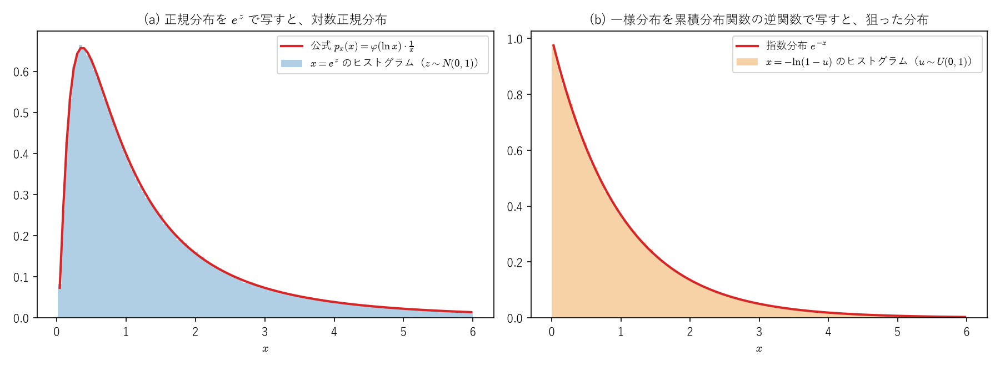
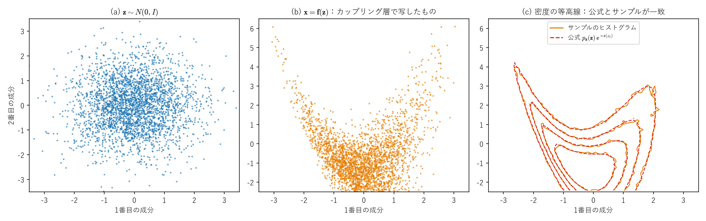
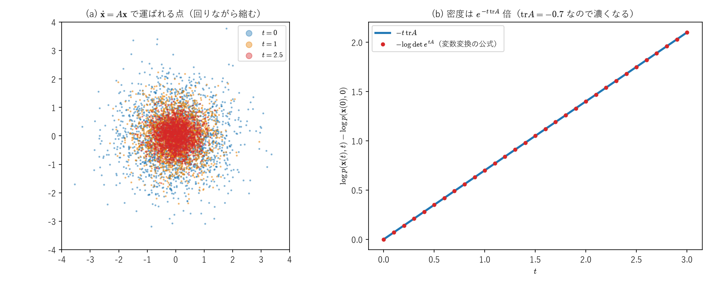
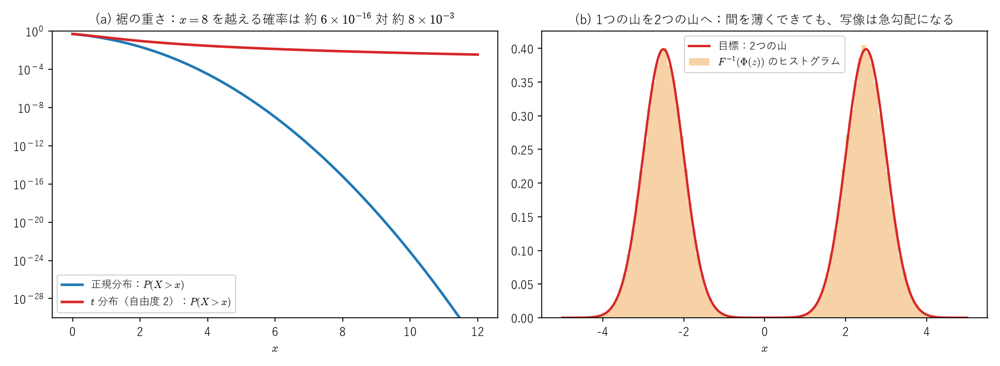
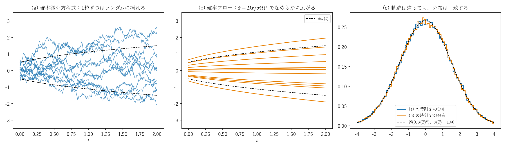
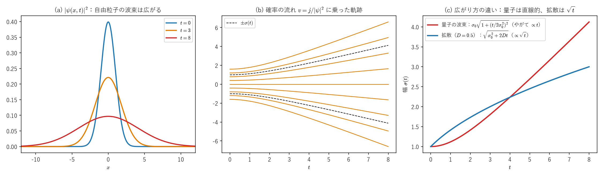

# 正規化フロー入門 ―確率密度の変数変換と、その周辺―

**正規化フロー**（normalizing flow）は、簡単な分布（標準正規分布など）に従う $\mathbf z$ を、逆写像を持つ写像 $\mathbf x=\mathbf f(\mathbf z)$ で変形して、複雑なデータの分布を作る生成モデルです。中心にあるのは、これまでのノートで何度も扱った**変数変換の公式**と**ヤコビ行列の行列式**です。このノートでは、

- **Part I**：確率密度の変数変換（1次元 → 多次元）
- **Part II**：何を学習するのか（最尤推定）。サンプルを作る向きと、密度を測る向き
- **Part III**：行列式を安く計算できる写像の作り方（自己回帰、カップリング層、連続時間のフロー）
- **Part IV**：**基底分布はなぜ正規分布なのか、ほかの分布を選ぶ理屈はあるのか**
- **Part V**：関連する話題（MCMC、ベイジアンネットワーク、変分推論、拡散モデル、最適輸送、量子との接点）
- **Part VI**：フローと物理の時間発展（連続の式、拡散を流れで書く方法、観測から流れを推定する動的な最適輸送、量子力学の確率の流れ）

を整理します。[学習ロードマップ](../../docs/learning_roadmap.md)の候補23の寄り道で、MCMC そのものの数学（収束の理論など）には深入りしません。

**関連ファイル**：図は [figures/make_normalizing_flow_figures.py](figures/make_normalizing_flow_figures.py) で作っていて、各図の値はスクリプトの中で本文の式と照合しています。多変数の変数変換の公式は[関数・線形写像・微分・積分のノート](../01_基礎・ベクトル解析/functions_linear_maps_derivatives_integrals.md)の Part V §5、「ヤコビ行列は点ごとの局所的なゆがみ」は同 Part III §5、三角行列とシューア分解は[行列の指数関数と交換子のノート](../04_群論・代数/matrix_exponential_commutator_bch_trotter.md)の Part II、$\det e^A=e^{\operatorname{tr}A}$ は[別のノート](../04_群論・代数/det_exp_trace_proof.md)にあります。

**記号の約束**：$\mathbf z\in\mathbb R^d$ を「元の（簡単な）変数」、$\mathbf x\in\mathbb R^d$ を「データの変数」とし、$\mathbf x=\mathbf f(\mathbf z)$、$\mathbf z=\mathbf f^{-1}(\mathbf x)$ と書きます。$p_{\mathbf z}$、$p_{\mathbf x}$ はそれぞれの確率密度です。$J_{\mathbf f}(\mathbf z)$ は $\mathbf f$ のヤコビ行列（成分 $\partial f_i/\partial z_j$）です。$N(\boldsymbol\mu,\Sigma)$ は平均 $\boldsymbol\mu$、共分散行列 $\Sigma$ の正規分布、$\varphi(z)=\frac1{\sqrt{2\pi}}e^{-z^2/2}$ は1次元の標準正規分布の密度です。

<a id="toc"></a>

## 目次

<!-- toc:start -->

- [Part I：確率密度の変数変換](#p1)
  - [1. 1次元：確率は保存し、密度は伸び縮みに反比例する](#p1-1)
  - [2. 多次元：|det J| が伸び縮みの倍率](#p1-2)
- [Part II：何を学習するのか](#p2)
  - [1. 最尤推定：データの尤度を最大にする](#p2-1)
  - [2. 2つの向き：サンプルを作る、密度を測る](#p2-2)
- [Part III：行列式を安く計算できる写像](#p3)
  - [1. 自己回帰：ヤコビ行列を三角行列にする](#p3-1)
  - [2. カップリング層：半分はそのまま、半分を変える](#p3-2)
  - [3. 連続時間のフロー：行列式がトレースになる](#p3-3)
- [Part IV：基底分布はなぜ正規分布なのか](#p4)
  - [1. 原理的には、何でもよい：形は写像が作る](#p4-1)
  - [2. 基底分布に求められること](#p4-2)
  - [3. 正規分布が選ばれる理由](#p4-3)
  - [4. 写像では作れない性質と、データの性状に合わせた選び方](#p4-4)
  - [5. まとめ：データの性状 → 選び方](#p4-5)
- [Part V：関連する話題](#p5)
  - [1. MCMC：組み合わせると、正確なサンプリングになる](#p5-1)
  - [2. ベイジアンネットワーク：自己回帰フローは、その連続版](#p5-2)
  - [3. 変分推論：名前の由来](#p5-3)
  - [4. 拡散モデル：確率微分方程式と、連続時間のフロー](#p5-4)
  - [5. 最適輸送とフローマッチング](#p5-5)
  - [6. 量子との接点](#p5-6)
- [Part VI：フローと物理の時間発展 ―連続の式、拡散、量子の確率の流れ―](#p6)
  - [1. 連続の式：総量が保存される密度の流れ](#p6-1)
  - [2. 拡散：ランダムな広がりも、密度の変化だけなら流れで書ける](#p6-2)
  - [3. 観測から流れを推定する：動的な最適輸送](#p6-3)
  - [4. 量子力学：|ψ|^2 も、確率の流れで運ばれる](#p6-4)
  - [5. 扱えないもの](#p6-5)
  - [6. まとめ：同じ連続の式、違う速度場](#p6-6)
- [まとめ](#summary)

<!-- toc:end -->

---

<a id="p1"></a>

# Part I：確率密度の変数変換

<!-- part-toc:start -->

**この Part の内容**

- [1. 1次元：確率は保存し、密度は伸び縮みに反比例する](#p1-1)
- [2. 多次元：|det J| が伸び縮みの倍率](#p1-2)

<!-- part-toc:end -->

<a id="p1-1"></a>

## 1. 1次元：確率は保存し、密度は伸び縮みに反比例する

$z$ が密度 $p_z$ に従い、$x=f(z)$（$f$ は単調増加とする）とします。$z$ が小さな区間 $[z,\ z+dz]$ に入る確率と、$x$ が対応する区間 $[x,\ x+dx]$ に入る確率は同じです（同じ出来事を、別の目盛りで見ているだけ）。

$$
p_x(x)\,dx=p_z(z)\,dz\qquad\Longrightarrow\qquad p_x(x)=p_z(z)\,\frac{dz}{dx}=\frac{p_z(z)}{f'(z)}\tag{I-1}
$$

$f$ が単調減少なら $dz/dx<0$ なので、絶対値を付けて

$$
p_x(x)=p_z(z)\,\Big|\frac{dz}{dx}\Big|=\frac{p_z(z)}{|f'(z)|},\qquad z=f^{-1}(x)\tag{I-2}
$$

です。**$f$ が区間を $|f'|$ 倍に引き伸ばすと、同じ確率がその長さに広がるので、密度は $1/|f'|$ 倍に薄まる**、というのがこの式の意味です。

**例1：正規分布 → 対数正規分布**　$z\sim N(0,1)$、$x=e^z$ とします。$z=\ln x$、$dz/dx=1/x$ なので

$$
p_x(x)=\varphi(\ln x)\cdot\frac1x\qquad(x>0)\tag{I-3}
$$

です（対数正規分布）。図 (a) で、$x=e^z$ のサンプルのヒストグラムと、この式が重なります。

**例2：一様分布から、どんな分布でも作れる（逆関数法）**　$u$ を $[0,1]$ の一様分布（密度 $1$）とし、目標の分布の累積分布関数を $F(x)=P(X\le x)$ とします。$x=F^{-1}(u)$ とおくと、$u=F(x)$、$du/dx=F'(x)=p(x)$ なので、式 (I-1) から

$$
p_x(x)=1\cdot\frac{du}{dx}=F'(x)\tag{I-4}
$$

で、ちょうど目標の密度になります。たとえば指数分布 $p(x)=e^{-x}$（$x\ge0$）では $F(x)=1-e^{-x}$ なので

$$
x=F^{-1}(u)=-\ln(1-u)\tag{I-5}
$$

です（図 (b)）。**1次元なら、一様分布（または正規分布）を単調な写像で写すだけで、どんな連続分布でもぴったり作れる**ことが分かります。これは Part IV の「基底分布の選び方」の出発点になります。



*(a) $z\sim N(0,1)$ を $x=e^z$ で写したサンプルのヒストグラムと、式 (I-3)。(b) $u\sim U(0,1)$ を $x=-\ln(1-u)$ で写したサンプルのヒストグラムと、指数分布 $e^{-x}$。どちらも40万サンプルで、ずれは $0.03$ 以下（スクリプトで確認）。*

<a id="p1-2"></a>

## 2. 多次元：$|\det J|$ が伸び縮みの倍率

$d$ 次元では、小さな区間の長さの代わりに、小さな領域の体積を考えます。$\mathbf z$ のまわりの小さな領域は、$\mathbf f$ で $\mathbf x$ のまわりの領域に写り、その体積は $|\det J_{\mathbf f}(\mathbf z)|$ 倍になります（[関数・線形写像のノート](../01_基礎・ベクトル解析/functions_linear_maps_derivatives_integrals.md)の Part III §5：小さな円が楕円に写り、面積が $|\det J|$ 倍）。確率は保存するので

$$
p_{\mathbf x}(\mathbf x)=p_{\mathbf z}(\mathbf z)\,\big|\det J_{\mathbf f}(\mathbf z)\big|^{-1}=p_{\mathbf z}\big(\mathbf f^{-1}(\mathbf x)\big)\,\big|\det J_{\mathbf f^{-1}}(\mathbf x)\big|\tag{I-6}
$$

です（2つ目の等号は、逆写像のヤコビ行列が $J_{\mathbf f}^{-1}$ で、$\det(J^{-1})=1/\det J$ だから）。対数を取ると

$$
\log p_{\mathbf x}(\mathbf x)=\log p_{\mathbf z}(\mathbf z)-\log\big|\det J_{\mathbf f}(\mathbf z)\big|\tag{I-7}
$$

**写像を重ねる**：$\mathbf f=\mathbf f_K\circ\cdots\circ\mathbf f_1$（$\mathbf z_0=\mathbf z$、$\mathbf z_k=\mathbf f_k(\mathbf z_{k-1})$、$\mathbf x=\mathbf z_K$）なら、連鎖律で $J_{\mathbf f}=J_{\mathbf f_K}\cdots J_{\mathbf f_1}$、行列式は積を積に移すので

$$
\log p_{\mathbf x}(\mathbf x)=\log p_{\mathbf z}(\mathbf z_0)-\sum_{k=1}^K\log\big|\det J_{\mathbf f_k}(\mathbf z_{k-1})\big|\tag{I-8}
$$

です。1つ1つは簡単な写像でも、重ねると複雑な分布が作れ、密度の計算は「各段の $\log|\det J|$ の足し算」で済みます。**「正規化」フローという名前は、各段で確率の合計が $1$ に保たれる（正規化されたままの）変換を、流れのように重ねていくことから来ています。**

---

<a id="p2"></a>

# Part II：何を学習するのか

<!-- part-toc:start -->

**この Part の内容**

- [1. 最尤推定：データの尤度を最大にする](#p2-1)
- [2. 2つの向き：サンプルを作る、密度を測る](#p2-2)

<!-- part-toc:end -->

<a id="p2-1"></a>

## 1. 最尤推定：データの尤度を最大にする

写像 $\mathbf f_\theta$ はパラメータ $\theta$（ニューラルネットワークの重みなど）を持ちます。データ $\mathbf x^{(1)},\dots,\mathbf x^{(M)}$ が与えられたとき、それらがモデルから出てくる確率（尤度）を最大にするように $\theta$ を決めます。式 (I-6) を使うと、対数尤度は

$$
L(\theta)=\sum_{m=1}^M\log p_{\mathbf x}\big(\mathbf x^{(m)}\big)=\sum_{m=1}^M\Big[\log p_{\mathbf z}\big(\mathbf f_\theta^{-1}(\mathbf x^{(m)})\big)+\log\big|\det J_{\mathbf f_\theta^{-1}}(\mathbf x^{(m)})\big|\Big]\tag{II-1}
$$

です。**データの密度を正確に（近似なしで）計算できる**ことが、正規化フローの大きな特徴です。

**基底が標準正規分布のときの意味**：$\log p_{\mathbf z}(\mathbf z)=-\frac12|\mathbf z|^2-\frac d2\log2\pi$ なので、式 (II-1) の各項は

$$
-\frac12\big|\mathbf f_\theta^{-1}(\mathbf x)\big|^2+\log\big|\det J_{\mathbf f_\theta^{-1}}(\mathbf x)\big|+(\text{定数})\tag{II-2}
$$

です。

- 第1項は、「データを $\mathbf f^{-1}$ で戻した点 $\mathbf z$ を、原点の近くに集めたい」という力です。
- 第2項は、「$\mathbf f^{-1}$ がデータの領域を縮めすぎないように（体積を保つように）」という力です。第1項だけなら、すべてを原点に潰せばよいことになってしまいますが、潰すと $|\det J|$ が小さくなり、第2項が大きく減ります。

この2つの綱引きの結果、データの多い所が $\mathbf z$ 空間で広い領域を占め、標準正規分布にちょうど収まるような $\mathbf f^{-1}$ が選ばれます。

**KL ダイバージェンスとの関係**：データの数を増やした極限で、対数尤度の最大化は、データの本当の分布 $p_{\text{data}}$ とモデル $p_{\mathbf x}$ の **KL ダイバージェンス** $D_{\mathrm{KL}}(p_{\text{data}}\,\|\,p_{\mathbf x})=\int p_{\text{data}}\log\frac{p_{\text{data}}}{p_{\mathbf x}}$ の最小化と同じです（$\int p_{\text{data}}\log p_{\text{data}}$ は $\theta$ によらないので、残りの $-\int p_{\text{data}}\log p_{\mathbf x}\approx-\frac1ML(\theta)$ を小さくすることになる）。

<a id="p2-2"></a>

## 2. 2つの向き：サンプルを作る、密度を測る

| 使い方 | 必要な計算 | 向き |
|---|---|---|
| **サンプルを作る**（新しいデータを生成する） | $\mathbf z\sim p_{\mathbf z}$ を引いて、$\mathbf x=\mathbf f(\mathbf z)$ | 順方向 $\mathbf f$ |
| **密度を測る**（学習、異常検知など） | $\mathbf z=\mathbf f^{-1}(\mathbf x)$ と $\log\lvert\det J\rvert$ | 逆方向 $\mathbf f^{-1}$ |

両方を使いたいので、写像には次の3つが求められます。

1. **逆写像を持つ**（全単射）
2. **順方向と逆方向の両方が、速く計算できる**
3. **$\log|\det J|$ が、速く計算できる**

一般の $d\times d$ 行列の行列式は、計算に $d^3$ に比例する手間がかかり、画像（$d$ が数万〜数百万）では使えません。Part III は、この3つを満たす写像の作り方です。

---

<a id="p3"></a>

# Part III：行列式を安く計算できる写像

<!-- part-toc:start -->

**この Part の内容**

- [1. 自己回帰：ヤコビ行列を三角行列にする](#p3-1)
- [2. カップリング層：半分はそのまま、半分を変える](#p3-2)
- [3. 連続時間のフロー：行列式がトレースになる](#p3-3)

<!-- part-toc:end -->

<a id="p3-1"></a>

## 1. 自己回帰：ヤコビ行列を三角行列にする

$x_i$ が $z_1,\dots,z_i$ にしか依存しないように作ると、ヤコビ行列の $(i,j)$ 成分 $\partial x_i/\partial z_j$ は $j>i$ で $0$ になり、**下三角行列**になります。三角行列の行列式は対角成分の積なので

$$
\det J_{\mathbf f}=\prod_{i=1}^d\frac{\partial x_i}{\partial z_i},\qquad\log|\det J_{\mathbf f}|=\sum_{i=1}^d\log\Big|\frac{\partial x_i}{\partial z_i}\Big|\tag{III-1}
$$

と、$d$ 回の掛け算（足し算）で済みます。シューア分解（どんな行列もユニタリ行列で上三角にできる。[Schur.lean](../../lean4/QuantumStudy/Schur.lean)）と同じく、「三角にすれば行列式は対角成分だけで決まる」ことを利用しています。

**なぜ三角でも表現力が落ちないのか**：確率の**連鎖律**（乗法定理）

$$
p(x_1,\dots,x_d)=p(x_1)\,p(x_2\mid x_1)\,p(x_3\mid x_1,x_2)\cdots p(x_d\mid x_1,\dots,x_{d-1})\tag{III-2}
$$

は、どんな分布でも成り立ちます。各因子は1次元の条件付き分布なので、Part I §1 の逆関数法で、1次元の一様分布（または正規分布）から作れます。つまり、$x_i$ を「$z_i$ と、それまでの $x_1,\dots,x_{i-1}$ から作る」三角形の写像だけで、原理的にはどんな分布でも作れます（**クノーテ・ローゼンブラット変換**）。

<a id="p3-2"></a>

## 2. カップリング層：半分はそのまま、半分を変える

自己回帰を素直に作ると、$x_1,x_2,\dots$ を順番に計算するので遅くなります。**カップリング層**（RealNVP の考え方）は、変数を2つの組 $\mathbf z=(\mathbf z_A,\mathbf z_B)$ に分け、

$$
\mathbf x_A=\mathbf z_A,\qquad\mathbf x_B=\mathbf z_B\odot e^{\mathbf s(\mathbf z_A)}+\mathbf t(\mathbf z_A)\tag{III-3}
$$

とします（$\odot$ は成分ごとの積、$\mathbf s,\mathbf t$ は $\mathbf z_A$ を入力とする任意の関数）。

**記号について**：成分ごとの積（**アダマール積**）は、数学の教科書では $\mathbf a\circ\mathbf b$ と書くことが多く、[べき級数と収束半径のノート](../01_基礎・ベクトル解析/power_series_radius_of_convergence.md)でもそう書きました。このノートでは $\circ$ を写像の合成（$\mathbf f_K\circ\cdots\circ\mathbf f_1$）に使っているので、機械学習の論文の慣例に合わせて $\odot$ と書きます。プログラムでは NumPy の `a * b` がこれにあたります。

- **逆写像**：$\mathbf z_A=\mathbf x_A$ がそのまま分かるので、$\mathbf z_B=\big(\mathbf x_B-\mathbf t(\mathbf x_A)\big)\odot e^{-\mathbf s(\mathbf x_A)}$ と、すぐに戻せます。
- **ヤコビ行列**：
$$
J_{\mathbf f}=\begin{pmatrix}I&0\\\ast&\operatorname{diag}\big(e^{\mathbf s(\mathbf z_A)}\big)\end{pmatrix},\qquad\log|\det J_{\mathbf f}|=\sum_is_i(\mathbf z_A)\tag{III-4}
$$
（$\mathbf x_A$ は $\mathbf z_B$ によらないので右上が $0$。左下 $\ast$ は複雑でも、行列式には効かない。）

**大事な点**：$\mathbf s,\mathbf t$ は**逆写像を持つ必要がなく、どんなに複雑なニューラルネットワークでもかまいません**。写像全体の逆は、$\mathbf s,\mathbf t$ を「逆に解く」ことなく、引き算と割り算だけで求まります。$\mathbf z_A$ と $\mathbf z_B$ の役割を入れ替えた層を交互に重ねると、すべての成分が変形されます。

**例**：$d=2$、$s(z_1)=0.3z_1$、$t(z_1)=0.8z_1^2-1.5$ とすると、$x_1=z_1$、$x_2=z_2e^{0.3z_1}+0.8z_1^2-1.5$ で、正規分布がバナナ形に曲がります。式 (I-6) と (III-4) から、密度は

$$
p_{\mathbf x}(\mathbf x)=\varphi(z_1)\,\varphi(z_2)\,e^{-0.3z_1},\qquad z_1=x_1,\quad z_2=\big(x_2-0.8x_1^2+1.5\big)e^{-0.3x_1}\tag{III-5}
$$

です。図 (c) で、この式の等高線と、20万サンプルのヒストグラムの等高線が重なります（スクリプトでは、ヤコビ行列の行列式を数値微分でも確かめ、密度の積分が $1$ になることも確認しています）。



*(a) 標準正規分布のサンプル。(b) カップリング層 (III-3) で写したもの。(c) 式 (III-5) の密度の等高線（破線）と、サンプルのヒストグラムの等高線（実線）。*

<a id="p3-3"></a>

## 3. 連続時間のフロー：行列式がトレースになる

写像を何段も重ねる代わりに、**微分方程式の流れ**で $\mathbf z$ を運ぶこともできます。

$$
\frac{d\mathbf x}{dt}=\mathbf g(\mathbf x,t),\qquad\mathbf x(0)=\mathbf z,\qquad\mathbf x=\mathbf x(T)\tag{III-6}
$$

（$\mathbf g$ はニューラルネットワーク。微分方程式の解は、条件がよければ必ず逆にたどれるので、逆写像の心配がありません。）

このとき、流れに乗って動く点での密度の変化は

$$
\frac{d}{dt}\log p\big(\mathbf x(t),t\big)=-\operatorname{tr}\frac{\partial\mathbf g}{\partial\mathbf x}=-\nabla\cdot\mathbf g\tag{III-7}
$$

です（**瞬間的な変数変換の公式**）。

**導出**：確率は流れに乗って運ばれ、増えも減りもしないので、密度は**連続の式** $\frac{\partial p}{\partial t}+\nabla\cdot(p\,\mathbf g)=0$ を満たします（流体の質量保存と同じ）。流れに乗った点での変化は、連鎖律で

$$
\frac{d}{dt}p\big(\mathbf x(t),t\big)=\frac{\partial p}{\partial t}+\mathbf g\cdot\nabla p=-\nabla\cdot(p\,\mathbf g)+\mathbf g\cdot\nabla p=-p\,\nabla\cdot\mathbf g
$$

（$\nabla\cdot(p\mathbf g)=\mathbf g\cdot\nabla p+p\,\nabla\cdot\mathbf g$ を使った）で、$p$ で割ると式 (III-7) です。

**行列式がトレースになる理由**：線形の流れ $\mathbf g=A\mathbf x$ では、$\mathbf x(t)=e^{tA}\mathbf z$ で、式 (I-7) から $\log p$ は $\log\det e^{tA}$ だけ減ります。$\det e^{tA}=e^{t\operatorname{tr}A}$（[det のノート](../04_群論・代数/det_exp_trace_proof.md)）なので、減り方は $t\operatorname{tr}A$ で、式 (III-7) の $-\operatorname{tr}A$ を $t$ で積分したものと一致します。**一瞬ごとの体積の変化率がトレースで、それを積み重ねたものが行列式**、という関係は、[カオスのノートブック](../../notebooks/learning/14_chaos/02_lorenz.ipynb)の「リアプノフ指数の和＝トレース」や、リウヴィルの定理（ハミルトン系では $\nabla\cdot\mathbf g=0$ で体積が保存）と同じ式です。

**トレースの推定**：$\operatorname{tr}\frac{\partial\mathbf g}{\partial\mathbf x}$ も、$d$ が大きいと、ヤコビ行列を全部作るのが大変です。そこで、成分が $\pm1$ の乱数ベクトル $\boldsymbol\varepsilon$（$E[\boldsymbol\varepsilon\boldsymbol\varepsilon^T]=I$）を使うと、$E[\boldsymbol\varepsilon^TM\boldsymbol\varepsilon]=\sum_{ij}M_{ij}E[\varepsilon_i\varepsilon_j]=\sum_iM_{ii}=\operatorname{tr}M$ なので、$\boldsymbol\varepsilon^TM\boldsymbol\varepsilon$ の平均でトレースを推定できます（**ハッチンソンの推定量**）。$M\boldsymbol\varepsilon$ は、自動微分で行列 $M$ を作らずに計算できます。



*(a) $\dot{\mathbf x}=A\mathbf x$（$A=\begin{pmatrix}-0.35&1.2\\-1.2&-0.35\end{pmatrix}$、$\operatorname{tr}A=-0.7$）で運ばれるサンプル。回りながら縮む。(b) $\log p$ の変化。$-t\operatorname{tr}A$（線）と $-\log\det e^{tA}$（点）が一致する。体積が縮むので、密度は濃くなる。*

---

<a id="p4"></a>

# Part IV：基底分布はなぜ正規分布なのか

<!-- part-toc:start -->

**この Part の内容**

- [1. 原理的には、何でもよい：形は写像が作る](#p4-1)
- [2. 基底分布に求められること](#p4-2)
- [3. 正規分布が選ばれる理由](#p4-3)
- [4. 写像では作れない性質と、データの性状に合わせた選び方](#p4-4)
- [5. まとめ：データの性状 → 選び方](#p4-5)

<!-- part-toc:end -->

ご質問の「正規分布だけでなく、どんな分布を前提にするのか、理論的な理屈はあるのか」に答えます。結論は、

1. **原理的には、基底分布はほとんど何でもよい**（形を作るのは写像のほうだから）。
2. **ただし、写像に課した制約（連続、逆写像を持つ、なめらか）のせいで、写像では作れない性質がある**。それが、データの性状に合わせて基底分布を選ぶ理由になる。
3. **正規分布が標準になっているのは、計算の都合と、「余計な仮定をしない」という理屈から**。

です。順に説明します。

<a id="p4-1"></a>

## 1. 原理的には、何でもよい：形は写像が作る

Part I §1 の逆関数法で見たように、1次元では、累積分布関数 $F_z$（基底）と $F_x$（目標）があれば

$$
x=F_x^{-1}\big(F_z(z)\big)\tag{IV-1}
$$

で、どんな連続分布からどんな連続分布へも、ぴったり写せます（$F_z(z)$ がまず一様分布になり、それを $F_x^{-1}$ で目標に写す）。多次元でも、Part III §1 のクノーテ・ローゼンブラット変換（三角形の写像）や、最適輸送のブレニエの定理（凸関数の勾配で写せる）によって、なめらかな密度どうしなら写像が存在します。したがって、**表現できる分布の範囲は、基底の選び方ではなく、写像の柔軟さで決まります**。

<a id="p4-2"></a>

## 2. 基底分布に求められること

計算の都合から、基底分布には次の3つが必要です。

| 条件 | 理由 |
|---|---|
| 密度 $p_{\mathbf z}$ が式で正確に書ける | 式 (II-1) の $\log p_{\mathbf z}$ を計算するため |
| サンプルを簡単に引ける | 生成（$\mathbf x=\mathbf f(\mathbf z)$）のため |
| データがありうる範囲で、密度が $0$ でない | 密度 $0$ の所は、写像で写しても $0$ のまま（$\lvert\det J\rvert$ を掛けても $0$）なので、データが来ると対数尤度が $-\infty$ になる |

<a id="p4-3"></a>

## 3. 正規分布が選ばれる理由

- **計算が簡単**：$\log p_{\mathbf z}=-\frac12|\mathbf z|^2+$定数 で、各成分が独立なので、サンプルは1次元の正規乱数を $d$ 個並べるだけです。
- **回転で形が変わらない**（等方的）：どの方向も特別扱いしないので、写像の側で向きを自由に決められます。
- **余計な仮定が最も少ない**：平均と分散（共分散）を決めたとき、エントロピー（不確かさ）が最大になる分布は正規分布です（**最大エントロピー原理**）。「平均と広がり以外は何も知らない」という状態を、最も素直に表す分布、という理屈です。
- **拡散モデルでは、行き着く先が自然に正規分布**：データに少しずつ雑音を足していく過程（オルンシュタイン・ウーレンベック過程）は、どんなデータから始めても、最後は正規分布に近づきます。生成はその逆をたどるので、出発点が正規分布になるのは必然です（Part V §4）。

<a id="p4-4"></a>

## 4. 写像では作れない性質と、データの性状に合わせた選び方

ここで、ご推察の「データの性状から選ぶ」が効いてきます。連続で逆写像を持つ写像には、変えられない性質があるからです。

**(1) 裾の重さ**：正規分布の裾は $e^{-x^2/2}$ と極端に速く小さくなります。一方、金融のリターンや外れ値の多いデータは、$t$ 分布のように裾が重い（べき乗でしか小さくならない）ことがあります。写像の傾き（ヤコビ行列の大きさ）に上限がある（リプシッツ連続な）写像では、正規分布の軽い裾を重い裾に変えられないことが知られています（傾きに上限があると、裾は「正規分布より少し広がる」程度にしかならない）。そのため、**裾の重いデータには、基底に $t$ 分布などの裾の重い分布を使う**のが理にかなっています。

**(2) つながり方（トポロジー）**：連続な逆写像を持つ写像は、「つながった1つの塊」を「離れた2つの塊」に切り離せません。正規分布は全体がつながった1つの山なので、離れた2つのクラスタを持つデータを写そうとすると、間に必ず細い「橋」（密度の低い通り道）が残り、写像はその付近で急な傾きを持つことになります（図 (b) は1次元の例で、2つの山の間の密度を薄くするために、写像は山の間で急勾配になる）。**クラスタがはっきり分かれたデータには、基底に混合正規分布（山を複数持つ分布）を使う**ことがあります。

**(3) 値の範囲**：データが $[0,1]$ や正の数に限られるなら、まず $\operatorname{logit}$ や $\log$ で $\mathbb R$ 全体に写してから、正規分布を基底にしたフローを使うのが普通です（あるいは基底をベータ分布などにする）。

**(4) 離散的なデータ**：画像の画素値（0〜255 の整数）のような離散データには、連続な密度が定義できないので、小さな一様乱数を足して連続にする（**逆量子化**）などの工夫をします。

**(5) 対称性**：分子の座標のように「回しても同じ」データなら、基底も写像も回転で形が変わらないものにする（**同変なフロー**）と、学習が効率的になります。



*(a) 裾の重さ。$x=8$ を越える確率は、正規分布では約 $6\times10^{-16}$、$t$ 分布（自由度 2）では約 $8\times10^{-3}$。(b) 正規分布を逆関数法で2つの山に写したもの。1次元ならぴったり作れるが、2つの山の間の薄い部分を作るために、写像はそこで急勾配になる。*

<a id="p4-5"></a>

## 5. まとめ：データの性状 → 選び方

| データの性状 | よく使う選び方 |
|---|---|
| 特に何もない（なめらか、1つの塊、裾は普通） | 標準正規分布 |
| 裾が重い（外れ値が多い） | $t$ 分布などの裾の重い基底 |
| はっきり分かれた複数のクラスタ | 混合正規分布の基底 |
| 値の範囲が限られる | $\log$・$\operatorname{logit}$ で $\mathbb R$ に写してから |
| 離散値 | 一様乱数を足して連続にする（逆量子化） |
| 回転などの対称性がある | 対称性を保つ基底と写像（同変なフロー） |

**基底は「写像が苦手な性質」を肩代わりするために選ぶ**、というのが理屈です。形の細部は写像が学習するので、基底は「写像では作れない大まかな性質（裾、つながり方、範囲、対称性）」だけを合わせておけば十分です。

---

<a id="p5"></a>

# Part V：関連する話題

<!-- part-toc:start -->

**この Part の内容**

- [1. MCMC：組み合わせると、正確なサンプリングになる](#p5-1)
- [2. ベイジアンネットワーク：自己回帰フローは、その連続版](#p5-2)
- [3. 変分推論：名前の由来](#p5-3)
- [4. 拡散モデル：確率微分方程式と、連続時間のフロー](#p5-4)
- [5. 最適輸送とフローマッチング](#p5-5)
- [6. 量子との接点](#p5-6)

<!-- part-toc:end -->

<a id="p5-1"></a>

## 1. MCMC：組み合わせると、正確なサンプリングになる

**MCMC**（マルコフ連鎖モンテカルロ法）は、正規化定数の分からない密度 $\pi(\mathbf x)\propto\tilde\pi(\mathbf x)$（たとえばボルツマン分布 $e^{-E(\mathbf x)/kT}$）からサンプルを取る方法です。連鎖を十分長く回せば正確な分布に近づきますが、サンプルどうしに相関があり、山が複数あると山の間を行き来しにくい、といった難しさがあります。

| | MCMC | 正規化フロー |
|---|---|---|
| 必要なもの | 正規化されていない密度 $\tilde\pi$ | 学習用のデータ（または $\tilde\pi$） |
| サンプル | 相関がある。長く回せば正確 | 独立。ただし学習した近似分布から |
| 密度の値 | 分からない（正規化定数が不明） | 正確に計算できる |

**組み合わせ方**：フロー $q(\mathbf x)$ を、メトロポリス・ヘイスティングス法の**独立な提案分布**に使います。提案 $\mathbf x'\sim q$ を、確率

$$
\min\Big(1,\ \frac{\tilde\pi(\mathbf x')\,q(\mathbf x)}{\tilde\pi(\mathbf x)\,q(\mathbf x')}\Big)\tag{V-1}
$$

で受け入れると、フローが不完全でも、得られる連鎖は正確に $\pi$ に従います（フローの密度 $q$ が正確に計算できるから、この補正ができる）。フローが $\pi$ に近いほど受け入れ率が高く、相関の少ないサンプルが得られます。分子のボルツマン分布（ボルツマン・ジェネレーター）や、格子上の場の理論（素粒子物理の数値計算）のサンプリングで使われています。

データがなく $\tilde\pi$ だけが分かる場合は、フローを**逆向きの KL ダイバージェンス** $D_{\mathrm{KL}}(q\,\|\,\pi)=E_{\mathbf x\sim q}[\log q(\mathbf x)-\log\tilde\pi(\mathbf x)]+$定数 の最小化で学習します（$\mathbf x\sim q$ のサンプルはフロー自身から作れる）。この向きは、山の1つだけに集中しやすい（他の山を見落とす）性質があり、MCMC での補正が役に立ちます。

<a id="p5-2"></a>

## 2. ベイジアンネットワーク：自己回帰フローは、その連続版

**ベイジアンネットワーク**は、変数の間の依存関係を矢印のグラフで表し、分布を「親が決まったときの条件付き分布」の積に分けるものです。変数に順番を付けて、前の変数すべてを親にすると、式 (III-2) の連鎖律そのものになります。自己回帰フローは、各条件付き分布 $p(x_i\mid x_1,\dots,x_{i-1})$ を「1次元の逆写像を持つ変換」で表した、**連続変数のベイジアンネットワーク**と見ることができます。ヤコビ行列が三角になるのは、グラフに「後ろから前への矢印がない」ことの表れです。

<a id="p5-3"></a>

## 3. 変分推論：名前の由来

ベイズ推定では、パラメータの事後分布 $p(\boldsymbol\theta\mid\text{データ})$ を求めたいのですが、正規化定数の計算（高次元の積分）が難しいことが多いです。**変分推論**は、扱いやすい分布 $q(\boldsymbol\theta)$ で事後分布を近似し、$D_{\mathrm{KL}}(q\,\|\,p)$ を小さくする方法です。$q$ を正規分布に限ると近似が粗いので、正規分布をフローで変形して柔軟にする、というのが「正規化フロー」という名前が最初に使われた場面です（Rezende・Mohamed、2015年）。

そこで使われた**平面フロー** $\mathbf f(\mathbf z)=\mathbf z+\mathbf u\,h(\mathbf w^T\mathbf z+b)$ のヤコビ行列は $I+\mathbf u\,\boldsymbol\psi^T$（$\boldsymbol\psi=h'(\cdot)\mathbf w$）という「単位行列＋階数1の行列」で、行列式は

$$
\det\big(I+\mathbf u\boldsymbol\psi^T\big)=1+\boldsymbol\psi^T\mathbf u\tag{V-2}
$$

と、$d^3$ ではなく $d$ に比例する手間で計算できます（**行列式の補題**。$\mathbf u$ 方向に $1+\boldsymbol\psi^T\mathbf u$ 倍、$\boldsymbol\psi$ に直交する方向は $1$ 倍、という固有値の構造から分かる）。

<a id="p5-4"></a>

## 4. 拡散モデル：確率微分方程式と、連続時間のフロー

画像生成で主流の**拡散モデル**は、データ $\mathbf x_0$ に少しずつ雑音を足していく確率微分方程式

$$
d\mathbf x=-\tfrac12\beta\,\mathbf x\,dt+\sqrt\beta\,d\mathbf W\tag{V-3}
$$

（$\mathbf W$ はブラウン運動）で、十分時間が経つと、どんなデータも標準正規分布に近づくことを使います。生成は、この過程を時間を逆向きにたどることで行い、そのためには各時刻の密度の対数の勾配 $\nabla\log p_t(\mathbf x)$（**スコア**）をニューラルネットワークで学習します。

正規化フローとの関係：同じ時刻ごとの分布 $p_t$ を、雑音のない決定論的な微分方程式（**確率フロー常微分方程式**）$\frac{d\mathbf x}{dt}=-\frac12\beta\big(\mathbf x+\nabla\log p_t(\mathbf x)\big)$ で実現することもでき、これは Part III §3 の連続時間のフローそのものです。したがって、拡散モデルでも式 (III-7) で密度を計算できます。確率微分方程式（ロードマップの候補9）を学ぶと、この部分が一続きにつながります。

<a id="p5-5"></a>

## 5. 最適輸送とフローマッチング

**最適輸送**（候補11）は、分布 $p_{\mathbf z}$ を分布 $p_{\mathbf x}$ へ、移動の手間（たとえば距離の2乗の平均）が最小になるように運ぶ写像を求める問題です。2乗距離の場合、最適な写像は凸関数 $u$ の勾配 $\mathbf f=\nabla u$ で書け（ブレニエの定理）、変数変換の公式 (I-6) に代入すると

$$
p_{\mathbf z}(\mathbf z)=p_{\mathbf x}\big(\nabla u(\mathbf z)\big)\,\det\big(\nabla^2u(\mathbf z)\big)\tag{V-4}
$$

（$\nabla^2u$ は2階微分の行列、ヘッセ行列）という**モンジュ・アンペール方程式**になります。正規化フローの式で、ヤコビ行列が「凸関数のヘッセ行列」という特別な形になったものです。

**フローマッチング**は、連続時間のフローの速度場 $\mathbf g$ を、最尤推定ではなく「$\mathbf z$ と $\mathbf x$ を結ぶ経路の速度に合わせる」回帰で直接学習する方法です。経路を直線（最適輸送に近い経路）にすると、少ない段数で生成できます。

<a id="p5-6"></a>

## 6. 量子との接点

- **格子場の理論のサンプリング**：素粒子物理の格子計算（量子色力学など）では、経路積分を格子上の配置の確率分布からのサンプリングで計算します。§1 のフロー＋MCMC は、この計算を速くする方法として研究されています（[ブラケット・経路積分のノート](../05_量子力学/bra_ket_notation_path_integral.md)の経路積分を、虚時間にすると確率分布になる）。
- **自己回帰モデルで表した波動関数**：多体系の波動関数 $\psi(\mathbf s)$ を自己回帰型のニューラルネットワークで表すと、$|\psi(\mathbf s)|^2$ から（MCMC を使わずに）独立なサンプルが正確に取れます。変分法で基底状態を探す手法で使われています。
- **量子回路からのサンプリング**：量子コンピュータの測定結果は、$|\psi|^2$ からのサンプルそのものです。「サンプルは作れるが、確率の値は直接は分からない」という点で、MCMC やフローとは逆の立場にあり、量子回路を生成モデルとして使う研究（ボルン・マシン）もあります。

---

<a id="p6"></a>

# Part VI：フローと物理の時間発展 ―連続の式、拡散、量子の確率の流れ―

<!-- part-toc:start -->

**この Part の内容**

- [1. 連続の式：総量が保存される密度の流れ](#p6-1)
- [2. 拡散：ランダムな広がりも、密度の変化だけなら流れで書ける](#p6-2)
- [3. 観測から流れを推定する：動的な最適輸送](#p6-3)
- [4. 量子力学：|ψ|^2 も、確率の流れで運ばれる](#p6-4)
- [5. 扱えないもの](#p6-5)
- [6. まとめ：同じ連続の式、違う速度場](#p6-6)

<!-- part-toc:end -->

Part III §3 の連続時間のフローは、比喩ではなく、文字どおりの「流れ」です。この Part では、それが物理の時間発展（流体、拡散、量子力学）の確率密度の動きと同じ式であることを確かめ、どこまで扱えて、どこから扱えないかを整理します。

<a id="p6-1"></a>

## 1. 連続の式：総量が保存される密度の流れ

密度 $p(\mathbf x,t)$ が、速度場 $\mathbf g(\mathbf x,t)$ に乗って運ばれるとします。$p\,\mathbf g$ を**流れ**（流束）$\mathbf j$ と呼びます。これは「単位時間に、単位面積を通り抜ける量」です。

固定した小さな領域 $V$ の中の総量 $\int_Vp\,dV$ は、境界 $\partial V$ から流れ出た分だけ減るので

$$
\frac{d}{dt}\int_Vp\,dV=-\oint_{\partial V}\mathbf j\cdot\mathbf n\,dS=-\int_V\nabla\cdot\mathbf j\,dV\tag{VI-1}
$$

です（2つ目の等号はガウスの発散定理）。$V$ はどんな小さな領域でもよいので、被積分関数どうしが等しく

$$
\frac{\partial p}{\partial t}+\nabla\cdot\mathbf j=0,\qquad\mathbf j=p\,\mathbf g\tag{VI-2}
$$

です（**連続の式**）。流体の質量保存、電荷の保存と同じ式で、Part III §3 の式 (III-7) $\frac{d}{dt}\log p=-\nabla\cdot\mathbf g$（流れに乗った点での密度の変化）は、ここから出ました。

**例：ハミルトン系（リウヴィルの定理）**　位置 $q$ と運動量 $p_q$ の相空間で、ハミルトンの運動方程式 $\dot q=\frac{\partial H}{\partial p_q}$、$\dot p_q=-\frac{\partial H}{\partial q}$ の速度場 $\mathbf g=\big(\frac{\partial H}{\partial p_q},-\frac{\partial H}{\partial q}\big)$ の発散は

$$
\nabla\cdot\mathbf g=\frac{\partial}{\partial q}\frac{\partial H}{\partial p_q}-\frac{\partial}{\partial p_q}\frac{\partial H}{\partial q}=0\tag{VI-3}
$$

（2階微分の順序を入れ替えても同じなので打ち消し合う）です。式 (III-7) から、**相空間の密度は、軌道に沿って一定**です。体積を保つ流れ（$\det J=1$ の写像を積み重ねたもの）で、正規化フローの言葉では「$\log|\det J|$ の項が常に $0$ のフロー」にあたります。

<a id="p6-2"></a>

## 2. 拡散：ランダムな広がりも、密度の変化だけなら流れで書ける

粒子が、速度場 $\mathbf b$ に流されながら、ランダムに揺れる場合を考えます（$D$ は拡散係数、$\mathbf W$ はブラウン運動）。

$$
d\mathbf x=\mathbf b(\mathbf x,t)\,dt+\sqrt{2D}\,d\mathbf W\tag{VI-4}
$$

このとき、密度 $p(\mathbf x,t)$ は**フォッカー・プランク方程式**

$$
\frac{\partial p}{\partial t}=-\nabla\cdot(p\,\mathbf b)+D\,\Delta p\tag{VI-5}
$$

に従います（導出は確率微分方程式の範囲で、ロードマップの候補9）。右辺の第2項 $D\Delta p$ が、ランダムな揺れによる広がりです。

**連続の式の形に書き直す**：$\Delta p=\nabla\cdot(\nabla p)$ で、$\nabla p=p\,\nabla\log p$（$\nabla\log p=\frac{\nabla p}p$ だから）なので、$D\Delta p=\nabla\cdot(p\,D\nabla\log p)$ です。式 (VI-5) に入れると

$$
\frac{\partial p}{\partial t}+\nabla\cdot\big(p\,\mathbf v\big)=0,\qquad\mathbf v=\mathbf b-D\,\nabla\log p\tag{VI-6}
$$

で、**速度 $\mathbf v$ の決定論的な流れと、まったく同じ密度の時間変化**になります。$-D\nabla\log p$ は「密度の高い所から低い所へ押し出す」速度で、ランダムな揺れの効果を、平均的な流れとして表したものです。この流れ $\dot{\mathbf x}=\mathbf v$ を**確率フロー**と呼びます（Part V §4 の拡散モデルの確率フロー常微分方程式は、これの特別な場合）。

**例：純粋な拡散**（$\mathbf b=0$、1次元）　初期分布を $N(0,\sigma_0^2)$ とすると、時刻 $t$ の分布は $N(0,\sigma(t)^2)$、

$$
\sigma(t)^2=\sigma_0^2+2Dt\tag{VI-7}
$$

です（揺れが独立に積み重なり、分散が $2Dt$ ずつ増える）。$\log p=-\frac{x^2}{2\sigma^2}+$（$x$ によらない項）なので $\nabla\log p=-\frac x{\sigma^2}$、式 (VI-6) から

$$
v(x,t)=\frac{Dx}{\sigma(t)^2},\qquad x(t)=x_0\,\frac{\sigma(t)}{\sigma_0}\tag{VI-8}
$$

です（2つ目は $\dot x=\frac{D}{\sigma^2}x$ の解：$\frac{\dot\sigma}{\sigma}=\frac{1}{2\sigma^2}\frac{d\sigma^2}{dt}=\frac D{\sigma^2}$ なので、$x/\sigma$ が一定）。各点は、原点からの距離が $\sigma(t)$ に比例して、なめらかに広がっていきます。



*(a) 確率微分方程式 (VI-4)（$\mathbf b=0$、$D=0.5$、$\sigma_0=0.5$）の軌跡。1粒ずつはランダムに揺れる。(b) 同じ初期点を、確率フロー (VI-8) で運んだ軌跡。なめらかに広がる。(c) 時刻 $T=2$ での分布。軌跡はまったく違うが、10万サンプルの分布はどちらも $N(0,\sigma(T)^2)$ に一致する（スクリプトで確認）。*

**大事な点**：1粒1粒の軌跡（ランダムに揺れるか、なめらかに流れるか）は違っても、**分布の時間変化は同じ**です。「密度がどう動くか」だけを問題にするなら、拡散も連続時間のフローで表せます。

<a id="p6-3"></a>

## 3. 観測から流れを推定する：動的な最適輸送

時刻 $0$ の分布 $p_0$ と時刻 $1$ の分布 $p_1$ が観測されていて、その間の流れを知りたいとします（細胞の集団を数日おきに測るが、1つ1つの細胞は追跡できない、など）。連続の式 (VI-2) を満たし、$p_0$ を $p_1$ に運ぶ速度場 $\mathbf v$ は無数にあるので、「運ぶ手間」が最小のものを選びます。

$$
\min_{p,\ \mathbf v}\int_0^1\!\!\int\frac12\,p\,|\mathbf v|^2\,d\mathbf x\,dt\qquad\text{ただし}\quad\frac{\partial p}{\partial t}+\nabla\cdot(p\mathbf v)=0,\quad p(\cdot,0)=p_0,\quad p(\cdot,1)=p_1\tag{VI-9}
$$

（**ベナム・ブレニエの定式化**。被積分関数は運動エネルギーの総和。）最小値は、Part V §5 の最適輸送の手間（2乗距離の最小値の半分）に一致し、最適な流れでは、各点が**一定の速さで直線上を**動きます。

**例：1次元の正規分布どうし**　$p_0=N(m_0,s_0^2)$、$p_1=N(m_1,s_1^2)$ なら、最適な写像は $x\mapsto m_1+\frac{s_1}{s_0}(x-m_0)$（大小の順番を保つ、ただ1つの単調な1次関数）で、途中の分布は

$$
p_t=N\big(m_t,\ s_t^2\big),\qquad m_t=(1-t)m_0+tm_1,\quad s_t=(1-t)s_0+ts_1\tag{VI-10}
$$

と、平均と標準偏差が直線的に変わります。フローマッチング（Part V §5）は、このような「直線的な流れ」を学習させる方法です。

<a id="p6-4"></a>

## 4. 量子力学：$|\psi|^2$ も、確率の流れで運ばれる

1粒子のシュレーディンガー方程式（ポテンシャル $V$ は実数）

$$
i\hbar\frac{\partial\psi}{\partial t}=-\frac{\hbar^2}{2m}\nabla^2\psi+V\psi\tag{VI-11}
$$

から、確率密度 $\rho=|\psi|^2=\psi^*\psi$ についての連続の式を導きます。

**ステップ1：$\psi$ と $\psi^*$ の時間微分**　式 (VI-11) を $i\hbar$ で割ると $\frac{\partial\psi}{\partial t}=\frac{i\hbar}{2m}\nabla^2\psi-\frac i\hbar V\psi$。複素共役を取ると（$V$ は実数）$\frac{\partial\psi^*}{\partial t}=-\frac{i\hbar}{2m}\nabla^2\psi^*+\frac i\hbar V\psi^*$。

**ステップ2：$\rho$ の時間微分**　積の微分で

$$
\frac{\partial\rho}{\partial t}=\psi^*\frac{\partial\psi}{\partial t}+\psi\frac{\partial\psi^*}{\partial t}=\frac{i\hbar}{2m}\big(\psi^*\nabla^2\psi-\psi\nabla^2\psi^*\big)-\frac i\hbar V\psi^*\psi+\frac i\hbar V\psi\psi^*
$$

で、$V$ の項は打ち消し合います。

**ステップ3：発散の形にする**　$\nabla\cdot(\psi^*\nabla\psi)=\nabla\psi^*\cdot\nabla\psi+\psi^*\nabla^2\psi$、$\nabla\cdot(\psi\nabla\psi^*)=\nabla\psi\cdot\nabla\psi^*+\psi\nabla^2\psi^*$ の差を取ると、$\nabla\psi^*\cdot\nabla\psi$ が消えて $\psi^*\nabla^2\psi-\psi\nabla^2\psi^*=\nabla\cdot\big(\psi^*\nabla\psi-\psi\nabla\psi^*\big)$。したがって

$$
\frac{\partial\rho}{\partial t}+\nabla\cdot\mathbf j=0,\qquad\mathbf j=-\frac{i\hbar}{2m}\big(\psi^*\nabla\psi-\psi\nabla\psi^*\big)=\frac\hbar m\operatorname{Im}\big(\psi^*\nabla\psi\big)\tag{VI-12}
$$

です（最後の等号は、$\psi^*\nabla\psi-\psi\nabla\psi^*=\psi^*\nabla\psi-\overline{\psi^*\nabla\psi}=2i\operatorname{Im}(\psi^*\nabla\psi)$ から）。$\mathbf j$ を**確率の流れ**（確率流）と呼びます。

**速度場**：$\psi$ を、大きさと位相に分けて $\psi=\sqrt\rho\,e^{iS/\hbar}$ と書くと（**マデルング表示**）、$\nabla\psi=\big(\nabla\sqrt\rho+\frac i\hbar\sqrt\rho\,\nabla S\big)e^{iS/\hbar}$ なので $\psi^*\nabla\psi=\sqrt\rho\,\nabla\sqrt\rho+\frac i\hbar\rho\,\nabla S$、虚部は $\frac1\hbar\rho\nabla S$ で

$$
\mathbf j=\rho\,\frac{\nabla S}m,\qquad\mathbf v=\frac{\mathbf j}\rho=\frac{\nabla S}m\tag{VI-13}
$$

です。**$|\psi|^2$ の時間変化は、速度場 $\mathbf v=\nabla S/m$（位相の勾配 ÷ 質量）による連続時間のフローそのもの**です。たとえば平面波 $\psi=Ae^{ikx}$ では $S=\hbar kx$ で、$v=\frac{\hbar k}m=\frac pm$（運動量 ÷ 質量、つまり古典的な速度）になります。

**例：自由粒子のガウス波束**（$V=0$、1次元、平均運動量 $0$）　初期の幅 $\sigma_0$ の波束 $\psi(x,0)\propto e^{-x^2/4\sigma_0^2}$ は、時間とともに

$$
\sigma(t)^2=\sigma_0^2\Big(1+\Big(\frac{\hbar t}{2m\sigma_0^2}\Big)^2\Big)\tag{VI-14}
$$

の幅で広がる正規分布の形を保ちます。形が保たれる（各点が原点からの距離を $\sigma(t)$ に比例させて動く）ので、§2 の拡散の例と同じ理屈で

$$
v(x,t)=x\,\frac{\dot\sigma(t)}{\sigma(t)},\qquad x(t)=x_0\,\frac{\sigma(t)}{\sigma_0}\tag{VI-15}
$$

です（図のスクリプトで、厳密な時間発展から計算した $j/\rho$ が式 (VI-15) に一致し、連続の式 (VI-12) が成り立つことを確認しています）。

**拡散との違い**：拡散では $\sigma\propto\sqrt t$（式 (VI-7)）ですが、量子の波束では、十分時間が経つと $\sigma\approx\frac{\hbar t}{2m\sigma_0}\propto t$ と**直線的に**広がります。これは、運動量のばらつき $\Delta p=\frac\hbar{2\sigma_0}$（不確定性関係の等号）に対応する速度のばらつき $\frac{\Delta p}m$ で、各部分がまっすぐ飛んでいくからです。



*(a) 自由粒子のガウス波束の $|\psi(x,t)|^2$（$\hbar=m=\sigma_0=1$）。(b) 確率の流れの速度 $v=j/|\psi|^2$ に乗った軌跡 (VI-15)。(c) 幅の広がり方。量子の波束はやがて $t$ に比例、拡散は $\sqrt t$ に比例。*

**注意：$|\psi|^2$ だけでは、未来は決まらない**　拡散では、速度 $\mathbf v=\mathbf b-D\nabla\log p$ が密度 $p$ だけから決まりました。量子では、速度 $\mathbf v=\nabla S/m$ は**位相 $S$** で決まり、$|\psi|^2$ からは分かりません。たとえば、同じ $|\psi|^2$ でも、平均運動量 $\hbar k_0$ を持つ波束（$\psi\propto e^{-x^2/4\sigma_0^2}e^{ik_0x}$）は、その場で広がるだけでなく、速さ $\hbar k_0/m$ で動いていきます。$|\psi|^2$ の時間変化は流れで書けますが、その流れを決めるには、波動関数の位相の情報も必要です。

（式 (VI-15) の軌跡を「粒子の本当の軌道」とみなすのが、ボーム力学という解釈です。ここでは解釈には立ち入らず、「$|\psi|^2$ の時間変化を表す流れ」という数学的な事実として使っています。）

<a id="p6-5"></a>

## 5. 扱えないもの

| 現象 | 理由 | 対応 |
|---|---|---|
| 粒子の生成・消滅、化学反応、細胞の増殖・死 | 連続の式は総量が一定であることが前提 | 湧き出し・吸い込みの項を足す（総量が変わる最適輸送） |
| 物理法則（運動方程式、保存則）を守らせたい | 学習で得られる流れは「分布に合う流れ」の1つにすぎない | 方程式を学習の条件に組み込む |
| 1粒ごとの軌跡を知りたい（拡散の場合） | 確率フローの軌跡は、実際のランダムな軌跡とは違う（§2 の図 (a)・(b)） | 確率微分方程式のまま扱う |
| 量子の干渉など、位相が効く現象 | $\lvert\psi\rvert^2$ だけでは流れが決まらない（§4） | 波動関数（位相を含む）を扱う |

生成モデルとして使うときの $t$ は、基底分布とデータ分布をつなぐ人工的な目盛りです。物理の時間として使えるのは、§3 のように各時刻の観測と結びつけた場合や、§1・§2・§4 のように元の物理法則から速度場が決まる場合です。

<a id="p6-6"></a>

## 6. まとめ：同じ連続の式、違う速度場

| 系 | 速度場 $\mathbf v$ | 特徴 |
|---|---|---|
| ハミルトン系（相空間） | $\big(\frac{\partial H}{\partial p_q},-\frac{\partial H}{\partial q}\big)$ | 発散 $0$。密度は軌道に沿って一定（リウヴィルの定理） |
| 拡散（フォッカー・プランク） | $\mathbf b-D\nabla\log p$ | 密度だけで速度が決まる。幅は $\sqrt t$ で広がる |
| 動的な最適輸送 | 運動エネルギー最小の流れ | 各点が一定の速さで直線上を動く |
| 量子力学（$\lvert\psi\rvert^2$） | $\nabla S/m$（位相の勾配） | 位相の情報が必要。自由粒子の波束は $t$ に比例して広がる |
| 正規化フロー（生成モデル） | ニューラルネットワークで学習 | 時間は人工的な目盛り。式 (III-7) で密度を計算できる |

どれも連続の式 $\frac{\partial p}{\partial t}+\nabla\cdot(p\mathbf v)=0$ を満たし、違うのは「速度場 $\mathbf v$ を何が決めるか」だけです。

---


<a id="summary"></a>

# まとめ

| Part | 主張 | 式 |
|---|---|---|
| I | 確率は保存し、密度は体積の伸びに反比例する：$p_{\mathbf x}=p_{\mathbf z}\lvert\det J_{\mathbf f}\rvert^{-1}$。1次元なら逆関数法で、どんな分布でも作れる | (I-2)、(I-4)、(I-6)〜(I-8) |
| II | 学習は最尤推定。正規分布の基底では「原点に集める力」と「体積を保つ力」の綱引き | (II-1)、(II-2) |
| III | 三角（自己回帰、カップリング層）にすれば $\det$ は対角成分の積。連続時間では $\det$ の代わりにトレース | (III-1)、(III-4)、(III-7) |
| IV | 基底は原理的には何でもよいが、写像が変えられない性質（裾、つながり方、範囲、対称性）はデータに合わせて基底で選ぶ。正規分布は計算の都合と最大エントロピー原理から | (IV-1)、§5 の表 |
| V | MCMC の提案分布、ベイジアンネットワークの連続版、変分推論、拡散モデル、最適輸送、量子計算との接点 | (V-1)〜(V-4) |
| VI | 連続時間のフローは、総量が保存される密度の時間発展そのもの。拡散も密度の変化だけなら流れ（$\mathbf v=\mathbf b-D\nabla\log p$）で書け、量子の $\lvert\psi\rvert^2$ も確率の流れ（$\mathbf v=\nabla S/m$）で運ばれる | (VI-2)、(VI-6)、(VI-12)、(VI-13) |

```
確率の保存            p_x dx = p_z dz → p_x = p_z |det J|⁻¹（局所的なゆがみ = 体積の倍率）
計算できる形にする    三角行列（自己回帰・カップリング層）、連続時間ならトレース（det e^{tA} = e^{t tr A}）
基底の選び方          形は写像が作る。写像が苦手な性質（裾・トポロジー・範囲・対称性）だけ基底で合わせる
周辺                  MCMC で正確に補正、拡散モデル（確率微分方程式）、最適輸送（モンジュ・アンペール）
```
