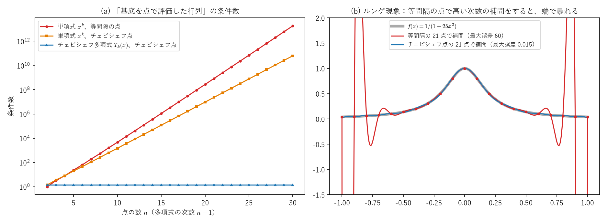
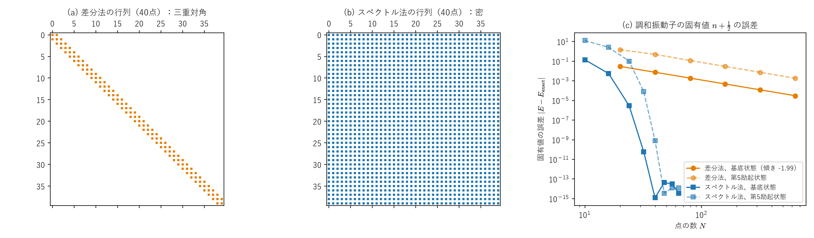
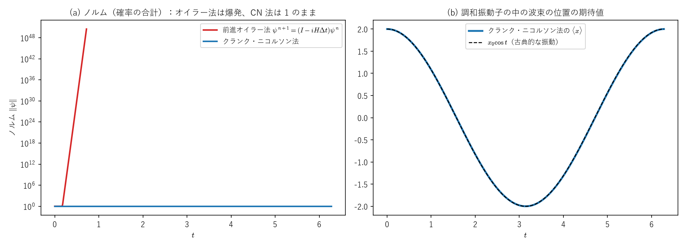
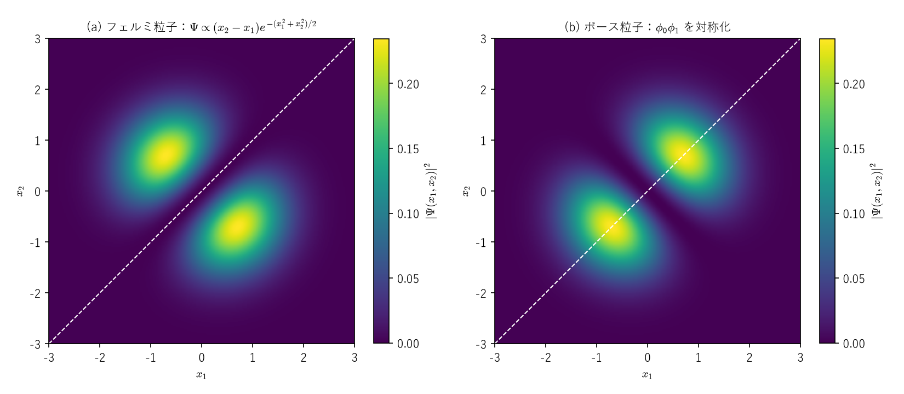

# ヴァンデルモンド行列と、関数を行列にする2つの方法 ―差分法・スペクトル法・クランク・ニコルソン法―

> **作成** 2026-10-04　**更新** 2026-10-04
> 微分方程式をコンピュータで解くために、関数を有限個の数に置き換えて微分を行列にする2つの方法（差分法とスペクトル法）を、
> ヴァンデルモンド行列を軸に整理し、クランク・ニコルソン法まで扱うノート。

シュレーディンガー方程式のような微分方程式をコンピュータで解くには、**関数（無限次元）を、有限個の数（有限次元のベクトル）に置き換え、微分を行列にする**必要があります。その置き換え方には、大きく2つのルートがあります。

$$
\begin{array}{ccccc}
\text{差分法} & : & \psi(x)\ \to\ \big(\psi(x_1),\dots,\psi(x_N)\big) & \to & \text{三重対角行列}\ \to\ \text{トーマス法・クランク・ニコルソン法}\\[2pt]
\text{スペクトル法} & : & \psi(x)\ \to\ (a_0,\dots,a_N)\ \text{（基底の係数）} & \to & \text{ヴァンデルモンド型の行列}\ \to\ \text{密な行列}
\end{array}
$$

このノートでは、

- **Part I**：ヴァンデルモンド行列（「$1,x,x^2,\dots$ という基底を、いくつかの点で評価した行列」）、行列式、多項式補間、テイラー展開との関係、弱点（悪条件とルンゲ現象）
- **Part II**：差分法とスペクトル法。調和振動子の固有値で、2つの方法の精度を比べる
- **Part III**：時間発展。前進オイラー法が破綻する理由、クランク・ニコルソン法がユニタリになる理由、三重対角の連立方程式を速く解くトーマス法
- **Part IV**：ヴァンデルモンド行列式が、多粒子の量子力学（フェルミ粒子のスレーター行列式、量子ホール効果のラフリン波動関数）に現れること

を扱います。

**関連ファイル**：図は [figures/make_discretization_figures.py](figures/make_discretization_figures.py) で作っていて、各図の値はスクリプトの中で本文の式と照合しています。テイラー展開は[ノートブック](../../notebooks/foundations/00_taylor_series/01_taylor_euler.ipynb)、収束半径と複素平面の特異点は[べき級数と収束半径のノート](../01_基礎・ベクトル解析/power_series_radius_of_convergence.md)、三重対角行列とジョルダン細胞・トロッター分解は[行列の指数関数と交換子のノート](../04_群論・代数/matrix_exponential_commutator_bch_trotter.md)、$e^{-iHt}$ がユニタリである理由は同ノートの Part VI にあります。ヴァンデルモンド行列式の別の証明と高校数学での応用は、「高校数学の美しい物語」の[ヴァンデルモンド行列式の証明と応用例](https://manabitimes.jp/math/779)にあります。

**記号の約束**：このノートでは $\hbar=m=1$ とする単位を使い、1次元のハミルトニアンを $\hat H=-\frac12\frac{d^2}{dx^2}+V(x)$ と書きます。格子点を $x_1,\dots,x_N$、間隔を $h$、$\psi_i=\psi(x_i)$ とします。

<a id="toc"></a>

## 目次

<!-- toc:start -->

- [Part I：ヴァンデルモンド行列](#p1)
  - [1. 定義：「基底を点で評価した行列」](#p1-1)
  - [2. 行列式](#p1-2)
  - [3. 多項式補間](#p1-3)
  - [4. テイラー展開との関係](#p1-4)
  - [5. 弱点：悪条件とルンゲ現象](#p1-5)
- [Part II：関数を有限次元にする2つの方法](#p2)
  - [1. 出発点は同じ](#p2-1)
  - [2. 差分法：テイラー展開から2階微分を近似する](#p2-2)
  - [3. スペクトル法：基底で展開し、微分を行列にする](#p2-3)
  - [4. 2つの方法の比較](#p2-4)
  - [5. 量子力学の基底展開との関係](#p2-5)
- [Part III：時間発展 ―クランク・ニコルソン法とトーマス法―](#p3)
  - [1. 前進オイラー法は、ノルムが増えて破綻する](#p3-1)
  - [2. クランク・ニコルソン法はユニタリ](#p3-2)
  - [3. トーマス法：三重対角の連立方程式を O(N) で解く](#p3-3)
  - [4. スペクトル法との組み合わせ：分割演算子法](#p3-4)
- [Part IV：ヴァンデルモンド行列式と多粒子の量子力学](#p4)
  - [1. フェルミ粒子とスレーター行列式](#p4-1)
  - [2. 調和振動子では、ヴァンデルモンド行列式そのもの](#p4-2)
  - [3. ラフリン波動関数（分数量子ホール効果）](#p4-3)
  - [4. ランダム行列と準位反発](#p4-4)
- [Part V：まとめ](#p5)

<!-- toc:end -->

---

<a id="p1"></a>

# Part I：ヴァンデルモンド行列

<!-- part-toc:start -->

**この Part の内容**

- [1. 定義：「基底を点で評価した行列」](#p1-1)
- [2. 行列式](#p1-2)
- [3. 多項式補間](#p1-3)
- [4. テイラー展開との関係](#p1-4)
- [5. 弱点：悪条件とルンゲ現象](#p1-5)

<!-- part-toc:end -->

<a id="p1-1"></a>

## 1. 定義：「基底を点で評価した行列」

異なる $n$ 個の点 $x_1,\dots,x_n$ に対して、

$$
V=\begin{pmatrix}1&x_1&x_1^2&\cdots&x_1^{n-1}\\1&x_2&x_2^2&\cdots&x_2^{n-1}\\\vdots&\vdots&\vdots&&\vdots\\1&x_n&x_n^2&\cdots&x_n^{n-1}\end{pmatrix},\qquad V_{ik}=x_i^{\,k-1}\tag{I-1}
$$

を**ヴァンデルモンド行列**と呼びます（この転置、つまり列ごとに $1,x_i,x_i^2,\dots$ を並べた形で定義する本もあります。行列式は同じです）。

**意味**：多項式 $p(x)=a_0+a_1x+\cdots+a_{n-1}x^{n-1}$ の、各点での値を並べると

$$
\begin{pmatrix}p(x_1)\\p(x_2)\\\vdots\\p(x_n)\end{pmatrix}=V\begin{pmatrix}a_0\\a_1\\\vdots\\a_{n-1}\end{pmatrix}\tag{I-2}
$$

です。つまり $V$ は、**「係数ベクトル」を「各点での関数の値」に変換する行列**で、$V$ の第 $k$ 列は「基底の関数 $x^{k-1}$ を、点 $x_1,\dots,x_n$ で評価したもの」です。$1,x,x^2,\dots$ を別の基底 $\phi_0,\phi_1,\dots$ に替えた $\Phi_{ik}=\phi_{k-1}(x_i)$ も、同じ役割をする「ヴァンデルモンド型」の行列です（Part II §3）。

<a id="p1-2"></a>

## 2. 行列式

$$
\det V=\prod_{1\le i<j\le n}(x_j-x_i)\tag{I-3}
$$

**3×3 で確かめる**：$\det\begin{pmatrix}1&x_1&x_1^2\\1&x_2&x_2^2\\1&x_3&x_3^2\end{pmatrix}=(x_2-x_1)(x_3-x_1)(x_3-x_2)$。

**証明**（列の操作と帰納法）：右の列から順に、「第 $k$ 列から、第 $k-1$ 列の $x_1$ 倍を引く」（$k=n,n-1,\dots,2$）という操作をします。列の操作では行列式は変わりません。第 $i$ 行・第 $k$ 列の成分は

$$
x_i^{\,k-1}-x_1\,x_i^{\,k-2}=x_i^{\,k-2}(x_i-x_1)
$$

になり、第1行は $(1,0,\dots,0)$ になります。第1行で展開すると、残るのは $(n-1)\times(n-1)$ の行列 $\big(x_i^{\,k-2}(x_i-x_1)\big)_{i,k=2}^n$ で、第 $i$ 行から共通の因子 $(x_i-x_1)$ を外に出すと、残りは $x_2,\dots,x_n$ のヴァンデルモンド行列です。

$$
\det V(x_1,\dots,x_n)=\prod_{i=2}^n(x_i-x_1)\cdot\det V(x_2,\dots,x_n)
$$

これをくり返すと式 (I-3) になります。$\square$（図のスクリプトでも、4点の例で数値的に確認しています。）

**結論**：**点がすべて異なれば $\det V\ne0$、2つの点が一致すると $\det V=0$** です。この「一致すると $0$」という性質が、Part IV で物理的な意味を持ちます。

<a id="p1-3"></a>

## 3. 多項式補間

$n$ 個の点で値 $y_1,\dots,y_n$ が与えられたとき、それを通る次数 $n-1$ 以下の多項式は、式 (I-2) の $V\mathbf a=\mathbf y$ を解けば求まります。点が異なれば $\det V\ne0$ なので、**解はちょうど1つ**です。

$V$ の逆行列を求める代わりに、**ラグランジュの基底**

$$
\ell_j(x)=\prod_{m\ne j}\frac{x-x_m}{x_j-x_m}\qquad\big(\ell_j(x_i)=1\ (i=j),\ \ 0\ (i\ne j)\big)\tag{I-4}
$$

を使うと、$p(x)=\sum_jy_j\ell_j(x)$ と直接書けます（$\ell_j$ は「点 $x_j$ でだけ $1$、ほかの点で $0$」の多項式）。$\ell_j$ の係数を並べたものが、$V^{-1}$ の第 $j$ 列です。

<a id="p1-4"></a>

## 4. テイラー展開との関係

「ヴァンデルモンド行列を列方向に見ると、テイラー展開に似ている」という見方は、かなり本質的です。どちらも**「$1,x,x^2,\dots$ を基底として関数を表す」**点は同じで、違いは係数を決める情報です。

| | 係数を決める情報 | 表す範囲 |
|---|---|---|
| ヴァンデルモンド（補間） | **いくつかの点での値** $f(x_1),\dots,f(x_n)$ | 点を含む範囲 |
| テイラー展開 | **1つの点での微分係数** $f(a),f'(a),\frac{f''(a)}{2!},\dots$ | その点のまわり（収束半径の内側） |

**点を1つに集めると、補間はテイラー展開になります。** 補間多項式をニュートンの形

$$
p(x)=f[x_1]+f[x_1,x_2](x-x_1)+f[x_1,x_2,x_3](x-x_1)(x-x_2)+\cdots
$$

（$f[x_1,x_2]=\frac{f(x_2)-f(x_1)}{x_2-x_1}$、$f[x_1,x_2,x_3]=\frac{f[x_2,x_3]-f[x_1,x_2]}{x_3-x_1}$ などの**差分商**）で書くと、点を $a$ に近づけたとき、$f[x_1,x_2]\to f'(a)$（微分の定義そのもの）、$f[x_1,x_2,x_3]\to\frac{f''(a)}{2}$ となり、ニュートンの形はテイラー多項式 $f(a)+f'(a)(x-a)+\frac{f''(a)}2(x-a)^2+\cdots$ に近づきます。点が重なる極限では、$V$ の重なった行は「値」の代わりに「微分係数」を並べた行に置き換わります（**合流型ヴァンデルモンド行列**）。

<a id="p1-5"></a>

## 5. 弱点：悪条件とルンゲ現象

**悪条件**：$[-1,1]$ の上で $x^{10}$ と $x^{12}$ のグラフはほとんど同じ形（端だけ立ち上がる）で、高い次数の単項式どうしはほぼ平行なベクトルになります。そのため、$V$ はほぼ $\det V=0$ に近い**悪条件**の行列になり、$V\mathbf a=\mathbf y$ を解くと丸め誤差が大きく拡大されます。図 (a) のように、等間隔の点では、条件数（誤差の拡大率の目安）は点の数とともに指数関数的に大きくなり、30点で $10^{13}$ を超えます。

**ルンゲ現象**：$f(x)=\frac1{1+25x^2}$ を等間隔の21点で補間すると、端で大きく振動し、最大誤差は $60$ にもなります（図 (b)）。点を増やすと、かえって悪くなります。これは[べき級数と収束半径のノート](../01_基礎・ベクトル解析/power_series_radius_of_convergence.md)の Part II と同じ理由で、$f$ は実数の範囲ではなめらかですが、複素平面の $x=\pm\frac i5$（実軸のすぐ近く）に特異点があるためです。

**対策：チェビシェフ点とチェビシェフ多項式**　点を等間隔ではなく、端に密に集めた**チェビシェフ点** $x_k=\cos\frac{(2k+1)\pi}{2n}$ にすると、ルンゲ現象は消えます（図 (b)、最大誤差 $0.015$）。さらに基底を単項式からチェビシェフ多項式 $T_k$（$T_k(\cos\theta)=\cos k\theta$ で定義され、$T_0=1,\ T_1=x,\ T_2=2x^2-1,\dots$）に替えると、ヴァンデルモンド型の行列の列どうしが直交し、条件数は点の数によらず $\sqrt2$ 程度に収まります（図 (a) の青）。$T_k(\cos\theta)=\cos k\theta$ なので、チェビシェフ多項式で考えることは、$\theta$ についてのフーリエ級数（$\cos k\theta$ の基底）で考えることと同じです。



*(a) 「基底を点で評価した行列」の条件数。単項式＋等間隔の点（赤）と単項式＋チェビシェフ点（橙）は指数関数的に悪くなり、チェビシェフ多項式＋チェビシェフ点（青）は約 $\sqrt2$ のまま。(b) $\frac1{1+25x^2}$ を21点で補間したもの。等間隔の点（赤）は端で暴れ、チェビシェフ点（青）は元の関数（灰色）とほぼ重なる。*

---

<a id="p2"></a>

# Part II：関数を有限次元にする2つの方法

<!-- part-toc:start -->

**この Part の内容**

- [1. 出発点は同じ](#p2-1)
- [2. 差分法：テイラー展開から2階微分を近似する](#p2-2)
- [3. スペクトル法：基底で展開し、微分を行列にする](#p2-3)
- [4. 2つの方法の比較](#p2-4)
- [5. 量子力学の基底展開との関係](#p2-5)

<!-- part-toc:end -->

<a id="p2-1"></a>

## 1. 出発点は同じ

時間によらないシュレーディンガー方程式

$$
-\frac12\frac{d^2\psi}{dx^2}+V(x)\psi=E\psi
$$

をコンピュータで解くには、関数 $\psi$ を有限個の数に置き換え、$\frac{d^2}{dx^2}$ を行列に置き換えて、$H\boldsymbol\psi=E\boldsymbol\psi$ という**行列の固有値問題**にします。置き換え方が、差分法とスペクトル法で違います。

<a id="p2-2"></a>

## 2. 差分法：テイラー展開から2階微分を近似する

点 $x_i$ のまわりでテイラー展開すると

$$
\psi(x_i\pm h)=\psi_i\pm h\psi'_i+\frac{h^2}2\psi''_i\pm\frac{h^3}6\psi'''_i+\frac{h^4}{24}\psi''''_i+O(h^5)
$$

で、2つを足すと奇数次の項が消えて

$$
\psi_{i+1}+\psi_{i-1}=2\psi_i+h^2\psi''_i+\frac{h^4}{12}\psi''''_i+O(h^6)
$$

です。$h^2$ で割って整理すると

$$
\frac{\psi_{i-1}-2\psi_i+\psi_{i+1}}{h^2}=\psi''_i+\frac{h^2}{12}\psi''''_i+O(h^4)\tag{II-1}
$$

で、左辺（**2階差分**）は $\psi''$ を誤差 $O(h^2)$ で近似します（テイラー展開のノートブックの「微分は1次の近似、捨てた部分が誤差」の2階版）。

これを各格子点で使うと、両端で $\psi=0$ として、ハミルトニアンは

$$
H=\begin{pmatrix}\frac1{h^2}+V_1&-\frac1{2h^2}&&\\-\frac1{2h^2}&\frac1{h^2}+V_2&-\frac1{2h^2}&\\&\ddots&\ddots&\ddots\\&&-\frac1{2h^2}&\frac1{h^2}+V_N\end{pmatrix}\tag{II-2}
$$

という**三重対角行列**になります（$V_i=V(x_i)$）。2階差分が隣の点しか見ないので、行列の $0$ でない成分は対角とその両隣だけです。

<a id="p2-3"></a>

## 3. スペクトル法：基底で展開し、微分を行列にする

関数を基底 $\phi_0,\dots,\phi_{N-1}$ の線形結合で近似します。

$$
\psi(x)\approx\sum_{k=0}^{N-1}a_k\phi_k(x)
$$

**コロケーション**（選んだ点で方程式を満たさせる）の場合、格子点での値 $\mathbf u=(\psi(x_1),\dots,\psi(x_N))^T$ と係数 $\mathbf a$ は、ヴァンデルモンド型の行列 $\Phi_{ik}=\phi_{k-1}(x_i)$ で $\mathbf u=\Phi\mathbf a$ と結ばれます。微分した関数の値は、基底を微分した行列 $\Phi'_{ik}=\phi'_{k-1}(x_i)$ を使って $\mathbf u'=\Phi'\mathbf a=\Phi'\Phi^{-1}\mathbf u$ なので、

$$
D=\Phi'\,\Phi^{-1}\qquad(\text{格子点の値に掛けると、微分した関数の値が出る行列})\tag{II-3}
$$

が**微分行列**です。$\Phi^{-1}$ で「値 → 係数」に戻し、各基底を微分し、$\Phi'$ で「係数 → 値」に変換する、という3段階を1つの行列にしたものです。基底の範囲の関数（たとえば次数 $N-1$ 以下の多項式）なら、微分は**誤差なしで正確**です。

**フーリエ・スペクトル法**：周期的な問題では、基底を $\phi_k(x)=e^{ikx}$ にします。このとき $\Phi$ は離散フーリエ変換の行列で、$e^{ikx}$ の微分は $ik\,e^{ikx}$ なので

$$
D=\mathcal F^{-1}\operatorname{diag}(ik)\,\mathcal F\tag{II-4}
$$

です（$\mathcal F$ は高速フーリエ変換）。[正規化フローのノート](../06_確率・統計/normalizing_flows_introduction.md)の図 nf06 で、ガウス波束の時間発展と確率の流れを計算したのが、この方法です。周期的でない問題では、Part I §5 のチェビシェフ多項式を基底にします。

<a id="p2-4"></a>

## 4. 2つの方法の比較

| | 差分法 | スペクトル法 |
|---|---|---|
| 未知数 | 格子点の値 $\psi(x_i)$ | 基底の係数 $a_k$（または格子点の値） |
| 微分の扱い | 隣の点との差（テイラー展開で近似） | 基底関数を微分（基底の範囲なら正確） |
| 行列 | 疎（三重対角） | 密 |
| 局所性 | 強い（隣の点だけ） | 弱い（全部の点がつながる） |
| 精度の上げ方 | 格子を細かくする | 基底を増やす |
| 誤差の減り方 | $O(h^2)=O(N^{-2})$（べき乗） | なめらかな関数なら**指数関数的** |
| 得意なもの | 複雑な形の領域、なめらかでない解 | なめらかな解、周期的・単純な領域 |

下の図は、調和振動子 $V=\frac12x^2$（固有値は $n+\frac12$）を両方の方法で解いた結果です。差分法の誤差は点の数 $N$ に対して傾き $-2$（$h^2$ に比例）で減り、640点でも基底状態の誤差は $10^{-5}$ 程度です。スペクトル法は、40点で丸め誤差の水準（$10^{-15}$）に達します。

なめらかな関数でスペクトル法の誤差が指数関数的に減る理由も、[べき級数と収束半径のノート](../01_基礎・ベクトル解析/power_series_radius_of_convergence.md)と同じです。関数が複素平面の帯（または楕円）の中で解析的なら、展開の係数は特異点までの距離で決まる速さで指数関数的に小さくなります。調和振動子の固有関数（$e^{-x^2/2}$ × 多項式）は、複素平面全体で解析的です。



*(a) 差分法のハミルトニアン（40点）の0でない成分：三重対角。(b) フーリエ・スペクトル法のハミルトニアン（40点）：密。(c) 調和振動子の基底状態と第5励起状態の固有値の誤差。差分法（橙）は傾き $-2$、スペクトル法（青）は指数関数的に減り、40点で丸め誤差の水準に達する。*

<a id="p2-5"></a>

## 5. 量子力学の基底展開との関係

量子力学では、最初から状態を基底で展開します：$|\psi\rangle=\sum_nc_n|n\rangle$。シュレーディンガー方程式 $\hat H|\psi\rangle=E|\psi\rangle$ に左から $\langle m|$ を掛けると

$$
\sum_n\langle m|\hat H|n\rangle\,c_n=E\,c_m,\qquad\text{つまり}\quad H\mathbf c=E\mathbf c,\quad H_{mn}=\langle m|\hat H|n\rangle\tag{II-5}
$$

です。これは、基底の数を有限で打ち切れば、スペクトル法の一種（**ガレルキン法**：方程式を基底への射影で満たさせる）そのものです。コロケーション（点で満たさせる）とガレルキン（内積で満たさせる）の違いはありますが、どちらも「関数を基底の係数に圧縮し、演算子を行列にする」という点で、量子力学の行列表示と同じ発想です。ガレルキン法で求めた基底状態のエネルギーは、正確な値以上になります（**変分原理**。VQE の考え方の土台でもあります）。

---

<a id="p3"></a>

# Part III：時間発展 ―クランク・ニコルソン法とトーマス法―

<!-- part-toc:start -->

**この Part の内容**

- [1. 前進オイラー法は、ノルムが増えて破綻する](#p3-1)
- [2. クランク・ニコルソン法はユニタリ](#p3-2)
- [3. トーマス法：三重対角の連立方程式を O(N) で解く](#p3-3)
- [4. スペクトル法との組み合わせ：分割演算子法](#p3-4)

<!-- part-toc:end -->

時間に依存するシュレーディンガー方程式 $i\frac{d\boldsymbol\psi}{dt}=H\boldsymbol\psi$（$H$ は差分法の三重対角行列）を、時間刻み $\Delta t$ で進めます。正確な答えは $\boldsymbol\psi(t+\Delta t)=e^{-iH\Delta t}\boldsymbol\psi(t)$ ですが、$e^{-iH\Delta t}$ を毎回計算するのは大変なので、近似します。

<a id="p3-1"></a>

## 1. 前進オイラー法は、ノルムが増えて破綻する

一番素直な近似は、微分を前進差分で置き換えた

$$
\boldsymbol\psi^{n+1}=(I-iH\Delta t)\,\boldsymbol\psi^n\tag{III-1}
$$

です（$e^{-iH\Delta t}$ のテイラー展開を1次で打ち切ったもの）。$H$ の固有値 $E$ の成分は、1ステップで $1-iE\Delta t$ 倍されます。その絶対値は $|1-iE\Delta t|=\sqrt{1+E^2\Delta t^2}>1$ なので、**ノルム（確率の合計）が毎ステップ増えます**。差分法の $H$ の最大固有値は約 $\frac2{h^2}$（式 (II-2) の対角と非対角から）と非常に大きいので、高い固有値の成分が爆発的に増え、計算はすぐに破綻します（図 (a) の赤。$h=0.05$、$\Delta t=0.01$ で、最大の成分は1ステップで約8.5倍）。

<a id="p3-2"></a>

## 2. クランク・ニコルソン法はユニタリ

前進差分と後退差分の平均を取ります。

$$
\Big(I+\frac{i\Delta t}2H\Big)\boldsymbol\psi^{n+1}=\Big(I-\frac{i\Delta t}2H\Big)\boldsymbol\psi^n\tag{III-2}
$$

（**クランク・ニコルソン法**）。固有値 $E$ の成分は $\dfrac{1-iE\Delta t/2}{1+iE\Delta t/2}$ 倍されます。分子と分母は互いに複素共役で絶対値が等しいので、**絶対値はちょうど $1$** です。行列で書くと、1ステップの行列

$$
U=\Big(I+\frac{i\Delta t}2H\Big)^{-1}\Big(I-\frac{i\Delta t}2H\Big)\tag{III-3}
$$

は、$K=\frac{\Delta t}2H$（エルミート）とおくと $U^\dagger=(I+iK)(I-iK)^{-1}$ で、$I\pm iK$ はどれも $K$ の関数なので互いに交換し、$U^\dagger U=I$ です。**$U$ はユニタリで、ノルムは保存されます**（図 (a) の青。$10^{-10}$ 以下の精度で $1$）。$e^{-iH\Delta t}$ 自身がユニタリであること（[行列の指数関数と交換子のノート](../04_群論・代数/matrix_exponential_commutator_bch_trotter.md)の Part VI）を、近似でも保っています。

**精度**：$z=E\Delta t$ とおいて展開すると

$$
\frac{1-iz/2}{1+iz/2}=1-iz-\frac{z^2}2+\frac{iz^3}4+\cdots,\qquad e^{-iz}=1-iz-\frac{z^2}2+\frac{iz^3}6+\cdots
$$

で、2次の項まで一致します。1ステップの誤差は $O(\Delta t^3)$、全体では $O(\Delta t^2)$ です（前進オイラー法は1次まで）。図 (b) で、調和振動子の中の波束の位置の期待値は、古典的な振動 $x_0\cos t$ とほぼ重なります（1周期でのずれは約 $0.012$ で、$\Delta t^2$ の位相誤差による）。このような「分数の形で指数関数を近似する」方法を**パデ近似**、特に $\frac{1-a}{1+a}$ の形を**ケーリー変換**と呼びます。

<a id="p3-3"></a>

## 3. トーマス法：三重対角の連立方程式を $O(N)$ で解く

式 (III-2) は、毎ステップ、左辺の行列 $I+\frac{i\Delta t}2H$ の連立方程式を解く必要があります。一般の $N\times N$ の連立方程式をガウスの消去法で解くと $N^3$ に比例する手間がかかりますが、**三重対角なら $N$ に比例する手間**で解けます。

三重対角の連立方程式 $a_ix_{i-1}+b_ix_i+c_ix_{i+1}=d_i$（$a_1=c_N=0$）に対して、

**前進消去**：各行で、1つ下の対角成分（$a_i$）だけを消せばよいので

$$
c'_1=\frac{c_1}{b_1},\quad d'_1=\frac{d_1}{b_1};\qquad c'_i=\frac{c_i}{b_i-a_ic'_{i-1}},\quad d'_i=\frac{d_i-a_id'_{i-1}}{b_i-a_ic'_{i-1}}\quad(i=2,\dots,N)\tag{III-4}
$$

**後退代入**：

$$
x_N=d'_N,\qquad x_i=d'_i-c'_ix_{i+1}\quad(i=N-1,\dots,1)\tag{III-5}
$$

これが**トーマス法**（三重対角行列に特化したガウスの消去法）です。一般のガウスの消去法では、各段で「その下の全部の行」を消しますが、三重対角では消すべき成分が1つずつしかないので、手間が $N$ に比例します。クランク・ニコルソン法の行列は対角成分が大きい（対角優位な）ので、行の入れ替えなしで安定に解けます。図のスクリプトでは、トーマス法の解が `numpy.linalg.solve` の解と一致することを確かめています。



*調和振動子の中のガウス波束（初期位置 $x_0=2$、差分法 400 点、$\Delta t=0.01$）。(a) ノルム。前進オイラー法（赤）は爆発し、クランク・ニコルソン法（青）は $1$ のまま。(b) クランク・ニコルソン法での位置の期待値と、古典的な振動 $x_0\cos t$。*

<a id="p3-4"></a>

## 4. スペクトル法との組み合わせ：分割演算子法

$\hat H=\hat T+\hat V$（運動エネルギー＋位置エネルギー）で、$\hat V$ は位置の基底で対角、$\hat T=-\frac12\frac{d^2}{dx^2}$ はフーリエ基底（運動量の基底）で対角（$\frac12k^2$）です。そこで、[行列の指数関数と交換子のノート](../04_群論・代数/matrix_exponential_commutator_bch_trotter.md)の Part VI のストラング分解を使って

$$
e^{-i\hat H\Delta t}\approx e^{-iV\Delta t/2}\ \mathcal F^{-1}\,e^{-ik^2\Delta t/2}\,\mathcal F\ e^{-iV\Delta t/2}\tag{III-6}
$$

と分けると、各因子は「対角行列（成分ごとの位相の掛け算）」か「高速フーリエ変換」だけで計算でき、どれも正確にユニタリです（**分割演算子法**）。誤差は $O(\Delta t^2)$ で、手間は1ステップ $N\log N$ に比例します。トロッター分解とスペクトル法の組み合わせで、量子コンピュータでの時間発展のシミュレーション（パウリ文字列ごとに対角化して回す）と同じ発想です。

---

<a id="p4"></a>

# Part IV：ヴァンデルモンド行列式と多粒子の量子力学

<!-- part-toc:start -->

**この Part の内容**

- [1. フェルミ粒子とスレーター行列式](#p4-1)
- [2. 調和振動子では、ヴァンデルモンド行列式そのもの](#p4-2)
- [3. ラフリン波動関数（分数量子ホール効果）](#p4-3)
- [4. ランダム行列と準位反発](#p4-4)

<!-- part-toc:end -->

<a id="p4-1"></a>

## 1. フェルミ粒子とスレーター行列式

同じ種類のフェルミ粒子（電子など）$N$ 個の波動関数は、2つの粒子の座標を入れ替えると符号が反転しなければなりません（**反対称性**）。1粒子の状態（軌道）$\phi_1,\dots,\phi_N$ から反対称な波動関数を作るには、行列式を使います。

$$
\Psi(x_1,\dots,x_N)=\frac1{\sqrt{N!}}\det\begin{pmatrix}\phi_1(x_1)&\phi_2(x_1)&\cdots&\phi_N(x_1)\\\vdots&\vdots&&\vdots\\\phi_1(x_N)&\phi_2(x_N)&\cdots&\phi_N(x_N)\end{pmatrix}\tag{IV-1}
$$

（**スレーター行列式**）。

- 2つの粒子の座標 $x_i,x_k$ を入れ替えると、行列の2つの行が入れ替わり、行列式の符号が反転します（反対称性）。
- $x_i=x_k$ だと2つの行が等しくなり、行列式は $0$ です。**2つのフェルミ粒子が同じ場所に来る確率は $0$**（パウリの排他原理）。

この行列は、Part I の「基底（軌道）を点（粒子の座標）で評価した行列」そのものです。

<a id="p4-2"></a>

## 2. 調和振動子では、ヴァンデルモンド行列式そのもの

調和振動子の固有関数は

$$
\phi_n(x)=c_n\,H_n(x)\,e^{-x^2/2}\tag{IV-2}
$$

（$H_n$ はエルミート多項式：$H_0=1$、$H_1=2x$、$H_2=4x^2-2$、…。$H_n$ は $n$ 次で、最高次の係数は $2^n$。$c_n$ は規格化定数）です。スレーター行列式から各行の $e^{-x_i^2/2}$ と各列の $c_n$ を外に出すと、残りは $\det\big(H_{k-1}(x_i)\big)$ です。列の操作（第 $k$ 列から、それより左の列の適当な倍数を引く）で、$H_{k-1}(x)$ を最高次の項 $2^{k-1}x^{k-1}$ だけにできるので

$$
\det\big(H_{k-1}(x_i)\big)_{i,k=1}^N=\Big(\prod_{k=1}^N2^{k-1}\Big)\prod_{i<j}(x_j-x_i)\tag{IV-3}
$$

です（図のスクリプトで、4点の例を数値的に確認）。したがって、$N$ 個のフェルミ粒子が下から $N$ 個の軌道を埋めた状態（基底状態）は

$$
\Psi(x_1,\dots,x_N)\propto\prod_{i<j}(x_j-x_i)\;e^{-\sum_ix_i^2/2}\tag{IV-4}
$$

と、**ヴァンデルモンド行列式 × ガウス関数**になります。$N=2$ なら $\Psi\propto(x_2-x_1)e^{-(x_1^2+x_2^2)/2}$ で、対角線 $x_1=x_2$ の上で $0$ です（図 (a)）。ボース粒子（対称化する）なら、対角線の上でも $0$ になりません（図 (b)）。



*調和振動子の軌道 $\phi_0,\phi_1$ に2つの粒子を入れた波動関数の $|\Psi(x_1,x_2)|^2$。(a) フェルミ粒子（反対称化）：ヴァンデルモンド行列式 $(x_2-x_1)$ のために、対角線 $x_1=x_2$（破線）の上で $0$。(b) ボース粒子（対称化）：対角線の上に確率が集まる。*

<a id="p4-3"></a>

## 3. ラフリン波動関数（分数量子ホール効果）

2次元の電子に強い磁場をかけると、1粒子の最もエネルギーの低い状態（最低ランダウ準位）は、複素座標 $z=x+iy$ を使って $z^me^{-|z|^2/4\ell^2}$（$m=0,1,2,\dots$、$\ell$ は磁場で決まる長さ）と書けます。これを $m=0,\dots,N-1$ まで電子で埋めたスレーター行列式は、§2 と同じ理屈で、**複素数のヴァンデルモンド行列式**

$$
\Psi_1=\prod_{i<j}(z_i-z_j)\;e^{-\sum_i|z_i|^2/4\ell^2}\tag{IV-5}
$$

になります（準位が全部埋まった状態、占有率 $\nu=1$）。ラフリンは、準位が $\frac1m$ だけ埋まった状態（$\nu=\frac13$ など）の波動関数として

$$
\Psi_m=\prod_{i<j}(z_i-z_j)^m\;e^{-\sum_i|z_i|^2/4\ell^2}\qquad(m\text{ は奇数})\tag{IV-6}
$$

を提案しました。$m$ が奇数なので反対称で、2つの電子が近づくと $|z_i-z_j|^m$ で急速に $0$ になります。電子どうしが強く避け合うので、クーロン反発のエネルギーが小さくなり、この状態が実現します。分数量子ホール効果（1982年に発見、1998年にノーベル物理学賞）の理論の中心にある式です。

<a id="p4-4"></a>

## 4. ランダム行列と準位反発

大きなエルミート行列の成分をランダムに選ぶと、その固有値 $\lambda_1,\dots,\lambda_N$ の同時分布は

$$
p(\lambda_1,\dots,\lambda_N)\propto\prod_{i<j}|\lambda_j-\lambda_i|^\beta\;e^{-\sum_i\lambda_i^2/2\sigma^2}\qquad(\beta=1,2,4)
$$

という形になります。ここでもヴァンデルモンド行列式（の $\beta$ 乗）が現れ、2つの固有値が近づく確率が $0$ に近づきます（**準位反発**）。カオス的な量子系のエネルギー準位の並び方がこの分布に従うことが知られていて（量子カオス）、[カオスのノートブック](../../notebooks/learning/14_chaos/01_logistic_map.ipynb)の古典的なカオスとの対応を調べる手がかりになっています。

---

<a id="p5"></a>

# Part V：まとめ

```
関数（無限次元）を、有限次元の行列の問題にする

差分法（点の値）                          スペクトル法（基底の係数）
  テイラー展開 → 2階差分（誤差 O(h²)）       基底を点で評価 → ヴァンデルモンド型の行列 Φ
  → 三重対角行列                             → 微分行列 D = Φ' Φ⁻¹（密）
  → 時間発展：クランク・ニコルソン法          → なめらかな解なら誤差が指数関数的に減る
     （ケーリー変換でユニタリ）               → 単項式は悪条件、チェビシェフ多項式・フーリエ基底を使う
  → 連立方程式はトーマス法（O(N)）            → 時間発展：分割演算子法（FFT + ストラング分解）
                   ↘                        ↙
              H c = E c、ψ^{n+1} = U ψ^n（量子力学の行列表示と同じ形）

ヴァンデルモンド行列式 Π(x_j − x_i)：点が一致すると 0
  → スレーター行列式（パウリの排他原理）、ラフリン波動関数、ランダム行列の準位反発
```

| 話題 | 要点 | 式 |
|---|---|---|
| ヴァンデルモンド行列 | 係数 → 点での値。$\det V=\prod_{i<j}(x_j-x_i)$。点を1つに集めるとテイラー展開 | (I-2)、(I-3) |
| 弱点 | 単項式は悪条件、等間隔の点はルンゲ現象。チェビシェフ点・多項式で解消 | 図 dz01 |
| 差分法 | テイラー展開から2階差分、三重対角行列、誤差 $O(h^2)$ | (II-1)、(II-2) |
| スペクトル法 | 微分行列 $D=\Phi'\Phi^{-1}$、フーリエなら $\mathcal F^{-1}\operatorname{diag}(ik)\mathcal F$、誤差は指数関数的 | (II-3)、(II-4) |
| 時間発展 | 前進オイラー法はノルムが増える。クランク・ニコルソン法はユニタリで誤差 $O(\Delta t^2)$。トーマス法で $O(N)$ | (III-1)〜(III-5) |
| 多粒子 | スレーター行列式、調和振動子ではヴァンデルモンド行列式、ラフリン波動関数 | (IV-1)〜(IV-6) |
