# クリストッフェル記号とリーマン曲率テンソル ―高階テンソル入門―

<a id="toc"></a>

## 目次

<!-- toc:start -->

- [Part 0：はじめに ― 読み方・前提・記号](#p0)
  - [1. このノートについて](#p0-1)
  - [2. 前提知識](#p0-2)
  - [3. ノートの構成](#p0-3)
  - [4. 記号の約束](#p0-4)
  - [5. 添字の読み方](#p0-5)
  - [6. 図と動画の見方](#p0-6)
- [Part I：なぜクリストッフェル記号が必要になるのか](#p1)
  - [1. 「ベクトルを微分する」ことの落とし穴](#p1-1)
  - [2. クリストッフェル記号の定義](#p1-2)
- [Part II：計量からクリストッフェル記号の公式を導く](#p2)
  - [1. 計量の微分とクリストッフェル記号](#p2-1)
  - [2. 3つの式を組み合わせて Γ だけを取り出す](#p2-2)
- [Part III：別の定義（ヤコビアンの2階微分から）― 以前の議論との接続](#p3)
  - [1. Γ^k\_ij=A^k\_a∂\_jJ^a\_i の詳細な導出](#p3-1)
  - [2. 前回の「A(∂ J)」との接続を、自分の手で再導出する](#p3-2)
  - [3. 共変発散とは何か（Γ^i\_ij=∂\_jln√|g| の導出）](#p3-3)
  - [4. 補足：逆ヤコビ行列 A=J^-1 を成分で作る（余因子行列）](#p3-4)
- [Part IV：共変微分](#p4)
  - [1. ベクトル成分の「正しい微分」](#p4-1)
  - [2. なぜΓ^k\_ijV^iの中でi≠jなのか（表記上の理由と、意味上の理由）](#p4-2)
  - [3. 微分のいろいろ：どれが「座標に依らない」のか](#p4-3)
  - [4. なぜ外微分dにはΓの補正が要らないのか（rotとdivの非対称性の正体）](#p4-4)
- [Part V：測地線方程式（応用として）](#p5)
  - [1. 「まっすぐな線」を任意の座標で書く](#p5-1)
  - [2. 測地線方程式は特性方程式では解けない](#p5-2)
  - [3. 代わりの解法：キリングベクトルから保存量を作る](#p5-3)
  - [4. 測地線方程式は複素数領域まで考えるか](#p5-4)
- [Part VI：具体例1 ― 極座標（平坦な空間）でクリストッフェル記号を計算する](#p6)
  - [1. 基底ベクトルの微分から直接計算する](#p6-1)
  - [2. 計量からの公式で検算する](#p6-2)
  - [3. 重要な観察：Γ≠0 でも空間は平坦](#p6-3)
- [Part VII：リーマン曲率テンソル](#p7)
  - [1. クリストッフェル記号はなぜテンソルでないのか](#p7-1)
  - [2. 共変微分の非可換性として曲率を定義する](#p7-2)
  - [3. 幾何学的な意味（並行移動）](#p7-3)
- [Part VIII：具体例2 ― 球面（曲がった空間）でリーマン曲率テンソルを計算する](#p8)
  - [1. 設定](#p8-1)
  - [2. クリストッフェル記号](#p8-2)
  - [3. リーマン曲率テンソルを計算する](#p8-3)
  - [4. ガウス曲率とは何か、どう定義されるのか](#p8-4)
  - [5. 実際に計算し、両者の一致を確認する](#p8-5)
- [Part IX：リッチテンソル・スカラー曲率（簡単な紹介のみ）](#p9)
- [まとめ：全体の位置づけ](#summary)
- [付録A：ガウス・コダッツィ方程式の証明](#appA)
  - [A-0. 記法の確認（略記で式を追えなくならないように）](#A-0)
  - [A-1. 準備：曲面をR^3の中に置く](#A-1)
  - [A-2. ガウスの公式：r\_ij を「接する方向」と「法線方向」に分解する](#A-2)
  - [A-3. ヴァインガルテンの公式：法線ベクトルnの微分](#A-3)
  - [A-4. 3階微分を、2通りの順番で計算する](#A-4)
  - [A-5. 3階微分の対称性を使う](#A-5)
  - [A-6. 接する方向の係数を比較する ―ガウス方程式](#A-6)
  - [A-7. 法線方向の係数を比較する ―コダッツィ・マイナルディ方程式](#A-7)
  - [A-8. ガウス方程式から、K=R\_θφθφ/det g を導く（ガウスの驚異の定理の核心）](#A-8)
  - [A-9. 球面の具体例で、最終確認](#A-9)
  - [A-10. Wikipediaの「別の定義」も、同じ式であることの確認](#A-10)
  - [A-11. L\_ijの名前と、テンソルであることの確認](#A-11)
  - [まとめ](#A-sum)
- [付録B：曲面が存在するための条件（ボネの定理）](#appB)
  - [B-0. 前提知識](#B-0)
  - [B-1. コダッツィ方程式の共変形](#B-1)
  - [B-2. トーラスでの検算](#B-2)
  - [B-3. ガウスの公式とヴァインガルテンの公式を、連立偏微分方程式として書く](#B-3)
  - [B-4. 可積分条件](#B-4)
  - [B-5. フロベニウスの定理（2変数・線形の場合）](#B-5)
  - [B-6. ボネの定理](#B-6)
  - [B-7. 縮約して得られる式](#B-7)
  - [付録Bのまとめ](#B-sum)
- [付録C：曲がった時空の中の超曲面（ADM拘束条件）](#appC)
  - [C-0. 記法と前提知識](#C-0)
  - [C-1. 一般化されたガウス・コダッツィ方程式](#C-1)
  - [C-2. ハミルトン拘束・運動量拘束](#C-2)
  - [C-3. 拘束条件の先にあるもの（仮定からの導入）](#C-3)
  - [付録Cのまとめ](#C-sum)

<!-- toc:end -->

---

<a id="p0"></a>

# Part 0：はじめに ― 読み方・前提・記号

<!-- part-toc:start -->

**この Part の内容**

- [1. このノートについて](#p0-1)
- [2. 前提知識](#p0-2)
- [3. ノートの構成](#p0-3)
- [4. 記号の約束](#p0-4)
- [5. 添字の読み方](#p0-5)
- [6. 図と動画の見方](#p0-6)

<!-- part-toc:end -->

<a id="p0-1"></a>

## 1. このノートについて

このノートは、クリストッフェル記号とリーマン曲率テンソルを、計量テンソルの続きとして整理したものです。「計量さえ与えられれば、クリストッフェル記号も曲率テンソルも、追加の仮定なしに計算で決まる」ことを、平坦な極座標と、曲がった球面という2つの具体例で確かめながら進みます。

本編（Part I〜IX）は、一般相対論には踏み込みません。付録A・B・Cは、本編の続きとして、次の内容を扱います。

- **付録A**：ガウス方程式とコダッツィ方程式の証明（外から見た曲がり方と、内部だけで測る曲率の関係）
- **付録B**：曲面が存在するための条件（ボネの定理）
- **付録C**：曲がった時空の中の超曲面と、ADM 拘束条件（一般相対論への入り口）

付録は発展的な内容です。本編だけで、クリストッフェル記号から曲率テンソルを経て、球面のガウス曲率を求めるところまで読み通せます。

<a id="p0-2"></a>

## 2. 前提知識

- **計量テンソルと、共変・反変**：計量 $g_{ij}$ と逆計量 $g^{ij}$、上付きと下付きの添字、ラプラス・ベルトラミ作用素までを、前提にしています。このリポジトリでは、[計量テンソルと共変反変_まとめ](計量テンソルと共変反変_まとめ.md) と [球座標の計量テンソル計算例](球座標の計量テンソル計算例.md) にまとめています。
- **線形代数と多変数の微分**：行列、逆行列、行列式、トレースと、偏微分、連鎖律、混合偏微分の交換（2階微分が連続であれば、微分の順序を入れ替えても同じ）を使います。
- **付録B・C の追加の前提**：常微分方程式の解の存在と一意性（B-0-4 に要点を書いています）と、特殊相対論のミンコフスキー計量（C-0-2 に要点を書いています）です。
- **他のノートへの参照**：本文には、リー微分、微分形式、多様体、トポロジー入門、リッチテンソルとアインシュタイン方程式を扱った別のノートを参照する箇所があります。これらは別に作成したもので、このリポジトリには含まれていません。

<a id="p0-3"></a>

## 3. ノートの構成

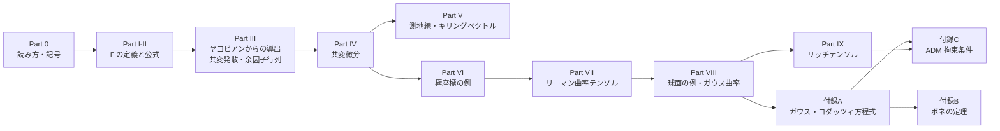
```mermaid
flowchart LR
    P0["Part 0<br/>読み方・記号"]
    P1["Part I-II<br/>Γ の定義と公式"]
    P3["Part III<br/>ヤコビアンからの導出<br/>共変発散・余因子行列"]
    P4["Part IV<br/>共変微分"]
    P5["Part V<br/>測地線・キリングベクトル"]
    P6["Part VI<br/>極座標の例"]
    P7["Part VII<br/>リーマン曲率テンソル"]
    P8["Part VIII<br/>球面の例・ガウス曲率"]
    P9["Part IX<br/>リッチテンソル"]
    A["付録A<br/>ガウス・コダッツィ方程式"]
    B["付録B<br/>ボネの定理"]
    C["付録C<br/>ADM 拘束条件"]

    P0 --> P1
    P1 --> P3 --> P4 --> P5
    P4 --> P6 --> P7 --> P8 --> P9
    P8 --> A --> B
    A --> C
    P9 --> C
```

Part I〜II で、クリストッフェル記号の定義と、計量からの公式を導きます。Part III は、別の定義（ヤコビアンの2階微分から）と、共変発散、余因子行列を扱います。Part IV は共変微分、Part V は測地線という応用です。Part VI で極座標の例（$\Gamma\ne0$ でも空間は平坦）、Part VII でリーマン曲率テンソル、Part VIII で球面の例（曲がった空間）を扱い、Part IX でリッチテンソルを紹介します。

<a id="p0-4"></a>

## 4. 記号の約束

- **座標と基底**：座標を $q^i$、基底ベクトルを $\mathbf e_i$、計量を $g_{ij}$（共変計量）、その逆行列を $g^{ij}$（反変計量）と書きます。添字 $i,j,k,l,m$ は、座標の番号を走ります。
- **和の約束**：同じ添字が、1つの項の中で上と下に1回ずつ現れたら、その添字について和を取ります（ダミー添字）。和を取らない添字は、自由添字と呼びます。
- **偏微分**：$\partial_i=\partial/\partial q^i$ と書きます。クリストッフェル記号は $\Gamma^k{}_{ij}$ で、下の2つの添字について対称です。
- **極座標**：本編では $x=r\cos\theta,\ y=r\sin\theta$ です（$q^1=r,\ q^2=\theta$）。
- **球面**：半径を $a$、座標を $(\theta,\phi)$ とし、$\theta$ は北極から測った角です。付録B のトーラスでは、$\theta$ は管の周りの角で、意味が異なります（B-2-1 に注意書きがあります）。
- **付録A・B の曲面**：曲面を $\mathbf r(u^1,u^2)$、第一基本形式を $g_{ij}$、第二基本形式を $L_{ij}$ と書きます。
- **付録C の外側の空間**：外側の量には上線を付け（$\bar g_{\mu\nu}$ など）、外側の座標の添字にはギリシャ文字、超曲面上の添字にはラテン文字を使います。外的曲率は $K_{ij}$（付録A・B の $L_{ij}$ にあたる）で、法線の長さを $\varepsilon=\pm1$ と書きます。
- **$\varepsilon$ の注意**：動画（Part I §2、Part VII §3）の $\varepsilon$ は小さな刻み幅で、付録C の $\varepsilon$ とは別のものです。
- **参照の書き方**：「Part IV §2」は、Part IV の2番目の節です。付録は「A-3」「B-2-5」「C-1-4」の形で参照します。

<a id="p0-5"></a>

## 5. 添字の読み方

このノートは、添字が大量に出てきます。先に、添字の読み方（自由添字、ダミー添字、付け替え）を図でまとめておきます。以降の図でも、**添字の文字ごとに色を固定**しています（$i$＝青、$j$＝緑、$k$＝赤、$l$＝紫、$m$＝橙、$n$＝茶）。色付きの文字が自由添字、色付きの囲みがダミー添字（上下でペアになって和を取る）です。

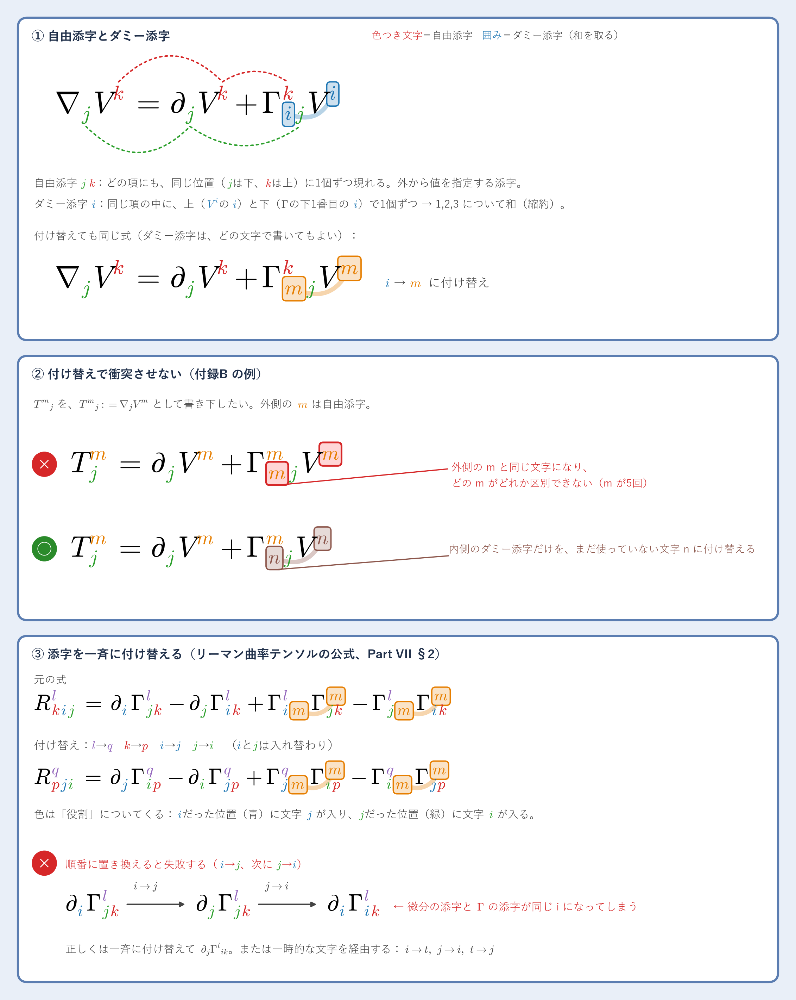

*① 自由添字はどの項にも同じ位置で現れ、ダミー添字は同じ項の中で上下がペアになって和を取ります（文字は何でもよい）。② 付け替えでは、外側で使っている文字とダミー添字が衝突しないようにします。③ $i\leftrightarrow j$ のような入れ替えは一斉に行います（順番に置き換えると別の添字と混ざります）。色は文字ではなく「役割」についてきます。*

$\delta$ による添字のすり替えは Part II §2、$\Gamma$ の添字は Part II §2、リーマン曲率テンソルの添字は Part VII §2 の図で、それぞれ扱います。

<a id="p0-6"></a>

## 6. 図と動画の見方

- 図と動画は [figures/](figures/) にあります。動画は GIF で、自動的にループ再生されます。
- 動画は、数値を実際に計算して描いています。ただし、振る舞いを見せるためのもので、証明の代わりにはなりません。
- 数式は KaTeX、構成図は Mermaid で書いています。VS Code の Markdown プレビューで確認しています（Mermaid の表示には、プレビュー用の拡張が必要です）。GitHub では、数式の表示エンジンが異なるため、一部の表現（色付きの枠など）の見え方が変わることがあります。
- 図と動画の生成スクリプトと再生成の方法は、リポジトリの [README](../README.md) にまとめています。

---

<a id="p1"></a>

# Part I：なぜクリストッフェル記号が必要になるのか

<!-- part-toc:start -->

**この Part の内容**

- [1. 「ベクトルを微分する」ことの落とし穴](#p1-1)
- [2. クリストッフェル記号の定義](#p1-2)

<!-- part-toc:end -->

<a id="p1-1"></a>

## 1. 「ベクトルを微分する」ことの落とし穴

デカルト座標では、ベクトル場 $V=V^a\mathbf e_a$ を微分するのは簡単です。基底 $\mathbf e_a$ が場所によらず一定なので、

$$
\frac{\partial V}{\partial x^b} = \frac{\partial V^a}{\partial x^b}\mathbf e_a
$$

つまり「成分を微分するだけ」で済みます。

ところが曲線座標 $q^i$ では、基底ベクトル

$$
\mathbf e_i(q) = \frac{\partial\mathbf x}{\partial q^i}
$$

自体が**場所によって向きも長さも変わります**（前回の極座標の例で $\mathbf e_\theta=(-r\sin\theta,\,r\cos\theta)$ が $r,\theta$ によって変わっていたことを思い出してください）。したがって、ベクトル場 $V=V^i\mathbf e_i$ を微分すると、積の微分から**基底ベクトル自身の微分**という新しい項が出てきます：

$$
\frac{\partial V}{\partial q^j} = \frac{\partial V^i}{\partial q^j}\mathbf e_i + V^i\frac{\partial\mathbf e_i}{\partial q^j}
$$

この「基底ベクトルがどう変化するか」を定量化する量が**クリストッフェル記号**です。

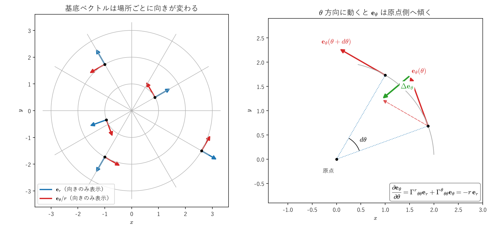

*左：極座標の基底ベクトル $\mathbf e_r,\mathbf e_\theta$ は場所ごとに向きが違う。右：$\theta$ を $d\theta$ だけ動かすと $\mathbf e_\theta$ が原点側に傾き、その変化 $\Delta\mathbf e_\theta$ は $-r\,\mathbf e_r$ の向きになる（$\Gamma^r{}_{\theta\theta}=-r$ に対応。Part VI §1 で計算します）。*

<a id="p1-2"></a>

## 2. クリストッフェル記号の定義

基底ベクトルの微分 $\dfrac{\partial\mathbf e_i}{\partial q^j}$ は、それ自体1つのベクトルなので、基底 $\{\mathbf e_k\}$ で展開できます：

$$
\boxed{\frac{\partial\mathbf e_i}{\partial q^j} =: \Gamma^k{}_{ij}\,\mathbf e_k}
$$

この展開係数 $\Gamma^k{}_{ij}$ がクリストッフェル記号（接続係数）です。「$i$方向の基底ベクトルを、$j$方向に動きながら見たとき、$k$方向の成分がどれだけ出てくるか」を表す量、というのが直感的な意味です。

$\mathbf e_i=\partial\mathbf x/\partial q^i$ なので、

$$
\frac{\partial\mathbf e_i}{\partial q^j} = \frac{\partial^2\mathbf x}{\partial q^j\partial q^i} = \frac{\partial\mathbf e_j}{\partial q^i}
$$

（偏微分の交換、以前のラプラシアン導出でも使った混合偏微分の対称性そのものです）。したがって：

$$
\boxed{\Gamma^k{}_{ij} = \Gamma^k{}_{ji}}\qquad\text{（下2つの添字について対称）}
$$

この「偏微分の交換」を動かして見ると、次のようになります（ループ再生）。曲面上の1点から、座標線に沿って $i$ 方向 → $j$ 方向、$j$ 方向 → $i$ 方向の2通りで進むと、同じ点に着きます。平行四辺形の4つ目の頂点からのずれ $D$ を刻み幅 $\varepsilon$ の2乗で割った量は、$\varepsilon\to0$ で $i,j$ の順序によらず $\mathbf r_{ij}$ に収束します。後半では、座標基底でない枠（極座標の単位ベクトル $\hat e_r,\hat e_\theta$）で同じことをすると、着く点が $t^2/r$ だけずれる（$[X,Y]\neq0$）ことを見ます。

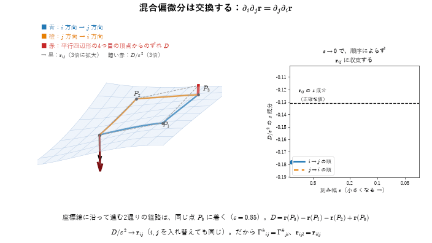

*前半：座標基底では2通りの経路が同じ点に着き、$D/\varepsilon^2\to\mathbf r_{ij}$（青と橙の曲線が重なる）。後半：単位ベクトル場の枠では、ずれ$/t^2$ が $t\to0$ でも $|[X,Y]|=1/r$ に一致して $0$ にならない。動画が示すのは $\varepsilon\to0$ での振る舞いで、証明ではない（2階微分が連続という前提は、本文のとおり必要）。*

---

<a id="p2"></a>

# Part II：計量からクリストッフェル記号の公式を導く

<!-- part-toc:start -->

**この Part の内容**

- [1. 計量の微分とクリストッフェル記号](#p2-1)
- [2. 3つの式を組み合わせて Γ だけを取り出す](#p2-2)

<!-- part-toc:end -->

<a id="p2-1"></a>

## 1. 計量の微分とクリストッフェル記号

$g_{ij}=\mathbf e_i\cdot\mathbf e_j$ を $q^k$ で微分します。積の微分：

$$
\partial_kg_{ij} = \left(\frac{\partial\mathbf e_i}{\partial q^k}\right)\cdot\mathbf e_j + \mathbf e_i\cdot\left(\frac{\partial\mathbf e_j}{\partial q^k}\right)
$$

クリストッフェル記号の定義を代入すると：

$$
\boxed{\partial_kg_{ij} = \Gamma^l{}_{ki}g_{lj} + \Gamma^l{}_{kj}g_{il}}\tag{3-1}
$$

この式は $i,j,k$ を入れ替えれば、さらに2つの式が作れます：

$$
\partial_ig_{jk} = \Gamma^l{}_{ij}g_{lk} + \Gamma^l{}_{ik}g_{jl}\tag{3-2}
$$
$$
\partial_jg_{ki} = \Gamma^l{}_{jk}g_{li} + \Gamma^l{}_{ji}g_{kl}\tag{3-3}
$$

<a id="p2-2"></a>

## 2. 3つの式を組み合わせて $\Gamma$ だけを取り出す

$(3\text{-}2)+(3\text{-}3)-(3\text{-}1)$ を計算します。右辺の項を対称性 $\Gamma^l{}_{ij}=\Gamma^l{}_{ji}$、$g_{ij}=g_{ji}$ を使って整理すると：

- $\Gamma^l{}_{ij}g_{lk}$（(3-2)より）と $\Gamma^l{}_{ji}g_{kl}$（(3-3)より）は同じものなので、足すと $2\Gamma^l{}_{ij}g_{lk}$
- $\Gamma^l{}_{ik}g_{jl}$（(3-2)より）と $-\Gamma^l{}_{ki}g_{lj}$（$-(3\text{-}1)$より）は符号違いで同じものなので、**打ち消し合ってゼロ**
- $\Gamma^l{}_{jk}g_{li}$（(3-3)より）と $-\Gamma^l{}_{kj}g_{il}$（$-(3\text{-}1)$より）も同様に**打ち消し合ってゼロ**

したがって：

$$
\partial_ig_{jk} + \partial_jg_{ki} - \partial_kg_{ij} = 2\Gamma^l{}_{ij}g_{lk}
$$

両辺に逆計量 $g^{km}$ を掛けて $k$ について和を取ると（$g^{km}g_{lk}=\delta^m_l$）：

$$
\boxed{\Gamma^k{}_{ij} = \frac12g^{kl}\left(\partial_ig_{jl} + \partial_jg_{il} - \partial_lg_{ij}\right)}
$$

これがクリストッフェル記号の標準公式です。**計量さえ分かっていれば、あとは微分するだけで完全に決まる**という点が重要です（新しい幾何学的データを追加で与える必要はありません）。

**添字の操作で特に重要な公式**（白いカード。$\delta$ が「添字のすり替え」をします）：

計量 $\times$ 逆計量 $=\delta$（和を取った $k$ が消え、残った $i,j$ が $\delta$ の添字になる）：

$$\fcolorbox{#3b6fb6}{white}{$\displaystyle\color{black}\ g^{ik}g_{kj}=\colorbox{#fff0a0}{$\displaystyle\delta^i{}_j$}\ $}$$

$\delta$ を掛けて和を取ると、添字がすり替わる（上付きの $j$ が $i$ に、下付きの $i$ が $j$ に）：

$$\fcolorbox{#3b6fb6}{white}{$\displaystyle\color{black}\ \colorbox{#fff0a0}{$\displaystyle\delta^i{}_j$}V^j=V^i\qquad\colorbox{#fff0a0}{$\displaystyle\delta^i{}_j$}V_i=V_j\ $}$$

添字の上げ下げも、計量が $\delta$ を作って添字を付け替える操作です：

$$\fcolorbox{#3b6fb6}{white}{$\displaystyle\color{black}\ g^{ij}V_j=V^i\qquad g_{ij}V^j=V_i\ $}$$

ヤコビ行列と逆行列の積も同じ仕組みです（Part III §1 で使います）：

$$\fcolorbox{#3b6fb6}{white}{$\displaystyle\color{black}\ A^k{}_aJ^a{}_i=\colorbox{#fff0a0}{$\displaystyle\delta^k{}_i$}\ $}$$

これらを図にすると、次のようになります。

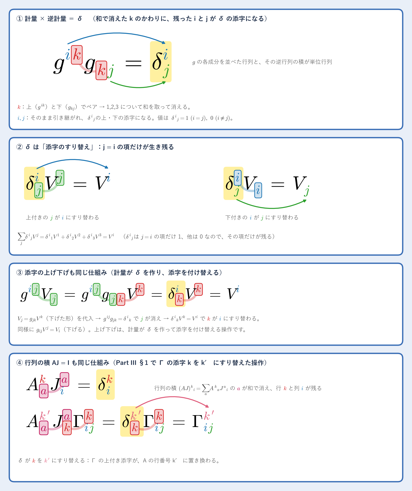

*① 計量 $\times$ 逆計量：上下でペアの $k$ は和で消え、$i,j$ が $\delta$ の添字に引き継がれる。② $\delta$ は $j=i$ の項だけを残し、添字をすり替える。③ 添字の上げ下げも、$g^{ij}g_{jk}=\delta^i{}_k$ で $j$ が消え、$k$ が $i$ にすり替わる操作。④ $AJ=I$（Part III §1）も、和を取った $a$ が消えて $\delta$ が残り、その $\delta$ が $\Gamma$ の添字 $k$ を $k'$ にすり替える。*

同じことを、具体的な数値の行列で動かすと次のようになります（ループ再生）。前半は、$g^{ik}$ の第 $i$ 行と $g_{kj}$ の第 $j$ 列を $k$ について足すと、各成分が $\delta^i{}_j$（対角は 1、それ以外は 0）になる様子です。後半は、$\delta^i{}_jV^j$ の和のうち $j=i$ の項だけが生き残って $V^i$ になる様子です。

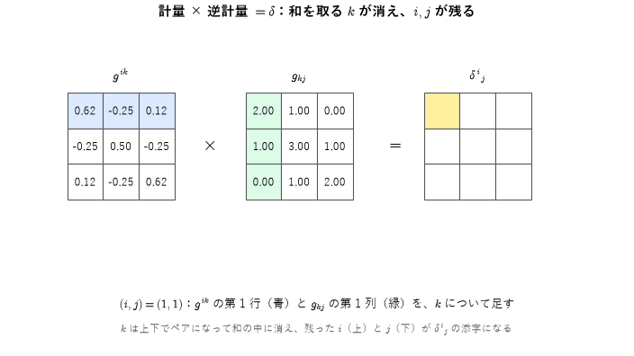

*前半：$g=\begin{pmatrix}2&1&0\\1&3&1\\0&1&2\end{pmatrix}$ とその逆行列で、$\sum_kg^{ik}g_{kj}$ を成分ごとに計算する（$k$ は和で消える）。後半：$\delta^i{}_jV^j=V^i$（$V=(5,7,9)$）。どちらも数値で検算済みで、アニメーションの式は、実際の計算結果をそのまま表示している。*

クリストッフェル記号の添字は、次のように読みます（① $\Gamma^k{}_{ij}$ の3つの席、② この節の公式の添字の行き先、③ 反変・共変微分でダミー添字 $i$ と自由添字 $k$ の入る場所が入れ替わる、Part IV §1）。

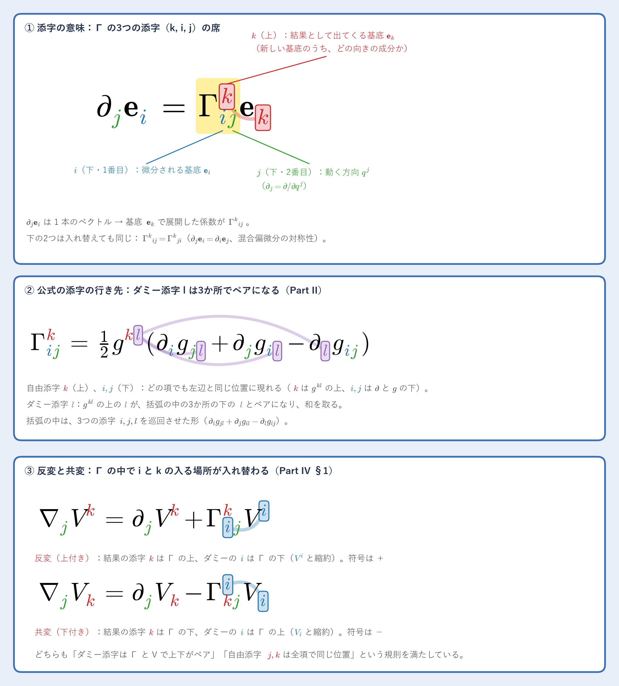

*① $\partial_j\mathbf e_i=\Gamma^k{}_{ij}\mathbf e_k$：上の $k$ は結果の基底、下の $i$ は微分される基底、下の $j$ は動く方向。② 公式の $l$ は、$g^{kl}$ の上の $l$ と括弧の中の3か所の下の $l$ がペアになって和を取る。③ 反変ベクトルでは自由添字 $k$ が $\Gamma$ の上、共変ベクトルでは下に入り、ダミー添字 $i$ は逆側に入る（符号も $+$ と $-$ で変わる）。*

---

<a id="p3"></a>

# Part III：別の定義（ヤコビアンの2階微分から）― 以前の議論との接続

<!-- part-toc:start -->

**この Part の内容**

- [1. Γ^k\_ij=A^k\_a∂\_jJ^a\_i の詳細な導出](#p3-1)
- [2. 前回の「A(∂ J)」との接続を、自分の手で再導出する](#p3-2)
- [3. 共変発散とは何か（Γ^i\_ij=∂\_jln√|g| の導出）](#p3-3)
  - [3-a. 添字の置き換えを、1ステップずつ丁寧に追う（混乱しやすいのでここだけ念入りに）](#p3-3a)
- [4. 補足：逆ヤコビ行列 A=J^-1 を成分で作る（余因子行列）](#p3-4)
  - [4-a. 記号と定義](#p3-4a)
  - [4-b. 9成分をすべて書く](#p3-4b)
  - [4-c. 取り除く行・列を色で見る](#p3-4c)
  - [4-d. なぜ J~ J=(det J)I になるのか](#p3-4d)
  - [4-e. 具体例](#p3-4e)

<!-- part-toc:end -->

実はクリストッフェル記号には、計量を経由しない、もっと直接的な定義もあります。これは以前ヤコビアン $J,A$ を使って計算していた内容と直結します。

<a id="p3-1"></a>

## 1. $\Gamma^k{}_{ij}=A^k{}_a\partial_jJ^a{}_i$ の詳細な導出

**出発点**：$\mathbf e_i=\partial\mathbf x/\partial q^i$（デカルト座標成分では$e_i^a=J^a{}_i$）なので：

$$
\frac{\partial\mathbf e_i}{\partial q^j} = \frac{\partial^2\mathbf x}{\partial q^j\partial q^i}\qquad(\text{デカルト成分では }\partial_jJ^a{}_i)
$$

これは、各$i,j$の組ごとに決まった、1つのベクトルです。

**「基底で展開する」の具体的な中身**：クリストッフェル記号の定義 $\dfrac{\partial\mathbf e_i}{\partial q^j}=\Gamma^k{}_{ij}\mathbf e_k$ を、デカルト成分で書き直すと：

$$
\partial_jJ^a{}_i = \Gamma^k{}_{ij}\,J^a{}_k\tag{$\ast$}
$$

（右辺の$\mathbf e_k$のデカルト成分は$J^a{}_k$。）これは未知数$\Gamma^k{}_{ij}$についての連立方程式です。

**$\Gamma$だけを取り出す**：$(\ast)$の両辺に$A^{k'}{}_a$（$J$の逆行列）を掛け、$a$について和を取ります：

$$
A^{k'}{}_a\,\partial_jJ^a{}_i = \Gamma^k{}_{ij}\,A^{k'}{}_aJ^a{}_k
$$

右辺の$A^{k'}{}_aJ^a{}_k=\delta^{k'}_k$（逆行列の定義）が、**$\delta$の「添字をすり替える働き」**によって、$\Gamma^k{}_{ij}$の添字$k$を$k'$に置き換えます：

$$
A^{k'}{}_a\,\partial_jJ^a{}_i = \Gamma^{k'}{}_{ij}
$$

$k'\to k$と書き直せば：

$$
\boxed{\Gamma^k{}_{ij} = A^k{}_a\,\partial_jJ^a{}_i = A^k{}_a\,\frac{\partial^2x^a}{\partial q^j\partial q^i}}
$$

**「係数を取り出す」とは、逆行列$A$を掛けて、$\delta$の性質で不要な添字を消す、という具体的な操作でした。**（$A$ を成分で具体的に作る方法は、この Part の§4 にまとめています。また、$\delta$ が添字をすり替える働きは、Part II §2 の図（$\delta$ のカードの ④）にまとめています。）

<a id="p3-2"></a>

## 2. 前回の「$A(\partial J)$」との接続を、自分の手で再導出する

**「前回の資料」について**：以前、ラプラス作用素を一般座標に書き直すノートの中で、$A=J^{-1}$（ヤコビアンの逆行列）を座標で微分すると

$$
\boxed{\partial_jA_{ik} = -A_{il}(\partial_jJ_{lm})A_{mk}}
$$

という**逆行列の微分公式**が出てきました。これ自体は、以下のように$AJ=I$を微分するだけで得られる、一般的な行列の性質です（簡単に再確認しておきます）：

$$
AJ=I \quad\Longrightarrow\quad \partial_j(AJ)=0 \quad\Longrightarrow\quad (\partial_jA)J+A(\partial_jJ)=0
$$

$$
\Longrightarrow\quad (\partial_jA)J = -A(\partial_jJ) \quad\Longrightarrow\quad \partial_jA = -A(\partial_jJ)A
$$

（最後は両辺に右から$A=J^{-1}$を掛けて、左辺の$J$を$JA=I$で消しています。）成分で書けば $\partial_jA_{ik}=-A_{il}(\partial_jJ_{lm})A_{mk}$ で、これが上の式の正体です。**この式自体は「行列の逆行列を微分するとどうなるか」という一般論**であり、クリストッフェル記号という名前も$\Gamma$という記号も、当時はまだ登場していませんでした。

**今回の目的**は、この$\partial_jA=-A(\partial_jJ)A$の中に含まれる$A(\partial_jJ)$という組み合わせが、実は$\Gamma^k{}_{ij}$そのものだったことを、今回定義した$\Gamma$を使って確認することです。$AJ=I$から出発して、もう一度$\Gamma$の記号を使って導き直します。

$AJ=I$（$A^k{}_aJ^a{}_i=\delta^k_i$）を$q^j$で微分します：

$$
(\partial_jA^k{}_a)J^a{}_i + A^k{}_a(\partial_jJ^a{}_i) = 0 \quad\Longrightarrow\quad (\partial_jA^k{}_a)J^a{}_i = -A^k{}_a(\partial_jJ^a{}_i)
$$

両辺に$A^i{}_b$を掛けて$i$について和を取り、$J^a{}_iA^i{}_b=\delta^a_b$（$i$の添字を消す）を使うと：

$$
\partial_jA^k{}_b = -A^k{}_a(\partial_jJ^a{}_i)A^i{}_b
$$

右辺の$A^k{}_a\partial_jJ^a{}_i$に、§1で導出した公式をそのまま当てはめると、これはちょうど$\Gamma^k{}_{ij}$です：

$$
\boxed{\partial_jA^k{}_b = -\Gamma^k{}_{ij}\,A^i{}_b}
$$

**天下り的な一致ではなく、$AJ=I$を微分するだけの計算から、$\Gamma^k{}_{ij}$が必然的に内側に現れることが確認できました。**

<a id="p3-3"></a>

## 3. 共変発散とは何か（$\Gamma^i{}_{ij}=\partial_j\ln\sqrt{|g|}$ の導出）

**共変微分の簡単な復習**（詳しくはこの後のPart IVで扱いますが、この節でも使うので先に一言だけ確認しておきます）：ベクトルの成分をそのまま$\partial_jV^k$と微分しても、座標変換に対して正しく振る舞う量（テンソル）にはなりません。基底ベクトル$\mathbf e_k$自身が場所によって変化する分を補正する必要があり、その補正込みの微分が**共変微分**です：

$$
\nabla_jV^k := \partial_jV^k+\Gamma^k{}_{mj}V^m
$$

（$\Gamma^k{}_{mj}V^m$の部分が、まさに「基底が変化する効果」の補正項です。詳しい導出はPart IVを参照してください。）

<a id="p3-3a"></a>

### 3-a. 添字の置き換えを、1ステップずつ丁寧に追う（混乱しやすいのでここだけ念入りに）

出発点の式の添字の役割を、まず確認します：

$$
\nabla_jV^k = \partial_jV^k+\Gamma^k{}_{mj}V^m
$$

- $j,k$：**自由な添字**（外から具体的な値を指定する）
- $m$：**ダミー添字**（$\Gamma^k{}_{mj}V^m$の中で、$m=1,2,3$について和が取られている、つまり本当は $\sum_m\Gamma^k{}_{mj}V^m$ という意味）

**ステップ1：$j=k=i$ を代入する（$j$と$k$だけを置き換え、$m$には一切触れない）**

$$
\nabla_iV^i = \partial_iV^i+\Gamma^i{}_{mi}V^m
$$

$m$は「消えた」のではなく、**この時点でもまだ、和を取られたまま残っています**。

**ステップ2：$\Gamma^i{}_{mi}$という記号をよく見る**

上付きの$i$と、下付き2番目の$i$が、**同じ文字で2回**出てきています。これも「同じ添字が式の中に2回出たら和を取る」という、これまで何度も使ってきたルールの対象です。つまり$\Gamma^i{}_{mi}$自体が、実は

$$
\Gamma^i{}_{mi} = \sum_{i=1}^3\Gamma^i{}_{mi} = \Gamma^1{}_{m1}+\Gamma^2{}_{m2}+\Gamma^3{}_{m3}
$$

という、**$i$についてすでに和が取られた量**になっています。**この時点で、式の中には「$m$についての和」と「$i$についての和（$\Gamma$の中）」という、2種類の和が入れ子で存在しています。**

**ステップ3：ダミー添字$m$を、$j$に付け替える**

$m$はダミー添字なので、以前確認した通り自由に名前を変えられます（$j$という文字は、$j=i$と置き換えた時点で「自由な添字」としての役目を終えているので、ここで改めてダミー添字の名前として再利用できます）：

$$
\Gamma^i{}_{mi}V^m \ \longrightarrow\ \Gamma^i{}_{ji}V^j
$$

**ステップ4：$\Gamma$の下2つの添字は対称（$\Gamma^k{}_{ij}=\Gamma^k{}_{ji}$）なので、順番を入れ替える**

$$
\Gamma^i{}_{ji} = \Gamma^i{}_{ij}
$$

（下付き添字の対称性は、クリストッフェル記号の定義そのものが持つ性質です。）これで最終形になります：

$$
\Gamma^i{}_{ji}V^j = \Gamma^i{}_{ij}V^j
$$

**最終的に得られる式と、そこに含まれる添字の状態**：

$$
\nabla_iV^i = \partial_iV^i+\Gamma^i{}_{ij}V^j
$$

- $i$：$\partial_iV^i$の中、および$\Gamma^i{}_{ij}$の上付き＋下付き1番目、の**2箇所**で登場 → **$i$について和**（合計3種類、$x,y,z$方向の発散を全部足し合わせる、という発散本来の役割）
- $j$：$\Gamma^i{}_{ij}$の下付き2番目と$V^j$、の**2箇所**で登場 → **$j$について和**（$\Gamma$の効果を、ベクトル$V$の各成分に対して足し合わせる、という補正項の役割）

**つまり、この式には「$i$についての和」と「$j$についての和」という、役割の異なる2つの和が独立に入れ子になって存在しています。** 最初の$j=k=i$という置き換えだけを見ると$m$が消えたように感じますが、実際には**①$m$はダミー添字として生き残ったまま$j$に改名され、②置き換えの結果$\Gamma$の中に新たに$i$についての和が追加で生まれた**、という2つの出来事が同時に起きていた、というのが正確な流れです。

これを、$j=k=i$と置いて$i$について和を取ったもの

$$
\nabla_iV^i := \partial_iV^i+\Gamma^i{}_{ij}V^j
$$

を**共変発散**と呼びます。単なる成分の微分の和$\partial_iV^i$だけでは、基底ベクトルが場所ごとに変化する効果（$\Gamma$の項）を見落とすため、これでは正しい（テンソルとして意味を持つ）発散になりません。

**$\Gamma^i{}_{ij}$を計算します。** 標準公式$\Gamma^k{}_{ij}=\frac12g^{kl}(\partial_ig_{jl}+\partial_jg_{il}-\partial_lg_{ij})$で$k=i$と置き、$i$について和を取ります：

$$
\Gamma^i{}_{ij} = \frac12g^{il}\big(\partial_ig_{jl}+\partial_jg_{il}-\partial_lg_{ij}\big)
$$

**第1項と第3項は打ち消し合います**：第3項$g^{il}\partial_lg_{ij}$は、ダミー添字$i,l$を入れ替え、$g$の対称性（$g_{ij}=g_{ji}$）を使うと $g^{li}\partial_ig_{lj}=g^{il}\partial_ig_{jl}$ となり、第1項と一致するからです。したがって：

$$
\Gamma^i{}_{ij} = \frac12g^{il}\partial_jg_{il}\tag{†}
$$

**ここでJacobiの公式を使います。** 以前のラプラシアンのノートで導出した公式で、正則行列$M(q)$に対して次が成り立つ、というものでした：

$$
\boxed{\partial_j\ln|\det M| = \operatorname{tr}(M^{-1}\partial_jM)}
$$

**簡単に導出を振り返ります**：$M+dM=M(I+M^{-1}dM)$なので、行列式を取ると $\det(M+dM)=\det M\cdot\det(I+M^{-1}dM)$。微小な行列$\varepsilon X$に対して一般に$\det(I+\varepsilon X)\approx1+\varepsilon\operatorname{tr}X$（固有値の積を展開すればこの近似が出ます）が成り立つので、$\det(M+dM)\approx\det M\big(1+\operatorname{tr}(M^{-1}dM)\big)$。両辺から$\det M$を引いて$\det M$で割ると $d(\det M)/\det M=\operatorname{tr}(M^{-1}dM)$。

$d(\det M)$と$\det(dM)$は異なる量である。$f(M):=\det M$と、$\det$を1つの関数の名前と見なす：

$$
d(\det M) = df(M) = f(M+dM)-f(M) = \det(M+dM)-\det M\qquad(\text{1次近似の範囲で})
$$

**これは、以前から知っている「関数の微分（全微分）」の定義そのもの**です。$f(x)=x^2$なら$df=f(x+dx)-f(x)=2x\,dx$となるのと、まったく同じ発想を、$f=\det$、変数が「行列$M$」という対象に当てはめただけでした。つまり$d(\det M)$は「$M$を$dM$だけ動かしたときの、$\det$の出力の変化分」を表す、ごく普通の微分です。

**一方、$\det(dM)$**は、$dM$という行列**そのもの**を、そのまま行列式の公式に代入して計算した、**まったく別の計算**です（$f(x)=x^2$のときの$f(dx)=(dx)^2$に対応する量で、$df=f(x+dx)-f(x)$とは最初から問うている問題が違います）：

$$
\det(dM) = \det\begin{pmatrix}dM_{11}&dM_{12}\\dM_{21}&dM_{22}\end{pmatrix}
$$

（$2\times2$の例。）この式は「$M+dM$の行列式から$\det M$を引く」という操作を一切経ていません。

**なぜこの2つが一致しないのか（多重線形性）**：行列式$\det M$は、$M$の**各行（各列）ごとには線形**ですが、行列$M$**全体**に対しては線形ではありません（多重線形、というのはこの意味です）。$\det M$は、$M$の各行を引数とする**多変数の関数**だと思えば、$df=f(M+dM)-f(M)$を計算する際には、**各引数（各行）ごとに、1つずつ微小変化させた項を足し合わせる**必要があるのは自然なことです。これは、多変数の積を微分するときに積の微分公式（$d(uv)=du\cdot v+u\cdot dv$）を使うのと同じ状況です：

$$
d(\det M) = \sum_{i=1}^n\det(\mathbf r_1,\dots,\mathbf r_{i-1},\,d\mathbf r_i,\,\mathbf r_{i+1},\dots,\mathbf r_n)
$$

（$\mathbf r_i$は$M$の$i$行目、$d\mathbf r_i$はその行だけを微小変化させたもの。「1行だけ微分し、残りはそのまま」という行列式を、行の数だけ作って足す、というのが正しい計算です。）**この計算を最後まで実行した結果が、たまたま$\operatorname{tr}(M^{-1}dM)$という、$dM$を外に出せる形にまとまる**のであって、「$d$が最初から$\det$の外にいて、中身をそのまま$dM$に置き換えられる」わけではありません。

**1変数の場合で確認すると、この区別がはっきりします**：$f(x)=x^2$ を考えると、$d(x^2)=(x+dx)^2-x^2=2x\,dx$（1次近似）です。一方、$(dx)^2$は$dx$という数を2乗しただけの、まったく別の量（しかも2次の微小量で、通常の微分の議論では無視される桁）です：

$$
\boxed{d(x^2) = 2x\,dx \quad\ne\quad (dx)^2}
$$

「$d(x^2)$の中の$x^2$の位置に、そのまま$dx$を代入したら$(dx)^2$になる」わけではなく、**$d(x^2)=2x\,dx$は「$f'(x)\,dx$」という、微分係数$2x$が掛かった上での結果**です。今回の$d(\det M)=\det M\cdot\operatorname{tr}(M^{-1}dM)$も、これとまったく同じ構造の関係で、$\det(dM)$（$M$の位置に直接$dM$を放り込んだもの）とは根本的に違う量です。

**なぜ「$d(\det M)/\det M$」が「$\ln|\det M|$の微分」と同じ意味になるのか（連鎖律の確認）**：高校数学の公式 $\dfrac{d}{dx}\ln|x|=\dfrac1x$ を思い出します。ここで$u:=\det M$と置くと、$\ln|\det M(q)|=\ln|u|$は「$u$の関数」に「$u=\det M(q)$という$q$の関数」を代入した**合成関数**です。連鎖律を使うと：

$$
\frac{d}{dq^j}\ln|u| = \frac{d\ln|u|}{du}\cdot\frac{du}{dq^j} = \frac1u\cdot\frac{du}{dq^j} = \frac1{\det M}\cdot\frac{\partial_j(\det M)}{1}
$$

つまり $\partial_j\ln|\det M|=\dfrac{\partial_j(\det M)}{\det M}$ です。**「$1/x$の形をした式は、$\ln|x|$を微分した跡である」という、通常の1変数微積分の関係を、$x$の代わりに「座標$q^j$に依存する量$\det M$」に当てはめただけ**、というのがこの一致の正体です。したがって $d(\det M)/\det M=\operatorname{tr}(M^{-1}dM)$ は、$d(\ln|\det M|)=\operatorname{tr}(M^{-1}dM)$と同じ意味です。

（**注**：ここでの$d$は、微分形式の外微分とは別の、素朴な「微小変化・微分」という意味で使っています。）

**なぜ(†)にこの公式が使えるのか**：$(†)$の$g^{il}\partial_jg_{il}$は、$i,l$の両方について和を取っている量です。これは行列の積$g^{-1}(\partial_jg)$の**トレース**（対角成分の和）そのものです：

$$
\operatorname{tr}\big(g^{-1}\partial_jg\big) = \sum_i\big(g^{-1}\partial_jg\big)_{ii} = \sum_{i,l}g^{il}(\partial_jg)_{li} = g^{il}\partial_jg_{il}
$$

（行列の積$(g^{-1}\partial_jg)_{ii}=\sum_lg^{il}(\partial_jg)_{li}$を$i$について足したものが、まさにトレースの定義です。）つまり**$(†)$の右辺は、もともとトレースの形をしていた**わけです（$\ln$はまだ出てきていません）。ここにJacobiの公式（$M=g$を代入）を適用すると：

$$
g^{il}\partial_jg_{il} = \operatorname{tr}(g^{-1}\partial_jg) = \partial_j\ln|\det g|
$$

**ここで初めて$\ln$が登場します**（Jacobiの公式自体が「トレース＝$\ln|\det|$の微分」という中身を持つ公式だからです）。

**記号「$|g|$」の正確な意味（脇道）**：$|g|:=|\det g|$は、**外側が絶対値、内側が$\det g$（サラスの公式などで計算する、符号付きの行列式）という、2段構えの記号**です。$\det$は消えているわけではなく、$|g|$という表記の中にずっと含まれています。**なぜ絶対値が必要か**：$\det g$自体は符号を持ちうる数です（普段扱う正定値の計量、例えば球座標の$g_{ij}$では常に正になりますが、一般相対論のミンコフスキー計量$\eta=\operatorname{diag}(-1,1,1,1)$のような不定値計量では$\det\eta=-1$と負になります）。体積要素$\sqrt{|g|}$は本来「空間の伸縮率」という、符号を持たない正の量であるべきなので、$\sqrt{\det g}$が負の数の平方根にならないよう、あらかじめ絶対値を取って符号を無視しています。

これを踏まえて、$\ln|\det g|=2\ln\sqrt{|g|}$（$\ln x^2=2\ln x$と同じ、指数法則）なので：

$$
\boxed{\Gamma^i{}_{ij} = \frac12g^{il}\partial_jg_{il} = \frac12\partial_j\ln|\det g| = \partial_j\ln\sqrt{|g|}}
$$

**共変発散が、以前の$\operatorname{div}$の一般公式と一致することの確認**：

$$
\nabla_iV^i = \partial_iV^i+\Gamma^i{}_{ij}V^j = \partial_iV^i+(\partial_j\ln\sqrt{|g|})V^j
$$

一方、以前の$\dfrac1{\sqrt{|g|}}\partial_i(\sqrt{|g|}V^i)$を積の微分で展開すると：

$$
\frac1{\sqrt{|g|}}\partial_i\big(\sqrt{|g|}V^i\big) = (\partial_i\ln\sqrt{|g|})V^i+\partial_iV^i
$$

**両者は（ダミー添字$i,j$の違いを除いて）完全に一致します**：

$$
\boxed{\frac1{\sqrt{|g|}}\partial_i\big(\sqrt{|g|}V^i\big) = \partial_iV^i+\Gamma^i{}_{ij}V^j}
$$

以前扱った「体積要素の発散」の話は、この**共変発散**の特別な場合だったことが、こうして正確に確認できました。

<a id="p3-4"></a>

## 4. 補足：逆ヤコビ行列 $A=J^{-1}$ を成分で作る（余因子行列）

この Part では、$A=J^{-1}$（$AJ=I$）を「$J$ の逆行列」として使ってきました。ここでは、$3\times3$ の場合に $A$ の各成分が $J$ の成分からどう作られるのかを、**余因子行列**を使って系統的にまとめます。

<a id="p3-4a"></a>

### 4-a. 記号と定義

成分を具体的に書くときは、$J^a{}_i$ の $a$（デカルト成分）を**行番号**、$i$（曲線座標）を**列番号**として $J_{ai}$ と書きます。$A^i{}_a$ は $i$ を行番号、$a$ を列番号として $A_{ia}$ と書きます（$A$ は逆行列なので、行と列の役割が $J$ と入れ替わります）：

$$
J=\begin{pmatrix}J_{11}&J_{12}&J_{13}\\J_{21}&J_{22}&J_{23}\\J_{31}&J_{32}&J_{33}\end{pmatrix}\qquad(\text{行}=\text{デカルト成分 }a,\ \ \text{列}=\text{曲線座標 }i)
$$

$J$ の**列**は基底ベクトル $\mathbf e_i$ のデカルト成分、逆行列 $A$ の**行**は $\nabla q^i$（座標関数の勾配）のデカルト成分です（$A^i{}_a=\partial q^i/\partial x^a$、つまり $AJ=I$ は「$\nabla q^i\cdot\mathbf e_j=\delta^i_j$」を表しています）。

**① 小行列式**：$J$ から $i$ 行と $j$ 列を取り除いた $2\times2$ 行列の行列式を $\Delta_{ij}$ と書きます。例えば：

$$
\Delta_{21}=\begin{vmatrix}J_{12}&J_{13}\\J_{32}&J_{33}\end{vmatrix}=J_{12}J_{33}-J_{13}J_{32}\qquad(2\text{行と }1\text{列を取り除いた})
$$

**② 余因子**：$(-1)^{i+j}\Delta_{ij}$ です。符号 $(-1)^{i+j}$ は市松模様になります：

$$
\big((-1)^{i+j}\big)=\begin{pmatrix}+&-&+\\-&+&-\\+&-&+\end{pmatrix}
$$

**③ 余因子行列 $\tilde J$**（**転置に注意**）：

$$
\boxed{\tilde J_{ij}:=(-1)^{i+j}\,\Delta_{ji}}
$$

$\Delta$ の添字が $ji$ と**逆**になっています。つまり「$\tilde J$ の $(i,j)$ 成分を作るには、$J$ の **$j$ 行 $i$ 列**を取り除く」ということです。（教科書によっては、余因子 $(-1)^{i+j}\Delta_{ij}$ をそのまま並べた行列を余因子行列と呼び、その転置を随伴行列と呼びます。ここでは、$J\tilde J=(\det J)\,I$ が素直に書けるよう、転置済みの方を $\tilde J$ と書きます。）

**④ 逆行列**：

$$
\boxed{A=J^{-1}=\frac1{\det J}\,\tilde J,\qquad A_{ij}=\frac{\tilde J_{ij}}{\det J}=\frac{(-1)^{i+j}\,\Delta_{ji}}{\det J}}
$$

添字をこの Part の記法に戻すと、次のようになります：

$$
A^i{}_a=\frac{(-1)^{i+a}\,\Delta_{ai}}{\det J}\qquad(\Delta_{ai}：J\text{ のデカルト成分 }a\text{ の行と、曲線座標 }i\text{ の列を取り除いた小行列式})
$$

<a id="p3-4b"></a>

### 4-b. 9成分をすべて書く

$\tilde J_{ij}$ ごとに、「どの行・列を取り除くか」「符号」「残った $2\times2$ の（主対角の積）$-$（反対角の積）」をまとめます：

| $\tilde J_{ij}$ | 取り除く（$j$ 行 $i$ 列） | 符号 | 残った $2\times2$ の主対角の積 $-$ 反対角の積 |
|---|---|---|---|
| $\tilde J_{11}$ | 1行1列 | $+$ | $J_{22}J_{33}-J_{23}J_{32}$ |
| $\tilde J_{12}$ | 2行1列 | $-$ | $J_{12}J_{33}-J_{13}J_{32}$ |
| $\tilde J_{13}$ | 3行1列 | $+$ | $J_{12}J_{23}-J_{13}J_{22}$ |
| $\tilde J_{21}$ | 1行2列 | $-$ | $J_{21}J_{33}-J_{23}J_{31}$ |
| $\tilde J_{22}$ | 2行2列 | $+$ | $J_{11}J_{33}-J_{13}J_{31}$ |
| $\tilde J_{23}$ | 3行2列 | $-$ | $J_{11}J_{23}-J_{13}J_{21}$ |
| $\tilde J_{31}$ | 1行3列 | $+$ | $J_{21}J_{32}-J_{22}J_{31}$ |
| $\tilde J_{32}$ | 2行3列 | $-$ | $J_{11}J_{32}-J_{12}J_{31}$ |
| $\tilde J_{33}$ | 3行3列 | $+$ | $J_{11}J_{22}-J_{12}J_{21}$ |

行列の形に並べると：

$$
\tilde J=\begin{pmatrix}
J_{22}J_{33}-J_{23}J_{32} & -(J_{12}J_{33}-J_{13}J_{32}) & J_{12}J_{23}-J_{13}J_{22}\\
-(J_{21}J_{33}-J_{23}J_{31}) & J_{11}J_{33}-J_{13}J_{31} & -(J_{11}J_{23}-J_{13}J_{21})\\
J_{21}J_{32}-J_{22}J_{31} & -(J_{11}J_{32}-J_{12}J_{31}) & J_{11}J_{22}-J_{12}J_{21}
\end{pmatrix}
$$

**覚え方**：

1. $\tilde J_{ij}$ を作るときは、$J$ の **$j$ 行 $i$ 列**を消す（$i,j$ が逆）。対角成分 $\tilde J_{ii}$ だけは $i$ 行 $i$ 列を消すので、逆になっていることが見えません。
2. 残った $2\times2$ を「左上 $\times$ 右下 $-$ 右上 $\times$ 左下」で計算する（行・列の順序は元のまま）。
3. 符号は市松模様（$(i,j)$ 成分の符号は $(-1)^{i+j}$）。

$\det J$ は、$J$ の第1行に沿った展開（余因子展開）です。$\tilde J_{j1}$ は $J_{1j}$ の余因子なので：

$$
\det J=J_{11}\tilde J_{11}+J_{12}\tilde J_{21}+J_{13}\tilde J_{31}
$$

<a id="p3-4c"></a>

### 4-c. 取り除く行・列を色で見る

灰色が取り除く行と列、赤が残った $2\times2$ です。**$\tilde J_{12}$ と $\tilde J_{21}$ で、取り除く行・列が入れ替わっている**ことに注目してください。

**$\tilde J_{11}$**（1行1列を取り除く）：

$$
\left(\begin{array}{ccc}
\color{gray}J_{11}&\color{gray}J_{12}&\color{gray}J_{13}\\
\color{gray}J_{21}&\color{red}J_{22}&\color{red}J_{23}\\
\color{gray}J_{31}&\color{red}J_{32}&\color{red}J_{33}
\end{array}\right)
\ \Longrightarrow\ 
\tilde J_{11}=(+1)\begin{vmatrix}\color{red}J_{22}&\color{red}J_{23}\\\color{red}J_{32}&\color{red}J_{33}\end{vmatrix}
=J_{22}J_{33}-J_{23}J_{32}
$$

**$\tilde J_{12}$**（**2行1列**を取り除く）：

$$
\left(\begin{array}{ccc}
\color{gray}J_{11}&\color{red}J_{12}&\color{red}J_{13}\\
\color{gray}J_{21}&\color{gray}J_{22}&\color{gray}J_{23}\\
\color{gray}J_{31}&\color{red}J_{32}&\color{red}J_{33}
\end{array}\right)
\ \Longrightarrow\ 
\tilde J_{12}=(-1)\begin{vmatrix}\color{red}J_{12}&\color{red}J_{13}\\\color{red}J_{32}&\color{red}J_{33}\end{vmatrix}
=-(J_{12}J_{33}-J_{13}J_{32})
$$

**$\tilde J_{21}$**（**1行2列**を取り除く）：

$$
\left(\begin{array}{ccc}
\color{gray}J_{11}&\color{gray}J_{12}&\color{gray}J_{13}\\
\color{red}J_{21}&\color{gray}J_{22}&\color{red}J_{23}\\
\color{red}J_{31}&\color{gray}J_{32}&\color{red}J_{33}
\end{array}\right)
\ \Longrightarrow\ 
\tilde J_{21}=(-1)\begin{vmatrix}\color{red}J_{21}&\color{red}J_{23}\\\color{red}J_{31}&\color{red}J_{33}\end{vmatrix}
=-(J_{21}J_{33}-J_{23}J_{31})
$$

**$\tilde J_{22}$**（2行2列を取り除く）：

$$
\left(\begin{array}{ccc}
\color{red}J_{11}&\color{gray}J_{12}&\color{red}J_{13}\\
\color{gray}J_{21}&\color{gray}J_{22}&\color{gray}J_{23}\\
\color{red}J_{31}&\color{gray}J_{32}&\color{red}J_{33}
\end{array}\right)
\ \Longrightarrow\ 
\tilde J_{22}=(+1)\begin{vmatrix}\color{red}J_{11}&\color{red}J_{13}\\\color{red}J_{31}&\color{red}J_{33}\end{vmatrix}
=J_{11}J_{33}-J_{13}J_{31}
$$

9成分すべてを、$\tilde J$ の並びのまま図にすると次のようになります。

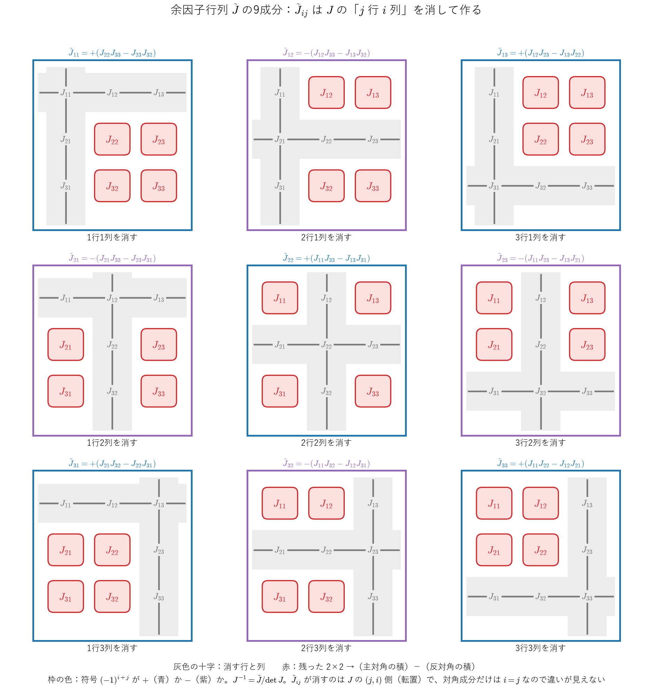

*$\tilde J$ の $(i,j)$ の位置に $\tilde J_{ij}$ を作る様子。灰色の十字が消す行と列（$J$ の $j$ 行 $i$ 列）、赤が残った $2\times2$。枠の色は符号 $(-1)^{i+j}$（青が $+$、紫が $-$）で、市松模様になっている。$\tilde J_{ij}$ が消すのは $J$ の $(j,i)$ 側（転置）だが、対角成分は $i=j$ なので違いが見えない。*

<a id="p3-4d"></a>

### 4-d. なぜ $J\tilde J=(\det J)\,I$ になるのか

$\tilde J_{jk}=(-1)^{j+k}\Delta_{kj}$ なので、積の $(i,k)$ 成分は：

$$
(J\tilde J)_{ik}=\sum_{j=1}^3J_{ij}\,\tilde J_{jk}=\sum_{j=1}^3(-1)^{k+j}\,J_{ij}\,\Delta_{kj}
$$

$\Delta_{kj}$ は「$k$ 行を取り除いた」小行列式なので、$J$ の第 $k$ 行の中身には依りません。したがって、この和は「**$J$ の第 $k$ 行を第 $i$ 行で置き換えた行列**」の、第 $k$ 行に沿った余因子展開そのものです：

- **$i=k$ のとき**：置き換えても $J$ のままなので、和は $\det J$ になります。
- **$i\ne k$ のとき**：置き換えた行列は同じ行を2本持つので、行列式は $0$ になります。

$$
(J\tilde J)_{ik}=(\det J)\,\delta_{ik}\qquad\Longrightarrow\qquad J\tilde J=(\det J)\,I\qquad\Longrightarrow\qquad J^{-1}=\frac{\tilde J}{\det J}\quad(\det J\ne0)
$$

**具体的に確かめる**（$3\times3$）。$(i,k)=(1,1)$ は第1行の展開そのものです：

$$
J_{11}\tilde J_{11}+J_{12}\tilde J_{21}+J_{13}\tilde J_{31}
=J_{11}(J_{22}J_{33}-J_{23}J_{32})-J_{12}(J_{21}J_{33}-J_{23}J_{31})+J_{13}(J_{21}J_{32}-J_{22}J_{31})=\det J
$$

$(i,k)=(2,1)$ は、第1行の $J_{1j}$ の代わりに第2行の $J_{2j}$ を入れたもので、項がすべて打ち消し合います：

$$
\begin{aligned}
J_{21}\tilde J_{11}+J_{22}\tilde J_{21}+J_{23}\tilde J_{31}
&=J_{21}(J_{22}J_{33}-J_{23}J_{32})-J_{22}(J_{21}J_{33}-J_{23}J_{31})+J_{23}(J_{21}J_{32}-J_{22}J_{31})\\
&=J_{21}J_{22}J_{33}-J_{21}J_{23}J_{32}-J_{22}J_{21}J_{33}+J_{22}J_{23}J_{31}+J_{23}J_{21}J_{32}-J_{23}J_{22}J_{31}=0
\end{aligned}
$$

この議論は $n\times n$ でもそのまま成り立ちます（小行列式が $(n-1)\times(n-1)$ になるだけです）。

<a id="p3-4e"></a>

### 4-e. 具体例

**(a) 2次元の極座標**（$x=r\cos\theta,\ y=r\sin\theta$、$q^1=r,\ q^2=\theta$）。$2\times2$ では、取り除いて残るのは1成分だけなので $\tilde J=\begin{pmatrix}J_{22}&-J_{12}\\-J_{21}&J_{11}\end{pmatrix}$ です：

$$
J=\begin{pmatrix}\cos\theta&-r\sin\theta\\\sin\theta&r\cos\theta\end{pmatrix},\quad
\det J=r,\quad
\tilde J=\begin{pmatrix}r\cos\theta&r\sin\theta\\-\sin\theta&\cos\theta\end{pmatrix}
$$

$$
A=\frac{\tilde J}{\det J}=\begin{pmatrix}\cos\theta&\sin\theta\\-\dfrac{\sin\theta}r&\dfrac{\cos\theta}r\end{pmatrix}
$$

Part IV §2 の例③で $r=\sqrt{x^2+y^2},\ \theta=\arctan(y/x)$ を直接微分して求めた $A^r{}_x,A^r{}_y,A^\theta{}_x,A^\theta{}_y$ と一致します。

**(b) 3次元の球座標**（$x=r\sin\theta\cos\phi,\ y=r\sin\theta\sin\phi,\ z=r\cos\theta$、$q^1=r,\ q^2=\theta,\ q^3=\phi$）：

$$
J=\begin{pmatrix}
\sin\theta\cos\phi & r\cos\theta\cos\phi & -r\sin\theta\sin\phi\\
\sin\theta\sin\phi & r\cos\theta\sin\phi & r\sin\theta\cos\phi\\
\cos\theta & -r\sin\theta & 0
\end{pmatrix},\qquad \det J=r^2\sin\theta
$$

第1列の余因子 $\tilde J_{11},\tilde J_{21},\tilde J_{31}$ を、上の表の通りに計算します：

$$
\begin{aligned}
\tilde J_{11}&=J_{22}J_{33}-J_{23}J_{32}=(r\cos\theta\sin\phi)(0)-(r\sin\theta\cos\phi)(-r\sin\theta)=r^2\sin^2\theta\cos\phi\\
\tilde J_{21}&=-(J_{21}J_{33}-J_{23}J_{31})=-\big(0-(r\sin\theta\cos\phi)\cos\theta\big)=r\sin\theta\cos\theta\cos\phi\\
\tilde J_{31}&=J_{21}J_{32}-J_{22}J_{31}=(\sin\theta\sin\phi)(-r\sin\theta)-(r\cos\theta\sin\phi)\cos\theta=-r\sin\phi
\end{aligned}
$$

$\det J=r^2\sin\theta$ で割ると、$A$ の第1列（$x$ で偏微分したもの）が得られます：

$$
A_{11}=\frac{\tilde J_{11}}{\det J}=\sin\theta\cos\phi,\qquad
A_{21}=\frac{\cos\theta\cos\phi}r,\qquad
A_{31}=-\frac{\sin\phi}{r\sin\theta}
$$

これは $A^r{}_x=\partial r/\partial x=x/r=\sin\theta\cos\phi$ や $A^\phi{}_x=\partial\phi/\partial x=-y/(x^2+y^2)=-\sin\phi/(r\sin\theta)$ と一致します。残りの列も同様で、全成分は次のようになります：

$$
A=\begin{pmatrix}
\sin\theta\cos\phi & \sin\theta\sin\phi & \cos\theta\\[2pt]
\dfrac{\cos\theta\cos\phi}r & \dfrac{\cos\theta\sin\phi}r & -\dfrac{\sin\theta}r\\[6pt]
-\dfrac{\sin\phi}{r\sin\theta} & \dfrac{\cos\phi}{r\sin\theta} & 0
\end{pmatrix}
$$

$A$ の第3行は $\sin\theta=0$（北極・南極）で発散します。これは、極で $\phi$ が定まらない座標特異点（$\det J=r^2\sin\theta=0$）に対応しています。また、$g_{ij}=J^a{}_iJ^a{}_j$ から $\det g=(\det J)^2$ なので、$\sqrt{|g|}=|\det J|=r^2\sin\theta$ です（この Part の§3 で出てきた $\sqrt{|g|}$ は、$J$ の行列式の絶対値に等しいということです）。

---

<a id="p4"></a>

# Part IV：共変微分

<!-- part-toc:start -->

**この Part の内容**

- [1. ベクトル成分の「正しい微分」](#p4-1)
- [2. なぜΓ^k\_ijV^iの中でi≠jなのか（表記上の理由と、意味上の理由）](#p4-2)
- [3. 微分のいろいろ：どれが「座標に依らない」のか](#p4-3)
- [4. なぜ外微分dにはΓの補正が要らないのか（rotとdivの非対称性の正体）](#p4-4)

<!-- part-toc:end -->

<a id="p4-1"></a>

## 1. ベクトル成分の「正しい微分」

Part Iの計算に戻ります。$V=V^i\mathbf e_i$ を微分すると、積の微分で2項に分かれます：

$$
\frac{\partial V}{\partial q^j} = \frac{\partial V^i}{\partial q^j}\mathbf e_i + V^i\frac{\partial\mathbf e_i}{\partial q^j}
$$

**第1項**：$V^i$を微分しただけなので、基底$\mathbf e_i$はそのまま残ります。

**第2項**：クリストッフェル記号の定義 $\dfrac{\partial\mathbf e_i}{\partial q^j}=\Gamma^k{}_{ij}\mathbf e_k$ を代入します：

$$
V^i\frac{\partial\mathbf e_i}{\partial q^j} = V^i\Gamma^k{}_{ij}\,\mathbf e_k
$$

**ここで、$i$は$V^i$の添字と$\Gamma^k{}_{ij}$の下付き1番目の添字を兼ねて2回登場しているので、これは既に$i$について和が取られたダミー添字です。** 一方、残る基底は$\mathbf e_k$（$\mathbf e_i$ではない）です。これは、$\mathbf e_i$自体を微分した結果が、クリストッフェル記号の定義によって新しい基底$\mathbf e_k$の言葉で書き直されるためです。

**2つの項は基底が異なる文字（$\mathbf e_i$と$\mathbf e_k$）のままでは足し算できません。** そこで、第1項のダミー添字$i$を、以前確認した「ダミー添字は自由に名前を変えてよい」というルールに従って$k$に付け替えます（$i=k$と置いたわけではなく、単なる文字の言い換えです）：

$$
\frac{\partial V^i}{\partial q^j}\mathbf e_i \ \longrightarrow\ \frac{\partial V^k}{\partial q^j}\mathbf e_k
$$

これで両方の項が$\mathbf e_k$でまとまり、次の式が得られます：

$$
\frac{\partial V}{\partial q^j} = \frac{\partial V^k}{\partial q^j}\mathbf e_k + V^i\Gamma^k{}_{ij}\mathbf e_k = \left(\frac{\partial V^k}{\partial q^j}+\Gamma^k{}_{ij}V^i\right)\mathbf e_k
$$

**まとめると**：$\delta$がかかったわけでも$i=k$と置いたわけでもなく、①第1項は表記の都合で$i\to k$に付け替え、②第2項はもともと$i$が和を取られるダミー添字だった、という2つの別々の理由が、たまたま同じ結果（両方とも$\mathbf e_k$でまとまる）を生んでいます。

括弧の中身が、微分してもきちんと「反変ベクトルとして変換する」量になります。これを**共変微分**と呼びます：

$$
\boxed{\nabla_jV^k := \partial_jV^k + \Gamma^k{}_{ij}V^i}
$$

**なぜ普通の偏微分 $\partial_jV^k$ ではダメなのか**：$\partial_jV^k$ は基底ベクトルが変化する効果を無視しているので、座標変換に対して正しく振る舞いません（テンソルになりません）。$\Gamma^k{}_{ij}V^i$ の項が、その「基底が変化する分」をちょうど補正しています。

<a id="p4-2"></a>

## 2. なぜ$\Gamma^k{}_{ij}V^i$の中で$i\ne j$なのか（表記上の理由と、意味上の理由）

$\Gamma^k{}_{ij}V^i$の中で$i$（和を取る添字）と$j$（微分の方向）が異なる文字を使っているのは、**単なる表記の都合だけではなく、実際に異なる役割を担っているから**です。

**① 表記上の理由（競合を避ける）**：もし$i,j$を同じ文字にすると、$\Gamma^k{}_{jj}V^j$のような形になり、「$j$について和を取る」のか「特定の1方向$j$」なのかが記号の上で区別できなくなります。$i\ne j$という書き分けは、まず「和を取る添字と、固定された添字がぶつからないようにする」という、記号運用上の必要から来ています。

**② 意味上の理由（役割が異なる）**：$\Gamma^k{}_{ij}=$「$\dfrac{\partial\mathbf e_i}{\partial q^j}$の係数」でした。ここで：

- **$j$**：「$q^j$方向に動きながら見る」という、**観測する側の方向**。共変微分$\nabla_j$全体を指定する、式全体を通して固定された添字（自由添字）
- **$i$**：「動いた結果、$V$の各成分（$V^1,V^2,\dots$）のうち、どの向きの基底ベクトルが、どれだけ新しい基底に混ざり込んでくるか」という、**寄与をすべて足し合わせる添字**（ダミー添字）

**つまり$\Gamma^k{}_{ij}V^i$の和は、「$q^j$方向に動くと、元の$V$のすべての成分が、それぞれ$\Gamma^k{}_{1j},\Gamma^k{}_{2j},\dots$という重みで新しい第$k$成分に"漏れ込んでくる"、その全部を足し合わせる」という意味です**。$j$は「動く方向」という1つの決まった方向、$i$は「$V$のどの成分由来の寄与か」という走る添字——この2つは最初から性質が違うので、同じ文字にできないのは自然なことです。

**③ 極座標の具体例で確認する**：$q^1=r,\ q^2=\theta$として、まずヤコビアンから$\Gamma^r{}_{\theta\theta}$と$\Gamma^\theta{}_{r\theta}$を計算し、それを使って$\nabla_\theta V^r$を求めます。

**準備：ヤコビアン$J$と逆ヤコビアン$A$を求める**。デカルト座標を$x=r\cos\theta,\ y=r\sin\theta$（$a=x,y$）とすると：

$$
J^x{}_r=\cos\theta,\ J^y{}_r=\sin\theta,\qquad J^x{}_\theta=-r\sin\theta,\ J^y{}_\theta=r\cos\theta
$$

逆ヤコビアン$A^i{}_a$は、$r=\sqrt{x^2+y^2}$、$\theta=\arctan(y/x)$を直接微分して求めます：

$$
A^r{}_x=\frac xr=\cos\theta,\ A^r{}_y=\frac yr=\sin\theta,\qquad A^\theta{}_x=-\frac{\sin\theta}r,\ A^\theta{}_y=\frac{\cos\theta}r
$$

（Part III §4 の余因子行列を使っても同じ$A$が得られます。）

**Part III §1で導出した$\Gamma^k{}_{ij}=A^k{}_a\partial_jJ^a{}_i$を使って、$\Gamma^r{}_{\theta\theta}$と$\Gamma^\theta{}_{r\theta}$を計算します。**

**$\Gamma^r{}_{\theta\theta}$**（$k=r,\ i=j=\theta$）：$\partial_\theta J^x{}_\theta=-r\cos\theta$、$\partial_\theta J^y{}_\theta=-r\sin\theta$ なので：

$$
\Gamma^r{}_{\theta\theta}=A^r{}_x\partial_\theta J^x{}_\theta+A^r{}_y\partial_\theta J^y{}_\theta = \cos\theta(-r\cos\theta)+\sin\theta(-r\sin\theta) = -r(\cos^2\theta+\sin^2\theta) = -r
$$

**$\Gamma^\theta{}_{r\theta}$**（$k=\theta,\ i=r,\ j=\theta$）：$\partial_\theta J^x{}_r=-\sin\theta$、$\partial_\theta J^y{}_r=\cos\theta$ なので：

$$
\Gamma^\theta{}_{r\theta}=A^\theta{}_x\partial_\theta J^x{}_r+A^\theta{}_y\partial_\theta J^y{}_r = \left(-\frac{\sin\theta}r\right)(-\sin\theta)+\frac{\cos\theta}r\cos\theta = \frac{\sin^2\theta+\cos^2\theta}r = \frac1r
$$

（他の成分はゼロです。これらの値は、後のPart VI §1,2で基底ベクトルや計量公式から改めて確認するのと、同じ結果になります。）

**この2つを使って、$j=\theta$方向の共変微分$\nabla_\theta V^r$を計算します**：

$$
\nabla_\theta V^r = \partial_\theta V^r+\Gamma^r{}_{i\theta}V^i = \partial_\theta V^r+\Gamma^r{}_{r\theta}V^r+\Gamma^r{}_{\theta\theta}V^\theta
$$

$\Gamma^r{}_{r\theta}=0$なので：

$$
\boxed{\nabla_\theta V^r = \partial_\theta V^r-rV^\theta}
$$

**この$\Gamma^r{}_{\theta\theta}V^\theta=-rV^\theta$という項が意味しているのは、「$V$の$\theta$成分（角度方向の成分）が、$\theta$方向に動くことで、基底ベクトル$\mathbf e_\theta$自体が回転し、$r$方向の成分に化けて見えてしまう分」**です（$\mathbf e_\theta$は$\theta$が変わると向きを変えるベクトルなので）。**この「化けて見える」効果を追うために、$j$（動く方向）とは別に、$i$（元のどの成分由来か）を走らせる必要があった、というのが$i\ne j$の物理的な理由です。**「$-rV^\theta$がヤコビアンに似ている」のは偶然ではなく、この$\Gamma^r{}_{\theta\theta}=-r$自体が、$\Gamma^k{}_{ij}=A^k{}_a\partial_jJ^a{}_i$というヤコビアンの2階微分から、上ですでに計算した通りに導かれていたためです。

共変ベクトル（下付き）の共変微分は符号が反転します。以下、なぜそうなるのかを、天下り的にではなく導出します。

**目標**：$\nabla_jV_i=\partial_jV_i+s\,\Gamma^k{}_{ij}V_k$（$s$は$\pm1$、まだ未知）と置き、$s$を実際に決定します。

**ステップ1：$V^iV_i$（スカラー）の偏微分は、素直に積の微分で計算できる**：

$$
\partial_j(V^iV_i) = (\partial_jV^i)V_i+V^i(\partial_jV_i)
$$

**ステップ2：$V^iV_i$はスカラーなので、共変微分も同じ値に一致するはず**（基底の変化を気にする必要がないため、共変微分は普通の偏微分と一致します）：

$$
\partial_j(V^iV_i) = (\nabla_jV^i)V_i+V^i(\nabla_jV_i)
$$

**ステップ3：既に導出済みの$\nabla_jV^i=\partial_jV^i+\Gamma^i{}_{kj}V^k$（+$\Gamma$）を代入する**：

$$
(\nabla_jV^i)V_i = (\partial_jV^i)V_i+\Gamma^i{}_{kj}V^kV_i
$$

**ステップ4：$\nabla_jV_i=\partial_jV_i+s\,\Gamma^k{}_{ij}V_k$を代入する**：

$$
V^i(\nabla_jV_i) = V^i\partial_jV_i+s\,\Gamma^k{}_{ij}V^iV_k
$$

**ステップ5：ステップ3・4を足し、ステップ1と比較する**。前半（$(\partial_jV^i)V_i+V^i\partial_jV_i$）はステップ1そのものなので、残った$\Gamma$の項がゼロにならなければなりません：

$$
\Gamma^i{}_{kj}V^kV_i+s\,\Gamma^k{}_{ij}V^iV_k = 0
$$

**ステップ6：ダミー添字を揃える**。第2項は、ダミー添字$i\leftrightarrow k$を入れ替えても値が変わらないので $s\,\Gamma^k{}_{ij}V^iV_k=s\,\Gamma^i{}_{kj}V^kV_i$ と書き直せます：

$$
\Gamma^i{}_{kj}V^kV_i+s\,\Gamma^i{}_{kj}V^kV_i = (1+s)\,\Gamma^i{}_{kj}V^kV_i = 0
$$

これが任意の$V$について成り立つには $1+s=0$、つまり$s=-1$：

$$
\boxed{\nabla_jV_k := \partial_jV_k - \Gamma^i{}_{kj}V_i}
$$

**直感的には**：反変ベクトル（$+\Gamma$）が基底の変化を「足して」補正するなら、共変ベクトル（$-\Gamma$）はその変化を「引いて」補正しないと、2つを掛け合わせたときに帳尻が合いません。1-形式$\omega_i$の共変微分も、$V_i$とまったく同じ導出・同じ符号になります：

$$
\nabla_j\omega_i = \partial_j\omega_i-\Gamma^k{}_{ij}\omega_k
$$

（この符号の違いは、$V^iV_i$ のようなスカラー量を微分したとき、$\Gamma$ の項がきれいに打ち消し合ってスカラーとして正しく振る舞うように、という要請から決まります。）

まとめると：

| 対象 | 共変微分 | $\Gamma$ の項の符号 | 理由 |
|---|---|---|---|
| 反変ベクトル $V^k$ | $\nabla_jV^k=\partial_jV^k+\Gamma^k{}_{ij}V^i$ | $+$ | 基底の変化を「足して」補正 |
| 共変ベクトル $V_k$ | $\nabla_jV_k=\partial_jV_k-\Gamma^i{}_{kj}V_i$ | $-$ | スカラー $V^iV_i$ の微分で $\Gamma$ が打ち消し合うため |

<a id="p4-3"></a>

## 3. 微分のいろいろ：どれが「座標に依らない」のか

ここまでに出てきた微分・これから出てくる微分を、一度整理しておきます。

$$
\boxed{
\begin{aligned}
&\text{普通の偏微分 }\partial_i\text{：一般の座標では、テンソルとして正しく振る舞わない（座標変換で余分な項が付く）}\\
&\text{共変微分 }\nabla_i\text{：}\Gamma\text{による補正で、どの座標系でもテンソルとして振る舞うよう"設計"された微分}\\
&\text{外微分 }d\text{：計量も接続（}\Gamma\text{）も一切使わずに定義できる、もともと座標に依らない微分}\\
&\text{リー微分 }\mathcal L_X\text{：以前の積分のノートで触れた、ベクトル場の"流れ"だけで定義される微分}
\end{aligned}
}
$$

上の囲みを表にすると、次のようになります。

| 微分 | 計量・接続が必要か | 一般座標でテンソルとして振る舞うか | 備考 |
|---|---|---|---|
| 偏微分 $\partial_i$ | 不要 | ならない（余分な項が付く） | デカルト座標（$\Gamma=0$）では $\nabla_i$ と一致 |
| 共変微分 $\nabla_i$ | 必要（$\Gamma$、つまり計量） | なる | $\Gamma$ が基底の変化を補正する |
| 外微分 $d$ | 不要 | なる | 反対称化すると $\Gamma$ の項が対称性で消える |
| リー微分 $\mathcal L_X$ | 不要（ベクトル場 $X$ の流れだけ） | なる | キリングベクトルは $\mathcal L_Xg=0$ |

「基底が無視できる微分が不変」という直感は半分正しく、正確には**$\partial_i$自体が本質的に不変なのではなく、デカルト座標（$\Gamma=0$）ではたまたま$\partial_i=\nabla_i$になっている**、というだけです。一般の座標では$\partial_i\ne\nabla_i$ですが、$d$と$\mathcal L_X$は、計量や接続を使わずに最初から座標に依らない形で定義できる、という点で$\partial_i,\nabla_i$とは種類が違います。

<a id="p4-4"></a>

## 4. なぜ外微分$d$には$\Gamma$の補正が要らないのか（$\operatorname{rot}$と$\operatorname{div}$の非対称性の正体）

以前の微分形式のノートで「$\operatorname{rot}$（$d$）は計量不要だが、$\operatorname{div}$は計量（$\sqrt{|g|}$）が必要」という非対称性が出てきました。**これは偶然でも、デカルト座標に限った現象でもなく、$\Gamma$の対称性から必然的に決まる構造**です。実際に一般の座標系で確認します。

1-形式$\omega=\omega_idx^i$の共変微分は $\nabla_j\omega_i=\partial_j\omega_i-\Gamma^k{}_{ji}\omega_k$ でした。これを反対称化（$i,j$を入れ替えて引く）します：

$$
\nabla_i\omega_j-\nabla_j\omega_i = \big(\partial_i\omega_j-\Gamma^k{}_{ij}\omega_k\big) - \big(\partial_j\omega_i-\Gamma^k{}_{ji}\omega_k\big) = (\partial_i\omega_j-\partial_j\omega_i) - \Gamma^k{}_{ij}\omega_k+\Gamma^k{}_{ji}\omega_k
$$

**Part IIで導出した$\Gamma^k{}_{ij}=\Gamma^k{}_{ji}$（下2添字の対称性）を使うと、$\Gamma$の項が完全に打ち消し合います**：

$$
\boxed{\nabla_i\omega_j-\nabla_j\omega_i = \partial_i\omega_j-\partial_j\omega_i = (d\omega)_{ij}}
$$

**これが結論です。** 反対称化した共変微分（本来「一般座標で正しい$\operatorname{rot}$」を作ろうとした量）は、**一般のどんな座標系でも**、$\Gamma$を一切使わない外微分$d$と完全に一致します。デカルト座標だから$\Gamma$が消えていたのではなく、**「反対称化する」という操作そのものが、$\Gamma$の対称性によって自動的に$\Gamma$を消去する**、というのが正確な理由です。

一方、$\operatorname{div}$（Part III §3で扱った共変発散）は、**反対称化ではなく縮約**（$i=j$と置いて和を取る）なので、この打ち消しが起きず、$\Gamma^i{}_{ij}=\partial_j\ln\sqrt{|g|}$という形で$\Gamma$（＝$\sqrt{|g|}$）が生き残ります。

$$
\boxed{
\begin{aligned}
&\operatorname{rot}(d)\text{：反対称化}\to\Gamma\text{の対称性で自動的に消去}\to\text{計量不要}\\
&\operatorname{div}\text{：対称的な縮約}\to\Gamma\text{が}\sqrt{|g|}\text{の形で生き残る}\to\text{計量が必要}
\end{aligned}
}
$$

**これが、以前の微分形式のノートで見た「$\operatorname{rot}=d$は計量不要、$\operatorname{div}=\star d\star$は計量が必要」という非対称性の、本当の理由**でした。

---

<a id="p5"></a>

# Part V：測地線方程式（応用として）

<!-- part-toc:start -->

**この Part の内容**

- [1. 「まっすぐな線」を任意の座標で書く](#p5-1)
- [2. 測地線方程式は特性方程式では解けない](#p5-2)
- [3. 代わりの解法：キリングベクトルから保存量を作る](#p5-3)
- [4. 測地線方程式は複素数領域まで考えるか](#p5-4)

<!-- part-toc:end -->

<a id="p5-1"></a>

## 1. 「まっすぐな線」を任意の座標で書く

デカルト座標では、まっすぐな線（等速直線運動の軌跡）は $\dfrac{d^2x^a}{dt^2}=0$ と書けます。これを曲線座標 $q^i(t)$ に変換します。$x^a=x^a(q(t))$ なので：

$$
\frac{dx^a}{dt} = J^a{}_i\dot q^i,\qquad
\frac{d^2x^a}{dt^2} = J^a{}_i\ddot q^i + \left(\partial_jJ^a{}_i\right)\dot q^i\dot q^j
$$

（$\dot q^i:=dq^i/dt$）。$\dfrac{d^2x^a}{dt^2}=0$ に $A^k{}_a$（$AJ=I$）を掛けて $a$ について和を取ると：

$$
\ddot q^k + A^k{}_a\left(\partial_jJ^a{}_i\right)\dot q^i\dot q^j = 0
$$

Part IIIの関係 $\Gamma^k{}_{ij}=A^k{}_a\partial_jJ^a{}_i$ を使うと：

$$
\boxed{\ddot q^k + \Gamma^k{}_{ij}\dot q^i\dot q^j = 0}\qquad\text{（測地線方程式）}
$$

これは「デカルト座標で見れば直進する軌道が、曲線座標 $q^i$ ではどう見えるか」を表す方程式です。平坦な空間でも、曲線座標（極座標など）で見ると $\Gamma\ne0$ なので軌道の式は複雑になりますが、それでも「まっすぐ」という性質自体は変わりません。曲がった空間（次のPartで扱う球面など）では、この方程式が定義する曲線（測地線）こそが「その空間内でのまっすぐな道」になります。

<a id="p5-2"></a>

## 2. 測地線方程式は特性方程式では解けない

測地線方程式 $\ddot q^k+\Gamma^k{}_{ij}\dot q^i\dot q^j=0$ は**非線形**の2階常微分方程式です。特性方程式（$y''+ay'+by=0\to r^2+ar+b=0$）という手法は、**線形**（多くは定数係数）の微分方程式にしか使えません。測地線方程式には$\dot q^i\dot q^j$という速度の2次の項と、$\Gamma^k{}_{ij}(q)$という位置$q$自体に依存する係数の、両方が含まれるため、この手法は適用できません（平坦なデカルト座標では$\Gamma=0$となり$\ddot q^k=0$、つまり自明な直線運動に帰着します）。

<a id="p5-3"></a>

## 3. 代わりの解法：キリングベクトルから保存量を作る

一般には、**対称性から保存量を見つけて、方程式の次数を下げる**のが標準的な解法です。以前のリー微分のノートで扱ったキリングベクトル（$\mathcal L_Xg=0$）が、ここで使われます。

**主張**：$X$がキリングベクトルなら、測地線に沿って$g_{ij}X^i\dot q^j$は保存量（一定値）になります。

**導出**：$X_i:=g_{ij}X^j$、$u^i:=\dot q^i$として、$X_iu^i$を$t$で微分します：

$$
\frac d{dt}(X_iu^i) = u^j\partial_jX_i\cdot u^i + X_i\dot u^i
$$

測地線方程式 $\dot u^i=-\Gamma^i{}_{jk}u^ju^k$ を代入し、共変微分の定義（Part IV §1）$\nabla_jX_i=\partial_jX_i-\Gamma^k{}_{ij}X_k$ を使って整理すると：

$$
\frac d{dt}(X_iu^i) = u^iu^j\nabla_jX_i
$$

$u^iu^j$（$i,j$について対称）を$\nabla_jX_i$に掛けると、対称部分だけが効きます（ダミー添字の入れ替えを使って示せます。詳しい導出はリー微分のノートPart VIIIにまとめています）：

$$
\boxed{u^iu^j\nabla_jX_i = u^iu^j\cdot\frac12\big(\nabla_jX_i+\nabla_iX_j\big)}
$$

**ここで使う関係式**：$X$がキリングベクトル（$\mathcal L_Xg=0$）なら、次の恒等式が成り立ちます（$\Gamma$の下2添字対称性を使って証明できます。詳しい導出はリー微分のノートPart VIIIを参照してください）：

$$
\boxed{\nabla_iX_j+\nabla_jX_i = (\mathcal L_Xg)_{ij}}
$$

これは$X$が何であれ常に成り立つ恒等式で、$X$がキリングベクトルなら右辺$(\mathcal L_Xg)_{ij}=0$なので、$\nabla_iX_j+\nabla_jX_i=0$です。これを上の式に代入すると：

$$
\frac d{dt}(X_iu^i) = u^iu^j\cdot\frac12\cdot0 = 0
$$

$X_i=g_{ij}X^j$、$u^i=\dot q^i$を代入して、記号を書き下します（$i,j$がともにダミー添字であることと、計量の対称性$g_{ij}=g_{ji}$を使って並べ替える、単なる仕上げの整理です）：

$$
X_iu^i = (g_{ij}X^j)u^i \ \xrightarrow{\ i\leftrightarrow j\text{付け替え}\ }\ g_{ji}X^iu^j \ \xrightarrow{\ g_{ji}=g_{ij}\ }\ g_{ij}X^iu^j = g_{ij}X^i\dot q^j
$$

$$
\boxed{\frac d{dt}\big(g_{ij}X^i\dot q^j\big) = 0}
$$

**具体例（極座標）**：$X=\partial_\theta$は平面のキリングベクトル（回転対称性、リー微分のノートPart VI §11で確認済み）でした。保存量は：

$$
g_{ij}X^i\dot q^j = g_{\theta\theta}\dot\theta = r^2\dot\theta
$$

**これは、古典力学の「角運動量保存則」そのものです。** 平面上を直線運動する質点（測地線）でも、極座標で見れば$r^2\dot\theta$（角運動量に相当する量）が一定に保たれる、という馴染みのある事実が、キリングベクトルの言葉で自然に説明できます。

$$
\boxed{
\begin{aligned}
&\text{測地線方程式：非線形なので特性方程式は使えない}\\
&\text{代わりに：対称性（キリングベクトル）から保存量を見つけ、次数を下げて解く}\\
&\text{極座標の回転対称性}\to r^2\dot\theta=\text{一定（角運動量保存）}
\end{aligned}
}
$$

（他にも、変分原理（測地線は$\int\sqrt{g_{ij}\dot q^i\dot q^j}\,dt$の停留点、というEuler-Lagrange方程式としての側面）を使う方法や、シュワルツシルト時空のような高度に対称な場合に限って解析的な解を求める方法、一般には数値積分に頼る方法などがあります。）

<a id="p5-4"></a>

## 4. 測地線方程式は複素数領域まで考えるか

以前の「行列値の微分形式」のノートで整理した「定義域と値域は独立」という視点をここでも使います。

**波動関数$\psi$の複素数**は「関数の"値"が複素数」という話でした（$\psi:\mathbb R^4\to\mathbb C$、定義域は実数の時空のまま）。**一方、測地線方程式の$q^i(t)$は「座標そのもの」**です。$q^i$を複素数にするというのは、値が複素になるという話ではなく、**空間（多様体）自体を複素多様体にする**、まったく別の一般化です。

$$
\boxed{
\begin{aligned}
&\psi\text{の複素数：値域を}\mathbb R\to\mathbb C\text{に拡張（座標は実数のまま）}\\
&q^i\text{の複素数：定義域（空間）自体を複素多様体にする（座標そのものが複素数）}
\end{aligned}
}
$$

素朴な意味では、通常の測地線方程式は複素数を必要としません。ただし、別の目的で複素化される場面はあります：

- **ウィック回転**：一般相対論・場の量子論で、時間$t\to i\tau$（虚時間）と置き換えて計算する手法（ユークリッド量子重力、インスタントンの計算など）。測地線の$t$（パラメータ）を複素化する例です。
- **ツイスター理論**：光的測地線（光の経路）を、複素多様体の言葉で扱う、ペンローズが提唱した枠組み。
- **ケーラー多様体上の測地線**：空間自体が最初から複素多様体である場合（以前の「行列値の微分形式」のノートで触れたDolbeault複体の世界）。

**波動関数の複素数と、測地線方程式の複素数は、「関数の値を複素にする」か「空間自体を複素にする」かという、根本的に異なる種類の一般化**であり、両者が自動的につながるわけではありません。ただし物理学の実際の計算（ウィック回転など）では、複素化された測地線・座標が道具として登場することは確かにあります。

---

<a id="p6"></a>

# Part VI：具体例1 ― 極座標（平坦な空間）でクリストッフェル記号を計算する

<!-- part-toc:start -->

**この Part の内容**

- [1. 基底ベクトルの微分から直接計算する](#p6-1)
- [2. 計量からの公式で検算する](#p6-2)
- [3. 重要な観察：Γ≠0 でも空間は平坦](#p6-3)

<!-- part-toc:end -->

2次元極座標 $q^1=r,\ q^2=\theta$、$x=r\cos\theta,\ y=r\sin\theta$。基底ベクトルは前回と同様：

$$
\mathbf e_r=(\cos\theta,\sin\theta),\qquad \mathbf e_\theta=(-r\sin\theta,\ r\cos\theta)
$$

<a id="p6-1"></a>

## 1. 基底ベクトルの微分から直接計算する

$$
\frac{\partial\mathbf e_r}{\partial r} = (0,0) = \mathbf 0 \quad\Longrightarrow\quad \Gamma^r{}_{rr}=\Gamma^\theta{}_{rr}=0
$$

$$
\frac{\partial\mathbf e_r}{\partial\theta} = (-\sin\theta,\cos\theta) = \frac1r\mathbf e_\theta \quad\Longrightarrow\quad \Gamma^\theta{}_{r\theta}=\frac1r,\quad \Gamma^r{}_{r\theta}=0
$$

$$
\frac{\partial\mathbf e_\theta}{\partial\theta} = (-r\cos\theta,-r\sin\theta) = -r\,\mathbf e_r \quad\Longrightarrow\quad \Gamma^r{}_{\theta\theta}=-r,\quad \Gamma^\theta{}_{\theta\theta}=0
$$

（$\partial\mathbf e_\theta/\partial r=\frac1r\mathbf e_\theta$ も計算すると $\Gamma^\theta{}_{\theta r}=\frac1r$ となり、$\Gamma^\theta{}_{r\theta}=\Gamma^\theta{}_{\theta r}$ の対称性と一致します。）

この計算を動かすと、次のようになります（ループ再生）。点を動かすと基底ベクトルが変わり、その変化率を基底 $\{\mathbf e_r,\mathbf e_\theta\}$ で展開した係数が $\Gamma$ です。前半は $\theta$ 方向に動かして $\Gamma^r{}_{\theta\theta}=-r$（$\partial_\theta\mathbf e_\theta$ が原点側を向く）、後半は $r$ 方向に動かして $\Gamma^\theta{}_{r\theta}=1/r$（$\mathbf e_\theta$ が向きを変えずに長くなる）を読み取ります。

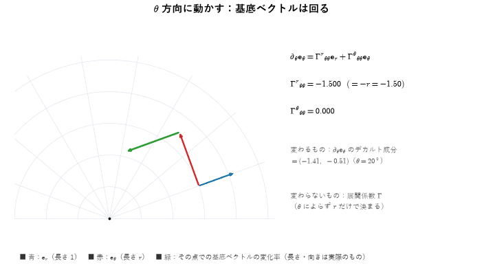

*画面に出ている $\Gamma$ の値は、基底ベクトルを有限差分で微分して基底で展開した、実際の数値。$\Gamma^r{}_{\theta\theta}=-r$、$\Gamma^\theta{}_{\theta\theta}=0$、$\Gamma^\theta{}_{r\theta}=1/r$、$\Gamma^r{}_{r\theta}=0$ に一致することを、スクリプトで確認している。*

<a id="p6-2"></a>

## 2. 計量からの公式で検算する

$g_{rr}=1,\ g_{\theta\theta}=r^2,\ g_{r\theta}=0$（前回のノートの結果）、$g^{rr}=1,\ g^{\theta\theta}=1/r^2$ を使います：

$$
\Gamma^r{}_{\theta\theta} = \frac12g^{rr}\big(2\partial_\theta g_{\theta r}-\partial_rg_{\theta\theta}\big) = \frac12(1)(0-2r) = -r\ \checkmark
$$

$$
\Gamma^\theta{}_{r\theta} = \frac12g^{\theta\theta}\big(\partial_rg_{\theta\theta}+\partial_\theta g_{r\theta}-\partial_\theta g_{r\theta}\big) = \frac12\cdot\frac1{r^2}\cdot2r = \frac1r\ \checkmark
$$

一致しました（ヤコビアン経由での第3の検証はPart IV §2の末尾で行っています）。

<a id="p6-3"></a>

## 3. 重要な観察：$\Gamma\ne0$ でも空間は平坦

この極座標の例では $\Gamma^r{}_{\theta\theta}=-r,\ \Gamma^\theta{}_{r\theta}=1/r$ とゼロでない値を持ちますが、これは**空間が曲がっているからではなく、単に座標が曲線的（基底ベクトルが場所ごとに向きを変える）だから**です。$xy$ 平面自体は真っ平らです。

つまり：

$$
\boxed{\Gamma^k{}_{ij}\ne0 \nRightarrow \text{空間が曲がっている}}
$$

「空間が本当に曲がっているかどうか」を判定する量は、次に導入するリーマン曲率テンソルです。実際、$\Gamma$ という量は、以下で見るように**テンソルですらありません**（座標変換の仕方によって、値がゼロにもゼロでなくもなる）。

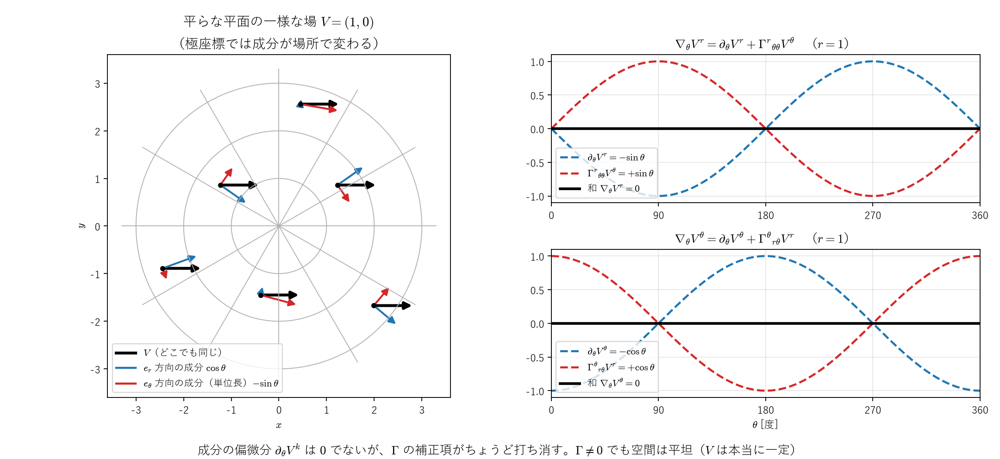

*平らな平面の一様な場 $V=(1,0)$（左）。極座標の成分 $V^r=\cos\theta,\ V^\theta=-\sin\theta/r$ は場所で変わるので $\partial_\theta V^k\neq0$ だが（右、破線）、$\Gamma$ の補正項がちょうど打ち消し、共変微分は $0$ になる（$r=1$ で表示）。$\Gamma\neq0$ でも空間は平坦。*

---

<a id="p7"></a>

# Part VII：リーマン曲率テンソル

<!-- part-toc:start -->

**この Part の内容**

- [1. クリストッフェル記号はなぜテンソルでないのか](#p7-1)
- [2. 共変微分の非可換性として曲率を定義する](#p7-2)
- [3. 幾何学的な意味（並行移動）](#p7-3)

<!-- part-toc:end -->

<a id="p7-1"></a>

## 1. クリストッフェル記号はなぜテンソルでないのか

もしデカルト座標のように $\Gamma=0$ にできる座標が存在するなら（実際、平坦な空間では常に存在します）、テンソルの変換則（線形・同次）に従う量なら、1つの座標系でゼロならどの座標系でもゼロのはずです。しかし極座標では $\Gamma\ne0$ でした。これは、$\Gamma$ の座標変換則が**線形でない**（2階微分を含む余分な項が付く）ことを意味します。この「余分な項」こそが、Part IIIで見た $A^k{}_a\partial_jJ^a{}_i$ という構成の中に、Aとその微分の掛け算という非線形な要素として埋め込まれています。

<a id="p7-2"></a>

## 2. 共変微分の非可換性として曲率を定義する

デカルト座標では、微分の順序は交換できます：$\partial_i\partial_j=\partial_j\partial_i$。しかし、共変微分については一般に

$$
\nabla_i\nabla_jV^k \ne \nabla_j\nabla_iV^k
$$

となり得ます。この**差**こそが曲率の本体です：

$$
\boxed{\big(\nabla_i\nabla_j-\nabla_j\nabla_i\big)V^l =: R^l{}_{kij}V^k}
$$

（この左辺は、$V^k$ の言葉で書けばテンソルの差なので、右辺の $R^l{}_{kij}$ は正真正銘のテンソルになります。$\Gamma$ の非線形性がここで打ち消し合い、テンソルとしての変換性が回復するのが、この定義の巧妙なところです。）

具体的に計算します。まず、これに必要な**一般のテンソルの共変微分規則**を、天下り的にではなく導出します。Part IVでは、反変ベクトル$V^k$（$+\Gamma$）と共変ベクトル$V_k$（$-\Gamma$）、それぞれ添字1個だけの場合の共変微分を導出しました。今回は**$\nabla_jV^l$自体を、上付き添字$l$・下付き添字$j$を持つ1つの量とみなして、もう一段共変微分する**必要があります。まず、これがなぜ突然「新しい種類の量」ではないのかを確認します。

**添字が2個ある量は、今回が初めてではない**：$\Gamma^k{}_{ij}$自体が最初から3つの添字を持っていました（Part I）。$\nabla_jV^l=\partial_jV^l+\Gamma^l{}_{mj}V^m$も、$j$（微分の方向）と$l$（$V$のどの成分か）という、別々の由来を持つ2つの添字を、最初から持っています。「ベクトル→テンソル」という飛躍ではなく、「添字1個の量→添字2個の量」という、地続きの拡張です。

**規則の導出**：$T^l{}_j:=\nabla_jV^l$（添字2個の量）を、$\nabla_i$で共変微分したときの規則を、Part IV §1と同じ手法（「$V^iV_i$がスカラーとして正しく振る舞うように」という要請）で導出します。

**ステップ1**：$T^l{}_j$に、任意のベクトル$W^j$を掛けて縮約します：

$$
Y^l := T^l{}_jW^j
$$

$Y^l$は上付き添字1個だけの、普通のベクトルです（$j$について和を取って消えているので）。$Y^l$がベクトルである以上、その共変微分は、Part IVで既に確立済みの規則（$+\Gamma$）に従わなければなりません：

$$
\nabla_iY^l = \partial_iY^l+\Gamma^l{}_{mi}Y^m = \partial_i(T^l{}_jW^j)+\Gamma^l{}_{mi}T^m{}_jW^j\tag{A}
$$

**ステップ2**：一方、$Y^l=T^l{}_jW^j$という「積」なので、積の微分（ライプニッツ則）も満たすべきです：

$$
\nabla_iY^l = (\nabla_iT^l{}_j)W^j+T^l{}_j(\nabla_iW^j)
$$

$W^j$は普通のベクトルなので、$\nabla_iW^j=\partial_iW^j+\Gamma^j{}_{ki}W^k$（Part IVで既知）を代入します：

$$
\nabla_iY^l = (\nabla_iT^l{}_j)W^j + T^l{}_j\partial_iW^j+T^l{}_j\Gamma^j{}_{ki}W^k\tag{B}
$$

**ステップ3**：(A)を積の微分で展開します：

$$
\partial_i(T^l{}_jW^j)+\Gamma^l{}_{mi}T^m{}_jW^j = (\partial_iT^l{}_j)W^j+T^l{}_j\partial_iW^j+\Gamma^l{}_{mi}T^m{}_jW^j\tag{A'}
$$

(A')と(B)は同じ$\nabla_iY^l$を表すので、等号で結びます。$T^l{}_j\partial_iW^j$の項は両方にあるので消えます：

$$
(\nabla_iT^l{}_j)W^j + T^l{}_j\Gamma^j{}_{ki}W^k = (\partial_iT^l{}_j)W^j+\Gamma^l{}_{mi}T^m{}_jW^j
$$

**ステップ4**：左辺第2項$T^l{}_j\Gamma^j{}_{ki}W^k$の、和を取っている添字$j,k$の名前を、$j\leftrightarrow k$と入れ替えます（ダミー添字の付け替え、値は変わりません）：

$$
T^l{}_j\Gamma^j{}_{ki}W^k \ \longrightarrow\ T^l{}_k\Gamma^k{}_{ji}W^j
$$

これで両辺とも「$W^j$」という同じ形の項でまとめられます：

$$
(\nabla_iT^l{}_j)W^j + T^l{}_k\Gamma^k{}_{ji}W^j = (\partial_iT^l{}_j)W^j+\Gamma^l{}_{mi}T^m{}_jW^j
$$

**ステップ5**：$W^j$は**任意の**ベクトルだったので、$W^j$の係数同士を、そのまま等号で結べます：

$$
\nabla_iT^l{}_j + T^l{}_k\Gamma^k{}_{ji} = \partial_iT^l{}_j+\Gamma^l{}_{mi}T^m{}_j
$$

$T^l{}_k\Gamma^k{}_{ji}$の添字$k$を$m$に付け替えて、移項すると：

$$
\boxed{\nabla_iT^l{}_j = \partial_iT^l{}_j+\Gamma^l{}_{mi}T^m{}_j-\Gamma^m{}_{ji}T^l{}_m}
$$

（Part IVで導出した反変ベクトル・共変ベクトルそれぞれの規則が、1つのテンソルの中に同時に現れていることが、この導出で確認できました。）

この規則を使って、$T^l{}_j:=\nabla_jV^l$を、もう一段$\nabla_i$で共変微分します：

$$
\nabla_i\nabla_jV^l = \nabla_iT^l{}_j = \partial_iT^l{}_j+\Gamma^l{}_{mi}T^m{}_j-\Gamma^m{}_{ji}T^l{}_m
$$

$\nabla_iT^l{}_j$の右辺にある$\Gamma^l{}_{mi}T^m{}_j$と$-\Gamma^m{}_{ji}T^l{}_m$に、それぞれ$T$の定義を代入します。**ここで、ダミー添字の衝突を避けるための付け替えが必要になります。** $T^l{}_j=\partial_jV^l+\Gamma^l{}_{mj}V^m$（Part IV §1の定義、上付き添字$l$、内部のダミー添字$m$）を、そのまま「上付き添字が$m$の場合」に書き換えようとすると、$T^m{}_j=\partial_jV^m+\Gamma^m{}_{mj}V^m$のように、**外側の固定添字$m$と、内部のダミー添字$m$が同じ文字になってしまい、区別がつかなくなります**（プログラミングで言えば、外側のループ変数`m`を、内側のループでも`m`という同じ名前で使ってしまい、上書きが起きる状況と同じです）。そこで、**内部のダミー添字だけを、まだ使われていない文字$n$に付け替えます**：

$$
T^m{}_j = \partial_jV^m+\Gamma^m{}_{nj}V^n\qquad(\text{Part IV §1の定義で }l\to m,\ m\to n\text{ と付け替えたもの})
$$

これを$\Gamma^l{}_{mi}T^m{}_j$に代入します：

$$
\Gamma^l{}_{mi}T^m{}_j = \Gamma^l{}_{mi}\big(\partial_jV^m+\Gamma^m{}_{nj}V^n\big) = \Gamma^l{}_{mi}\partial_jV^m+\Gamma^l{}_{mi}\Gamma^m{}_{nj}V^n
$$

**ここで初めて$n$が登場しました。** 同様に、$-\Gamma^m{}_{ji}T^l{}_m$の中の$T^l{}_m$（今度は下付き添字が$m$に固定された場合）も、内部のダミー添字を$n$に付け替えて：

$$
T^l{}_m = \partial_mV^l+\Gamma^l{}_{nm}V^n\qquad(\text{Part IV §1の定義で }j\to m,\ m\to n\text{ と付け替えたもの})
$$

$$
-\Gamma^m{}_{ji}T^l{}_m = -\Gamma^m{}_{ji}\partial_mV^l-\Gamma^m{}_{ji}\Gamma^l{}_{nm}V^n
$$

**$i,j$は最初から最後まで固定されたまま（微分する2方向）、$m$は元の式が最初から持っていたダミー添字、$n$は$T$の定義を代入する際に、$m$との衝突を避けるために新しく導入したダミー添字**です。これらをすべて足し合わせると：

$$
\nabla_i\nabla_jV^l = \underbrace{\partial_i\partial_jV^l+(\partial_i\Gamma^l{}_{mj})V^m+\Gamma^l{}_{mj}\partial_iV^m}_{\partial_iT^l{}_j\text{の展開}}+\underbrace{\Gamma^l{}_{mi}\partial_jV^m+\Gamma^l{}_{mi}\Gamma^m{}_{nj}V^n}_{\Gamma^l{}_{mi}T^m{}_j\text{の展開}}-\underbrace{\Gamma^m{}_{ji}\partial_mV^l-\Gamma^m{}_{ji}\Gamma^l{}_{nm}V^n}_{\Gamma^m{}_{ji}T^l{}_m\text{の展開}}
$$

（$\partial_iT^l{}_j$の展開は、$T^l{}_j=\partial_jV^l+\Gamma^l{}_{mj}V^m$をそのまま$\partial_i$で微分し、積の微分公式を使ったものです。）整理すると：

$$
\nabla_i\nabla_jV^l = \partial_i\partial_jV^l+(\partial_i\Gamma^l{}_{mj})V^m+\Gamma^l{}_{mj}\partial_iV^m+\Gamma^l{}_{mi}\partial_jV^m+\Gamma^l{}_{mi}\Gamma^m{}_{nj}V^n-\Gamma^m{}_{ji}\partial_mV^l-\Gamma^m{}_{ji}\Gamma^l{}_{nm}V^n
$$

$i,j$を入れ替えた式も、まったく同じ手順で作ります：

$$
\nabla_j\nabla_iV^l = \partial_j\partial_iV^l+(\partial_j\Gamma^l{}_{mi})V^m+\Gamma^l{}_{mi}\partial_jV^m+\Gamma^l{}_{mj}\partial_iV^m+\Gamma^l{}_{mj}\Gamma^m{}_{ni}V^n-\Gamma^m{}_{ij}\partial_mV^l-\Gamma^m{}_{ij}\Gamma^l{}_{nm}V^n
$$

**引き算すると**：$\partial_i\partial_jV^l-\partial_j\partial_iV^l=0$（混合偏微分の対称性）、$\Gamma^l{}_{mj}\partial_iV^m$と$\Gamma^l{}_{mi}\partial_jV^m$の項は両方の式に同じ形で現れるためそのまま打ち消し合い、$\Gamma^m{}_{ji}\partial_mV^l$と$\Gamma^m{}_{ij}\partial_mV^l$も$\Gamma$の下2添字対称性（$\Gamma^m{}_{ji}=\Gamma^m{}_{ij}$）から一致して打ち消し合います。生き残るのは：

$$
\nabla_i\nabla_jV^l-\nabla_j\nabla_iV^l = \big[(\partial_i\Gamma^l{}_{mj}-\partial_j\Gamma^l{}_{mi})+(\Gamma^l{}_{mi}\Gamma^m{}_{nj}-\Gamma^l{}_{mj}\Gamma^m{}_{ni})\big]V^n
$$

添字の名前を整理する（$m\to k$など）と：

$$
\boxed{R^l{}_{kij} = \partial_i\Gamma^l{}_{jk} - \partial_j\Gamma^l{}_{ik} + \Gamma^l{}_{im}\Gamma^m{}_{jk} - \Gamma^l{}_{jm}\Gamma^m{}_{ik}}
$$

これが**リーマン曲率テンソル**です。4本の添字を持つ4階テンソルであり、「クリストッフェル記号をもう一段微分し、かつ2次の項も加えたもの」という構造をしています。

添字の並びと意味を図にまとめると、次のようになります。

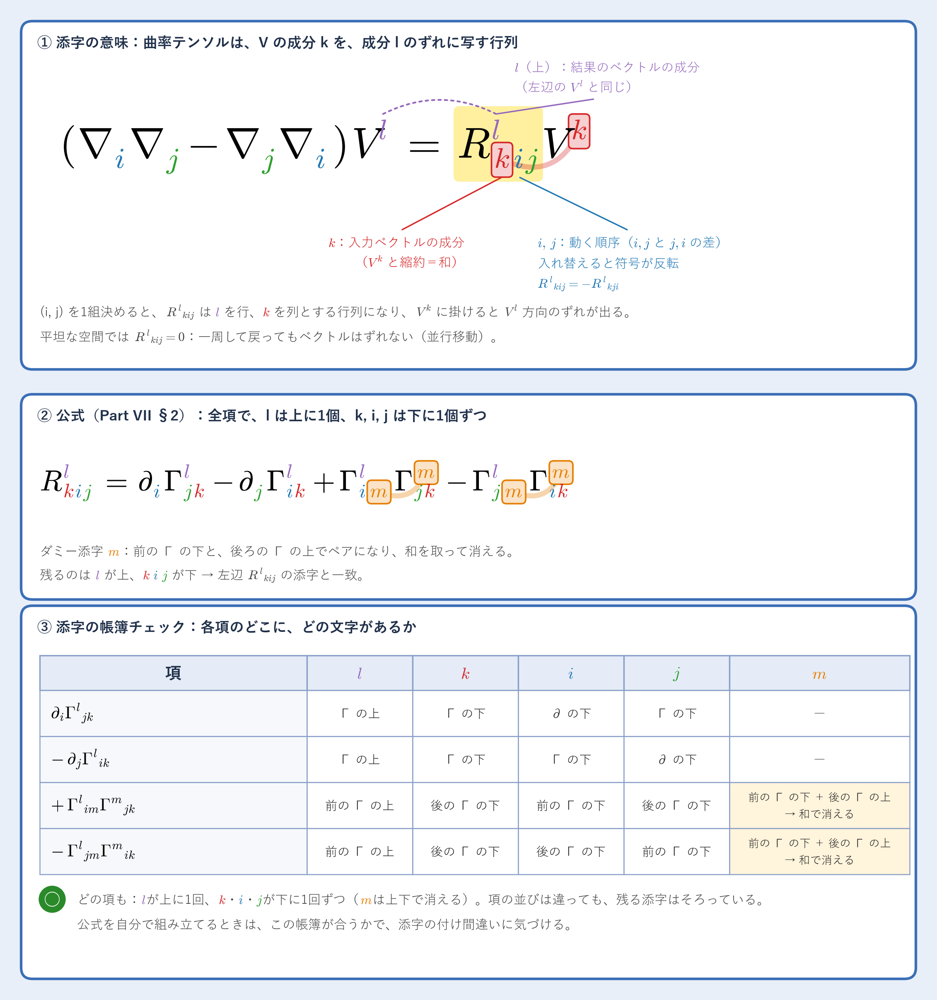

*① $R^l{}_{kij}V^k$ は、入力の成分 $k$ を、結果の成分 $l$ に写す。$i,j$ は動く順序で、入れ替えると符号が反転する。② 公式のどの項でも、$l$ は上に1個、$k,i,j$ は下に1個ずつ現れ、ダミー添字 $m$ は上下のペアで消える。③ 各項の、どこにどの文字があるかを表にした「帳簿」。添字の付け間違いに気づく検算に使える。*

<a id="p7-3"></a>

## 3. 幾何学的な意味（並行移動）

もう一つの、より直感的な理解の仕方があります。ベクトルを、ある点から出発して小さな長方形の経路（$i$方向に少し動いて $j$方向に少し動く、と、$j$方向→$i$方向の順で動く、の2通り）に沿って「向きを変えずに」運ぶ（平行移動する）と、平坦な空間なら2通りの経路で同じ場所・同じ向きに戻ってきます。しかし曲がった空間では、**経路によって最終的なベクトルの向きがずれます**。このズレの量が、まさに $R^l{}_{kij}V^k$ です。球面上でベクトルを運ぶと向きがずれる、という現象（球面三角形の内角の和が180度を超えることとも関係します）が、この曲率テンソルの正体です。

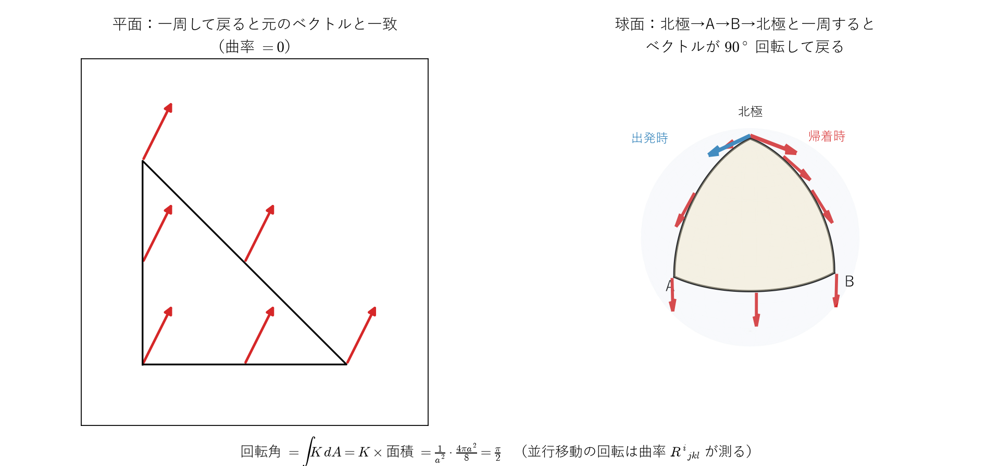

*左：平面では、閉じた経路を一周して戻ったベクトルは元と一致する。右：球面の1/8（北極→A→B→北極）を一周すると、ベクトルは $90^\circ$ 回転して戻る。回転角は $K\times$面積 $=\frac1{a^2}\cdot\frac{4\pi a^2}8=\frac\pi2$ と一致する。*

同じ例を動かすと、次のようになります（ループ再生）。ベクトルは各区間で進行方向との角度を保ったまま運ばれ（右のグラフは $0^\circ\to90^\circ\to180^\circ$ と階段状）、回っているのは進行方向のほうです。曲がり角の合計は $90^\circ\times3=270^\circ$ で、平面なら $360^\circ$ になるはずなので、不足の $90^\circ$ が一周したときのベクトルの回転角になります。

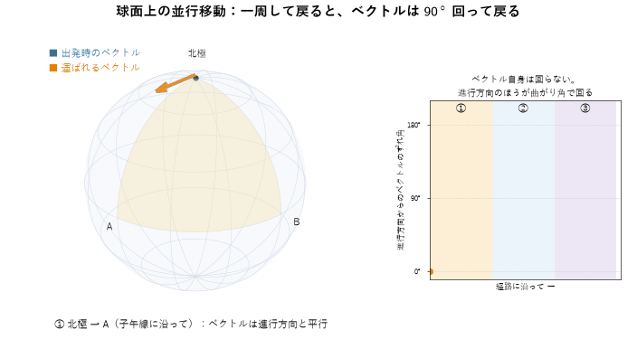

*北極 → A → B → 北極 の経路でベクトル（橙）を並行移動する。出発時のベクトル（青）との間に、一周後に $90^\circ$ のずれが残る。ベクトルは、経路を細かく刻み、各ステップで接平面に射影して実際に数値で運んでいる（生成：`figures/make_animations.py`）。*

上の動画は大きな経路でしたが、曲率 $R^l{}_{kij}$ の定義は「**小さな座標の四角形**」を2通りの順で回るという形でした。それを動かしたのが次の動画です（ループ再生）。Part I §2 の動画（2通りの経路で位置は同じ点に着く）と見比べてください。位置は交換しますが、ベクトルを並行移動すると、順序によって $R^l{}_{kij}V^k$ だけずれます（ずれ $\propto\varepsilon^2$）。

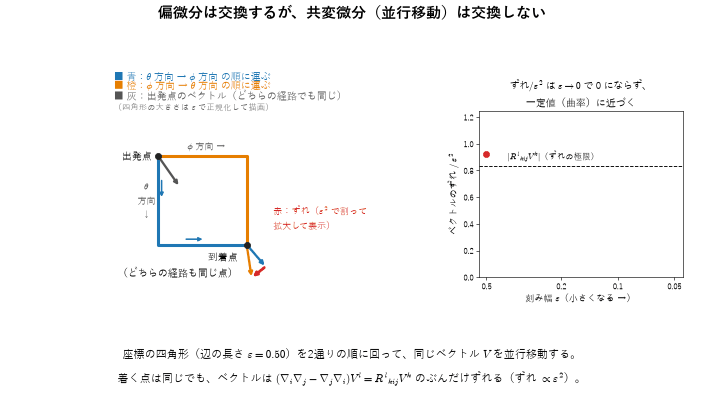

*球面上の小さな座標の四角形（辺の長さ $\varepsilon$）を、$\theta$ 方向 → $\phi$ 方向（青）と $\phi$ 方向 → $\theta$ 方向（橙）の順に回ってベクトルを並行移動する。着く点は同じだが、ベクトルは $(\nabla_\theta\nabla_\phi-\nabla_\phi\nabla_\theta)V^l=R^l{}_{k\theta\phi}V^k$ のぶんだけずれる（赤は $\varepsilon^2$ で割って拡大した表示）。右のグラフでは、ずれ$/\varepsilon^2$ が $\varepsilon\to0$ で $0$ に近づかず、曲率で決まる一定値に近づく。数値は本文の球面の曲率（$R^\theta{}_{\phi\theta\phi}=\sin^2\theta$）と照合済みで、ずれの大きさは $\varepsilon^2R^l{}_{kij}V^k$ に一致する。*

---

<a id="p8"></a>

# Part VIII：具体例2 ― 球面（曲がった空間）でリーマン曲率テンソルを計算する

<!-- part-toc:start -->

**この Part の内容**

- [1. 設定](#p8-1)
- [2. クリストッフェル記号](#p8-2)
- [3. リーマン曲率テンソルを計算する](#p8-3)
- [4. ガウス曲率とは何か、どう定義されるのか](#p8-4)
  - [4-a. 古典的な定義：主曲率の積](#p8-4a)
  - [4-b. 球面の場合、直感的に求まる](#p8-4b)
  - [4-c. 埋め込みを使った、より計算的な確認（第二基本形式）](#p8-4c)
  - [4-d. なぜ「主曲率の積＝行列式の比」なのか（天下り的にではなく導出する）](#p8-4d)
  - [4-e. ガウスの驚異の定理：埋め込みなしでも計算できる](#p8-4e)
- [5. 実際に計算し、両者の一致を確認する](#p8-5)

<!-- part-toc:end -->

<a id="p8-1"></a>

## 1. 設定

半径 $a$（一定）の球面**そのもの**を、2次元の空間として考えます（3次元空間に埋め込まれた球の「表面」だけを、独立した2次元の曲がった世界として扱う、という点が重要です）。座標は $q^1=\theta,\ q^2=\phi$。

計量（前回導出した3次元球座標の計量で $r=a$ を固定したもの）：

$$
g_{\theta\theta}=a^2,\qquad g_{\phi\phi}=a^2\sin^2\theta,\qquad g_{\theta\phi}=0
$$

<a id="p8-2"></a>

## 2. クリストッフェル記号

$g_{\theta\theta}=a^2$ は定数（微分すればゼロ）、$g_{\phi\phi}=a^2\sin^2\theta$ の $\theta$ 微分だけがゼロでない：

$$
\partial_\theta g_{\phi\phi} = 2a^2\sin\theta\cos\theta
$$

公式に代入します：

$$
\Gamma^\theta{}_{\phi\phi} = \frac12g^{\theta\theta}\big(-\partial_\theta g_{\phi\phi}\big) = \frac1{2a^2}\big(-2a^2\sin\theta\cos\theta\big) = -\sin\theta\cos\theta
$$

$$
\Gamma^\phi{}_{\theta\phi} = \frac12g^{\phi\phi}\big(\partial_\theta g_{\phi\phi}\big) = \frac1{2a^2\sin^2\theta}\big(2a^2\sin\theta\cos\theta\big) = \cot\theta
$$

（他の $\Gamma$ 成分はすべてゼロ。）

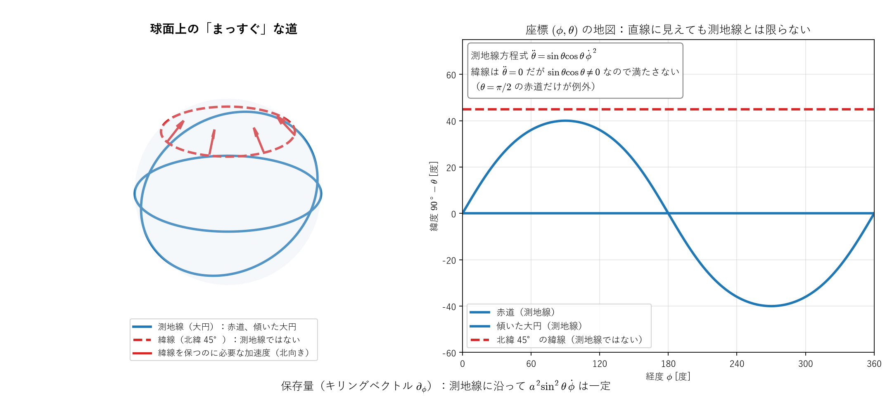

*Part V の測地線方程式を球面に適用したもの。$\Gamma^\theta{}_{\phi\phi}=-\sin\theta\cos\theta$ から $\ddot\theta=\sin\theta\cos\theta\,\dot\phi^{\,2}$ となる。赤道（$\theta=\pi/2$）と大円は測地線だが、緯線は $\ddot\theta=0$ でこの式を満たさない（緯線を保つには北向きの加速度が必要）。右の地図では、緯線は直線に見えても測地線ではない。*

<a id="p8-3"></a>

## 3. リーマン曲率テンソルを計算する

2次元なので、独立な成分は本質的に1つ（$R^\theta{}_{\phi\theta\phi}$）だけです。定義式に代入します：

$$
R^\theta{}_{\phi\theta\phi} = \partial_\theta\Gamma^\theta{}_{\phi\phi} - \partial_\phi\Gamma^\theta{}_{\theta\phi} + \Gamma^\theta{}_{\theta m}\Gamma^m{}_{\phi\phi} - \Gamma^\theta{}_{\phi m}\Gamma^m{}_{\theta\phi}
$$

各項を計算します：

- $\partial_\theta\Gamma^\theta{}_{\phi\phi} = \partial_\theta(-\sin\theta\cos\theta) = \sin^2\theta-\cos^2\theta$
- $\Gamma^\theta{}_{\theta\phi}=0$ なので $\partial_\phi\Gamma^\theta{}_{\theta\phi}=0$
- $\Gamma^\theta{}_{\theta m}\Gamma^m{}_{\phi\phi}$：$\Gamma^\theta{}_{\theta\theta}=0,\ \Gamma^\theta{}_{\theta\phi}=0$ なので、この項はゼロ
- $\Gamma^\theta{}_{\phi m}\Gamma^m{}_{\theta\phi}$：$m=\phi$ の項だけ残る：$\Gamma^\theta{}_{\phi\phi}\Gamma^\phi{}_{\theta\phi} = (-\sin\theta\cos\theta)(\cot\theta) = -\cos^2\theta$

まとめると：

$$
R^\theta{}_{\phi\theta\phi} = (\sin^2\theta-\cos^2\theta) - 0 + 0 - (-\cos^2\theta) = \sin^2\theta
$$

添字を下げます（$R_{\theta\phi\theta\phi}=g_{\theta\theta}R^\theta{}_{\phi\theta\phi}$）：

$$
\boxed{R_{\theta\phi\theta\phi} = a^2\sin^2\theta}
$$

<a id="p8-4"></a>

## 4. ガウス曲率とは何か、どう定義されるのか

「$K=R_{\theta\phi\theta\phi}/\det g$」という式を、天下り的にではなく、**ガウス曲率の本来の定義（3次元空間に埋め込まれた曲面の、外から見た曲がり方）から出発して確認します**。

<a id="p8-4a"></a>

### 4-a. 古典的な定義：主曲率の積

曲面上の各点で、法線ベクトル$\mathbf n$を含む平面で曲面を切ると、その断面は1つの曲線（法線曲率の切り口）になります。**切る方向を変えると、切り口の曲率（法曲率）も変わります**。この法曲率の**最大値$\kappa_1$と最小値$\kappa_2$**を**主曲率**と呼び、その積が**ガウス曲率**です：

$$
\boxed{K := \kappa_1\kappa_2}
$$

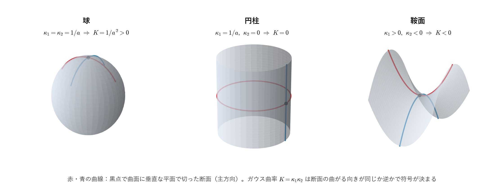

*黒点で曲面に垂直な平面で切った断面（赤・青）が主方向。断面の曲がる向きが同じなら $K>0$（球）、片方が真っ直ぐなら $K=0$（円柱）、逆向きなら $K<0$（鞍面）。*

<a id="p8-4b"></a>

### 4-b. 球面の場合、直感的に求まる

半径$a$の球面上のどの点でも、**どの方向に切っても、切り口は必ず半径$a$の円**になります（球の対称性から）。円の曲率は半径の逆数（$1/a$）なので：

$$
\kappa_1=\kappa_2=\frac1a \quad\Longrightarrow\quad K=\kappa_1\kappa_2=\frac1{a^2}
$$

**これで、埋め込み（3次元空間の中の球面）という、外から見た定義だけから、$K=1/a^2$が直接求まりました。** まだリーマン曲率テンソルは一切使っていません。

<a id="p8-4c"></a>

### 4-c. 埋め込みを使った、より計算的な確認（第二基本形式）

球面を$\mathbf r(\theta,\phi)=a(\sin\theta\cos\phi,\ \sin\theta\sin\phi,\ \cos\theta)$とパラメータ表示します。単位法線ベクトルは$\mathbf n=\mathbf r/a$（原点中心の球なので、位置ベクトル自身の方向が外向き法線）。

**記法の確認**：以下で使う$\mathbf r_\theta,\mathbf r_{\theta\theta}$などは、単なる偏微分の略記です：$\mathbf r_\theta:=\partial\mathbf r/\partial\theta$、$\mathbf r_{\theta\theta}:=\partial^2\mathbf r/\partial\theta^2=\partial_\theta(\mathbf r_\theta)$。

**第一基本形式（計量）を、$g_{ij}=\mathbf r_i\cdot\mathbf r_j$の定義から、実際に計算します**（「以前導出済み」という言い方に頼らず、今回の枠組みで検算します）。まず$\mathbf r_\theta,\mathbf r_\phi$を求めます：

$$
\mathbf r_\theta = a(\cos\theta\cos\phi,\ \cos\theta\sin\phi,\ -\sin\theta),\qquad \mathbf r_\phi = a(-\sin\theta\sin\phi,\ \sin\theta\cos\phi,\ 0)
$$

**$g_{\theta\theta}=\mathbf r_\theta\cdot\mathbf r_\theta$を計算します**（各成分を2乗して足す）：

$$
g_{\theta\theta} = a^2\big(\cos^2\theta\cos^2\phi+\cos^2\theta\sin^2\phi+\sin^2\theta\big) = a^2\big(\cos^2\theta(\cos^2\phi+\sin^2\phi)+\sin^2\theta\big) = a^2(\cos^2\theta+\sin^2\theta) = a^2
$$

**$g_{\phi\phi}=\mathbf r_\phi\cdot\mathbf r_\phi$を計算します**：

$$
g_{\phi\phi} = a^2\big(\sin^2\theta\sin^2\phi+\sin^2\theta\cos^2\phi+0\big) = a^2\sin^2\theta(\sin^2\phi+\cos^2\phi) = a^2\sin^2\theta
$$

**$g_{\theta\phi}=\mathbf r_\theta\cdot\mathbf r_\phi$を計算します**：

$$
g_{\theta\phi} = a^2\big(\cos\theta\cos\phi\cdot(-\sin\theta\sin\phi)+\cos\theta\sin\phi\cdot\sin\theta\cos\phi+0\big) = a^2\big(-\sin\theta\cos\theta\sin\phi\cos\phi+\sin\theta\cos\theta\sin\phi\cos\phi\big) = 0
$$

$$
\boxed{g_{\theta\theta}=a^2,\qquad g_{\phi\phi}=a^2\sin^2\theta,\qquad g_{\theta\phi}=0}
$$

**記法**：$\mathbf r_i:=\partial\mathbf r/\partial u^i$は、Part Iの基底ベクトル$\mathbf e_i=\partial\mathbf x/\partial q^i$と同じ対象を、埋め込み先の座標を$\mathbf r$、パラメータを$u^i$（$\theta,\phi$）と呼んでいるだけである。$g_{ij}=\mathbf r_i\cdot\mathbf r_j$と$g_{ij}=\mathbf e_i\cdot\mathbf e_j$は同一の式であり、以下の$g_{\theta\theta}=a^2,g_{\phi\phi}=a^2\sin^2\theta$は、Part VIIIで求めた値と同じ計量を指す。

**第二基本形式**$L_{ij}:=\mathbf r_{ij}\cdot\mathbf n$（2階微分を法線方向に射影したもの）を計算します。

**まず$\mathbf r_{\theta\theta}$を、成分ごとに実際に計算します**。$\mathbf r_\theta$は先ほど求めた通りです。もう一度$\theta$で微分します（各成分を、それぞれ$\theta$についてさらに1回微分するだけです：$\frac{d}{d\theta}\cos\theta=-\sin\theta$、$\frac{d}{d\theta}(-\sin\theta)=-\cos\theta$）：

$$
\mathbf r_{\theta\theta} = \frac{\partial\mathbf r_\theta}{\partial\theta} = a(-\sin\theta\cos\phi,\ -\sin\theta\sin\phi,\ -\cos\theta)
$$

**この結果を、元の$\mathbf r=a(\sin\theta\cos\phi,\sin\theta\sin\phi,\cos\theta)$と、成分ごとに見比べます**。$\mathbf r_{\theta\theta}$のどの成分も、$\mathbf r$の対応する成分に$-1$を掛けたものと一致しているので：

$$
\boxed{\mathbf r_{\theta\theta} = -\mathbf r}
$$

$$
L_{\theta\theta} = \mathbf r_{\theta\theta}\cdot\mathbf n = -\mathbf r\cdot\frac{\mathbf r}a = -\frac{|\mathbf r|^2}a = -\frac{a^2}a = -a
$$

**次に$\mathbf r_{\phi\phi}$を計算します。** 先ほど求めた$\mathbf r_\phi=a(-\sin\theta\sin\phi,\ \sin\theta\cos\phi,\ 0)$を、もう一度$\phi$で微分します（各成分を、それぞれ$\phi$についてさらに1回微分するだけです：$\frac{d}{d\phi}(-\sin\phi)=-\cos\phi$、$\frac{d}{d\phi}\cos\phi=-\sin\phi$、定数の微分は$0$）：

$$
\mathbf r_{\phi\phi} = \frac{\partial\mathbf r_\phi}{\partial\phi} = a(-\sin\theta\cos\phi,\ -\sin\theta\sin\phi,\ 0)
$$

$\mathbf r_{\phi\phi}$の第3成分は$0$（$\mathbf r$の第3成分$\cos\theta$とは異なる）ため、$\mathbf r_{\theta\theta}=-\mathbf r$のような係数比較はできない。$\mathbf n=\mathbf r/a=(\sin\theta\cos\phi,\sin\theta\sin\phi,\cos\theta)$との内積を、成分ごとに計算する：

$$
L_{\phi\phi} = \mathbf r_{\phi\phi}\cdot\mathbf n = a\big[(-\sin\theta\cos\phi)(\sin\theta\cos\phi)+(-\sin\theta\sin\phi)(\sin\theta\sin\phi)+0\cdot\cos\theta\big]
$$

$$
= a\big[-\sin^2\theta\cos^2\phi-\sin^2\theta\sin^2\phi\big] = a\big[-\sin^2\theta(\cos^2\phi+\sin^2\phi)\big] = -a\sin^2\theta
$$

$$
\boxed{L_{\phi\phi} = -a\sin^2\theta}
$$

**最後に$\mathbf r_{\theta\phi}$を計算します。** $\mathbf r_\theta=a(\cos\theta\cos\phi,\cos\theta\sin\phi,-\sin\theta)$を、$\phi$で微分します（$\theta$方向の微分の後、さらに$\phi$方向にも微分する、という意味です）：

$$
\mathbf r_{\theta\phi} = \frac{\partial\mathbf r_\theta}{\partial\phi} = a(-\cos\theta\sin\phi,\ \cos\theta\cos\phi,\ 0)
$$

$\mathbf n$との内積を、同様に成分ごとに計算します：

$$
L_{\theta\phi} = \mathbf r_{\theta\phi}\cdot\mathbf n = a\big[(-\cos\theta\sin\phi)(\sin\theta\cos\phi)+(\cos\theta\cos\phi)(\sin\theta\sin\phi)+0\cdot\cos\theta\big]
$$

$$
= a\big[-\sin\theta\cos\theta\sin\phi\cos\phi+\sin\theta\cos\theta\cos\phi\sin\phi\big] = a\cdot0 = 0
$$

$$
\boxed{L_{\theta\phi} = 0}
$$

**なぜ$\det L$が$L_{\theta\theta}L_{\phi\phi}-L_{\theta\phi}^2$という形（$L_{\theta\phi}\cdot L_{\phi\theta}$ではなく、同じ添字の2乗）になるのかを確認します。** $2\times2$行列$L=\begin{pmatrix}L_{\theta\theta}&L_{\theta\phi}\\L_{\phi\theta}&L_{\phi\phi}\end{pmatrix}$の行列式は、一般に$\det L=L_{\theta\theta}L_{\phi\phi}-L_{\theta\phi}L_{\phi\theta}$（左上×右下$-$右上×左下）です。ここで、**$L$は対称行列**です：

$$
L_{\theta\phi} = \mathbf r_{\theta\phi}\cdot\mathbf n = \mathbf r_{\phi\theta}\cdot\mathbf n = L_{\phi\theta}
$$

（$\mathbf r_{\theta\phi}=\partial_\theta\partial_\phi\mathbf r$と$\mathbf r_{\phi\theta}=\partial_\phi\partial_\theta\mathbf r$は、混合偏微分の対称性から等しいので。）**したがって$L_{\theta\phi}\cdot L_{\phi\theta}=L_{\theta\phi}\cdot L_{\theta\phi}=L_{\theta\phi}^2$**となり：

$$
\det L = L_{\theta\theta}L_{\phi\phi}-L_{\theta\phi}L_{\phi\theta} = L_{\theta\theta}L_{\phi\phi}-L_{\theta\phi}^2
$$

（計量$g$についても、$g_{\theta\phi}=\mathbf r_\theta\cdot\mathbf r_\phi=\mathbf r_\phi\cdot\mathbf r_\theta=g_{\phi\theta}$、まったく同じ理由で$\det g=g_{\theta\theta}g_{\phi\phi}-g_{\theta\phi}^2$となります。）

**ガウス曲率は、第一・第二基本形式の行列式の比として計算できます**（主曲率$\kappa_1,\kappa_2$は「第二基本形式を第一基本形式で割った行列」の固有値なので、その積＝行列式の比になります。この点は§4-dで詳しく導出します）：

$$
K = \frac{\det L}{\det g} = \frac{L_{\theta\theta}L_{\phi\phi}-L_{\theta\phi}^2}{g_{\theta\theta}g_{\phi\phi}-g_{\theta\phi}^2} = \frac{(-a)(-a\sin^2\theta)-0}{a^2\cdot a^2\sin^2\theta-0} = \frac{a^2\sin^2\theta}{a^4\sin^2\theta} = \boxed{\frac1{a^2}}
$$

**4-bの直感と、完全に一致しました。**

<a id="p8-4d"></a>

### 4-d. なぜ「主曲率の積＝行列式の比」なのか（天下り的にではなく導出する）

前節で「主曲率$\kappa_1,\kappa_2$は$g^{-1}L$の固有値なので、積＝行列式の比になります」と述べましたが、これを最初から導出します。

**ステップ0：レイリー商とは何か（準備）**。対称行列$A$とゼロでないベクトル$v$から作られる、次の形の量を**レイリー商**と呼びます：

$$
R(v) := \frac{v^TAv}{v^Tv}
$$

（今回使う形は、これを一般化した「一般化レイリー商」$\dfrac{v^TLv}{v^Tgv}$で、分母が単なる$v^Tv$ではなく、別の対称行列$g$で測った量になっています。）

**核心の性質：$R(v)$の値は、常に$A$の固有値の最小値と最大値の間に収まります。** これを確認します。$A$（対称行列）の固有ベクトルを$\mathbf e_1,\dots,\mathbf e_n$（正規直交基底、以前のユニタリ行列の対角化のノートで扱った内容）、対応する固有値を$\lambda_1\le\cdots\le\lambda_n$とします。任意の単位ベクトル$v$は、この固有ベクトルの組み合わせで書けます：

$$
v = c_1\mathbf e_1+\cdots+c_n\mathbf e_n,\qquad c_1^2+\cdots+c_n^2=1
$$

（$v$が単位ベクトルなので、係数の2乗和が1。）これを$v^TAv$に代入します。$A\mathbf e_i=\lambda_i\mathbf e_i$、固有ベクトル同士は直交する（$\mathbf e_i\cdot\mathbf e_j=\delta_{ij}$）ことを使うと：

$$
v^TAv = \sum_i\lambda_ic_i^2
$$

**これは、固有値$\lambda_i$を、重み$c_i^2$（合計1）で平均した「加重平均」です。** 加重平均は必ず最小値と最大値の間に収まるので：

$$
\boxed{\lambda_1 \le v^TAv \le \lambda_n}
$$

（等号が成立するのは、$v$がちょうど固有ベクトル$\mathbf e_1$（最小）や$\mathbf e_n$（最大）そのものであるときだけです。）

**さらに重要な性質**：$R(v)$（あるいは制約付きの$v^TAv$）の**最大値・最小値だけでなく、「停留点（極大・極小・鞍点）」がすべて固有ベクトルになります**。「その点で、目的関数の勾配が、制約の勾配に比例する」という条件（次のステップ2で使うラグランジュの未定乗数法）が、まさにこの停留点を求める操作です。**「レイリー商の停留点＝固有ベクトル、そのときの値＝固有値」というのが、以下の計算全体を貫く、一般的な定理です。**

**ステップ1：法曲率を、レイリー商として定義する**。接ベクトル$v=v^i\mathbf r_i$方向の法曲率は：

$$
\kappa_n(v) := \frac{L_{ij}v^iv^j}{g_{ij}v^iv^j}
$$

（分子は$v$方向にどれだけ曲がっているか（第二基本形式）、分母は$v$の長さの2乗（計量）で正規化。）**主曲率$\kappa_1,\kappa_2$は、この$\kappa_n(v)$を、$v$の向きを変えながら動かしたときの、最大値・最小値**です。

**ステップ2：最大・最小を求める（ラグランジュの未定乗数法）**。$g_{ij}v^iv^j=1$（単位ベクトルに正規化）という制約のもとで、$L_{ij}v^iv^j$を最大・最小にする$v$を求めます。ラグランジュ乗数を$\kappa$として：

$$
\frac{\partial}{\partial v^i}\Big[L_{jk}v^jv^k-\kappa\big(g_{jk}v^jv^k-1\big)\Big] = 0
$$

$2$次形式の微分（$\dfrac{\partial}{\partial v^i}(A_{jk}v^jv^k)=2A_{ij}v^j$、$A$が対称のとき）を使うと：

$$
2L_{ij}v^j-2\kappa g_{ij}v^j = 0 \quad\Longrightarrow\quad \boxed{L_{ij}v^j = \kappa\,g_{ij}v^j}
$$

**これは「一般化固有値問題」**（行列$L$と行列$g$のペアに対する固有値方程式）です。両辺に逆計量$g^{ik}$を掛けて整理すると：

$$
g^{ik}L_{kj}v^j = \kappa v^i \quad\Longrightarrow\quad (g^{-1}L)v = \kappa v
$$

**つまり、$\kappa$は行列$g^{-1}L$の固有値、$v$はその固有ベクトルです。** この$g^{-1}L$という行列は、実は付録Aでもう一度、別の文脈（法線ベクトルの微分を扱う「ヴァインガルテンの公式」）で登場します。まったく別の切り口から出てくる行列が、主曲率を定義する行列と同一である、という点は、付録A-3で改めて確認します。

**ステップ3：固有値の積＝行列式、という線形代数の一般則を導出する**

**まず、特性方程式を実際に展開します**。$S=\begin{pmatrix}s_{11}&s_{12}\\s_{21}&s_{22}\end{pmatrix}$として：

$$
S-\kappa I = \begin{pmatrix}s_{11}-\kappa&s_{12}\\s_{21}&s_{22}-\kappa\end{pmatrix}
$$

$2\times2$の行列式の定義（左上×右下$-$右上×左下）で計算します：

$$
\det(S-\kappa I) = (s_{11}-\kappa)(s_{22}-\kappa)-s_{12}s_{21}
$$

右辺を展開します：

$$
= s_{11}s_{22}-s_{11}\kappa-s_{22}\kappa+\kappa^2-s_{12}s_{21} = \kappa^2-(s_{11}+s_{22})\kappa+(s_{11}s_{22}-s_{12}s_{21})
$$

$s_{11}+s_{22}=\operatorname{tr}S$（対角成分の和）、$s_{11}s_{22}-s_{12}s_{21}=\det S$なので：

$$
\boxed{\det(S-\kappa I) = \kappa^2-(\operatorname{tr}S)\kappa+\det S}
$$

**固有値$\kappa_1,\kappa_2$は、この式が$0$になる$\kappa$（特性方程式の解）として定義されます**：

$$
\kappa^2-(\operatorname{tr}S)\kappa+\det S = 0
$$

**次に、「解と係数の関係」自体を、因数分解から導出します**。$\kappa_1,\kappa_2$がこの2次方程式の2つの解であるということは、**この2次式が$(\kappa-\kappa_1)(\kappa-\kappa_2)$という形に、必ず因数分解できる**ということです（2次方程式は、最高次の係数が1なら、2つの解を使ってこの形に書けます）：

$$
\kappa^2-(\operatorname{tr}S)\kappa+\det S = (\kappa-\kappa_1)(\kappa-\kappa_2)
$$

**右辺を展開します**：

$$
(\kappa-\kappa_1)(\kappa-\kappa_2) = \kappa^2-\kappa_2\kappa-\kappa_1\kappa+\kappa_1\kappa_2 = \kappa^2-(\kappa_1+\kappa_2)\kappa+\kappa_1\kappa_2
$$

**両辺は、$\kappa$についてまったく同じ多項式（恒等式）なので、$\kappa$の各次数の係数が、両辺で一致しなければなりません**：

$$
\kappa^2-(\operatorname{tr}S)\kappa+\det S = \kappa^2-(\kappa_1+\kappa_2)\kappa+\kappa_1\kappa_2
$$

**$\kappa^1$の係数を比較すると**：$-\operatorname{tr}S=-(\kappa_1+\kappa_2)$、つまり$\operatorname{tr}S=\kappa_1+\kappa_2$（固有値の和はトレース）。

**$\kappa^0$の係数（定数項）を比較すると**：

$$
\boxed{\det S = \kappa_1\kappa_2}
$$

**これで、「固有値の積＝行列式」という関係が、天下り的にではなく、特性方程式の因数分解という、具体的な計算から導出できました。**

**ステップ4：組み合わせる**。$S=g^{-1}L$なので：

$$
K = \kappa_1\kappa_2 = \det(g^{-1}L) = \det(g^{-1})\det(L) = \frac{\det L}{\det g}
$$

（$\det(g^{-1})=1/\det(g)$、逆行列の行列式は元の行列式の逆数、というのも以前確認済みの性質です。）

$$
\boxed{K = \kappa_1\kappa_2 = \frac{\det L}{\det g}}
$$

**これで、前節で使った「主曲率の積＝行列式の比」という関係が、最初から最後まで導出できました。**

**ステップ5：球面の具体的な数値を、実際に固有値方程式$L_{ij}v^j=\kappa g_{ij}v^j$に代入します。** §4-cで求めた$L_{\theta\theta}=-a,\ L_{\phi\phi}=-a\sin^2\theta,\ L_{\theta\phi}=0$と、$g_{\theta\theta}=a^2,\ g_{\phi\phi}=a^2\sin^2\theta,\ g_{\theta\phi}=0$を見比べると、**驚くべきことに、$L$は$g$のちょうど$-1/a$倍になっています**：

$$
L_{\theta\theta} = -a = -\frac1a\cdot a^2 = -\frac1a\,g_{\theta\theta},\qquad L_{\phi\phi} = -a\sin^2\theta = -\frac1a\cdot a^2\sin^2\theta = -\frac1a\,g_{\phi\phi}
$$

$$
\boxed{L_{ij} = -\frac1a\,g_{ij}}
$$

**これを固有値方程式$L_{ij}v^j=\kappa g_{ij}v^j$に代入すると**：

$$
-\frac1a\,g_{ij}v^j = \kappa\,g_{ij}v^j
$$

**この式は、$v$がどんな方向であっても（$v$を消去して比較すると）、$\kappa=-1/a$で成り立ちます。** つまり、**球面上のどの点でも、どの方向を選んでも、法曲率が常に同じ値$-1/a$になる**、ということです（符号がマイナスなのは、法線ベクトル$\mathbf n=\mathbf r/a$を外向きに取ったことによる、向きの約束の違いにすぎません。§4-bで求めた「大きさ$1/a$」と、絶対値では一致しています）。

$$
\boxed{\kappa_1=\kappa_2=-\frac1a}
$$

**このように、主曲率が方向によらず一定になる点を「臍点（umbilic point）」と呼びます。球面は、すべての点が臍点である、特別な曲面です**（平面やトーラスのような一般の曲面では、点ごとに、あるいは方向ごとに主曲率が変わるのが普通です）。

**最後に、積を計算して$K$と一致することを確認します**：

$$
\kappa_1\kappa_2 = \left(-\frac1a\right)\left(-\frac1a\right) = \frac1{a^2}
$$

**§4-cで直接計算した$K=1/a^2$、そして§4-bの直感的な$\kappa_1=\kappa_2=1/a$（絶対値）と、すべて一致しました。** 抽象的な一般論（ステップ1〜4）が、球面という具体例に実際に数値を当てはめても、矛盾なく機能することが、これで確認できました。

<a id="p8-4e"></a>

### 4-e. ガウスの驚異の定理：埋め込みなしでも計算できる

ここまでの計算はすべて「球面が3次元空間の中に、どう埋め込まれているか」（法線ベクトル$\mathbf n$、外から見た曲がり方）を使っていました。**ガウスが発見した驚くべき事実（Theorema Egregium、"驚異の定理"）は、$K$が実は埋め込みを一切使わず、計量$g_{ij}$（曲面の内部だけで測れる量）だけから計算できる、というものです。** 具体的には、2次元では**リーマン曲率テンソルのただ1つの独立成分**を使って：

$$
\boxed{K = \frac{R_{\theta\phi\theta\phi}}{\det g}}
$$

（一般に、2次元多様体では$R^l{}_{kij}$の独立成分が1つしかないため、この比が、平面の向き・パラメータの取り方によらず、$K$という1つの数に定まります。これは「断面曲率」という、より一般の次元でも定義できる量の、2次元での特別な場合です。**なぜ2次元で独立成分が1つに決まるのか、また3次元以上では何個になるのかは、多様体のノートPart II-bで証明しています**。）

**この2つの定義（外から見た主曲率の積と、内部だけで測る$R_{\theta\phi\theta\phi}/\det g$）がなぜ一致するのか、という証明は、付録A（ガウス・コダッツィ方程式）で最初から最後まで行います**。ここではまず、球面という具体例で、両方の計算方法が実際に同じ$1/a^2$という値に到達することを確認します。

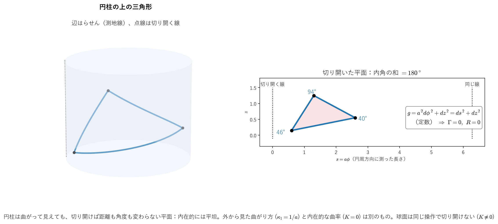

*内在的な曲率と、外から見た曲がり方は別のもの。円柱は外から見ると曲がっている（$\kappa_1=1/a$）が、切り開けば距離も角度も変わらない平面になり、計量 $g=ds^2+dz^2$ は定数で $\Gamma=0,\ R=0$、つまり $K=0$。上の三角形の内角の和はちょうど $180^\circ$。球面は同じ操作で切り開けない。*

<a id="p8-5"></a>

## 5. 実際に計算し、両者の一致を確認する

以前導出した$R_{\theta\phi\theta\phi}=a^2\sin^2\theta$を、§4-eの式に代入します：

$$
K = \frac{R_{\theta\phi\theta\phi}}{\det g} = \frac{a^2\sin^2\theta}{a^4\sin^2\theta} = \frac1{a^2}
$$

$$
\boxed{K=\frac1{a^2}}
$$

**§4-b・§4-c（外から見た定義）と、今回（内部だけで測った定義）が、寸分違わず一致しました。** これが、教科書でよく知られている、半径$a$の球面のガウス曲率です。**半径が大きいほど曲率が小さい**（大きな球ほど局所的には平らに見える）という直感とも整合します。極座標（Part VI）では $R=0$ になる（各自、上と同じ計算を極座標の $\Gamma$ に対して行うと、すべての項が打ち消し合ってゼロになることを確認できます）のに対し、球面では $R\ne0$ になる、という対比が「曲率とは何か」を最もクリアに示す最小例です。

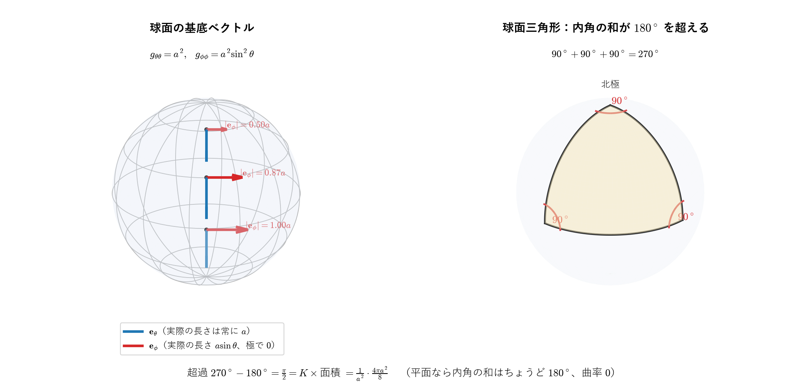

*左：球面の基底ベクトル。$\mathbf e_\theta$ の長さは常に $a$、$\mathbf e_\phi$ の長さは $a\sin\theta$ で極に近づくほど短い（$g_{\theta\theta}=a^2,\ g_{\phi\phi}=a^2\sin^2\theta$ の視覚化）。右：1/8球面の三角形は3つの角がすべて $90^\circ$ で、内角の和は $270^\circ$。$180^\circ$ からの超過 $\frac\pi2$ は $K\times$面積 $=\frac1{a^2}\cdot\frac{4\pi a^2}8$ に等しい。*

ここまでに出てきた曲面を並べると、次のようになります。

| 曲面 | 主曲率 $\kappa_1,\kappa_2$ | ガウス曲率 $K=\kappa_1\kappa_2$ | 内在的に平坦か | 測地三角形の内角の和 |
|---|---|---|---|---|
| 平面 | $0,\ 0$ | $0$ | 平坦 | $=\pi$ |
| 円柱（半径 $a$） | $1/a,\ 0$ | $0$ | 平坦（切り開ける） | $=\pi$ |
| 球（半径 $a$） | $1/a,\ 1/a$ | $1/a^2>0$ | 曲がっている | $>\pi$ |
| 鞍面 $z=(x^2-y^2)/2$ の原点 | $+1,\ -1$ | $-1<0$ | 曲がっている | $<\pi$ |

円柱は $\kappa_1\neq0$ なので外から見ると曲がっていますが、$K=0$ です。外から見た曲がり方と内在的な曲がり方は別物です。

---

<a id="p9"></a>

# Part IX：リッチテンソル・スカラー曲率（簡単な紹介のみ）

リーマン曲率テンソルは添字が4本あって扱いにくいので、縮約して情報を圧縮したものがよく使われます：

$$
\boxed{R_{ij} := R^k{}_{ikj}}\qquad\text{（リッチテンソル、2階）}
$$

$$
\boxed{R := g^{ij}R_{ij}}\qquad\text{（スカラー曲率、1つの数）}
$$

2次元の場合、スカラー曲率とガウス曲率の間には $R=2K$ という単純な関係があります（今回の球面の例なら $R=2/a^2$）。**この関係の導出、および一般の$(p,q)$型リッチテンソルの縮約の正当性（対称×反対称＝0の応用）、アインシュタイン方程式の紹介は、別ノート「リッチテンソル・スカラー曲率・アインシュタイン方程式」で最初から最後まで扱っています**（球面の具体例で$R_{\theta\theta}=1,R_{\phi\phi}=\sin^2\theta$を実際に計算し、$R=2/a^2$を導出済みです）。ここではこれ以上踏み込みません。

---

<a id="summary"></a>

# まとめ：全体の位置づけ

```
計量 g_ij（内積の表）
        │  微分（3つの式を組み合わせる）
        ▼
クリストッフェル記号 Γ^k_ij（基底ベクトルの変化率）
        │  ※ Γ自体はテンソルではない（極座標の例：Γ≠0でも空間は平坦）
        │
        ├─ 共変微分 ∇_jV^k = ∂_jV^k + Γ^k_ij V^i
        │      （基底の変化を補正した「正しい微分」）
        │
        ├─ 測地線方程式 q̈^k + Γ^k_ij q̇^i q̇^j = 0
        │      （曲線座標で見た「まっすぐな道」）
        │
        └─ リーマン曲率テンソル R^l_kij = ∂Γ-∂Γ+ΓΓ-ΓΓ
                （共変微分の非可換性、真の意味での「曲がり」）
                        │
                        ├─ 極座標（平坦）→ R=0
                        └─ 球面（曲がっている）→ R_θφθφ=a²sin²θ → ガウス曲率 K=1/a²
                                        │
                                        ▼
                        リッチテンソル R_ij、スカラー曲率 R=2K
                                        │
                                        ▼
                        （この先が一般相対論・アインシュタイン方程式）
```

上の図を、Mermaid の図にすると次のようになります。

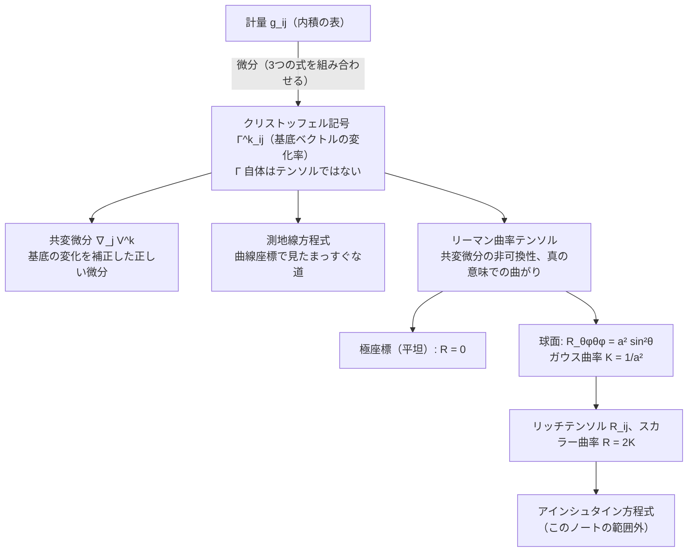
```mermaid
flowchart TD
    g["計量 g_ij（内積の表）"]
    G["クリストッフェル記号 Γ^k_ij（基底ベクトルの変化率）<br/>Γ 自体はテンソルではない"]
    N["共変微分 ∇_j V^k<br/>基底の変化を補正した正しい微分"]
    Geo["測地線方程式<br/>曲線座標で見たまっすぐな道"]
    R["リーマン曲率テンソル<br/>共変微分の非可換性、真の意味での曲がり"]
    Flat["極座標（平坦）: R = 0"]
    Sph["球面: R_θφθφ = a² sin²θ<br/>ガウス曲率 K = 1/a²"]
    Ric["リッチテンソル R_ij、スカラー曲率 R = 2K"]
    GR["アインシュタイン方程式<br/>（このノートの範囲外）"]

    g -->|"微分（3つの式を組み合わせる）"| G
    G --> N
    G --> Geo
    G --> R
    R --> Flat
    R --> Sph
    Sph --> Ric
    Ric --> GR
```

極座標（平面）と球面を並べると、次のようになります。

| | 極座標 $(r,\theta)$（平面） | 球面 $(\theta,\phi)$（半径 $a$） |
|---|---|---|
| 計量 | $g=\operatorname{diag}(1,\ r^2)$ | $g=\operatorname{diag}(a^2,\ a^2\sin^2\theta)$ |
| $\Gamma\neq0$ の成分 | $\Gamma^r{}_{\theta\theta}=-r,\ \ \Gamma^\theta{}_{r\theta}=\Gamma^\theta{}_{\theta r}=\dfrac1r$ | $\Gamma^\theta{}_{\phi\phi}=-\sin\theta\cos\theta,\ \ \Gamma^\phi{}_{\theta\phi}=\Gamma^\phi{}_{\phi\theta}=\cot\theta$ |
| リーマン曲率テンソル | $R=0$ | $R_{\theta\phi\theta\phi}=a^2\sin^2\theta\neq0$ |
| ガウス曲率 | $K=0$ | $K=1/a^2$ |
| 空間は曲がっているか | 曲がっていない（座標が曲線的なだけ） | 曲がっている |

今回の要点は、**「計量さえ与えられれば、クリストッフェル記号も曲率テンソルも、追加の仮定なしに完全に計算で決まる」**という点と、**「クリストッフェル記号がゼロでないことと、空間が曲がっていることはまったく別の話」**という点の2つでした。極座標という平坦な例と、球面という曲がった例を並べて実際に手を動かして計算することで、この違いが数字として体感できたと思います。一般相対論はこの続き（$R_{ij}$、$R$、そして物質のエネルギー・運動量テンソルを結びつけるアインシュタイン方程式）にありますが、そこは今回は扱わず、高階テンソルの入り口として、この位置で一区切りにします。

---

<a id="appA"></a>

# 付録A：ガウス・コダッツィ方程式の証明

<!-- part-toc:start -->

**この付録の内容**

- [A-0. 記法の確認（略記で式を追えなくならないように）](#A-0)
- [A-1. 準備：曲面をR^3の中に置く](#A-1)
- [A-2. ガウスの公式：r\_ij を「接する方向」と「法線方向」に分解する](#A-2)
- [A-3. ヴァインガルテンの公式：法線ベクトルnの微分](#A-3)
- [A-4. 3階微分を、2通りの順番で計算する](#A-4)
- [A-5. 3階微分の対称性を使う](#A-5)
- [A-6. 接する方向の係数を比較する ―ガウス方程式](#A-6)
- [A-7. 法線方向の係数を比較する ―コダッツィ・マイナルディ方程式](#A-7)
- [A-8. ガウス方程式から、K=R\_θφθφ/det g を導く（ガウスの驚異の定理の核心）](#A-8)
- [A-9. 球面の具体例で、最終確認](#A-9)
- [A-10. Wikipediaの「別の定義」も、同じ式であることの確認](#A-10)
- [A-11. L\_ijの名前と、テンソルであることの確認](#A-11)
- [まとめ](#A-sum)

<!-- part-toc:end -->

Part VIII §4で「今回は踏み込まない」としていた、**「外から見た主曲率の積」と「内部だけで測る$R_{\theta\phi\theta\phi}/\det g$」が、なぜ一致するのか**の証明を、最初から最後まで行います。使う道具は、この会話で何度も登場した**「3階微分の順序を入れ替えても同じ」**という性質、ただ1つです。

<a id="A-0"></a>

## A-0. 記法の確認（略記で式を追えなくならないように）

以下、$\mathbf r_i$、$\mathbf r_{ij}$という略記を使いますが、**これは単なる偏微分の言い換え**です：

$$
\boxed{\mathbf r_i := \frac{\partial\mathbf r}{\partial u^i} = \partial_i\mathbf r,\qquad \mathbf r_{ij} := \frac{\partial^2\mathbf r}{\partial u^i\partial u^j} = \partial_i\partial_j\mathbf r}
$$

（下付きの添字が増えるごとに、その添字方向への偏微分が1回増える、という意味です。$\mathbf r_{ijl}$なら$\partial_i\partial_j\partial_l\mathbf r$、というように、この先も同じ規則が続きます。）

<a id="A-1"></a>

## A-1. 準備：曲面を$\mathbb R^3$の中に置く

曲面を$\mathbf r(u^1,u^2)$（$\mathbb R^3$への埋め込み）とパラメータ表示します。接ベクトルを$\mathbf r_i:=\partial\mathbf r/\partial u^i$、単位法線ベクトルを$\mathbf n$（$\mathbf n\cdot\mathbf n=1$、$\mathbf n\cdot\mathbf r_i=0$、つまり$\mathbf n$は曲面に垂直）とします。

**第一基本形式（計量）**：$g_{ij}:=\mathbf r_i\cdot\mathbf r_j$（Part Iで扱った計量テンソルの定義そのものです）。

**第二基本形式**：$L_{ij}:=\mathbf r_{ij}\cdot\mathbf n$（$\mathbf r_{ij}=\partial_i\partial_j\mathbf r$、曲面の2階微分を、法線方向に射影したもの。「曲面が法線方向にどれだけ曲がっているか」を測る量です）。

<a id="A-2"></a>

## A-2. ガウスの公式：$\mathbf r_{ij}$ を「接する方向」と「法線方向」に分解する

$\mathbf r_{ij}$は$\mathbb R^3$の中の1つのベクトルなので、**$\{\mathbf r_1,\mathbf r_2,\mathbf n\}$という3本の基底で、必ず一意に展開できます**：

$$
\mathbf r_{ij} = (\text{接する方向の係数})\,\mathbf r_k + (\text{法線方向の係数})\,\mathbf n
$$

**接する方向の係数を求めます。** $g_{jl}=\mathbf r_j\cdot\mathbf r_l$を$u^i$で微分します（積の微分）：

$$
\partial_ig_{jl} = \mathbf r_{ij}\cdot\mathbf r_l+\mathbf r_j\cdot\mathbf r_{il}\tag{a}
$$

同様に、添字を入れ替えた2つの式も作ります（$\mathbf r_{ij}=\mathbf r_{ji}$、$\mathbf r_{jl}=\mathbf r_{lj}$のように、偏微分の順序を入れ替えても同じという性質を使っています）：

$$
\partial_jg_{il} = \mathbf r_{ij}\cdot\mathbf r_l+\mathbf r_i\cdot\mathbf r_{jl}\tag{b}
$$

$$
\partial_lg_{ij} = \mathbf r_{il}\cdot\mathbf r_j+\mathbf r_i\cdot\mathbf r_{jl}\tag{c}
$$

**(a)+(b)-(c)を計算します**（これは、Part IIでクリストッフェル記号を計量から導出したときと、まったく同じ組み合わせ方です）：

$$
\partial_ig_{jl}+\partial_jg_{il}-\partial_lg_{ij} = \big[\mathbf r_{ij}\cdot\mathbf r_l+\mathbf r_j\cdot\mathbf r_{il}\big]+\big[\mathbf r_{ij}\cdot\mathbf r_l+\mathbf r_i\cdot\mathbf r_{jl}\big]-\big[\mathbf r_{il}\cdot\mathbf r_j+\mathbf r_i\cdot\mathbf r_{jl}\big]
$$

$\mathbf r_j\cdot\mathbf r_{il}$と$-\mathbf r_{il}\cdot\mathbf r_j$（内積は順序によらないので同じもの）、$\mathbf r_i\cdot\mathbf r_{jl}$と$-\mathbf r_i\cdot\mathbf r_{jl}$が、それぞれ打ち消し合います：

$$
\partial_ig_{jl}+\partial_jg_{il}-\partial_lg_{ij} = 2\,\mathbf r_{ij}\cdot\mathbf r_l
$$

$$
\boxed{\mathbf r_{ij}\cdot\mathbf r_l = \frac12\big(\partial_ig_{jl}+\partial_jg_{il}-\partial_lg_{ij}\big)}
$$

**一方、$\mathbf r_{ij}=\Gamma^k{}_{ij}\mathbf r_k+L_{ij}\mathbf n$（分解したい形）の両辺と、$\mathbf r_l$の内積を取ると**（$\mathbf n\cdot\mathbf r_l=0$なので、$L_{ij}\mathbf n$の項は消えます）：

$$
\mathbf r_{ij}\cdot\mathbf r_l = \Gamma^k{}_{ij}(\mathbf r_k\cdot\mathbf r_l) = \Gamma^k{}_{ij}\,g_{kl}
$$

**2つの式を見比べます**：

$$
\Gamma^k{}_{ij}\,g_{kl} = \frac12\big(\partial_ig_{jl}+\partial_jg_{il}-\partial_lg_{ij}\big)
$$

**これは、Part IIで導出したクリストッフェル記号の定義式そのもの**です（両辺に逆計量$g^{lm}$を掛けて$l$について和を取れば、標準公式$\Gamma^m{}_{ij}=\frac12g^{lm}(\partial_ig_{jl}+\partial_jg_{il}-\partial_lg_{ij})$に戻ります）。**つまり、$\mathbf r_{ij}$の接する方向の係数は、確かにクリストッフェル記号$\Gamma^k{}_{ij}$に一致することが、計算で確認できました。** 法線方向の係数は、定義よりそのまま$L_{ij}$です（$\mathbf r_{ij}\cdot\mathbf n=L_{ij}$、$\mathbf n\cdot\mathbf n=1$なので）。

$$
\boxed{\mathbf r_{ij} = \Gamma^k{}_{ij}\,\mathbf r_k + L_{ij}\,\mathbf n}\qquad\text{（ガウスの公式）}
$$

**これは、Part I（$\dfrac{\partial\mathbf e_i}{\partial q^j}=\Gamma^k{}_{ij}\mathbf e_k$）の直接の延長です。** あのときは曲面（あるいは空間）の内部の話だけでしたが、今回は外側の$\mathbb R^3$まで含めて展開したので、**内部方向（$\Gamma$）に加えて、外にはみ出す法線方向（$L_{ij}$）の項が、新たに追加された**、という構造です。

<a id="A-3"></a>

## A-3. ヴァインガルテンの公式：法線ベクトル$\mathbf n$の微分

$\mathbf n\cdot\mathbf r_k=0$を$u^i$で微分します（積の微分）：

$$
\mathbf n_i\cdot\mathbf r_k + \mathbf n\cdot\mathbf r_{ik} = 0 \quad\Longrightarrow\quad \mathbf n_i\cdot\mathbf r_k = -\mathbf n\cdot\mathbf r_{ik} = -L_{ik}
$$

また、$\mathbf n\cdot\mathbf n=1$を微分すると$2\mathbf n\cdot\mathbf n_i=0$、つまり$\mathbf n_i$は$\mathbf n$と直交する（＝曲面に接する）ベクトルです。したがって$\mathbf n_i$は$\mathbf r_1,\mathbf r_2$だけで展開できます：$\mathbf n_i=c^k\mathbf r_k$。$\mathbf n_i\cdot\mathbf r_j=c^kg_{kj}$と、先ほど求めた$\mathbf n_i\cdot\mathbf r_j=-L_{ij}$を見比べると、$c^kg_{kj}=-L_{ij}$という式が得られます。ここから、$c^k$を単独で表す形に変形します。

**ステップ1**：両辺に逆計量$g^{jm}$を掛けて、$j$について和を取ります：

$$
(c^kg_{kj})g^{jm} = (-L_{ij})g^{jm}
$$

**右辺の$(-L_{ij})g^{jm}$を、省略せず計算します**。$-L_{ij}=(-1)\times L_{ij}$（マイナスは「$-1$を掛ける」という、ただの掛け算）なので：

$$
(-L_{ij})\times g^{jm} = \big[(-1)\times L_{ij}\big]\times g^{jm}
$$

掛け算の順序は自由に並べ替えられる（交換法則）ので、$-1$を外側にくくり出せます：

$$
= (-1)\times\big(L_{ij}\times g^{jm}\big) = -\big(g^{jm}L_{ij}\big) = -g^{jm}L_{ij}
$$

（$-1$は、$L_{ij}$や$g^{jm}$のどちらにも"吸収"されず、掛け算の外側に、そのまま独立して残ります。）

**左辺は**$g_{kj}g^{jm}=\delta_k^m$（計量と逆計量の積）を使って整理します：

$$
c^k\delta_k^m = -g^{jm}L_{ij} \quad\Longrightarrow\quad c^m = -g^{jm}L_{ij}
$$

（マイナス符号は、逆計量を掛けるという操作の影響を受けず、そのまま保持されます。）

**ステップ2**：自由な添字$m$を$k$に付け替えます（表記を揃えるだけの言い換えです）：

$$
c^k = -g^{jk}L_{ij}
$$

**ステップ3**：$L_i{}^k:=g^{jk}L_{ij}$（マイナスを含まない、単なる添字上げの定義）と書くと、$c^k=-g^{jk}L_{ij}=-\big(g^{jk}L_{ij}\big)=-L_i{}^k$——**マイナスは、$L_i{}^k$の定義の外側に、そのまま残ります**。これを使うと：

$$
\boxed{\mathbf n_i = -L_i{}^k\,\mathbf r_k}\qquad\text{（ヴァインガルテンの公式）}
$$

$L_i{}^k$は、$L_{ij}$の添字を1つ上げた表示であり（$V^i$と$V_i$の関係と同様）、別の対象ではない。ヴァインガルテンの公式が主張しているのは、「$\mathbf n_i$（$\mathbf n$の微分）が接ベクトル$\mathbf r_k$の組み合わせで書ける」ことであり、$\mathbf n$自体が$\mathbf r_k$の組み合わせになるわけではない。$\mathbf n_i$が接ベクトルの組み合わせになるのは、上で確認した通り$\mathbf n\cdot\mathbf n=1$の微分から$\mathbf n_i$が$\mathbf n$と直交し、接平面（$\mathbf r_1,\mathbf r_2$が張る面）の中に収まるためである。

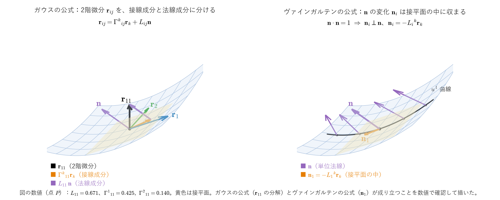

*左：曲面上の1点で、接ベクトル $\mathbf r_1,\mathbf r_2$（青・緑）と単位法線 $\mathbf n$（紫）。2階微分 $\mathbf r_{11}$（黒）は、接する方向の成分 $\Gamma^k{}_{11}\mathbf r_k$（橙、内部の量）と、法線方向の成分 $L_{11}\mathbf n$（紫、外から見た量）に分かれる。右：曲線に沿って $\mathbf n$ を動かすと、その変化 $\mathbf n_1$（橙）は接平面（黄）の中にあり、$\mathbf n_1=-L_1{}^k\mathbf r_k$ と書ける。図の値は、この2つの公式が成り立つことを数値で確認して描いた。*

<a id="A-4"></a>

## A-4. 3階微分を、2通りの順番で計算する

A-2, A-3で、$\mathbf r_{ij}$（接する方向＋法線方向）と$\mathbf n_i$（接する方向のみ）の分解を得た。この2つの分解の中に、$\Gamma$（内部の量）と$L$（外から見た量）が同時に現れており、両者の関係を引き出すには、この分解をもう一段先まで使う必要がある。そこで、$\mathbf r_{ij}$をもう1回微分した$\mathbf r_{ijl}:=\partial_l(\mathbf r_{ij})$を、順序を変えた2通りの経路（先に$j$方向、後に$l$方向／その逆）で計算し、両者が等しいという条件（A-5で使う、混合偏微分の対称性）から、$\Gamma$と$L$の関係式を導く。まず、$\mathbf r_{ijl}$を、A-2のガウスの公式に代入して計算する：

$$
\mathbf r_{ijl} = \partial_l\big(\Gamma^k{}_{ij}\mathbf r_k+L_{ij}\mathbf n\big) = (\partial_l\Gamma^k{}_{ij})\mathbf r_k+\Gamma^k{}_{ij}\mathbf r_{kl}+(\partial_lL_{ij})\mathbf n+L_{ij}\mathbf n_l
$$

$\mathbf r_{kl}$（もう一度ガウスの公式）と$\mathbf n_l$（ヴァインガルテンの公式）を代入します：

$$
\mathbf r_{ijl} = (\partial_l\Gamma^k{}_{ij})\mathbf r_k+\Gamma^k{}_{ij}\big(\Gamma^m{}_{kl}\mathbf r_m+L_{kl}\mathbf n\big)+(\partial_lL_{ij})\mathbf n+L_{ij}\big(-L_l{}^m\mathbf r_m\big)
$$

**最後の項$L_{ij}\big(-L_l{}^m\mathbf r_m\big)$を、省略せず計算します**。$-L_l{}^m\mathbf r_m=(-1)\times L_l{}^m\times\mathbf r_m$なので：

$$
L_{ij}\times\big[(-1)\times L_l{}^m\times\mathbf r_m\big] = (-1)\times\big(L_{ij}\times L_l{}^m\big)\times\mathbf r_m = -\big(L_{ij}L_l{}^m\big)\mathbf r_m
$$

（掛け算の順序を入れ替えて、$-1$を外側にくくり出しただけです。$L_{ij},L_l{}^m$はどちらもただの数なので、掛け算の交換法則がそのまま使えます。）つまり：

$$
L_{ij}\big(-L_l{}^m\mathbf r_m\big) = -L_{ij}L_l{}^m\,\mathbf r_m
$$

**接する方向（$\mathbf r_m$）の係数**を1箇所にまとめるため、第1項の添字$k$を$m$に付け替えます：

$$
\mathbf r_{ijl} = \Big[(\partial_l\Gamma^m{}_{ij})+\Gamma^k{}_{ij}\Gamma^m{}_{kl}-L_{ij}L_l{}^m\Big]\mathbf r_m + \Big[\Gamma^k{}_{ij}L_{kl}+\partial_lL_{ij}\Big]\mathbf n\tag{$\ast$}
$$

**まったく同じ手順で、$j$と$l$を入れ替えた$\mathbf r_{ilj}:=\partial_j(\mathbf r_{il})$も計算します**：

$$
\mathbf r_{ilj} = \Big[(\partial_j\Gamma^m{}_{il})+\Gamma^k{}_{il}\Gamma^m{}_{kj}-L_{il}L_j{}^m\Big]\mathbf r_m + \Big[\Gamma^k{}_{il}L_{kj}+\partial_jL_{il}\Big]\mathbf n\tag{$\ast\ast$}
$$

<a id="A-5"></a>

## A-5. 3階微分の対称性を使う

$\mathbf r_{ijl}=\partial_l\partial_j\partial_i\mathbf r$、$\mathbf r_{ilj}=\partial_j\partial_l\partial_i\mathbf r$は、**偏微分の順序を入れ替えても同じ**（この会話で何度も使った、混合偏微分の対称性）なので：

$$
\boxed{\mathbf r_{ijl} = \mathbf r_{ilj}}
$$

$\{\mathbf r_1,\mathbf r_2,\mathbf n\}$は（曲面上の各点で）互いに1次独立な基底なので、式$(\ast)$と式$(\ast\ast)$を見比べると、「接する方向の係数」同士、「法線方向の係数」同士が、それぞれ独立に一致しなければなりません。

<a id="A-6"></a>

## A-6. 接する方向の係数を比較する ―ガウス方程式

$$
(\partial_l\Gamma^m{}_{ij})+\Gamma^k{}_{ij}\Gamma^m{}_{kl}-L_{ij}L_l{}^m = (\partial_j\Gamma^m{}_{il})+\Gamma^k{}_{il}\Gamma^m{}_{kj}-L_{il}L_j{}^m
$$

移項して整理します：

$$
\Big[\partial_l\Gamma^m{}_{ij}-\partial_j\Gamma^m{}_{il}\Big]+\Big[\Gamma^k{}_{ij}\Gamma^m{}_{kl}-\Gamma^k{}_{il}\Gamma^m{}_{kj}\Big] = L_{ij}L_l{}^m-L_{il}L_j{}^m
$$

**左辺が、以前導出したリーマン曲率テンソルの公式$R^p{}_{qrs}=\partial_r\Gamma^p{}_{sq}-\partial_s\Gamma^p{}_{rq}+\Gamma^p{}_{rt}\Gamma^t{}_{sq}-\Gamma^p{}_{st}\Gamma^t{}_{rq}$の、どの成分に対応するかを、実際に代入して確認します。** $p=m,q=i,r=l,s=j$を代入します：

$$
R^m{}_{ilj} = \partial_l\Gamma^m{}_{ji}-\partial_j\Gamma^m{}_{li}+\Gamma^m{}_{lt}\Gamma^t{}_{ji}-\Gamma^m{}_{jt}\Gamma^t{}_{li}
$$

$\Gamma$の下2添字対称性（$\Gamma^m{}_{ji}=\Gamma^m{}_{ij}$、$\Gamma^m{}_{li}=\Gamma^m{}_{il}$、$\Gamma^t{}_{ji}=\Gamma^t{}_{ij}$、$\Gamma^t{}_{li}=\Gamma^t{}_{il}$）を使って書き換えます：

$$
R^m{}_{ilj} = \partial_l\Gamma^m{}_{ij}-\partial_j\Gamma^m{}_{il}+\Gamma^m{}_{lt}\Gamma^t{}_{ij}-\Gamma^m{}_{jt}\Gamma^t{}_{il}
$$

**これを、先ほどの左辺$\big[\partial_l\Gamma^m{}_{ij}-\partial_j\Gamma^m{}_{il}\big]+\big[\Gamma^k{}_{ij}\Gamma^m{}_{kl}-\Gamma^k{}_{il}\Gamma^m{}_{kj}\big]$と、項ごとに照合します**。

最初の2項（$\partial_l\Gamma^m{}_{ij}-\partial_j\Gamma^m{}_{il}$）は、両方とも完全に同じ形です。

残り2項について：$\Gamma^k{}_{ij}\Gamma^m{}_{kl}$は、掛け算の順序を入れ替え（$\Gamma^m{}_{kl}\Gamma^k{}_{ij}$）、$\Gamma$の対称性（$\Gamma^m{}_{kl}=\Gamma^m{}_{lk}$）を使うと$\Gamma^m{}_{lk}\Gamma^k{}_{ij}$となり、ダミー添字$k\to t$と付け替えれば$\Gamma^m{}_{lt}\Gamma^t{}_{ij}$——**$R^m{}_{ilj}$の第3項と完全に一致します。**

同様に、$-\Gamma^k{}_{il}\Gamma^m{}_{kj}$も、順序を入れ替えて$\Gamma$の対称性（$\Gamma^m{}_{kj}=\Gamma^m{}_{jk}$）を使うと$-\Gamma^m{}_{jk}\Gamma^k{}_{il}$、ダミー添字$k\to t$と付け替えれば$-\Gamma^m{}_{jt}\Gamma^t{}_{il}$——**$R^m{}_{ilj}$の第4項と完全に一致します。**

**4項すべてが一致したので、左辺$=R^m{}_{ilj}$であることが、実際の計算で確認できました：**

$$
\boxed{R^m{}_{ilj} = L_{ij}L_l{}^m-L_{il}L_j{}^m}\qquad\text{（ガウス方程式）}
$$

**これが、"外から見た量"（$L_{ij}$、第二基本形式）と"内部だけで測る量"（$R^m{}_{ilj}$、リーマン曲率テンソル）を結びつける、ガウス方程式です。**

<a id="A-7"></a>

## A-7. 法線方向の係数を比較する ―コダッツィ・マイナルディ方程式

$$
\Gamma^k{}_{ij}L_{kl}+\partial_lL_{ij} = \Gamma^k{}_{il}L_{kj}+\partial_jL_{il}
$$

移項すると：

$$
\boxed{\partial_lL_{ij}-\partial_jL_{il} = \Gamma^k{}_{il}L_{kj}-\Gamma^k{}_{ij}L_{kl}}\qquad\text{（コダッツィ・マイナルディ方程式）}
$$

これは、**第二基本形式$L_{ij}$が、勝手な値を取れるわけではなく、この関係式を満たすように制約されている**ことを示す式です（ガウス方程式と合わせて、「ガウス・コダッツィ方程式」と呼ばれます）。今回の目的（ガウス曲率の一致）には直接使いませんが、対になる重要な式として、名前だけ記しておきます。

A-2 から A-7 の流れを図にまとめると、次のようになります。

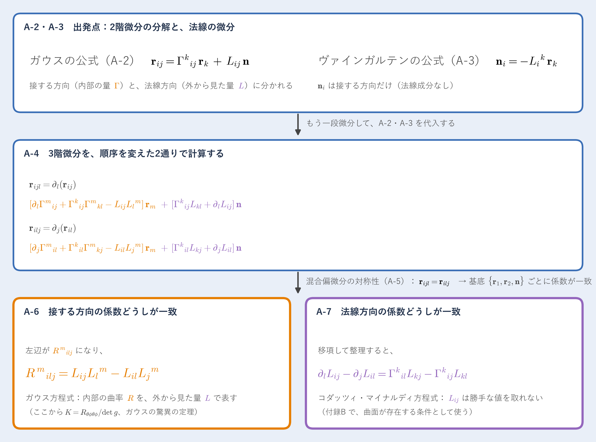

*ガウスの公式とヴァインガルテンの公式（A-2, A-3）を代入して、3階微分 $\mathbf r_{ijl}$ を2通りの順序で計算する（A-4）。混合偏微分の対称性 $\mathbf r_{ijl}=\mathbf r_{ilj}$（A-5）から、基底 $\{\mathbf r_1,\mathbf r_2,\mathbf n\}$ ごとに係数が一致する。接する方向（橙）の一致がガウス方程式（A-6）、法線方向（紫）の一致がコダッツィ・マイナルディ方程式（A-7）になる。*

<a id="A-8"></a>

## A-8. ガウス方程式から、$K=R_{\theta\phi\theta\phi}/\det g$ を導く（ガウスの驚異の定理の核心）

**A-6のガウス方程式の、添字を下げた形**を使います。出発点はガウス方程式$R^m{}_{ilj}=L_{ij}L_l{}^m-L_{il}L_j{}^m$です。**両辺に$g_{mn}$を掛けて、$m$について和を取ります**：

$$
g_{mn}R^m{}_{ilj} = g_{mn}\big(L_{ij}L_l{}^m-L_{il}L_j{}^m\big) = L_{ij}\big(g_{mn}L_l{}^m\big)-L_{il}\big(g_{mn}L_j{}^m\big)
$$

（右辺は、$L_{ij},L_{il}$を掛け算の外にくくり出しただけです。）**$g_{mn}L_l{}^m$を、$L_l{}^m$の定義$L_l{}^m:=g^{mp}L_{lp}$に戻して計算します**：

$$
g_{mn}L_l{}^m = g_{mn}\big(g^{mp}L_{lp}\big) = \big(g_{mn}g^{mp}\big)L_{lp}
$$

$g_{mn}g^{mp}=\delta_n^p$（計量と逆計量の積、クロネッカーのデルタ）なので：

$$
g_{mn}L_l{}^m = \delta_n^p\,L_{lp} = L_{ln}
$$

（$\delta_n^p$が、$p=n$の項だけを生き残らせます。）同様に$g_{mn}L_j{}^m=L_{jn}$。これらを代入すると：

$$
R_{nilj} = L_{ij}L_{ln}-L_{il}L_{jn}\qquad(R_{nilj}:=g_{mn}R^m{}_{ilj})
$$

**2次元（$i,j,l,n\in\{\theta,\phi\}$）で、具体的に$n=\theta,i=\phi,l=\theta,j=\phi$を代入します**：

$$
R_{\theta\phi\theta\phi} = L_{\phi\phi}L_{\theta\theta}-L_{\phi\theta}L_{\phi\theta} = L_{\theta\theta}L_{\phi\phi}-L_{\theta\phi}^2 = \det L
$$

$$
\boxed{R_{\theta\phi\theta\phi} = \det L}
$$

**一方、ガウス曲率の古典的な定義（Part VIII §4-cで確認済み）は$K=\dfrac{\det L}{\det g}$でした。** これに、今導出した$\det L=R_{\theta\phi\theta\phi}$を代入すると：

$$
\boxed{K = \frac{\det L}{\det g} = \frac{R_{\theta\phi\theta\phi}}{\det g}}
$$

**これで証明が完成しました。** 「外から見た定義（主曲率の積、$\det L/\det g$）」と「内部だけで測る定義（$R_{\theta\phi\theta\phi}/\det g$）」は、**$R_{\theta\phi\theta\phi}=\det L$というガウス方程式（A-6の結果）を通じて、実は同じもの**だったのです。

<a id="A-9"></a>

## A-9. 球面の具体例で、最終確認

Part VIII §4-cで、球面の第二基本形式は$L_{\theta\theta}=-a,\ L_{\phi\phi}=-a\sin^2\theta,\ L_{\theta\phi}=0$と計算済みでした：

$$
\det L = (-a)(-a\sin^2\theta)-0^2 = a^2\sin^2\theta
$$

一方、Part VIIIで直接計算した$R_{\theta\phi\theta\phi}=a^2\sin^2\theta$（リーマン曲率テンソルから）と、**完全に一致しています**。今回の抽象的な証明（A-6）が、この具体的な数値でも裏付けられました。

<a id="A-10"></a>

## A-10. Wikipediaの「別の定義」も、同じ式であることの確認

日本語版Wikipedia「ガウス曲率」のページには、次の式が載っています：

$$
K = \frac{\big\langle(\nabla_2\nabla_1-\nabla_1\nabla_2)\mathbf e_1,\ \mathbf e_2\big\rangle}{\det g}
$$

（$\nabla_i:=\nabla_{\mathbf e_i}$は共変微分、$\mathbf e_1,\mathbf e_2$は座標基底ベクトル。）**これが、私たちの$K=R_{\theta\phi\theta\phi}/\det g$と、同じ式であることを確認します。**

**ステップ1**：リー微分のノートPart IX §19の、座標に依らないリーマン曲率テンソルの定義

$$
R(X,Y)Z = \nabla_X\nabla_YZ-\nabla_Y\nabla_XZ-\nabla_{[X,Y]}Z
$$

に、$X=\mathbf e_2,Y=\mathbf e_1,Z=\mathbf e_1$（$\mathbf e_1=\partial_\theta,\mathbf e_2=\partial_\phi$）を代入します。**座標基底同士のリー括弧は必ずゼロ**（$[\mathbf e_i,\mathbf e_j]=0$、リー微分のノートPart III §5）なので、$-\nabla_{[X,Y]}Z$の項が自動的に消えます：

$$
R(\mathbf e_2,\mathbf e_1)\mathbf e_1 = \nabla_2\nabla_1\mathbf e_1-\nabla_1\nabla_2\mathbf e_1
$$

つまり、Wikipediaの$(\nabla_2\nabla_1-\nabla_1\nabla_2)\mathbf e_1$は、$R(\mathbf e_2,\mathbf e_1)\mathbf e_1$のことです。

**ステップ2**：これを、Part VII §2の添字を使った定義$(\nabla_i\nabla_j-\nabla_j\nabla_i)V^l=R^l{}_{kij}V^k$と対応させます。$Z=\mathbf e_1=\partial_\theta$（成分$V^k=\delta^k_\theta$）、$i=\phi,j=\theta$（$\nabla_\phi\nabla_\theta-\nabla_\theta\nabla_\phi$）とすると：

$$
(\nabla_\phi\nabla_\theta-\nabla_\theta\nabla_\phi)\mathbf e_\theta = R^l{}_{\theta\phi\theta}\,\mathbf e_l
$$

**ステップ3**：$\mathbf e_\phi$との内積を取ります（$\langle\mathbf e_l,\mathbf e_\phi\rangle=g_{l\phi}$なので、$l=\phi$の項だけが残ります）：

$$
\big\langle(\nabla_\phi\nabla_\theta-\nabla_\theta\nabla_\phi)\mathbf e_\theta,\ \mathbf e_\phi\big\rangle = R^\phi{}_{\theta\phi\theta}\,g_{\phi\phi}
$$

**ステップ4**：$R^\phi{}_{\theta\phi\theta}$を、以前と同じ公式に直接代入して計算します（$l=\phi,k=\theta,i=\phi,j=\theta$）：

$$
R^\phi{}_{\theta\phi\theta} = \partial_\phi\Gamma^\phi{}_{\theta\theta}-\partial_\theta\Gamma^\phi{}_{\phi\theta}+\Gamma^\phi{}_{\phi m}\Gamma^m{}_{\theta\theta}-\Gamma^\phi{}_{\theta m}\Gamma^m{}_{\phi\theta}
$$

$\Gamma^\phi{}_{\theta\theta}=0$（定数）なので$\partial_\phi\Gamma^\phi{}_{\theta\theta}=0$。$\Gamma^\phi{}_{\phi\theta}=\cot\theta$なので$\partial_\theta\Gamma^\phi{}_{\phi\theta}=\partial_\theta(\cot\theta)=-1/\sin^2\theta$、したがって$-\partial_\theta\Gamma^\phi{}_{\phi\theta}=1/\sin^2\theta$。$\Gamma^m{}_{\theta\theta}=0$（全ての$m$）なので第3項はゼロ。$\Gamma^\phi{}_{\theta m}\Gamma^m{}_{\phi\theta}$は$m=\phi$の項だけ残り、$\Gamma^\phi{}_{\theta\phi}\Gamma^\phi{}_{\phi\theta}=\cot\theta\cdot\cot\theta=\cot^2\theta$：

$$
R^\phi{}_{\theta\phi\theta} = 0+\frac1{\sin^2\theta}+0-\cot^2\theta = \frac{1-\cos^2\theta}{\sin^2\theta} = \frac{\sin^2\theta}{\sin^2\theta} = 1
$$

したがって：

$$
\big\langle(\nabla_\phi\nabla_\theta-\nabla_\theta\nabla_\phi)\mathbf e_\theta,\ \mathbf e_\phi\big\rangle = R^\phi{}_{\theta\phi\theta}\,g_{\phi\phi} = 1\cdot a^2\sin^2\theta = a^2\sin^2\theta
$$

**ステップ5**：Wikipediaの式の$(\nabla_2\nabla_1-\nabla_1\nabla_2)\mathbf e_1$は、$1=\theta,2=\phi$と対応させると、まさに$(\nabla_\phi\nabla_\theta-\nabla_\theta\nabla_\phi)\mathbf e_\theta$そのものです（順序の入れ替えや符号の反転は不要です）：

$$
\big\langle(\nabla_2\nabla_1-\nabla_1\nabla_2)\mathbf e_1,\mathbf e_2\big\rangle = \big\langle(\nabla_\phi\nabla_\theta-\nabla_\theta\nabla_\phi)\mathbf e_\theta,\mathbf e_\phi\big\rangle = a^2\sin^2\theta
$$

**これは、以前直接計算した$R_{\theta\phi\theta\phi}=a^2\sin^2\theta$と、完全に一致します。**

**結論**：

$$
K = \frac{\big\langle(\nabla_2\nabla_1-\nabla_1\nabla_2)\mathbf e_1,\mathbf e_2\big\rangle}{\det g} = \frac{a^2\sin^2\theta}{a^4\sin^2\theta} = \frac1{a^2}
$$

**Wikipediaの「別の定義」は、私たちの$K=R_{\theta\phi\theta\phi}/\det g$と、まったく同じ式でした。** $\langle(\nabla_2\nabla_1-\nabla_1\nabla_2)\mathbf e_1,\mathbf e_2\rangle$という書き方は、$R^l{}_{kij}$という添字だらけの表記を経由せず、「共変微分を2回、順番を変えて引いたものを、内積で1つの数に落とし込む」という、座標に依らない言い方をしているだけです。

<a id="A-11"></a>

## A-11. $L_{ij}$の名前と、テンソルであることの確認

**名前**：$L_{ij}=\mathbf r_{ij}\cdot\mathbf n$は、正式には**第二基本形式**（second fundamental form）と呼ばれます。一般相対論の文脈（時空を空間的な断面に"薄切り"にするADM形式）では、まったく同じ対象が**外的曲率**（extrinsic curvature）と呼ばれ、$K_{ij}$という記号が使われます（ガウス曲率の$K$と紛らわしいですが、歴史的にこの記号が定着しています）。

**$L_{ij}$がテンソルであることの確認**：$\mathbf r_{ij}=\partial_i\partial_j\mathbf r$自体は、クリストッフェル記号がテンソルでなかったのと同じ理由で、単独ではテンソルになりません（座標変換で余計な項がつきます）。**$\mathbf n$との内積を取ることで、その余計な項がちょうど消える**、というのが、$L_{ij}$がテンソルになる本当の理由です。

**記法**：$u^i$は元の座標、$\tilde u^i$は新しい座標である（どちらも添字$i$は$1,2$を走る）。チルダは添字ではなく、**どの座標系の成分か**を区別するための記号である。添字の文字だけでは区別できない（添字は自由に付け替えてよいため）ので、座標そのものに印を付けている。Part I〜VIIIの$x^a\to q^i$（デカルト座標から曲線座標）は、この特別な場合（$u^k=x^a$、$\tilde u^i=q^i$）にあたり、$\partial u^k/\partial\tilde u^i$はヤコビアン$J^a{}_i$に対応する。

座標変換$u^i\to\tilde u^i$のもとで、$\mathbf r_i$は$\tilde{\mathbf r}_i=\dfrac{\partial u^k}{\partial\tilde u^i}\mathbf r_k$と変換します。これをもう一度$\tilde u^j$で微分します。$\dfrac{\partial u^k}{\partial\tilde u^i}$（係数）と$\mathbf r_k$（本体）の積なので、積の微分で2項に分かれます：

$$
\tilde{\mathbf r}_{ij} = \underbrace{\frac{\partial}{\partial\tilde u^j}\left(\frac{\partial u^k}{\partial\tilde u^i}\right)\mathbf r_k}_{\text{項A}} + \underbrace{\frac{\partial u^k}{\partial\tilde u^i}\cdot\frac{\partial\mathbf r_k}{\partial\tilde u^j}}_{\text{項B}}
$$

**項A**はそのまま$\dfrac{\partial^2u^k}{\partial\tilde u^i\partial\tilde u^j}\mathbf r_k$です。

**項Bの計算には注意が必要です。** $\mathbf r_k$は元の座標$u^1,u^2$の関数なので、これを新しい座標$\tilde u^j$で微分するには連鎖律が必要です：

$$
\frac{\partial\mathbf r_k}{\partial\tilde u^j} = \frac{\partial u^l}{\partial\tilde u^j}\cdot\frac{\partial\mathbf r_k}{\partial u^l} = \frac{\partial u^l}{\partial\tilde u^j}\,\mathbf r_{kl}\qquad(l\text{について和})
$$

**この連鎖律が、$k$とは別の、新しいダミー添字$l$を生みます。** $k$は最初から（$\tilde{\mathbf r}_i$の定義の時点で）あった添字、$l$は今回$\mathbf r_k$をもう一度微分したことで新たに必要になった添字です。これを項Bに代入すると：

$$
\text{項B} = \frac{\partial u^k}{\partial\tilde u^i}\cdot\frac{\partial u^l}{\partial\tilde u^j}\,\mathbf r_{kl}
$$

両方をまとめると：

$$
\tilde{\mathbf r}_{ij} = \frac{\partial^2u^k}{\partial\tilde u^i\partial\tilde u^j}\,\mathbf r_k + \frac{\partial u^k}{\partial\tilde u^i}\cdot\frac{\partial u^l}{\partial\tilde u^j}\,\mathbf r_{kl}
$$

**この形と、以下で使う形とでは、$k,l$の添字の配置（どちらが$\tilde u^i$に、どちらが$\tilde u^j$に付くか）が異なって見えます。** $k,l$はどちらも和を取るダミー添字なので、$k\leftrightarrow l$と名前を入れ替えます（値は変わりません）：

$$
\frac{\partial u^k}{\partial\tilde u^i}\cdot\frac{\partial u^l}{\partial\tilde u^j}\,\mathbf r_{kl} \ \xrightarrow{\ k\leftrightarrow l\ }\ \frac{\partial u^l}{\partial\tilde u^i}\cdot\frac{\partial u^k}{\partial\tilde u^j}\,\mathbf r_{lk}
$$

$\mathbf r_{lk}=\mathbf r_{kl}$（$\mathbf r_{kl}=\partial_k\partial_l\mathbf r$は混合偏微分の対称性から、添字の順序によらない）なので：

$$
= \frac{\partial u^k}{\partial\tilde u^j}\cdot\frac{\partial u^l}{\partial\tilde u^i}\,\mathbf r_{kl}
$$

**これで、以下の式の配置と一致します**：

$$
\tilde{\mathbf r}_{ij} = \frac{\partial^2u^k}{\partial\tilde u^i\partial\tilde u^j}\mathbf r_k + \frac{\partial u^k}{\partial\tilde u^j}\frac{\partial u^l}{\partial\tilde u^i}\mathbf r_{kl}
$$

**第1項（$\dfrac{\partial^2u^k}{\partial\tilde u^i\partial\tilde u^j}\mathbf r_k$）が、クリストッフェル記号がテンソルでなくなる原因と同じ、余計な"加速度"の項**です。両辺と$\mathbf n$の内積を取ります：

$$
\tilde L_{ij} = \tilde{\mathbf r}_{ij}\cdot\mathbf n = \frac{\partial^2u^k}{\partial\tilde u^i\partial\tilde u^j}(\mathbf r_k\cdot\mathbf n) + \frac{\partial u^k}{\partial\tilde u^j}\frac{\partial u^l}{\partial\tilde u^i}(\mathbf r_{kl}\cdot\mathbf n)
$$

**第1項の$\mathbf r_k\cdot\mathbf n$は、$\mathbf n$の定義（曲面に垂直、$\mathbf n\cdot\mathbf r_k=0$、A-1で確認済み）から、常にゼロです。** つまり、余計な項が、$\mathbf n$との内積を取った瞬間に、自動的に消えます：

$$
\boxed{\tilde L_{ij} = \frac{\partial u^k}{\partial\tilde u^j}\frac{\partial u^l}{\partial\tilde u^i}L_{kl}}
$$

**これは、正真正銘のテンソルの変換則**です（計量$g_{ij}$とまったく同じ変換の仕方）。「2階微分と法線ベクトルの内積だからテンソル」という直感は結果として正しいのですが、正確には**「$\mathbf n$が曲面に垂直である（$\mathbf r_k\cdot\mathbf n=0$）という特別な性質のおかげで、テンソルでない部分がちょうど消えた」**という理由でした。

<a id="A-sum"></a>

## まとめ

$$
\boxed{
\begin{aligned}
&\text{ガウスの公式：}\mathbf r_{ij}=\Gamma^k{}_{ij}\mathbf r_k+L_{ij}\mathbf n\text{（曲面の2階微分を、接する方向と法線方向に分解）}\\
&\text{ヴァインガルテンの公式：}\mathbf n_i=-L_i{}^m\mathbf r_m\text{（法線ベクトルの微分は、接する方向だけを向く）}\\
&\text{3階微分}\mathbf r_{ijl}=\mathbf r_{ilj}\text{（混合偏微分の対称性）から、接する成分の一致がガウス方程式}R^m{}_{ilj}=L_{ij}L_l{}^m-L_{il}L_j{}^m\text{を生む}\\
&\text{2次元に特殊化すると}R_{\theta\phi\theta\phi}=\det L\text{、これと}K=\det L/\det g\text{（古典的定義）を合わせて}K=R_{\theta\phi\theta\phi}/\det g\text{が証明される}
\end{aligned}
}
$$

「ガウスの驚異の定理」という名前が意味しているのは、**「$K$（外から見た曲がり方）が、実は曲面を外から眺めなくても、内部の計量だけから計算できる」**という、当時としては驚くべき発見でした。その核心は、$\mathbb R^3$という外側の空間での**「3階微分の順序を入れ替えても同じ」**という、この会話の最初期（ラプラシアンの導出）から繰り返し使ってきた、ごく基礎的な性質に、最終的には帰着していました。

---

<a id="appB"></a>

# 付録B：曲面が存在するための条件（ボネの定理）

<!-- part-toc:start -->

**この付録の内容**

- [B-0. 前提知識](#B-0)
  - [B-0-1. (0,2)型テンソルの共変微分](#B-0-1)
  - [B-0-2. 計量の共変微分はゼロ（∇ g=0）](#B-0-2)
  - [B-0-3. トレースと平均曲率](#B-0-3)
  - [B-0-4. ノルムと、線形常微分方程式の解の存在と一意性](#B-0-4)
- [B-1. コダッツィ方程式の共変形](#B-1)
  - [B-1-1. 導出](#B-1-1)
  - [B-1-2. 2次元での独立な方程式の本数](#B-1-2)
- [B-2. トーラスでの検算](#B-2)
  - [B-2-1. 設定](#B-2-1)
  - [B-2-2. 第一基本形式](#B-2-2)
  - [B-2-3. 単位法線ベクトル](#B-2-3)
  - [B-2-4. 第二基本形式](#B-2-4)
  - [B-2-5. 主曲率とガウス曲率](#B-2-5)
  - [B-2-6. クリストッフェル記号とガウスの公式の検算](#B-2-6)
  - [B-2-7. ガウス方程式の検算](#B-2-7)
  - [B-2-8. コダッツィ方程式の検算](#B-2-8)
- [B-3. ガウスの公式とヴァインガルテンの公式を、連立偏微分方程式として書く](#B-3)
- [B-4. 可積分条件](#B-4)
  - [B-4-1. 導出](#B-4-1)
  - [B-4-2. Ω\_ijの成分がガウス方程式とコダッツィ方程式になること](#B-4-2)
  - [B-4-3. 行列値微分形式との対応](#B-4-3)
- [B-5. フロベニウスの定理（2変数・線形の場合）](#B-5)
  - [B-5-1. 主張](#B-5-1)
  - [B-5-2. 十分性の証明](#B-5-2)
  - [B-5-3. 補足](#B-5-3)
- [B-6. ボネの定理](#B-6)
  - [B-6-1. 主張](#B-6-1)
  - [B-6-2. 証明](#B-6-2)
- [B-7. 縮約して得られる式](#B-7)
  - [B-7-1. ガウス方程式の縮約](#B-7-1)
  - [B-7-2. コダッツィ方程式の縮約](#B-7-2)
- [付録Bのまとめ](#B-sum)

<!-- part-toc:end -->

付録Aでは、曲面$\mathbf r(u^1,u^2)$が与えられたとき、その第一基本形式$g_{ij}$と第二基本形式$L_{ij}$が、ガウス方程式とコダッツィ方程式を満たすこと（必要条件）を示しました。付録Bでは逆向きの主張、つまり「ガウス方程式とコダッツィ方程式を満たす$g_{ij},L_{ij}$が与えられれば、それを実現する曲面が存在し、回転と平行移動を除いて一意に決まる」こと（ボネの定理）を示します。途中で、コダッツィ方程式の共変形、トーラスでの検算、連立偏微分方程式の可積分条件（フロベニウスの定理）を扱います。

記法は付録Aと同じです：$\mathbf r_i=\partial_i\mathbf r$、$\mathbf r_{ij}=\partial_i\partial_j\mathbf r$、$\mathbf n$は単位法線、$g_{ij}=\mathbf r_i\cdot\mathbf r_j$、$L_{ij}=\mathbf r_{ij}\cdot\mathbf n$、$L_i{}^k=g^{jk}L_{ij}$。添字$i,j,k,l,m,p,q$は$1,2$を走り、同じ添字が上下に2回現れたら和を取ります。新しい記法は、その都度定義します。

---

<a id="B-0"></a>

## B-0. 前提知識

<a id="B-0-1"></a>

### B-0-1. (0,2)型テンソルの共変微分

下付き添字を2つ持つテンソル$T_{ij}$（(0,2)型テンソルと呼びます。$g_{ij}$や$L_{ij}$がこの型です）の共変微分は、次の式で与えられます：

$$
\boxed{\nabla_lT_{ij}=\partial_lT_{ij}-\Gamma^k{}_{il}T_{kj}-\Gamma^k{}_{jl}T_{ik}}
$$

これはPart VII §2の一般規則（下付き添字ごとに$-\Gamma$の項が1つずつ付く）の、下付き添字が2個の場合です。Part VII §2と同じ方法で確認します。

任意のベクトル$V^i,W^j$を使って、スカラー$f:=T_{ij}V^iW^j$を作ります。スカラーの共変微分は偏微分と同じなので、$\nabla_lf=\partial_lf$です。

左辺を、積の微分則（ライプニッツ則。Part VII §2の導出で共変微分に要請した性質）で展開します：

$$
\nabla_lf=(\nabla_lT_{ij})V^iW^j+T_{ij}(\nabla_lV^i)W^j+T_{ij}V^i(\nabla_lW^j)
$$

反変ベクトルの共変微分（Part IV §1）$\nabla_lV^i=\partial_lV^i+\Gamma^i{}_{kl}V^k$、$\nabla_lW^j=\partial_lW^j+\Gamma^j{}_{kl}W^k$を代入します：

$$
\nabla_lf=(\nabla_lT_{ij})V^iW^j+T_{ij}(\partial_lV^i)W^j+T_{ij}\Gamma^i{}_{kl}V^kW^j+T_{ij}V^i(\partial_lW^j)+T_{ij}V^i\Gamma^j{}_{kl}W^k
$$

一方、$\partial_lf$は普通の積の微分で：

$$
\partial_lf=(\partial_lT_{ij})V^iW^j+T_{ij}(\partial_lV^i)W^j+T_{ij}V^i(\partial_lW^j)
$$

2式を等号で結ぶと、$\partial_lV^i$と$\partial_lW^j$を含む項は両辺に共通なので消えます：

$$
(\nabla_lT_{ij})V^iW^j+T_{ij}\Gamma^i{}_{kl}V^kW^j+T_{ij}\Gamma^j{}_{kl}V^iW^k=(\partial_lT_{ij})V^iW^j
$$

左辺の第2項と第3項を、$V^iW^j$の形にそろえます。第2項では、和を取っているダミー添字$i$と$k$の名前を入れ替えます（$T_{ij}\Gamma^i{}_{kl}V^kW^j\to T_{kj}\Gamma^k{}_{il}V^iW^j$）。第3項では、ダミー添字$j$と$k$の名前を入れ替えます（$T_{ij}\Gamma^j{}_{kl}V^iW^k\to T_{ik}\Gamma^k{}_{jl}V^iW^j$）：

$$
\big(\nabla_lT_{ij}+\Gamma^k{}_{il}T_{kj}+\Gamma^k{}_{jl}T_{ik}\big)V^iW^j=(\partial_lT_{ij})V^iW^j
$$

$V^i,W^j$は任意なので、係数同士を比較して移項すると、冒頭の式が得られます。

同じ方法で、(1,1)型テンソル$T^q{}_j$の共変微分（Part VII §2の結果）

$$
\nabla_iT^q{}_j=\partial_iT^q{}_j+\Gamma^q{}_{mi}T^m{}_j-\Gamma^m{}_{ji}T^q{}_m
$$

も使います。

<a id="B-0-2"></a>

### B-0-2. 計量の共変微分はゼロ（$\nabla g=0$）

$$
\boxed{\nabla_lg_{ij}=0,\qquad\nabla_lg^{ij}=0}
$$

詳しくはリッチテンソルのノートPart IIで扱うので、ここでは簡易的な証明に止めます。Part II（およびA-2）で導出した関係式

$$
2\Gamma^m{}_{ab}g_{mc}=\partial_ag_{bc}+\partial_bg_{ac}-\partial_cg_{ab}\tag{B.1}
$$

を使います。B-0-1の式で$T=g$とすると：

$$
\nabla_lg_{ij}=\partial_lg_{ij}-\Gamma^k{}_{il}g_{kj}-\Gamma^k{}_{jl}g_{ik}
$$

第2項は、(B.1)で$a=i,b=l,c=j$とし、和の文字$m$を$k$と読み替えたものです。第3項は、$g_{ik}=g_{ki}$（計量の対称性）を使って$\Gamma^k{}_{jl}g_{ki}$と書き直してから、(B.1)で$a=j,b=l,c=i$としたものです：

$$
\Gamma^k{}_{il}g_{kj}=\tfrac12\big(\partial_ig_{lj}+\partial_lg_{ij}-\partial_jg_{il}\big),\qquad
\Gamma^k{}_{jl}g_{ki}=\tfrac12\big(\partial_jg_{li}+\partial_lg_{ji}-\partial_ig_{jl}\big)
$$

2つを足します。計量の対称性（$g_{lj}=g_{jl}$、$g_{li}=g_{il}$、$g_{ji}=g_{ij}$）から、$\partial_ig_{lj}$と$-\partial_ig_{jl}$、$-\partial_jg_{il}$と$\partial_jg_{li}$がそれぞれ打ち消し合い、$\tfrac12(\partial_lg_{ij}+\partial_lg_{ij})=\partial_lg_{ij}$が残ります。したがって：

$$
\nabla_lg_{ij}=\partial_lg_{ij}-\partial_lg_{ij}=0
$$

**逆計量について**：まず、クロネッカーのデルタ$\delta^i{}_j$（(1,1)型）の共変微分はゼロです。B-0-1の(1,1)型の式で$T^q{}_j=\delta^q{}_j$とすると、$\partial_i\delta^q{}_j=0$なので：

$$
\nabla_i\delta^q{}_j=\Gamma^q{}_{mi}\delta^m{}_j-\Gamma^m{}_{ji}\delta^q{}_m=\Gamma^q{}_{ji}-\Gamma^q{}_{ji}=0
$$

（$\delta^m{}_j$は$m=j$の項だけを残し、$\delta^q{}_m$は$m=q$の項だけを残します。最後は$\Gamma$の下2添字の対称性$\Gamma^q{}_{ij}=\Gamma^q{}_{ji}$です。）$g^{ik}g_{kj}=\delta^i{}_j$の両辺を共変微分し、積の微分則を使うと：

$$
(\nabla_lg^{ik})g_{kj}+g^{ik}(\nabla_lg_{kj})=\nabla_l\delta^i{}_j=0
$$

第2項は$\nabla_lg_{kj}=0$で消えるので$(\nabla_lg^{ik})g_{kj}=0$です。両辺に$g^{jm}$を掛けて$j$について和を取ると、$g_{kj}g^{jm}=\delta_k{}^m$から$\nabla_lg^{im}=0$が得られます。

**帰結**：$\nabla g=0$と$\nabla g^{-1}=0$から、添字の上げ下げ・縮約は共変微分と交換できます。例えば$\nabla_l(g^{ij}T_{ij})=g^{ij}\nabla_lT_{ij}$です（積の微分則で展開すると、$g^{ij}$を微分した項がゼロになるため）。

<a id="B-0-3"></a>

### B-0-3. トレースと平均曲率

Part VIII §4-dで使った行列$S=g^{-1}L$の成分を

$$
S^i{}_j:=g^{ik}L_{kj}
$$

と書きます。付録AのA-3で定義した$L_i{}^k=g^{jk}L_{ij}$とは、$L$と$g$の対称性から$L_i{}^k=g^{kj}L_{ji}=S^k{}_i$という関係にあります。

**トレース**：$L$のトレースを$\operatorname{tr}L:=g^{ij}L_{ij}$と定義します。これは$S$のトレースと同じです：

$$
\operatorname{tr}L=g^{ij}L_{ij}=S^i{}_i=\operatorname{tr}S=\kappa_1+\kappa_2
$$

（最後の等号は、Part VIII §4-dのステップ3で導出した「固有値の和はトレース」です。）

**平均曲率**：$H:=\tfrac12\operatorname{tr}L=\tfrac12(\kappa_1+\kappa_2)$を平均曲率と呼びます。

**添字を両方上げた$L$**：$L^{ij}:=g^{ik}g^{jl}L_{kl}$と定義します。このとき$L_{ij}L^{ij}=\operatorname{tr}(S^2)$です。実際、$g$と$L$の対称性を使って並べ替えると：

$$
L_{ij}L^{ij}=L_{ij}g^{ik}g^{jl}L_{kl}=(g^{ki}L_{ij})(g^{jl}L_{lk})=S^k{}_jS^j{}_k=\operatorname{tr}(S^2)
$$

**$2\times2$行列の恒等式**：$S=\begin{pmatrix}s_{11}&s_{12}\\s_{21}&s_{22}\end{pmatrix}$に対して、$\operatorname{tr}(S^2)=s_{11}^2+2s_{12}s_{21}+s_{22}^2$、$(\operatorname{tr}S)^2=s_{11}^2+2s_{11}s_{22}+s_{22}^2$なので：

$$
(\operatorname{tr}S)^2-\operatorname{tr}(S^2)=2(s_{11}s_{22}-s_{12}s_{21})=2\det S
$$

Part VIII §4-dで$K=\det S$を示したので、次の関係が成り立ちます：

$$
\boxed{(\operatorname{tr}L)^2-L_{ij}L^{ij}=2K}\tag{B.2}
$$

<a id="B-0-4"></a>

### B-0-4. ノルムと、線形常微分方程式の解の存在と一意性

B-5とB-6では、常微分方程式の解がただ1つ存在することを使います。その証明には、ベクトルや行列の「大きさ」を測る道具（ノルム）が必要なので、先にノルムを説明します。

#### B-0-4-a. ベクトルのノルム

$\mathbb R^N$のベクトル$v=(v_1,\dots,v_N)$の「大きさ」の測り方を**ノルム**と呼びます。代表的なものが2つあります。

**$L^1$ノルム**：成分の絶対値の和です。

$$
|v|_1:=|v_1|+|v_2|+\cdots+|v_N|
$$

**$L^2$ノルム**：成分の2乗和の平方根、つまり普通の長さです。内積を使うと$|v|_2=\sqrt{v\cdot v}$です。

$$
|v|_2:=\sqrt{v_1^2+v_2^2+\cdots+v_N^2}
$$

**例**：$v=(3,-4)$なら、$|v|_1=3+4=7$、$|v|_2=\sqrt{9+16}=5$です。同じベクトルでも、ノルムの選び方で値は変わります。

どちらのノルムも、次の3つの性質を満たします（ノルムと呼ぶための条件です）：

- $|v|\ge0$で、$|v|=0$となるのは$v=0$のときだけ
- 数$c$に対して$|cv|=|c|\,|v|$
- 三角不等式$|u+v|\le|u|+|v|$

以下、断りがなければ$|v|$は$L^2$ノルム$|v|_2$を表します。

**コーシー・シュワルツの不等式**：$L^2$ノルムについて、次が成り立ちます。

$$
|u\cdot v|\le|u|\,|v|
$$

証明：任意の実数$t$について、長さの2乗は負にならないので、

$$
0\le|u+tv|^2=(u+tv)\cdot(u+tv)=|u|^2+2t\,(u\cdot v)+t^2|v|^2
$$

です。$v\ne0$のとき、右辺は$t$の2次式で、すべての$t$で0以上なので、判別式は0以下です：$(2\,u\cdot v)^2-4|u|^2|v|^2\le0$。両辺を4で割って平方根を取ると、主張が得られます（$v=0$のときは両辺が0です）。

#### B-0-4-b. 行列のノルム：作用素ノルム

行列$B$（$N\times N$）の大きさは、「ベクトルをどれだけ引き伸ばすか」で測ります。**作用素ノルム**は、長さ1のベクトルを$B$で写したときの長さの最大値です：

$$
\|B\|:=\max_{|v|=1}|Bv|
$$

作用素ノルムの基本的な性質は、任意のベクトル$v$について

$$
|Bv|\le\|B\|\,|v|
$$

が成り立つことです。$v=0$なら両辺が0です。$v\ne0$なら、$w:=v/|v|$は長さ1なので$|Bw|\le\|B\|$で、両辺に$|v|$を掛けると$|Bv|\le\|B\||v|$になります。作用素ノルムは、この不等式を満たす定数のうち最小のものです。

**例**：$B=\operatorname{diag}(2,1)$なら、$v=(v_1,v_2)$に対して$|Bv|^2=4v_1^2+v_2^2\le4(v_1^2+v_2^2)$なので$|Bv|\le2|v|$で、$v=(1,0)$のとき等号が成り立ちます。したがって$\|B\|=2$です。

**計算しやすい上界：フロベニウスノルム**：作用素ノルムは一般に固有値の計算が必要で、直接求めるのは手間がかかります。そこで、成分の2乗和の平方根

$$
\|B\|_F:=\sqrt{\sum_{i,j}B_{ij}^2}
$$

（**フロベニウスノルム**）を使うと、$|Bv|\le\|B\|_F|v|$が成り立ちます。$B$の第$i$行を$b_i$とすると、$(Bv)_i=b_i\cdot v$なので、コーシー・シュワルツの不等式から：

$$
|Bv|^2=\sum_i(b_i\cdot v)^2\le\sum_i|b_i|^2|v|^2=\|B\|_F^2\,|v|^2
$$

したがって$\|B\|\le\|B\|_F$です。上の例では$\|B\|_F=\sqrt{4+1}=\sqrt5\approx2.24$で、確かに$\|B\|=2$以上です。

以下の証明では、「$|Bv|\le\beta\,|v|$を満たす連続関数$\beta$があること」だけを使います。$\beta(t):=\|B(t)\|_F$と取れば、$B(t)$の成分が連続なので$\beta$も連続です。

行列$Y$（$N\times M$）自体の大きさも、同じく$|Y|_F:=\sqrt{\sum Y_{ij}^2}$で測ります。$Y$の各列にさきほどの不等式を適用して足すと、$|BY|_F\le\|B\|_F|Y|_F$です。

#### B-0-4-c. 主張

$B(t)$を区間$I$上で連続な$N\times N$行列値関数、$t_0\in I$、$Y_0$を$N\times M$行列とします。

$$
\frac{dY}{dt}=B(t)\,Y,\qquad Y(t_0)=Y_0\tag{B.0}
$$

**主張**：(B.0)は$I$全体で定義された解をただ1つ持ちます。

#### B-0-4-d. 一意性の証明

$Y_1,Y_2$を2つの解とし、$D:=Y_1-Y_2$とおくと、$\dfrac{dD}{dt}=BD$、$D(t_0)=0$です。$D$の各列（ベクトル）を$d(t)$とし、$\varphi(t):=|d(t)|^2\ge0$とおきます。コーシー・シュワルツの不等式と$|Bd|\le\beta|d|$から$d\cdot(Bd)\le|d|\,|Bd|\le\beta|d|^2$なので：

$$
\varphi'=2\,d\cdot d'=2\,d\cdot(Bd)\le2\beta(t)\,\varphi
$$

$\psi(t):=e^{-2\int_{t_0}^t\beta(s)ds}\varphi(t)$とおくと、積の微分から：

$$
\psi'=e^{-2\int_{t_0}^t\beta\,ds}\big(\varphi'-2\beta\varphi\big)\le0
$$

$\psi(t_0)=0$、$\psi\ge0$で、$t\ge t_0$では増えないので、$t\ge t_0$で$\psi\equiv0$、つまり$d\equiv0$です。$t<t_0$の側は、時間の向きを反転（$t\to-t$）して同じ議論を行います。したがって$D\equiv0$、$Y_1=Y_2$です。

#### B-0-4-e. 存在の証明（逐次近似）

解析学の次の2つの事実を、ここでは仮定として使います。

- **仮定1（最大値の定理）**：有界閉区間上の連続関数は最大値を持つ。
- **仮定2（一様収束と積分）**：連続関数の列$f_k$が、ある区間上で$f$に一様収束する（区間全体で同時に$\sup|f_k-f|\to0$となる）なら、$f$も連続で、$\int f_k\to\int f$である。

まず、$t_0$を含む有界閉区間$J=[t_0,t_1]\subset I$で考えます（$t<t_0$の側も同様です）。仮定1から、$\beta$は$J$上で最大値$\beta_\ast$を持ちます。

(B.0)の両辺を$t_0$から$t$まで積分すると、(B.0)は積分方程式

$$
Y(t)=Y_0+\int_{t_0}^tB(s)Y(s)\,ds
$$

と同じです（微分すれば元に戻り、$t=t_0$で初期値を満たすため）。そこで、行列の列$Y^{(k)}$を次の漸化式で作ります：

$$
Y^{(0)}(t):=Y_0,\qquad Y^{(k+1)}(t):=Y_0+\int_{t_0}^tB(s)Y^{(k)}(s)\,ds
$$

**隣り合う項の差を評価します**。$\Delta_k(t):=|Y^{(k+1)}(t)-Y^{(k)}(t)|_F$とおきます。$k=0$では$|BY_0|_F\le\beta_\ast|Y_0|_F$から：

$$
\Delta_0(t)=\Big|\int_{t_0}^tB(s)Y_0\,ds\Big|_F\le\beta_\ast|Y_0|_F\,(t-t_0)
$$

$k\ge1$では、漸化式の差を取ると$Y_0$が消えて：

$$
Y^{(k+1)}(t)-Y^{(k)}(t)=\int_{t_0}^tB(s)\big(Y^{(k)}(s)-Y^{(k-1)}(s)\big)ds\quad\Rightarrow\quad\Delta_k(t)\le\beta_\ast\int_{t_0}^t\Delta_{k-1}(s)\,ds
$$

これを$k=1,2,\dots$と順に使うと、帰納法で

$$
\Delta_k(t)\le|Y_0|_F\,\frac{\big(\beta_\ast(t-t_0)\big)^{k+1}}{(k+1)!}
$$

が示せます（$k-1$で成り立つと仮定して右辺を積分すると、$\beta_\ast\int_{t_0}^t|Y_0|_F\frac{(\beta_\ast(s-t_0))^k}{k!}ds=|Y_0|_F\frac{(\beta_\ast(t-t_0))^{k+1}}{(k+1)!}$となるためです）。

**収束**：右辺の和は指数関数の展開$\sum_m x^m/m!=e^x$の一部なので、$\sum_k\Delta_k(t)\le|Y_0|_F\big(e^{\beta_\ast(t_1-t_0)}-1\big)$で、$J$全体で一様に有限です。$Y^{(k)}=Y^{(0)}+\sum_{m<k}(Y^{(m+1)}-Y^{(m)})$なので、$Y^{(k)}$は$J$上で一様収束します。極限を$Y$とすると、仮定2から、漸化式で$k\to\infty$とした積分方程式$Y(t)=Y_0+\int_{t_0}^tB(s)Y(s)ds$が成り立ちます。右辺は微積分の基本定理から微分でき、微分すると(B.0)です。

$I$の任意の有界閉区間でこうして解が作れ、一意性（B-0-4-d）から重なる部分で一致するので、$I$全体の解が定まります。

**例：$B$が定数行列の場合**：漸化式を計算すると$Y^{(1)}=Y_0+B(t-t_0)Y_0$、$Y^{(2)}=Y_0+B(t-t_0)Y_0+\frac{B^2(t-t_0)^2}{2}Y_0$、…となり、極限は

$$
Y(t)=\sum_{m=0}^\infty\frac{\big(B(t-t_0)\big)^m}{m!}Y_0=e^{B(t-t_0)}Y_0
$$

です。以前扱った行列の指数関数そのものです。逐次近似は、行列の指数関数を、係数が時間に依存する場合へ広げたものになっています。

#### B-0-4-f. パラメータへの依存

B-5では、$B$が別の変数$s$（パラメータ）にも滑らかに依存するとき、解$Y(t;s)$が$s$についても滑らかであることを使います。これは次の形で導入します。

**仮定3（微分と極限の交換）**：関数の列$f_k$とその導関数の列$f_k'$がともに一様収束するなら、極限は微分でき、その導関数は$f_k'$の極限に等しい。

逐次近似の各項$Y^{(k)}(t;s)$は、積分の中の$B$が$s$について滑らかなので、$s$について微分できます。漸化式を$s$で微分すると、$Z^{(k)}:=\partial_sY^{(k)}$は

$$
Z^{(k+1)}(t)=\partial_sY_0+\int_{t_0}^t\Big(B(s')Z^{(k)}(s')+\big(\partial_sB(s')\big)Y^{(k)}(s')\Big)ds'
$$

を満たします（ここで$s'$は積分変数です）。これは$Z$についての線形の逐次近似に、既に一様収束することが分かっている項$(\partial_sB)Y^{(k)}$が加わった形で、B-0-4-eと同じ評価によって一様収束します。仮定3から、極限$Y$は$s$について微分でき、$Z:=\partial_sY$は

$$
\frac{dZ}{dt}=BZ+(\partial_sB)Y,\qquad Z(t_0)=\partial_sY_0
$$

を満たします。高階の微分も、同じ議論を繰り返して得られます。

---

<a id="B-1"></a>

## B-1. コダッツィ方程式の共変形

<a id="B-1-1"></a>

### B-1-1. 導出

A-7で導出したコダッツィ・マイナルディ方程式は

$$
\partial_lL_{ij}-\partial_jL_{il}=\Gamma^k{}_{il}L_{kj}-\Gamma^k{}_{ij}L_{kl}\tag{A-7}
$$

でした。これは、次の共変形と同値です：

$$
\boxed{\nabla_lL_{ij}=\nabla_jL_{il}}
$$

B-0-1の式を$T=L$に適用し、$\nabla_lL_{ij}$と、そこで$l\leftrightarrow j$を入れ替えた$\nabla_jL_{il}$を書き出します：

$$
\nabla_lL_{ij}=\partial_lL_{ij}-\Gamma^k{}_{il}L_{kj}-\Gamma^k{}_{jl}L_{ik}
$$

$$
\nabla_jL_{il}=\partial_jL_{il}-\Gamma^k{}_{ij}L_{kl}-\Gamma^k{}_{lj}L_{ik}
$$

引き算します：

$$
\nabla_lL_{ij}-\nabla_jL_{il}=\partial_lL_{ij}-\partial_jL_{il}-\Gamma^k{}_{il}L_{kj}+\Gamma^k{}_{ij}L_{kl}-\Gamma^k{}_{jl}L_{ik}+\Gamma^k{}_{lj}L_{ik}
$$

最後の2項は、$\Gamma$の下2添字の対称性（$\Gamma^k{}_{jl}=\Gamma^k{}_{lj}$）から打ち消し合います：

$$
\nabla_lL_{ij}-\nabla_jL_{il}=\big(\partial_lL_{ij}-\partial_jL_{il}\big)-\big(\Gamma^k{}_{il}L_{kj}-\Gamma^k{}_{ij}L_{kl}\big)
$$

(A-7)から、右辺の2つの括弧は等しいので、右辺はゼロです。したがって$\nabla_lL_{ij}=\nabla_jL_{il}$です。逆に$\nabla_lL_{ij}=\nabla_jL_{il}$なら、上の式から(A-7)が得られるので、2つの形は同値です。

**3つの添字すべてについての対称性**：$\nabla_lL_{ij}$は、$L$の対称性から$(i,j)$について対称で、コダッツィ方程式から$(l,j)$について対称です。2つの入れ替えを組み合わせると任意の並べ替えが作れるので、$\nabla_lL_{ij}$は3つの添字すべてについて対称です。

**方程式の内容**：コダッツィ方程式が述べているのは、$\nabla L$の添字についての対称性です。$\nabla L$そのものがゼロであることは要求しません。球面では$\nabla L=0$になりますが（B-2-8）、トーラスでは$\nabla L\ne0$でありながら方程式が成り立ちます（B-2-8）。

<a id="B-1-2"></a>

### B-1-2. 2次元での独立な方程式の本数

**ガウス方程式**：A-8で導出した添字を下げた形を、添字の文字を$p,i,l,j$として書きます：

$$
R_{pilj}=L_{ij}L_{lp}-L_{il}L_{jp}\tag{B.3}
$$

右辺は、$(l,j)$の入れ替えについて反対称です（$l\leftrightarrow j$とすると$L_{il}L_{jp}-L_{ij}L_{lp}$となり、符号だけが反転します）。また$(p,i)$の入れ替えについても反対称です：$p\leftrightarrow i$とすると$L_{pj}L_{li}-L_{pl}L_{ji}$となり、$L$の対称性から$L_{jp}L_{il}-L_{lp}L_{ij}$、つまり元の式の符号反転になります。（一般の多様体での反対称性の証明は多様体のノートPart II-bで扱うので、ここでは埋め込まれた曲面の場合に(B.3)から直接確認するのに止めます。）

反対称な添字の組は、同じ値を取ると成分がゼロになります。2次元では、$p\ne i$かつ$l\ne j$となる組は$(p,i),(l,j)\in\{(1,2),(2,1)\}$だけで、それらの成分はすべて$\pm R_{1212}$に等しくなります。したがって独立な式は1本です：

$$
R_{1212}=L_{11}L_{22}-L_{12}^2
$$

**コダッツィ方程式**：$C_{ilj}:=\nabla_lL_{ij}-\nabla_jL_{il}$と定義すると、コダッツィ方程式は$C_{ilj}=0$です。$C_{ilj}$は$(l,j)$について反対称なので、各$i$について独立な成分は$(l,j)=(2,1)$の1つだけです。$i=1,2$の2本になります：

$$
\nabla_2L_{11}=\nabla_1L_{12},\qquad\nabla_2L_{21}=\nabla_1L_{22}
$$

2次元の曲面では、ガウス方程式1本とコダッツィ方程式2本、合わせて3本が、$g_{ij}$と$L_{ij}$の間の整合条件です。

---

<a id="B-2"></a>

## B-2. トーラスでの検算

<a id="B-2-1"></a>

### B-2-1. 設定

**記法**：$b$を「中心軸から管の中心線までの距離」、$a$を「管の半径」とし、$b>a>0$とします。$\theta$を管の周りの角度（$\theta=0$が外側の赤道）、$\phi$を中心軸の周りの角度とします（$u^1=\theta$、$u^2=\phi$）。さらに、中心軸からの距離を

$$
\rho:=b+a\cos\theta
$$

と書きます。$b>a$なので常に$\rho>0$で、$\partial_\theta\rho=-a\sin\theta$です。（この付録で$\theta$は管の周りの角度であり、Part VIIIの球面の$\theta$（北極からの角度）とは意味が異なります。）

トーラスのパラメータ表示は：

$$
\mathbf r(\theta,\phi)=\big(\rho\cos\phi,\ \rho\sin\phi,\ a\sin\theta\big)
$$

<a id="B-2-2"></a>

### B-2-2. 第一基本形式

$\theta$と$\phi$でそれぞれ1回微分します（$\partial_\theta\rho=-a\sin\theta$を使います）：

$$
\mathbf r_\theta=(-a\sin\theta\cos\phi,\ -a\sin\theta\sin\phi,\ a\cos\theta),\qquad
\mathbf r_\phi=(-\rho\sin\phi,\ \rho\cos\phi,\ 0)
$$

内積を成分ごとに計算します：

$$
g_{\theta\theta}=a^2\big(\sin^2\theta\cos^2\phi+\sin^2\theta\sin^2\phi+\cos^2\theta\big)=a^2\big(\sin^2\theta+\cos^2\theta\big)=a^2
$$

$$
g_{\phi\phi}=\rho^2\big(\sin^2\phi+\cos^2\phi\big)=\rho^2
$$

$$
g_{\theta\phi}=a\rho\sin\theta\cos\phi\sin\phi-a\rho\sin\theta\sin\phi\cos\phi+0=0
$$

$$
\boxed{g_{\theta\theta}=a^2,\qquad g_{\phi\phi}=\rho^2,\qquad g_{\theta\phi}=0}
$$

<a id="B-2-3"></a>

### B-2-3. 単位法線ベクトル

管の中心線上の点$(b\cos\phi,\ b\sin\phi,\ 0)$から$\mathbf r$へ向かうベクトルは$(a\cos\theta\cos\phi,\ a\cos\theta\sin\phi,\ a\sin\theta)$です。これを$a$で割ったものを、外向きの単位法線として採用します：

$$
\mathbf n:=(\cos\theta\cos\phi,\ \cos\theta\sin\phi,\ \sin\theta)
$$

（球面で$\mathbf n=\mathbf r/a$と外向きに取ったのと同じ向きの約束です。）単位法線の条件を確認します：

$$
\mathbf n\cdot\mathbf n=\cos^2\theta(\cos^2\phi+\sin^2\phi)+\sin^2\theta=1
$$

$$
\mathbf n\cdot\mathbf r_\theta=-a\sin\theta\cos\theta\cos^2\phi-a\sin\theta\cos\theta\sin^2\phi+a\sin\theta\cos\theta=0
$$

$$
\mathbf n\cdot\mathbf r_\phi=-\rho\cos\theta\cos\phi\sin\phi+\rho\cos\theta\sin\phi\cos\phi=0
$$

<a id="B-2-4"></a>

### B-2-4. 第二基本形式

2階微分を計算します：

$$
\mathbf r_{\theta\theta}=\partial_\theta\mathbf r_\theta=(-a\cos\theta\cos\phi,\ -a\cos\theta\sin\phi,\ -a\sin\theta)=-a\,\mathbf n
$$

$$
\mathbf r_{\theta\phi}=\partial_\phi\mathbf r_\theta=(a\sin\theta\sin\phi,\ -a\sin\theta\cos\phi,\ 0)
$$

$$
\mathbf r_{\phi\phi}=\partial_\phi\mathbf r_\phi=(-\rho\cos\phi,\ -\rho\sin\phi,\ 0)
$$

$\mathbf n$との内積を取ります：

$$
L_{\theta\theta}=-a\,\mathbf n\cdot\mathbf n=-a
$$

$$
L_{\theta\phi}=a\sin\theta\sin\phi\cos\theta\cos\phi-a\sin\theta\cos\phi\cos\theta\sin\phi+0=0
$$

$$
L_{\phi\phi}=-\rho\cos\phi\cos\theta\cos\phi-\rho\sin\phi\cos\theta\sin\phi+0=-\rho\cos\theta
$$

$$
\boxed{L_{\theta\theta}=-a,\qquad L_{\phi\phi}=-\rho\cos\theta,\qquad L_{\theta\phi}=0}
$$

<a id="B-2-5"></a>

### B-2-5. 主曲率とガウス曲率

$g$と$L$がどちらも対角なので、$S=g^{-1}L$も対角です：

$$
S^\theta{}_\theta=\frac{L_{\theta\theta}}{g_{\theta\theta}}=-\frac1a,\qquad S^\phi{}_\phi=\frac{L_{\phi\phi}}{g_{\phi\phi}}=-\frac{\rho\cos\theta}{\rho^2}=-\frac{\cos\theta}{\rho}
$$

対角行列の固有値は対角成分そのものなので、主曲率は$\kappa_1=-1/a$、$\kappa_2=-\cos\theta/\rho$です。ガウス曲率は：

$$
K=\kappa_1\kappa_2=\frac{\det L}{\det g}=\frac{(-a)(-\rho\cos\theta)}{a^2\rho^2}=\boxed{\frac{\cos\theta}{a\rho}=\frac{\cos\theta}{a(b+a\cos\theta)}}
$$

$\rho>0$なので、$K$の符号は$\cos\theta$の符号で決まります。外側（$|\theta|<\pi/2$）では$K>0$、内側（$\pi/2<|\theta|\le\pi$）では$K<0$、上端と下端の円周（$\theta=\pm\pi/2$）では$K=0$です。

**ガウス・ボネの定理との整合**：面積要素は$\sqrt{\det g}=a\rho$なので、$K\sqrt{\det g}=\cos\theta$です。トーラス全体で積分すると：

$$
\int_0^{2\pi}\!\!\int_0^{2\pi}K\sqrt{\det g}\,d\theta\,d\phi=\int_0^{2\pi}\!\!\int_0^{2\pi}\cos\theta\,d\theta\,d\phi=0
$$

トーラスのオイラー標数は$\chi=0$なので、$\iint K\,dA=2\pi\chi$と一致します。定理そのものはトポロジー入門のノートで扱うので、ここでは積分値の確認に止めます。

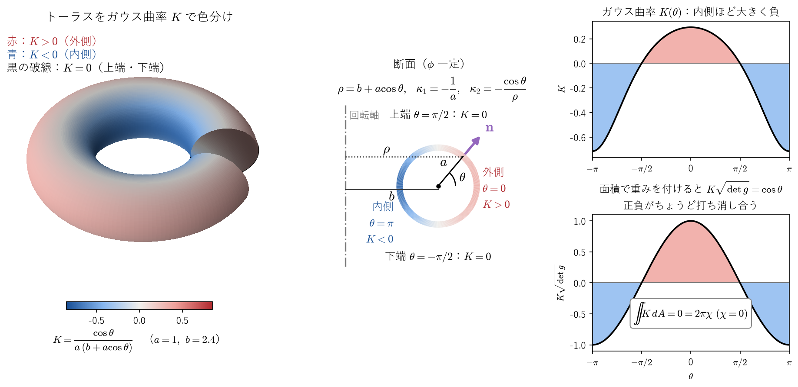

*左：トーラスを $K=\cos\theta/(a\rho)$ で色分けしたもの（赤が $K>0$、青が $K<0$、黒の破線が $K=0$。図は $a=1,\ b=2.4$）。外側は赤、内側は青で、内側のほうが絶対値が大きい。中：断面。$\theta$ は管の周りの角度で、$\theta=0$ が外側の赤道。右：$K(\theta)$（上）と、面積要素 $\sqrt{\det g}=a\rho$ を掛けた $K\sqrt{\det g}=\cos\theta$（下）。正と負の面積がちょうど打ち消し合い、積分値は $0=2\pi\chi$（$\chi=0$）になる。*

<a id="B-2-6"></a>

### B-2-6. クリストッフェル記号とガウスの公式の検算

(B.1)を使います。$g$が対角なので、$g_{mc}$は$m=c$のときだけ残り、(B.1)は$2\Gamma^c{}_{ab}g_{cc}=\partial_ag_{bc}+\partial_bg_{ac}-\partial_cg_{ab}$（$c$について和を取らない）となります。$g_{\theta\theta}=a^2$は定数、$g_{\phi\phi}=\rho^2$は$\theta$だけの関数です。

$$
\Gamma^\theta{}_{\phi\phi}=\frac{-\partial_\theta g_{\phi\phi}}{2g_{\theta\theta}}=\frac{-2\rho\,\partial_\theta\rho}{2a^2}=\frac{-2\rho(-a\sin\theta)}{2a^2}=\frac{\rho\sin\theta}{a}
$$

$$
\Gamma^\phi{}_{\theta\phi}=\Gamma^\phi{}_{\phi\theta}=\frac{\partial_\theta g_{\phi\phi}}{2g_{\phi\phi}}=\frac{2\rho\,\partial_\theta\rho}{2\rho^2}=-\frac{a\sin\theta}{\rho}
$$

残りの$\Gamma^\theta{}_{\theta\theta}$、$\Gamma^\theta{}_{\theta\phi}$、$\Gamma^\phi{}_{\theta\theta}$、$\Gamma^\phi{}_{\phi\phi}$は、(B.1)の右辺に現れる微分がすべて定数の微分か、$\phi$による微分になるため、ゼロです。

**ガウスの公式$\mathbf r_{ij}=\Gamma^k{}_{ij}\mathbf r_k+L_{ij}\mathbf n$の検算**：

$\mathbf r_{\theta\theta}$：$\Gamma^k{}_{\theta\theta}=0$なので右辺は$L_{\theta\theta}\mathbf n=-a\mathbf n$で、B-2-4の結果と一致します。

$\mathbf r_{\theta\phi}$：右辺は$\Gamma^\phi{}_{\theta\phi}\mathbf r_\phi=-\dfrac{a\sin\theta}{\rho}(-\rho\sin\phi,\ \rho\cos\phi,\ 0)=(a\sin\theta\sin\phi,\ -a\sin\theta\cos\phi,\ 0)$で、一致します。

$\mathbf r_{\phi\phi}$：右辺は$\Gamma^\theta{}_{\phi\phi}\mathbf r_\theta+L_{\phi\phi}\mathbf n$です。成分ごとに書くと：

$$
\frac{\rho\sin\theta}{a}\mathbf r_\theta=(-\rho\sin^2\theta\cos\phi,\ -\rho\sin^2\theta\sin\phi,\ \rho\sin\theta\cos\theta)
$$

$$
-\rho\cos\theta\,\mathbf n=(-\rho\cos^2\theta\cos\phi,\ -\rho\cos^2\theta\sin\phi,\ -\rho\sin\theta\cos\theta)
$$

足すと、$\sin^2\theta+\cos^2\theta=1$から$(-\rho\cos\phi,\ -\rho\sin\phi,\ 0)$となり、$\mathbf r_{\phi\phi}$と一致します。

<a id="B-2-7"></a>

### B-2-7. ガウス方程式の検算

リーマン曲率テンソルの公式$R^l{}_{kij}=\partial_i\Gamma^l{}_{jk}-\partial_j\Gamma^l{}_{ik}+\Gamma^l{}_{im}\Gamma^m{}_{jk}-\Gamma^l{}_{jm}\Gamma^m{}_{ik}$に、$l=\theta,k=\phi,i=\theta,j=\phi$を代入します：

$$
R^\theta{}_{\phi\theta\phi}=\partial_\theta\Gamma^\theta{}_{\phi\phi}-\partial_\phi\Gamma^\theta{}_{\theta\phi}+\Gamma^\theta{}_{\theta m}\Gamma^m{}_{\phi\phi}-\Gamma^\theta{}_{\phi m}\Gamma^m{}_{\theta\phi}
$$

各項を計算します。

- 第1項：$\partial_\theta\Big(\dfrac{\rho\sin\theta}{a}\Big)=\dfrac{(\partial_\theta\rho)\sin\theta+\rho\cos\theta}{a}=\dfrac{-a\sin^2\theta+\rho\cos\theta}{a}=-\sin^2\theta+\dfrac{\rho\cos\theta}{a}$
- 第2項：$\Gamma^\theta{}_{\theta\phi}=0$なのでゼロ
- 第3項：$\Gamma^\theta{}_{\theta\theta}=\Gamma^\theta{}_{\theta\phi}=0$なのでゼロ
- 第4項：$m=\theta$の項は$\Gamma^\theta{}_{\phi\theta}=0$で消え、$m=\phi$の項だけ残ります：$\Gamma^\theta{}_{\phi\phi}\Gamma^\phi{}_{\theta\phi}=\dfrac{\rho\sin\theta}{a}\cdot\Big(-\dfrac{a\sin\theta}{\rho}\Big)=-\sin^2\theta$

まとめると：

$$
R^\theta{}_{\phi\theta\phi}=-\sin^2\theta+\frac{\rho\cos\theta}{a}-0+0-(-\sin^2\theta)=\frac{\rho\cos\theta}{a}
$$

添字を下げます（$g$は対角なので$m=\theta$の項だけ残ります）：

$$
R_{\theta\phi\theta\phi}=g_{\theta\theta}R^\theta{}_{\phi\theta\phi}=a^2\cdot\frac{\rho\cos\theta}{a}=a\rho\cos\theta
$$

一方、B-1-2のガウス方程式の右辺は$L_{\theta\theta}L_{\phi\phi}-L_{\theta\phi}^2=(-a)(-\rho\cos\theta)-0=a\rho\cos\theta$です。両辺が一致しました。

<a id="B-2-8"></a>

### B-2-8. コダッツィ方程式の検算

B-1-2の2本の式を、$1=\theta,2=\phi$として書きます：

$$
\nabla_\phi L_{\theta\theta}=\nabla_\theta L_{\theta\phi},\qquad\nabla_\phi L_{\phi\theta}=\nabla_\theta L_{\phi\phi}
$$

B-0-1の式$\nabla_lL_{ij}=\partial_lL_{ij}-\Gamma^k{}_{il}L_{kj}-\Gamma^k{}_{jl}L_{ik}$を使います。$L$は対角（$L_{\theta\phi}=0$）で、ゼロでない$\Gamma$はB-2-6の2種類だけです。

**1本目**：

$$
\nabla_\phi L_{\theta\theta}=\partial_\phi L_{\theta\theta}-\Gamma^k{}_{\theta\phi}L_{k\theta}-\Gamma^k{}_{\theta\phi}L_{\theta k}
$$

$\partial_\phi L_{\theta\theta}=\partial_\phi(-a)=0$。$\Gamma^k{}_{\theta\phi}L_{k\theta}$は、$k=\theta$の項が$\Gamma^\theta{}_{\theta\phi}=0$で、$k=\phi$の項が$L_{\phi\theta}=0$で消えます。第3項も同様です。よって$\nabla_\phi L_{\theta\theta}=0$です。

$$
\nabla_\theta L_{\theta\phi}=\partial_\theta L_{\theta\phi}-\Gamma^k{}_{\theta\theta}L_{k\phi}-\Gamma^k{}_{\phi\theta}L_{\theta k}
$$

$\partial_\theta L_{\theta\phi}=0$、$\Gamma^k{}_{\theta\theta}=0$です。第3項は、$k=\theta$の項が$\Gamma^\theta{}_{\phi\theta}=0$で、$k=\phi$の項が$L_{\theta\phi}=0$で消えます。よって$\nabla_\theta L_{\theta\phi}=0$です。1本目は$0=0$として成り立ちます。

**2本目**：

$$
\nabla_\phi L_{\phi\theta}=\partial_\phi L_{\phi\theta}-\Gamma^k{}_{\phi\phi}L_{k\theta}-\Gamma^k{}_{\theta\phi}L_{\phi k}
$$

$\partial_\phi L_{\phi\theta}=0$です。第2項は$k=\theta$の項だけ残り$\Gamma^\theta{}_{\phi\phi}L_{\theta\theta}=\dfrac{\rho\sin\theta}{a}(-a)=-\rho\sin\theta$。第3項は$k=\phi$の項だけ残り$\Gamma^\phi{}_{\theta\phi}L_{\phi\phi}=\Big(-\dfrac{a\sin\theta}{\rho}\Big)(-\rho\cos\theta)=a\sin\theta\cos\theta$。したがって：

$$
\nabla_\phi L_{\phi\theta}=0-(-\rho\sin\theta)-a\sin\theta\cos\theta=\rho\sin\theta-a\sin\theta\cos\theta=(b+a\cos\theta)\sin\theta-a\sin\theta\cos\theta=b\sin\theta
$$

$$
\nabla_\theta L_{\phi\phi}=\partial_\theta L_{\phi\phi}-\Gamma^k{}_{\phi\theta}L_{k\phi}-\Gamma^k{}_{\phi\theta}L_{\phi k}
$$

第1項は、積の微分で$\partial_\theta(-\rho\cos\theta)=-\big((\partial_\theta\rho)\cos\theta-\rho\sin\theta\big)=a\sin\theta\cos\theta+\rho\sin\theta$。第2項と第3項は、$L$の対称性から同じ値で、どちらも$k=\phi$の項だけ残り$\Gamma^\phi{}_{\phi\theta}L_{\phi\phi}=a\sin\theta\cos\theta$です。したがって：

$$
\nabla_\theta L_{\phi\phi}=a\sin\theta\cos\theta+\rho\sin\theta-2a\sin\theta\cos\theta=\rho\sin\theta-a\sin\theta\cos\theta=b\sin\theta
$$

2本目も$b\sin\theta=b\sin\theta$として成り立ちます。

同じ計算で、残りの成分は$\nabla_\theta L_{\theta\theta}=0$、$\nabla_\phi L_{\phi\phi}=0$です（どちらも、生き残る$\Gamma$と$L$の組が現れないため）。トーラスの$\nabla L$でゼロでない成分は、$\nabla_\theta L_{\phi\phi}=\nabla_\phi L_{\phi\theta}=\nabla_\phi L_{\theta\phi}=b\sin\theta$だけで、B-1-1で示した「3つの添字について対称」という性質がそのまま見えています。$\nabla L\ne0$でありながら、コダッツィ方程式は成り立っています。

**球面の場合**：Part VIII §4-dで確認した通り、球面では$L_{ij}=-\dfrac1ag_{ij}$です。B-0-1の式は$T$について線形なので、定数倍は共変微分の外に出せ、$\nabla_lL_{ij}=-\dfrac1a\nabla_lg_{ij}=0$（B-0-2）となります。コダッツィ方程式は$0=0$として自明に成り立ちます。

---

<a id="B-3"></a>

## B-3. ガウスの公式とヴァインガルテンの公式を、連立偏微分方程式として書く

**記法**：B-3〜B-6では、$\mathbb R^3$のベクトルを横ベクトル（1行3列）として扱います。3本のベクトル$\mathbf r_1,\mathbf r_2,\mathbf n$を上から順に行として並べた$3\times3$行列を

$$
\Phi:=\begin{pmatrix}\mathbf r_1\\\mathbf r_2\\\mathbf n\end{pmatrix}
$$

と書き、**枠行列**と呼びます。（行列値微分形式のノートで場の強さを$F$と書いたので、それと区別するために$\Phi$を使います。）

ガウスの公式とヴァインガルテンの公式を、$\Phi$の各行の微分として書き直します。$\partial_i\mathbf r_j=\mathbf r_{ji}=\mathbf r_{ij}$（混合偏微分の対称性）なので：

$$
\partial_i\mathbf r_j=\Gamma^k{}_{ij}\mathbf r_k+L_{ij}\mathbf n\qquad(\text{ガウスの公式、A-2})
$$

$$
\partial_i\mathbf n=-L_i{}^k\mathbf r_k\qquad(\text{ヴァインガルテンの公式、A-3})
$$

どちらも右辺は$\mathbf r_1,\mathbf r_2,\mathbf n$の線形結合です。そこで、各$i$について$3\times3$行列$A_i$を次のように定義します：

$$
A_i:=\begin{pmatrix}\Gamma^1{}_{i1}&\Gamma^2{}_{i1}&L_{i1}\\\Gamma^1{}_{i2}&\Gamma^2{}_{i2}&L_{i2}\\-L_i{}^1&-L_i{}^2&0\end{pmatrix}
$$

成分で書くと、行と列の番号を$a,b\in\{1,2,3\}$として（3番目が$\mathbf n$に対応）：

$$
(A_i)_{jk}=\Gamma^k{}_{ij},\quad(A_i)_{j3}=L_{ij},\quad(A_i)_{3k}=-L_i{}^k,\quad(A_i)_{33}=0\qquad(j,k\in\{1,2\})
$$

このとき、ガウスの公式とヴァインガルテンの公式は、まとめて

$$
\boxed{\partial_i\Phi=A_i\,\Phi}\qquad(i=1,2)\tag{B.4}
$$

と書けます。行列の積$A_i\Phi$の第$j$行（$j=1,2$）は$(A_i)_{j1}\mathbf r_1+(A_i)_{j2}\mathbf r_2+(A_i)_{j3}\mathbf n=\Gamma^k{}_{ij}\mathbf r_k+L_{ij}\mathbf n$で、ガウスの公式の右辺です。第3行は$-L_i{}^1\mathbf r_1-L_i{}^2\mathbf r_2+0\cdot\mathbf n=-L_i{}^k\mathbf r_k$で、ヴァインガルテンの公式の右辺です。

**トーラスでの例**：B-2の値（$L_\theta{}^\theta=g^{\theta\theta}L_{\theta\theta}=-1/a$、$L_\phi{}^\phi=g^{\phi\phi}L_{\phi\phi}=-\cos\theta/\rho$、他はゼロ）を代入すると：

$$
A_\theta=\begin{pmatrix}0&0&-a\\0&-\dfrac{a\sin\theta}{\rho}&0\\\dfrac1a&0&0\end{pmatrix},\qquad
A_\phi=\begin{pmatrix}0&-\dfrac{a\sin\theta}{\rho}&0\\\dfrac{\rho\sin\theta}{a}&0&-\rho\cos\theta\\0&\dfrac{\cos\theta}{\rho}&0\end{pmatrix}
$$

第3行を直接確認します。$\mathbf n=(\cos\theta\cos\phi,\cos\theta\sin\phi,\sin\theta)$を微分すると：

$$
\partial_\theta\mathbf n=(-\sin\theta\cos\phi,\ -\sin\theta\sin\phi,\ \cos\theta)=\frac1a\mathbf r_\theta,\qquad
\partial_\phi\mathbf n=(-\cos\theta\sin\phi,\ \cos\theta\cos\phi,\ 0)=\frac{\cos\theta}{\rho}\mathbf r_\phi
$$

それぞれ$A_\theta$、$A_\phi$の第3行と一致します。

---

<a id="B-4"></a>

## B-4. 可積分条件

<a id="B-4-1"></a>

### B-4-1. 導出

(B.4)の両辺をもう1回微分し、混合偏微分の対称性$\partial_j\partial_i\Phi=\partial_i\partial_j\Phi$（$\Phi$の各成分について）を使います。

$\partial_j(\partial_i\Phi)$を、積の微分と(B.4)で計算します：

$$
\partial_j(A_i\Phi)=(\partial_jA_i)\Phi+A_i(\partial_j\Phi)=(\partial_jA_i)\Phi+A_iA_j\Phi
$$

$i$と$j$を入れ替えると：

$$
\partial_i(A_j\Phi)=(\partial_iA_j)\Phi+A_jA_i\Phi
$$

2つは等しいので、引き算してまとめます：

$$
\big(\partial_jA_i-\partial_iA_j+A_iA_j-A_jA_i\big)\Phi=0
$$

$\Phi$は逆行列を持ちます（$\mathbf r_1,\mathbf r_2$は接平面の基底、$\mathbf n$はそれに垂直な単位ベクトルなので、3本の行は1次独立です）。右から$\Phi^{-1}$を掛けます。**記法**：行列の交換子を$[X,Y]:=XY-YX$と書き、次の行列を定義します：

$$
\Omega_{ij}:=\partial_jA_i-\partial_iA_j+[A_i,A_j]
$$

すると、可積分条件は：

$$
\boxed{\Omega_{ij}=0}\tag{B.5}
$$

定義から$\Omega_{ii}=0$、$\Omega_{ji}=-\Omega_{ij}$（$i,j$を入れ替えると各項の符号が反転）なので、2次元で意味のある条件は$\Omega_{12}=0$の1つ（$3\times3$行列の等式）です。

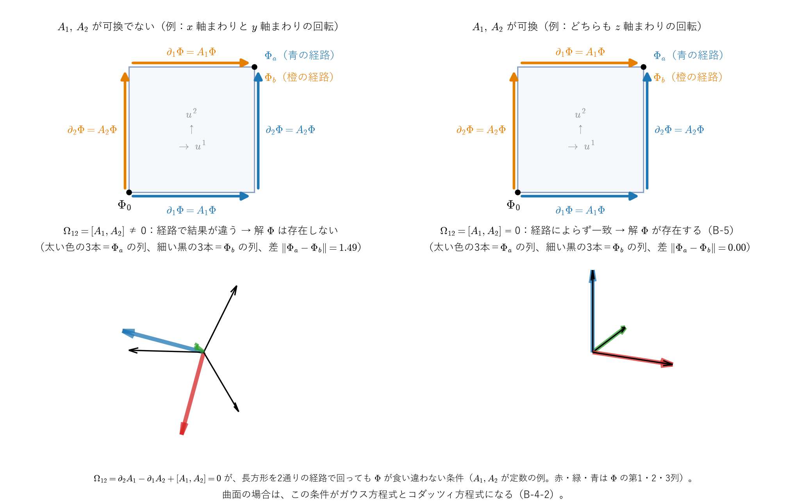

*原点の $\Phi_0$ から、対角の頂点まで、$u^1$ 方向に進んでから $u^2$ 方向に進む経路（青）と、逆順の経路（橙）で $\Phi$ を運ぶ。左：$A_1,A_2$ が可換でない（$\Omega_{12}=[A_1,A_2]\neq0$）と、2つの経路で $\Phi_a\neq\Phi_b$ になり、解 $\Phi$ は存在しない。右：可換（$\Omega_{12}=0$）なら $\Phi_a=\Phi_b$ で、解が存在する（B-5）。下段の3本の矢印は $\Phi$ の3つの列（$3\times3$ の回転行列）で、太い色が $\Phi_a$、細い黒が $\Phi_b$。図の $A_1,A_2$ は定数行列の例で、$\Omega_{12}=\partial_2A_1-\partial_1A_2+[A_1,A_2]=[A_1,A_2]$。*

<a id="B-4-2"></a>

### B-4-2. $\Omega_{ij}$の成分がガウス方程式とコダッツィ方程式になること

$\Omega_{ij}$を、4つのブロック（左上$2\times2$、右上$2\times1$、左下$1\times2$、右下$1\times1$）に分けて計算します。行列の積の成分は$(A_iA_j)_{ab}=\sum_{c=1}^3(A_i)_{ac}(A_j)_{cb}$で、和を$c=k\in\{1,2\}$の部分と$c=3$の部分に分けて書きます。

**左上ブロック$(p,q)$（$p,q\in\{1,2\}$）**：

$$
(\partial_jA_i)_{pq}=\partial_j\Gamma^q{}_{ip},\qquad(\partial_iA_j)_{pq}=\partial_i\Gamma^q{}_{jp}
$$

$$
(A_iA_j)_{pq}=\sum_k\Gamma^k{}_{ip}\Gamma^q{}_{jk}+L_{ip}\big(-L_j{}^q\big),\qquad(A_jA_i)_{pq}=\sum_k\Gamma^k{}_{jp}\Gamma^q{}_{ik}+L_{jp}\big(-L_i{}^q\big)
$$

したがって：

$$
(\Omega_{ij})_{pq}=\partial_j\Gamma^q{}_{ip}-\partial_i\Gamma^q{}_{jp}+\Gamma^q{}_{jk}\Gamma^k{}_{ip}-\Gamma^q{}_{ik}\Gamma^k{}_{jp}-L_{ip}L_j{}^q+L_{jp}L_i{}^q
$$

最初の4項を、リーマン曲率テンソルの公式$R^l{}_{kij}=\partial_i\Gamma^l{}_{jk}-\partial_j\Gamma^l{}_{ik}+\Gamma^l{}_{im}\Gamma^m{}_{jk}-\Gamma^l{}_{jm}\Gamma^m{}_{ik}$と比べます。公式の添字$(l,k,i,j)$を$(q,p,j,i)$に付け替え、和の文字$m$を$k$と読み替えると：

$$
R^q{}_{pji}=\partial_j\Gamma^q{}_{ip}-\partial_i\Gamma^q{}_{jp}+\Gamma^q{}_{jk}\Gamma^k{}_{ip}-\Gamma^q{}_{ik}\Gamma^k{}_{jp}
$$

となり、4項と完全に一致します。したがって：

$$
(\Omega_{ij})_{pq}=R^q{}_{pji}-L_{ip}L_j{}^q+L_{jp}L_i{}^q
$$

$(\Omega_{ij})_{pq}=0$は$R^q{}_{pji}=L_{ip}L_j{}^q-L_{jp}L_i{}^q$と同じです。A-6のガウス方程式$R^m{}_{ilj}=L_{ij}L_l{}^m-L_{il}L_j{}^m$はすべての添字の値で成り立つ式なので、添字を$(m,i,l,j)\to(q,p,j,i)$と付け替えてよく、$R^q{}_{pji}=L_{pi}L_j{}^q-L_{pj}L_i{}^q$となります。$L$の対称性（$L_{pi}=L_{ip}$、$L_{pj}=L_{jp}$）から、2つは同じ式です。**左上ブロックはガウス方程式です。**

**右上ブロック$(p,3)$**：

$$
(\partial_jA_i)_{p3}=\partial_jL_{ip},\qquad(\partial_iA_j)_{p3}=\partial_iL_{jp}
$$

$$
(A_iA_j)_{p3}=\sum_k\Gamma^k{}_{ip}L_{jk}+L_{ip}\cdot0,\qquad(A_jA_i)_{p3}=\sum_k\Gamma^k{}_{jp}L_{ik}
$$

したがって：

$$
(\Omega_{ij})_{p3}=\partial_jL_{ip}-\partial_iL_{jp}+\Gamma^k{}_{ip}L_{jk}-\Gamma^k{}_{jp}L_{ik}
$$

$(\Omega_{ij})_{p3}=0$は$\partial_jL_{ip}-\partial_iL_{jp}=\Gamma^k{}_{jp}L_{ik}-\Gamma^k{}_{ip}L_{jk}$と同じです。(A-7)の添字を$(i,l,j)\to(p,j,i)$と付け替えると$\partial_jL_{pi}-\partial_iL_{pj}=\Gamma^k{}_{pj}L_{ki}-\Gamma^k{}_{pi}L_{kj}$で、$L$と$\Gamma$の対称性から同じ式です。**右上ブロックはコダッツィ方程式です。**

**左下ブロック$(3,q)$**：

$$
(\partial_jA_i)_{3q}=-\partial_jL_i{}^q,\qquad(\partial_iA_j)_{3q}=-\partial_iL_j{}^q
$$

$$
(A_iA_j)_{3q}=\sum_k\big(-L_i{}^k\big)\Gamma^q{}_{jk}+0,\qquad(A_jA_i)_{3q}=\sum_k\big(-L_j{}^k\big)\Gamma^q{}_{ik}
$$

したがって：

$$
(\Omega_{ij})_{3q}=-\partial_jL_i{}^q+\partial_iL_j{}^q-\Gamma^q{}_{jk}L_i{}^k+\Gamma^q{}_{ik}L_j{}^k
$$

$(\Omega_{ij})_{3q}=0$を書き直すと：

$$
\partial_iL_j{}^q+\Gamma^q{}_{ik}L_j{}^k=\partial_jL_i{}^q+\Gamma^q{}_{jk}L_i{}^k
$$

$L_j{}^q$を(1,1)型テンソル$T^q{}_j$とみなすと、B-0-1の式から$\nabla_iL_j{}^q=\partial_iL_j{}^q+\Gamma^q{}_{mi}L_j{}^m-\Gamma^m{}_{ji}L_m{}^q$です。$\Gamma^q{}_{mi}=\Gamma^q{}_{im}$として和の文字$m$を$k$と読み替えると、上の式の左辺は$\nabla_iL_j{}^q+\Gamma^m{}_{ji}L_m{}^q$、右辺は$\nabla_jL_i{}^q+\Gamma^m{}_{ij}L_m{}^q$です。$\Gamma^m{}_{ji}=\Gamma^m{}_{ij}$なので、条件は$\nabla_iL_j{}^q=\nabla_jL_i{}^q$と同じです。両辺に$g_{qs}$を掛けて添字を下げると（B-0-2の帰結から、共変微分と交換できます。$g_{qs}L_j{}^q=g_{qs}g^{kq}L_{jk}=\delta^k{}_sL_{jk}=L_{js}$）、$\nabla_iL_{js}=\nabla_jL_{is}$となります。これはB-1-1のコダッツィ方程式（$\nabla_lL_{ij}=\nabla_jL_{il}$の添字を$(l,i,j)\to(i,s,j)$と付け替え、$L$の対称性を使ったもの）です。**左下ブロックは、コダッツィ方程式をもう一度与えるだけです。**

**右下ブロック$(3,3)$**：$\partial A$の$(3,3)$成分はゼロです。積については：

$$
(A_iA_j)_{33}=\sum_k\big(-L_i{}^k\big)L_{jk}+0,\qquad(A_jA_i)_{33}=\sum_k\big(-L_j{}^k\big)L_{ik}
$$

$$
(\Omega_{ij})_{33}=-L_i{}^kL_{jk}+L_j{}^kL_{ik}
$$

$L_i{}^kL_{jk}=g^{mk}L_{im}L_{jk}$、$L_j{}^kL_{ik}=g^{mk}L_{jm}L_{ik}$です。後者のダミー添字$m$と$k$の名前を入れ替えると$g^{km}L_{jk}L_{im}$で、$g$の対称性から前者と同じです。**右下ブロックは恒等的にゼロです。**

**結論**：$g_{ij}$から作ったクリストッフェル記号と、対称な$L_{ij}$から$A_i$を作るとき、

$$
\boxed{\Omega_{12}=0\iff\text{ガウス方程式とコダッツィ方程式が成り立つ}}
$$

です。トーラスでは、B-2-7とB-2-8で両方程式を確認したので、B-3の$A_\theta,A_\phi$について$\Omega_{12}=0$が成り立ちます。

<a id="B-4-3"></a>

### B-4-3. 行列値微分形式との対応

行列値微分形式のノートで扱った「曲率がゼロ」という条件と同じ形であることを確認します。詳しくはそちらで扱うので、ここでは対応関係の確認に止めます。

**記法**：行列値の1-形式$\mathcal A:=A_i\,du^i$を定義します。

$d\mathcal A$は、1-形式の外微分の成分の式（微分形式のノート）から$d\mathcal A=\partial_iA_j\,du^i\wedge du^j$です。これを半分ずつに分け、後半ではダミー添字$i$と$j$の名前を入れ替えて$du^j\wedge du^i=-du^i\wedge du^j$を使うと：

$$
d\mathcal A=\tfrac12\partial_iA_j\,du^i\wedge du^j+\tfrac12\partial_jA_i\,du^j\wedge du^i=\tfrac12\big(\partial_iA_j-\partial_jA_i\big)du^i\wedge du^j
$$

同じ操作で（行列の積の順序は保ったまま）：

$$
\mathcal A\wedge\mathcal A=A_iA_j\,du^i\wedge du^j=\tfrac12\big(A_iA_j-A_jA_i\big)du^i\wedge du^j=\tfrac12[A_i,A_j]\,du^i\wedge du^j
$$

したがって：

$$
d\mathcal A-\mathcal A\wedge\mathcal A=\tfrac12\big(\partial_iA_j-\partial_jA_i-[A_i,A_j]\big)du^i\wedge du^j=-\tfrac12\Omega_{ij}\,du^i\wedge du^j
$$

(B.4)は$d\Phi-\mathcal A\Phi=0$、つまり$\omega:=-\mathcal A$とおけば$(d+\omega)\Phi=0$という形です。行列値微分形式のノートの$F=dA+A\wedge A$と同じ形で$\omega$の曲率を作ると：

$$
d\omega+\omega\wedge\omega=-d\mathcal A+\mathcal A\wedge\mathcal A=\tfrac12\Omega_{ij}\,du^i\wedge du^j
$$

（$\omega\wedge\omega=(-\mathcal A)\wedge(-\mathcal A)=\mathcal A\wedge\mathcal A$です。）可積分条件$\Omega_{ij}=0$は、**接続$\omega$の曲率がゼロ**という条件そのものです。

---

<a id="B-5"></a>

## B-5. フロベニウスの定理（2変数・線形の場合）

<a id="B-5-1"></a>

### B-5-1. 主張

**記法**：$I_1,I_2$を$0$を含む開区間とし、長方形領域$D:=I_1\times I_2$（$(u^1,u^2)$の範囲）を考えます。

**定理**：$A_1,A_2$を$D$上で滑らかな$3\times3$行列値関数、$\Phi_0$を$3\times3$行列とします。$D$上で

$$
\Omega_{12}=\partial_2A_1-\partial_1A_2+[A_1,A_2]=0
$$

が成り立つなら、

$$
\partial_1\Phi=A_1\Phi,\qquad\partial_2\Phi=A_2\Phi,\qquad\Phi(0,0)=\Phi_0
$$

を満たす$\Phi$が$D$上にただ1つ存在します。

**必要性**（解が存在し$\Phi$が逆行列を持つなら$\Omega_{12}=0$）は、B-4-1で示しました。以下、十分性を示します。

<a id="B-5-2"></a>

### B-5-2. 十分性の証明

**ステップ1：$u^2=0$の線上で解く**。$u^1$だけの関数$\Phi(u^1,0)$についての常微分方程式

$$
\frac{d}{du^1}\Phi(u^1,0)=A_1(u^1,0)\,\Phi(u^1,0),\qquad\Phi(0,0)=\Phi_0
$$

を解きます。B-0-4から、$I_1$全体で解がただ1つ存在します。

**ステップ2：各$u^1$について、$u^2$の方向に解く**。$u^1$を固定し、$u^2$についての常微分方程式

$$
\frac{\partial}{\partial u^2}\Phi(u^1,u^2)=A_2(u^1,u^2)\,\Phi(u^1,u^2),\qquad\Phi(u^1,0)=\text{ステップ1の値}
$$

を解きます。B-0-4から、各$u^1$について$I_2$全体で解がただ1つ存在し、$u^1$はパラメータとして滑らかに入ります。こうして$D$全体で$\Phi$が定義されます。

作り方から、$\partial_2\Phi=A_2\Phi$は$D$全体で成り立ちます。一方、$\partial_1\Phi=A_1\Phi$は、今のところ$u^2=0$の線上でしか保証されていません。

**ステップ3：誤差項がゼロであることを示す**。**記法**：誤差項を$E:=\partial_1\Phi-A_1\Phi$と定義します。ステップ1から$E(u^1,0)=0$です。$E$を$u^2$で微分します：

$$
\partial_2E=\partial_2\partial_1\Phi-(\partial_2A_1)\Phi-A_1\partial_2\Phi
$$

第1項は、混合偏微分の対称性で$\partial_1\partial_2\Phi$に入れ替え、ステップ2の$\partial_2\Phi=A_2\Phi$を代入して積の微分を行います。第3項にも$\partial_2\Phi=A_2\Phi$を代入します：

$$
\partial_2E=\partial_1(A_2\Phi)-(\partial_2A_1)\Phi-A_1A_2\Phi=(\partial_1A_2)\Phi+A_2(\partial_1\Phi)-(\partial_2A_1)\Phi-A_1A_2\Phi
$$

$\partial_1\Phi$を$E$の定義から$\partial_1\Phi=E+A_1\Phi$と書き直して代入します：

$$
\partial_2E=(\partial_1A_2)\Phi+A_2E+A_2A_1\Phi-(\partial_2A_1)\Phi-A_1A_2\Phi
$$

$\Phi$を含む項をまとめます：

$$
\partial_2E=A_2E-\big(\partial_2A_1-\partial_1A_2+A_1A_2-A_2A_1\big)\Phi=A_2E-\Omega_{12}\Phi
$$

仮定$\Omega_{12}=0$から$\partial_2E=A_2E$です。$u^1$を固定すると、$E$は$u^2$についての線形常微分方程式を満たし、初期値は$E(u^1,0)=0$です。$E\equiv0$もこの方程式の解なので、B-0-4の一意性から$E\equiv0$です。つまり$\partial_1\Phi=A_1\Phi$が$D$全体で成り立ちます。

**一意性**：条件を満たす$\Phi$は、必ずステップ1とステップ2の常微分方程式を満たします。それらの解はただ1つなので、$\Phi$もただ1つです。

<a id="B-5-3"></a>

### B-5-3. 補足

**一般のフロベニウスの定理**：B-5-2で証明したのは、線形・2変数という特別な場合でした。一般の形は、次のような幾何学的な主張です。

3次元空間の各点に、2次元の平面（接平面の候補）が滑らかに指定されているとします。これを、各点で平面を張る2本のベクトル場$X,Y$で表します（このような平面の場を**分布**と呼びます）。問題は、「各点を通り、その各点で指定された平面に接する曲面（**積分曲面**）が存在するか」です。

**必要条件（包合性）**：積分曲面が存在するなら、リー括弧$[X,Y]$も各点で指定された平面の中にあります。これは短く示せます。積分曲面上の座標を$(s,t)$とすると、$X,Y$は曲面に接するので、曲面上で$X=f_1\partial_s+f_2\partial_t$、$Y=h_1\partial_s+h_2\partial_t$と書けます（$f_a,h_a$は関数）。リー括弧の成分の定義$[X,Y]^i=X^j\partial_jY^i-Y^j\partial_jX^i$（リー微分のノートPart III）から、関数倍について

$$
[fA,hB]=fh[A,B]+f(Ah)B-h(Bf)A
$$

が成り立ちます（積の微分で展開すると、$A,B$の成分を微分する項が$fh[A,B]$に、$f,h$を微分する項が残りの2項になります）。$[\partial_s,\partial_s]=[\partial_t,\partial_t]=[\partial_s,\partial_t]=0$（座標ベクトル場のリー括弧はゼロ）なので、$[X,Y]$を展開すると、$[A,B]$の項はすべて消え、残る項はすべて$\partial_s$か$\partial_t$の関数倍です。したがって$[X,Y]$は曲面に接し、指定された平面の中にあります。

**十分条件（定理の主張）**：逆に、$[X,Y]$が常に指定された平面の中にあれば（包合的なら）、積分曲面が各点の近くに存在します。この向きの証明には、$X$の流れと$Y$の流れを組み合わせて曲面を作る議論が必要になり、ここでは扱いません。ここでは、「包合性を仮定すれば、積分曲面の存在が従う」という定理として引用します。

**B-5との関係**：B-5-2の証明も、「まず$u^1$方向に解き、次に$u^2$方向に解いて、誤差項が可積分条件（$\Omega_{12}=0$）によって消える」という構造でした。一般の証明も、「一方の流れで動いてから他方の流れで動く」という同じ発想で組み立てられます。

**領域の形**：定理は長方形$D$（穴のない領域）で述べました。穴のある領域では、$\Omega=0$でも解が1つの値に定まらないことがあります。$1\times1$の場合（$A_i$が数）で例を挙げます。原点を除いた平面で、$c$を実数の定数として$A_i\,du^i=c\,\dfrac{-u^2du^1+u^1du^2}{(u^1)^2+(u^2)^2}$とすると、数の積は交換するので$\Omega_{12}=\partial_2A_1-\partial_1A_2$で、これは積分のノートで確認した通りゼロです。しかし解$\Phi=\Phi_0\exp\big(\int A_i\,du^i\big)$は、原点の周りを1周すると$\oint=2\pi c$だけ指数が増え、$e^{2\pi c}$倍になって元に戻りません。これはde Rhamコホモロジー（積分のノート）やホロノミー（行列値微分形式のノート）で扱う現象であり、ここでは例の紹介に止めます。

---

<a id="B-6"></a>

## B-6. ボネの定理

<a id="B-6-1"></a>

### B-6-1. 主張

**定理**：長方形領域$D$上に、滑らかな対称行列値関数$g_{ij}$（正定値）と$L_{ij}$が与えられ、B-1-2のガウス方程式1本とコダッツィ方程式2本を満たすとします（$\Gamma$と$R$は$g$から計算します）。このとき：

1. 第一基本形式が$g_{ij}$、第二基本形式が$L_{ij}$となる曲面$\mathbf r:D\to\mathbb R^3$が存在します。
2. そのような曲面は、回転と平行移動を除いてただ1つです。

**$g$だけでは曲面が決まらない例**：$g$だけを与えても、曲面は決まりません。平面$\mathbf r(s,z)=(s,z,0)$と、半径$c>0$の円柱$\mathbf r(s,z)=\big(c\cos(s/c),\ c\sin(s/c),\ z\big)$を比べます。円柱では$\mathbf r_s=(-\sin(s/c),\cos(s/c),0)$、$\mathbf r_z=(0,0,1)$なので、平面と同じ$g_{ij}=\delta_{ij}$です。一方、外向き法線$\mathbf n=(\cos(s/c),\sin(s/c),0)$に対して$\mathbf r_{ss}=-\frac1c(\cos(s/c),\sin(s/c),0)=-\frac1c\mathbf n$なので$L_{ss}=-1/c$、$\mathbf r_{sz}=\mathbf r_{zz}=0$から$L_{sz}=L_{zz}=0$です。平面は$L=0$です。どちらも（$\Gamma=0$、$R=0$、$\det L=0$、$L$が定数なので）ガウス方程式とコダッツィ方程式を満たします。同じ$g$に対して、異なる$L$を持つ別の曲面が存在するので、曲面を決めるには$L$まで指定する必要があります。

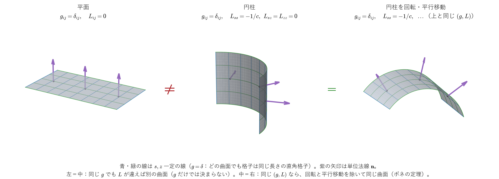

*平面（$L=0$）と円柱（$L_{ss}=-1/c$）は、同じ $g_{ij}=\delta_{ij}$ を持つ（青・緑の格子はどちらも同じ長さの直角格子）が、$L$ が違うので別の曲面。円柱を回転・平行移動した曲面は、同じ $(g,L)$ を持ち、元の円柱と重なる（ボネの定理の「回転と平行移動を除いて一意」）。*

<a id="B-6-2"></a>

### B-6-2. 証明

**ステップ1：枠行列を作る**。与えられた$g_{ij},L_{ij}$からB-3の方法で$A_1,A_2$を作ります。仮定（ガウス方程式とコダッツィ方程式）とB-4-2から$\Omega_{12}=0$です。

初期値$\Phi_0$を、原点での$g_{ij}(0,0)$に合わせて選びます。$g_{11}>0$、$\det g>0$（正定値）なので、次のベクトルが定義できます：

$$
\mathbf r_1^{(0)}:=\big(\sqrt{g_{11}},\ 0,\ 0\big),\qquad\mathbf r_2^{(0)}:=\Big(\frac{g_{12}}{\sqrt{g_{11}}},\ \sqrt{\frac{\det g}{g_{11}}},\ 0\Big),\qquad\mathbf n^{(0)}:=(0,0,1)
$$

（すべて原点での値です。）内積を確認します：$\mathbf r_1^{(0)}\cdot\mathbf r_1^{(0)}=g_{11}$、$\mathbf r_1^{(0)}\cdot\mathbf r_2^{(0)}=g_{12}$、$\mathbf r_2^{(0)}\cdot\mathbf r_2^{(0)}=\dfrac{g_{12}^2}{g_{11}}+\dfrac{g_{11}g_{22}-g_{12}^2}{g_{11}}=g_{22}$、$\mathbf n^{(0)}\cdot\mathbf r_i^{(0)}=0$、$\mathbf n^{(0)}\cdot\mathbf n^{(0)}=1$。この3本を行に並べたものを$\Phi_0$とします。

B-5の定理から、$\partial_i\Phi=A_i\Phi$、$\Phi(0,0)=\Phi_0$を満たす$\Phi$が$D$上にただ1つ存在します。**記法**：まだ何かの曲面の微分であるとは分かっていないので、$\Phi$の行を$\mathbf X_1,\mathbf X_2,\mathbf N$と書きます。

**ステップ2：内積が保たれることを示す**。**記法**：$\Phi$のグラム行列を$G:=\Phi\Phi^T$（成分は行同士の内積、例えば$G_{12}=\mathbf X_1\cdot\mathbf X_2$、$G_{33}=\mathbf N\cdot\mathbf N$）、目標とする行列を

$$
G^\ast:=\begin{pmatrix}g_{11}&g_{12}&0\\g_{21}&g_{22}&0\\0&0&1\end{pmatrix}
$$

と定義します。$G=G^\ast$を示せば、$\mathbf X_i\cdot\mathbf X_j=g_{ij}$、$\mathbf X_i\cdot\mathbf N=0$、$\mathbf N\cdot\mathbf N=1$が$D$全体で成り立ちます。

$G$の微分を積の微分で計算します：

$$
\partial_iG=(\partial_i\Phi)\Phi^T+\Phi(\partial_i\Phi)^T=A_i\Phi\Phi^T+\Phi\Phi^TA_i^T=A_iG+GA_i^T
$$

$G^\ast$も同じ式$\partial_iG^\ast=A_iG^\ast+G^\ast A_i^T$を満たすことを、成分で確認します。まず$A_iG^\ast$の成分は（$p,q\in\{1,2\}$）：

$$
(A_iG^\ast)_{pq}=\Gamma^k{}_{ip}g_{kq},\quad(A_iG^\ast)_{p3}=L_{ip},\quad(A_iG^\ast)_{3q}=-L_i{}^kg_{kq}=-L_{iq},\quad(A_iG^\ast)_{33}=0
$$

（$L_i{}^kg_{kq}=g^{jk}L_{ij}g_{kq}=\delta^j{}_qL_{ij}=L_{iq}$です。）$G^\ast$は対称なので$G^\ast A_i^T=(A_iG^\ast)^T$で、その成分は上の添字を入れ替えたものです。足すと：

- $(p,q)$成分：$\Gamma^k{}_{ip}g_{kq}+\Gamma^k{}_{iq}g_{kp}$。B-0-2から$\nabla_ig_{pq}=\partial_ig_{pq}-\Gamma^k{}_{pi}g_{kq}-\Gamma^k{}_{qi}g_{pk}=0$なので、これは$\partial_ig_{pq}=\partial_iG^\ast_{pq}$に等しくなります。
- $(p,3)$成分：$L_{ip}+(-L_{ip})=0=\partial_iG^\ast_{p3}$。
- $(3,q)$成分：$-L_{iq}+L_{iq}=0=\partial_iG^\ast_{3q}$。
- $(3,3)$成分：$0=\partial_i1$。

したがって$G$と$G^\ast$は、同じ方程式$\partial_iM=A_iM+MA_i^T$を満たします。この方程式は$M$について線形です（$M$の9成分を縦に並べたベクトルとみなせば、B-0-4の形になります）。原点では$G(0,0)=\Phi_0\Phi_0^T=G^\ast(0,0)$（ステップ1で確認）です。B-5-2のステップ1と同じく$u^2=0$の線上で$u^1$についての一意性を使い、次にステップ2と同じく各$u^1$について$u^2$方向の一意性を使うと、$D$全体で$G=G^\ast$が得られます。

特に$\det G=(\det\Phi)^2=\det g>0$なので、$\Phi$は$D$全体で逆行列を持ち、$\mathbf X_1,\mathbf X_2$は1次独立です。

**ステップ3：曲面$\mathbf r$を作る**。$\partial_i\mathbf r=\mathbf X_i$を満たす$\mathbf r$を作ります。そのための条件は$\partial_j\mathbf X_i=\partial_i\mathbf X_j$です。(B.4)の第$i$行から：

$$
\partial_j\mathbf X_i=\Gamma^k{}_{ji}\mathbf X_k+L_{ji}\mathbf N
$$

$\Gamma^k{}_{ji}=\Gamma^k{}_{ij}$、$L_{ji}=L_{ij}$なので、右辺は$i,j$について対称で、$\partial_j\mathbf X_i=\partial_i\mathbf X_j$が成り立ちます。そこで：

$$
\mathbf r(u^1,u^2):=\int_0^{u^1}\mathbf X_1(s,0)\,ds+\int_0^{u^2}\mathbf X_2(u^1,t)\,dt
$$

と定義します。第1項は$u^2$によらないので$\partial_2\mathbf r=\mathbf X_2(u^1,u^2)$です。$u^1$で微分します。ここでは「被積分関数が連続微分可能なら、積分記号の下で微分してよい（微分と積分の順序を交換できる）」という解析学の事実を、仮定として使います：

$$
\partial_1\mathbf r=\mathbf X_1(u^1,0)+\int_0^{u^2}\partial_1\mathbf X_2(u^1,t)\,dt=\mathbf X_1(u^1,0)+\int_0^{u^2}\partial_2\mathbf X_1(u^1,t)\,dt
$$

（$\partial_1\mathbf X_2=\partial_2\mathbf X_1$を使いました。）最後の積分は微積分の基本定理から$\mathbf X_1(u^1,u^2)-\mathbf X_1(u^1,0)$なので、$\partial_1\mathbf r=\mathbf X_1(u^1,u^2)$です。（これは「閉じた1-形式は、穴のない領域では完全形式になる」というポアンカレの補題の逆向きの主張の、今の場合の証明になっています。B-5-3の例のように、穴のある領域ではこの構成は一般にうまくいきません。）

**ステップ4：作った曲面が$g$と$L$を持つことを確認する**。$\mathbf r_i=\mathbf X_i$なので、ステップ2から$\mathbf r_i\cdot\mathbf r_j=g_{ij}$です。$\mathbf X_1,\mathbf X_2$は1次独立なので、$\mathbf r$は各点で接平面を持つ曲面です。$\mathbf N$は$\mathbf r_1,\mathbf r_2$に垂直な単位ベクトルなので、単位法線です。第二基本形式は、ステップ3の式から：

$$
\mathbf r_{ij}\cdot\mathbf N=\partial_j\mathbf X_i\cdot\mathbf N=\Gamma^k{}_{ji}(\mathbf X_k\cdot\mathbf N)+L_{ji}(\mathbf N\cdot\mathbf N)=0+L_{ji}=L_{ij}
$$

以上で、主張1が示されました。

**ステップ5：回転と平行移動を除いた一意性**。$\mathbf r$と$\mathbf r'$が、どちらも同じ$g_{ij},L_{ij}$を持つ曲面であるとします。単位法線は、どちらも$\mathbf n=\mathbf r_1\times\mathbf r_2/|\mathbf r_1\times\mathbf r_2|$の向きに取るとします。付録Aのガウスの公式とヴァインガルテンの公式は任意の曲面で成り立ち、$A_i$は$g,L$だけから作られるので、それぞれの枠行列$\Phi,\Phi'$は同じ方程式$\partial_i\Phi=A_i\Phi$を満たします。

原点での値について、$\Phi(0,0)$と$\Phi'(0,0)$はどちらもグラム行列が$G^\ast(0,0)$です。**記法**：$Q:=\Phi(0,0)^{-1}\Phi'(0,0)$と定義します。$Q$は直交行列です：

$$
QQ^T=\Phi(0,0)^{-1}\Phi'(0,0)\Phi'(0,0)^T\big(\Phi(0,0)^{-1}\big)^T=\Phi(0,0)^{-1}G^\ast(0,0)\big(\Phi(0,0)^T\big)^{-1}
$$

$G^\ast(0,0)=\Phi(0,0)\Phi(0,0)^T$を代入すると$QQ^T=I$です。さらに、$\det\Phi=\mathbf r_1\cdot(\mathbf r_2\times\mathbf n)=(\mathbf r_1\times\mathbf r_2)\cdot\mathbf n>0$（$\mathbf n$の向きの取り方から）が$\Phi,\Phi'$の両方で成り立つので、$\det Q=\det\Phi'(0,0)/\det\Phi(0,0)>0$、つまり$\det Q=1$で、$Q$は回転です。

$\Psi:=\Phi Q$とおくと、$\partial_i\Psi=(\partial_i\Phi)Q=A_i\Phi Q=A_i\Psi$、$\Psi(0,0)=\Phi'(0,0)$です。B-5の一意性から$\Psi=\Phi'$、つまり各行について$\mathbf r'_i=\mathbf r_iQ$が$D$全体で成り立ちます。すると$\partial_i(\mathbf r'-\mathbf rQ)=\mathbf r'_i-\mathbf r_iQ=0$なので、$\mathbf r'-\mathbf rQ$は定数ベクトル$\mathbf c$で、$\mathbf r'=\mathbf rQ+\mathbf c$です。横ベクトルに右から回転行列$Q$を掛けることは回転、$\mathbf c$を足すことは平行移動なので、主張2が示されました。

**トーラスへの適用**：B-2で、トーラスの$g,L$がガウス方程式とコダッツィ方程式を満たすことを確認しました。ボネの定理から、この$g,L$を持つ曲面は、（パラメータ領域の各長方形の上で）回転と平行移動を除いてトーラスしかありません。

---

<a id="B-7"></a>

## B-7. 縮約して得られる式

<a id="B-7-1"></a>

### B-7-1. ガウス方程式の縮約

**記法**：Part IXの定義に従い、リッチテンソルを$R_{ij}:=R^k{}_{ikj}$、スカラー曲率を$R:=g^{ij}R_{ij}$とします。添字を下げた$R_{pikj}:=g_{mp}R^m{}_{ikj}$との関係は、$g^{kp}g_{mp}=\delta^k{}_m$から

$$
g^{kp}R_{pikj}=g^{kp}g_{mp}R^m{}_{ikj}=\delta^k{}_mR^m{}_{ikj}=R^k{}_{ikj}=R_{ij}
$$

です。(B.3)の自由な添字$l$を$k$に付け替えた$R_{pikj}=L_{ij}L_{kp}-L_{ik}L_{jp}$を代入します：

$$
R_{ij}=g^{kp}\big(L_{ij}L_{kp}-L_{ik}L_{jp}\big)=L_{ij}\big(g^{kp}L_{kp}\big)-L_{ik}\big(g^{kp}L_{jp}\big)
$$

$g^{kp}L_{kp}=\operatorname{tr}L$、$g^{kp}L_{jp}=L_j{}^k$（A-3の定義で添字を$(i,j,k)\to(j,p,k)$と付け替えたもの）なので：

$$
\boxed{R_{ij}=(\operatorname{tr}L)L_{ij}-L_{ik}L_j{}^k}
$$

$g^{ij}$で縮約します。$g^{ij}L_{ij}=\operatorname{tr}L$、$g^{ij}L_j{}^k=g^{ij}g^{pk}L_{jp}=L^{ik}$（B-0-3の定義）なので：

$$
R=(\operatorname{tr}L)^2-L_{ik}L^{ik}
$$

ダミー添字の名前を$k\to j$と付け替えて：

$$
\boxed{R=(\operatorname{tr}L)^2-L_{ij}L^{ij}}
$$

(B.2)から右辺は$2K$なので、$R=2K$が得られます。これはリッチテンソルのノート§11-aで計量だけから導いた関係と同じで、ここでは埋め込み（$L$）を経由する別の経路で到達しています。

**球面での検算**：$L_{ij}=-g_{ij}/a$なので、$\operatorname{tr}L=-\frac1ag^{ij}g_{ij}=-\frac1a\delta^i{}_i=-\frac2a$、$L_{ij}L^{ij}=\frac1{a^2}g_{ij}g^{ij}=\frac2{a^2}$です。$R=\frac4{a^2}-\frac2{a^2}=\frac2{a^2}$で、リッチテンソルのノートの値と一致します。

**トーラスでの検算**：B-2-5から$\operatorname{tr}L=\kappa_1+\kappa_2=-\frac1a-\frac{\cos\theta}{\rho}$です。$g,L$が対角なので$L_{ij}L^{ij}=(g^{\theta\theta}L_{\theta\theta})^2+(g^{\phi\phi}L_{\phi\phi})^2=\frac1{a^2}+\frac{\cos^2\theta}{\rho^2}$です：

$$
R=\Big(\frac1a+\frac{\cos\theta}{\rho}\Big)^2-\frac1{a^2}-\frac{\cos^2\theta}{\rho^2}=\frac{2\cos\theta}{a\rho}=2K
$$

<a id="B-7-2"></a>

### B-7-2. コダッツィ方程式の縮約

**記法**：$\nabla^i:=g^{il}\nabla_l$と書きます。

B-1-1の$\nabla_lL_{ij}=\nabla_jL_{il}$の両辺に$g^{li}$を掛け、$l$と$i$について和を取ります：

$$
g^{li}\nabla_lL_{ij}=g^{li}\nabla_jL_{il}
$$

左辺は、$g^{li}=g^{il}$から$\nabla^iL_{ij}$です。右辺は、B-0-2の帰結（$g^{-1}$は共変微分の中に入れられる）から$\nabla_j(g^{li}L_{il})=\nabla_j(\operatorname{tr}L)$で、$\operatorname{tr}L$はスカラーなので偏微分$\partial_j(\operatorname{tr}L)$に等しくなります：

$$
\nabla^iL_{ij}=\partial_j(\operatorname{tr}L)
$$

$L$の対称性から$\nabla^iL_{ij}=\nabla^iL_{ji}$と書き直し、自由な添字とダミー添字の名前を$i\leftrightarrow j$と入れ替えると：

$$
\boxed{\nabla^jL_{ij}=\partial_i(\operatorname{tr}L)}
$$

**球面での検算**：$\nabla L=0$、$\operatorname{tr}L=-2/a$は定数なので、$0=0$です。

**トーラスでの検算**：$i=\theta$の成分は、B-2-8の値を使って：

$$
\nabla^jL_{\theta j}=g^{\theta\theta}\nabla_\theta L_{\theta\theta}+g^{\phi\phi}\nabla_\phi L_{\theta\phi}=0+\frac{b\sin\theta}{\rho^2}
$$

一方、商の微分と$\partial_\theta\rho=-a\sin\theta$から：

$$
\partial_\theta(\operatorname{tr}L)=-\partial_\theta\Big(\frac{\cos\theta}{\rho}\Big)=-\frac{-\rho\sin\theta-\cos\theta\,\partial_\theta\rho}{\rho^2}=\frac{\rho\sin\theta-a\sin\theta\cos\theta}{\rho^2}=\frac{b\sin\theta}{\rho^2}
$$

一致します。$i=\phi$の成分は、$\nabla^jL_{\phi j}=g^{\theta\theta}\nabla_\theta L_{\phi\theta}+g^{\phi\phi}\nabla_\phi L_{\phi\phi}=0+0$、$\partial_\phi(\operatorname{tr}L)=0$で、一致します。

B-7-1とB-7-2の2式は、付録CでADM形式の拘束条件として再び現れます（付録C-2で、外側の空間が平坦な場合にこの2式に戻ることを確認します）。

---

<a id="B-sum"></a>

## 付録Bのまとめ

$$
\boxed{
\begin{aligned}
&\text{コダッツィ方程式の共変形：}\nabla_lL_{ij}=\nabla_jL_{il}\text{（}\nabla L\text{は3つの添字について対称。}\nabla L=0\text{は要求しない）}\\
&\text{2次元の整合条件：ガウス方程式1本}+\text{コダッツィ方程式2本}\\
&\text{枠行列：}\partial_i\Phi=A_i\Phi\text{、可積分条件}\ \Omega_{12}=\partial_2A_1-\partial_1A_2+[A_1,A_2]=0\iff\text{ガウス}+\text{コダッツィ}\\
&\text{フロベニウスの定理（2変数・線形）：}\Omega_{12}=0\text{なら長方形領域で解がただ1つ存在（常微分方程式の一意性から証明）}\\
&\text{ボネの定理：ガウス}+\text{コダッツィを満たす}(g,L)\text{は、回転と平行移動を除いてただ1つの曲面を定める}\\
&\text{縮約：}R=(\operatorname{tr}L)^2-L_{ij}L^{ij}=2K,\qquad\nabla^jL_{ij}=\partial_i(\operatorname{tr}L)
\end{aligned}
}
$$

付録Bの論理の依存関係は次のとおりです。

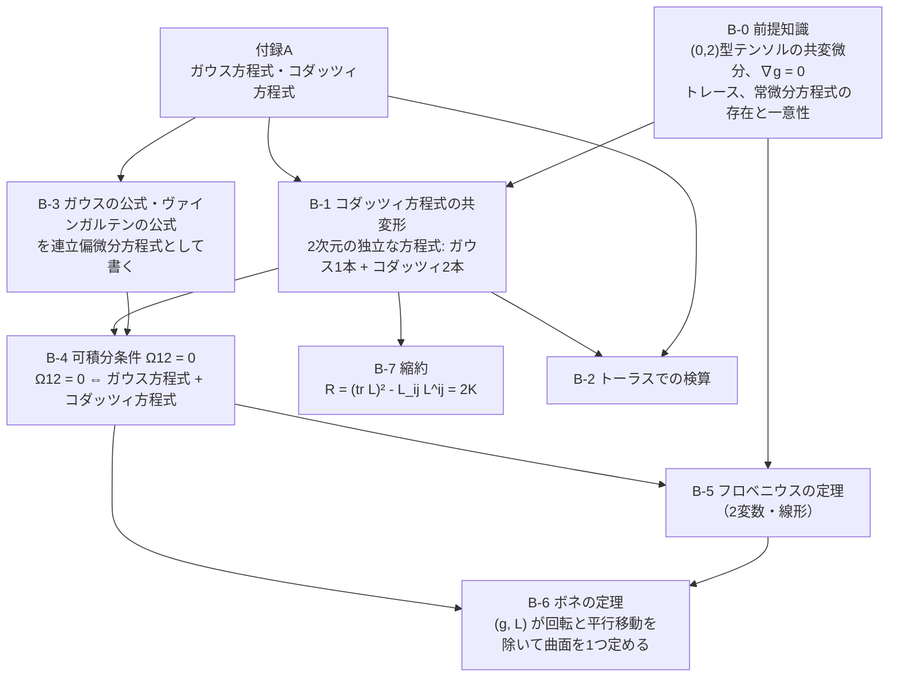
```mermaid
flowchart TD
    Pre["B-0 前提知識<br/>(0,2)型テンソルの共変微分、∇g = 0<br/>トレース、常微分方程式の存在と一意性"]
    GC["付録A<br/>ガウス方程式・コダッツィ方程式"]
    B1["B-1 コダッツィ方程式の共変形<br/>2次元の独立な方程式: ガウス1本 + コダッツィ2本"]
    B3["B-3 ガウスの公式・ヴァインガルテンの公式<br/>を連立偏微分方程式として書く"]
    B4["B-4 可積分条件 Ω12 = 0<br/>Ω12 = 0 ⇔ ガウス方程式 + コダッツィ方程式"]
    B5["B-5 フロベニウスの定理<br/>（2変数・線形）"]
    B6["B-6 ボネの定理<br/>(g, L) が回転と平行移動を除いて曲面を1つ定める"]
    B7["B-7 縮約<br/>R = (tr L)² - L_ij L^ij = 2K"]
    T["B-2 トーラスでの検算"]

    Pre --> B1
    Pre --> B5
    GC --> B1
    GC --> B3
    B3 --> B4
    B1 --> B4
    B4 --> B5
    B5 --> B6
    B4 --> B6
    B1 --> B7
    GC --> T
    B1 --> T
```

---

<a id="appC"></a>

# 付録C：曲がった時空の中の超曲面（ADM拘束条件）

<!-- part-toc:start -->

**この付録の内容**

- [C-0. 記法と前提知識](#C-0)
  - [C-0-0. 多様体とは何だったか](#C-0-0)
  - [C-0-1. 記法](#C-0-1)
  - [C-0-2. 不定値計量と空間的な超曲面](#C-0-2)
  - [C-0-3. クリストッフェル記号の公式は不定値計量でも成り立つ](#C-0-3)
  - [C-0-4. リーマン曲率テンソルの最初の2添字の反対称性](#C-0-4)
  - [C-0-5. Σに沿った共変微分](#C-0-5)
- [C-1. 一般化されたガウス・コダッツィ方程式](#C-1)
  - [C-1-1. ガウスの公式（外側が曲がった場合）](#C-1-1)
  - [C-1-2. ヴァインガルテンの公式](#C-1-2)
  - [C-1-3. 2回微分して、ガウス方程式とコダッツィ方程式を導く](#C-1-3)
  - [C-1-4. 検算：ミンコフスキー空間の中の双曲面](#C-1-4)
- [C-2. ハミルトン拘束・運動量拘束](#C-2)
  - [C-2-1. 逆計量の分解](#C-2-1)
  - [C-2-2. 外側の曲率をΣの量で書く](#C-2-2)
  - [C-2-3. アインシュタイン方程式と組み合わせる](#C-2-3)
  - [C-2-4. 検算：一様等方な宇宙（フリードマン方程式）](#C-2-4)
- [C-3. 拘束条件の先にあるもの（仮定からの導入）](#C-3)
  - [C-3-1. ガウス正規座標と、外的曲率の意味](#C-3-1)
  - [C-3-2. 発展方程式（真空・ガウス正規座標の場合）](#C-3-2)
  - [C-3-3. 拘束条件が時間発展で保たれること](#C-3-3)
  - [C-3-4. 初期値から時空が決まること（調和座標による導入）](#C-3-4)
  - [C-3-5. 使った仮定の一覧](#C-3-5)
- [付録Cのまとめ](#C-sum)

<!-- part-toc:end -->

付録A・Bでは、平坦な$\mathbb R^3$の中の曲面を扱いました。付録Cでは、外側の空間が曲がっていてもよく、さらに計量が正定値でない（時空のような）場合に、ガウス方程式とコダッツィ方程式がどう変わるかを導出します。最後に、それを一般相対論のアインシュタイン方程式と組み合わせ、ADM形式の拘束条件（ハミルトン拘束・運動量拘束）を導きます。

全体の流れは次のとおりです。

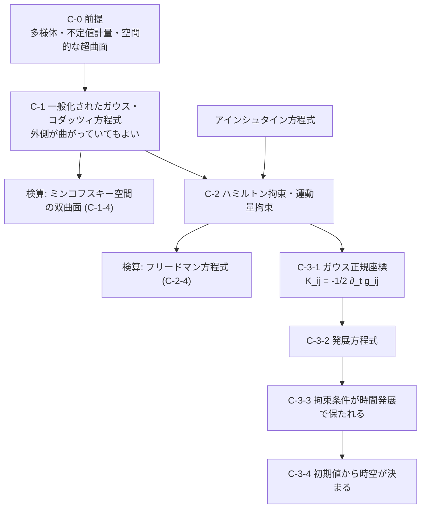
```mermaid
flowchart TD
    C0["C-0 前提<br/>多様体・不定値計量・空間的な超曲面"]
    C1["C-1 一般化されたガウス・コダッツィ方程式<br/>外側が曲がっていてもよい"]
    M["検算: ミンコフスキー空間の双曲面 (C-1-4)"]
    E["アインシュタイン方程式"]
    C2["C-2 ハミルトン拘束・運動量拘束"]
    F["検算: フリードマン方程式 (C-2-4)"]
    C31["C-3-1 ガウス正規座標<br/>K_ij = -1/2 ∂_t g_ij"]
    C32["C-3-2 発展方程式"]
    C33["C-3-3 拘束条件が時間発展で保たれる"]
    C34["C-3-4 初期値から時空が決まる"]

    C0 --> C1
    C1 --> M
    C1 --> C2
    E --> C2
    C2 --> F
    C2 --> C31 --> C32 --> C33 --> C34
```

<a id="C-0"></a>

## C-0. 記法と前提知識

<a id="C-0-0"></a>

### C-0-0. 多様体とは何だったか

付録A・Bでは、曲面は$\mathbb R^3$の中にあり、外側の空間にはデカルト座標という特別な座標がありました。付録Cでは、外側の空間そのものが曲がっていてもよい、という状況を扱います。そのための舞台が**多様体**です。詳しくは多様体のノートで扱うので、ここでは付録Cで使う範囲の確認に止めます。

**多様体**：各点の近くでは$\mathbb R^N$と同じように座標$(x^1,\dots,x^N)$が張れる空間を、$N$次元の多様体と呼びます。1つの座標系（チャート）で全体を覆えるとは限らず、一般にはいくつかの座標系を貼り合わせて全体を覆います。座標系が重なる部分では、座標の変換が滑らか（何回でも微分できる）であることを要求します。

**例**：球面は2次元の多様体です。緯度・経度にあたる$(\theta,\phi)$は、北極・南極を除けば座標として使えますが、極では$\phi$が定まりません（Part VIIIで見た座標特異点）。極の近くでは別の座標系を使って覆います。トーラス（B-2）も2次元の多様体で、$(\theta,\phi)$の範囲を$[0,2\pi)$に取れば、角度の周期性を除いて1つの座標系で覆えます。一般相対論の時空は4次元の多様体です。

**接ベクトル**：多様体の点$p$で、座標の方向を表すベクトル$\partial/\partial x^\mu$（Part Iの基底ベクトル$\mathbf e_i$にあたります）の線形結合$V=V^\mu\,\partial/\partial x^\mu$を、$p$での接ベクトルと呼びます。$p$での接ベクトル全体（接空間）は$N$次元のベクトル空間です。座標を取り替えると、成分$V^\mu$はヤコビ行列で変換されます（Part Iと同じ規則です）。付録A・Bでは接ベクトルを$\mathbb R^3$の矢印として直接扱えましたが、一般の多様体には外側の空間がないので、接ベクトルは成分$V^\mu$で扱います。

**計量**：各点の接空間に、対称で逆行列を持つ行列$\bar g_{\mu\nu}$を滑らかに指定したものを計量と呼び、内積$\bar g(U,V)=\bar g_{\mu\nu}U^\mu V^\nu$を定めます。計量が正定値ならリーマン多様体、正定値でなければ擬リーマン多様体と呼びます（時空は後者です。C-0-2）。

**超曲面と埋め込み**：$N$次元の多様体$M$の中の$N-1$次元の多様体$\Sigma$を超曲面と呼びます。$\Sigma$上の座標$y^i$（$i=1,\dots,N-1$）を使って、$\Sigma$の点が$M$のどの点にあたるかを$x^\mu(y)$で表したものを埋め込みと呼びます。$\Sigma$が各点で$N-1$次元の広がりを持つためには、$N-1$本の接ベクトル$e_i{}^\mu=\partial x^\mu/\partial y^i$が1次独立である必要があります。付録A・Bの曲面は、$N=3$、$M=\mathbb R^3$、$x^\mu(y)=\mathbf r(u^1,u^2)$の場合です。

<a id="C-0-1"></a>

### C-0-1. 記法

**外側の空間**：$N$次元の多様体$M$を考え、座標を$x^\mu$と書きます。**ギリシャ文字の添字**$\mu,\nu,\alpha,\beta,\gamma,\delta,\lambda$は$M$の座標の番号を走ります。外側の空間の量には上線を付けます：計量$\bar g_{\mu\nu}$、逆計量$\bar g^{\mu\nu}$、クリストッフェル記号$\bar\Gamma^\mu{}_{\alpha\beta}$、共変微分$\bar\nabla$、リーマン曲率テンソル$\bar R^\delta{}_{\gamma\alpha\beta}$、リッチテンソル$\bar R_{\beta\delta}$、スカラー曲率$\bar R$。また、ベクトル$U,V$の内積を$\bar g(U,V):=\bar g_{\mu\nu}U^\mu V^\nu$と書きます。

**超曲面**：$M$の中の$N-1$次元の曲面$\Sigma$（超曲面）を考え、$\Sigma$上の座標を$y^i$と書きます。**ラテン文字の添字**$i,j,k,l,m,p,q$は$\Sigma$の座標の番号を走ります。埋め込みを$x^\mu(y)$とし、$\partial_j:=\partial/\partial y^j$と書きます。

**接ベクトル**：$e_i{}^\mu:=\dfrac{\partial x^\mu}{\partial y^i}$を$e_i$と書きます（付録A・Bの$\mathbf r_i$にあたります）。

**誘導計量**：$g_{ij}:=\bar g(e_i,e_j)=\bar g_{\mu\nu}e_i{}^\mu e_j{}^\nu$（付録A・Bの$g_{ij}=\mathbf r_i\cdot\mathbf r_j$にあたります）。$g_{ij}$から作ったクリストッフェル記号を$\Gamma^k{}_{ij}$、リーマン曲率テンソルを$R^l{}_{kij}$、リッチテンソルを$R_{ij}$、スカラー曲率を$R$と書きます（上線なし）。**$\Sigma$上の共変微分は$D_i$と書き**、外側の$\bar\nabla$と区別します（付録Bの$\nabla$にあたります）。$D^i:=g^{il}D_l$です。

**単位法線**：$n^\mu$を、$\bar g(n,e_i)=0$（すべての$i$）を満たし、長さが1または$-1$のベクトルとします。**記法**：

$$
\varepsilon:=\bar g(n,n)=\pm1
$$

$\varepsilon=+1$が付録A・Bの状況（正定値計量）、$\varepsilon=-1$が時空の中の空間的な超曲面の状況です（C-0-2）。$\varepsilon^2=1$なので$1/\varepsilon=\varepsilon$です。

**添字の位置に書いた$n$**：付録Cでは、添字の位置に書いた$n$は添字ではなく、$n^\mu$との縮約を表します。例えば$\bar R_{nilj}:=\bar R_{\mu\alpha\lambda\beta}n^\mu e_i{}^\alpha e_l{}^\lambda e_j{}^\beta$、$\bar R_{pilj}:=\bar R_{\mu\alpha\lambda\beta}e_p{}^\mu e_i{}^\alpha e_l{}^\lambda e_j{}^\beta$です（ラテン文字の位置は$e$との縮約）。ここで$\bar R_{\mu\alpha\lambda\beta}:=\bar g_{\mu\delta}\bar R^\delta{}_{\alpha\lambda\beta}$です。付録AのA-8で添字として使った$n$とは別のものです。

**外的曲率**：C-1で定義する$K_{ij}$が、付録A・Bの$L_{ij}$にあたります（A-11で触れた「外的曲率」）。**付録Cではガウス曲率は使わず、添字のない$K$という記号も使いません。** トレースは$\operatorname{tr}K:=g^{ij}K_{ij}$、添字を上げたものは$K_i{}^k:=g^{jk}K_{ij}$、$K^{ij}:=g^{ik}g^{jl}K_{kl}$と書きます。

**物理定数など**：万有引力定数を$G_{\mathrm N}$と書き、アインシュタインテンソル$\bar G_{\mu\nu}$と区別します。エネルギー運動量テンソルを$T_{\mu\nu}$とします。

**付録A・Bとの記法の対応**（この節の記法を表にまとめたものです）：

| | 付録A・B | 付録C |
|---|---|---|
| 外側の空間 | $\mathbb R^3$（平坦、正定値計量） | 曲がっていてよい（不定値計量も可、時空） |
| 法線の長さ $\varepsilon=\bar g(n,n)$ | $+1$ | $-1$（空間的な超曲面のとき） |
| 外的曲率の記号 | $L_{ij}$ | $K_{ij}$ |
| 曲面上の共変微分 | $\nabla$ | $D_i$（外側は $\bar\nabla$） |
| ガウス曲率 $K$ | 使う | 使わない（添字のない $K$ も使わない） |

<a id="C-0-2"></a>

### C-0-2. 不定値計量と空間的な超曲面

**不定値計量**：計量は対称で逆行列を持ちますが、正定値とは限らないものも考えます。特殊相対論のミンコフスキー計量$\eta=\operatorname{diag}(-1,1,1,1)$（座標$(t,x,y,z)$、行列値微分形式のノートと同じ符号の約束）がその例です。

**ベクトルの分類**：$\bar g(v,v)<0$のベクトルを時間的、$\bar g(v,v)>0$を空間的、$\bar g(v,v)=0$（$v\ne0$）を光的と呼びます。

**空間的な超曲面**：接ベクトルがすべて空間的であるような超曲面を空間的超曲面と呼びます。このとき誘導計量$g_{ij}$は正定値です。

**例**：ミンコフスキー時空の$t=\text{一定}$の面では、接ベクトル$\partial_x,\partial_y,\partial_z$はすべて$\eta(v,v)=1>0$で空間的、法線$n=\partial_t$は$\eta(n,n)=-1$で時間的です。つまり$\varepsilon=-1$です。

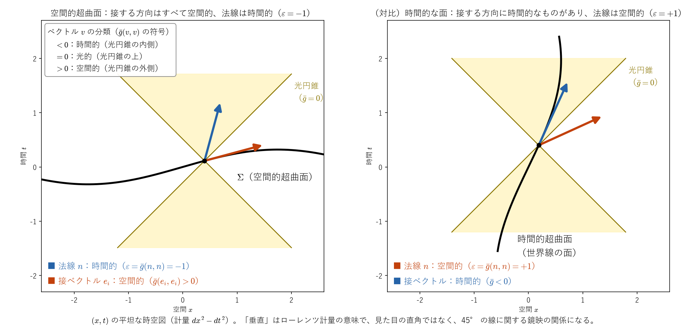

*$(x,t)$ の平坦な時空図（光円錐は 45°）。左：空間的超曲面 $\Sigma$ では、接ベクトル（橙）は空間的で、法線 $n$（青）は時間的（$\varepsilon=-1$）。右（対比）：時間的な面では、接ベクトルが時間的で、法線は空間的（$\varepsilon=+1$）。「垂直」はローレンツ計量の意味で、見た目の直角ではなく、45° の線に関する鏡映の関係になる。*

**主張**：時空の計量が、各点である基底を取ると$\operatorname{diag}(-1,1,\dots,1)$（$-1$が1つ、$+1$が$N-1$個）になる型のとき、空間的超曲面には単位法線が存在し、それは必ず時間的で$\varepsilon=-1$です。証明します。

**ステップ1：法線方向が1次元だけあること**。**記法**：接ベクトル$e_1,\dots,e_{N-1}$が張る部分空間を$V$、$V$のすべてのベクトルと直交するベクトル全体を$W$とします。任意のベクトル$v$に対して、

$$
v_\parallel:=g^{ij}\,\bar g(v,e_j)\,e_i
$$

とおきます（$g_{ij}$は正定値なので逆行列$g^{ij}$があります）。$v-v_\parallel$は$V$と直交します。実際、$e_k$との内積を取ると、$\bar g(e_i,e_k)=g_{ik}$と$g^{ij}g_{ik}=\delta^j{}_k$から：

$$
\bar g(v-v_\parallel,e_k)=\bar g(v,e_k)-g^{ij}\bar g(v,e_j)g_{ik}=\bar g(v,e_k)-\bar g(v,e_k)=0
$$

$V$に含まれないベクトル$v$を取れば$v-v_\parallel\ne0$なので、$W$はゼロでないベクトルを含みます。また、$V$と$W$の両方に含まれるベクトル$w$は$\bar g(w,w)=0$を満たしますが、$V$上では計量が正定値なので$w=0$です。$V$が$N-1$次元なので、$W$は1次元です。$W$を張るベクトルを$m$とします。

**ステップ2：$\bar g(m,m)<0$であること**。任意のベクトル$v$は、ステップ1から$v=u+c\,m$（$u\in V$、$c$は数）と書けます。$\bar g(u,m)=0$なので：

$$
\bar g(v,v)=\bar g(u,u)+2c\,\bar g(u,m)+c^2\bar g(m,m)=\bar g(u,u)+c^2\,\bar g(m,m)
$$

もし$\bar g(m,m)\ge0$なら、$\bar g(u,u)\ge0$（$V$上で正定値）から、すべての$v$で$\bar g(v,v)\ge0$になります。しかし計量の型の仮定から、$\operatorname{diag}(-1,1,\dots,1)$の最初の基底ベクトル$f$は$\bar g(f,f)=-1<0$を満たします。これは矛盾なので、$\bar g(m,m)<0$です。

$n:=m/\sqrt{-\bar g(m,m)}$とおけば$\bar g(n,n)=-1$で、これが単位法線です（$-n$も単位法線で、どちらを選ぶかは向きの約束です）。

なお、外側の計量が正定値の場合（付録A・B）は、同じ議論で$\bar g(m,m)>0$となり、$\varepsilon=+1$です。

<a id="C-0-3"></a>

### C-0-3. クリストッフェル記号の公式は不定値計量でも成り立つ

Part II（およびA-2、B-0-2）の公式が、正定値性を使わずに導けることを確認します。条件は2つです：外側の計量が共変微分で保存されること（$\bar\nabla\bar g=0$）と、$\bar\Gamma$の下2添字が対称であること。

$\bar\nabla_\alpha\bar g_{\beta\gamma}=0$をB-0-1の形で書き、偏微分について解くと：

$$
\partial_\alpha\bar g_{\beta\gamma}=\bar\Gamma^\lambda{}_{\beta\alpha}\bar g_{\lambda\gamma}+\bar\Gamma^\lambda{}_{\gamma\alpha}\bar g_{\beta\lambda}\tag{C.1}
$$

添字の役割を入れ替えた3本を書きます：

$$
\partial_\alpha\bar g_{\beta\gamma}=\bar\Gamma^\lambda{}_{\beta\alpha}\bar g_{\lambda\gamma}+\bar\Gamma^\lambda{}_{\gamma\alpha}\bar g_{\beta\lambda}
$$

$$
\partial_\beta\bar g_{\alpha\gamma}=\bar\Gamma^\lambda{}_{\alpha\beta}\bar g_{\lambda\gamma}+\bar\Gamma^\lambda{}_{\gamma\beta}\bar g_{\alpha\lambda}
$$

$$
\partial_\gamma\bar g_{\alpha\beta}=\bar\Gamma^\lambda{}_{\alpha\gamma}\bar g_{\lambda\beta}+\bar\Gamma^\lambda{}_{\beta\gamma}\bar g_{\alpha\lambda}
$$

1本目＋2本目−3本目を計算します。$\bar\Gamma$と$\bar g$の対称性から、$\bar\Gamma^\lambda{}_{\gamma\alpha}\bar g_{\beta\lambda}$と$-\bar\Gamma^\lambda{}_{\alpha\gamma}\bar g_{\lambda\beta}$、$\bar\Gamma^\lambda{}_{\gamma\beta}\bar g_{\alpha\lambda}$と$-\bar\Gamma^\lambda{}_{\beta\gamma}\bar g_{\alpha\lambda}$がそれぞれ打ち消し合い、$\bar\Gamma^\lambda{}_{\beta\alpha}\bar g_{\lambda\gamma}+\bar\Gamma^\lambda{}_{\alpha\beta}\bar g_{\lambda\gamma}=2\bar\Gamma^\lambda{}_{\alpha\beta}\bar g_{\lambda\gamma}$が残ります：

$$
2\bar\Gamma^\lambda{}_{\alpha\beta}\bar g_{\lambda\gamma}=\partial_\alpha\bar g_{\beta\gamma}+\partial_\beta\bar g_{\alpha\gamma}-\partial_\gamma\bar g_{\alpha\beta}
$$

両辺に$\bar g^{\gamma\delta}$を掛けて$\gamma$について和を取れば$\bar\Gamma^\delta{}_{\alpha\beta}$が求まります。使ったのは、$\bar g$が対称であることと逆行列を持つことだけで、正定値性は使っていません。リーマン曲率テンソルの定義（Part VII §2）と公式、リッチテンソルとスカラー曲率の定義も、同じく正定値性を使わないので、そのまま使えます。

<a id="C-0-4"></a>

### C-0-4. リーマン曲率テンソルの最初の2添字の反対称性

$$
\bar R_{\mu\nu\alpha\beta}=-\bar R_{\nu\mu\alpha\beta}
$$

を使います。一般の多様体での証明は多様体のノートPart II-bで扱うので、ここでは簡易的な証明に止めます。

任意のベクトル場$V^\mu$から、スカラー$s:=\bar g_{\mu\nu}V^\mu V^\nu$を作ります。スカラーについては、$\bar\nabla_\alpha\bar\nabla_\beta s=\partial_\alpha\partial_\beta s-\bar\Gamma^\lambda{}_{\beta\alpha}\partial_\lambda s$（B-0-1と同じ規則で、$\partial_\beta s$を下付き添字1個の量として共変微分）が$\alpha,\beta$について対称なので、

$$
\big(\bar\nabla_\alpha\bar\nabla_\beta-\bar\nabla_\beta\bar\nabla_\alpha\big)s=0
$$

です。一方、$\bar\nabla\bar g=0$から$\bar g$は共変微分の外に出せるので、積の微分則を2回使うと：

$$
\bar\nabla_\alpha\bar\nabla_\beta s=\bar g_{\mu\nu}\Big[(\bar\nabla_\alpha\bar\nabla_\beta V^\mu)V^\nu+(\bar\nabla_\beta V^\mu)(\bar\nabla_\alpha V^\nu)+(\bar\nabla_\alpha V^\mu)(\bar\nabla_\beta V^\nu)+V^\mu(\bar\nabla_\alpha\bar\nabla_\beta V^\nu)\Big]
$$

$\alpha\leftrightarrow\beta$を入れ替えて引くと、中央の2項（$\bar g_{\mu\nu}$の対称性から、$\alpha,\beta$について対称）は消えます。残る項に$(\bar\nabla_\alpha\bar\nabla_\beta-\bar\nabla_\beta\bar\nabla_\alpha)V^\mu=\bar R^\mu{}_{\gamma\alpha\beta}V^\gamma$（Part VII §2の定義）を代入すると：

$$
0=\bar g_{\mu\nu}\bar R^\mu{}_{\gamma\alpha\beta}V^\gamma V^\nu+\bar g_{\mu\nu}V^\mu\bar R^\nu{}_{\gamma\alpha\beta}V^\gamma=\bar R_{\nu\gamma\alpha\beta}V^\gamma V^\nu+\bar R_{\mu\gamma\alpha\beta}V^\mu V^\gamma
$$

第2項のダミー添字を$\mu\to\nu$と付け替えると第1項と同じになり、$2\bar R_{\nu\gamma\alpha\beta}V^\nu V^\gamma=0$です。**記法**：$\alpha,\beta$を固定し、$S_{\nu\gamma}:=\bar R_{\nu\gamma\alpha\beta}+\bar R_{\gamma\nu\alpha\beta}$（$\nu,\gamma$について対称）とおくと、$S_{\nu\gamma}V^\nu V^\gamma=2\bar R_{\nu\gamma\alpha\beta}V^\nu V^\gamma=0$がすべての$V$で成り立ちます。$V=U+W$を代入し、$U$だけ・$W$だけの項（どちらもゼロ）を引くと、$S$の対称性から$2S_{\nu\gamma}U^\nu W^\gamma=0$です。$U,W$は任意なので$S_{\nu\gamma}=0$、つまり最初の2添字について反対称です。

最後の2添字についての反対称性$\bar R^\delta{}_{\gamma\alpha\beta}=-\bar R^\delta{}_{\gamma\beta\alpha}$は、公式で$\alpha\leftrightarrow\beta$を入れ替えると全項の符号が反転することから直接分かります（多様体のノートPart II-b §7-a）。

**帰結**：同じ量を最初の2つに入れると成分はゼロです。特に$\bar R_{nnnn}=0$、$\bar R_{nnni}=0$です。

<a id="C-0-5"></a>

### C-0-5. $\Sigma$に沿った共変微分

$\Sigma$上でだけ定義されたベクトル$V^\mu(y)$の、$e_j$方向の共変微分を次のように定義します：

$$
\big(\bar\nabla_{e_j}V\big)^\mu:=\partial_jV^\mu+\bar\Gamma^\mu{}_{\alpha\beta}V^\alpha e_j{}^\beta
$$

（$V$が$M$全体のベクトル場なら、連鎖律$\partial_jV^\mu=e_j{}^\beta\partial_\beta V^\mu$から、これは$e_j{}^\beta\bar\nabla_\beta V^\mu$、つまり$e_j$方向の共変微分に一致します。）

**性質1（積の微分則）**：関数$f(y)$に対して$\bar\nabla_{e_j}(fV)=(\partial_jf)V+f\bar\nabla_{e_j}V$。定義に代入すれば直接分かります。

**性質2（接ベクトル同士は対称）**：$V=e_i$とすると、$\partial_je_i{}^\mu=\partial_j\partial_ix^\mu$なので：

$$
\big(\bar\nabla_{e_j}e_i\big)^\mu=\partial_j\partial_ix^\mu+\bar\Gamma^\mu{}_{\alpha\beta}e_i{}^\alpha e_j{}^\beta
$$

混合偏微分の対称性と$\bar\Gamma$の下2添字の対称性から、$\bar\nabla_{e_j}e_i=\bar\nabla_{e_i}e_j$です（付録Aの$\mathbf r_{ij}=\mathbf r_{ji}$にあたります）。

**性質3（内積の微分）**：$\partial_j\bar g(U,V)=\bar g(\bar\nabla_{e_j}U,V)+\bar g(U,\bar\nabla_{e_j}V)$。確認します。$\bar g_{\mu\nu}$は$x(y)$を通じて$y$に依存するので、連鎖律と積の微分から：

$$
\partial_j\big(\bar g_{\mu\nu}U^\mu V^\nu\big)=(\partial_\beta\bar g_{\mu\nu})e_j{}^\beta U^\mu V^\nu+\bar g_{\mu\nu}(\partial_jU^\mu)V^\nu+\bar g_{\mu\nu}U^\mu(\partial_jV^\nu)
$$

第1項に(C.1)（添字を$(\alpha,\beta,\gamma)\to(\beta,\mu,\nu)$と付け替えたもの）$\partial_\beta\bar g_{\mu\nu}=\bar\Gamma^\lambda{}_{\mu\beta}\bar g_{\lambda\nu}+\bar\Gamma^\lambda{}_{\nu\beta}\bar g_{\mu\lambda}$を代入します。$\bar\Gamma^\lambda{}_{\mu\beta}\bar g_{\lambda\nu}U^\mu e_j{}^\beta V^\nu$では、ダミー添字の名前を$\mu\to\alpha$、$\lambda\to\mu$と付け替えて$\bar g_{\mu\nu}\big(\bar\Gamma^\mu{}_{\alpha\beta}U^\alpha e_j{}^\beta\big)V^\nu$とし、第2項と合わせると$\bar g(\bar\nabla_{e_j}U,V)$になります。もう一方の項も同様に第3項と合わせて$\bar g(U,\bar\nabla_{e_j}V)$になります。

**性質4（2回の共変微分の交換子は曲率）**：

$$
\boxed{\big(\bar\nabla_{e_l}\bar\nabla_{e_j}V-\bar\nabla_{e_j}\bar\nabla_{e_l}V\big)^\mu=\bar R^\mu{}_{\alpha\lambda\beta}V^\alpha e_l{}^\lambda e_j{}^\beta}\tag{C.2}
$$

Part VII §2の計算を、$\Sigma$に沿った微分で行います。$W:=\bar\nabla_{e_j}V$、つまり$W^\mu=\partial_jV^\mu+\bar\Gamma^\mu{}_{\alpha\beta}V^\alpha e_j{}^\beta$とおくと：

$$
\big(\bar\nabla_{e_l}W\big)^\mu=\partial_lW^\mu+\bar\Gamma^\mu{}_{\gamma\delta}W^\gamma e_l{}^\delta
$$

第1項を積の微分と連鎖律（$\partial_l\bar\Gamma^\mu{}_{\alpha\beta}=e_l{}^\lambda\partial_\lambda\bar\Gamma^\mu{}_{\alpha\beta}$）で展開します：

$$
\partial_lW^\mu=\partial_l\partial_jV^\mu+(\partial_\lambda\bar\Gamma^\mu{}_{\alpha\beta})e_l{}^\lambda V^\alpha e_j{}^\beta+\bar\Gamma^\mu{}_{\alpha\beta}(\partial_lV^\alpha)e_j{}^\beta+\bar\Gamma^\mu{}_{\alpha\beta}V^\alpha(\partial_l\partial_jx^\beta)
$$

第2項に$W$を代入します：

$$
\bar\Gamma^\mu{}_{\gamma\delta}W^\gamma e_l{}^\delta=\bar\Gamma^\mu{}_{\gamma\delta}(\partial_jV^\gamma)e_l{}^\delta+\bar\Gamma^\mu{}_{\gamma\delta}\bar\Gamma^\gamma{}_{\alpha\beta}V^\alpha e_j{}^\beta e_l{}^\delta
$$

$l\leftrightarrow j$を入れ替えたものを引くとき、各項がどうなるかを見ます。

- $\partial_l\partial_jV^\mu$と$\bar\Gamma^\mu{}_{\alpha\beta}V^\alpha\partial_l\partial_jx^\beta$は、混合偏微分の対称性から$l,j$について対称なので消えます。
- $\bar\Gamma^\mu{}_{\alpha\beta}(\partial_lV^\alpha)e_j{}^\beta+\bar\Gamma^\mu{}_{\gamma\delta}(\partial_jV^\gamma)e_l{}^\delta$の2項は、後者のダミー添字を$\gamma\to\alpha$、$\delta\to\beta$と付け替えると、前者で$l\leftrightarrow j$を入れ替えたものになります。2項の和は$l,j$について対称なので消えます。
- $\partial\bar\Gamma$の項：$l\leftrightarrow j$を入れ替えた項では、ダミー添字$\lambda$と$\beta$の名前を入れ替えて$e_l{}^\lambda e_j{}^\beta$の形にそろえると、$\big(\partial_\lambda\bar\Gamma^\mu{}_{\alpha\beta}-\partial_\beta\bar\Gamma^\mu{}_{\alpha\lambda}\big)V^\alpha e_l{}^\lambda e_j{}^\beta$になります。
- $\bar\Gamma\bar\Gamma$の項：まず元の項のダミー添字を$\delta\to\lambda$として$\bar\Gamma^\mu{}_{\gamma\lambda}\bar\Gamma^\gamma{}_{\alpha\beta}V^\alpha e_l{}^\lambda e_j{}^\beta$。入れ替えた項$\bar\Gamma^\mu{}_{\gamma\delta}\bar\Gamma^\gamma{}_{\alpha\beta}V^\alpha e_l{}^\beta e_j{}^\delta$は、ダミー添字を$\beta\to\lambda$、$\delta\to\beta$と付け替えて$\bar\Gamma^\mu{}_{\gamma\beta}\bar\Gamma^\gamma{}_{\alpha\lambda}V^\alpha e_l{}^\lambda e_j{}^\beta$。

まとめて、$\bar\Gamma$の下2添字の対称性で並びを整えると：

$$
\big(\bar\nabla_{e_l}\bar\nabla_{e_j}V-\bar\nabla_{e_j}\bar\nabla_{e_l}V\big)^\mu=\Big[\partial_\lambda\bar\Gamma^\mu{}_{\beta\alpha}-\partial_\beta\bar\Gamma^\mu{}_{\lambda\alpha}+\bar\Gamma^\mu{}_{\lambda\gamma}\bar\Gamma^\gamma{}_{\beta\alpha}-\bar\Gamma^\mu{}_{\beta\gamma}\bar\Gamma^\gamma{}_{\lambda\alpha}\Big]V^\alpha e_l{}^\lambda e_j{}^\beta
$$

リーマン曲率テンソルの公式$R^l{}_{kij}=\partial_i\Gamma^l{}_{jk}-\partial_j\Gamma^l{}_{ik}+\Gamma^l{}_{im}\Gamma^m{}_{jk}-\Gamma^l{}_{jm}\Gamma^m{}_{ik}$の添字を$(l,k,i,j,m)\to(\mu,\alpha,\lambda,\beta,\gamma)$と付け替えると、角括弧はちょうど$\bar R^\mu{}_{\alpha\lambda\beta}$です。これで(C.2)が得られました。

---

<a id="C-1"></a>

## C-1. 一般化されたガウス・コダッツィ方程式

<a id="C-1-1"></a>

### C-1-1. ガウスの公式（外側が曲がった場合）

**記法**：外的曲率を次のように定義します（付録Aの$L_{ij}=\mathbf r_{ij}\cdot\mathbf n$にあたります）：

$$
K_{ij}:=\bar g\big(\bar\nabla_{e_j}e_i,\ n\big)
$$

C-0-5の性質2から$K_{ij}=K_{ji}$です。

**主張**：

$$
\boxed{\bar\nabla_{e_j}e_i=\Gamma^k{}_{ij}\,e_k+\varepsilon K_{ij}\,n}\tag{C.3}
$$

$\{e_1,\dots,e_{N-1},n\}$は各点で基底です（$n$は$e_i$すべてと直交し、$\bar g(n,n)=\varepsilon\ne0$なので、$e_i$の線形結合では書けません）。そこで$\bar\nabla_{e_j}e_i=c^ke_k+d\,n$と展開し、係数を求めます。

**法線方向の係数**：両辺と$n$の内積を取ると、$\bar g(e_k,n)=0$から：

$$
K_{ij}=\bar g(\bar\nabla_{e_j}e_i,n)=d\,\bar g(n,n)=d\,\varepsilon
$$

両辺に$\varepsilon$を掛けて$\varepsilon^2=1$を使うと、$d=\varepsilon K_{ij}$です。

**接する方向の係数**：**記法**：$Q_{ijl}:=\bar g(\bar\nabla_{e_j}e_i,e_l)$とおきます。性質2から$Q_{ijl}=Q_{jil}$です。性質3から：

$$
\partial_jg_{il}=\partial_j\bar g(e_i,e_l)=\bar g(\bar\nabla_{e_j}e_i,e_l)+\bar g(e_i,\bar\nabla_{e_j}e_l)=Q_{ijl}+Q_{lji}
$$

添字の役割を入れ替えた3本を書きます：

$$
\partial_ig_{jl}=Q_{jil}+Q_{lij},\qquad\partial_jg_{il}=Q_{ijl}+Q_{lji},\qquad\partial_lg_{ij}=Q_{ilj}+Q_{jli}
$$

1本目＋2本目−3本目を計算し、$Q$の最初の2添字の対称性（$Q_{jil}=Q_{ijl}$、$Q_{lij}=Q_{ilj}$、$Q_{lji}=Q_{jli}$）を使うと、$Q_{ilj}$と$Q_{jli}$が打ち消し合い：

$$
\partial_ig_{jl}+\partial_jg_{il}-\partial_lg_{ij}=2Q_{ijl}
$$

(B.1)（$a=i,b=j,c=l$、和の文字$m\to k$）と比べると$Q_{ijl}=\Gamma^k{}_{ij}g_{kl}$です。一方、展開式と$e_l$の内積を取ると$Q_{ijl}=c^kg_{kl}+d\,\bar g(n,e_l)=c^kg_{kl}$です。2つを比べ、両辺に$g^{lm}$を掛けて$l$について和を取ると、$c^m=\Gamma^m{}_{ij}$です。これで(C.3)が示されました。

$\varepsilon=+1$、外側が平坦な$\mathbb R^3$の場合（$\bar\Gamma=0$で$\bar\nabla_{e_j}e_i=\mathbf r_{ij}$）、(C.3)はA-2のガウスの公式に戻ります。

<a id="C-1-2"></a>

### C-1-2. ヴァインガルテンの公式

$$
\boxed{\bar\nabla_{e_i}n=-K_i{}^k\,e_k}\tag{C.4}
$$

$\bar g(n,n)=\varepsilon$は定数なので、性質3から$0=\partial_i\bar g(n,n)=2\bar g(\bar\nabla_{e_i}n,n)$です。したがって$\bar\nabla_{e_i}n$は$n$の成分を持たず、$\bar\nabla_{e_i}n=c^ke_k$と書けます。

次に$\bar g(n,e_k)=0$を微分すると、性質3から：

$$
0=\bar g(\bar\nabla_{e_i}n,e_k)+\bar g(n,\bar\nabla_{e_i}e_k)
$$

第2項は、$K$の定義（$K_{ki}=\bar g(\bar\nabla_{e_i}e_k,n)$）と$K$の対称性から$K_{ik}$です。第1項は$c^mg_{mk}$です。したがって$c^mg_{mk}=-K_{ik}$で、両辺に$g^{kq}$を掛けて$k$について和を取ると、$c^q=-g^{kq}K_{ik}=-K_i{}^q$です（A-3と同じ手順です）。ヴァインガルテンの公式には$\varepsilon$が現れません。

<a id="C-1-3"></a>

### C-1-3. 2回微分して、ガウス方程式とコダッツィ方程式を導く

付録AのA-4と同じく、(C.3)をもう1回微分します。(C.3)の右辺に$\bar\nabla_{e_l}$を作用させ、性質1（積の微分則）を使います（$\varepsilon$は定数です）：

$$
\bar\nabla_{e_l}\bar\nabla_{e_j}e_i=(\partial_l\Gamma^k{}_{ij})e_k+\Gamma^k{}_{ij}\,\bar\nabla_{e_l}e_k+\varepsilon(\partial_lK_{ij})n+\varepsilon K_{ij}\,\bar\nabla_{e_l}n
$$

$\bar\nabla_{e_l}e_k$には(C.3)を使います。そのとき、(C.3)の和の文字$k$がすでに使われているので、$(i,j,k)\to(k,l,m)$と付け替えた$\bar\nabla_{e_l}e_k=\Gamma^m{}_{kl}e_m+\varepsilon K_{kl}n$を代入します。$\bar\nabla_{e_l}n$には(C.4)の添字を$(i,k)\to(l,m)$と付け替えた$\bar\nabla_{e_l}n=-K_l{}^me_m$を代入します：

$$
\bar\nabla_{e_l}\bar\nabla_{e_j}e_i=(\partial_l\Gamma^k{}_{ij})e_k+\Gamma^k{}_{ij}\Gamma^m{}_{kl}e_m+\varepsilon\Gamma^k{}_{ij}K_{kl}\,n+\varepsilon(\partial_lK_{ij})n-\varepsilon K_{ij}K_l{}^m\,e_m
$$

第1項のダミー添字$k$を$m$に付け替えて、$e_m$の係数と$n$の係数にまとめます：

$$
\bar\nabla_{e_l}\bar\nabla_{e_j}e_i=\Big[\partial_l\Gamma^m{}_{ij}+\Gamma^k{}_{ij}\Gamma^m{}_{kl}-\varepsilon K_{ij}K_l{}^m\Big]e_m+\varepsilon\Big[\partial_lK_{ij}+\Gamma^k{}_{ij}K_{kl}\Big]n
$$

$\varepsilon=+1$とすれば、A-4の式$(\ast)$と同じ形です。

$l\leftrightarrow j$を入れ替えたものを引くと、左辺は(C.2)で$V=e_i$としたものなので$\bar R^\mu{}_{\alpha\lambda\beta}e_i{}^\alpha e_l{}^\lambda e_j{}^\beta$です。右辺は：

$$
\Big[\partial_l\Gamma^m{}_{ij}-\partial_j\Gamma^m{}_{il}+\Gamma^k{}_{ij}\Gamma^m{}_{kl}-\Gamma^k{}_{il}\Gamma^m{}_{kj}-\varepsilon\big(K_{ij}K_l{}^m-K_{il}K_j{}^m\big)\Big]e_m+\varepsilon\Big[\partial_lK_{ij}-\partial_jK_{il}+\Gamma^k{}_{ij}K_{kl}-\Gamma^k{}_{il}K_{kj}\Big]n
$$

**$e_m$の係数**：最初の4項は、A-6で項ごとに照合した通り$R^m{}_{ilj}$（$\Sigma$自身のリーマン曲率テンソル）です。

**$n$の係数**：B-1-1の計算（$L$を$K$、$\nabla$を$D$と読み替えたもの）から、角括弧は$D_lK_{ij}-D_jK_{il}$です。

したがって：

$$
\bar R^\mu{}_{\alpha\lambda\beta}e_i{}^\alpha e_l{}^\lambda e_j{}^\beta=\Big[R^m{}_{ilj}-\varepsilon\big(K_{ij}K_l{}^m-K_{il}K_j{}^m\big)\Big]e_m{}^\mu+\varepsilon\big(D_lK_{ij}-D_jK_{il}\big)n^\mu
$$

**ガウス方程式**：両辺と$e_p$の内積を取ります。左辺は、C-0-1の記法で$\bar g_{\mu\nu}e_p{}^\nu\bar R^\mu{}_{\alpha\lambda\beta}e_i{}^\alpha e_l{}^\lambda e_j{}^\beta=\bar R_{pilj}$です。右辺は、$\bar g(e_m,e_p)=g_{mp}$、$\bar g(n,e_p)=0$から、$R_{pilj}:=g_{mp}R^m{}_{ilj}$と$K_l{}^mg_{mp}=g^{km}K_{lk}g_{mp}=K_{lp}$（同様に$K_j{}^mg_{mp}=K_{jp}$）を使って：

$$
\boxed{\bar R_{pilj}=R_{pilj}-\varepsilon\big(K_{ij}K_{lp}-K_{il}K_{jp}\big)}\tag{C.5}
$$

**コダッツィ方程式**：両辺と$n$の内積を取ります。左辺は$\bar R_{nilj}$、右辺は$\varepsilon(D_lK_{ij}-D_jK_{il})\bar g(n,n)=\varepsilon^2(\cdots)$なので：

$$
\boxed{\bar R_{nilj}=D_lK_{ij}-D_jK_{il}}\tag{C.6}
$$

**付録A・Bとの関係**：$\varepsilon=+1$で外側が平坦（$\bar R=0$）なら、(C.5)は$R_{pilj}=K_{ij}K_{lp}-K_{il}K_{jp}$で、B-1-2の(B.3)そのものです。(C.6)は$D_lK_{ij}=D_jK_{il}$で、B-1-1のコダッツィ方程式です。一般の場合との違いは、①ガウス方程式の$KK$の項に$\varepsilon$が付くこと、②外側の曲率$\bar R$の項が加わること、の2点だけです。

<a id="C-1-4"></a>

### C-1-4. 検算：ミンコフスキー空間の中の双曲面

トポロジー入門のノート§7で、「一定の負の曲率を持つ双曲平面は、$\mathbb R^3$の中に全体を歪みなく埋め込めない（ヒルベルトの定理）」と紹介しました。ここでは、双曲平面が3次元ミンコフスキー空間の中には埋め込めること、そしてその負の曲率が$\varepsilon=-1$から生じることを確認します。定理そのものはトポロジー入門のノートで扱うので、ここでは(C.5)の符号の確認に止めます。

**設定**：3次元ミンコフスキー空間（座標$(t,x,y)$、計量$\bar g=\operatorname{diag}(-1,1,1)$）の中の曲面を、$a>0$、$\chi>0$として

$$
X(\chi,\phi):=a\big(\cosh\chi,\ \sinh\chi\cos\phi,\ \sinh\chi\sin\phi\big)
$$

とします。$\bar g(X,X)=a^2(-\cosh^2\chi+\sinh^2\chi)=-a^2$なので、これは$-t^2+x^2+y^2=-a^2$の上半分（双曲面）です。外側は平坦で座標がデカルト型なので$\bar\Gamma=0$、$\bar R=0$、$\bar\nabla_{e_j}V=\partial_jV$です。

**誘導計量**：

$$
e_\chi=a(\sinh\chi,\ \cosh\chi\cos\phi,\ \cosh\chi\sin\phi),\qquad e_\phi=a(0,\ -\sinh\chi\sin\phi,\ \sinh\chi\cos\phi)
$$

$$
g_{\chi\chi}=a^2(-\sinh^2\chi+\cosh^2\chi)=a^2,\qquad g_{\phi\phi}=a^2\sinh^2\chi,\qquad g_{\chi\phi}=a^2(0-\sinh\chi\cosh\chi\cos\phi\sin\phi+\cosh\chi\sinh\chi\sin\phi\cos\phi)=0
$$

（$\cosh^2\chi-\sinh^2\chi=1$を使いました。）誘導計量は正定値で、この曲面は空間的です。

**単位法線**：$n:=X/a=(\cosh\chi,\ \sinh\chi\cos\phi,\ \sinh\chi\sin\phi)$とします。$\bar g(n,n)=-\cosh^2\chi+\sinh^2\chi=-1$なので$\varepsilon=-1$です。直交性も確認します：

$$
\bar g(n,e_\chi)=a(-\cosh\chi\sinh\chi+\sinh\chi\cosh\chi\cos^2\phi+\sinh\chi\cosh\chi\sin^2\phi)=0
$$

$$
\bar g(n,e_\phi)=a(0-\sinh^2\chi\cos\phi\sin\phi+\sinh^2\chi\sin\phi\cos\phi)=0
$$

**外的曲率**：$\bar\nabla_{e_j}e_i=\partial_j\partial_iX$です。

$$
\partial_\chi\partial_\chi X=a(\cosh\chi,\ \sinh\chi\cos\phi,\ \sinh\chi\sin\phi)=X\quad\Rightarrow\quad K_{\chi\chi}=\bar g(X,n)=\frac{\bar g(X,X)}{a}=-a
$$

$$
\partial_\phi\partial_\phi X=a(0,\ -\sinh\chi\cos\phi,\ -\sinh\chi\sin\phi)\quad\Rightarrow\quad K_{\phi\phi}=a(-\sinh^2\chi\cos^2\phi-\sinh^2\chi\sin^2\phi)=-a\sinh^2\chi
$$

$$
\partial_\chi\partial_\phi X=a(0,\ -\cosh\chi\sin\phi,\ \cosh\chi\cos\phi)\quad\Rightarrow\quad K_{\chi\phi}=a(-\sinh\chi\cosh\chi\cos\phi\sin\phi+\sinh\chi\cosh\chi\sin\phi\cos\phi)=0
$$

$g$と見比べると$K_{ij}=-g_{ij}/a$です（球面の$L_{ij}=-g_{ij}/a$と同じ形です）。

**(C.3)の検算**：$\chi$方向について、$g$の成分は$\chi$だけの関数なので(B.1)から$\Gamma^\chi{}_{\chi\chi}=\Gamma^\phi{}_{\chi\chi}=0$です。(C.3)の右辺は$\varepsilon K_{\chi\chi}n=(-1)(-a)(X/a)=X$で、$\partial_\chi\partial_\chi X=X$と一致します。$\varepsilon$を付けずに$K_{\chi\chi}n=-X$とすると一致しないので、(C.3)の$\varepsilon$が必要なことが分かります。

**(C.5)によるガウス曲率**：$\bar R=0$なので、(C.5)は$R_{pilj}=\varepsilon(K_{ij}K_{lp}-K_{il}K_{jp})$です。$p=\chi,i=\phi,l=\chi,j=\phi$とすると：

$$
R_{\chi\phi\chi\phi}=\varepsilon\big(K_{\phi\phi}K_{\chi\chi}-K_{\phi\chi}K_{\phi\chi}\big)=(-1)\big((-a\sinh^2\chi)(-a)-0\big)=-a^2\sinh^2\chi
$$

**記法**：この項だけで、ガウス曲率を$K_{\mathrm G}$と書きます。Part VIII §4-eの$K_{\mathrm G}=R_{\chi\phi\chi\phi}/\det g$から：

$$
K_{\mathrm G}=\frac{-a^2\sinh^2\chi}{a^2\cdot a^2\sinh^2\chi}=-\frac1{a^2}
$$

一定の負の曲率、つまり双曲平面です。

**計量だけからの検算**：(B.1)から、ゼロでないクリストッフェル記号は

$$
\Gamma^\chi{}_{\phi\phi}=\frac{-\partial_\chi g_{\phi\phi}}{2g_{\chi\chi}}=\frac{-2a^2\sinh\chi\cosh\chi}{2a^2}=-\sinh\chi\cosh\chi,\qquad\Gamma^\phi{}_{\chi\phi}=\frac{\partial_\chi g_{\phi\phi}}{2g_{\phi\phi}}=\frac{\cosh\chi}{\sinh\chi}
$$

です（Part VIIIの球面の値で$\sin\to\sinh$、$\cos\to\cosh$としたものです）。B-2-7と同じ手順で：

$$
R^\chi{}_{\phi\chi\phi}=\partial_\chi\Gamma^\chi{}_{\phi\phi}-\Gamma^\chi{}_{\phi\phi}\Gamma^\phi{}_{\chi\phi}=-(\cosh^2\chi+\sinh^2\chi)-(-\sinh\chi\cosh\chi)\frac{\cosh\chi}{\sinh\chi}=-\sinh^2\chi
$$

（他の項は、ゼロの$\Gamma$を含むため消えます。）$R_{\chi\phi\chi\phi}=g_{\chi\chi}R^\chi{}_{\phi\chi\phi}=-a^2\sinh^2\chi$で、(C.5)からの値と一致します。

球面（$\varepsilon=+1$、$\mathbb R^3$の中）では同じ形の$K_{ij}=-g_{ij}/a$から$K_{\mathrm G}=+1/a^2$が出ました。ミンコフスキー空間の中では$\varepsilon=-1$によって符号が反転し、$K_{\mathrm G}=-1/a^2$になります。

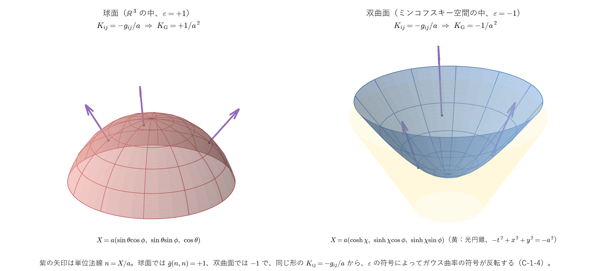

*左：$\mathbb R^3$ の中の球面（$\varepsilon=+1$）。右：ミンコフスキー空間の中の双曲面 $-t^2+x^2+y^2=-a^2$（$\varepsilon=-1$、黄色は光円錐）。どちらも $K_{ij}=-g_{ij}/a$ で、紫の矢印は単位法線 $n=X/a$。球面では $\bar g(n,n)=+1$、双曲面では $-1$ なので、同じ形の $K_{ij}$ からガウス曲率の符号が反転し、$K_{\mathrm G}=+1/a^2$ と $-1/a^2$ になる。*

---

<a id="C-2"></a>

## C-2. ハミルトン拘束・運動量拘束

<a id="C-2-1"></a>

### C-2-1. 逆計量の分解

$$
\boxed{\bar g^{\alpha\beta}=g^{ij}e_i{}^\alpha e_j{}^\beta+\varepsilon\,n^\alpha n^\beta}\tag{C.7}
$$

**一般的な事実**：**記法**：$N$本のベクトルからなる基底を$b_A$（大文字の添字$A,B,C$は$1,\dots,N$を走ります）、そのグラム行列を$G_{AB}:=\bar g(b_A,b_B)$、逆行列を$G^{AB}$とします。このとき$\bar g^{\alpha\beta}=G^{AB}b_A{}^\alpha b_B{}^\beta$です。

証明：両辺に$\bar g_{\beta\gamma}b_C{}^\gamma$を掛けて$\beta,\gamma$について和を取ります。左辺は$\bar g^{\alpha\beta}\bar g_{\beta\gamma}b_C{}^\gamma=\delta^\alpha{}_\gamma b_C{}^\gamma=b_C{}^\alpha$です。右辺は$G^{AB}b_A{}^\alpha\bar g(b_B,b_C)=G^{AB}G_{BC}b_A{}^\alpha=\delta^A{}_Cb_A{}^\alpha=b_C{}^\alpha$です。$\bar g$は逆行列を持ち$b_C$は基底なので、$\bar g_{\beta\gamma}b_C{}^\gamma$（$C=1,\dots,N$）も1次独立で、これらとの縮約がすべて一致する2つの量は等しくなります。

**今の場合**：基底を$\{e_1,\dots,e_{N-1},n\}$とすると、グラム行列は$\bar g(e_i,e_j)=g_{ij}$、$\bar g(e_i,n)=0$、$\bar g(n,n)=\varepsilon$のブロック対角行列です。逆行列もブロック対角で、成分は$g^{ij}$と$1/\varepsilon=\varepsilon$です。これを一般的な事実に代入すると(C.7)です。

<a id="C-2-2"></a>

### C-2-2. 外側の曲率を$\Sigma$の量で書く

**記法**：リッチテンソルを$\bar R_{\beta\delta}:=\bar R^\alpha{}_{\beta\alpha\delta}$（Part IXの$R_{ij}=R^k{}_{ikj}$と同じ縮約）、スカラー曲率を$\bar R:=\bar g^{\beta\delta}\bar R_{\beta\delta}$、アインシュタインテンソルを$\bar G_{\mu\nu}:=\bar R_{\mu\nu}-\frac12\bar R\,\bar g_{\mu\nu}$とします（アインシュタイン方程式はリッチテンソルのノートで扱うので、ここでは定義の確認に止めます）。$n$や$e_i$との縮約は、C-0-1の約束で$\bar R_{nn}:=\bar R_{\beta\delta}n^\beta n^\delta$、$\bar R_{ni}:=\bar R_{\beta\delta}n^\beta e_i{}^\delta$などと書きます。

添字を下げた形では、$\bar R_{\gamma\beta\alpha\delta}=\bar g_{\gamma\mu}\bar R^\mu{}_{\beta\alpha\delta}$から$\bar g^{\alpha\gamma}\bar R_{\gamma\beta\alpha\delta}=\bar g^{\alpha\gamma}\bar g_{\gamma\mu}\bar R^\mu{}_{\beta\alpha\delta}=\bar R^\alpha{}_{\beta\alpha\delta}$なので：

$$
\bar R_{\beta\delta}=\bar g^{\alpha\gamma}\bar R_{\gamma\beta\alpha\delta}
$$

**$\bar R_{nn}$**：(C.7)を$\bar g^{\alpha\gamma}$に代入します（和の文字は$p,l$とします）：

$$
\bar R_{nn}=\big(g^{pl}e_p{}^\gamma e_l{}^\alpha+\varepsilon n^\gamma n^\alpha\big)\bar R_{\gamma\beta\alpha\delta}n^\beta n^\delta=g^{pl}\bar R_{pnln}+\varepsilon\bar R_{nnnn}
$$

C-0-4から$\bar R_{nnnn}=0$です。また、最初の2添字の反対称性と最後の2添字の反対称性を1回ずつ使うと$\bar R_{pnln}=-\bar R_{npln}=\bar R_{npnl}$です。したがって、和の文字を$p\to i$、$l\to j$と付け替えて：

$$
\bar R_{nn}=g^{ij}\bar R_{ninj}
$$

**$\bar R$**：$\bar R=\bar g^{\beta\delta}\bar g^{\alpha\gamma}\bar R_{\gamma\beta\alpha\delta}$の2つの逆計量に(C.7)を代入すると（$\bar g^{\beta\delta}$の和の文字を$i,j$、$\bar g^{\alpha\gamma}$の和の文字を$p,l$とします）、4つの項に分かれます：

- 両方とも接する方向：$g^{ij}g^{pl}\bar R_{\gamma\beta\alpha\delta}e_p{}^\gamma e_i{}^\beta e_l{}^\alpha e_j{}^\delta=g^{ij}g^{pl}\bar R_{pilj}$
- $\bar g^{\beta\delta}$だけ法線方向：$\varepsilon g^{pl}\bar R_{pnln}=\varepsilon g^{pl}\bar R_{npnl}$（上と同じ反対称性）
- $\bar g^{\alpha\gamma}$だけ法線方向：$\varepsilon g^{ij}\bar R_{\gamma\beta\alpha\delta}n^\gamma e_i{}^\beta n^\alpha e_j{}^\delta=\varepsilon g^{ij}\bar R_{ninj}$
- 両方とも法線方向：$\varepsilon^2\bar R_{nnnn}=0$

2番目の項の和の文字を$p\to i$、$l\to j$と付け替えると3番目の項と同じになるので：

$$
\bar R=g^{ij}g^{pl}\bar R_{pilj}+2\varepsilon\,g^{ij}\bar R_{ninj}
$$

**$\bar G_{nn}$**：$\bar G_{nn}=\bar R_{nn}-\frac12\bar R\,\bar g(n,n)=\bar R_{nn}-\frac12\varepsilon\bar R$に代入します：

$$
\bar G_{nn}=g^{ij}\bar R_{ninj}-\tfrac12\varepsilon\,g^{ij}g^{pl}\bar R_{pilj}-\varepsilon^2g^{ij}\bar R_{ninj}
$$

$\varepsilon^2=1$から第1項と第3項が打ち消し合い、法線方向の成分がすべて消えます：

$$
\bar G_{nn}=-\tfrac12\varepsilon\,g^{ij}g^{pl}\bar R_{pilj}
$$

**ガウス方程式を代入**：(C.5)を代入します：

$$
g^{ij}g^{pl}\bar R_{pilj}=g^{ij}g^{pl}R_{pilj}-\varepsilon\,g^{ij}g^{pl}\big(K_{ij}K_{lp}-K_{il}K_{jp}\big)
$$

第1項：B-7-1と同じく$g^{pl}R_{pilj}=R^l{}_{ilj}=R_{ij}$なので、$g^{ij}R_{ij}=R$です。第2項の括弧の前半は$(g^{ij}K_{ij})(g^{pl}K_{lp})=(\operatorname{tr}K)^2$、後半は$K_{il}g^{ij}g^{lp}K_{jp}=K_{il}K^{il}$です（C-0-1の$K^{il}$の定義）。ダミー添字を$l\to j$と付け替えて$K_{ij}K^{ij}$と書くと：

$$
\bar G_{nn}=-\tfrac12\varepsilon\Big[R-\varepsilon\big((\operatorname{tr}K)^2-K_{ij}K^{ij}\big)\Big]=-\tfrac12\varepsilon R+\tfrac12\Big[(\operatorname{tr}K)^2-K_{ij}K^{ij}\Big]\tag{C.8}
$$

**$\bar G_{ni}$**：$\bar g(n,e_i)=0$なので$\bar G_{ni}=\bar R_{ni}$です。(C.7)を代入します：

$$
\bar R_{ni}=\bar g^{\alpha\gamma}\bar R_{\gamma\beta\alpha\delta}n^\beta e_i{}^\delta=g^{pl}\bar R_{pnli}+\varepsilon\bar R_{nnni}=g^{pl}\bar R_{pnli}
$$

（C-0-4から$\bar R_{nnni}=0$。）最初の2添字の反対称性で$\bar R_{pnli}=-\bar R_{npli}$とし、(C.6)の添字を$(i,l,j)\to(p,l,i)$と付け替えた$\bar R_{npli}=D_lK_{pi}-D_iK_{pl}$を代入します：

$$
\bar G_{ni}=-g^{pl}\big(D_lK_{pi}-D_iK_{pl}\big)=-D^pK_{pi}+D_i\big(g^{pl}K_{pl}\big)=D_i(\operatorname{tr}K)-D^pK_{pi}\tag{C.9}
$$

（$g^{pl}D_l=D^p$、また$D_ig^{pl}=0$（B-0-2）から$g^{pl}$を$D_i$の中に入れました。）

<a id="C-2-3"></a>

### C-2-3. アインシュタイン方程式と組み合わせる

**アインシュタイン方程式**（宇宙定数なし）は$\bar G_{\mu\nu}=8\pi G_{\mathrm N}T_{\mu\nu}$です。**記法**：$\mathcal E:=T_{\mu\nu}n^\mu n^\nu$（法線方向に動く観測者が測るエネルギー密度）、$j_i:=T_{\mu\nu}n^\mu e_i{}^\nu$（運動量密度）とします。

時空の中の空間的超曲面では$\varepsilon=-1$です。(C.8)に$\varepsilon=-1$を代入し、$\bar G_{nn}=8\pi G_{\mathrm N}\mathcal E$と組み合わせて両辺を2倍すると：

$$
\boxed{R+(\operatorname{tr}K)^2-K_{ij}K^{ij}=16\pi G_{\mathrm N}\,\mathcal E}\qquad\text{（ハミルトン拘束）}
$$

(C.9)と$\bar G_{ni}=8\pi G_{\mathrm N}j_i$を組み合わせ、和の文字を$p\to j$と付け替えて$K$の対称性を使うと：

$$
\boxed{D_i(\operatorname{tr}K)-D^jK_{ij}=8\pi G_{\mathrm N}\,j_i}\qquad\text{（運動量拘束）}
$$

**意味**：どちらの式にも、時間方向の微分（$K_{ij}$の時間変化）は含まれていません。ある時刻の空間的断面$\Sigma$の上で、初期データ$(g_{ij},K_{ij})$が満たさなければならない条件（拘束条件）です。数値相対論では、この2式を満たす初期データを作ることが計算の出発点になります。

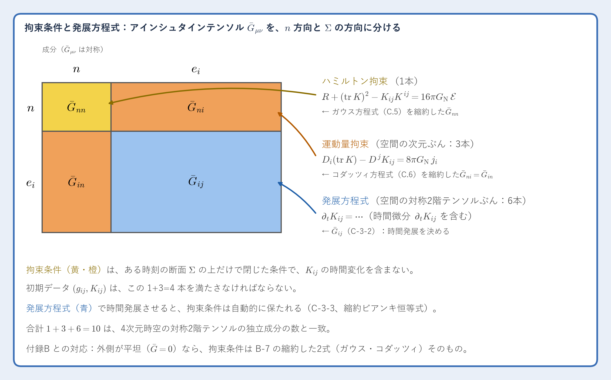

*アインシュタインテンソル $\bar G_{\mu\nu}$ を、$n$ 方向と $\Sigma$ の方向に分ける。$nn$ 成分がハミルトン拘束（ガウス方程式の縮約）、$ni$ 成分が運動量拘束（コダッツィ方程式の縮約）で、どちらも $K_{ij}$ の時間微分を含まない。$ij$ 成分は発展方程式（C-3-2）で、時間発展を決める。1+3+6=10 は、4次元時空の対称2階テンソルの独立成分の数と一致する。*

**符号の約束について**：$K_{ij}$の符号は文献によって逆の定義（$K_{ij}:=+\bar g(\bar\nabla_{e_i}n,e_j)$）が使われることがあります。ハミルトン拘束は$K$について2次なので変わりませんが、運動量拘束は左辺の符号が反転します。$j_i$の符号の約束と合わせて、文献を読む際は定義を確認する必要があります。

**平坦な場合への帰着**：$\varepsilon=+1$、外側が平坦（$\bar G=0$）とすると、(C.8)から$R=(\operatorname{tr}K)^2-K_{ij}K^{ij}$、(C.9)から$D^jK_{ij}=D_i(\operatorname{tr}K)$です。これはB-7-1とB-7-2の2式そのものです。ADMの拘束条件は、付録Bで縮約して得た2式の、時空版にあたります。

**双曲面での検算**：C-1-4の双曲面は、平坦なミンコフスキー空間（$\bar G=0$）の中の$\varepsilon=-1$の曲面なので、ハミルトン拘束の左辺はゼロになるはずです。$R=2K_{\mathrm G}=-2/a^2$（B-7-1の$R=2K$）、$K_{ij}=-g_{ij}/a$から$\operatorname{tr}K=-2/a$、$K_{ij}K^{ij}=2/a^2$なので：

$$
R+(\operatorname{tr}K)^2-K_{ij}K^{ij}=-\frac2{a^2}+\frac4{a^2}-\frac2{a^2}=0
$$

となり、一致します。

<a id="C-2-4"></a>

### C-2-4. 検算：一様等方な宇宙（フリードマン方程式）

**設定**：4次元時空の計量を$\bar g=\operatorname{diag}\big(-1,\ a(t)^2,\ a(t)^2,\ a(t)^2\big)$（座標$(t,x^1,x^2,x^3)$）とします。**記法**：この節の$a(t)$は宇宙の大きさを表すスケール因子で、C-1-4の双曲面の半径とは無関係です。$\dot a:=da/dt$と書きます。

超曲面$\Sigma$を$t=\text{一定}$の面とし、$y^i=x^i$、$e_i=\partial_i$（$e_i{}^\mu=\delta^\mu{}_i$）、$n=\partial_t$とします。$\bar g(n,n)=\bar g_{tt}=-1$なので$\varepsilon=-1$、$\bar g(n,e_i)=\bar g_{ti}=0$です。誘導計量は$g_{ij}=a^2\delta_{ij}$で、$x^i$によらない定数（$t$を固定しているため）なので、$\Sigma$上では$\Gamma^k{}_{ij}=0$、$R^l{}_{kij}=0$、$R=0$です。

**外側のクリストッフェル記号**：C-0-3の公式から、ゼロでないものは次の2種類です（$\bar g$の成分で$t$以外の座標に依存するものはなく、$t$に依存するのは$\bar g_{ij}=a^2\delta_{ij}$だけであるため）：

$$
\bar\Gamma^t{}_{ij}=\tfrac12\bar g^{tt}\big(-\partial_t\bar g_{ij}\big)=\tfrac12(-1)(-2a\dot a\,\delta_{ij})=a\dot a\,\delta_{ij}
$$

$$
\bar\Gamma^i{}_{tj}=\bar\Gamma^i{}_{jt}=\tfrac12\bar g^{ii}\,\partial_t\bar g_{ij}=\tfrac12\cdot\frac1{a^2}\cdot2a\dot a\,\delta_{ij}=\frac{\dot a}{a}\delta^i{}_j
$$

（$i$について和を取りません。）

**外的曲率**：C-0-5の定義で$\partial_je_i{}^\mu=0$なので、$(\bar\nabla_{e_j}e_i)^\mu=\bar\Gamma^\mu{}_{ij}$です。$n$との内積は$\bar g_{tt}\bar\Gamma^t{}_{ij}$なので：

$$
K_{ij}=-a\dot a\,\delta_{ij}
$$

トレースと2乗は：

$$
\operatorname{tr}K=g^{ij}K_{ij}=\frac1{a^2}\delta^{ij}(-a\dot a\,\delta_{ij})=-\frac{3\dot a}{a},\qquad K_{ij}K^{ij}=\frac1{a^4}(a\dot a)^2\delta_{ij}\delta_{ij}=\frac{3\dot a^2}{a^2}
$$

（$\delta^{ij}\delta_{ij}=3$です。）

**ガウス方程式(C.5)の直接の検算**：外側の曲率の空間成分を、リーマン曲率テンソルの公式から直接計算します。公式の添字を$(l,k,i,j)\to(p,i,l,j)$とすると：

$$
\bar R^p{}_{ilj}=\partial_l\bar\Gamma^p{}_{ji}-\partial_j\bar\Gamma^p{}_{li}+\bar\Gamma^p{}_{l\gamma}\bar\Gamma^\gamma{}_{ji}-\bar\Gamma^p{}_{j\gamma}\bar\Gamma^\gamma{}_{li}
$$

すべて空間の添字なので、$\bar\Gamma^p{}_{ji}=0$（空間の添字だけを持つ$\bar\Gamma$はゼロ）で、第1項と第2項は消えます。第3項と第4項では、$\gamma=t$の項だけが残ります：

$$
\bar\Gamma^p{}_{lt}\bar\Gamma^t{}_{ji}=\frac{\dot a}{a}\delta^p{}_l\cdot a\dot a\,\delta_{ij}=\dot a^2\delta^p{}_l\delta_{ij},\qquad\bar\Gamma^p{}_{jt}\bar\Gamma^t{}_{li}=\dot a^2\delta^p{}_j\delta_{il}
$$

$$
\bar R^p{}_{ilj}=\dot a^2\big(\delta^p{}_l\delta_{ij}-\delta^p{}_j\delta_{il}\big)
$$

添字を下げると（$\bar g_{pp}=a^2$、$\bar g_{pt}=0$）$\bar R_{pilj}=a^2\dot a^2(\delta_{pl}\delta_{ij}-\delta_{pj}\delta_{il})$です。一方、(C.5)の右辺は、$R_{pilj}=0$、$\varepsilon=-1$から：

$$
K_{ij}K_{lp}-K_{il}K_{jp}=(a\dot a)^2\big(\delta_{ij}\delta_{lp}-\delta_{il}\delta_{jp}\big)
$$

両辺が一致しました。

**ハミルトン拘束**：$R=0$と上の値を代入すると：

$$
0+\frac{9\dot a^2}{a^2}-\frac{3\dot a^2}{a^2}=16\pi G_{\mathrm N}\mathcal E\quad\Longrightarrow\quad\boxed{\Big(\frac{\dot a}{a}\Big)^2=\frac{8\pi G_{\mathrm N}}{3}\mathcal E}
$$

これは宇宙論の**フリードマン方程式**です。宇宙の膨張率$\dot a/a$が、物質のエネルギー密度で決まることを表しています。

**運動量拘束**：$K_{ij}$は$x^i$によらず、$\Gamma^k{}_{ij}=0$なので$D_lK_{ij}=\partial_lK_{ij}=0$、$D_i(\operatorname{tr}K)=0$です。したがって$j_i=0$で、一様な宇宙には特定の方向への運動量の流れがないことと整合します。

---

<a id="C-3"></a>

## C-3. 拘束条件の先にあるもの（仮定からの導入）

C-2の拘束条件は、アインシュタイン方程式のうち、ある時刻の断面$\Sigma$の上だけで閉じた部分でした。ここでは、残りの部分（時間発展）と、初期値から時空が決まる仕組みを扱います。完全な証明には偏微分方程式論が必要になるため、「どの仮定を置けば、どの結論が出るか」という形で導入します。仮定は、その都度明記します。

<a id="C-3-1"></a>

### C-3-1. ガウス正規座標と、外的曲率の意味

**仮定4（ガウス正規座標）**：$\Sigma$の近くでは、次の形の座標$(t,y^i)$が取れるとします。

$$
\bar g=-dt^2+g_{ij}(t,y)\,dy^idy^j\qquad(\bar g_{tt}=-1,\ \bar g_{ti}=0,\ \bar g_{ij}=g_{ij})
$$

（作り方：$\Sigma$の各点から法線$n$の方向に測地線を伸ばし、その測地線に沿った固有時間を$t$、出発点の座標を$y^i$とします。測地線の存在と、計量がこの形になること（ガウスの補題）は、ここでは仮定として使います。）$\Sigma$は$t=0$の面で、$n=\partial_t$、$e_i=\partial_i$、$\varepsilon=-1$です。

**クリストッフェル記号**：C-0-3の公式から計算します。$\bar g_{tt}=-1$は定数、$\bar g_{ti}=0$なので、$t$を含む$\bar g$の成分の微分はすべてゼロです。

$$
\bar\Gamma^t{}_{ij}=\tfrac12\bar g^{tt}\big(\partial_i\bar g_{jt}+\partial_j\bar g_{it}-\partial_t\bar g_{ij}\big)=\tfrac12(-1)(-\partial_tg_{ij})=\tfrac12\partial_tg_{ij}
$$

$$
\bar\Gamma^i{}_{tj}=\tfrac12\bar g^{ik}\big(\partial_t\bar g_{jk}+\partial_j\bar g_{tk}-\partial_k\bar g_{tj}\big)=\tfrac12g^{ik}\partial_tg_{jk}
$$

$$
\bar\Gamma^t{}_{tt}=\bar\Gamma^t{}_{ti}=\bar\Gamma^i{}_{tt}=0,\qquad\bar\Gamma^k{}_{ij}=\Gamma^k{}_{ij}
$$

（最後の式は、$\bar g$の空間成分が$g_{ij}$そのもので、$\bar g^{kl}=g^{kl}$（ブロック対角）であるためです。）

**外的曲率**：C-0-5の定義で$\partial_je_i{}^\mu=0$なので$(\bar\nabla_{e_j}e_i)^\mu=\bar\Gamma^\mu{}_{ij}$、$n$との内積は$\bar g_{tt}\bar\Gamma^t{}_{ij}$です：

$$
\boxed{K_{ij}=-\bar\Gamma^t{}_{ij}=-\tfrac12\partial_tg_{ij}}
$$

**外的曲率は、空間の計量の時間変化率（の$-\frac12$倍）です。** C-2-4の一様等方な宇宙では、$g_{ij}=a^2\delta_{ij}$から$K_{ij}=-a\dot a\,\delta_{ij}$で、C-2-4の結果と一致します。また$\bar\Gamma^i{}_{tj}=\tfrac12g^{ik}\partial_tg_{jk}=-g^{ik}K_{jk}=-K_j{}^i$です。

したがって、初期データ$(g_{ij},K_{ij})$を与えることは、「時刻$t=0$での空間の計量$g_{ij}$と、その時間微分$\partial_tg_{ij}$」を与えることと同じです。

**参考（一般の座標の場合）**：座標の時間方向を自由に取ると、計量は$\bar g=-N^2dt^2+g_{ij}(dy^i+N^idt)(dy^j+N^jdt)$の形に書けます。$N$をラプス関数（隣の断面までの固有時間の間隔）、$N^i$をシフトベクトル（断面ごとの座標のずれ）と呼びます。このとき同じ計算（$K_{ij}=n_\mu\bar\Gamma^\mu{}_{ij}$、$n_\mu=(-N,0,\dots,0)$）から、$N_i:=g_{ij}N^j$として

$$
K_{ij}=-\frac1{2N}\big(\partial_tg_{ij}-D_iN_j-D_jN_i\big)
$$

となります。$N=1$、$N^i=0$とすると上の式に戻ります。

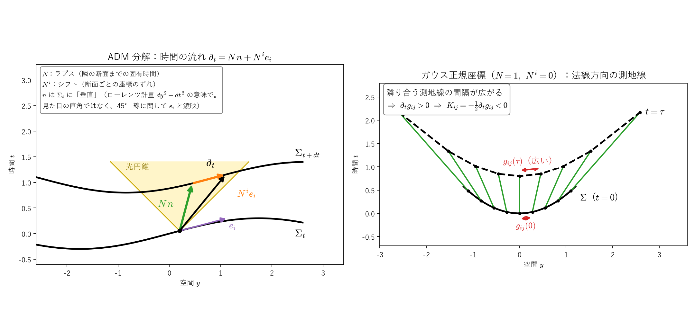

*左：時間の流れ $\partial_t$ を、断面に垂直な成分 $N\,n$（ラプス）と断面に沿う成分 $N^ie_i$（シフト）に分解する。図は $(y,t)$ の平坦な時空図で、「垂直」はローレンツ計量の意味（見た目の直角ではない）。右：ガウス正規座標では断面から法線方向に測地線を伸ばす。隣り合う測地線の間隔が広がる（$\partial_tg_{ij}>0$）ので $K_{ij}=-\frac12\partial_tg_{ij}<0$。*

右側のガウス正規座標を動かすと、次のようになります（ループ再生）。曲がった断面 $\Sigma$ から法線方向に測地線を伸ばし、隣り合う測地線の間隔 $g(\tau)$ が広がる様子と、そのグラフです。

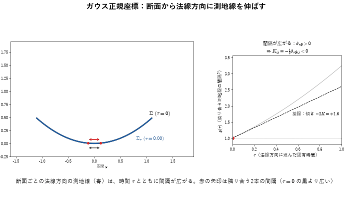

*$(y,t)$ の平坦な時空図（計量 $dy^2-dt^2$）で、$\Sigma:\ t=0.4y^2$ から法線方向に測地線を伸ばす。右のグラフが $g(\tau)$ で、$\tau=0$ での傾き $\partial_\tau g=-2K_{ij}=+1.6$（$K_{ij}=\bar g(X'',n)=-0.8$）に沿って増える。$\partial_\tau g=-2K_{ij}$ は、複数の点で数値的に確認している。*

<a id="C-3-2"></a>

### C-3-2. 発展方程式（真空・ガウス正規座標の場合）

**$\bar R_{ninj}$の計算**：ガウス正規座標では$\bar R_{ninj}=\bar g_{tt}\bar R^t{}_{itj}=-\bar R^t{}_{itj}$です。リーマン曲率テンソルの公式の添字を$(l,k,i,j)\to(t,i,t,j)$とすると：

$$
\bar R^t{}_{itj}=\partial_t\bar\Gamma^t{}_{ji}-\partial_j\bar\Gamma^t{}_{ti}+\bar\Gamma^t{}_{t\gamma}\bar\Gamma^\gamma{}_{ji}-\bar\Gamma^t{}_{j\gamma}\bar\Gamma^\gamma{}_{ti}
$$

$\bar\Gamma^t{}_{ti}=0$、$\bar\Gamma^t{}_{t\gamma}=0$（すべての$\gamma$）なので第2項と第3項は消えます。第4項は、$\gamma=t$では$\bar\Gamma^t{}_{jt}=0$で消え、$\gamma=k$（空間）の項だけ残ります：$\bar\Gamma^t{}_{jk}\bar\Gamma^k{}_{ti}=(-K_{jk})(-K_i{}^k)=K_{jk}K_i{}^k$。第1項は$\partial_t(-K_{ij})$です。したがって：

$$
\bar R^t{}_{itj}=-\partial_tK_{ij}-K_{jk}K_i{}^k\quad\Rightarrow\quad\bar R_{ninj}=\partial_tK_{ij}+K_{ik}K_j{}^k
$$

（$K$の対称性で$K_{jk}K_i{}^k=K_{ik}K_j{}^k$と並べ替えました。）

**$\bar R_{ij}$の計算**：**記法**：$\bar R_{ij}:=\bar R_{\beta\delta}e_i{}^\beta e_j{}^\delta$とします。C-2-2と同じく$\bar R_{\beta\delta}=\bar g^{\alpha\gamma}\bar R_{\gamma\beta\alpha\delta}$に(C.7)を代入すると：

$$
\bar R_{ij}=g^{pl}\bar R_{pilj}+\varepsilon\,\bar R_{ninj}
$$

第1項に(C.5)を代入し、$\varepsilon=-1$とします。$g^{pl}R_{pilj}=R_{ij}$（C-2-2と同じ）、$g^{pl}K_{ij}K_{lp}=(\operatorname{tr}K)K_{ij}$、$g^{pl}K_{il}K_{jp}=K_{il}K_j{}^l$なので：

$$
g^{pl}\bar R_{pilj}=R_{ij}+(\operatorname{tr}K)K_{ij}-K_{il}K_j{}^l
$$

第2項は$-\bar R_{ninj}=-\partial_tK_{ij}-K_{ik}K_j{}^k$です。ダミー添字を$l\to k$とそろえて合わせると：

$$
\bar R_{ij}=R_{ij}+(\operatorname{tr}K)K_{ij}-2K_{ik}K_j{}^k-\partial_tK_{ij}
$$

**真空の場合**：物質がない（$T_{\mu\nu}=0$）とき、アインシュタイン方程式は$\bar R_{\mu\nu}=0$と同じです（リッチテンソルのノート§13：$\bar G_{\mu\nu}=0$のトレースを取ると$\bar R=0$、代入し直すと$\bar R_{\mu\nu}=0$）。空間成分$\bar R_{ij}=0$から、

$$
\boxed{\partial_tg_{ij}=-2K_{ij},\qquad\partial_tK_{ij}=R_{ij}+(\operatorname{tr}K)K_{ij}-2K_{ik}K_j{}^k}
$$

が得られます（1本目はC-3-1の$K$の式です）。右辺はすべて、その時刻の$g_{ij},K_{ij}$と、それらの空間微分（$R_{ij}$は$g$の空間微分から計算されます）だけで決まります。つまり、ある時刻の$(g_{ij},K_{ij})$から、次の瞬間の$(g_{ij},K_{ij})$が決まります。これが**発展方程式**です。

**成分の数え方**：4次元時空では、$\bar G_{\mu\nu}$（対称）の独立な成分は10個で、$nn$成分1個・$ni$成分3個・$ij$成分6個に分かれます。$nn$と$ni$の4個はC-2で見た通り$\partial_tK_{ij}$を含まない拘束条件、$ij$の6個が$\partial_tK_{ij}$を含む発展方程式です。$g_{ij}$の独立成分も6個なので、発展方程式の本数と一致します。

<a id="C-3-3"></a>

### C-3-3. 拘束条件が時間発展で保たれること

発展方程式だけを解いたとき、初期時刻に満たした拘束条件が、後の時刻でも満たされ続けるかを考えます（真空の場合）。

**仮定5（縮約ビアンキ恒等式）**：任意の計量について$\bar\nabla^\mu\bar G_{\mu\nu}=0$が成り立つとします。（これはリーマン曲率テンソルの第二ビアンキ恒等式を縮約して得られる恒等式で、このノートでは導出していません。）

**ステップ1：$\bar G$のすべての成分を、拘束条件の量で書く**。**記法**：$C_\nu:=\bar G_{t\nu}$（$\nu=t,1,\dots$）とします。拘束条件は$C_\nu=0$です。発展方程式$\bar R_{ij}=0$が成り立っているとすると、スカラー曲率は$\bar R=\bar g^{tt}\bar R_{tt}+g^{ij}\bar R_{ij}=-\bar R_{tt}$です（$\bar g$はブロック対角）。これを使うと：

$$
\bar G_{tt}=\bar R_{tt}-\tfrac12\bar R\,\bar g_{tt}=\bar R_{tt}+\tfrac12\bar R=\tfrac12\bar R_{tt},\qquad\bar G_{ij}=\bar R_{ij}-\tfrac12\bar R\,g_{ij}=\tfrac12\bar R_{tt}\,g_{ij}=C_t\,g_{ij}
$$

つまり、$\bar G$のすべての成分が$C_t$、$C_i$、$C_tg_{ij}$のどれかで書けます。

**ステップ2：仮定5を書き下す**。$\bar g$がブロック対角なので：

$$
0=\bar\nabla^\mu\bar G_{\mu\nu}=\bar g^{tt}\bar\nabla_t\bar G_{t\nu}+g^{kl}\bar\nabla_l\bar G_{k\nu}=-\bar\nabla_t\bar G_{t\nu}+g^{kl}\bar\nabla_l\bar G_{k\nu}
$$

B-0-1の規則から$\bar\nabla_\lambda\bar G_{\mu\nu}=\partial_\lambda\bar G_{\mu\nu}-\bar\Gamma^\kappa{}_{\mu\lambda}\bar G_{\kappa\nu}-\bar\Gamma^\kappa{}_{\nu\lambda}\bar G_{\mu\kappa}$です。ステップ1から、各項は「$C$の成分の微分」か「$\bar\Gamma$と$C$の成分の積」です。時間微分$\partial_t$が現れるのは第1項の$\partial_t\bar G_{t\nu}=\partial_tC_\nu$だけで、第2項には空間微分$\partial_l$しか現れません。したがって、仮定5は

$$
\partial_tC_\nu=(\text{$C$とその空間微分についての、線形で定数項のない式})
$$

という形の方程式になります。

**仮定6（一意性）**：この形の線形な連立偏微分方程式は、初期値を与えると解がただ1つに決まるとします（B-0-4の常微分方程式の一意性の、偏微分方程式版です）。

**結論**：$C_\nu\equiv0$はこの方程式の解です。初期時刻に拘束条件$C_\nu=0$を満たしていれば、仮定6の一意性から、その後もずっと$C_\nu=0$です。拘束条件は初期データにだけ課せばよく、時間発展は自動的にそれを保ちます。

<a id="C-3-4"></a>

### C-3-4. 初期値から時空が決まること（調和座標による導入）

最後に、「拘束条件を満たす初期データ$(g_{ij},K_{ij})$を与えれば、アインシュタイン方程式の解（時空）が存在する」という主張（ショケ＝ブリュアの定理）を、仮定から導入します（真空の場合）。

**ステップ1：リッチテンソルの2階微分の部分を取り出す**。リッチテンソルは$\bar R_{\beta\delta}=\bar R^\alpha{}_{\beta\alpha\delta}=\partial_\alpha\bar\Gamma^\alpha{}_{\delta\beta}-\partial_\delta\bar\Gamma^\alpha{}_{\alpha\beta}+(\bar\Gamma\bar\Gamma\text{の項})$です。$\bar\Gamma$は計量の1階微分なので、$\bar g$の2階微分を含むのは最初の2項だけです。以下、**2階微分を含む項だけを追い**、1階微分以下の項を「$\cdots$」と書きます。記号$\simeq$は「2階微分の部分が等しい」を表します。

第1項：$\bar\Gamma^\alpha{}_{\delta\beta}=\tfrac12\bar g^{\alpha\lambda}(\partial_\delta\bar g_{\beta\lambda}+\partial_\beta\bar g_{\delta\lambda}-\partial_\lambda\bar g_{\delta\beta})$を$\partial_\alpha$で微分し、$\bar g^{\alpha\lambda}$の微分（1階微分の積になる）を捨てると：

$$
\partial_\alpha\bar\Gamma^\alpha{}_{\delta\beta}\simeq\tfrac12\bar g^{\alpha\lambda}\big(\partial_\alpha\partial_\delta\bar g_{\beta\lambda}+\partial_\alpha\partial_\beta\bar g_{\delta\lambda}-\partial_\alpha\partial_\lambda\bar g_{\delta\beta}\big)
$$

第2項：$\bar\Gamma^\alpha{}_{\alpha\beta}=\tfrac12\bar g^{\alpha\lambda}(\partial_\alpha\bar g_{\beta\lambda}+\partial_\beta\bar g_{\alpha\lambda}-\partial_\lambda\bar g_{\alpha\beta})$で、第1項と第3項は、第3項のダミー添字$\alpha$と$\lambda$の名前を入れ替えて$\bar g^{\alpha\lambda}$と$\bar g$の対称性を使うと同じ形になり、打ち消し合います。したがって$\bar\Gamma^\alpha{}_{\alpha\beta}=\tfrac12\bar g^{\alpha\lambda}\partial_\beta\bar g_{\alpha\lambda}$で：

$$
\partial_\delta\bar\Gamma^\alpha{}_{\alpha\beta}\simeq\tfrac12\bar g^{\alpha\lambda}\partial_\delta\partial_\beta\bar g_{\alpha\lambda}
$$

**記法**：$H_\mu:=\bar g^{\alpha\lambda}\partial_\alpha\bar g_{\lambda\mu}-\tfrac12\bar g^{\alpha\lambda}\partial_\mu\bar g_{\alpha\lambda}$とおきます。$\tfrac12(\partial_\delta H_\beta+\partial_\beta H_\delta)$の2階微分の部分は：

$$
\tfrac12(\partial_\delta H_\beta+\partial_\beta H_\delta)\simeq\tfrac12\bar g^{\alpha\lambda}\partial_\delta\partial_\alpha\bar g_{\lambda\beta}+\tfrac12\bar g^{\alpha\lambda}\partial_\beta\partial_\alpha\bar g_{\lambda\delta}-\tfrac12\bar g^{\alpha\lambda}\partial_\delta\partial_\beta\bar g_{\alpha\lambda}
$$

これは、上の2つの式から$-\tfrac12\bar g^{\alpha\lambda}\partial_\alpha\partial_\lambda\bar g_{\delta\beta}$を除いた残りと、項ごとに一致します（混合偏微分の対称性と$\bar g$の対称性を使います）。したがって：

$$
\boxed{\bar R_{\beta\delta}=-\tfrac12\bar g^{\alpha\lambda}\partial_\alpha\partial_\lambda\bar g_{\beta\delta}+\tfrac12\big(\partial_\delta H_\beta+\partial_\beta H_\delta\big)+\cdots}
$$

**ステップ2：$H_\mu=0$となる座標（調和座標）を使う**。$\bar g^{\alpha\beta}\bar\Gamma^\mu{}_{\alpha\beta}$を計算すると、上と同じくダミー添字の入れ替えで2つの項がまとまり：

$$
\bar g^{\alpha\beta}\bar\Gamma^\mu{}_{\alpha\beta}=\tfrac12\bar g^{\mu\lambda}\bar g^{\alpha\beta}\big(2\partial_\alpha\bar g_{\beta\lambda}-\partial_\lambda\bar g_{\alpha\beta}\big)=\bar g^{\mu\lambda}H_\lambda
$$

**仮定7（調和座標）**：$\bar g^{\alpha\beta}\bar\Gamma^\mu{}_{\alpha\beta}=0$（つまり$H_\mu=0$）を満たす座標が取れるとします（座標関数$x^\mu$自身が波動方程式を満たす座標で、調和座標と呼びます）。

この座標では、真空のアインシュタイン方程式$\bar R_{\beta\delta}=0$は

$$
\bar g^{\alpha\lambda}\partial_\alpha\partial_\lambda\bar g_{\beta\delta}=(\bar g\text{とその1階微分だけで書ける項})
$$

となります。$\bar g$がミンコフスキー計量に近いとき、左辺の微分作用素は$\bar g^{\alpha\lambda}\partial_\alpha\partial_\lambda\approx-\partial_t^2+\partial_x^2+\partial_y^2+\partial_z^2$で、**計量の各成分についての波動方程式**です。

**仮定8（波動方程式の初期値問題）**：この形の方程式（2階微分の部分が波動方程式の形で、残りが未知関数とその1階微分だけで書ける方程式）は、初期時刻での値と時間微分を与えると、その近くで解がただ1つ存在するとします。

**結論（ショケ＝ブリュアの定理の骨格）**：C-3-1から、初期データ$(g_{ij},K_{ij})$は、$t=0$での空間の計量とその時間微分を与えます。残りの成分と調和座標の条件を初期時刻に合わせて選び、仮定8を使えば、調和座標での方程式の解が$t=0$の近くに存在します。調和座標の条件$H_\mu=0$と拘束条件が時間発展で保たれることは、C-3-3と同じ「線形で定数項のない方程式と一意性」の議論で示されます（初期時刻に拘束条件を満たしていることが、ここで必要になります）。こうして、拘束条件を満たす初期データから、アインシュタイン方程式の解である時空が（初期面の近くで）得られます。

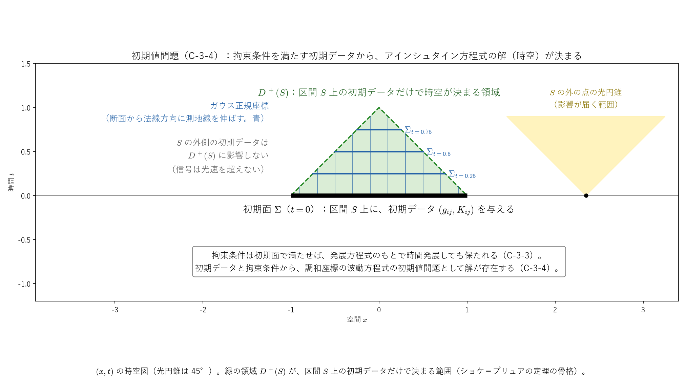

*$(x,t)$ の時空図（光円錐は 45°）。区間 $S$ 上に初期データ $(g_{ij},K_{ij})$ を与えると、緑の領域 $D^+(S)$ が決まる（青の細線はガウス正規座標の法線方向の測地線、太い青線は断面 $\Sigma_t$）。$S$ の外の初期データは、信号が光速を超えないので $D^+(S)$ に影響しない。拘束条件は初期面で満たせば時間発展で保たれる（C-3-3）。*

<a id="C-3-5"></a>

### C-3-5. 使った仮定の一覧

付録Cで仮定として使ったものをまとめます（付録Bの仮定1〜3は、B-0-4の解析学の事実です）。

- **仮定4**：ガウス正規座標が取れること（測地線の存在とガウスの補題）
- **仮定5**：縮約ビアンキ恒等式$\bar\nabla^\mu\bar G_{\mu\nu}=0$（第二ビアンキ恒等式から導かれる。このノートでは未導出）
- **仮定6**：線形で定数項のない発展方程式の解の一意性（偏微分方程式論）
- **仮定7**：調和座標が取れること
- **仮定8**：波動方程式型の方程式の初期値問題の解の存在と一意性（偏微分方程式論）

このほか、付録B-5-3で一般のフロベニウスの定理の十分性を引用しました。また、リーマン曲率テンソルのペア交換対称性と第一ビアンキ恒等式は、付録Cの導出では使っていません（最初の2添字と最後の2添字の反対称性だけで足りています）。

---

<a id="C-sum"></a>

## 付録Cのまとめ

$$
\boxed{
\begin{aligned}
&\text{ガウスの公式：}\bar\nabla_{e_j}e_i=\Gamma^k{}_{ij}e_k+\varepsilon K_{ij}n,\qquad\text{ヴァインガルテンの公式：}\bar\nabla_{e_i}n=-K_i{}^ke_k\\
&\text{ガウス方程式：}\bar R_{pilj}=R_{pilj}-\varepsilon\big(K_{ij}K_{lp}-K_{il}K_{jp}\big)\\
&\text{コダッツィ方程式：}\bar R_{nilj}=D_lK_{ij}-D_jK_{il}\\
&\text{縮約：}\bar G_{nn}=-\tfrac12\varepsilon R+\tfrac12\big[(\operatorname{tr}K)^2-K_{ij}K^{ij}\big],\qquad\bar G_{ni}=D_i(\operatorname{tr}K)-D^jK_{ij}\\
&\text{時空（}\varepsilon=-1\text{）：}R+(\operatorname{tr}K)^2-K_{ij}K^{ij}=16\pi G_{\mathrm N}\mathcal E,\qquad D_i(\operatorname{tr}K)-D^jK_{ij}=8\pi G_{\mathrm N}j_i\\
&\text{検算：ミンコフスキー空間の双曲面（}K_{\mathrm G}=-1/a^2\text{）、一様等方な宇宙（フリードマン方程式）}
\end{aligned}
}
$$
